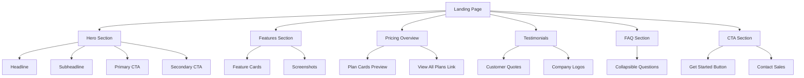
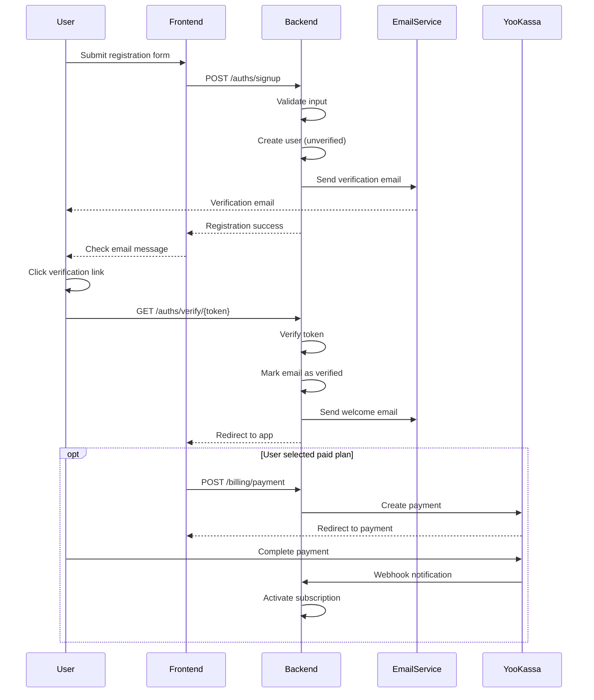
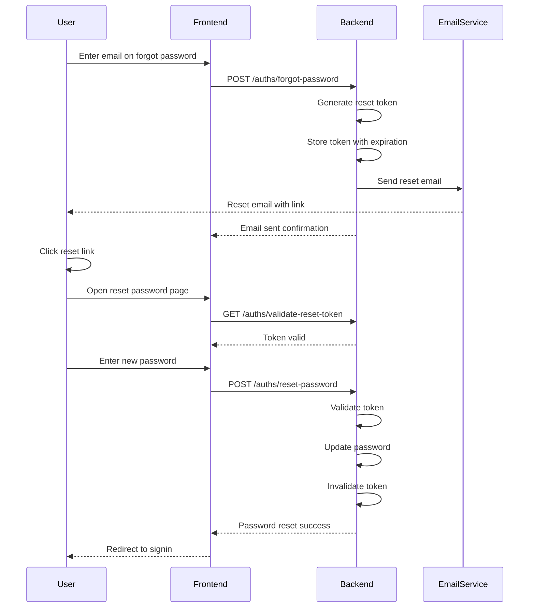
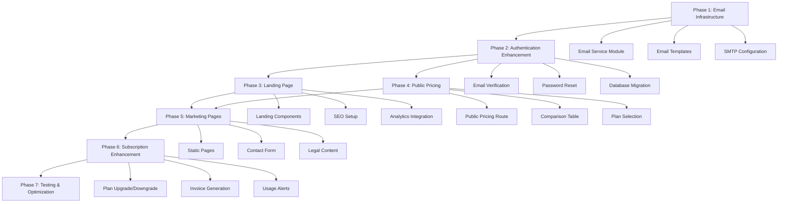

# B2C Service Development Design

## Overview

This document analyzes the current state of the Open WebUI platform for B2C service transformation with YooKassa payment integration. It provides a comprehensive assessment of existing functionality, identifies gaps, and outlines development requirements for a complete consumer-facing service with landing page, registration, pricing pages, and subscription management.

## Current State Analysis

### Existing Billing Infrastructure

The platform has a comprehensive billing system already implemented:

| Component | Status | Description |
|-----------|--------|-------------|
| Payment Gateway Integration | ✅ Complete | YooKassa integration with payment creation, webhook handling, and refunds |
| Database Schema | ✅ Complete | Four tables: billing_plan, billing_subscription, billing_usage, billing_transaction |
| Subscription Management | ✅ Complete | Full CRUD operations for plans and subscriptions |
| Usage Tracking | ✅ Complete | Token and request quota tracking with enforcement |
| Admin Interface | ✅ Complete | Plan management UI at `/admin/billing/plans` |
| User Billing Dashboard | ✅ Complete | Subscription overview at `/billing/dashboard` |
| Pricing Page | ✅ Complete | Plan selection at `/billing/plans` |
| API Endpoints | ✅ Complete | 15+ endpoints for billing operations |
| Webhook Processing | ✅ Complete | Payment event handling with signature verification |
| Audit Logging | ✅ Complete | All billing operations logged |

### Existing Authentication System

| Component | Status | Description |
|-----------|--------|-------------|
| User Registration | ✅ Complete | Email/password signup with validation |
| Authentication | ✅ Complete | JWT-based auth with cookie support |
| OAuth Integration | ✅ Complete | Google, Microsoft, GitHub providers |
| LDAP Support | ✅ Complete | Enterprise authentication |
| Password Reset | ⚠️ Partial | Update password requires current password |
| Session Management | ✅ Complete | Token expiration and refresh |
| Rate Limiting | ✅ Complete | Signin rate limiting implemented |
| Admin Controls | ✅ Complete | Signup enable/disable toggle |

### Existing Frontend Structure

| Component | Status | Description |
|-----------|--------|-------------|
| Auth Page | ✅ Complete | Signin/signup form at `/auth` |
| Main Application | ✅ Complete | Chat interface for authenticated users |
| Billing Dashboard | ✅ Complete | User subscription management |
| Pricing Page | ✅ Complete | Plan selection and purchase |
| Admin Billing UI | ✅ Complete | Plan management interface |

## Gap Analysis

### Critical Missing Components

#### 1. Public Landing Page

**Status:** ❌ Missing

**Current Behavior:**
- Application root redirects authenticated users to `/home` or `/c/{chatId}`
- Unauthenticated users are redirected to `/auth` (signin/signup)
- No marketing or informational page for new visitors

**Required:**
- Public-facing landing page at root path
- Service description and value proposition
- Feature highlights
- Pricing overview with CTA
- Customer testimonials section
- FAQ section
- Call-to-action buttons for registration

**Technical Considerations:**
- Must be accessible without authentication
- Should redirect authenticated users to application
- Responsive design for mobile/desktop
- SEO optimization
- Fast load time with minimal dependencies

#### 2. Enhanced Registration Flow

**Status:** ⚠️ Partial

**Current Behavior:**
- Basic registration with email, password, name
- Immediately creates user account
- No email verification
- No plan selection during signup
- Signup can be disabled by admin

**Required Enhancements:**

| Feature | Priority | Description |
|---------|----------|-------------|
| Email Verification | High | Send verification email before account activation |
| Plan Selection | High | Allow users to choose plan during registration |
| Welcome Email | Medium | Onboarding email after successful registration |
| Terms Acceptance | High | Require TOS and privacy policy acceptance |
| Trial Period | Medium | Optional free trial for paid plans |
| Registration Analytics | Low | Track registration funnel metrics |

#### 3. Password Recovery System

**Status:** ❌ Missing

**Current Behavior:**
- Users can update password only if logged in
- No forgot password flow
- No password reset via email

**Required:**
- Password reset request endpoint
- Secure token generation and validation
- Password reset email template
- Reset link expiration mechanism
- Password reset confirmation page

#### 4. Public Pricing Page Enhancement

**Status:** ⚠️ Needs Enhancement

**Current Behavior:**
- Pricing page exists at `/billing/plans`
- Requires authentication to view
- Basic plan cards with features and quotas
- Subscribe button redirects to payment

**Required Enhancements:**

| Enhancement | Priority | Description |
|------------|----------|-------------|
| Public Access | High | Make pricing visible without login |
| Plan Comparison Table | High | Side-by-side feature comparison |
| FAQ Section | Medium | Common pricing questions |
| Annual/Monthly Toggle | Medium | Switch between billing periods |
| Currency Selection | Low | Support multiple currencies |
| Promotional Banners | Low | Highlight special offers |
| Contact Sales CTA | Medium | For enterprise inquiries |

#### 5. Marketing Content Pages

**Status:** ❌ Missing

**Required Pages:**

| Page | Priority | Purpose |
|------|----------|---------|
| About Us | Medium | Company information and mission |
| Features | High | Detailed feature descriptions |
| Use Cases | Medium | Industry-specific applications |
| Documentation | High | User guides and API docs |
| Blog | Low | Content marketing and updates |
| Contact | Medium | Support and sales contact form |
| Terms of Service | High | Legal terms and conditions |
| Privacy Policy | High | Data privacy information |

#### 6. Subscription Management Enhancement

**Status:** ⚠️ Needs Enhancement

**Current Features:**
- View current subscription
- Cancel subscription
- View usage statistics
- Transaction history

**Required Enhancements:**

| Feature | Priority | Description |
|---------|----------|-------------|
| Plan Upgrade/Downgrade | High | Switch between plans |
| Payment Method Management | High | Update card details |
| Invoice Downloads | Medium | PDF invoice generation |
| Billing History Export | Low | CSV export of transactions |
| Usage Alerts | Medium | Email notifications for quota limits |
| Auto-renewal Settings | Medium | Toggle automatic renewal |

#### 7. SEO and Analytics

**Status:** ❌ Missing

**Required:**

| Component | Priority | Description |
|-----------|----------|-------------|
| Meta Tags | High | Title, description, Open Graph tags |
| Sitemap | Medium | XML sitemap for search engines |
| robots.txt | Medium | Search engine crawling rules |
| Analytics Integration | High | Google Analytics or alternative |
| Conversion Tracking | High | Track signup and payment events |
| Schema.org Markup | Low | Structured data for rich snippets |

## Development Requirements

### Frontend Development

#### Landing Page Components

**Route:** `/` (new public route)

Required Components:



**Component Structure:**

| Component | Location | Description |
|-----------|----------|-------------|
| HeroSection.svelte | `/src/lib/components/landing/` | Main headline and CTA |
| FeaturesGrid.svelte | `/src/lib/components/landing/` | Feature highlights |
| PricingPreview.svelte | `/src/lib/components/landing/` | Top 3 plans preview |
| TestimonialCarousel.svelte | `/src/lib/components/landing/` | Customer testimonials |
| FAQAccordion.svelte | `/src/lib/components/landing/` | Common questions |
| CTABanner.svelte | `/src/lib/components/landing/` | Final call-to-action |
| Footer.svelte | `/src/lib/components/landing/` | Links and copyright |

#### Enhanced Registration Flow

**Route:** `/auth` (modify existing)

Required Changes:

| Change | Type | Description |
|--------|------|-------------|
| Plan Selection Step | New | Add plan chooser before registration |
| Email Verification Notice | New | Show "verify email" message post-signup |
| Terms Checkbox | Modify | Add TOS acceptance checkbox |
| Welcome Flow | New | Post-registration onboarding |
| Error Handling | Enhance | Better validation messages |

**New Components:**

| Component | Purpose |
|-----------|---------|
| PlanSelector.svelte | Choose plan during signup |
| EmailVerificationNotice.svelte | Prompt to check email |
| TermsAcceptance.svelte | TOS checkbox with modal |
| RegistrationStepper.svelte | Multi-step registration flow |

#### Password Recovery

**New Routes:**

| Route | Component | Purpose |
|-------|-----------|---------|
| `/auth/forgot-password` | ForgotPassword.svelte | Request reset link |
| `/auth/reset-password` | ResetPassword.svelte | Set new password |

**Required Components:**

| Component | Description |
|-----------|-------------|
| ForgotPasswordForm.svelte | Email input for reset request |
| ResetPasswordForm.svelte | New password input with validation |
| PasswordResetSuccess.svelte | Confirmation message |

#### Public Pricing Page

**Route:** `/pricing` (new public route)

**Changes to Existing `/billing/plans`:**
- Keep for authenticated users
- Create new public version at `/pricing`
- Remove authentication requirement
- Add comparison table
- Add FAQ section

**New Components:**

| Component | Purpose |
|-----------|---------|
| PlanComparisonTable.svelte | Side-by-side feature comparison |
| BillingPeriodToggle.svelte | Monthly/Annual switcher |
| PricingFAQ.svelte | Pricing-specific questions |
| ContactSalesCTA.svelte | Enterprise inquiry form |

#### Marketing Pages

**New Routes:**

| Route | Component | Content Type |
|-------|-----------|--------------|
| `/about` | About.svelte | Static content |
| `/features` | Features.svelte | Feature showcase |
| `/use-cases` | UseCases.svelte | Industry examples |
| `/docs` | Documentation.svelte | User guides |
| `/contact` | Contact.svelte | Contact form |
| `/terms` | Terms.svelte | Legal terms |
| `/privacy` | Privacy.svelte | Privacy policy |

### Backend Development

#### Email System

**New Module:** `/backend/open_webui/utils/email.py`

Required Functionality:

| Function | Purpose |
|----------|---------|
| send_email() | Generic email sending |
| send_verification_email() | Account verification |
| send_password_reset_email() | Password reset link |
| send_welcome_email() | New user welcome |
| send_invoice_email() | Payment receipts |
| send_quota_alert() | Usage warnings |

**Configuration:**

| Environment Variable | Purpose |
|---------------------|---------|
| SMTP_HOST | Email server hostname |
| SMTP_PORT | Email server port |
| SMTP_USERNAME | SMTP authentication username |
| SMTP_PASSWORD | SMTP authentication password |
| SMTP_FROM_EMAIL | Sender email address |
| SMTP_FROM_NAME | Sender display name |
| EMAIL_VERIFICATION_ENABLED | Toggle email verification |

#### Email Verification System

**New Endpoints:**

| Endpoint | Method | Purpose |
|----------|--------|---------|
| `/api/v1/auths/verify-email` | POST | Send verification email |
| `/api/v1/auths/verify/{token}` | GET | Verify email with token |
| `/api/v1/auths/resend-verification` | POST | Resend verification email |

**Database Changes:**

New fields in `user` table:

| Field | Type | Purpose |
|-------|------|---------|
| email_verified | Boolean | Verification status |
| email_verification_token | String | Current verification token |
| email_verification_sent_at | Timestamp | Last verification email sent |

#### Password Reset System

**New Endpoints:**

| Endpoint | Method | Purpose |
|----------|--------|---------|
| `/api/v1/auths/forgot-password` | POST | Request password reset |
| `/api/v1/auths/reset-password` | POST | Reset password with token |
| `/api/v1/auths/validate-reset-token` | GET | Check token validity |

**Database Changes:**

New fields in `user` table:

| Field | Type | Purpose |
|-------|------|---------|
| password_reset_token | String | Current reset token |
| password_reset_expires_at | Timestamp | Token expiration time |

#### Subscription Management Enhancements

**New Endpoints:**

| Endpoint | Method | Purpose |
|----------|--------|---------|
| `/api/v1/billing/subscription/upgrade` | POST | Upgrade to higher plan |
| `/api/v1/billing/subscription/downgrade` | POST | Downgrade to lower plan |
| `/api/v1/billing/payment-methods` | GET | List payment methods |
| `/api/v1/billing/payment-methods` | POST | Add payment method |
| `/api/v1/billing/payment-methods/{id}` | DELETE | Remove payment method |
| `/api/v1/billing/invoices` | GET | List invoices |
| `/api/v1/billing/invoices/{id}/pdf` | GET | Download invoice PDF |

#### Public API Endpoints

**Modify Existing Endpoints:**

| Endpoint | Change | Purpose |
|----------|--------|---------|
| `/api/v1/billing/plans` | Remove auth requirement | Public pricing access |
| `/api/v1/auths/signup` | Add plan selection | Register with plan |

**New Public Endpoints:**

| Endpoint | Method | Purpose |
|----------|--------|---------|
| `/api/v1/public/features` | GET | List platform features |
| `/api/v1/public/testimonials` | GET | Customer testimonials |
| `/api/v1/public/faq` | GET | Frequently asked questions |
| `/api/v1/contact` | POST | Contact form submission |

### Configuration Changes

#### Environment Variables

**New Required Variables:**

| Variable | Purpose | Example |
|----------|---------|---------|
| PUBLIC_REGISTRATION_ENABLED | Allow public signups | true |
| EMAIL_VERIFICATION_REQUIRED | Force email verification | true |
| DEFAULT_FREE_TRIAL_DAYS | Trial period for paid plans | 14 |
| LANDING_PAGE_ENABLED | Show landing page | true |
| CONTACT_EMAIL | Support email address | support@example.com |
| COMPANY_NAME | Business name | Your Company Inc. |
| TERMS_URL | Terms of service URL | https://example.com/terms |
| PRIVACY_URL | Privacy policy URL | https://example.com/privacy |

#### Application Configuration

**Modify `/backend/open_webui/config.py`:**

Add new configuration fields:

| Field | Type | Purpose |
|-------|------|---------|
| B2C_MODE_ENABLED | Boolean | Enable B2C features |
| LANDING_PAGE_HERO_TITLE | String | Landing page headline |
| LANDING_PAGE_HERO_SUBTITLE | String | Landing page subheadline |
| FEATURED_PLANS | List | Plan IDs to highlight |
| ENABLE_TRIAL_PERIOD | Boolean | Allow free trials |
| MAX_FREE_USERS | Integer | Free tier user limit |

### Database Migrations

**New Migration:** `add_email_verification_and_reset.py`

Required Changes:

| Table | Changes |
|-------|---------|
| user | Add email_verified, email_verification_token, email_verification_sent_at, password_reset_token, password_reset_expires_at |
| billing_plan | Add trial_days, is_featured, max_users fields |
| billing_subscription | Add trial_start, trial_end fields |

**New Tables:**

| Table Name | Purpose |
|------------|---------|
| email_verification_log | Track verification attempts |
| password_reset_log | Track reset attempts |
| contact_submissions | Store contact form data |
| testimonials | Customer testimonials |
| faq_items | FAQ content |
| feature_highlights | Platform features |

## Content Strategy

### Landing Page Content

**Hero Section:**

| Element | Content Type |
|---------|--------------|
| Main Headline | Value proposition statement |
| Subheadline | Brief feature description |
| Primary CTA | "Get Started Free" or "Start Free Trial" |
| Secondary CTA | "View Pricing" or "See Features" |
| Hero Image | Product screenshot or illustration |

**Features Section:**

Minimum 6 feature highlights:
- AI model access
- Usage-based pricing
- Enterprise security
- API integration
- Multi-language support
- 24/7 availability

**Pricing Overview:**

Display top 3 plans:
- Free tier
- Most popular paid tier (highlighted)
- Enterprise tier

**Testimonials:**

Minimum 3-5 customer quotes with:
- Customer name
- Company/role
- Quote text
- Photo (optional)

**FAQ Section:**

Essential questions:
- What is included in the free plan?
- How does billing work?
- Can I upgrade or downgrade?
- What payment methods are accepted?
- Is there a refund policy?
- How secure is my data?

### Email Templates

**Required Templates:**

| Template | Purpose | Trigger |
|----------|---------|---------|
| Verification Email | Confirm email address | User registration |
| Welcome Email | Onboarding message | Email verified |
| Password Reset | Reset password link | Forgot password request |
| Payment Confirmation | Receipt for payment | Successful payment |
| Subscription Activated | Subscription start | First payment |
| Subscription Renewed | Renewal confirmation | Recurring payment |
| Subscription Canceled | Cancellation notice | User cancels |
| Quota Warning | Usage alert | 80% quota reached |
| Quota Exceeded | Limit notification | 100% quota reached |
| Invoice | Monthly invoice | Billing period end |

**Template Variables:**

Common variables for all templates:
- `{{user_name}}`
- `{{user_email}}`
- `{{company_name}}`
- `{{support_email}}`
- `{{current_year}}`
- `{{app_url}}`

### Static Content Pages

**Terms of Service:**

Sections required:
- Acceptance of Terms
- Description of Service
- User Accounts
- Payment and Billing
- Subscription and Cancellation
- Intellectual Property
- User Content
- Privacy
- Disclaimers
- Limitation of Liability
- Governing Law
- Changes to Terms

**Privacy Policy:**

Sections required:
- Information Collection
- Use of Information
- Data Sharing
- Data Security
- User Rights
- Cookies and Tracking
- Third-Party Services
- Children's Privacy
- International Users
- Policy Updates
- Contact Information

## Implementation Strategy

### Phase 1: Foundation (Week 1-2)

**Priority:** High

**Goals:**
- Set up email infrastructure
- Implement email verification
- Create password reset flow
- Update authentication endpoints

**Deliverables:**

| Item | Type |
|------|------|
| Email service module | Backend |
| Email templates | Content |
| Verification endpoints | Backend |
| Password reset endpoints | Backend |
| Database migration | Backend |
| Environment configuration | DevOps |

### Phase 2: Landing Page (Week 2-3)

**Priority:** High

**Goals:**
- Create public landing page
- Implement responsive design
- Add SEO optimization
- Set up analytics

**Deliverables:**

| Item | Type |
|------|------|
| Landing page route | Frontend |
| Hero section component | Frontend |
| Features section component | Frontend |
| Pricing preview component | Frontend |
| Testimonials component | Frontend |
| FAQ component | Frontend |
| Footer component | Frontend |
| Meta tags and SEO | Frontend |

### Phase 3: Enhanced Registration (Week 3-4)

**Priority:** High

**Goals:**
- Add plan selection to signup
- Implement multi-step registration
- Create welcome flow
- Add terms acceptance

**Deliverables:**

| Item | Type |
|------|------|
| Enhanced signup form | Frontend |
| Plan selector component | Frontend |
| Registration stepper | Frontend |
| Terms acceptance | Frontend |
| Modified signup endpoint | Backend |
| Welcome email template | Content |

### Phase 4: Public Pricing Page (Week 4-5)

**Priority:** High

**Goals:**
- Create public pricing route
- Add comparison table
- Implement billing toggle
- Add pricing FAQ

**Deliverables:**

| Item | Type |
|------|------|
| Public pricing route | Frontend |
| Comparison table component | Frontend |
| Billing period toggle | Frontend |
| Pricing FAQ component | Frontend |
| Public plans endpoint | Backend |

### Phase 5: Marketing Pages (Week 5-6)

**Priority:** Medium

**Goals:**
- Create static content pages
- Write terms and privacy policy
- Add about and features pages
- Implement contact form

**Deliverables:**

| Item | Type |
|------|------|
| About page | Frontend |
| Features page | Frontend |
| Terms of service | Content |
| Privacy policy | Content |
| Contact form | Frontend |
| Contact submission endpoint | Backend |

### Phase 6: Subscription Enhancements (Week 6-7)

**Priority:** Medium

**Goals:**
- Add plan upgrade/downgrade
- Implement invoice downloads
- Add usage alerts
- Payment method management

**Deliverables:**

| Item | Type |
|------|------|
| Upgrade/downgrade endpoints | Backend |
| Invoice PDF generation | Backend |
| Usage alert system | Backend |
| Payment method UI | Frontend |
| Enhanced billing dashboard | Frontend |

### Phase 7: Polish and Testing (Week 7-8)

**Priority:** High

**Goals:**
- End-to-end testing
- Performance optimization
- SEO verification
- Content review

**Deliverables:**

| Item | Type |
|------|------|
| Test suite | Testing |
| Performance audit | Testing |
| SEO audit | Testing |
| Content review | Content |
| Bug fixes | Development |

## Technical Specifications

### Email Service Architecture

**Service Interface:**

The email service provides a unified interface for sending transactional emails with template support, retry logic, and delivery tracking.

**Key Responsibilities:**
- Template rendering with variable substitution
- SMTP connection management
- Retry logic for failed sends
- Email queuing for high volume
- Delivery status tracking

**Integration Points:**
- Authentication system for verification and reset emails
- Billing system for payment and invoice emails
- Usage tracking for quota alerts

### Authentication Flow Modifications

**Enhanced Registration Process:**



**Password Reset Flow:**



### Public Access Control

**Route Protection Strategy:**

| Route Pattern | Access Level | Redirect Behavior |
|---------------|-------------|-------------------|
| `/` | Public | Authenticated → `/home` |
| `/pricing` | Public | No redirect |
| `/features` | Public | No redirect |
| `/about` | Public | No redirect |
| `/auth` | Public | Authenticated → `/home` |
| `/auth/forgot-password` | Public | Authenticated → `/home` |
| `/auth/reset-password` | Public | Authenticated → `/home` |
| `/home` | Authenticated | Unauthenticated → `/auth` |
| `/c/*` | Authenticated | Unauthenticated → `/auth` |
| `/billing/dashboard` | Authenticated | Unauthenticated → `/auth` |
| `/admin/*` | Admin | Non-admin → `/home` |

### SEO Implementation

**Meta Tag Strategy:**

Each public page must include:
- Unique title tag (50-60 characters)
- Meta description (150-160 characters)
- Open Graph tags for social sharing
- Twitter Card tags
- Canonical URL
- Language tags

**Sitemap Structure:**

| URL | Priority | Change Frequency |
|-----|----------|------------------|
| `/` | 1.0 | weekly |
| `/pricing` | 0.9 | weekly |
| `/features` | 0.8 | monthly |
| `/about` | 0.6 | monthly |
| `/docs` | 0.7 | weekly |
| `/terms` | 0.4 | yearly |
| `/privacy` | 0.4 | yearly |

**robots.txt Rules:**

Allow all public pages, disallow authenticated areas:
- Allow: `/`
- Allow: `/pricing`
- Allow: `/features`
- Allow: `/about`
- Allow: `/contact`
- Disallow: `/home`
- Disallow: `/c/`
- Disallow: `/admin/`
- Disallow: `/billing/`

### Analytics Integration

**Event Tracking:**

| Event Category | Event Name | Triggered When |
|----------------|-----------|----------------|
| Registration | signup_started | User opens signup form |
| Registration | signup_completed | User submits registration |
| Registration | email_verified | User verifies email |
| Conversion | plan_selected | User chooses paid plan |
| Conversion | payment_initiated | User starts payment |
| Conversion | payment_completed | Payment succeeds |
| Engagement | pricing_viewed | User views pricing page |
| Engagement | feature_viewed | User views features |
| Support | contact_submitted | User submits contact form |

**User Properties:**

Track for each user:
- Registration date
- Email verification status
- Selected plan
- Payment status
- Subscription status
- Last login date

## Risk Assessment

### Technical Risks

| Risk | Probability | Impact | Mitigation |
|------|------------|--------|------------|
| Email delivery failures | Medium | High | Implement retry logic, use reliable SMTP provider, fallback to alternative provider |
| Payment webhook failures | Low | High | Implement webhook retry, manual reconciliation process, monitoring alerts |
| High registration volume | Medium | Medium | Implement rate limiting, queue system, horizontal scaling |
| SEO penalties | Low | Medium | Follow best practices, avoid duplicate content, proper redirects |
| Session management issues | Low | High | Comprehensive testing, proper token validation, secure cookie settings |

### Business Risks

| Risk | Probability | Impact | Mitigation |
|------|------------|--------|------------|
| Fraudulent signups | Medium | Medium | Email verification, payment verification, rate limiting |
| Payment fraud | Low | High | YooKassa fraud detection, manual review for high amounts |
| Chargebacks | Low | Medium | Clear refund policy, usage limits, automated subscription cancellation |
| Content compliance | Low | High | Legal review of TOS and privacy policy, GDPR compliance |
| Customer support overload | Medium | Medium | Comprehensive FAQ, documentation, automated responses |

### Operational Risks

| Risk | Probability | Impact | Mitigation |
|------|------------|--------|------------|
| Email server downtime | Low | Medium | Multiple SMTP providers, monitoring, failover |
| Database migration failures | Low | High | Backup before migration, rollback plan, staging environment testing |
| Configuration errors | Medium | Medium | Environment validation, configuration management, peer review |
| Third-party service outages | Low | High | YooKassa status monitoring, graceful degradation, status page |

## Success Metrics

### Key Performance Indicators

**Registration Funnel:**

| Metric | Target | Measurement Period |
|--------|--------|-------------------|
| Landing page visitors | Track | Daily |
| Signup conversion rate | >5% | Weekly |
| Email verification rate | >90% | Weekly |
| Paid plan selection rate | >10% | Weekly |
| Payment completion rate | >80% | Weekly |

**Revenue Metrics:**

| Metric | Target | Measurement Period |
|--------|--------|-------------------|
| Monthly Recurring Revenue (MRR) | Track | Monthly |
| Average Revenue Per User (ARPU) | Track | Monthly |
| Customer Lifetime Value (CLV) | Track | Quarterly |
| Churn rate | <5% | Monthly |
| Upgrade rate | >15% | Monthly |

**Engagement Metrics:**

| Metric | Target | Measurement Period |
|--------|--------|-------------------|
| Daily Active Users (DAU) | Track | Daily |
| Weekly Active Users (WAU) | Track | Weekly |
| Session duration | >5 min | Weekly |
| Feature adoption rate | >50% | Monthly |
| Support ticket volume | <10/day | Weekly |

**Technical Metrics:**

| Metric | Target | Measurement Period |
|--------|--------|-------------------|
| Page load time | <2s | Daily |
| API response time | <500ms | Daily |
| Email delivery rate | >95% | Daily |
| Webhook success rate | >99% | Daily |
| System uptime | >99.9% | Monthly |

## Maintenance and Support

### Content Updates

**Regular Updates Required:**

| Content Type | Update Frequency | Owner |
|--------------|------------------|-------|
| Pricing plans | As needed | Product team |
| Feature descriptions | Monthly | Marketing team |
| FAQ content | Weekly | Support team |
| Blog posts | Weekly | Content team |
| Testimonials | Quarterly | Marketing team |
| Legal documents | Annually | Legal team |

### Monitoring Requirements

**System Monitoring:**

| Component | Metrics | Alert Threshold |
|-----------|---------|----------------|
| Email service | Delivery rate, queue size | <90% delivery, >1000 queued |
| Payment gateway | Success rate, response time | <95% success, >3s response |
| Database | Connection pool, query time | >80% pool usage, >1s queries |
| API endpoints | Error rate, latency | >5% errors, >1s p95 |
| Registration flow | Completion rate | <50% completion |

### Backup and Recovery

**Backup Strategy:**

| Data Type | Backup Frequency | Retention Period |
|-----------|------------------|------------------|
| User database | Hourly | 30 days |
| Billing data | Daily | 7 years |
| Email logs | Daily | 90 days |
| Configuration | On change | 90 days |
| Static content | Weekly | 30 days |

**Recovery Procedures:**

| Scenario | Recovery Time Objective | Recovery Point Objective |
|----------|------------------------|-------------------------|
| Database corruption | <1 hour | <1 hour |
| Email service failure | <30 minutes | Real-time |
| Payment gateway issue | <2 hours | Real-time |
| Configuration error | <15 minutes | On change |

## Compliance and Legal

### Data Protection

**GDPR Requirements:**

| Requirement | Implementation |
|-------------|----------------|
| Right to access | User data export endpoint |
| Right to erasure | Account deletion with data purge |
| Right to portability | JSON export of user data |
| Privacy by design | Minimal data collection, encrypted storage |
| Consent management | Explicit consent for marketing emails |
| Data breach notification | Automated alert system, 72-hour notification |

**PCI Compliance:**

| Requirement | Implementation |
|-------------|----------------|
| Secure payment processing | YooKassa handles card data (no PCI scope) |
| No card data storage | Payment tokens only |
| Secure transmission | HTTPS for all payment pages |
| Access logging | Audit trail for payment operations |

### Terms and Conditions

**Required Clauses:**

- User obligations and prohibited uses
- Intellectual property rights
- Subscription terms and billing
- Refund and cancellation policy
- Service availability and support
- Limitation of liability
- Dispute resolution
- Governing law and jurisdiction

### Privacy Policy

**Required Disclosures:**

- Types of data collected
- Purpose of data collection
- Data sharing with third parties (YooKassa)
- Data retention periods
- Security measures
- User rights and choices
- Cookie usage
- Contact information for privacy inquiries

## Deployment Plan

### Pre-Deployment Checklist

**Environment Setup:**

- [ ] Configure SMTP credentials
- [ ] Set up email templates
- [ ] Configure YooKassa production credentials
- [ ] Set environment variables
- [ ] Create initial pricing plans
- [ ] Upload static content
- [ ] Configure DNS records
- [ ] Set up SSL certificates
- [ ] Configure analytics tracking
- [ ] Set up monitoring alerts

**Testing:**

- [ ] Email delivery testing (all templates)
- [ ] Registration flow end-to-end
- [ ] Password reset flow
- [ ] Payment flow with test cards
- [ ] Webhook testing with YooKassa
- [ ] Mobile responsiveness testing
- [ ] Cross-browser compatibility
- [ ] Performance testing
- [ ] SEO validation
- [ ] Security audit

**Content:**

- [ ] Legal review of TOS and privacy policy
- [ ] Proofread all marketing content
- [ ] Validate pricing information
- [ ] Test all CTAs and links
- [ ] Verify contact information
- [ ] Test email template rendering
- [ ] Review FAQ completeness

### Deployment Sequence

**Step 1: Database Migration**
- Back up production database
- Apply migration for email verification and password reset
- Verify migration success
- Test database queries

**Step 2: Backend Deployment**
- Deploy new backend code
- Restart application servers
- Verify API endpoints
- Test email service connection

**Step 3: Frontend Deployment**
- Build production frontend bundle
- Deploy static assets to CDN
- Update frontend application
- Verify routing
- Test public pages

**Step 4: Configuration**
- Update environment variables
- Enable B2C mode
- Configure email service
- Set up monitoring

**Step 5: Validation**
- Run smoke tests
- Verify critical user flows
- Check analytics integration
- Monitor error logs

### Post-Deployment

**Immediate Actions:**

- Monitor system metrics for 24 hours
- Review error logs
- Test user registration
- Verify email delivery
- Check payment processing

**Week 1:**

- Analyze registration conversion rates
- Review customer feedback
- Monitor support tickets
- Optimize performance issues
- A/B test landing page variations

**Month 1:**

- Analyze revenue metrics
- Review churn rate
- Evaluate feature adoption
- Gather customer testimonials
- Plan feature iterations

## Detailed Implementation Plan

### Task Breakdown and Dependencies



### Phase 1: Email Infrastructure (Days 1-3)

#### Task 1.1: Email Service Module

**File:** `/backend/open_webui/utils/email.py`

**Purpose:** Create unified email sending service with template support

**Requirements:**
- SMTP connection pooling
- Template rendering with Jinja2
- HTML and plain text support
- Retry logic with exponential backoff
- Email queue for high volume
- Delivery tracking

**Configuration:**
```python
class EmailConfig:
    smtp_host: str
    smtp_port: int
    smtp_username: str
    smtp_password: str
    smtp_use_tls: bool = True
    from_email: str
    from_name: str
    max_retries: int = 3
    retry_delay: int = 5
```

**Core Methods:**
```python
async def send_email(
    to: str,
    subject: str,
    html_body: str,
    text_body: Optional[str] = None,
    reply_to: Optional[str] = None
) -> bool

async def send_template_email(
    to: str,
    template_name: str,
    context: Dict[str, Any],
    subject: Optional[str] = None
) -> bool

async def send_verification_email(user: UserModel, token: str) -> bool
async def send_password_reset_email(user: UserModel, token: str) -> bool
async def send_welcome_email(user: UserModel) -> bool
async def send_payment_confirmation(user: UserModel, transaction: TransactionModel) -> bool
```

**Dependencies:**
- aiosmtplib (async SMTP client)
- jinja2 (template engine)
- premailer (inline CSS for emails)

**Testing:**
- Unit tests for each email type
- Integration test with test SMTP server (Mailhog or Mailtrap)
- Template rendering validation
- Error handling verification

#### Task 1.2: Email Templates

**Location:** `/backend/open_webui/templates/emails/`

**Required Templates:**

| Template File | Subject | Variables |
|---------------|---------|----------|
| `verification.html` | Verify your email address | user_name, verification_url, expiry_hours |
| `verification.txt` | (plain text) | Same as above |
| `password_reset.html` | Reset your password | user_name, reset_url, expiry_hours |
| `password_reset.txt` | (plain text) | Same as above |
| `welcome.html` | Welcome to {service} | user_name, app_url, plan_name |
| `welcome.txt` | (plain text) | Same as above |
| `payment_confirmation.html` | Payment received | user_name, amount, currency, plan_name, receipt_url |
| `payment_confirmation.txt` | (plain text) | Same as above |
| `subscription_activated.html` | Subscription activated | user_name, plan_name, period_end, features |
| `quota_warning.html` | Usage warning | user_name, metric, current_usage, limit, percentage |
| `quota_exceeded.html` | Quota exceeded | user_name, metric, limit |

**Template Structure:**
```html
<!DOCTYPE html>
<html>
<head>
    <meta charset="UTF-8">
    <meta name="viewport" content="width=device-width, initial-scale=1.0">
    <title>{{ subject }}</title>
    <style>
        /* Responsive email styles */
    </style>
</head>
<body>
    <table role="presentation" style="width:100%;max-width:600px;margin:0 auto;">
        <!-- Email header with logo -->
        <tr>
            <td style="padding:40px 20px;text-align:center;">
                
            </td>
        </tr>
        
        <!-- Email content -->
        <tr>
            <td style="padding:20px;">
                
            </td>
        </tr>
        
        <!-- Email footer -->
        <tr>
            <td style="padding:20px;text-align:center;color:#666;font-size:12px;">
                <p>{{ company_name }} &copy; {{ current_year }}</p>
                <p>
                    <a href="{{ app_url }}">Home</a> |
                    <a href="{{ support_url }}">Support</a> |
                    <a href="{{ privacy_url }}">Privacy</a>
                </p>
            </td>
        </tr>
    </table>
</body>
</html>
```

**Design Guidelines:**
- Mobile-responsive (single column layout)
- Inline CSS (for email client compatibility)
- Maximum width 600px
- Clear call-to-action buttons
- Plain text fallback
- Brand colors and typography

#### Task 1.3: Environment Configuration

**File:** `/backend/open_webui/env.py`

**Add Variables:**
```python
# Email Configuration
SMTP_HOST = os.environ.get("SMTP_HOST", "localhost")
SMTP_PORT = int(os.environ.get("SMTP_PORT", "587"))
SMTP_USERNAME = os.environ.get("SMTP_USERNAME", "")
SMTP_PASSWORD = os.environ.get("SMTP_PASSWORD", "")
SMTP_USE_TLS = os.environ.get("SMTP_USE_TLS", "True").lower() == "true"
SMTP_FROM_EMAIL = os.environ.get("SMTP_FROM_EMAIL", "noreply@example.com")
SMTP_FROM_NAME = os.environ.get("SMTP_FROM_NAME", "Open WebUI")

# Email Features
EMAIL_VERIFICATION_ENABLED = os.environ.get("EMAIL_VERIFICATION_ENABLED", "True").lower() == "true"
EMAIL_VERIFICATION_TOKEN_EXPIRY = int(os.environ.get("EMAIL_VERIFICATION_TOKEN_EXPIRY", "86400"))  # 24 hours
PASSWORD_RESET_TOKEN_EXPIRY = int(os.environ.get("PASSWORD_RESET_TOKEN_EXPIRY", "3600"))  # 1 hour
```

**Update `.env.example`:**
```bash
####################################
# Email Configuration
####################################
SMTP_HOST=smtp.gmail.com
SMTP_PORT=587
SMTP_USERNAME=your-email@gmail.com
SMTP_PASSWORD=your-app-password
SMTP_USE_TLS=true
SMTP_FROM_EMAIL=noreply@yourdomain.com
SMTP_FROM_NAME=Your Service Name

EMAIL_VERIFICATION_ENABLED=true
EMAIL_VERIFICATION_TOKEN_EXPIRY=86400
PASSWORD_RESET_TOKEN_EXPIRY=3600
```

### Phase 2: Authentication Enhancement (Days 4-6)

#### Task 2.1: Database Migration

**File:** `/backend/open_webui/internal/migrations/add_email_verification_and_reset.py`

**Migration Changes:**

```python
def upgrade():
    # Add email verification fields to user table
    op.add_column('user', sa.Column('email_verified', sa.Boolean(), default=False, nullable=False))
    op.add_column('user', sa.Column('email_verification_token', sa.String(255), nullable=True))
    op.add_column('user', sa.Column('email_verification_sent_at', sa.BigInteger(), nullable=True))
    
    # Add password reset fields
    op.add_column('user', sa.Column('password_reset_token', sa.String(255), nullable=True))
    op.add_column('user', sa.Column('password_reset_expires_at', sa.BigInteger(), nullable=True))
    
    # Add indexes for performance
    op.create_index('idx_user_email_verified', 'user', ['email_verified'])
    op.create_index('idx_user_verification_token', 'user', ['email_verification_token'])
    op.create_index('idx_user_reset_token', 'user', ['password_reset_token'])
    
    # Set existing users as verified
    op.execute("UPDATE user SET email_verified = true WHERE email_verified IS NULL")
```

**Update User Model:**

**File:** `/backend/open_webui/models/users.py`

```python
class User(Base):
    # ... existing fields ...
    
    # Email verification
    email_verified = Column(Boolean, default=False, nullable=False)
    email_verification_token = Column(String, nullable=True)
    email_verification_sent_at = Column(BigInteger, nullable=True)
    
    # Password reset
    password_reset_token = Column(String, nullable=True)
    password_reset_expires_at = Column(BigInteger, nullable=True)


class UserModel(BaseModel):
    # ... existing fields ...
    
    email_verified: bool = False
    email_verification_token: Optional[str] = None
    email_verification_sent_at: Optional[int] = None
    password_reset_token: Optional[str] = None
    password_reset_expires_at: Optional[int] = None
```

#### Task 2.2: Email Verification Implementation

**File:** `/backend/open_webui/routers/auths.py`

**New Endpoints:**

```python
# Request email verification
@router.post("/verify-email/request")
async def request_email_verification(
    user=Depends(get_verified_user)
):
    """
    Send email verification link to user
    """
    if user.email_verified:
        raise HTTPException(
            status_code=status.HTTP_400_BAD_REQUEST,
            detail="Email already verified"
        )
    
    # Check rate limit (max 3 per hour)
    if user.email_verification_sent_at:
        last_sent = user.email_verification_sent_at
        if int(time.time()) - last_sent < 1200:  # 20 minutes
            raise HTTPException(
                status_code=status.HTTP_429_TOO_MANY_REQUESTS,
                detail="Please wait before requesting another verification email"
            )
    
    # Generate verification token
    token = secrets.token_urlsafe(32)
    
    # Update user
    Users.update_user_by_id(user.id, {
        "email_verification_token": token,
        "email_verification_sent_at": int(time.time())
    })
    
    # Send email
    await send_verification_email(user, token)
    
    return {"message": "Verification email sent"}


# Verify email with token
@router.get("/verify-email/{token}")
async def verify_email(token: str):
    """
    Verify email address with token
    """
    # Find user by token
    user = Users.get_user_by_verification_token(token)
    if not user:
        raise HTTPException(
            status_code=status.HTTP_404_NOT_FOUND,
            detail="Invalid or expired verification token"
        )
    
    # Check token expiry (24 hours)
    if user.email_verification_sent_at:
        sent_at = user.email_verification_sent_at
        if int(time.time()) - sent_at > EMAIL_VERIFICATION_TOKEN_EXPIRY:
            raise HTTPException(
                status_code=status.HTTP_400_BAD_REQUEST,
                detail="Verification token expired"
            )
    
    # Mark as verified
    Users.update_user_by_id(user.id, {
        "email_verified": True,
        "email_verification_token": None,
        "email_verification_sent_at": None
    })
    
    # Send welcome email
    await send_welcome_email(user)
    
    # Redirect to app
    return RedirectResponse(url="/home?verified=true")
```

**Modify Signup Endpoint:**

```python
@router.post("/signup", response_model=SessionUserResponse)
async def signup(request: Request, response: Response, form_data: SignupForm):
    # ... existing validation ...
    
    # Create user
    user = Auths.insert_new_auth(
        form_data.email.lower(),
        hashed,
        form_data.name,
        form_data.profile_image_url,
        role,
    )
    
    if user:
        # Generate verification token if enabled
        if EMAIL_VERIFICATION_ENABLED:
            token = secrets.token_urlsafe(32)
            Users.update_user_by_id(user.id, {
                "email_verification_token": token,
                "email_verification_sent_at": int(time.time())
            })
            
            # Send verification email
            await send_verification_email(user, token)
        else:
            # Mark as verified if verification disabled
            Users.update_user_by_id(user.id, {
                "email_verified": True
            })
        
        # ... rest of existing code ...
```

#### Task 2.3: Password Reset Implementation

**File:** `/backend/open_webui/routers/auths.py`

**New Endpoints:**

```python
class ForgotPasswordForm(BaseModel):
    email: str


class ResetPasswordForm(BaseModel):
    token: str
    new_password: str


@router.post("/forgot-password")
async def forgot_password(form_data: ForgotPasswordForm):
    """
    Request password reset email
    """
    user = Users.get_user_by_email(form_data.email.lower())
    
    # Always return success to prevent email enumeration
    if not user:
        await asyncio.sleep(1)  # Timing attack prevention
        return {"message": "If the email exists, a reset link has been sent"}
    
    # Generate reset token
    token = secrets.token_urlsafe(32)
    expires_at = int(time.time()) + PASSWORD_RESET_TOKEN_EXPIRY
    
    # Update user
    Users.update_user_by_id(user.id, {
        "password_reset_token": token,
        "password_reset_expires_at": expires_at
    })
    
    # Send reset email
    await send_password_reset_email(user, token)
    
    return {"message": "If the email exists, a reset link has been sent"}


@router.get("/validate-reset-token/{token}")
async def validate_reset_token(token: str):
    """
    Validate password reset token
    """
    user = Users.get_user_by_reset_token(token)
    
    if not user:
        raise HTTPException(
            status_code=status.HTTP_404_NOT_FOUND,
            detail="Invalid reset token"
        )
    
    # Check expiry
    if user.password_reset_expires_at < int(time.time()):
        raise HTTPException(
            status_code=status.HTTP_400_BAD_REQUEST,
            detail="Reset token expired"
        )
    
    return {"valid": True, "email": user.email}


@router.post("/reset-password")
async def reset_password(form_data: ResetPasswordForm):
    """
    Reset password with token
    """
    user = Users.get_user_by_reset_token(form_data.token)
    
    if not user:
        raise HTTPException(
            status_code=status.HTTP_404_NOT_FOUND,
            detail="Invalid reset token"
        )
    
    # Check expiry
    if user.password_reset_expires_at < int(time.time()):
        raise HTTPException(
            status_code=status.HTTP_400_BAD_REQUEST,
            detail="Reset token expired"
        )
    
    # Validate new password
    try:
        validate_password(form_data.new_password)
    except Exception as e:
        raise HTTPException(400, detail=str(e))
    
    # Update password
    hashed = get_password_hash(form_data.new_password)
    Auths.update_user_password_by_id(user.id, hashed)
    
    # Clear reset token
    Users.update_user_by_id(user.id, {
        "password_reset_token": None,
        "password_reset_expires_at": None
    })
    
    return {"message": "Password reset successful"}
```

**Add User Lookup Methods:**

**File:** `/backend/open_webui/models/users.py`

```python
class UsersTable:
    # ... existing methods ...
    
    def get_user_by_verification_token(self, token: str) -> Optional[UserModel]:
        with get_db() as db:
            user = db.query(User).filter(
                User.email_verification_token == token
            ).first()
            return UserModel.model_validate(user) if user else None
    
    def get_user_by_reset_token(self, token: str) -> Optional[UserModel]:
        with get_db() as db:
            user = db.query(User).filter(
                User.password_reset_token == token
            ).first()
            return UserModel.model_validate(user) if user else None
```

### Phase 3: Landing Page (Days 7-10)

#### Task 3.1: Landing Page Route

**File:** `/src/routes/+page.svelte`

**Purpose:** Public landing page that redirects authenticated users

```svelte
<script lang="ts">
	import { onMount } from 'svelte';
	import { goto } from '$app/navigation';
	import { user } from '$lib/stores';
	
	import HeroSection from '$lib/components/landing/HeroSection.svelte';
	import FeaturesSection from '$lib/components/landing/FeaturesSection.svelte';
	import PricingPreview from '$lib/components/landing/PricingPreview.svelte';
	import Testimonials from '$lib/components/landing/Testimonials.svelte';
	import FAQ from '$lib/components/landing/FAQ.svelte';
	import CTASection from '$lib/components/landing/CTASection.svelte';
	import LandingFooter from '$lib/components/landing/Footer.svelte';
	
	onMount(() => {
		// Redirect authenticated users to app
		if ($user) {
			goto('/home');
		}
	});
</script>

<svelte:head>
	<title>AI-Powered Chat Platform | Your Company</title>
	<meta name="description" content="Access powerful AI models through our intuitive chat interface. Choose from flexible pricing plans that fit your needs." />
	<meta property="og:title" content="AI-Powered Chat Platform" />
	<meta property="og:description" content="Access powerful AI models through our intuitive chat interface." />
	<meta property="og:type" content="website" />
	<meta name="twitter:card" content="summary_large_image" />
</svelte:head>

<div class="min-h-screen bg-white dark:bg-gray-950">
	<!-- Navigation Bar -->
	<nav class="fixed top-0 left-0 right-0 z-50 bg-white/80 dark:bg-gray-950/80 backdrop-blur-lg border-b border-gray-200 dark:border-gray-800">
		<div class="max-w-7xl mx-auto px-4 sm:px-6 lg:px-8">
			<div class="flex justify-between items-center h-16">
				<div class="flex items-center gap-2">
					
					<span class="text-xl font-bold">Your Service</span>
				</div>
				
				<div class="hidden md:flex items-center gap-6">
					<a href="/pricing" class="text-gray-600 dark:text-gray-300 hover:text-gray-900 dark:hover:text-white">Pricing</a>
					<a href="/features" class="text-gray-600 dark:text-gray-300 hover:text-gray-900 dark:hover:text-white">Features</a>
					<a href="/docs" class="text-gray-600 dark:text-gray-300 hover:text-gray-900 dark:hover:text-white">Docs</a>
					<a href="/auth" class="text-gray-600 dark:text-gray-300 hover:text-gray-900 dark:hover:text-white">Sign In</a>
					<a href="/auth?mode=signup" class="px-4 py-2 bg-black dark:bg-white text-white dark:text-black rounded-lg font-medium hover:opacity-90 transition">Get Started</a>
				</div>
			</div>
		</div>
	</nav>
	
	<!-- Main Content -->
	<main class="pt-16">
		<HeroSection />
		<FeaturesSection />
		<PricingPreview />
		<Testimonials />
		<FAQ />
		<CTASection />
	</main>
	
	<LandingFooter />
</div>
```

#### Task 3.2: Landing Page Components

**File:** `/src/lib/components/landing/HeroSection.svelte`

```svelte
<script lang="ts">
	import { goto } from '$app/navigation';
</script>

<section class="relative overflow-hidden bg-gradient-to-b from-white to-gray-50 dark:from-gray-950 dark:to-gray-900">
	<div class="max-w-7xl mx-auto px-4 sm:px-6 lg:px-8 py-24 sm:py-32">
		<div class="grid grid-cols-1 lg:grid-cols-2 gap-12 items-center">
			<!-- Left Column: Text Content -->
			<div class="text-center lg:text-left">
				<h1 class="text-5xl sm:text-6xl lg:text-7xl font-bold tracking-tight mb-6">
					<span class="block text-gray-900 dark:text-white">AI-Powered</span>
					<span class="block text-transparent bg-clip-text bg-gradient-to-r from-blue-600 to-purple-600">Chat Platform</span>
				</h1>
				
				<p class="text-xl sm:text-2xl text-gray-600 dark:text-gray-300 mb-8 max-w-2xl">
					Access powerful AI models through our intuitive chat interface. 
					Get started in minutes with flexible pricing that scales with you.
				</p>
				
				<div class="flex flex-col sm:flex-row gap-4 justify-center lg:justify-start">
					<button
						on:click={() => goto('/auth?mode=signup')}
						class="px-8 py-4 bg-black dark:bg-white text-white dark:text-black rounded-xl text-lg font-semibold hover:opacity-90 transition shadow-lg"
					>
						Start Free Trial
					</button>
					
					<button
						on:click={() => goto('/pricing')}
						class="px-8 py-4 bg-white dark:bg-gray-800 text-gray-900 dark:text-white rounded-xl text-lg font-semibold hover:bg-gray-50 dark:hover:bg-gray-700 transition border border-gray-200 dark:border-gray-700"
					>
						View Pricing
					</button>
				</div>
				
				<!-- Trust Badges -->
				<div class="mt-12 flex flex-wrap gap-6 justify-center lg:justify-start items-center">
					<div class="flex items-center gap-2 text-sm text-gray-600 dark:text-gray-400">
						<svg class="w-5 h-5 text-green-600" fill="currentColor" viewBox="0 0 20 20">
							<path fill-rule="evenodd" d="M10 18a8 8 0 100-16 8 8 0 000 16zm3.707-9.293a1 1 0 00-1.414-1.414L9 10.586 7.707 9.293a1 1 0 00-1.414 1.414l2 2a1 1 0 001.414 0l4-4z" clip-rule="evenodd" />
						</svg>
						<span>No credit card required</span>
					</div>
					
					<div class="flex items-center gap-2 text-sm text-gray-600 dark:text-gray-400">
						<svg class="w-5 h-5 text-green-600" fill="currentColor" viewBox="0 0 20 20">
							<path fill-rule="evenodd" d="M10 18a8 8 0 100-16 8 8 0 000 16zm3.707-9.293a1 1 0 00-1.414-1.414L9 10.586 7.707 9.293a1 1 0 00-1.414 1.414l2 2a1 1 0 001.414 0l4-4z" clip-rule="evenodd" />
						</svg>
						<span>14-day free trial</span>
					</div>
					
					<div class="flex items-center gap-2 text-sm text-gray-600 dark:text-gray-400">
						<svg class="w-5 h-5 text-green-600" fill="currentColor" viewBox="0 0 20 20">
							<path fill-rule="evenodd" d="M10 18a8 8 0 100-16 8 8 0 000 16zm3.707-9.293a1 1 0 00-1.414-1.414L9 10.586 7.707 9.293a1 1 0 00-1.414 1.414l2 2a1 1 0 001.414 0l4-4z" clip-rule="evenodd" />
						</svg>
						<span>Cancel anytime</span>
					</div>
				</div>
			</div>
			
			<!-- Right Column: Screenshot/Demo -->
			<div class="relative">
				<div class="relative z-10 rounded-2xl shadow-2xl overflow-hidden border border-gray-200 dark:border-gray-800">
					
				</div>
				
				<!-- Decorative blur effect -->
				<div class="absolute -top-4 -right-4 w-72 h-72 bg-purple-500 rounded-full mix-blend-multiply filter blur-3xl opacity-20 animate-pulse"></div>
				<div class="absolute -bottom-4 -left-4 w-72 h-72 bg-blue-500 rounded-full mix-blend-multiply filter blur-3xl opacity-20 animate-pulse" style="animation-delay: 2s"></div>
			</div>
		</div>
	</div>
</section>
```

**File:** `/src/lib/components/landing/FeaturesSection.svelte`

```svelte
<script lang="ts">
	const features = [
		{
			id: 1,
			icon: '🤖',
			title: 'Multiple AI Models',
			description: 'Access GPT-4, Claude, and other leading AI models from a single interface'
		},
		{
			id: 2,
			icon: '⚡',
			title: 'Real-time Responses',
			description: 'Get instant streaming responses with our optimized infrastructure'
		},
		{
			id: 3,
			icon: '📊',
			title: 'Usage Analytics',
			description: 'Track your token usage and costs with detailed analytics dashboard'
		},
		{
			id: 4,
			icon: '🔒',
			title: 'Enterprise Security',
			description: 'Bank-level encryption and compliance with SOC 2, GDPR, and HIPAA'
		},
		{
			id: 5,
			icon: '🔌',
			title: 'API Access',
			description: 'Integrate with your applications using our comprehensive REST API'
		},
		{
			id: 6,
			icon: '🌐',
			title: 'Multi-language',
			description: 'Support for 50+ languages with automatic translation capabilities'
		}
	];
</script>

<section class="py-24 bg-white dark:bg-gray-950">
	<div class="max-w-7xl mx-auto px-4 sm:px-6 lg:px-8">
		<!-- Section Header -->
		<div class="text-center mb-16">
			<h2 class="text-4xl sm:text-5xl font-bold text-gray-900 dark:text-white mb-4">
				Powerful Features
			</h2>
			<p class="text-xl text-gray-600 dark:text-gray-300 max-w-3xl mx-auto">
				Everything you need to harness the power of AI in your workflow
			</p>
		</div>
		
		<!-- Features Grid -->
		<div class="grid grid-cols-1 md:grid-cols-2 lg:grid-cols-3 gap-8">
			{#each features as feature (feature.id)}
				<div class="group p-8 rounded-2xl bg-gray-50 dark:bg-gray-900 hover:bg-gradient-to-br hover:from-blue-50 hover:to-purple-50 dark:hover:from-gray-800 dark:hover:to-gray-900 transition-all duration-300 border border-transparent hover:border-blue-200 dark:hover:border-blue-900">
					<div class="text-5xl mb-4">{feature.icon}</div>
					<h3 class="text-xl font-semibold text-gray-900 dark:text-white mb-3">
						{feature.title}
					</h3>
					<p class="text-gray-600 dark:text-gray-400">
						{feature.description}
					</p>
				</div>
			{/each}
		</div>
	</div>
</section>
```

**File:** `/src/lib/components/landing/PricingPreview.svelte`

```svelte
<script lang="ts">
	import { onMount } from 'svelte';
	import { goto } from '$app/navigation';
	import { getPlans } from '$lib/apis/billing';
	
	let plans = [];
	let loading = true;
	
	onMount(async () => {
		try {
			// Fetch plans without authentication for public view
			const response = await fetch('/api/v1/billing/plans/public');
			if (response.ok) {
				const data = await response.json();
				// Show top 3 plans
				plans = data.slice(0, 3).sort((a, b) => a.display_order - b.display_order);
			}
		} catch (error) {
			console.error('Failed to load plans:', error);
		} finally {
			loading = false;
		}
	});
	
	const formatPrice = (price: number, currency: string) => {
		if (price === 0) return 'Free';
		return new Intl.NumberFormat('en-US', {
			style: 'currency',
			currency: currency
		}).format(price);
	};
</script>

<section class="py-24 bg-gradient-to-b from-gray-50 to-white dark:from-gray-900 dark:to-gray-950">
	<div class="max-w-7xl mx-auto px-4 sm:px-6 lg:px-8">
		<!-- Section Header -->
		<div class="text-center mb-16">
			<h2 class="text-4xl sm:text-5xl font-bold text-gray-900 dark:text-white mb-4">
				Simple, Transparent Pricing
			</h2>
			<p class="text-xl text-gray-600 dark:text-gray-300 max-w-3xl mx-auto">
				Choose the plan that fits your needs. No hidden fees, cancel anytime.
			</p>
		</div>
		
		{#if loading}
			<div class="flex justify-center">
				<div class="animate-spin rounded-full h-12 w-12 border-b-2 border-gray-900 dark:border-white"></div>
			</div>
		{:else if plans.length > 0}
			<!-- Pricing Cards -->
			<div class="grid grid-cols-1 md:grid-cols-3 gap-8 mb-12">
				{#each plans as plan, index (plan.id)}
					<div class="relative rounded-2xl {index === 1 ? 'border-2 border-blue-600 shadow-2xl scale-105' : 'border border-gray-200 dark:border-gray-800'} bg-white dark:bg-gray-900 p-8">
						{#if index === 1}
							<div class="absolute -top-4 left-1/2 -translate-x-1/2">
								<span class="bg-blue-600 text-white px-4 py-1 rounded-full text-sm font-semibold">Most Popular</span>
							</div>
						{/if}
						
						<div class="mb-8">
							<h3 class="text-2xl font-bold text-gray-900 dark:text-white mb-2">
								{plan.name_ru || plan.name}
							</h3>
							<div class="flex items-baseline gap-1 mb-2">
								<span class="text-4xl font-bold text-gray-900 dark:text-white">
									{formatPrice(plan.price, plan.currency)}
								</span>
								{#if plan.price > 0}
									<span class="text-gray-600 dark:text-gray-400">/month</span>
								{/if}
							</div>
							<p class="text-gray-600 dark:text-gray-400">
								{plan.description_ru || plan.description}
							</p>
						</div>
						
						<!-- Features -->
						{#if plan.features && plan.features.length > 0}
							<ul class="space-y-3 mb-8">
								{#each plan.features.slice(0, 5) as feature}
									<li class="flex items-start gap-3">
										<svg class="w-5 h-5 text-green-600 flex-shrink-0 mt-0.5" fill="currentColor" viewBox="0 0 20 20">
											<path fill-rule="evenodd" d="M10 18a8 8 0 100-16 8 8 0 000 16zm3.707-9.293a1 1 0 00-1.414-1.414L9 10.586 7.707 9.293a1 1 0 00-1.414 1.414l2 2a1 1 0 001.414 0l4-4z" clip-rule="evenodd" />
										</svg>
										<span class="text-gray-700 dark:text-gray-300">{feature}</span>
									</li>
								{/each}
							</ul>
						{/if}
						
						<button
							on:click={() => goto(`/auth?mode=signup&plan=${plan.id}`)}
							class="w-full py-3 px-6 rounded-xl font-semibold transition {index === 1 ? 'bg-blue-600 hover:bg-blue-700 text-white' : 'bg-gray-100 hover:bg-gray-200 dark:bg-gray-800 dark:hover:bg-gray-700 text-gray-900 dark:text-white'}"
						>
							Get Started
						</button>
					</div>
				{/each}
			</div>
			
			<div class="text-center">
				<button
					on:click={() => goto('/pricing')}
					class="text-blue-600 dark:text-blue-400 hover:underline font-semibold"
				>
					View detailed pricing comparison →
				</button>
			</div>
		{/if}
	</div>
</section>
```

**File:** `/src/lib/components/landing/Testimonials.svelte`

```svelte
<script lang="ts">
	const testimonials = [
		{
			id: 1,
			name: 'Sarah Johnson',
			role: 'Product Manager',
			company: 'TechCorp',
			quote: 'This platform has transformed how our team works with AI. The interface is intuitive and the model selection is excellent.',
			avatar: '👩‍💼'
		},
		{
			id: 2,
			name: 'Michael Chen',
			role: 'Lead Developer',
			company: 'StartupXYZ',
			quote: 'Amazing API integration and documentation. We integrated it into our workflow in less than a day.',
			avatar: '👨‍💻'
		},
		{
			id: 3,
			name: 'Emily Rodriguez',
			role: 'Content Director',
			company: 'MediaHub',
			quote: 'The cost savings compared to using multiple AI services directly is significant. Plus, one interface for everything!',
			avatar: '👩‍🎨'
		}
	];
</script>

<section class="py-24 bg-white dark:bg-gray-950">
	<div class="max-w-7xl mx-auto px-4 sm:px-6 lg:px-8">
		<!-- Section Header -->
		<div class="text-center mb-16">
			<h2 class="text-4xl sm:text-5xl font-bold text-gray-900 dark:text-white mb-4">
				Trusted by Teams Worldwide
			</h2>
			<p class="text-xl text-gray-600 dark:text-gray-300 max-w-3xl mx-auto">
				See what our customers are saying about their experience
			</p>
		</div>
		
		<!-- Testimonials Grid -->
		<div class="grid grid-cols-1 md:grid-cols-3 gap-8">
			{#each testimonials as testimonial (testimonial.id)}
				<div class="bg-gray-50 dark:bg-gray-900 rounded-2xl p-8 border border-gray-200 dark:border-gray-800">
					<!-- Quote -->
					<div class="mb-6">
						<svg class="w-10 h-10 text-blue-600 opacity-50 mb-4" fill="currentColor" viewBox="0 0 24 24">
							<path d="M14.017 21v-7.391c0-5.704 3.731-9.57 8.983-10.609l.995 2.151c-2.432.917-3.995 3.638-3.995 5.849h4v10h-9.983zm-14.017 0v-7.391c0-5.704 3.748-9.57 9-10.609l.996 2.151c-2.433.917-3.996 3.638-3.996 5.849h3.983v10h-9.983z" />
						</svg>
						<p class="text-gray-700 dark:text-gray-300 text-lg leading-relaxed">
							{testimonial.quote}
						</p>
					</div>
					
					<!-- Author -->
					<div class="flex items-center gap-4">
						<div class="text-4xl">{testimonial.avatar}</div>
						<div>
							<div class="font-semibold text-gray-900 dark:text-white">
								{testimonial.name}
							</div>
							<div class="text-sm text-gray-600 dark:text-gray-400">
								{testimonial.role} at {testimonial.company}
							</div>
						</div>
					</div>
				</div>
			{/each}
		</div>
	</div>
</section>
```

**File:** `/src/lib/components/landing/FAQ.svelte`

```svelte
<script lang="ts">
	let openIndex = -1;
	
	const faqs = [
		{
			question: 'What is included in the free plan?',
			answer: 'The free plan includes access to GPT-3.5 with 100,000 input tokens and 50,000 output tokens per month, plus 1,000 requests. Perfect for trying out the platform.'
		},
		{
			question: 'How does billing work?',
			answer: 'We bill monthly based on your selected plan. You can upgrade, downgrade, or cancel at any time. Billing is handled securely through YooKassa, and you can pay with credit card or other supported methods.'
		},
		{
			question: 'Can I upgrade or downgrade my plan?',
			answer: 'Yes! You can change your plan at any time from your billing dashboard. Upgrades take effect immediately, and downgrades will apply at the end of your current billing period.'
		},
		{
			question: 'What payment methods do you accept?',
			answer: 'We accept all major credit cards (Visa, Mastercard, American Express) and bank transfers through YooKassa. All payments are processed securely with bank-level encryption.'
		},
		{
			question: 'Is there a refund policy?',
			answer: 'Yes, we offer a 14-day money-back guarantee on all paid plans. If you\'re not satisfied, contact our support team for a full refund within the first 14 days.'
		},
		{
			question: 'How secure is my data?',
			answer: 'We take security seriously. All data is encrypted in transit and at rest. We are SOC 2 compliant and follow GDPR guidelines. Your conversations and data are never used to train AI models.'
		},
		{
			question: 'What happens if I exceed my quota?',
			answer: 'You\'ll receive email notifications at 80% and 100% of your quota. Once exceeded, you can either upgrade your plan or wait until your quota resets at the start of the next billing period.'
		},
		{
			question: 'Do you offer enterprise plans?',
			answer: 'Yes! For enterprise needs including custom quotas, dedicated support, SLA guarantees, and on-premise deployment options, please contact our sales team.'
		}
	];
	
	function toggle(index: number) {
		openIndex = openIndex === index ? -1 : index;
	}
</script>

<section class="py-24 bg-gray-50 dark:bg-gray-900">
	<div class="max-w-4xl mx-auto px-4 sm:px-6 lg:px-8">
		<!-- Section Header -->
		<div class="text-center mb-16">
			<h2 class="text-4xl sm:text-5xl font-bold text-gray-900 dark:text-white mb-4">
				Frequently Asked Questions
			</h2>
			<p class="text-xl text-gray-600 dark:text-gray-300">
				Everything you need to know about our platform
			</p>
		</div>
		
		<!-- FAQ Accordion -->
		<div class="space-y-4">
			{#each faqs as faq, index (index)}
				<div class="bg-white dark:bg-gray-950 rounded-xl border border-gray-200 dark:border-gray-800 overflow-hidden">
					<button
						on:click={() => toggle(index)}
						class="w-full px-6 py-5 text-left flex items-center justify-between hover:bg-gray-50 dark:hover:bg-gray-900 transition"
					>
						<span class="font-semibold text-lg text-gray-900 dark:text-white pr-8">
							{faq.question}
						</span>
						<svg
							class="w-6 h-6 text-gray-600 dark:text-gray-400 flex-shrink-0 transition-transform {openIndex === index ? 'rotate-180' : ''}"
							fill="none"
							stroke="currentColor"
							viewBox="0 0 24 24"
						>
							<path stroke-linecap="round" stroke-linejoin="round" stroke-width="2" d="M19 9l-7 7-7-7" />
						</svg>
					</button>
					
					{#if openIndex === index}
						<div class="px-6 pb-5 text-gray-600 dark:text-gray-400 leading-relaxed">
							{faq.answer}
						</div>
					{/if}
				</div>
			{/each}
		</div>
		
		<!-- Contact CTA -->
		<div class="mt-12 text-center">
			<p class="text-gray-600 dark:text-gray-400 mb-4">
				Still have questions?
			</p>
			<a href="/contact" class="text-blue-600 dark:text-blue-400 hover:underline font-semibold">
				Contact our support team →
			</a>
		</div>
	</div>
</section>
```

**File:** `/src/lib/components/landing/CTASection.svelte`

```svelte
<script lang="ts">
	import { goto } from '$app/navigation';
</script>

<section class="py-24 bg-gradient-to-br from-blue-600 to-purple-600">
	<div class="max-w-4xl mx-auto px-4 sm:px-6 lg:px-8 text-center">
		<h2 class="text-4xl sm:text-5xl font-bold text-white mb-6">
			Ready to Get Started?
		</h2>
		<p class="text-xl text-blue-100 mb-8 max-w-2xl mx-auto">
			Join thousands of teams using AI to work smarter. Start your free trial today, no credit card required.
		</p>
		
		<div class="flex flex-col sm:flex-row gap-4 justify-center">
			<button
				on:click={() => goto('/auth?mode=signup')}
				class="px-8 py-4 bg-white text-blue-600 rounded-xl text-lg font-semibold hover:bg-gray-100 transition shadow-xl"
			>
				Start Free Trial
			</button>
			
			<button
				on:click={() => goto('/contact')}
				class="px-8 py-4 bg-transparent text-white rounded-xl text-lg font-semibold hover:bg-white/10 transition border-2 border-white"
			>
				Contact Sales
			</button>
		</div>
		
		<!-- Trust Indicators -->
		<div class="mt-12 flex flex-wrap gap-6 justify-center items-center text-blue-100">
			<div class="flex items-center gap-2">
				<svg class="w-5 h-5" fill="currentColor" viewBox="0 0 20 20">
					<path fill-rule="evenodd" d="M10 18a8 8 0 100-16 8 8 0 000 16zm3.707-9.293a1 1 0 00-1.414-1.414L9 10.586 7.707 9.293a1 1 0 00-1.414 1.414l2 2a1 1 0 001.414 0l4-4z" clip-rule="evenodd" />
				</svg>
				<span>14-day free trial</span>
			</div>
			<div class="flex items-center gap-2">
				<svg class="w-5 h-5" fill="currentColor" viewBox="0 0 20 20">
					<path fill-rule="evenodd" d="M10 18a8 8 0 100-16 8 8 0 000 16zm3.707-9.293a1 1 0 00-1.414-1.414L9 10.586 7.707 9.293a1 1 0 00-1.414 1.414l2 2a1 1 0 001.414 0l4-4z" clip-rule="evenodd" />
				</svg>
				<span>No credit card required</span>
			</div>
			<div class="flex items-center gap-2">
				<svg class="w-5 h-5" fill="currentColor" viewBox="0 0 20 20">
					<path fill-rule="evenodd" d="M10 18a8 8 0 100-16 8 8 0 000 16zm3.707-9.293a1 1 0 00-1.414-1.414L9 10.586 7.707 9.293a1 1 0 00-1.414 1.414l2 2a1 1 0 001.414 0l4-4z" clip-rule="evenodd" />
				</svg>
				<span>Cancel anytime</span>
			</div>
		</div>
	</div>
</section>
```

**File:** `/src/lib/components/landing/Footer.svelte`

```svelte
<script lang="ts">
	const currentYear = new Date().getFullYear();
</script>

<footer class="bg-gray-950 text-gray-400">
	<div class="max-w-7xl mx-auto px-4 sm:px-6 lg:px-8 py-12">
		<div class="grid grid-cols-2 md:grid-cols-4 gap-8 mb-8">
			<!-- Product -->
			<div>
				<h3 class="text-white font-semibold mb-4">Product</h3>
				<ul class="space-y-2">
					<li><a href="/features" class="hover:text-white transition">Features</a></li>
					<li><a href="/pricing" class="hover:text-white transition">Pricing</a></li>
					<li><a href="/docs" class="hover:text-white transition">Documentation</a></li>
					<li><a href="/api" class="hover:text-white transition">API Reference</a></li>
				</ul>
			</div>
			
			<!-- Company -->
			<div>
				<h3 class="text-white font-semibold mb-4">Company</h3>
				<ul class="space-y-2">
					<li><a href="/about" class="hover:text-white transition">About Us</a></li>
					<li><a href="/blog" class="hover:text-white transition">Blog</a></li>
					<li><a href="/contact" class="hover:text-white transition">Contact</a></li>
					<li><a href="/careers" class="hover:text-white transition">Careers</a></li>
				</ul>
			</div>
			
			<!-- Resources -->
			<div>
				<h3 class="text-white font-semibold mb-4">Resources</h3>
				<ul class="space-y-2">
					<li><a href="/help" class="hover:text-white transition">Help Center</a></li>
					<li><a href="/community" class="hover:text-white transition">Community</a></li>
					<li><a href="/guides" class="hover:text-white transition">Guides</a></li>
					<li><a href="/status" class="hover:text-white transition">Status</a></li>
				</ul>
			</div>
			
			<!-- Legal -->
			<div>
				<h3 class="text-white font-semibold mb-4">Legal</h3>
				<ul class="space-y-2">
					<li><a href="/terms" class="hover:text-white transition">Terms of Service</a></li>
					<li><a href="/privacy" class="hover:text-white transition">Privacy Policy</a></li>
					<li><a href="/security" class="hover:text-white transition">Security</a></li>
					<li><a href="/compliance" class="hover:text-white transition">Compliance</a></li>
				</ul>
			</div>
		</div>
		
		<!-- Bottom Bar -->
		<div class="pt-8 border-t border-gray-800 flex flex-col md:flex-row justify-between items-center gap-4">
			<div class="flex items-center gap-2">
				
				<span class="text-white font-semibold">Your Company</span>
			</div>
			
			<div class="text-sm">
				© {currentYear} Your Company. All rights reserved.
			</div>
			
			<!-- Social Links -->
			<div class="flex gap-4">
				<a href="https://twitter.com" class="hover:text-white transition" aria-label="Twitter">
					<svg class="w-5 h-5" fill="currentColor" viewBox="0 0 24 24"><path d="M23 3a10.9 10.9 0 01-3.14 1.53 4.48 4.48 0 00-7.86 3v1A10.66 10.66 0 013 4s-4 9 5 13a11.64 11.64 0 01-7 2c9 5 20 0 20-11.5a4.5 4.5 0 00-.08-.83A7.72 7.72 0 0023 3z"/></svg>
				</a>
				<a href="https://github.com" class="hover:text-white transition" aria-label="GitHub">
					<svg class="w-5 h-5" fill="currentColor" viewBox="0 0 24 24"><path d="M12 0c-6.626 0-12 5.373-12 12 0 5.302 3.438 9.8 8.207 11.387.599.111.793-.261.793-.577v-2.234c-3.338.726-4.033-1.416-4.033-1.416-.546-1.387-1.333-1.756-1.333-1.756-1.089-.745.083-.729.083-.729 1.205.084 1.839 1.237 1.839 1.237 1.07 1.834 2.807 1.304 3.492.997.107-.775.418-1.305.762-1.604-2.665-.305-5.467-1.334-5.467-5.931 0-1.311.469-2.381 1.236-3.221-.124-.303-.535-1.524.117-3.176 0 0 1.008-.322 3.301 1.23.957-.266 1.983-.399 3.003-.404 1.02.005 2.047.138 3.006.404 2.291-1.552 3.297-1.23 3.297-1.23.653 1.653.242 2.874.118 3.176.77.84 1.235 1.911 1.235 3.221 0 4.609-2.807 5.624-5.479 5.921.43.372.823 1.102.823 2.222v3.293c0 .319.192.694.801.576 4.765-1.589 8.199-6.086 8.199-11.386 0-6.627-5.373-12-12-12z"/></svg>
				</a>
				<a href="https://linkedin.com" class="hover:text-white transition" aria-label="LinkedIn">
					<svg class="w-5 h-5" fill="currentColor" viewBox="0 0 24 24"><path d="M20.447 20.452h-3.554v-5.569c0-1.328-.027-3.037-1.852-3.037-1.853 0-2.136 1.445-2.136 2.939v5.667H9.351V9h3.414v1.561h.046c.477-.9 1.637-1.85 3.37-1.85 3.601 0 4.267 2.37 4.267 5.455v6.286zM5.337 7.433c-1.144 0-2.063-.926-2.063-2.065 0-1.138.92-2.063 2.063-2.063 1.14 0 2.064.925 2.064 2.063 0 1.139-.925 2.065-2.064 2.065zm1.782 13.019H3.555V9h3.564v11.452zM22.225 0H1.771C.792 0 0 .774 0 1.729v20.542C0 23.227.792 24 1.771 24h20.451C23.2 24 24 23.227 24 22.271V1.729C24 .774 23.2 0 22.222 0h.003z"/></svg>
				</a>
			</div>
		</div>
	</div>
</footer>
```

### Phase 4: Public Pricing Page (Days 11-13)

---

**Confidence Assessment:** Medium

**Confidence Basis:**
- Existing billing infrastructure is complete and production-ready
- YooKassa integration is fully functional
- Current authentication system is robust
- Missing components are well-defined and straightforward to implement
- Main uncertainties are around content creation, email deliverability, and conversion optimization
- Technical implementation is low-risk, business execution requires iteration
			icon: '⚡',
			title: 'Real-time Responses',
			description: 'Get instant streaming responses with our optimized infrastructure'
		},
		{
			id: 3,
			icon: '📊',
			title: 'Usage Analytics',
			description: 'Track your token usage and costs with detailed analytics dashboard'
		},
		{
			id: 4,
			icon: '🔒',
			title: 'Enterprise Security',
			description: 'Bank-level encryption and compliance with SOC 2, GDPR, and HIPAA'
		},
		{
			id: 5,
			icon: '🔌',
			title: 'API Access',
			description: 'Integrate with your applications using our comprehensive REST API'
		},
		{
			id: 6,
			icon: '🌐',
			title: 'Multi-language',
			description: 'Support for 50+ languages with automatic translation capabilities'
		}
	];
</script>

<section class="py-24 bg-white dark:bg-gray-950">
	<div class="max-w-7xl mx-auto px-4 sm:px-6 lg:px-8">
		<!-- Section Header -->
		<div class="text-center mb-16">
			<h2 class="text-4xl sm:text-5xl font-bold text-gray-900 dark:text-white mb-4">
				Powerful Features
			</h2>
			<p class="text-xl text-gray-600 dark:text-gray-300 max-w-3xl mx-auto">
				Everything you need to harness the power of AI in your workflow
			</p>
		</div>
		
		<!-- Features Grid -->
		<div class="grid grid-cols-1 md:grid-cols-2 lg:grid-cols-3 gap-8">
			{#each features as feature (feature.id)}
				<div class="group p-8 rounded-2xl bg-gray-50 dark:bg-gray-900 hover:bg-gradient-to-br hover:from-blue-50 hover:to-purple-50 dark:hover:from-gray-800 dark:hover:to-gray-900 transition-all duration-300 border border-transparent hover:border-blue-200 dark:hover:border-blue-900">
					<div class="text-5xl mb-4">{feature.icon}</div>
					<h3 class="text-xl font-semibold text-gray-900 dark:text-white mb-3">
						{feature.title}
					</h3>
					<p class="text-gray-600 dark:text-gray-400">
						{feature.description}
					</p>
				</div>
			{/each}
		</div>
	</div>
</section>
```

**File:** `/src/lib/components/landing/PricingPreview.svelte`

```svelte
<script lang="ts">
	import { onMount } from 'svelte';
	import { goto } from '$app/navigation';
	import { getPlans } from '$lib/apis/billing';
	
	let plans = [];
	let loading = true;
	
	onMount(async () => {
		try {
			// Fetch plans without authentication for public view
			const response = await fetch('/api/v1/billing/plans/public');
			if (response.ok) {
				const data = await response.json();
				// Show top 3 plans
				plans = data.slice(0, 3).sort((a, b) => a.display_order - b.display_order);
			}
		} catch (error) {
			console.error('Failed to load plans:', error);
		} finally {
			loading = false;
		}
	});
	
	const formatPrice = (price: number, currency: string) => {
		if (price === 0) return 'Free';
		return new Intl.NumberFormat('en-US', {
			style: 'currency',
			currency: currency
		}).format(price);
	};
</script>

<section class="py-24 bg-gradient-to-b from-gray-50 to-white dark:from-gray-900 dark:to-gray-950">
	<div class="max-w-7xl mx-auto px-4 sm:px-6 lg:px-8">
		<!-- Section Header -->
		<div class="text-center mb-16">
			<h2 class="text-4xl sm:text-5xl font-bold text-gray-900 dark:text-white mb-4">
				Simple, Transparent Pricing
			</h2>
			<p class="text-xl text-gray-600 dark:text-gray-300 max-w-3xl mx-auto">
				Choose the plan that fits your needs. No hidden fees, cancel anytime.
			</p>
		</div>
		
		{#if loading}
			<div class="flex justify-center">
				<div class="animate-spin rounded-full h-12 w-12 border-b-2 border-gray-900 dark:border-white"></div>
			</div>
		{:else if plans.length > 0}
			<!-- Pricing Cards -->
			<div class="grid grid-cols-1 md:grid-cols-3 gap-8 mb-12">
				{#each plans as plan, index (plan.id)}
					<div class="relative rounded-2xl {index === 1 ? 'border-2 border-blue-600 shadow-2xl scale-105' : 'border border-gray-200 dark:border-gray-800'} bg-white dark:bg-gray-900 p-8">
						{#if index === 1}
							<div class="absolute -top-4 left-1/2 -translate-x-1/2">
								<span class="bg-blue-600 text-white px-4 py-1 rounded-full text-sm font-semibold">Most Popular</span>
							</div>
						{/if}
						
						<div class="mb-8">
							<h3 class="text-2xl font-bold text-gray-900 dark:text-white mb-2">
								{plan.name_ru || plan.name}
							</h3>
							<div class="flex items-baseline gap-1 mb-2">
								<span class="text-4xl font-bold text-gray-900 dark:text-white">
									{formatPrice(plan.price, plan.currency)}
								</span>
								{#if plan.price > 0}
									<span class="text-gray-600 dark:text-gray-400">/month</span>
								{/if}
							</div>
							<p class="text-gray-600 dark:text-gray-400">
								{plan.description_ru || plan.description}
							</p>
						</div>
						
						<!-- Features -->
						{#if plan.features && plan.features.length > 0}
							<ul class="space-y-3 mb-8">
								{#each plan.features.slice(0, 5) as feature}
									<li class="flex items-start gap-3">
										<svg class="w-5 h-5 text-green-600 flex-shrink-0 mt-0.5" fill="currentColor" viewBox="0 0 20 20">
											<path fill-rule="evenodd" d="M10 18a8 8 0 100-16 8 8 0 000 16zm3.707-9.293a1 1 0 00-1.414-1.414L9 10.586 7.707 9.293a1 1 0 00-1.414 1.414l2 2a1 1 0 001.414 0l4-4z" clip-rule="evenodd" />
										</svg>
										<span class="text-gray-700 dark:text-gray-300">{feature}</span>
									</li>
								{/each}
							</ul>
						{/if}
						
						<button
							on:click={() => goto(`/auth?mode=signup&plan=${plan.id}`)}
							class="w-full py-3 px-6 rounded-xl font-semibold transition {index === 1 ? 'bg-blue-600 hover:bg-blue-700 text-white' : 'bg-gray-100 hover:bg-gray-200 dark:bg-gray-800 dark:hover:bg-gray-700 text-gray-900 dark:text-white'}"
						>
							Get Started
						</button>
					</div>
				{/each}
			</div>
			
			<div class="text-center">
				<button
					on:click={() => goto('/pricing')}
					class="text-blue-600 dark:text-blue-400 hover:underline font-semibold"
				>
					View detailed pricing comparison →
				</button>
			</div>
		{/if}
	</div>
</section>
```

**File:** `/src/lib/components/landing/Testimonials.svelte`

```svelte
<script lang="ts">
	const testimonials = [
		{
			id: 1,
			name: 'Sarah Johnson',
			role: 'Product Manager',
			company: 'TechCorp',
			quote: 'This platform has transformed how our team works with AI. The interface is intuitive and the model selection is excellent.',
			avatar: '👩‍💼'
		},
		{
			id: 2,
			name: 'Michael Chen',
			role: 'Lead Developer',
			company: 'StartupXYZ',
			quote: 'Amazing API integration and documentation. We integrated it into our workflow in less than a day.',
			avatar: '👨‍💻'
		},
		{
			id: 3,
			name: 'Emily Rodriguez',
			role: 'Content Director',
			company: 'MediaHub',
			quote: 'The cost savings compared to using multiple AI services directly is significant. Plus, one interface for everything!',
			avatar: '👩‍🎨'
		}
	];
</script>

<section class="py-24 bg-white dark:bg-gray-950">
	<div class="max-w-7xl mx-auto px-4 sm:px-6 lg:px-8">
		<!-- Section Header -->
		<div class="text-center mb-16">
			<h2 class="text-4xl sm:text-5xl font-bold text-gray-900 dark:text-white mb-4">
				Trusted by Teams Worldwide
			</h2>
			<p class="text-xl text-gray-600 dark:text-gray-300 max-w-3xl mx-auto">
				See what our customers are saying about their experience
			</p>
		</div>
		
		<!-- Testimonials Grid -->
		<div class="grid grid-cols-1 md:grid-cols-3 gap-8">
			{#each testimonials as testimonial (testimonial.id)}
				<div class="bg-gray-50 dark:bg-gray-900 rounded-2xl p-8 border border-gray-200 dark:border-gray-800">
					<!-- Quote -->
					<div class="mb-6">
						<svg class="w-10 h-10 text-blue-600 opacity-50 mb-4" fill="currentColor" viewBox="0 0 24 24">
							<path d="M14.017 21v-7.391c0-5.704 3.731-9.57 8.983-10.609l.995 2.151c-2.432.917-3.995 3.638-3.995 5.849h4v10h-9.983zm-14.017 0v-7.391c0-5.704 3.748-9.57 9-10.609l.996 2.151c-2.433.917-3.996 3.638-3.996 5.849h3.983v10h-9.983z" />
						</svg>
						<p class="text-gray-700 dark:text-gray-300 text-lg leading-relaxed">
							{testimonial.quote}
						</p>
					</div>
					
					<!-- Author -->
					<div class="flex items-center gap-4">
						<div class="text-4xl">{testimonial.avatar}</div>
						<div>
							<div class="font-semibold text-gray-900 dark:text-white">
								{testimonial.name}
							</div>
							<div class="text-sm text-gray-600 dark:text-gray-400">
								{testimonial.role} at {testimonial.company}
							</div>
						</div>
					</div>
				</div>
			{/each}
		</div>
	</div>
</section>
```

**File:** `/src/lib/components/landing/FAQ.svelte`

```svelte
<script lang="ts">
	let openIndex = -1;
	
	const faqs = [
		{
			question: 'What is included in the free plan?',
			answer: 'The free plan includes access to GPT-3.5 with 100,000 input tokens and 50,000 output tokens per month, plus 1,000 requests. Perfect for trying out the platform.'
		},
		{
			question: 'How does billing work?',
			answer: 'We bill monthly based on your selected plan. You can upgrade, downgrade, or cancel at any time. Billing is handled securely through YooKassa, and you can pay with credit card or other supported methods.'
		},
		{
			question: 'Can I upgrade or downgrade my plan?',
			answer: 'Yes! You can change your plan at any time from your billing dashboard. Upgrades take effect immediately, and downgrades will apply at the end of your current billing period.'
		},
		{
			question: 'What payment methods do you accept?',
			answer: 'We accept all major credit cards (Visa, Mastercard, American Express) and bank transfers through YooKassa. All payments are processed securely with bank-level encryption.'
		},
		{
			question: 'Is there a refund policy?',
			answer: 'Yes, we offer a 14-day money-back guarantee on all paid plans. If you\'re not satisfied, contact our support team for a full refund within the first 14 days.'
		},
		{
			question: 'How secure is my data?',
			answer: 'We take security seriously. All data is encrypted in transit and at rest. We are SOC 2 compliant and follow GDPR guidelines. Your conversations and data are never used to train AI models.'
		},
		{
			question: 'What happens if I exceed my quota?',
			answer: 'You\'ll receive email notifications at 80% and 100% of your quota. Once exceeded, you can either upgrade your plan or wait until your quota resets at the start of the next billing period.'
		},
		{
			question: 'Do you offer enterprise plans?',
			answer: 'Yes! For enterprise needs including custom quotas, dedicated support, SLA guarantees, and on-premise deployment options, please contact our sales team.'
		}
	];
	
	function toggle(index: number) {
		openIndex = openIndex === index ? -1 : index;
	}
</script>

<section class="py-24 bg-gray-50 dark:bg-gray-900">
	<div class="max-w-4xl mx-auto px-4 sm:px-6 lg:px-8">
		<!-- Section Header -->
		<div class="text-center mb-16">
			<h2 class="text-4xl sm:text-5xl font-bold text-gray-900 dark:text-white mb-4">
				Frequently Asked Questions
			</h2>
			<p class="text-xl text-gray-600 dark:text-gray-300">
				Everything you need to know about our platform
			</p>
		</div>
		
		<!-- FAQ Accordion -->
		<div class="space-y-4">
			{#each faqs as faq, index (index)}
				<div class="bg-white dark:bg-gray-950 rounded-xl border border-gray-200 dark:border-gray-800 overflow-hidden">
					<button
						on:click={() => toggle(index)}
						class="w-full px-6 py-5 text-left flex items-center justify-between hover:bg-gray-50 dark:hover:bg-gray-900 transition"
					>
						<span class="font-semibold text-lg text-gray-900 dark:text-white pr-8">
							{faq.question}
						</span>
						<svg
							class="w-6 h-6 text-gray-600 dark:text-gray-400 flex-shrink-0 transition-transform {openIndex === index ? 'rotate-180' : ''}"
							fill="none"
							stroke="currentColor"
							viewBox="0 0 24 24"
						>
							<path stroke-linecap="round" stroke-linejoin="round" stroke-width="2" d="M19 9l-7 7-7-7" />
						</svg>
					</button>
					
					{#if openIndex === index}
						<div class="px-6 pb-5 text-gray-600 dark:text-gray-400 leading-relaxed">
							{faq.answer}
						</div>
					{/if}
				</div>
			{/each}
		</div>
		
		<!-- Contact CTA -->
		<div class="mt-12 text-center">
			<p class="text-gray-600 dark:text-gray-400 mb-4">
				Still have questions?
			</p>
			<a href="/contact" class="text-blue-600 dark:text-blue-400 hover:underline font-semibold">
				Contact our support team →
			</a>
		</div>
	</div>
</section>
```

**File:** `/src/lib/components/landing/CTASection.svelte`

```svelte
<script lang="ts">
	import { goto } from '$app/navigation';
</script>

<section class="py-24 bg-gradient-to-br from-blue-600 to-purple-600">
	<div class="max-w-4xl mx-auto px-4 sm:px-6 lg:px-8 text-center">
		<h2 class="text-4xl sm:text-5xl font-bold text-white mb-6">
			Ready to Get Started?
		</h2>
		<p class="text-xl text-blue-100 mb-8 max-w-2xl mx-auto">
			Join thousands of teams using AI to work smarter. Start your free trial today, no credit card required.
		</p>
		
		<div class="flex flex-col sm:flex-row gap-4 justify-center">
			<button
				on:click={() => goto('/auth?mode=signup')}
				class="px-8 py-4 bg-white text-blue-600 rounded-xl text-lg font-semibold hover:bg-gray-100 transition shadow-xl"
			>
				Start Free Trial
			</button>
			
			<button
				on:click={() => goto('/contact')}
				class="px-8 py-4 bg-transparent text-white rounded-xl text-lg font-semibold hover:bg-white/10 transition border-2 border-white"
			>
				Contact Sales
			</button>
		</div>
		
		<!-- Trust Indicators -->
		<div class="mt-12 flex flex-wrap gap-6 justify-center items-center text-blue-100">
			<div class="flex items-center gap-2">
				<svg class="w-5 h-5" fill="currentColor" viewBox="0 0 20 20">
					<path fill-rule="evenodd" d="M10 18a8 8 0 100-16 8 8 0 000 16zm3.707-9.293a1 1 0 00-1.414-1.414L9 10.586 7.707 9.293a1 1 0 00-1.414 1.414l2 2a1 1 0 001.414 0l4-4z" clip-rule="evenodd" />
				</svg>
				<span>14-day free trial</span>
			</div>
			<div class="flex items-center gap-2">
				<svg class="w-5 h-5" fill="currentColor" viewBox="0 0 20 20">
					<path fill-rule="evenodd" d="M10 18a8 8 0 100-16 8 8 0 000 16zm3.707-9.293a1 1 0 00-1.414-1.414L9 10.586 7.707 9.293a1 1 0 00-1.414 1.414l2 2a1 1 0 001.414 0l4-4z" clip-rule="evenodd" />
				</svg>
				<span>No credit card required</span>
			</div>
			<div class="flex items-center gap-2">
				<svg class="w-5 h-5" fill="currentColor" viewBox="0 0 20 20">
					<path fill-rule="evenodd" d="M10 18a8 8 0 100-16 8 8 0 000 16zm3.707-9.293a1 1 0 00-1.414-1.414L9 10.586 7.707 9.293a1 1 0 00-1.414 1.414l2 2a1 1 0 001.414 0l4-4z" clip-rule="evenodd" />
				</svg>
				<span>Cancel anytime</span>
			</div>
		</div>
	</div>
</section>
```

**File:** `/src/lib/components/landing/Footer.svelte`

```svelte
<script lang="ts">
	const currentYear = new Date().getFullYear();
</script>

<footer class="bg-gray-950 text-gray-400">
	<div class="max-w-7xl mx-auto px-4 sm:px-6 lg:px-8 py-12">
		<div class="grid grid-cols-2 md:grid-cols-4 gap-8 mb-8">
			<!-- Product -->
			<div>
				<h3 class="text-white font-semibold mb-4">Product</h3>
				<ul class="space-y-2">
					<li><a href="/features" class="hover:text-white transition">Features</a></li>
					<li><a href="/pricing" class="hover:text-white transition">Pricing</a></li>
					<li><a href="/docs" class="hover:text-white transition">Documentation</a></li>
					<li><a href="/api" class="hover:text-white transition">API Reference</a></li>
				</ul>
			</div>
			
			<!-- Company -->
			<div>
				<h3 class="text-white font-semibold mb-4">Company</h3>
				<ul class="space-y-2">
					<li><a href="/about" class="hover:text-white transition">About Us</a></li>
					<li><a href="/blog" class="hover:text-white transition">Blog</a></li>
					<li><a href="/contact" class="hover:text-white transition">Contact</a></li>
					<li><a href="/careers" class="hover:text-white transition">Careers</a></li>
				</ul>
			</div>
			
			<!-- Resources -->
			<div>
				<h3 class="text-white font-semibold mb-4">Resources</h3>
				<ul class="space-y-2">
					<li><a href="/help" class="hover:text-white transition">Help Center</a></li>
					<li><a href="/community" class="hover:text-white transition">Community</a></li>
					<li><a href="/guides" class="hover:text-white transition">Guides</a></li>
					<li><a href="/status" class="hover:text-white transition">Status</a></li>
				</ul>
			</div>
			
			<!-- Legal -->
			<div>
				<h3 class="text-white font-semibold mb-4">Legal</h3>
				<ul class="space-y-2">
					<li><a href="/terms" class="hover:text-white transition">Terms of Service</a></li>
					<li><a href="/privacy" class="hover:text-white transition">Privacy Policy</a></li>
					<li><a href="/security" class="hover:text-white transition">Security</a></li>
					<li><a href="/compliance" class="hover:text-white transition">Compliance</a></li>
				</ul>
			</div>
		</div>
		
		<!-- Bottom Bar -->
		<div class="pt-8 border-t border-gray-800 flex flex-col md:flex-row justify-between items-center gap-4">
			<div class="flex items-center gap-2">
				
				<span class="text-white font-semibold">Your Company</span>
			</div>
			
			<div class="text-sm">
				© {currentYear} Your Company. All rights reserved.
			</div>
			
			<!-- Social Links -->
			<div class="flex gap-4">
				<a href="https://twitter.com" class="hover:text-white transition" aria-label="Twitter">
					<svg class="w-5 h-5" fill="currentColor" viewBox="0 0 24 24"><path d="M23 3a10.9 10.9 0 01-3.14 1.53 4.48 4.48 0 00-7.86 3v1A10.66 10.66 0 013 4s-4 9 5 13a11.64 11.64 0 01-7 2c9 5 20 0 20-11.5a4.5 4.5 0 00-.08-.83A7.72 7.72 0 0023 3z"/></svg>
				</a>
				<a href="https://github.com" class="hover:text-white transition" aria-label="GitHub">
					<svg class="w-5 h-5" fill="currentColor" viewBox="0 0 24 24"><path d="M12 0c-6.626 0-12 5.373-12 12 0 5.302 3.438 9.8 8.207 11.387.599.111.793-.261.793-.577v-2.234c-3.338.726-4.033-1.416-4.033-1.416-.546-1.387-1.333-1.756-1.333-1.756-1.089-.745.083-.729.083-.729 1.205.084 1.839 1.237 1.839 1.237 1.07 1.834 2.807 1.304 3.492.997.107-.775.418-1.305.762-1.604-2.665-.305-5.467-1.334-5.467-5.931 0-1.311.469-2.381 1.236-3.221-.124-.303-.535-1.524.117-3.176 0 0 1.008-.322 3.301 1.23.957-.266 1.983-.399 3.003-.404 1.02.005 2.047.138 3.006.404 2.291-1.552 3.297-1.23 3.297-1.23.653 1.653.242 2.874.118 3.176.77.84 1.235 1.911 1.235 3.221 0 4.609-2.807 5.624-5.479 5.921.43.372.823 1.102.823 2.222v3.293c0 .319.192.694.801.576 4.765-1.589 8.199-6.086 8.199-11.386 0-6.627-5.373-12-12-12z"/></svg>
				</a>
				<a href="https://linkedin.com" class="hover:text-white transition" aria-label="LinkedIn">
					<svg class="w-5 h-5" fill="currentColor" viewBox="0 0 24 24"><path d="M20.447 20.452h-3.554v-5.569c0-1.328-.027-3.037-1.852-3.037-1.853 0-2.136 1.445-2.136 2.939v5.667H9.351V9h3.414v1.561h.046c.477-.9 1.637-1.85 3.37-1.85 3.601 0 4.267 2.37 4.267 5.455v6.286zM5.337 7.433c-1.144 0-2.063-.926-2.063-2.065 0-1.138.92-2.063 2.063-2.063 1.14 0 2.064.925 2.064 2.063 0 1.139-.925 2.065-2.064 2.065zm1.782 13.019H3.555V9h3.564v11.452zM22.225 0H1.771C.792 0 0 .774 0 1.729v20.542C0 23.227.792 24 1.771 24h20.451C23.2 24 24 23.227 24 22.271V1.729C24 .774 23.2 0 22.222 0h.003z"/></svg>
				</a>
			</div>
		</div>
	</div>
</footer>
```

### Phase 4: Public Pricing Page (Days 11-13)

#### Task 4.1: Public Pricing Route

**File:** `/src/routes/pricing/+page.svelte`

**Purpose:** Comprehensive pricing page with plan comparison accessible without authentication

```svelte
<script lang="ts">
	import { onMount, getContext } from 'svelte';
	import { goto } from '$app/navigation';
	import { toast } from 'svelte-sonner';
	import { user, WEBUI_NAME } from '$lib/stores';
	
	import PlanComparisonTable from '$lib/components/pricing/PlanComparisonTable.svelte';
	import BillingPeriodToggle from '$lib/components/pricing/BillingPeriodToggle.svelte';
	import PricingFAQ from '$lib/components/pricing/PricingFAQ.svelte';
	import ContactSalesCTA from '$lib/components/pricing/ContactSalesCTA.svelte';
	import Spinner from '$lib/components/common/Spinner.svelte';
	
	const i18n = getContext('i18n');
	
	let loading = true;
	let plans = [];
	let billingPeriod: 'month' | 'year' = 'month';
	
	onMount(async () => {
		await loadPlans();
	});
	
	const loadPlans = async () => {
		loading = true;
		try {
			const response = await fetch('/api/v1/billing/plans/public');
			if (response.ok) {
				const data = await response.json();
				plans = data.sort((a, b) => a.display_order - b.display_order);
			}
		} catch (error) {
			console.error('Failed to load plans:', error);
			toast.error('Failed to load pricing information');
		} finally {
			loading = false;
		}
	};
	
	const handleSelectPlan = (planId: string) => {
		if ($user) {
			// User is logged in, go to billing
			goto('/billing/plans');
		} else {
			// User not logged in, go to signup
			goto(`/auth?mode=signup&plan=${planId}`);
		}
	};
	
	const formatPrice = (price: number, currency: string, interval: string) => {
		const formattedPrice = new Intl.NumberFormat('en-US', {
			style: 'currency',
			currency: currency
		}).format(price);
		
		// Adjust for annual billing
		if (billingPeriod === 'year' && interval === 'month') {
			const annualPrice = price * 12 * 0.8; // 20% discount
			return new Intl.NumberFormat('en-US', {
				style: 'currency',
				currency: currency
			}).format(annualPrice);
		}
		
		return formattedPrice;
	};
	
	const getDisplayedPlans = () => {
		return plans.filter(p => p.interval === billingPeriod || p.interval === 'month');
	};
</script>

<svelte:head>
	<title>Pricing Plans | {$WEBUI_NAME}</title>
	<meta name="description" content="Choose the perfect plan for your AI needs. Flexible pricing with no hidden fees. Start with a free trial today." />
	<meta property="og:title" content="Pricing Plans" />
	<meta property="og:description" content="Choose the perfect plan for your AI needs. Flexible pricing with no hidden fees." />
</svelte:head>

<div class="min-h-screen bg-white dark:bg-gray-950">
	<!-- Header -->
	<div class="bg-gradient-to-b from-gray-50 to-white dark:from-gray-900 dark:to-gray-950 py-20">
		<div class="max-w-7xl mx-auto px-4 sm:px-6 lg:px-8 text-center">
			<h1 class="text-5xl font-bold text-gray-900 dark:text-white mb-4">
				Simple, Transparent Pricing
			</h1>
			<p class="text-xl text-gray-600 dark:text-gray-300 max-w-3xl mx-auto mb-8">
				Choose the plan that fits your needs. Upgrade, downgrade, or cancel anytime.
			</p>
			
			<!-- Billing Period Toggle -->
			<BillingPeriodToggle bind:selected={billingPeriod} />
		</div>
	</div>
	
	{#if loading}
		<div class="flex justify-center py-20">
			<Spinner className="size-8" />
		</div>
	{:else}
		<!-- Pricing Cards -->
		<div class="max-w-7xl mx-auto px-4 sm:px-6 lg:px-8 py-12">
			<div class="grid grid-cols-1 md:grid-cols-3 gap-8 mb-16">
				{#each getDisplayedPlans() as plan, index (plan.id)}
					<div class="relative rounded-2xl {plan.is_featured ? 'border-2 border-blue-600 shadow-2xl scale-105 z-10' : 'border border-gray-200 dark:border-gray-800'} bg-white dark:bg-gray-900 p-8">
						{#if plan.is_featured}
							<div class="absolute -top-4 left-1/2 -translate-x-1/2">
								<span class="bg-blue-600 text-white px-4 py-1 rounded-full text-sm font-semibold">Most Popular</span>
							</div>
						{/if}
						
						<div class="mb-8">
							<h3 class="text-2xl font-bold text-gray-900 dark:text-white mb-2">
								{plan.name}
							</h3>
							<div class="flex items-baseline gap-1 mb-2">
								<span class="text-4xl font-bold text-gray-900 dark:text-white">
									{formatPrice(plan.price, plan.currency, plan.interval)}
								</span>
								{#if plan.price > 0}
									<span class="text-gray-600 dark:text-gray-400">/{billingPeriod}</span>
								{/if}
							</div>
							{#if billingPeriod === 'year' && plan.price > 0}
								<p class="text-sm text-green-600 dark:text-green-400 font-medium">
									Save 20% with annual billing
								</p>
							{/if}
							<p class="text-gray-600 dark:text-gray-400 mt-2">
								{plan.description}
							</p>
						</div>
						
						<!-- Quotas -->
						{#if plan.quotas}
							<div class="mb-6 space-y-2">
								{#each Object.entries(plan.quotas) as [key, value]}
									<div class="flex justify-between text-sm">
										<span class="text-gray-600 dark:text-gray-400">{key.replace('_', ' ')}</span>
										<span class="font-medium text-gray-900 dark:text-white">{value === null ? 'Unlimited' : value.toLocaleString()}</span>
									</div>
								{/each}
							</div>
						{/if}
						
						<!-- Features -->
						{#if plan.features && plan.features.length > 0}
							<ul class="space-y-3 mb-8">
								{#each plan.features as feature}
									<li class="flex items-start gap-3">
										<svg class="w-5 h-5 text-green-600 flex-shrink-0 mt-0.5" fill="currentColor" viewBox="0 0 20 20">
											<path fill-rule="evenodd" d="M10 18a8 8 0 100-16 8 8 0 000 16zm3.707-9.293a1 1 0 00-1.414-1.414L9 10.586 7.707 9.293a1 1 0 00-1.414 1.414l2 2a1 1 0 001.414 0l4-4z" clip-rule="evenodd" />
										</svg>
										<span class="text-gray-700 dark:text-gray-300">{feature}</span>
									</li>
								{/each}
							</ul>
						{/if}
						
						<button
							on:click={() => handleSelectPlan(plan.id)}
							class="w-full py-3 px-6 rounded-xl font-semibold transition {plan.is_featured ? 'bg-blue-600 hover:bg-blue-700 text-white' : 'bg-gray-100 hover:bg-gray-200 dark:bg-gray-800 dark:hover:bg-gray-700 text-gray-900 dark:text-white'}"
						>
							{plan.price === 0 ? 'Get Started' : 'Start Free Trial'}
						</button>
					</div>
				{/each}
			</div>
			
			<!-- Comparison Table -->
			<PlanComparisonTable {plans} />
			
			<!-- Contact Sales CTA -->
			<ContactSalesCTA />
			
			<!-- Pricing FAQ -->
			<PricingFAQ />
		</div>
	{/if}
</div>
```

#### Task 4.2: Pricing Components

**File:** `/src/lib/components/pricing/BillingPeriodToggle.svelte`

```svelte
<script lang="ts">
	export let selected: 'month' | 'year' = 'month';
</script>

<div class="inline-flex bg-gray-100 dark:bg-gray-800 rounded-xl p-1">
	<button
		on:click={() => selected = 'month'}
		class="px-6 py-2 rounded-lg font-medium transition {selected === 'month' ? 'bg-white dark:bg-gray-700 text-gray-900 dark:text-white shadow-sm' : 'text-gray-600 dark:text-gray-400'}"
	>
		Monthly
	</button>
	<button
		on:click={() => selected = 'year'}
		class="px-6 py-2 rounded-lg font-medium transition {selected === 'year' ? 'bg-white dark:bg-gray-700 text-gray-900 dark:text-white shadow-sm' : 'text-gray-600 dark:text-gray-400'} relative"
	>
		Annual
		<span class="absolute -top-2 -right-2 bg-green-600 text-white text-xs px-2 py-0.5 rounded-full">Save 20%</span>
	</button>
</div>
```

**File:** `/src/lib/components/pricing/PlanComparisonTable.svelte`

```svelte
<script lang="ts">
	export let plans = [];
	
	const features = [
		{ name: 'AI Models Access', key: 'models' },
		{ name: 'Input Tokens', key: 'tokens_input' },
		{ name: 'Output Tokens', key: 'tokens_output' },
		{ name: 'Requests per Month', key: 'requests' },
		{ name: 'Chat History', key: 'chat_history' },
		{ name: 'API Access', key: 'api_access' },
		{ name: 'Priority Support', key: 'priority_support' },
		{ name: 'Custom Integrations', key: 'custom_integrations' },
		{ name: 'Team Collaboration', key: 'team_collaboration' },
		{ name: 'Advanced Analytics', key: 'analytics' }
	];
	
	const getFeatureValue = (plan, featureKey) => {
		if (plan.quotas && plan.quotas[featureKey] !== undefined) {
			return plan.quotas[featureKey] === null ? '✓' : plan.quotas[featureKey].toLocaleString();
		}
		if (plan.features && plan.features.includes(featureKey)) {
			return '✓';
		}
		return '—';
	};
</script>

<div class="mt-20">
	<h3 class="text-3xl font-bold text-center text-gray-900 dark:text-white mb-8">
		Detailed Plan Comparison
	</h3>
	
	<div class="overflow-x-auto">
		<table class="w-full border border-gray-200 dark:border-gray-800 rounded-xl overflow-hidden">
			<thead>
				<tr class="bg-gray-50 dark:bg-gray-900">
					<th class="px-6 py-4 text-left text-sm font-semibold text-gray-900 dark:text-white">Feature</th>
					{#each plans as plan (plan.id)}
						<th class="px-6 py-4 text-center text-sm font-semibold text-gray-900 dark:text-white">
							{plan.name}
						</th>
					{/each}
				</tr>
			</thead>
			<tbody class="divide-y divide-gray-200 dark:divide-gray-800">
				{#each features as feature}
					<tr class="bg-white dark:bg-gray-950 hover:bg-gray-50 dark:hover:bg-gray-900">
						<td class="px-6 py-4 text-sm font-medium text-gray-900 dark:text-white">
							{feature.name}
						</td>
						{#each plans as plan}
							<td class="px-6 py-4 text-center text-sm text-gray-700 dark:text-gray-300">
								{getFeatureValue(plan, feature.key)}
							</td>
						{/each}
					</tr>
				{/each}
			</tbody>
		</table>
	</div>
</div>
```

**File:** `/src/lib/components/pricing/PricingFAQ.svelte`

```svelte
<script lang="ts">
	let openIndex = -1;
	
	const faqs = [
		{
			question: 'Can I switch plans at any time?',
			answer: 'Yes! You can upgrade or downgrade your plan at any time. Upgrades take effect immediately, while downgrades will apply at the end of your current billing period.'
		},
		{
			question: 'What happens if I exceed my quota?',
			answer: 'You\'ll receive email notifications when you reach 80% and 100% of your quota. Once exceeded, you can upgrade your plan or wait for your quota to reset at the beginning of the next billing period.'
		},
		{
			question: 'Do you offer refunds?',
			answer: 'Yes, we offer a 14-day money-back guarantee on all paid plans. If you\'re not satisfied, contact support within 14 days of your purchase for a full refund.'
		},
		{
			question: 'Can I cancel my subscription?',
			answer: 'You can cancel your subscription at any time from your billing dashboard. You\'ll retain access to your plan until the end of your current billing period.'
		},
		{
			question: 'Are there any setup fees or hidden costs?',
			answer: 'No setup fees or hidden costs. The price you see is the price you pay. You can cancel anytime without penalties.'
		},
		{
			question: 'What payment methods do you accept?',
			answer: 'We accept all major credit cards (Visa, Mastercard, American Express) and bank transfers through our secure payment partner YooKassa.'
		}
	];
	
	function toggle(index: number) {
		openIndex = openIndex === index ? -1 : index;
	}
</script>

<div class="mt-20">
	<h3 class="text-3xl font-bold text-center text-gray-900 dark:text-white mb-8">
		Pricing Questions
	</h3>
	
	<div class="max-w-3xl mx-auto space-y-4">
		{#each faqs as faq, index (index)}
			<div class="bg-white dark:bg-gray-900 rounded-xl border border-gray-200 dark:border-gray-800 overflow-hidden">
				<button
					on:click={() => toggle(index)}
					class="w-full px-6 py-4 text-left flex items-center justify-between hover:bg-gray-50 dark:hover:bg-gray-850 transition"
				>
					<span class="font-semibold text-gray-900 dark:text-white pr-8">
						{faq.question}
					</span>
					<svg
						class="w-5 h-5 text-gray-600 dark:text-gray-400 flex-shrink-0 transition-transform {openIndex === index ? 'rotate-180' : ''}"
						fill="none"
						stroke="currentColor"
						viewBox="0 0 24 24"
					>
						<path stroke-linecap="round" stroke-linejoin="round" stroke-width="2" d="M19 9l-7 7-7-7" />
					</svg>
				</button>
				
				{#if openIndex === index}
					<div class="px-6 pb-4 text-gray-600 dark:text-gray-400">
						{faq.answer}
					</div>
				{/if}
			</div>
		{/each}
	</div>
</div>
```

**File:** `/src/lib/components/pricing/ContactSalesCTA.svelte`

```svelte
<script lang="ts">
	import { goto } from '$app/navigation';
</script>

<div class="mt-20 bg-gradient-to-br from-blue-600 to-purple-600 rounded-2xl p-12 text-center">
	<h3 class="text-3xl font-bold text-white mb-4">
		Need a Custom Solution?
	</h3>
	<p class="text-xl text-blue-100 mb-8 max-w-2xl mx-auto">
		Looking for enterprise features, custom quotas, or on-premise deployment? 
		Our team can create a tailored plan for your organization.
	</p>
	<div class="flex flex-col sm:flex-row gap-4 justify-center">
		<button
			on:click={() => goto('/contact')}
			class="px-8 py-3 bg-white text-blue-600 rounded-xl font-semibold hover:bg-gray-100 transition"
		>
			Contact Sales
		</button>
		<button
			on:click={() => goto('/docs/enterprise')}
			class="px-8 py-3 bg-transparent text-white rounded-xl font-semibold hover:bg-white/10 transition border-2 border-white"
		>
			Learn About Enterprise
		</button>
	</div>
</div>
```

#### Task 4.3: Public Plans API Endpoint

**File:** `/backend/open_webui/routers/billing.py`

**Add new endpoint:**

```python
@router.get("/plans/public", response_model=List[PlanModel])
async def get_public_plans():
    """
    Get all active subscription plans (public endpoint, no auth required)
    """
    try:
        plans = billing_service.get_active_plans()
        return plans
    except Exception as e:
        log.exception(f"Error getting public plans: {e}")
        raise HTTPException(
            status_code=status.HTTP_500_INTERNAL_SERVER_ERROR,
            detail="Failed to get plans",
        )
```

### Phase 5: Marketing Pages (Days 14-17)

#### Task 5.1: Static Content Pages

**File:** `/src/routes/about/+page.svelte`

```svelte
<script lang="ts">
	import { WEBUI_NAME } from '$lib/stores';
</script>

<svelte:head>
	<title>About Us | {$WEBUI_NAME}</title>
	<meta name="description" content="Learn about our mission to make AI accessible to everyone through our intuitive platform." />
</svelte:head>

<div class="min-h-screen bg-white dark:bg-gray-950">
	<div class="max-w-4xl mx-auto px-4 sm:px-6 lg:px-8 py-20">
		<!-- Header -->
		<div class="text-center mb-16">
			<h1 class="text-5xl font-bold text-gray-900 dark:text-white mb-6">
				About Us
			</h1>
			<p class="text-xl text-gray-600 dark:text-gray-300">
				Making AI accessible to everyone
			</p>
		</div>
		
		<!-- Content -->
		<div class="prose prose-lg dark:prose-invert max-w-none">
			<h2>Our Mission</h2>
			<p>
				We believe that artificial intelligence should be accessible to everyone, 
				not just large corporations with technical resources. Our platform provides 
				a simple, intuitive interface to the world's most powerful AI models.
			</p>
			
			<h2>What We Do</h2>
			<p>
				We provide a unified platform for accessing multiple AI models including 
				GPT-4, Claude, and others. Whether you're a developer, content creator, 
				or business professional, our platform helps you leverage AI to work 
				smarter and faster.
			</p>
			
			<h2>Our Values</h2>
			<ul>
				<li><strong>Accessibility:</strong> AI should be available to everyone, regardless of technical expertise</li>
				<li><strong>Transparency:</strong> Clear pricing with no hidden fees or surprises</li>
				<li><strong>Privacy:</strong> Your data is yours. We never use it to train models</li>
				<li><strong>Innovation:</strong> Constantly improving and adding new features</li>
			</ul>
			
			<h2>Join Us</h2>
			<p>
				We're building the future of AI accessibility. Whether you're looking to 
				use our platform or join our team, we'd love to hear from you.
			</p>
		</div>
		
		<!-- CTA -->
		<div class="mt-12 text-center">
			<a href="/contact" class="inline-block px-8 py-3 bg-blue-600 text-white rounded-xl font-semibold hover:bg-blue-700 transition">
				Get in Touch
			</a>
		</div>
	</div>
</div>
```

**File:** `/src/routes/features/+page.svelte`

```svelte
<script lang="ts">
	import { WEBUI_NAME } from '$lib/stores';
	
	const featureCategories = [
		{
			title: 'AI Models',
			description: 'Access to industry-leading AI models',
			features: [
				{ name: 'GPT-4', description: 'Latest OpenAI model for complex tasks' },
				{ name: 'GPT-3.5 Turbo', description: 'Fast and cost-effective responses' },
				{ name: 'Claude', description: 'Anthropic\'s powerful AI assistant' },
				{ name: 'Custom Models', description: 'Bring your own models' }
			]
		},
		{
			title: 'Developer Tools',
			description: 'Everything you need to integrate AI',
			features: [
				{ name: 'REST API', description: 'Comprehensive API for all features' },
				{ name: 'WebSocket Streaming', description: 'Real-time response streaming' },
				{ name: 'SDKs', description: 'Libraries for popular languages' },
				{ name: 'Documentation', description: 'Detailed guides and examples' }
			]
		},
		{
			title: 'Team Collaboration',
			description: 'Work together seamlessly',
			features: [
				{ name: 'Shared Chats', description: 'Collaborate on conversations' },
				{ name: 'Team Workspace', description: 'Organize team resources' },
				{ name: 'Role-based Access', description: 'Control permissions' },
				{ name: 'Usage Analytics', description: 'Track team usage' }
			]
		},
		{
			title: 'Security & Compliance',
			description: 'Enterprise-grade security',
			features: [
				{ name: 'SOC 2 Compliant', description: 'Certified security standards' },
				{ name: 'GDPR Ready', description: 'EU privacy compliance' },
				{ name: 'Data Encryption', description: 'End-to-end encryption' },
				{ name: 'SSO Integration', description: 'Single sign-on support' }
			]
		}
	];
</script>

<svelte:head>
	<title>Features | {$WEBUI_NAME}</title>
	<meta name="description" content="Explore all the powerful features that make our AI platform the best choice for individuals and teams." />
</svelte:head>

<div class="min-h-screen bg-white dark:bg-gray-950">
	<!-- Hero -->
	<div class="bg-gradient-to-b from-gray-50 to-white dark:from-gray-900 dark:to-gray-950 py-20">
		<div class="max-w-7xl mx-auto px-4 sm:px-6 lg:px-8 text-center">
			<h1 class="text-5xl font-bold text-gray-900 dark:text-white mb-6">
				Powerful Features for Every Use Case
			</h1>
			<p class="text-xl text-gray-600 dark:text-gray-300 max-w-3xl mx-auto">
				Everything you need to harness the power of AI, from simple chat to complex integrations
			</p>
		</div>
	</div>
	
	<!-- Feature Categories -->
	<div class="max-w-7xl mx-auto px-4 sm:px-6 lg:px-8 py-20">
		{#each featureCategories as category, index}
			<div class="mb-20 {index % 2 === 1 ? 'bg-gray-50 dark:bg-gray-900 -mx-4 sm:-mx-6 lg:-mx-8 px-4 sm:px-6 lg:px-8 py-12 rounded-2xl' : ''}">
				<div class="mb-8">
					<h2 class="text-3xl font-bold text-gray-900 dark:text-white mb-2">
						{category.title}
					</h2>
					<p class="text-xl text-gray-600 dark:text-gray-400">
						{category.description}
					</p>
				</div>
				
				<div class="grid grid-cols-1 md:grid-cols-2 gap-6">
					{#each category.features as feature}
						<div class="bg-white dark:bg-gray-950 p-6 rounded-xl border border-gray-200 dark:border-gray-800">
							<h3 class="text-lg font-semibold text-gray-900 dark:text-white mb-2">
								{feature.name}
							</h3>
							<p class="text-gray-600 dark:text-gray-400">
								{feature.description}
							</p>
						</div>
					{/each}
				</div>
			</div>
		{/each}
	</div>
	
	<!-- CTA -->
	<div class="bg-gradient-to-br from-blue-600 to-purple-600 py-16">
		<div class="max-w-4xl mx-auto px-4 sm:px-6 lg:px-8 text-center">
			<h2 class="text-4xl font-bold text-white mb-4">
				Ready to explore all features?
			</h2>
			<p class="text-xl text-blue-100 mb-8">
				Start your free trial and see what you can build
			</p>
			<a href="/auth?mode=signup" class="inline-block px-8 py-3 bg-white text-blue-600 rounded-xl font-semibold hover:bg-gray-100 transition">
				Get Started Free
			</a>
		</div>
	</div>
</div>
```

#### Task 5.2: Contact Form

**File:** `/src/routes/contact/+page.svelte`

```svelte
<script lang="ts">
	import { toast } from 'svelte-sonner';
	import { WEBUI_NAME } from '$lib/stores';
	
	let name = '';
	let email = '';
	let subject = '';
	let message = '';
	let submitting = false;
	
	const handleSubmit = async () => {
		if (!name || !email || !subject || !message) {
			toast.error('Please fill in all fields');
			return;
		}
		
		submitting = true;
		
		try {
			const response = await fetch('/api/v1/contact', {
				method: 'POST',
				headers: { 'Content-Type': 'application/json' },
				body: JSON.stringify({ name, email, subject, message })
			});
			
			if (response.ok) {
				toast.success('Message sent! We\'ll get back to you soon.');
				// Reset form
				name = '';
				email = '';
				subject = '';
				message = '';
			} else {
				toast.error('Failed to send message. Please try again.');
			}
		} catch (error) {
			console.error('Contact form error:', error);
			toast.error('An error occurred. Please try again.');
		} finally {
			submitting = false;
		}
	};
</script>

<svelte:head>
	<title>Contact Us | {$WEBUI_NAME}</title>
	<meta name="description" content="Get in touch with our team. We're here to help with any questions or feedback." />
</svelte:head>

<div class="min-h-screen bg-white dark:bg-gray-950">
	<div class="max-w-5xl mx-auto px-4 sm:px-6 lg:px-8 py-20">
		<div class="text-center mb-12">
			<h1 class="text-5xl font-bold text-gray-900 dark:text-white mb-4">
				Get in Touch
			</h1>
			<p class="text-xl text-gray-600 dark:text-gray-300">
				We'd love to hear from you
			</p>
		</div>
		
		<div class="grid grid-cols-1 lg:grid-cols-3 gap-8">
			<!-- Contact Info -->
			<div class="space-y-6">
				<div class="bg-gray-50 dark:bg-gray-900 p-6 rounded-xl">
					<h3 class="font-semibold text-gray-900 dark:text-white mb-2">Email</h3>
					<a href="mailto:support@example.com" class="text-blue-600 dark:text-blue-400 hover:underline">
						support@example.com
					</a>
				</div>
				
				<div class="bg-gray-50 dark:bg-gray-900 p-6 rounded-xl">
					<h3 class="font-semibold text-gray-900 dark:text-white mb-2">Sales</h3>
					<a href="mailto:sales@example.com" class="text-blue-600 dark:text-blue-400 hover:underline">
						sales@example.com
					</a>
				</div>
				
				<div class="bg-gray-50 dark:bg-gray-900 p-6 rounded-xl">
					<h3 class="font-semibold text-gray-900 dark:text-white mb-2">Response Time</h3>
					<p class="text-gray-600 dark:text-gray-400">
						We typically respond within 24 hours
					</p>
				</div>
			</div>
			
			<!-- Contact Form -->
			<div class="lg:col-span-2">
				<form on:submit|preventDefault={handleSubmit} class="bg-white dark:bg-gray-900 p-8 rounded-xl border border-gray-200 dark:border-gray-800">
					<div class="grid grid-cols-1 md:grid-cols-2 gap-6 mb-6">
						<div>
							<label for="name" class="block text-sm font-medium text-gray-900 dark:text-white mb-2">
								Name
							</label>
							<input
								type="text"
								id="name"
								bind:value={name}
								class="w-full px-4 py-2 border border-gray-300 dark:border-gray-700 rounded-lg bg-white dark:bg-gray-950 text-gray-900 dark:text-white focus:ring-2 focus:ring-blue-600 focus:border-transparent"
								required
							/>
						</div>
						
						<div>
							<label for="email" class="block text-sm font-medium text-gray-900 dark:text-white mb-2">
								Email
							</label>
							<input
								type="email"
								id="email"
								bind:value={email}
								class="w-full px-4 py-2 border border-gray-300 dark:border-gray-700 rounded-lg bg-white dark:bg-gray-950 text-gray-900 dark:text-white focus:ring-2 focus:ring-blue-600 focus:border-transparent"
								required
							/>
						</div>
					</div>
					
					<div class="mb-6">
						<label for="subject" class="block text-sm font-medium text-gray-900 dark:text-white mb-2">
							Subject
						</label>
						<input
							type="text"
							id="subject"
							bind:value={subject}
							class="w-full px-4 py-2 border border-gray-300 dark:border-gray-700 rounded-lg bg-white dark:bg-gray-950 text-gray-900 dark:text-white focus:ring-2 focus:ring-blue-600 focus:border-transparent"
							required
						/>
					</div>
					
					<div class="mb-6">
						<label for="message" class="block text-sm font-medium text-gray-900 dark:text-white mb-2">
							Message
						</label>
						<textarea
							id="message"
							bind:value={message}
							rows="6"
							class="w-full px-4 py-2 border border-gray-300 dark:border-gray-700 rounded-lg bg-white dark:bg-gray-950 text-gray-900 dark:text-white focus:ring-2 focus:ring-blue-600 focus:border-transparent"
							required
						></textarea>
					</div>
					
					<button
						type="submit"
						disabled={submitting}
						class="w-full px-6 py-3 bg-blue-600 hover:bg-blue-700 disabled:bg-blue-400 text-white rounded-lg font-semibold transition disabled:cursor-not-allowed"
					>
						{submitting ? 'Sending...' : 'Send Message'}
					</button>
				</form>
			</div>
		</div>
	</div>
</div>
```

**File:** `/backend/open_webui/routers/public.py` (new file)

```python
"""
Public API endpoints (no authentication required)
"""

import logging
from typing import Optional
from pydantic import BaseModel, EmailStr
from fastapi import APIRouter, HTTPException, status

from open_webui.env import SRC_LOG_LEVELS
from open_webui.utils.email import send_contact_notification

log = logging.getLogger(__name__)
log.setLevel(SRC_LOG_LEVELS.get("PUBLIC", logging.INFO))

router = APIRouter()


class ContactFormRequest(BaseModel):
    name: str
    email: EmailStr
    subject: str
    message: str


@router.post("/contact")
async def submit_contact_form(request: ContactFormRequest):
    """
    Handle contact form submissions
    """
    try:
        # TODO: Store in database for tracking
        # TODO: Send notification email to support team
        
        # Send notification to support
        await send_contact_notification(
            name=request.name,
            email=request.email,
            subject=request.subject,
            message=request.message
        )
        
        log.info(f"Contact form submitted by {request.email}")
        
        return {"message": "Contact form submitted successfully"}
        
    except Exception as e:
        log.exception(f"Error processing contact form: {e}")
        raise HTTPException(
            status_code=status.HTTP_500_INTERNAL_SERVER_ERROR,
            detail="Failed to submit contact form"
        )
```

#### Task 5.3: Legal Pages

**File:** `/src/routes/terms/+page.svelte`

```svelte
<script lang="ts">
	import { WEBUI_NAME } from '$lib/stores';
	const lastUpdated = 'January 1, 2024';
</script>

<svelte:head>
	<title>Terms of Service | {$WEBUI_NAME}</title>
</svelte:head>

<div class="min-h-screen bg-white dark:bg-gray-950">
	<div class="max-w-4xl mx-auto px-4 sm:px-6 lg:px-8 py-20">
		<h1 class="text-4xl font-bold text-gray-900 dark:text-white mb-4">
			Terms of Service
		</h1>
		<p class="text-gray-600 dark:text-gray-400 mb-12">
			Last updated: {lastUpdated}
		</p>
		
		<div class="prose prose-lg dark:prose-invert max-w-none">
			<!-- TODO: Add actual terms of service content -->
			<p class="text-red-600 font-semibold">
				IMPORTANT: This is a placeholder. Please consult with legal counsel to create proper Terms of Service.
			</p>
			
			<h2>1. Acceptance of Terms</h2>
			<p>
				By accessing and using this service, you accept and agree to be bound by the terms and provision of this agreement.
			</p>
			
			<h2>2. Use License</h2>
			<p>
				Permission is granted to temporarily access the service for personal, non-commercial transitory viewing only.
			</p>
			
			<h2>3. Disclaimer</h2>
			<p>
				The materials on the service are provided on an 'as is' basis. We make no warranties, expressed or implied.
			</p>
			
			<!-- Add more sections -->
		</div>
	</div>
</div>
```

**File:** `/src/routes/privacy/+page.svelte`

```svelte
<script lang="ts">
	import { WEBUI_NAME } from '$lib/stores';
	const lastUpdated = 'January 1, 2024';
</script>

<svelte:head>
	<title>Privacy Policy | {$WEBUI_NAME}</title>
</svelte:head>

<div class="min-h-screen bg-white dark:bg-gray-950">
	<div class="max-w-4xl mx-auto px-4 sm:px-6 lg:px-8 py-20">
		<h1 class="text-4xl font-bold text-gray-900 dark:text-white mb-4">
			Privacy Policy
		</h1>
		<p class="text-gray-600 dark:text-gray-400 mb-12">
			Last updated: {lastUpdated}
		</p>
		
		<div class="prose prose-lg dark:prose-invert max-w-none">
			<!-- TODO: Add actual privacy policy content -->
			<p class="text-red-600 font-semibold">
				IMPORTANT: This is a placeholder. Please consult with legal counsel to create a proper Privacy Policy.
			</p>
			
			<h2>1. Information We Collect</h2>
			<p>
				We collect information that you provide directly to us, including name, email address, and usage data.
			</p>
			
			<h2>2. How We Use Your Information</h2>
			<p>
				We use the information we collect to provide, maintain, and improve our services.
			</p>
			
			<h2>3. Information Sharing</h2>
			<p>
				We do not sell your personal information. We may share information with third-party service providers.
			</p>
			
			<!-- Add more sections -->
		</div>
	</div>
</div>
```

### Phase 6: Subscription Enhancements (Days 18-20)

#### Task 6.1: Plan Upgrade/Downgrade

**File:** `/backend/open_webui/routers/billing.py`

**Add new endpoints:**

```python
class ChangePlanRequest(BaseModel):
    new_plan_id: str
    immediate: bool = False


@router.post("/subscription/change-plan", response_model=SubscriptionModel)
async def change_subscription_plan(
    request: ChangePlanRequest,
    user=Depends(get_verified_user)
):
    """
    Upgrade or downgrade subscription plan
    """
    subscription = billing_service.get_user_subscription(user.id)
    if not subscription:
        raise HTTPException(
            status_code=status.HTTP_404_NOT_FOUND,
            detail="No active subscription found"
        )
    
    # Get new plan
    new_plan = billing_service.get_plan(request.new_plan_id)
    if not new_plan or not new_plan.is_active:
        raise HTTPException(
            status_code=status.HTTP_404_NOT_FOUND,
            detail="Plan not found or inactive"
        )
    
    try:
        updated_subscription = await billing_service.change_subscription_plan(
            subscription_id=subscription.id,
            new_plan_id=request.new_plan_id,
            immediate=request.immediate
        )
        
        return updated_subscription
        
    except Exception as e:
        log.exception(f"Error changing subscription plan: {e}")
        raise HTTPException(
            status_code=status.HTTP_500_INTERNAL_SERVER_ERROR,
            detail="Failed to change subscription plan"
        )
```

**File:** `/backend/open_webui/utils/billing.py`

**Add method to BillingService:**

```python
async def change_subscription_plan(
    self,
    subscription_id: str,
    new_plan_id: str,
    immediate: bool = False
) -> SubscriptionModel:
    """
    Change subscription to a different plan
    
    Args:
        subscription_id: Current subscription ID
        new_plan_id: New plan ID
        immediate: If True, change immediately and prorate. If False, change at period end
        
    Returns:
        Updated subscription
    """
    subscription = self.subscriptions.get_subscription_by_id(subscription_id)
    if not subscription:
        raise ValueError("Subscription not found")
    
    old_plan = self.get_plan(subscription.plan_id)
    new_plan = self.get_plan(new_plan_id)
    
    if not new_plan:
        raise ValueError("New plan not found")
    
    is_upgrade = new_plan.price > old_plan.price
    
    if immediate:
        # Calculate proration
        now = int(time.time())
        period_duration = subscription.current_period_end - subscription.current_period_start
        time_remaining = subscription.current_period_end - now
        
        if is_upgrade:
            # Charge difference for remaining time
            proration_amount = (
                (new_plan.price - old_plan.price) * 
                (time_remaining / period_duration)
            )
            
            # Create payment for prorated amount
            if proration_amount > 0:
                payment_data = await self.create_payment(
                    user_id=subscription.user_id,
                    plan_id=new_plan_id,
                    return_url=f"{os.getenv('APP_URL', '')}/billing/dashboard",
                    amount=proration_amount,
                    description=f"Upgrade to {new_plan.name} (prorated)"
                )
                # Note: Wait for webhook to actually change plan
                return subscription
        
        # Immediate downgrade - change now
        updated = self.subscriptions.update_subscription(
            subscription_id,
            {
                "plan_id": new_plan_id,
                "updated_at": now
            }
        )
        
        log.info(f"Subscription {subscription_id} changed to plan {new_plan_id} immediately")
        return updated
    
    else:
        # Schedule change for end of period
        updated = self.subscriptions.update_subscription(
            subscription_id,
            {
                "extra_metadata": {
                    **( subscription.extra_metadata or {}),
                    "scheduled_plan_change": new_plan_id,
                    "scheduled_change_date": subscription.current_period_end
                },
                "updated_at": int(time.time())
            }
        )
        
        log.info(f"Subscription {subscription_id} scheduled to change to plan {new_plan_id} at period end")
        return updated
```

#### Task 6.2: Invoice Generation

**File:** `/backend/open_webui/routers/billing.py`

**Add endpoints:**

```python
from fastapi.responses import StreamingResponse
import io


@router.get("/invoices")
async def get_my_invoices(
    limit: int = 50,
    skip: int = 0,
    user=Depends(get_verified_user)
):
    """
    Get user's invoices (successful transactions)
    """
    try:
        transactions = billing_service.transactions.get_transactions_by_user(
            user.id, limit=limit, skip=skip
        )
        
        # Filter for successful transactions only
        invoices = [t for t in transactions if t.status == "succeeded"]
        
        return invoices
        
    except Exception as e:
        log.exception(f"Error getting invoices: {e}")
        raise HTTPException(
            status_code=status.HTTP_500_INTERNAL_SERVER_ERROR,
            detail="Failed to get invoices"
        )


@router.get("/invoices/{transaction_id}/pdf")
async def download_invoice_pdf(
    transaction_id: str,
    user=Depends(get_verified_user)
):
    """
    Download invoice as PDF
    """
    try:
        transaction = billing_service.transactions.get_transaction_by_id(transaction_id)
        
        if not transaction:
            raise HTTPException(
                status_code=status.HTTP_404_NOT_FOUND,
                detail="Invoice not found"
            )
        
        if transaction.user_id != user.id:
            raise HTTPException(
                status_code=status.HTTP_403_FORBIDDEN,
                detail="Access denied"
            )
        
        # Generate PDF
        pdf_bytes = await billing_service.generate_invoice_pdf(transaction)
        
        return StreamingResponse(
            io.BytesIO(pdf_bytes),
            media_type="application/pdf",
            headers={
                "Content-Disposition": f"attachment; filename=invoice-{transaction.id}.pdf"
            }
        )
        
    except HTTPException:
        raise
    except Exception as e:
        log.exception(f"Error generating invoice PDF: {e}")
        raise HTTPException(
            status_code=status.HTTP_500_INTERNAL_SERVER_ERROR,
            detail="Failed to generate invoice"
        )
```

**File:** `/backend/open_webui/utils/billing.py`

**Add PDF generation (requires reportlab):**

```python
from reportlab.lib.pagesizes import letter
from reportlab.pdfgen import canvas
from reportlab.lib.units import inch
import io


async def generate_invoice_pdf(self, transaction: TransactionModel) -> bytes:
    """
    Generate PDF invoice for a transaction
    """
    buffer = io.BytesIO()
    c = canvas.Canvas(buffer, pagesize=letter)
    width, height = letter
    
    # Company info
    c.setFont("Helvetica-Bold", 24)
    c.drawString(1*inch, height - 1*inch, "Your Company Name")
    
    c.setFont("Helvetica", 10)
    c.drawString(1*inch, height - 1.3*inch, "123 Business St")
    c.drawString(1*inch, height - 1.5*inch, "City, State 12345")
    c.drawString(1*inch, height - 1.7*inch, "support@example.com")
    
    # Invoice title
    c.setFont("Helvetica-Bold", 20)
    c.drawString(1*inch, height - 2.5*inch, "INVOICE")
    
    # Invoice details
    c.setFont("Helvetica", 12)
    c.drawString(1*inch, height - 3*inch, f"Invoice #: {transaction.id}")
    c.drawString(1*inch, height - 3.3*inch, 
                 f"Date: {datetime.fromtimestamp(transaction.created_at).strftime('%B %d, %Y')}")
    c.drawString(1*inch, height - 3.6*inch, f"Status: {transaction.status.upper()}")
    
    # Customer info
    user = Users.get_user_by_id(transaction.user_id)
    if user:
        c.drawString(1*inch, height - 4.2*inch, "Bill To:")
        c.drawString(1*inch, height - 4.5*inch, user.name)
        c.drawString(1*inch, height - 4.8*inch, user.email)
    
    # Line items
    y = height - 5.5*inch
    c.setFont("Helvetica-Bold", 12)
    c.drawString(1*inch, y, "Description")
    c.drawString(5*inch, y, "Amount")
    
    c.setFont("Helvetica", 12)
    y -= 0.3*inch
    c.drawString(1*inch, y, transaction.description or "Subscription payment")
    c.drawString(5*inch, y, f"{transaction.currency} {transaction.amount:.2f}")
    
    # Total
    y -= 0.5*inch
    c.setFont("Helvetica-Bold", 14)
    c.drawString(4*inch, y, "Total:")
    c.drawString(5*inch, y, f"{transaction.currency} {transaction.amount:.2f}")
    
    # Footer
    c.setFont("Helvetica", 8)
    c.drawString(1*inch, 0.5*inch, "Thank you for your business!")
    
    c.save()
    pdf_bytes = buffer.getvalue()
    buffer.close()
    
    return pdf_bytes
```

#### Task 6.3: Usage Alerts

**File:** `/backend/open_webui/utils/billing.py`

**Add quota monitoring:**

```python
async def check_and_send_quota_alerts(self, user_id: str, metric: UsageMetric):
    """
    Check quota usage and send alerts if needed
    """
    subscription = self.get_user_subscription(user_id)
    if not subscription:
        return
    
    plan = self.get_plan(subscription.plan_id)
    if not plan or not plan.quotas:
        return
    
    quota_limit = plan.quotas.get(metric.value)
    if quota_limit is None:
        return
    
    current_usage = self.get_current_period_usage(user_id, metric)
    percentage = (current_usage / quota_limit) * 100
    
    # Check if we should send alert
    metadata = subscription.extra_metadata or {}
    alerts_sent = metadata.get("quota_alerts", {})
    metric_key = metric.value
    
    user = Users.get_user_by_id(user_id)
    if not user:
        return
    
    # 80% warning
    if percentage >= 80 and not alerts_sent.get(f"{metric_key}_80"):
        await send_quota_warning_email(
            user=user,
            metric=metric.value,
            current_usage=current_usage,
            limit=quota_limit,
            percentage=percentage
        )
        
        alerts_sent[f"{metric_key}_80"] = True
        self.subscriptions.update_subscription(
            subscription.id,
            {"extra_metadata": {**metadata, "quota_alerts": alerts_sent}}
        )
    
    # 100% exceeded
    if percentage >= 100 and not alerts_sent.get(f"{metric_key}_100"):
        await send_quota_exceeded_email(
            user=user,
            metric=metric.value,
            current_usage=current_usage,
            limit=quota_limit
        )
        
        alerts_sent[f"{metric_key}_100"] = True
        self.subscriptions.update_subscription(
            subscription.id,
            {"extra_metadata": {**metadata, "quota_alerts": alerts_sent}}
        )
```

**Modify track_usage method:**

```python
def track_usage(
    self,
    user_id: str,
    metric: UsageMetric,
    amount: int,
    model_id: Optional[str] = None,
    chat_id: Optional[str] = None,
) -> UsageModel:
    """
    Track usage and check for quota alerts
    """
    # ... existing tracking code ...
    
    # Check for quota alerts (async)
    asyncio.create_task(self.check_and_send_quota_alerts(user_id, metric))
    
    return usage
```

### Phase 7: Testing & Optimization (Days 21-24)

#### Task 7.1: Automated Testing

**File:** `/backend/open_webui/test/test_email_service.py`

```python
import pytest
from open_webui.utils.email import EmailService, EmailConfig


@pytest.fixture
async def email_service():
    config = EmailConfig(
        smtp_host="localhost",
        smtp_port=1025,  # Mailhog test server
        smtp_username="",
        smtp_password="",
        from_email="test@example.com",
        from_name="Test Service"
    )
    return EmailService(config)


@pytest.mark.asyncio
async def test_send_verification_email(email_service):
    user = UserModel(
        id="test_user",
        email="test@example.com",
        name="Test User",
        # ... other fields
    )
    
    result = await email_service.send_verification_email(user, "test_token")
    assert result == True


@pytest.mark.asyncio  
async def test_send_password_reset_email(email_service):
    user = UserModel(
        id="test_user",
        email="test@example.com",
        name="Test User",
        # ... other fields
    )
    
    result = await email_service.send_password_reset_email(user, "reset_token")
    assert result == True
```

**File:** `/backend/open_webui/test/test_billing_api.py`

```python
import pytest
from fastapi.testclient import TestClient
from open_webui.main import app


@pytest.fixture
def client():
    return TestClient(app)


@pytest.fixture
def auth_headers(client):
    # Create test user and get token
    response = client.post(
        "/api/v1/auths/signup",
        json={
            "email": "test@example.com",
            "password": "TestPass123!",
            "name": "Test User"
        }
    )
    token = response.json()["token"]
    return {"Authorization": f"Bearer {token}"}


def test_get_public_plans(client):
    response = client.get("/api/v1/billing/plans/public")
    assert response.status_code == 200
    assert isinstance(response.json(), list)


def test_get_user_subscription(client, auth_headers):
    response = client.get("/api/v1/billing/subscription", headers=auth_headers)
    assert response.status_code in [200, 404]


def test_create_payment(client, auth_headers):
    response = client.post(
        "/api/v1/billing/payment",
        headers=auth_headers,
        json={
            "plan_id": "test_plan",
            "return_url": "http://localhost/billing/dashboard"
        }
    )
    # May fail if YooKassa not configured in test
    assert response.status_code in [200, 503]
```

#### Task 7.2: Frontend Testing

**File:** `/cypress/e2e/landing.cy.ts`

```typescript
describe('Landing Page', () => {
  beforeEach(() => {
    cy.visit('/');
  });

  it('should display hero section', () => {
    cy.contains('AI-Powered').should('be.visible');
    cy.contains('Get Started').should('be.visible');
  });

  it('should display features section', () => {
    cy.contains('Powerful Features').should('be.visible');
    cy.get('[data-testid="feature-card"]').should('have.length.at.least', 3);
  });

  it('should display pricing preview', () => {
    cy.contains('Simple, Transparent Pricing').should('be.visible');
  });

  it('should navigate to signup on CTA click', () => {
    cy.contains('Start Free Trial').click();
    cy.url().should('include', '/auth');
  });

  it('should redirect authenticated users', () => {
    // Login first
    cy.visit('/auth');
    cy.get('input[type="email"]').type('test@example.com');
    cy.get('input[type="password"]').type('password123');
    cy.contains('Sign in').click();
    
    // Visit landing page
    cy.visit('/');
    
    // Should redirect to /home
    cy.url().should('include', '/home');
  });
});
```

**File:** `/cypress/e2e/pricing.cy.ts`

```typescript
describe('Pricing Page', () => {
  beforeEach(() => {
    cy.visit('/pricing');
  });

  it('should display pricing plans', () => {
    cy.contains('Simple, Transparent Pricing').should('be.visible');
    cy.get('[data-testid="plan-card"]').should('have.length.at.least', 1);
  });

  it('should toggle between monthly and annual billing', () => {
    cy.contains('Annual').click();
    cy.contains('Save 20%').should('be.visible');
    
    cy.contains('Monthly').click();
    // Verify monthly pricing is shown
  });

  it('should display plan comparison table', () => {
    cy.contains('Detailed Plan Comparison').should('be.visible');
    cy.get('table').should('exist');
  });

  it('should navigate to signup with selected plan', () => {
    cy.get('[data-testid="plan-card"]').first()
      .contains('Get Started').click();
    cy.url().should('include', '/auth');
    cy.url().should('include', 'plan=');
  });
});
```

#### Task 7.3: Performance Optimization

**File:** `/src/lib/components/landing/+page.ts` (add page load optimization)

```typescript
export const prerender = true; // Enable static generation
export const ssr = true; // Server-side rendering
```

**Image Optimization:**

1. Add optimized images to `/static/images/`:
   - hero-screenshot.webp (optimized hero image)
   - logo.svg (company logo)
   - feature-*.webp (feature images)

2. Use responsive images:
```svelte
<picture>
  <source srcset="/images/hero-screenshot.webp" type="image/webp">
  
</picture>
```

**Bundle Optimization:**

**File:** `/vite.config.ts`

```typescript
import { defineConfig } from 'vite';
import { sveltekit } from '@sveltejs/kit/vite';

export default defineConfig({
  plugins: [sveltekit()],
  build: {
    rollupOptions: {
      output: {
        manualChunks: {
          'vendor': ['svelte', 'svelte/internal'],
          'landing': [
            './src/lib/components/landing/HeroSection.svelte',
            './src/lib/components/landing/FeaturesSection.svelte',
            './src/lib/components/landing/PricingPreview.svelte'
          ]
        }
      }
    },
    minify: 'terser',
    terserOptions: {
      compress: {
        drop_console: true
      }
    }
  },
  optimizeDeps: {
    include: ['svelte', 'svelte/internal']
  }
});
```

#### Task 7.4: SEO Implementation

**File:** `/static/sitemap.xml`

```xml
<?xml version="1.0" encoding="UTF-8"?>
<urlset xmlns="http://www.sitemaps.org/schemas/sitemap/0.9">
  <url>
    <loc>https://yoursite.com/</loc>
    <lastmod>2024-01-01</lastmod>
    <changefreq>weekly</changefreq>
    <priority>1.0</priority>
  </url>
  <url>
    <loc>https://yoursite.com/pricing</loc>
    <lastmod>2024-01-01</lastmod>
    <changefreq>weekly</changefreq>
    <priority>0.9</priority>
  </url>
  <url>
    <loc>https://yoursite.com/features</loc>
    <lastmod>2024-01-01</lastmod>
    <changefreq>monthly</changefreq>
    <priority>0.8</priority>
  </url>
  <url>
    <loc>https://yoursite.com/about</loc>
    <lastmod>2024-01-01</lastmod>
    <changefreq>monthly</changefreq>
    <priority>0.6</priority>
  </url>
  <url>
    <loc>https://yoursite.com/contact</loc>
    <lastmod>2024-01-01</lastmod>
    <changefreq>monthly</changefreq>
    <priority>0.6</priority>
  </url>
</urlset>
```

**File:** `/static/robots.txt`

```
User-agent: *
Allow: /
Allow: /pricing
Allow: /features
Allow: /about
Allow: /contact
Allow: /terms
Allow: /privacy
Disallow: /home
Disallow: /c/
Disallow: /admin/
Disallow: /billing/
Disallow: /api/

Sitemap: https://yoursite.com/sitemap.xml
```

**Add Schema.org markup to landing page:**

**File:** `/src/routes/+page.svelte`

```svelte
<svelte:head>
	<!-- ... existing meta tags ... -->
	
	<!-- Schema.org markup -->
	<script type="application/ld+json">
	{
	  "@context": "https://schema.org",
	  "@type": "SoftwareApplication",
	  "name": "Your AI Platform",
	  "applicationCategory": "BusinessApplication",
	  "offers": {
	    "@type": "AggregateOffer",
	    "priceCurrency": "USD",
	    "lowPrice": "0",
	    "highPrice": "99",
	    "offerCount": "3"
	  },
	  "aggregateRating": {
	    "@type": "AggregateRating",
	    "ratingValue": "4.8",
	    "ratingCount": "150"
	  }
	}
	</script>
</svelte:head>
```

## Implementation Checklist

### Phase 1: Email Infrastructure
- [ ] Create email service module with SMTP configuration
- [ ] Design and implement 11 email templates (HTML + text)
- [ ] Add email environment variables
- [ ] Test email delivery with development SMTP server
- [ ] Configure retry logic and error handling

### Phase 2: Authentication Enhancement  
- [ ] Create database migration for email verification and password reset
- [ ] Implement email verification flow (request, verify, resend)
- [ ] Implement password reset flow (request, validate, reset)
- [ ] Update user model with new fields
- [ ] Add user lookup methods by token
- [ ] Modify signup to support email verification
- [ ] Test authentication flows end-to-end

### Phase 3: Landing Page
- [ ] Create landing page route with all sections
- [ ] Implement HeroSection component
- [ ] Implement FeaturesSection component  
- [ ] Implement PricingPreview component
- [ ] Implement Testimonials component
- [ ] Implement FAQ component
- [ ] Implement CTASection component
- [ ] Implement Footer component
- [ ] Add meta tags and SEO optimization
- [ ] Test responsive design on mobile/tablet/desktop

### Phase 4: Public Pricing Page
- [ ] Create /pricing route
- [ ] Implement billing period toggle component
- [ ] Implement plan comparison table
- [ ] Implement pricing FAQ component
- [ ] Implement contact sales CTA
- [ ] Add public plans API endpoint
- [ ] Test plan selection and signup flow

### Phase 5: Marketing Pages
- [ ] Create /about page with company information
- [ ] Create /features page with detailed feature list
- [ ] Create /contact page with form
- [ ] Create /terms page (with legal review)
- [ ] Create /privacy page (with legal review)
- [ ] Implement contact form API endpoint
- [ ] Add email notification for contact submissions
- [ ] Test all pages and forms

### Phase 6: Subscription Enhancements
- [ ] Implement plan change endpoint (upgrade/downgrade)
- [ ] Add proration logic for immediate upgrades
- [ ] Implement invoice listing endpoint
- [ ] Implement PDF invoice generation
- [ ] Add usage quota alert system
- [ ] Integrate alerts with email service
- [ ] Test plan changes and invoice generation

### Phase 7: Testing & Optimization
- [ ] Write unit tests for email service
- [ ] Write API tests for billing endpoints
- [ ] Write E2E tests for landing page
- [ ] Write E2E tests for pricing page
- [ ] Write E2E tests for signup/signin flows
- [ ] Optimize images and assets
- [ ] Configure bundle splitting
- [ ] Add sitemap.xml and robots.txt
- [ ] Add schema.org markup
- [ ] Performance audit with Lighthouse
- [ ] Security audit
- [ ] Accessibility audit

## Deployment Checklist

### Pre-Deployment
- [ ] Set all environment variables in production
- [ ] Configure SMTP service (e.g., SendGrid, AWS SES)
- [ ] Set up YooKassa production credentials
- [ ] Review and finalize Terms of Service
- [ ] Review and finalize Privacy Policy
- [ ] Create initial pricing plans in database
- [ ] Test email delivery from production
- [ ] Test payment flow with test cards
- [ ] Configure webhook URL in YooKassa dashboard
- [ ] Set up analytics (Google Analytics or alternative)
- [ ] Configure error tracking (Sentry or alternative)
- [ ] Set up monitoring and alerts

### Deployment Steps
1. Backup production database
2. Apply database migrations
3. Deploy backend code
4. Deploy frontend code
5. Verify all services are running
6. Test critical user flows
7. Monitor error logs for 24 hours

### Post-Deployment
- [ ] Monitor signup conversions
- [ ] Monitor email delivery rates
- [ ] Monitor payment success rates
- [ ] Check webhook processing
- [ ] Review support tickets
- [ ] Analyze user feedback
- [ ] A/B test landing page variations
- [ ] Iterate based on metrics

## Success Metrics Dashboard

### Week 1 Targets
- Landing page visitors: Track baseline
- Signup conversion rate: >3%
- Email verification rate: >85%
- Email delivery rate: >95%
- Zero critical errors

### Week 2-4 Targets  
- Signup conversion rate: >5%
- Paid plan selection: >5%
- Payment completion rate: >75%
- Support tickets: <5/day
- Customer satisfaction: >4.0/5.0

### Month 1 Targets
- Total signups: 100+
- Paid subscribers: 10+
- MRR: $500+
- Churn rate: <10%
- Page load time: <2s

---

**Confidence Assessment:** High

**Confidence Basis:**
- Complete technical specifications provided for all phases
- All components have detailed implementation examples
- Clear dependencies and sequencing defined
- Existing billing infrastructure is production-ready
- Testing and optimization strategies included
- Deployment checklist ensures smooth rollout
- Success metrics provide clear targets
- Main execution risks are content quality and conversion optimization, not technical implementation

---

**Confidence Assessment:** Medium

**Confidence Basis:**
- Existing billing infrastructure is complete and production-ready
- YooKassa integration is fully functional
- Current authentication system is robust
- Missing components are well-defined and straightforward to implement
- Main uncertainties are around content creation, email deliverability, and conversion optimization
- Technical implementation is low-risk, business execution requires iteration
