# Administration API

<cite>
**Referenced Files in This Document**   
- [admin_billing.py](file://backend/open_webui/routers/admin_billing.py)
- [billing.py](file://backend/open_webui/routers/billing.py)
- [billing.py](file://backend/open_webui/models/billing.py)
- [audit.py](file://backend/open_webui/models/audit.py)
- [auth.py](file://backend/open_webui/utils/auth.py)
- [plan_templates.py](file://backend/open_webui/utils/plan_templates.py)
- [init_billing_plans.py](file://backend/scripts/init_billing_plans.py)
- [billing.ts](file://src/lib/apis/admin/billing.ts)
- [+page.svelte](file://src/routes/(app)/admin/billing/plans/+page.svelte)
- [+page.svelte](file://src/routes/(app)/admin/billing/plans/[id]/analytics/+page.svelte)
</cite>

## Table of Contents
1. [Introduction](#introduction)
2. [Authentication and Access Control](#authentication-and-access-control)
3. [Billing Plan Management](#billing-plan-management)
4. [Subscription and Usage Analytics](#subscription-and-usage-analytics)
5. [Data Models](#data-models)
6. [Audit Logging](#audit-logging)
7. [Initialization and Configuration](#initialization-and-configuration)
8. [Frontend Integration](#frontend-integration)

## Introduction
The Administration API provides comprehensive functionality for managing system configuration, analytics, and billing operations. This documentation details the administrative endpoints for retrieving system statistics, managing billing plans, viewing usage analytics, and handling subscription management. The API is designed for administrative users to configure and monitor the platform's billing system, including plan creation, subscription tracking, and revenue analytics.

The system supports role-based access control, ensuring that only authorized administrators can perform sensitive operations. The billing system is integrated with YooKassa for payment processing and includes comprehensive audit logging for all administrative actions. Usage tracking is implemented for various metrics including tokens, requests, and other AI model interactions.

**Section sources**
- [admin_billing.py](file://backend/open_webui/routers/admin_billing.py#L1-L558)
- [billing.py](file://backend/open_webui/routers/billing.py#L1-L413)

## Authentication and Access Control
Administrative endpoints require authentication and are restricted to users with the "admin" role. The system implements a robust authentication mechanism using JWT tokens and API keys. The `get_admin_user` dependency ensures that only users with administrative privileges can access protected endpoints.

Authentication can be performed using either a JWT token or an API key. JWT tokens are typically used for user sessions, while API keys are used for programmatic access. The system validates the authentication credentials and verifies the user's role before granting access to administrative functionality.

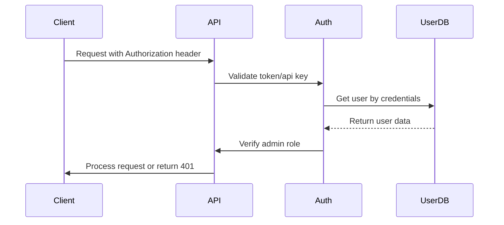

**Diagram sources**
- [auth.py](file://backend/open_webui/utils/auth.py#L272-L419)

**Section sources**
- [auth.py](file://backend/open_webui/utils/auth.py#L272-L419)

## Billing Plan Management
The Administration API provides comprehensive endpoints for managing billing plans, allowing administrators to create, read, update, delete, and duplicate subscription plans. These operations are performed through the `/admin/billing/plans` endpoint and require administrative privileges.

### Creating Billing Plans
Administrators can create new billing plans using the POST endpoint. The request body must include the plan details such as name, price, currency, interval, and quotas. The system automatically generates a unique ID if not provided, based on the plan name.

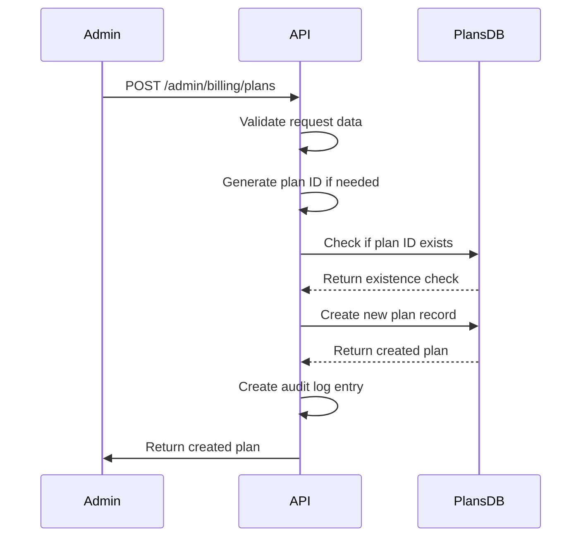

**Diagram sources**
- [admin_billing.py](file://backend/open_webui/routers/admin_billing.py#L205-L262)

### Retrieving Billing Plans
Administrators can retrieve all billing plans with their subscription statistics using the GET endpoint. This returns a list of plans with detailed information including active subscriptions, canceled subscriptions, total subscriptions, and monthly recurring revenue (MRR).

The response includes the `PlanStatsModel` which extends the basic `PlanModel` with subscription statistics. Plans are sorted by their display order.

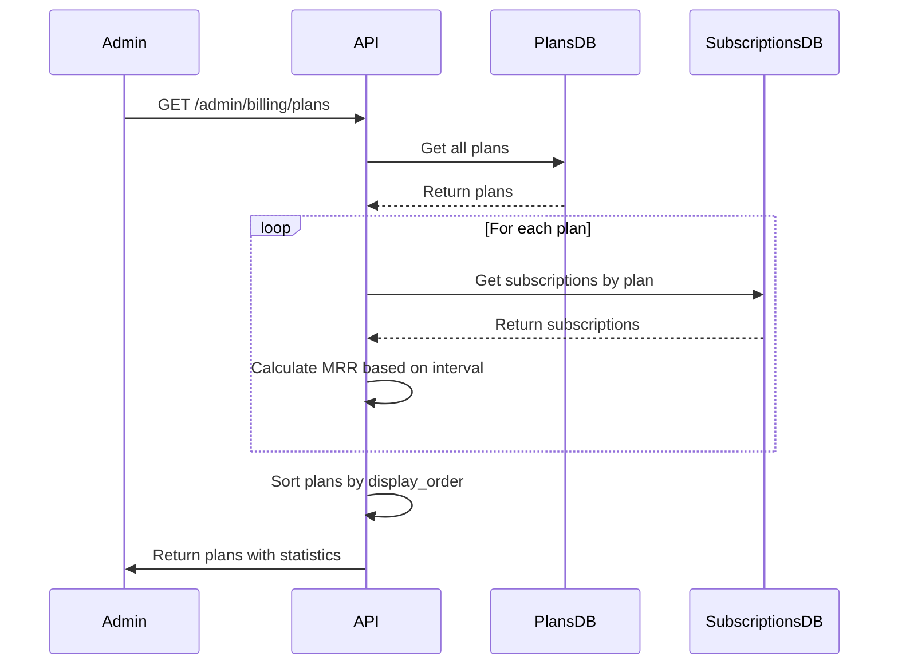

**Diagram sources**
- [admin_billing.py](file://backend/open_webui/routers/admin_billing.py#L159-L195)

### Updating and Modifying Billing Plans
Administrators can update existing billing plans using the PUT endpoint. The system implements business rules to prevent certain changes when a plan has active subscriptions. Specifically, quotas cannot be decreased for plans with active subscriptions to avoid negatively impacting existing customers.

The update operation includes validation to ensure business rules are maintained and creates an audit log entry documenting the changes made.

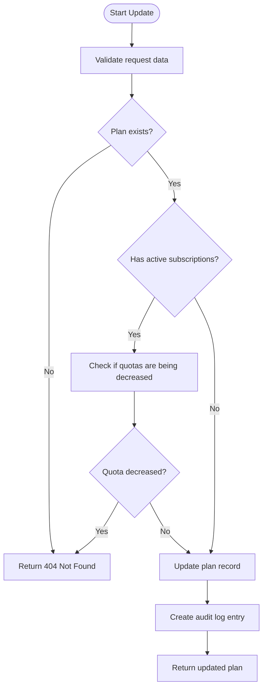

**Diagram sources**
- [admin_billing.py](file://backend/open_webui/routers/admin_billing.py#L286-L337)

### Deleting and Deactivating Billing Plans
The system provides two methods for removing billing plans: deletion and deactivation. Plans can only be deleted if they have no active subscriptions, ensuring that existing customers are not disrupted. For plans with active subscriptions, administrators should use the toggle endpoint to deactivate the plan instead.

The toggle endpoint allows administrators to activate or deactivate a plan without deleting it, which is useful for temporarily removing a plan from availability while preserving its history and subscription data.

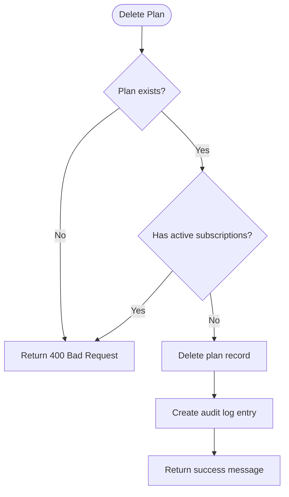

**Diagram sources**
- [admin_billing.py](file://backend/open_webui/routers/admin_billing.py#L341-L378)

**Section sources**
- [admin_billing.py](file://backend/open_webui/routers/admin_billing.py#L159-L558)

## Subscription and Usage Analytics
The Administration API provides detailed analytics for subscription plans, allowing administrators to monitor key metrics such as monthly recurring revenue (MRR), active subscribers, churn rate, and revenue trends. These analytics are accessible through dedicated endpoints and provide insights into the financial performance of each billing plan.

### Plan Analytics Dashboard
The analytics dashboard for each billing plan displays key performance indicators including MRR, active subscribers, churn rate, and total subscribers. The MRR is calculated based on the plan's price and interval, converted to a monthly equivalent:

- Monthly plans: MRR = price × active subscriptions
- Yearly plans: MRR = (price ÷ 12) × active subscriptions  
- Weekly plans: MRR = (price × 4.33) × active subscriptions
- Daily plans: MRR = (price × 30) × active subscriptions

The dashboard also shows a revenue trend chart (demo data) and a detailed list of subscribers with their status, subscription date, and next billing date.

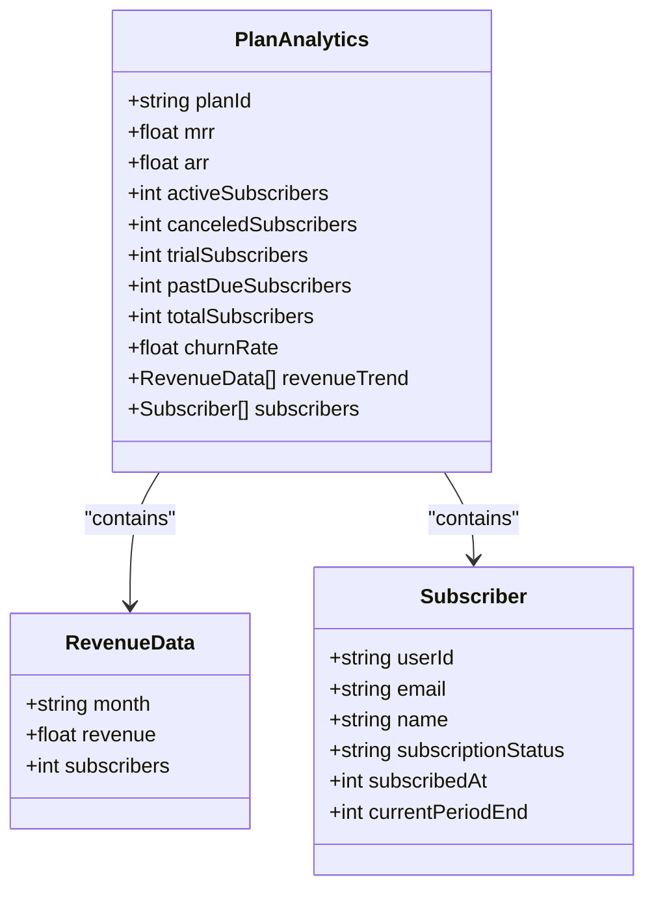

**Diagram sources**
- [admin_billing.py](file://backend/open_webui/routers/admin_billing.py#L489-L558)
- [+page.svelte](file://src/routes/(app)/admin/billing/plans/[id]/analytics/+page.svelte#L1-L385)

### Subscriber Management
Administrators can view all users subscribed to a specific plan through the subscribers endpoint. The response is paginated to handle large numbers of subscribers efficiently. Each page returns a maximum of 100 subscribers, with default page size of 20.

The subscriber data includes the user's ID, email, name, subscription status, subscription date, and current billing period end date. This information allows administrators to manage subscriptions and address customer inquiries.

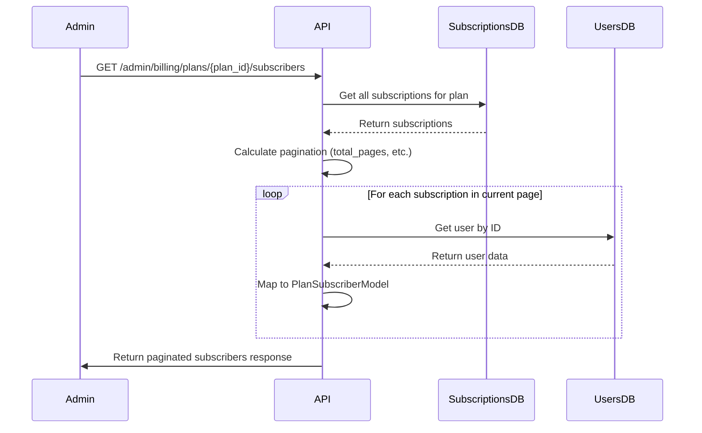

**Diagram sources**
- [admin_billing.py](file://backend/open_webui/routers/admin_billing.py#L489-L558)

**Section sources**
- [admin_billing.py](file://backend/open_webui/routers/admin_billing.py#L489-L558)
- [+page.svelte](file://src/routes/(app)/admin/billing/plans/[id]/analytics/+page.svelte#L1-L385)

## Data Models
This section documents the core data models used in the billing and administration system, including billing plans, subscriptions, usage tracking, and audit logs.

### Billing Plan Model
The `PlanModel` represents a subscription plan with its pricing, quotas, and features. Each plan has a unique ID and can be activated or deactivated.

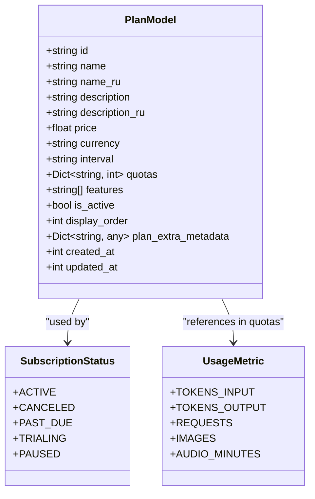

**Diagram sources**
- [billing.py](file://backend/open_webui/models/billing.py#L83-L104)

### Subscription Model
The `SubscriptionModel` tracks user subscriptions to billing plans, including the subscription status, billing period, and payment provider data.

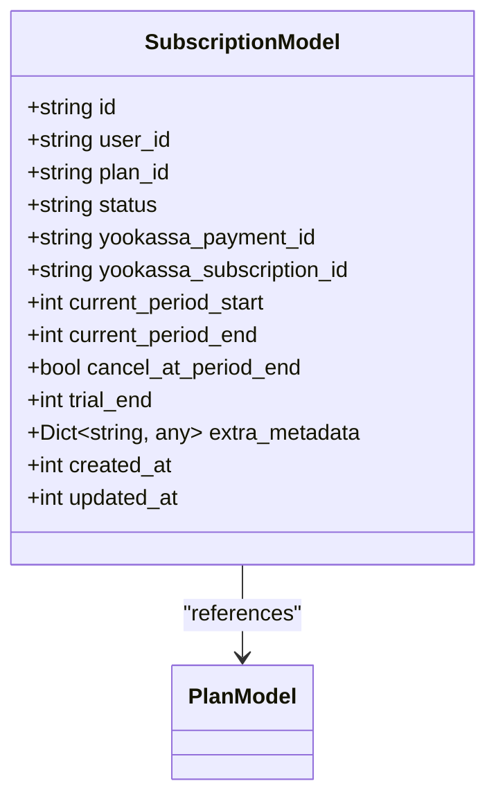

**Diagram sources**
- [billing.py](file://backend/open_webui/models/billing.py#L147-L168)

### Usage Tracking Model
The `UsageModel` tracks user consumption of platform resources, enabling quota enforcement and usage analytics.

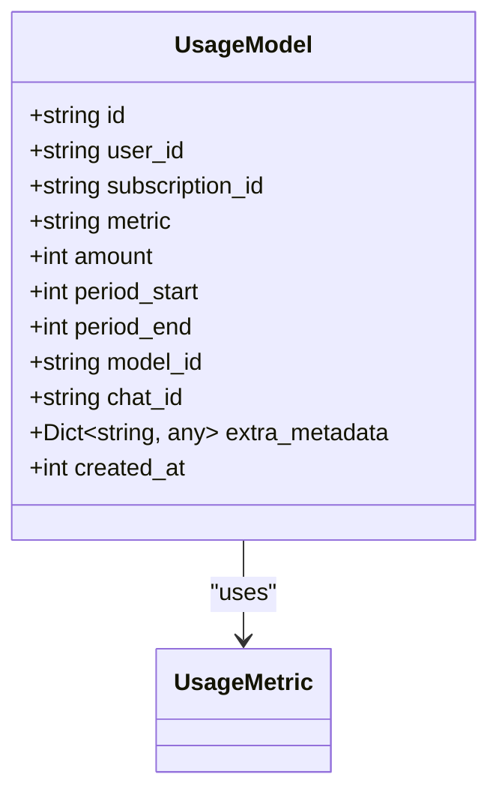

**Diagram sources**
- [billing.py](file://backend/open_webui/models/billing.py#L206-L223)

**Section sources**
- [billing.py](file://backend/open_webui/models/billing.py#L54-L224)

## Audit Logging
The system implements comprehensive audit logging for all administrative actions related to billing plans. Every create, update, delete, activate, deactivate, and duplicate operation is recorded in the audit log with details about the action, the user who performed it, and any changes made.

### Audit Log Model
The `AuditLogModel` captures information about administrative actions, providing a complete history of changes to billing plans.

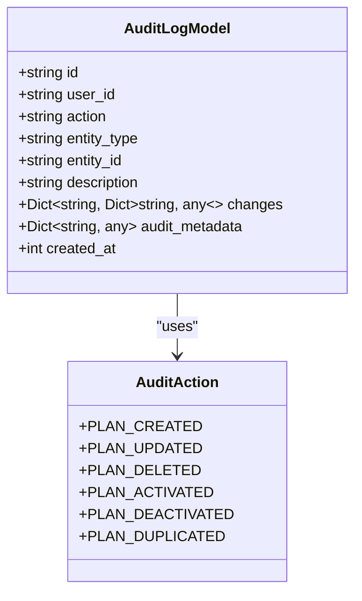

**Diagram sources**
- [audit.py](file://backend/open_webui/models/audit.py#L64-L74)

### Audit Log Operations
The `AuditLogs` class provides methods for creating and retrieving audit log entries. When an administrative action is performed, a log entry is created with relevant details.

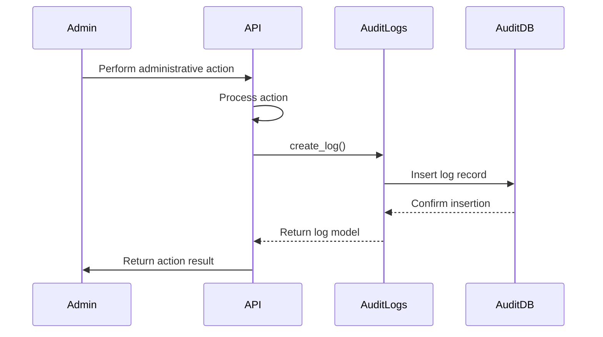

**Diagram sources**
- [audit.py](file://backend/open_webui/models/audit.py#L83-L114)

**Section sources**
- [audit.py](file://backend/open_webui/models/audit.py#L19-L137)
- [admin_billing.py](file://backend/open_webui/routers/admin_billing.py#L242-L249)

## Initialization and Configuration
The system provides tools for initializing billing plans from templates and configuring the billing system.

### Billing Plan Templates
The `plan_templates.py` module defines default, annual, and promotional billing plans that can be used to initialize the system. These templates include:

- **Default plans**: Free, Starter, Pro, Business, and Unlimited tiers
- **Annual plans**: Yearly versions of main plans with 20% discount
- **Promotional plans**: Special offers for marketing campaigns

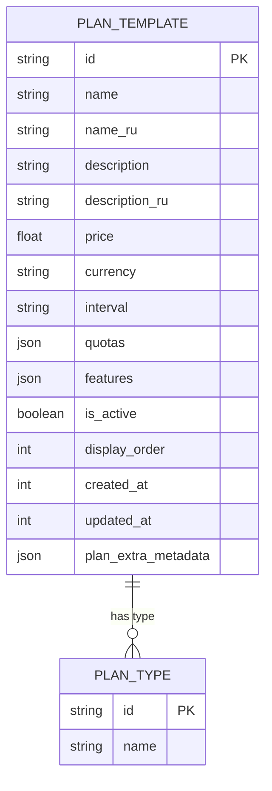

**Diagram sources**
- [plan_templates.py](file://backend/open_webui/utils/plan_templates.py#L10-L305)

### Plan Initialization Script
The `init_billing_plans.py` script initializes the billing system with predefined plans from templates. It can be run with options to include annual and promotional plans, and can overwrite existing plans if needed.

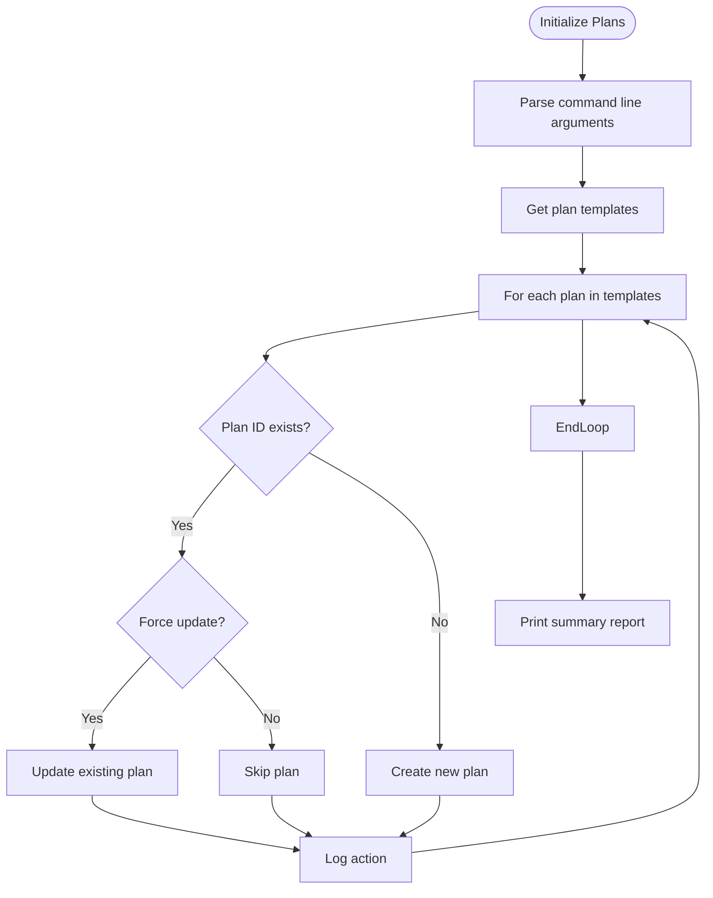

**Diagram sources**
- [init_billing_plans.py](file://backend/scripts/init_billing_plans.py#L29-L73)

**Section sources**
- [plan_templates.py](file://backend/open_webui/utils/plan_templates.py#L10-L305)
- [init_billing_plans.py](file://backend/scripts/init_billing_plans.py#L1-L120)

## Frontend Integration
The administration API is integrated with a frontend interface that provides a user-friendly way to manage billing plans and view analytics.

### Billing Plans Management Interface
The billing plans management interface allows administrators to view, create, edit, duplicate, and delete billing plans. The interface displays key statistics for each plan including active subscribers and MRR.

Key features:
- Search and filter plans by name, ID, or description
- Toggle plan activation status
- Duplicate existing plans to create new variations
- Delete plans (only if no active subscriptions exist)
- View summary statistics for all plans

```mermaid
flowchart TD
UI[Plans Management UI] --> API[Administration API]
API --> PlansDB[(Plans Database)]
API --> SubscriptionsDB[(Subscriptions Database)]
UI --> |GET /admin/billing/plans| API
API --> |Return plans with stats| UI
UI --> |POST /admin/billing/plans| API
API --> |Create new plan| PlansDB
UI --> |PUT /admin/billing/plans/{id}| API
API --> |Update plan| PlansDB
UI --> |DELETE /admin/billing/plans/{id}| API
API --> |Delete plan| PlansDB
UI --> |PATCH /admin/billing/plans/{id}/toggle| API
API --> |Toggle active status| PlansDB
```

**Diagram sources**
- [+page.svelte](file://src/routes/(app)/admin/billing/plans/+page.svelte#L1-L386)
- [billing.ts](file://src/lib/apis/admin/billing.ts#L1-L314)

### Analytics Interface
The analytics interface provides detailed insights into the performance of each billing plan, including subscriber details, revenue metrics, and trend analysis.

Key features:
- Display MRR, ARR, and churn rate
- Show active, canceled, and trial subscribers
- List all subscribers with their status and billing dates
- Provide pagination for large subscriber lists
- Show revenue trend (demo data)

```mermaid
flowchart TD
AnalyticsUI[Analytics Interface] --> API[Administration API]
API --> PlansDB[(Plans Database)]
API --> SubscriptionsDB[(Subscriptions Database)]
AnalyticsUI --> |GET /admin/billing/plans/{id}| API
API --> |Return plan details| AnalyticsUI
AnalyticsUI --> |GET /admin/billing/plans/{id}/subscribers| API
API --> |Return paginated subscribers| AnalyticsUI
```

**Diagram sources**
- [+page.svelte](file://src/routes/(app)/admin/billing/plans/[id]/analytics/+page.svelte#L1-L385)

**Section sources**
- [+page.svelte](file://src/routes/(app)/admin/billing/plans/+page.svelte#L1-L386)
- [+page.svelte](file://src/routes/(app)/admin/billing/plans/[id]/analytics/+page.svelte#L1-L385)
- [billing.ts](file://src/lib/apis/admin/billing.ts#L1-L314)