# Billing Management

<cite>
**Referenced Files in This Document**   
- [billing.py](file://backend/open_webui/routers/billing.py)
- [admin_billing.py](file://backend/open_webui/routers/admin_billing.py)
- [billing.py](file://backend/open_webui/models/billing.py)
- [billing_integration.py](file://backend/open_webui/utils/billing_integration.py)
- [billing.py](file://backend/open_webui/utils/billing.py)
- [yookassa.py](file://backend/open_webui/utils/yookassa.py)
- [init_billing_plans.py](file://backend/scripts/init_billing_plans.py)
- [b2f8a9c1d5e3_add_billing_tables.py](file://backend/open_webui/migrations/versions/b2f8a9c1d5e3_add_billing_tables.py)
- [audit.py](file://backend/open_webui/utils/audit.py)
- [index.ts](file://src/lib/apis/billing/index.ts)
- [billing.ts](file://src/lib/apis/admin/billing.ts)
- [BILLING_SETUP.md](file://BILLING_SETUP.md)
</cite>

## Table of Contents
1. [Introduction](#introduction)
2. [Data Models](#data-models)
3. [API Endpoints](#api-endpoints)
4. [Workflow](#workflow)
5. [Usage Examples](#usage-examples)
6. [Integration with Payment Providers](#integration-with-payment-providers)
7. [Security Considerations](#security-considerations)
8. [Error Handling](#error-handling)
9. [Rate Limiting](#rate-limiting)
10. [Audit Logging](#audit-logging)
11. [Appendices](#appendices)

## Introduction
The billing management system in Open WebUI provides a comprehensive solution for managing subscription plans, user subscriptions, usage tracking, and payment processing. The system is designed to support CRUD operations on billing plans, subscription management, and detailed usage analytics. It integrates with the YooKassa payment provider for handling financial transactions and includes robust security features for protecting financial data.

The system consists of several key components:
- **Billing Plans**: Define subscription tiers with pricing, quotas, and features
- **Subscriptions**: Manage user subscriptions to billing plans
- **Usage Tracking**: Monitor resource consumption (tokens, requests, etc.)
- **Transactions**: Record payment history and status
- **Payment Integration**: Handle payments through YooKassa
- **Audit Logging**: Track changes to billing entities

This documentation provides comprehensive details on the API endpoints, data models, workflows, and integration points for the billing system.

**Section sources**
- [billing.py](file://backend/open_webui/routers/billing.py#L1-L413)
- [admin_billing.py](file://backend/open_webui/routers/admin_billing.py#L1-L558)
- [BILLING_SETUP.md](file://BILLING_SETUP.md#L1-L333)

## Data Models
The billing system defines several key data models for managing billing entities. These models are implemented as SQLAlchemy ORM classes with corresponding Pydantic models for API serialization.

### BillingPlan Entity
The `Plan` model represents a subscription plan (tariff plan) with pricing, quotas, and features.

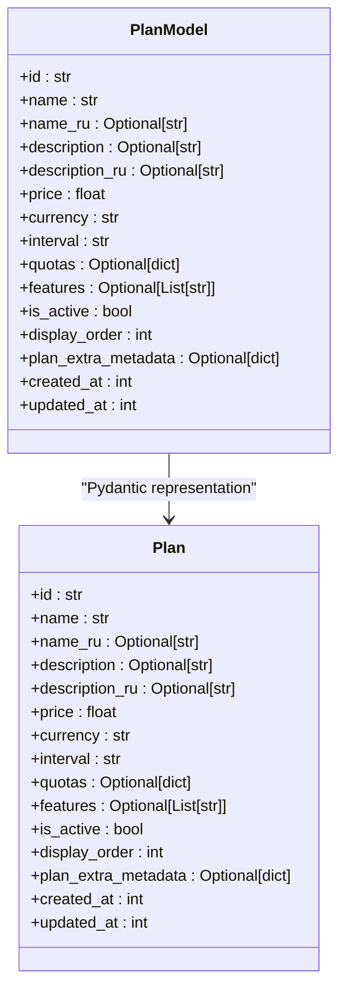

**Diagram sources**
- [billing.py](file://backend/open_webui/models/billing.py#L54-L104)

**Section sources**
- [billing.py](file://backend/open_webui/models/billing.py#L54-L104)

### Subscription Entity
The `Subscription` model tracks user subscriptions to billing plans, including status, billing periods, and payment provider data.

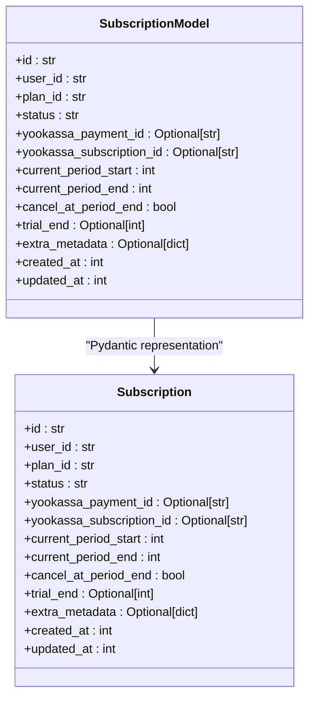

**Diagram sources**
- [billing.py](file://backend/open_webui/models/billing.py#L112-L168)

**Section sources**
- [billing.py](file://backend/open_webui/models/billing.py#L112-L168)

### UsageRecord Entity
The `Usage` model tracks user resource consumption metrics such as tokens, requests, and other usage metrics.

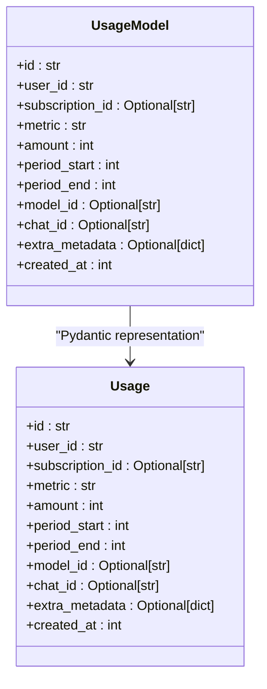

**Diagram sources**
- [billing.py](file://backend/open_webui/models/billing.py#L176-L223)

**Section sources**
- [billing.py](file://backend/open_webui/models/billing.py#L176-L223)

### Transaction Entity
The `Transaction` model records payment transaction history, including amounts, status, and payment provider details.

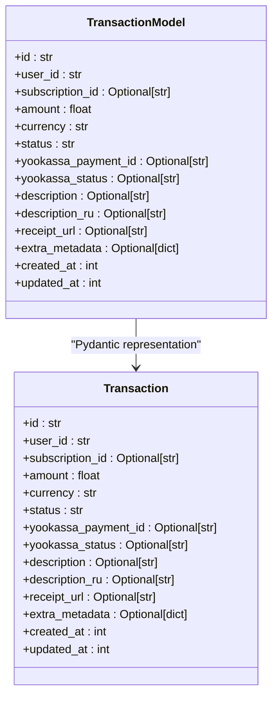

**Diagram sources**
- [billing.py](file://backend/open_webui/models/billing.py#L231-L289)

**Section sources**
- [billing.py](file://backend/open_webui/models/billing.py#L231-L289)

### Enum Definitions
The system defines several enumerations for standardizing values across entities.

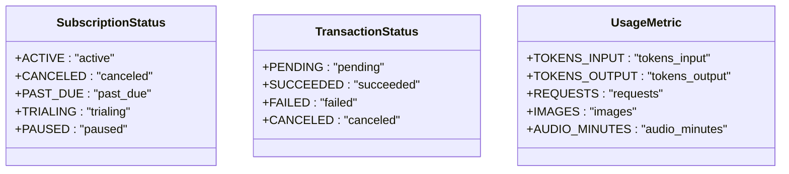

**Diagram sources**
- [billing.py](file://backend/open_webui/models/billing.py#L26-L47)

**Section sources**
- [billing.py](file://backend/open_webui/models/billing.py#L26-L47)

## API Endpoints
The billing system exposes a comprehensive set of REST API endpoints for managing billing entities. These endpoints are organized into user-facing and admin-only routes.

### User Endpoints
The user endpoints provide functionality for managing subscriptions, payments, and viewing billing information.

```mermaid
flowchart TD
A[GET /billing/plans] --> B[Get active plans]
C[GET /billing/subscription] --> D[Get user subscription]
E[POST /billing/subscription/cancel] --> F[Cancel subscription]
G[POST /billing/payment] --> H[Create payment]
I[GET /billing/transactions] --> J[Get transaction history]
K[GET /billing/usage/{metric}] --> L[Get usage for metric]
M[POST /billing/usage/check] --> N[Check quota availability]
O[GET /billing/me] --> P[Get complete billing info]
```

**Diagram sources**
- [billing.py](file://backend/open_webui/routers/billing.py#L84-L356)

**Section sources**
- [billing.py](file://backend/open_webui/routers/billing.py#L84-L356)
- [index.ts](file://src/lib/apis/billing/index.ts#L78-L351)

### Admin Endpoints
The admin endpoints provide functionality for managing billing plans and viewing plan statistics.

```mermaid
flowchart TD
A[GET /admin/billing/plans] --> B[Get all plans with stats]
C[POST /admin/billing/plans] --> D[Create plan]
E[GET /admin/billing/plans/{id}] --> F[Get plan by ID]
G[PUT /admin/billing/plans/{id}] --> H[Update plan]
I[DELETE /admin/billing/plans/{id}] --> J[Delete plan]
K[PATCH /admin/billing/plans/{id}/toggle] --> L[Toggle plan active]
M[POST /admin/billing/plans/{id}/duplicate] --> N[Duplicate plan]
O[GET /admin/billing/plans/{id}/subscribers] --> P[Get plan subscribers]
```

**Diagram sources**
- [admin_billing.py](file://backend/open_webui/routers/admin_billing.py#L159-L548)

**Section sources**
- [admin_billing.py](file://backend/open_webui/routers/admin_billing.py#L159-L548)
- [billing.ts](file://src/lib/apis/admin/billing.ts#L80-L313)

### Webhook Endpoint
The webhook endpoint handles payment notifications from YooKassa.

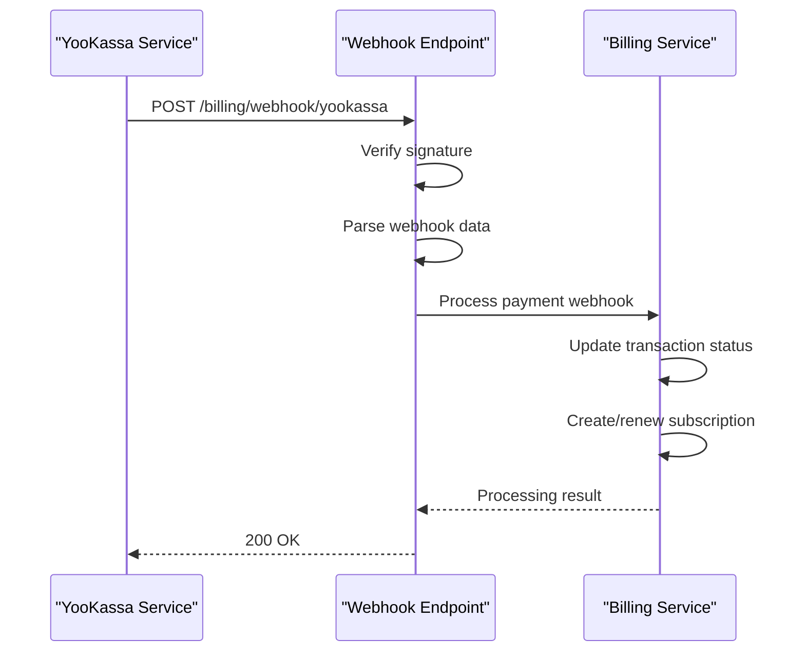

**Diagram sources**
- [billing.py](file://backend/open_webui/routers/billing.py#L363-L412)

**Section sources**
- [billing.py](file://backend/open_webui/routers/billing.py#L363-L412)

## Workflow
The billing system implements several key workflows for managing the lifecycle of billing entities.

### Creating and Modifying Billing Plans
The workflow for creating and modifying billing plans involves using the admin API endpoints. Only administrators can create, update, or delete plans.

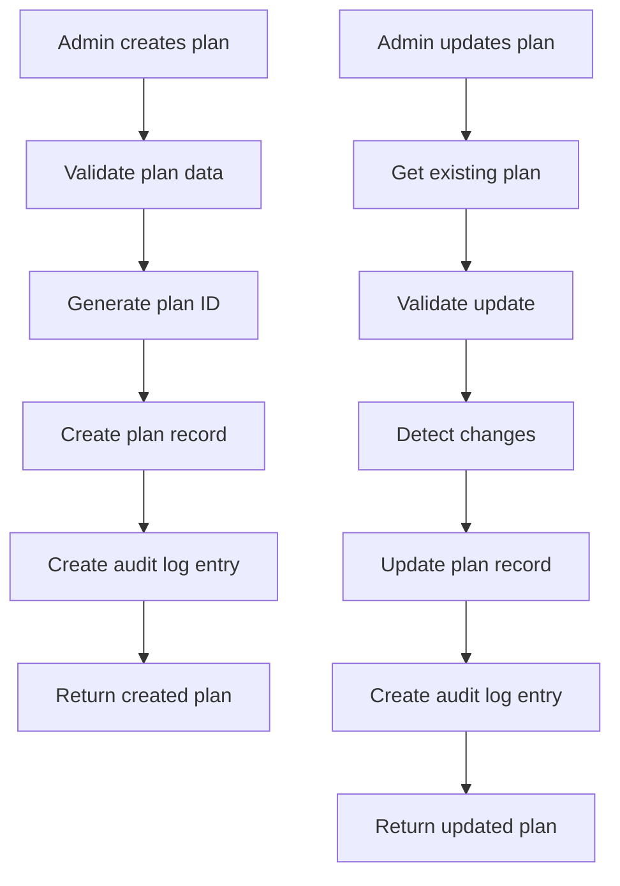

**Diagram sources**
- [admin_billing.py](file://backend/open_webui/routers/admin_billing.py#L205-L330)
- [admin_billing.py](file://backend/open_webui/routers/admin_billing.py#L286-L330)

**Section sources**
- [admin_billing.py](file://backend/open_webui/routers/admin_billing.py#L205-L330)

### Assigning Plans to Users
Users are assigned to plans through the payment process, which creates or renews a subscription when a payment is successful.

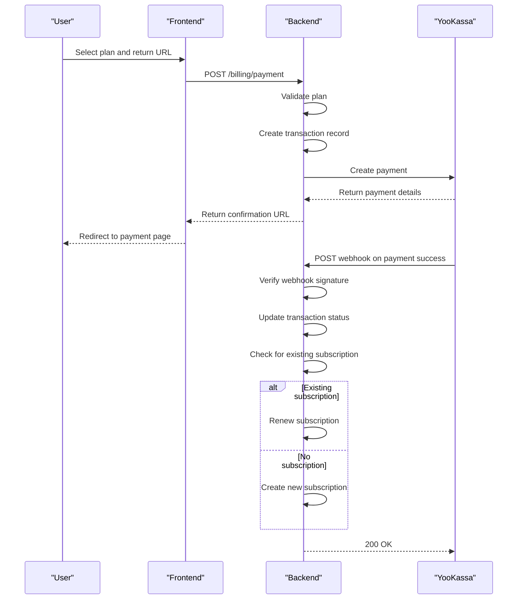

**Diagram sources**
- [billing.py](file://backend/open_webui/routers/billing.py#L182-L211)
- [billing.py](file://backend/open_webui/routers/billing.py#L363-L412)
- [billing.py](file://backend/open_webui/utils/billing.py#L374-L523)

**Section sources**
- [billing.py](file://backend/open_webui/routers/billing.py#L182-L211)
- [billing.py](file://backend/open_webui/routers/billing.py#L363-L412)
- [billing.py](file://backend/open_webui/utils/billing.py#L374-L523)

### Retrieving Usage Analytics
The system provides endpoints for retrieving detailed usage analytics for users and administrators.

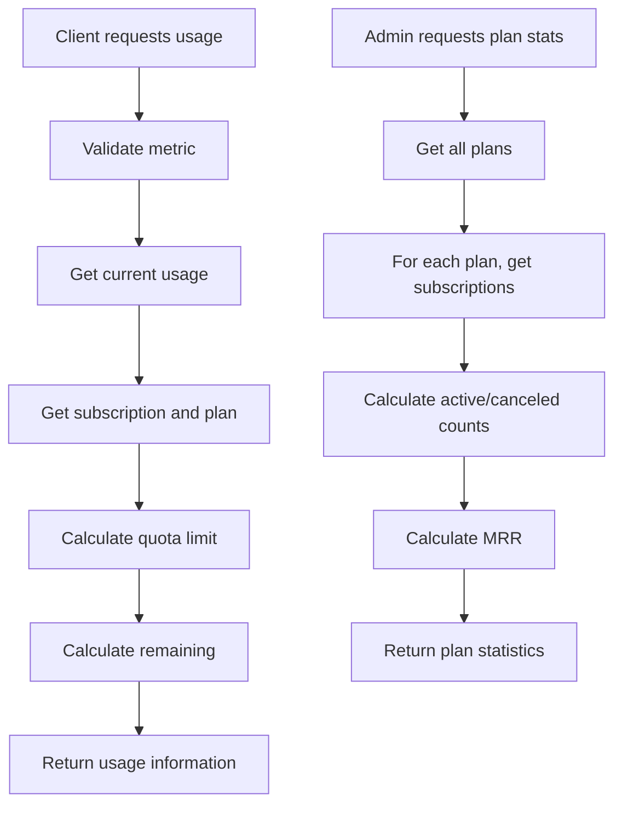

**Diagram sources**
- [billing.py](file://backend/open_webui/routers/billing.py#L239-L284)
- [admin_billing.py](file://backend/open_webui/routers/admin_billing.py#L159-L195)

**Section sources**
- [billing.py](file://backend/open_webui/routers/billing.py#L239-L284)
- [admin_billing.py](file://backend/open_webui/routers/admin_billing.py#L159-L195)

## Usage Examples
This section provides practical examples of API requests for common billing operations.

### Creating a New Billing Plan
To create a new billing plan, use the admin API endpoint with the required plan details.

```bash
curl -X POST "http://localhost:3000/api/v1/admin/billing/plans" \
  -H "Authorization: Bearer ADMIN_TOKEN" \
  -H "Content-Type: application/json" \
  -d '{
    "name": "Pro",
    "name_ru": "Профессиональный",
    "description": "Advanced features and higher quotas",
    "description_ru": "Расширенные возможности и увеличенные квоты",
    "price": 990.00,
    "currency": "RUB",
    "interval": "month",
    "quotas": {
      "tokens_input": 1000000,
      "tokens_output": 500000,
      "requests": 10000
    },
    "features": [
      "gpt4_access",
      "claude_access",
      "priority_support"
    ],
    "is_active": true,
    "display_order": 1
  }'
```

**Section sources**
- [admin_billing.py](file://backend/open_webui/routers/admin_billing.py#L205-L262)
- [BILLING_SETUP.md](file://BILLING_SETUP.md#L87-L112)

### Updating Subscription Status
To cancel a subscription, use the subscription cancellation endpoint.

```bash
curl -X POST "http://localhost:3000/api/v1/billing/subscription/cancel" \
  -H "Authorization: Bearer USER_TOKEN" \
  -H "Content-Type: application/json" \
  -d '{
    "immediate": false
  }'
```

**Section sources**
- [billing.py](file://backend/open_webui/routers/billing.py#L151-L174)
- [index.ts](file://src/lib/apis/billing/index.ts#L161-L189)

### Generating Billing Reports
To retrieve a user's complete billing information, use the billing info endpoint.

```bash
curl -X GET "http://localhost:3000/api/v1/billing/me" \
  -H "Authorization: Bearer USER_TOKEN"
```

To get statistics for all plans (admin only):

```bash
curl -X GET "http://localhost:3000/api/v1/admin/billing/plans" \
  -H "Authorization: Bearer ADMIN_TOKEN"
```

**Section sources**
- [billing.py](file://backend/open_webui/routers/billing.py#L344-L355)
- [admin_billing.py](file://backend/open_webui/routers/admin_billing.py#L159-L195)

## Integration with Payment Providers
The billing system integrates with YooKassa as the payment provider for handling financial transactions.

### YooKassa Integration
The integration with YooKassa is implemented through the `YooKassaClient` class, which handles API requests for creating payments, retrieving payment information, and processing webhooks.

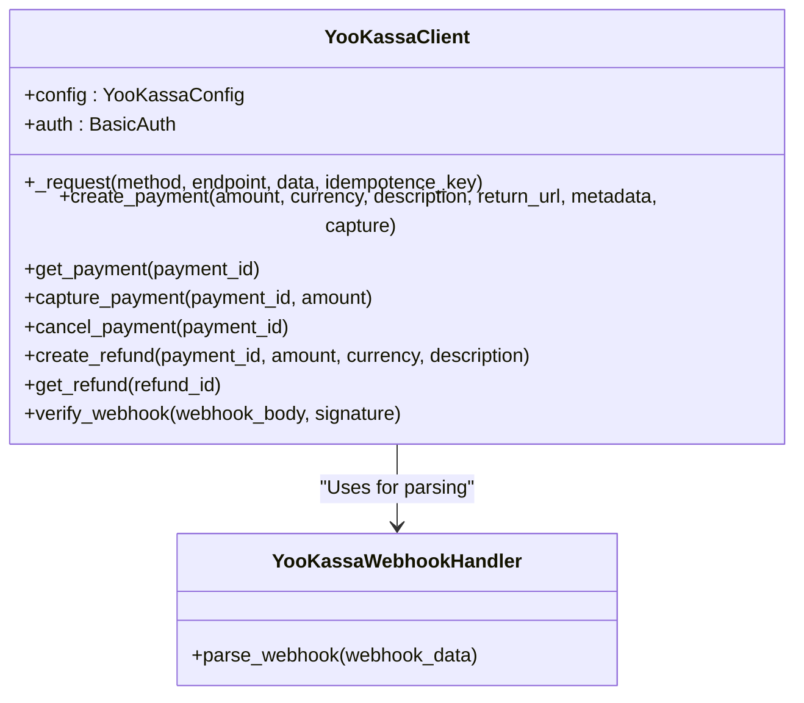

**Diagram sources**
- [yookassa.py](file://backend/open_webui/utils/yookassa.py#L38-L355)

**Section sources**
- [yookassa.py](file://backend/open_webui/utils/yookassa.py#L38-L355)
- [billing.py](file://backend/open_webui/utils/billing.py#L374-L523)

### Configuration
The YooKassa integration requires configuration through environment variables:

```bash
# YooKassa Shop ID
YOOKASSA_SHOP_ID='your_shop_id'

# YooKassa Secret Key
YOOKASSA_SECRET_KEY='your_secret_key'

# YooKassa Webhook Secret (optional, for security)
YOOKASSA_WEBHOOK_SECRET='your_webhook_secret'

# YooKassa API URL (can leave default)
YOOKASSA_API_URL='https://api.yookassa.ru/v3'
```

**Section sources**
- [BILLING_SETUP.md](file://BILLING_SETUP.md#L52-L63)

## Security Considerations
The billing system implements several security measures to protect financial data and prevent unauthorized access.

### Financial Data Protection
The system protects financial data through several mechanisms:

1. **Authentication**: All billing endpoints require authentication via Bearer tokens
2. **Authorization**: Admin endpoints are restricted to users with admin privileges
3. **Webhook Verification**: YooKassa webhooks are verified using HMAC-SHA256 signatures
4. **Audit Logging**: All changes to billing entities are logged with user information

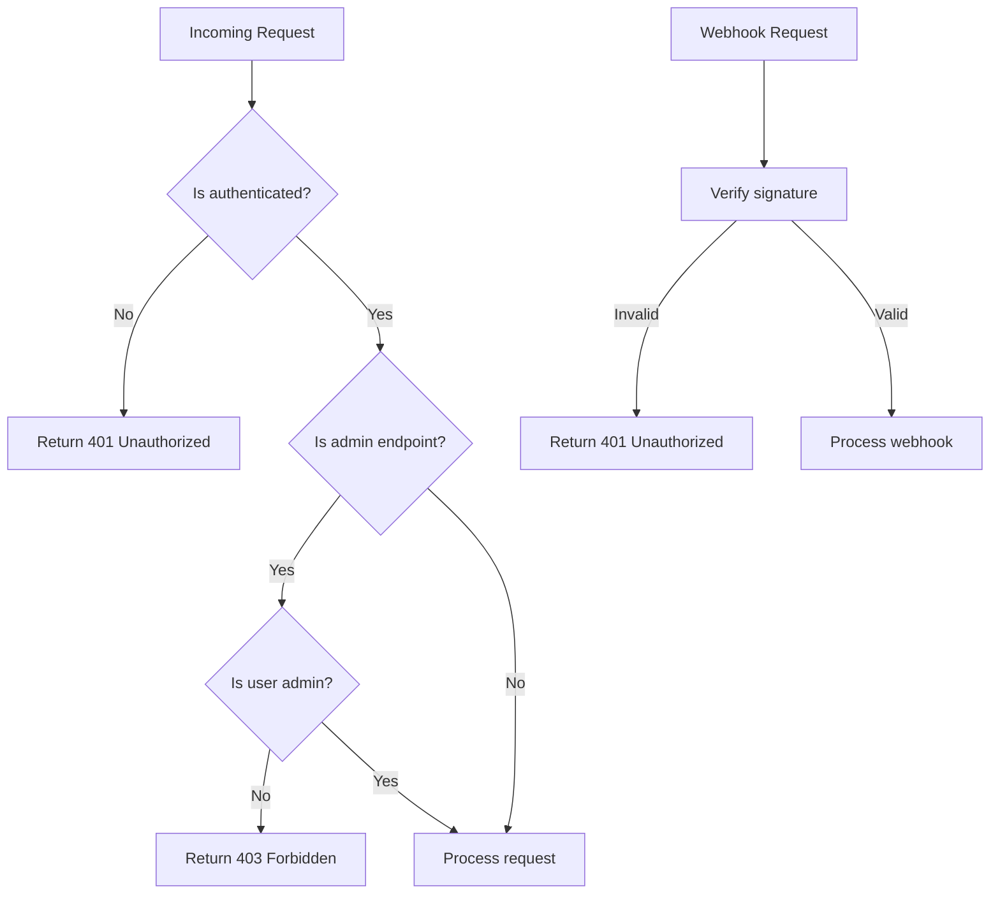

**Diagram sources**
- [billing.py](file://backend/open_webui/routers/billing.py#L377-L386)
- [yookassa.py](file://backend/open_webui/utils/yookassa.py#L262-L293)

**Section sources**
- [billing.py](file://backend/open_webui/routers/billing.py#L377-L386)
- [yookassa.py](file://backend/open_webui/utils/yookassa.py#L262-L293)
- [BILLING_SETUP.md](file://BILLING_SETUP.md#L270-L272)

### Validation Rules
The system enforces validation rules for plan configurations to prevent business logic violations:

1. **Price Validation**: Prices must be non-negative
2. **Currency Validation**: Only supported currencies (RUB, USD, EUR) are allowed
3. **Interval Validation**: Only valid intervals (day, week, month, year) are allowed
4. **Active Subscription Protection**: Plans with active subscriptions cannot have quotas decreased

**Section sources**
- [admin_billing.py](file://backend/open_webui/routers/admin_billing.py#L38-L64)
- [admin_billing.py](file://backend/open_webui/routers/admin_billing.py#L109-L133)

## Error Handling
The billing system implements comprehensive error handling for various failure scenarios.

### Payment Failures
The system handles payment failures through the webhook processing mechanism:

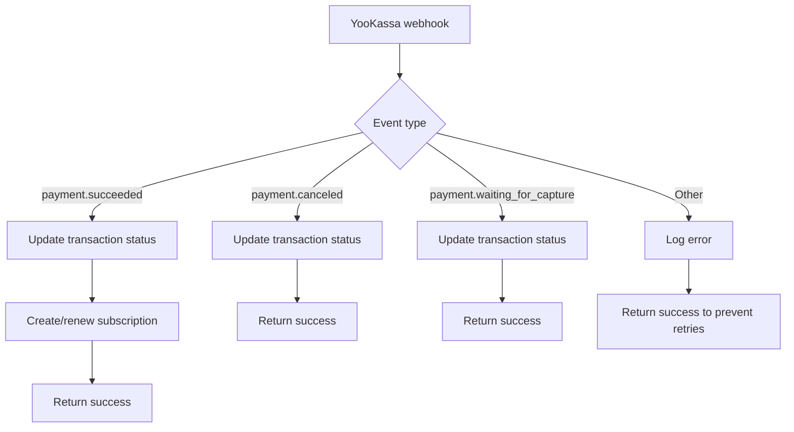

**Diagram sources**
- [billing.py](file://backend/open_webui/utils/billing.py#L448-L523)

**Section sources**
- [billing.py](file://backend/open_webui/utils/billing.py#L448-L523)

### Quota Exceeded Errors
When a user exceeds their quota, the system raises a `QuotaExceededError` which is translated to an HTTP 429 response:

```python
class QuotaExceededError(Exception):
    """Raised when user exceeds their quota"""
    pass

def enforce_quota(user_id: str, metric: UsageMetric, amount: int = 1) -> None:
    if not check_quota(user_id, metric, amount):
        raise QuotaExceededError(
            f"Quota exceeded for {metric}. Please upgrade your plan."
        )
```

**Section sources**
- [billing_integration.py](file://backend/open_webui/utils/billing_integration.py#L33-L36)
- [billing.py](file://backend/open_webui/utils/billing.py#L353-L371)

## Rate Limiting
The system implements rate limiting for billing API calls to prevent abuse.

### Rate Limiter Implementation
The rate limiting is implemented using a rolling window strategy with Redis as the primary storage, falling back to in-memory storage if Redis is unavailable.

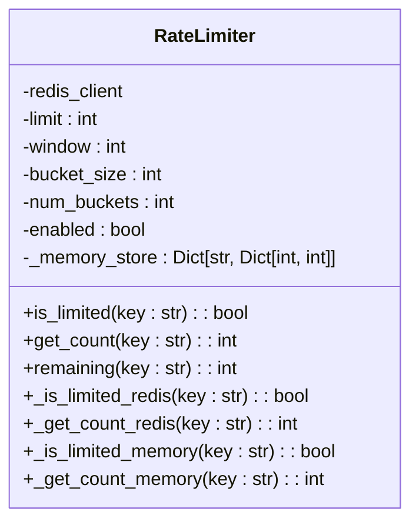

**Diagram sources**
- [rate_limit.py](file://backend/open_webui/utils/rate_limit.py#L6-L140)

**Section sources**
- [rate_limit.py](file://backend/open_webui/utils/rate_limit.py#L6-L140)

## Audit Logging
The billing system implements comprehensive audit logging to track changes to billing entities.

### Audit Log Implementation
The system creates audit log entries for all significant operations on billing entities, including plan creation, updates, and deletions.

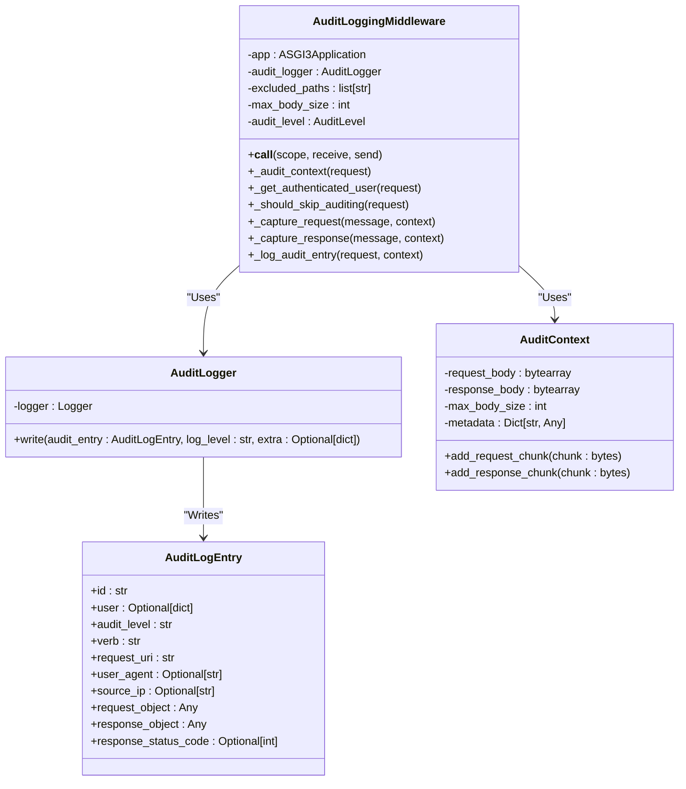

**Diagram sources**
- [audit.py](file://backend/open_webui/utils/audit.py#L36-L284)

**Section sources**
- [audit.py](file://backend/open_webui/utils/audit.py#L36-L284)
- [admin_billing.py](file://backend/open_webui/routers/admin_billing.py#L242-L249)

### Audit Log Database Schema
The audit logs are stored in the `billing_audit_log` table with appropriate indexes for querying.

```sql
CREATE TABLE billing_audit_log (
    id VARCHAR NOT NULL,
    user_id VARCHAR NOT NULL,
    action VARCHAR NOT NULL,
    entity_type VARCHAR NOT NULL,
    entity_id VARCHAR NOT NULL,
    description TEXT,
    changes JSON,
    audit_metadata JSON,
    created_at BIGINT NOT NULL,
    PRIMARY KEY (id)
);

CREATE INDEX idx_audit_user ON billing_audit_log (user_id);
CREATE INDEX idx_audit_entity ON billing_audit_log (entity_type, entity_id);
CREATE INDEX idx_audit_created ON billing_audit_log (created_at);
CREATE INDEX idx_audit_action ON billing_audit_log (action);
```

**Section sources**
- [b2f8a9c1d5e3_add_billing_tables.py](file://backend/open_webui/migrations/versions/b2f8a9c1d5e3_add_billing_tables.py#L132-L167)

## Appendices

### Appendix A: Database Schema
The billing system creates the following tables in the database:

- `billing_plan`: Stores subscription plan definitions
- `billing_subscription`: Tracks user subscriptions
- `billing_usage`: Records usage metrics for quota enforcement
- `billing_transaction`: Maintains payment transaction history
- `billing_audit_log`: Stores audit logs for billing operations

**Section sources**
- [b2f8a9c1d5e3_add_billing_tables.py](file://backend/open_webui/migrations/versions/b2f8a9c1d5e3_add_billing_tables.py#L18-L187)
- [BILLING_SETUP.md](file://BILLING_SETUP.md#L258-L263)

### Appendix B: Initialization Script
The system includes a script to initialize billing plans from templates:

```python
def init_plans(include_annual=False, include_promo=False, force=False):
    """Initialize billing plans from templates"""
    plans_to_create = []
    plans_to_create.extend(get_default_plans())
    
    if include_annual:
        plans_to_create.extend(get_annual_plans())
    
    if include_promo:
        plans_to_create.extend(get_promo_plans())
    
    # Create or update plans
    for plan_data in plans_to_create:
        existing_plan = Plans.get_plan_by_id(plan_data["id"])
        if existing_plan:
            if force:
                Plans.update_plan_by_id(plan_data["id"], plan_data)
        else:
            Plans.create_plan(plan_data)
```

**Section sources**
- [init_billing_plans.py](file://backend/scripts/init_billing_plans.py#L29-L67)

### Appendix C: Environment Variables
The following environment variables are required for the billing system:

- `YOOKASSA_SHOP_ID`: YooKassa Shop ID
- `YOOKASSA_SECRET_KEY`: YooKassa Secret Key
- `YOOKASSA_WEBHOOK_SECRET`: YooKassa Webhook Secret (optional)
- `YOOKASSA_API_URL`: YooKassa API URL (default: https://api.yookassa.ru/v3)

**Section sources**
- [BILLING_SETUP.md](file://BILLING_SETUP.md#L52-L63)