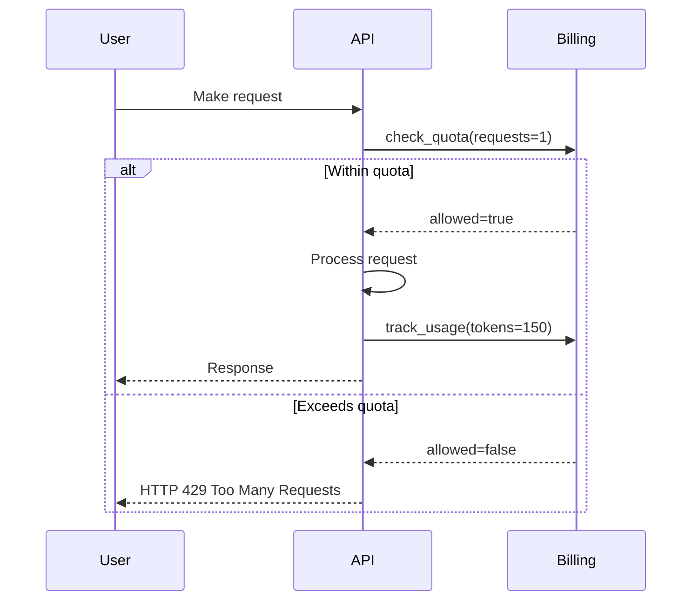
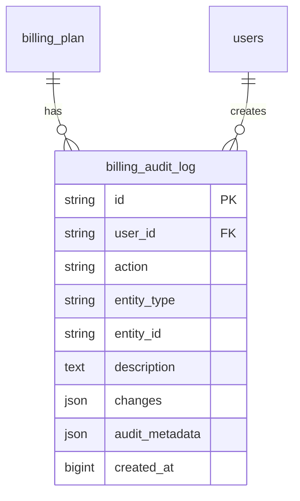

# Billing Plans API

<cite>
**Referenced Files in This Document**   
- [billing.py](file://backend/open_webui/routers/billing.py)
- [admin_billing.py](file://backend/open_webui/routers/admin_billing.py)
- [billing.py](file://backend/open_webui/models/billing.py)
- [billing.py](file://backend/open_webui/utils/billing.py)
- [plan_templates.py](file://backend/open_webui/utils/plan_templates.py)
- [init_billing_plans.py](file://backend/scripts/init_billing_plans.py)
- [b2f8a9c1d5e3_add_billing_tables.py](file://backend/open_webui/migrations/versions/b2f8a9c1d5e3_add_billing_tables.py)
- [audit.py](file://backend/open_webui/models/audit.py)
</cite>

## Table of Contents
1. [Introduction](#introduction)
2. [Billing Plan Data Model](#billing-plan-data-model)
3. [API Endpoints](#api-endpoints)
4. [Plan Management](#plan-management)
5. [Subscription and Usage](#subscription-and-usage)
6. [Validation and Business Rules](#validation-and-business-rules)
7. [Security and Audit](#security-and-audit)
8. [Initialization and Templates](#initialization-and-templates)
9. [Error Handling](#error-handling)
10. [Practical Examples](#practical-examples)

## Introduction

The Billing Plans API provides a comprehensive system for managing subscription plans, user subscriptions, usage tracking, and payment processing. The system is designed to support flexible pricing models with various quotas and features. This documentation covers all endpoints related to creating, reading, updating, and deleting billing plans, including detailed information about the data model, authentication requirements, and practical usage examples.

The billing system is built around several core components:
- **Plans**: Subscription tiers with defined pricing, quotas, and features
- **Subscriptions**: User enrollments in specific plans
- **Usage Tracking**: Monitoring of user activity against plan quotas
- **Transactions**: Payment history and processing
- **Audit Logging**: Tracking of administrative changes to plans

The API is divided into user-facing endpoints (in `billing.py`) and administrative endpoints (in `admin_billing.py`), with appropriate authentication and authorization controls.

**Section sources**
- [billing.py](file://backend/open_webui/routers/billing.py#L1-L413)
- [admin_billing.py](file://backend/open_webui/routers/admin_billing.py#L1-L558)

## Billing Plan Data Model

The BillingPlan data model defines the structure of subscription plans in the system. Each plan includes essential information such as name, description, pricing, features, and quotas that determine what users receive when they subscribe.

### Core Fields

The Plan model contains the following key fields:

| Field | Type | Description | Constraints |
|-------|------|-------------|-------------|
| id | string | Unique identifier for the plan | Required, unique |
| name | string | Plan name (e.g., "Pro", "Business") | Required |
| name_ru | string | Russian translation of plan name | Optional |
| description | string | Detailed description of the plan | Optional |
| description_ru | string | Russian translation of description | Optional |
| price | float | Price of the plan | Required, ≥ 0 |
| currency | string | Currency code (RUB, USD, EUR) | Default: "RUB" |
| interval | string | Billing interval (day, week, month, year) | Required |
| quotas | object | Usage limits for different metrics | Optional |
| features | array | List of features included in the plan | Optional |
| is_active | boolean | Whether the plan is available for subscription | Default: true |
| display_order | integer | Order for displaying plans | Default: 0 |
| created_at | integer | Timestamp of creation | Unix timestamp |
| updated_at | integer | Timestamp of last update | Unix timestamp |

### Quotas Structure

The quotas field is a JSON object that defines usage limits for various metrics. Supported metrics include:

- `tokens_input`: Input tokens consumed
- `tokens_output`: Output tokens generated
- `requests`: Number of API requests
- `images`: Number of images generated
- `audio_minutes`: Minutes of audio processed

For example, a plan might have quotas defined as:
```json
{
  "tokens_input": 1000000,
  "tokens_output": 500000,
  "requests": 5000
}
```

When quotas are set to null or a specific metric is not included, there is no limit for that metric.

### Features Array

The features array contains strings that represent the capabilities included in the plan. These can include access to specific AI models, priority processing, API access, and support levels. Examples include "GPT-4o", "Claude 4.5 Sonnet", "API доступ", and "Приоритетная поддержка".

**Section sources**
- [billing.py](file://backend/open_webui/models/billing.py#L54-L103)
- [b2f8a9c1d5e3_add_billing_tables.py](file://backend/open_webui/migrations/versions/b2f8a9c1d5e3_add_billing_tables.py#L18-L39)

## API Endpoints

The Billing Plans API provides a comprehensive set of endpoints for managing plans, subscriptions, and usage. These endpoints are divided between user-facing functionality and administrative operations.

### User Endpoints

User endpoints are accessible to authenticated users and provide functionality for viewing plans, managing subscriptions, and checking usage.

```mermaid
flowchart TD
A[User Endpoints] --> B[/plans]
A --> C[/plans/{plan_id}]
A --> D[/subscription]
A --> E[/subscription/cancel]
A --> F[/payment]
A --> G[/transactions]
A --> H[/usage/{metric}]
A --> I[/usage/check]
A --> J[/me]
A --> K[/webhook/yookassa]
```

**Diagram sources**
- [billing.py](file://backend/open_webui/routers/billing.py#L84-L413)

### Administrative Endpoints

Administrative endpoints are restricted to users with admin privileges and provide full CRUD operations for managing billing plans.

```mermaid
flowchart TD
A[Admin Endpoints] --> B[/plans]
A --> C[/plans/{plan_id}]
A --> D[/plans/{plan_id}/toggle]
A --> E[/plans/{plan_id}/duplicate]
A --> F[/plans/{plan_id}/subscribers]
```

**Diagram sources**
- [admin_billing.py](file://backend/open_webui/routers/admin_billing.py#L159-L558)

### Authentication Requirements

All endpoints require authentication. The system supports two authentication methods:

1. **JWT Tokens**: Standard authentication via Bearer token in the Authorization header
2. **API Keys**: For programmatic access, using keys that start with "sk-"

Administrative endpoints specifically require the user to have the "admin" role, enforced by the `get_admin_user` dependency.

**Section sources**
- [billing.py](file://backend/open_webui/routers/billing.py#L84-L413)
- [admin_billing.py](file://backend/open_webui/routers/admin_billing.py#L159-L558)
- [auth.py](file://backend/open_webui/utils/auth.py#L403-L418)

## Plan Management

The system provides comprehensive functionality for creating, reading, updating, and deleting billing plans through both API endpoints and administrative interfaces.

### Create Plan

Administrators can create new plans using the POST /admin/billing/plans endpoint. The request body must include the plan details according to the CreatePlanRequest model.

**Request Example:**
```json
{
  "name": "Enterprise",
  "description": "Unlimited access for large organizations",
  "price": 9990.0,
  "currency": "RUB",
  "interval": "month",
  "quotas": {
    "tokens_input": 50000000,
    "tokens_output": 25000000,
    "requests": 500000
  },
  "features": [
    "All models",
    "API access",
    "Dedicated support",
    "SLA 99.99%"
  ],
  "is_active": true,
  "display_order": 5
}
```

The system automatically generates a unique ID for the plan if not provided, using the `generate_plan_id` function which converts the name to lowercase, replaces spaces with underscores, and appends a random suffix.

### Read Plans

There are two endpoints for retrieving plans:

1. **GET /billing/plans**: Returns all active plans (user-facing)
2. **GET /admin/billing/plans**: Returns all plans with subscription statistics (admin-only)

The administrative endpoint includes additional statistics such as active subscription counts and monthly recurring revenue (MRR) calculations.

### Update Plan

Plans can be updated using the PUT /admin/billing/plans/{plan_id} endpoint. The system implements important business rules during updates:

- Plans with active subscriptions cannot have their quotas decreased
- Price changes for plans with active subscriptions are allowed but logged as warnings
- The update operation is atomic and includes audit logging

### Delete Plan

Plans can be deleted using the DELETE /admin/billing/plans/{plan_id} endpoint, but only if they have no active subscriptions. This prevents disruption to existing customers. For plans with subscribers, administrators should use the toggle endpoint to deactivate instead.

### Toggle and Duplicate

Additional administrative operations include:
- **PATCH /plans/{plan_id}/toggle**: Activates or deactivates a plan
- **POST /plans/{plan_id}/duplicate**: Creates a copy of an existing plan with a new ID

**Section sources**
- [admin_billing.py](file://backend/open_webui/routers/admin_billing.py#L205-L487)
- [billing.py](file://backend/open_webui/models/billing.py#L316-L348)

## Subscription and Usage

The billing system manages user subscriptions and tracks usage against plan quotas to ensure compliance with subscription terms.

### Subscription Lifecycle

The subscription model tracks user enrollment in plans with the following key fields:

| Field | Description |
|-------|-------------|
| user_id | Reference to the user |
| plan_id | Reference to the subscribed plan |
| status | Current status (active, canceled, trialing, etc.) |
| current_period_start/end | Billing period timestamps |
| cancel_at_period_end | Whether cancellation is scheduled |
| trial_end | Trial period expiration (if applicable) |

Users can retrieve their current subscription with GET /billing/subscription and cancel it with POST /billing/subscription/cancel.

### Usage Tracking

The system tracks user activity across multiple metrics:
- Token consumption (input and output)
- Request counts
- Image generation
- Audio processing

Usage is tracked in the billing_usage table and can be queried by users to monitor their consumption.

### Quota Enforcement

The system provides two mechanisms for quota management:

1. **Check Quota**: The POST /billing/usage/check endpoint allows clients to verify if an action would exceed quotas without actually consuming resources.

2. **Enforce Quota**: The `enforce_quota` method raises a QuotaExceededError if usage would exceed limits, typically resulting in HTTP 429 Too Many Requests responses.



**Diagram sources**
- [billing.py](file://backend/open_webui/routers/billing.py#L239-L337)
- [billing.py](file://backend/open_webui/utils/billing.py#L311-L352)

## Validation and Business Rules

The system implements several validation rules and business logic to maintain data integrity and prevent common administrative errors.

### Plan Update Validation

When updating a plan, the system enforces critical business rules through the `validate_plan_update` function:

```python
def validate_plan_update(plan: PlanModel, update_data: Dict[str, Any]) -> None:
    # Check if plan has active subscriptions
    active_subs = Subscriptions.get_subscriptions_by_plan(plan.id, status="active")
    
    if len(active_subs) > 0:
        # Cannot decrease quotas
        if "quotas" in update_data and update_data["quotas"] is not None:
            old_quotas = plan.quotas or {}
            new_quotas = update_data["quotas"]
            
            for key, new_value in new_quotas.items():
                old_value = old_quotas.get(key)
                if old_value is not None and new_value < old_value:
                    raise HTTPException(
                        status_code=400,
                        detail=f"Cannot decrease quota '{key}' from {old_value} to {new_value} "
                               f"while plan has active subscriptions. Create a new plan instead."
                    )
```

This prevents administrators from inadvertently reducing benefits for existing subscribers.

### Field Validation

The system uses Pydantic models to validate input data:

- **CreatePlanRequest**: Validates field lengths, price ≥ 0, and valid currency/interval values
- **UpdatePlanRequest**: All fields are optional, allowing partial updates
- **Usage metrics**: Validated against the UsageMetric enum

### ID Generation

Plan IDs are generated using a deterministic algorithm based on the plan name:
1. Convert to lowercase
2. Replace spaces and hyphens with underscores
3. Remove non-alphanumeric characters
4. Append an 8-character random suffix

This ensures readable IDs while guaranteeing uniqueness.

**Section sources**
- [admin_billing.py](file://backend/open_webui/routers/admin_billing.py#L109-L133)
- [admin_billing.py](file://backend/open_webui/routers/admin_billing.py#L30-L64)

## Security and Audit

The system implements comprehensive security measures and audit logging to protect billing data and track administrative changes.

### Authentication and Authorization

Access control is enforced through dependency functions:
- `get_verified_user`: Ensures the user is authenticated
- `get_admin_user`: Ensures the user is authenticated and has admin role

These functions are used as dependencies on all billing endpoints to prevent unauthorized access.

### Audit Logging

All administrative actions on plans are recorded in the billing_audit_log table with the following information:
- User ID of the administrator
- Action performed (create, update, delete, etc.)
- Entity type and ID affected
- Description of the change
- Detailed changes (old and new values)
- Timestamp of the action

The system defines specific audit actions for plan management:
- PLAN_CREATED
- PLAN_UPDATED  
- PLAN_DELETED
- PLAN_ACTIVATED
- PLAN_DEACTIVATED
- PLAN_DUPLICATED

Each action creates a log entry that can be used for compliance, troubleshooting, and accountability.



**Diagram sources**
- [audit.py](file://backend/open_webui/models/audit.py#L34-L56)
- [b2f8a9c1d5e3_add_billing_tables.py](file://backend/open_webui/migrations/versions/b2f8a9c1d5e3_add_billing_tables.py#L132-L167)

## Initialization and Templates

The system provides tools for initializing billing plans from predefined templates, making it easy to set up standard pricing tiers.

### Plan Templates

The `plan_templates.py` file defines several categories of plans:

1. **Default Plans**: Standard tiers (Free, Starter, Pro, Business)
2. **Annual Plans**: Yearly versions with 20% discount
3. **Promotional Plans**: Limited-time offers

Each template includes complete configuration with pricing, quotas, and features tailored to different customer segments.

### Initialization Script

The `init_billing_plans.py` script provides a command-line interface for populating the database with plans:

```bash
python -m backend.scripts.init_billing_plans \
  --include-annual \
  --include-promo \
  --force
```

Options:
- `--include-annual`: Include annual plan variants
- `--include-promo`: Include promotional plans  
- `--force`: Overwrite existing plans

The script follows a safe update strategy:
- Skips existing plans by default
- Updates existing plans only when `--force` is specified
- Creates new plans that don't exist

This allows for safe deployment and updates without disrupting existing subscriptions.

**Section sources**
- [plan_templates.py](file://backend/open_webui/utils/plan_templates.py#L10-L305)
- [init_billing_plans.py](file://backend/scripts/init_billing_plans.py#L1-L120)

## Error Handling

The system implements comprehensive error handling to provide meaningful feedback and maintain reliability.

### Common Error Responses

| Status Code | Error Type | Description |
|-----------|-----------|-------------|
| 400 | Bad Request | Invalid input data, such as invalid metrics or decreased quotas |
| 401 | Unauthorized | Authentication failed or insufficient permissions |
| 404 | Not Found | Requested plan or subscription does not exist |
| 429 | Too Many Requests | Usage quota has been exceeded |
| 500 | Internal Server Error | Unexpected server error during processing |

### Specific Error Conditions

The system handles several plan-specific error conditions:

- **Cannot delete plan with active subscriptions**: Returns 400 with message explaining that plans must be deactivated first
- **Cannot decrease quotas with active subscribers**: Returns 400 with detailed explanation and recommendation to create a new plan
- **Invalid metric in usage requests**: Returns 400 with the specific invalid metric name
- **Plan not found**: Returns 404 with the requested plan ID

### Exception Handling

The code uses try-except blocks to catch and handle exceptions appropriately:

```python
try:
    # Business logic
    plan = billing_service.create_plan(...)
    return plan
except HTTPException:
    # Re-raise HTTP exceptions
    raise
except Exception as e:
    # Log unexpected errors and return 500
    log.exception(f"Error creating plan: {e}")
    raise HTTPException(
        status_code=500,
        detail="Failed to create plan"
    )
```

This pattern ensures that expected validation errors return appropriate client errors while unexpected issues are logged and return generic server errors.

**Section sources**
- [admin_billing.py](file://backend/open_webui/routers/admin_billing.py#L254-L261)
- [billing.py](file://backend/open_webui/routers/billing.py#L90-L95)

## Practical Examples

This section provides practical examples of API requests for common billing plan operations.

### Create a New Plan

**Request:**
```bash
curl -X POST "http://localhost:8080/api/v1/admin/billing/plans" \
  -H "Authorization: Bearer <admin_token>" \
  -H "Content-Type: application/json" \
  -d '{
    "name": "Premium",
    "description": "Enhanced features for power users",
    "price": 2990.0,
    "currency": "RUB",
    "interval": "month",
    "quotas": {
      "tokens_input": 10000000,
      "tokens_output": 5000000,
      "requests": 50000
    },
    "features": [
      "All Pro features",
      "Priority processing",
      "Extended API access"
    ],
    "is_active": true,
    "display_order": 4
  }'
```

**Response:**
```json
{
  "id": "premium_abc12345",
  "name": "Premium",
  "description": "Enhanced features for power users",
  "price": 2990.0,
  "currency": "RUB",
  "interval": "month",
  "quotas": {
    "tokens_input": 10000000,
    "tokens_output": 5000000,
    "requests": 50000
  },
  "features": [
    "All Pro features",
    "Priority processing",
    "Extended API access"
  ],
  "is_active": true,
  "display_order": 4,
  "created_at": 1738742400,
  "updated_at": 1738742400
}
```

### Update Existing Plan Parameters

**Request:**
```bash
curl -X PUT "http://localhost:8080/api/v1/admin/billing/plans/premium_abc12345" \
  -H "Authorization: Bearer <admin_token>" \
  -H "Content-Type: application/json" \
  -d '{
    "price": 2490.0,
    "quotas": {
      "tokens_input": 12000000,
      "tokens_output": 6000000,
      "requests": 60000
    }
  }'
```

### Retrieve Plan Details

**Request:**
```bash
curl -X GET "http://localhost:8080/api/v1/billing/plans/premium_abc12345" \
  -H "Authorization: Bearer <user_token>"
```

**Response:**
```json
{
  "id": "premium_abc12345",
  "name": "Premium",
  "description": "Enhanced features for power users",
  "price": 2490.0,
  "currency": "RUB",
  "interval": "month",
  "quotas": {
    "tokens_input": 12000000,
    "tokens_output": 6000000,
    "requests": 60000
  },
  "features": [
    "All Pro features",
    "Priority processing",
    "Extended API access"
  ],
  "is_active": true,
  "display_order": 4,
  "created_at": 1738742400,
  "updated_at": 1738743000
}
```

### Check Plan Subscribers

**Request:**
```bash
curl -X GET "http://localhost:8080/api/v1/admin/billing/plans/premium_abc12345/subscribers?page=1&page_size=10" \
  -H "Authorization: Bearer <admin_token>"
```

This comprehensive API documentation covers all aspects of the billing plans functionality, enabling administrators to effectively manage subscription plans while ensuring a smooth experience for end users.

**Section sources**
- [admin_billing.py](file://backend/open_webui/routers/admin_billing.py#L205-L487)
- [billing.py](file://backend/open_webui/routers/billing.py#L84-L137)