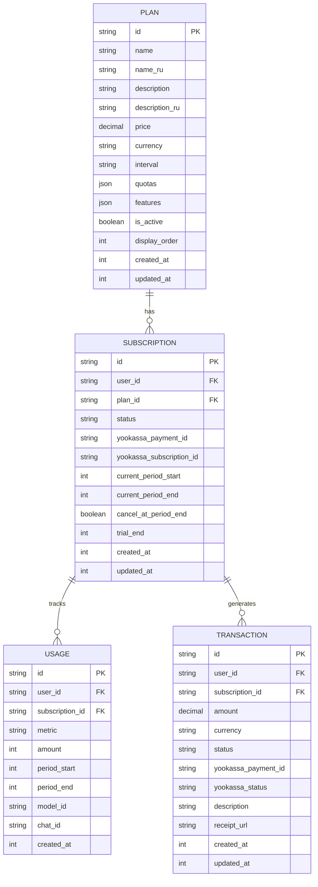
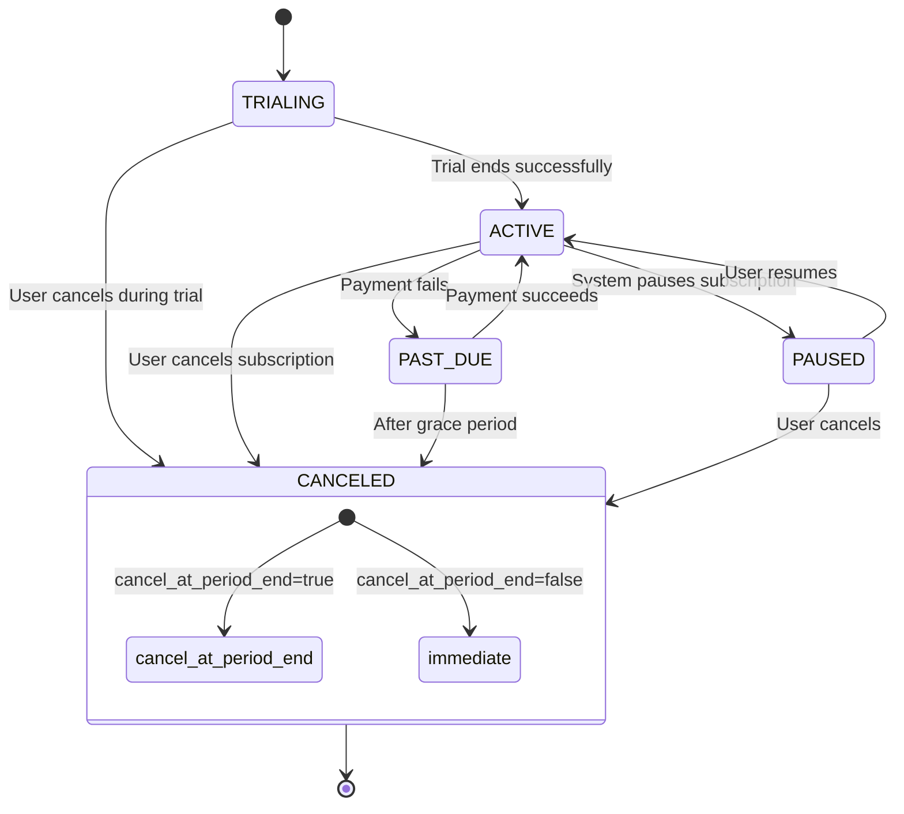
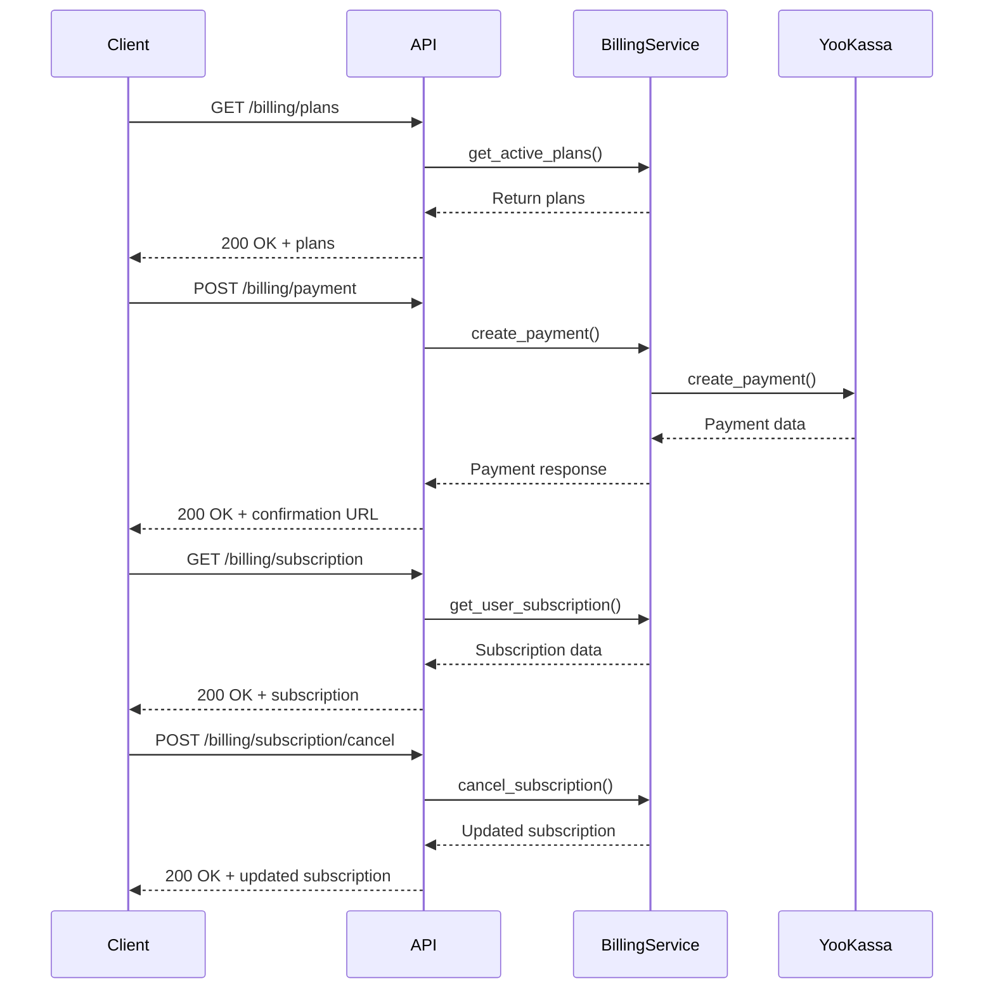
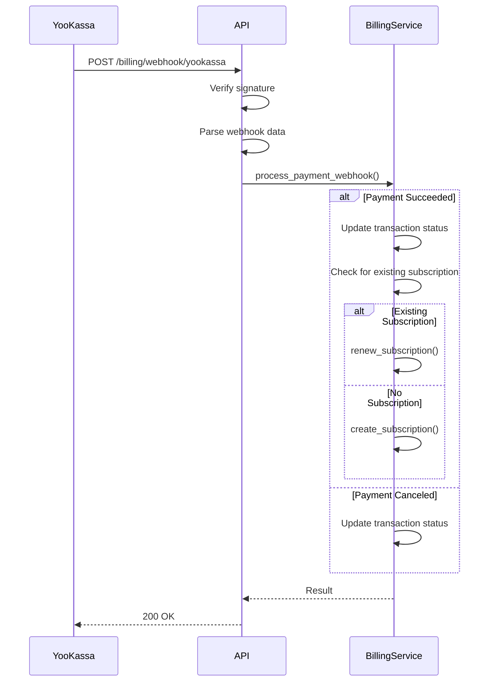
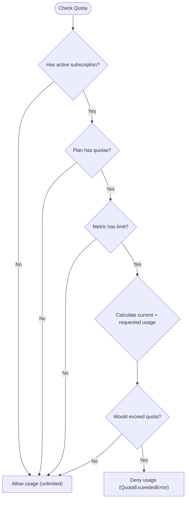

# Subscriptions API

<cite>
**Referenced Files in This Document**   
- [billing.py](file://backend/open_webui/routers/billing.py)
- [admin_billing.py](file://backend/open_webui/routers/admin_billing.py)
- [models/billing.py](file://backend/open_webui/models/billing.py)
- [utils/billing.py](file://backend/open_webui/utils/billing.py)
- [utils/yookassa.py](file://backend/open_webui/utils/yookassa.py)
- [billing/index.ts](file://src/lib/apis/billing/index.ts)
</cite>

## Table of Contents
1. [Introduction](#introduction)
2. [Subscription Data Model](#subscription-data-model)
3. [Subscription Status Workflow](#subscription-status-workflow)
4. [API Endpoints](#api-endpoints)
5. [Payment Integration with YooKassa](#payment-integration-with-yookassa)
6. [Usage Tracking and Quota Management](#usage-tracking-and-quota-management)
7. [Security Considerations](#security-considerations)
8. [Error Handling](#error-handling)
9. [Examples](#examples)
10. [Trial Period Management](#trial-period-management)

## Introduction
The Subscriptions API provides a comprehensive system for managing user subscriptions within the Open WebUI platform. This API enables users to subscribe to various plans, manage their subscription status, and track usage against allocated quotas. The system integrates with the YooKassa payment provider for handling recurring payments and subscription lifecycle events. This documentation covers all aspects of the subscription management system, including data models, API endpoints, payment integration, and usage tracking.

**Section sources**
- [billing.py](file://backend/open_webui/routers/billing.py#L1-L413)
- [models/billing.py](file://backend/open_webui/models/billing.py#L1-L524)

## Subscription Data Model
The subscription system is built around several core data models that define the structure of plans, subscriptions, usage, and transactions.

### Plan Model
The Plan model defines the available subscription tiers with their pricing, quotas, and features.

**Fields:**
- `id`: Unique identifier for the plan
- `name`: Plan name (e.g., "Free", "Pro", "Business")
- `name_ru`: Russian name (optional)
- `description`: Plan description
- `description_ru`: Russian description (optional)
- `price`: Price in the specified currency
- `currency`: Currency code (default: RUB)
- `interval`: Billing interval ("month", "year")
- `quotas`: JSON object defining usage limits (tokens_input, tokens_output, requests, etc.)
- `features`: Array of available features
- `is_active`: Whether the plan is currently available
- `display_order`: Order for UI display
- `created_at`: Timestamp of creation
- `updated_at`: Timestamp of last update

### Subscription Model
The Subscription model tracks individual user subscriptions.

**Fields:**
- `id`: Unique identifier for the subscription
- `user_id`: Reference to the user
- `plan_id`: Reference to the subscribed plan
- `status`: Current subscription status (active, canceled, trialing, etc.)
- `yookassa_payment_id`: YooKassa payment identifier
- `yookassa_subscription_id`: YooKassa subscription identifier
- `current_period_start`: Start timestamp of current billing period
- `current_period_end`: End timestamp of current billing period
- `cancel_at_period_end`: Flag indicating if subscription should cancel at period end
- `trial_end`: Timestamp when trial period ends (if applicable)
- `created_at`: Timestamp of subscription creation
- `updated_at`: Timestamp of last update

### Usage Model
The Usage model tracks user consumption of resources.

**Fields:**
- `id`: Unique identifier
- `user_id`: Reference to the user
- `subscription_id`: Reference to the subscription
- `metric`: Usage metric type (tokens_input, tokens_output, requests, etc.)
- `amount`: Amount consumed
- `period_start`: Start of usage period
- `period_end`: End of usage period
- `model_id`: AI model used (optional)
- `chat_id`: Related chat (optional)
- `created_at`: Timestamp of record creation

### Transaction Model
The Transaction model records payment history.

**Fields:**
- `id`: Unique identifier
- `user_id`: Reference to the user
- `subscription_id`: Reference to the subscription
- `amount`: Payment amount
- `currency`: Currency code
- `status`: Transaction status (pending, succeeded, failed, canceled)
- `yookassa_payment_id`: YooKassa payment identifier
- `yookassa_status`: YooKassa status
- `description`: Payment description
- `receipt_url`: URL to payment receipt
- `created_at`: Timestamp of transaction
- `updated_at`: Timestamp of last update



**Diagram sources**
- [models/billing.py](file://backend/open_webui/models/billing.py#L54-L140)
- [models/billing.py](file://backend/open_webui/models/billing.py#L112-L140)
- [models/billing.py](file://backend/open_webui/models/billing.py#L176-L199)
- [models/billing.py](file://backend/open_webui/models/billing.py#L231-L260)

## Subscription Status Workflow
The subscription system implements a comprehensive status workflow that manages the lifecycle of user subscriptions.

### Status States
The SubscriptionStatus enum defines the following states:
- `ACTIVE`: Subscription is active and user has full access
- `CANCELED`: Subscription has been canceled
- `PAST_DUE`: Payment is overdue
- `TRIALING`: User is in trial period
- `PAUSED`: Subscription is temporarily paused

### Status Transitions
The system manages status transitions based on user actions and payment events:



**Diagram sources**
- [models/billing.py](file://backend/open_webui/models/billing.py#L26-L31)
- [utils/billing.py](file://backend/open_webui/utils/billing.py#L96-L100)

## API Endpoints
The Subscriptions API provides a comprehensive set of endpoints for managing subscription lifecycle.

### Plans Endpoints
These endpoints allow retrieval of available subscription plans.

#### GET /billing/plans
Retrieve all active subscription plans.

**Response:** `Array<PlanModel>`

#### GET /billing/plans/{plan_id}
Retrieve a specific plan by ID.

**Response:** `PlanModel` or 404 Not Found

### Subscription Endpoints
These endpoints manage user subscriptions.

#### GET /billing/subscription
Retrieve the current user's subscription.

**Response:** `SubscriptionModel` or null if no active subscription

#### POST /billing/subscription/cancel
Cancel the current user's subscription.

**Request Body:**
```json
{
  "immediate": false
}
```

**Parameters:**
- `immediate`: If true, cancel immediately; if false, cancel at period end

**Response:** Updated `SubscriptionModel`

### Payment Endpoints
These endpoints handle payment processing for subscriptions.

#### POST /billing/payment
Create a payment for a subscription.

**Request Body:**
```json
{
  "plan_id": "string",
  "return_url": "string"
}
```

**Response:**
```json
{
  "transaction_id": "string",
  "payment_id": "string",
  "confirmation_url": "string",
  "status": "string"
}
```

#### GET /billing/transactions
Retrieve the current user's transaction history.

**Query Parameters:**
- `limit`: Number of transactions to return (default: 50)
- `skip`: Number of transactions to skip (default: 0)

**Response:** `Array<TransactionModel>`

### Usage Endpoints
These endpoints provide usage tracking and quota information.

#### GET /billing/usage/{metric}
Retrieve current usage for a specific metric.

**Path Parameters:**
- `metric`: Usage metric (tokens_input, tokens_output, requests, etc.)

**Response:**
```json
{
  "metric": "string",
  "current_usage": 0,
  "quota_limit": 0,
  "remaining": 0
}
```

#### POST /billing/usage/check
Check if a user can use a specified amount without exceeding their quota.

**Request Body:**
```json
{
  "metric": "string",
  "amount": 1
}
```

**Response:**
```json
{
  "allowed": true,
  "current_usage": 0,
  "quota_limit": 0,
  "remaining": 0
}
```

#### GET /billing/me
Retrieve complete billing information for the current user.

**Response:**
```json
{
  "subscription": "SubscriptionModel",
  "plan": "PlanModel",
  "usage": {
    "metric": {
      "current": 0,
      "limit": 0
    }
  },
  "transactions": ["TransactionModel"]
}
```



**Diagram sources**
- [billing.py](file://backend/open_webui/routers/billing.py#L84-L110)
- [billing.py](file://backend/open_webui/routers/billing.py#L144-L174)
- [billing.py](file://backend/open_webui/routers/billing.py#L182-L211)
- [billing.py](file://backend/open_webui/routers/billing.py#L214-L232)
- [billing.py](file://backend/open_webui/routers/billing.py#L239-L337)
- [billing.py](file://backend/open_webui/routers/billing.py#L344-L355)

## Payment Integration with YooKassa
The subscription system integrates with YooKassa for payment processing and subscription management.

### YooKassa Client
The YooKassaClient class handles all interactions with the YooKassa API.

**Key Methods:**
- `create_payment()`: Create a new payment
- `get_payment()`: Retrieve payment information
- `capture_payment()`: Capture an authorized payment
- `cancel_payment()`: Cancel a payment
- `create_refund()`: Create a refund
- `get_refund()`: Retrieve refund information
- `verify_webhook()`: Verify webhook signatures

### Webhook Integration
The system implements a webhook endpoint to receive payment status updates from YooKassa.

#### POST /billing/webhook/yookassa
Process payment webhook notifications from YooKassa.

**Headers:**
- `x_yookassa_signature`: Webhook signature for verification

**Processing Flow:**
1. Verify webhook signature
2. Parse webhook data
3. Update transaction status
4. Process payment events (succeeded, canceled, etc.)
5. Create or renew subscriptions as needed



**Diagram sources**
- [utils/yookassa.py](file://backend/open_webui/utils/yookassa.py#L38-L355)
- [billing.py](file://backend/open_webui/routers/billing.py#L363-L412)

## Usage Tracking and Quota Management
The system implements comprehensive usage tracking and quota enforcement to manage resource consumption.

### Usage Tracking
The system tracks usage across multiple metrics:
- `TOKENS_INPUT`: Input tokens consumed
- `TOKENS_OUTPUT`: Output tokens generated
- `REQUESTS`: API requests made
- `IMAGES`: Images generated
- `AUDIO_MINUTES`: Audio processing minutes

### Quota Enforcement
The system enforces quotas based on the user's subscription plan.

#### Quota Checking Logic


**Diagram sources**
- [utils/billing.py](file://backend/open_webui/utils/billing.py#L311-L351)
- [billing.py](file://backend/open_webui/routers/billing.py#L259-L322)

## Security Considerations
The subscription system implements several security measures to protect sensitive data and prevent abuse.

### Authentication
All subscription endpoints require authentication via Bearer token. The system uses the `get_verified_user` dependency to ensure only authenticated users can access subscription data.

### Data Protection
- Payment identifiers (yookassa_payment_id, yookassa_subscription_id) are stored securely
- Transaction details are encrypted at rest
- Webhook signatures are verified to prevent spoofing

### Rate Limiting
The system implements rate limiting on subscription endpoints to prevent abuse and ensure fair usage of resources.

### Input Validation
All API inputs are validated using Pydantic models to prevent injection attacks and ensure data integrity.

**Section sources**
- [billing.py](file://backend/open_webui/routers/billing.py#L10-L29)
- [utils/billing.py](file://backend/open_webui/utils/billing.py#L294-L338)

## Error Handling
The system implements comprehensive error handling for subscription operations.

### Common Error Responses
- `400 Bad Request`: Invalid input parameters
- `401 Unauthorized`: Invalid or missing authentication
- `404 Not Found`: Resource not found
- `429 Too Many Requests`: Quota exceeded
- `500 Internal Server Error`: System error
- `503 Service Unavailable`: Payment system temporarily unavailable

### Specific Error Conditions
- **Plan Not Found**: When requesting a non-existent plan
- **No Active Subscription**: When attempting to cancel a non-existent subscription
- **Invalid Metric**: When requesting usage for an unsupported metric
- **Quota Exceeded**: When usage would exceed plan limits
- **Payment System Error**: When YooKassa integration fails

**Section sources**
- [billing.py](file://backend/open_webui/routers/billing.py#L90-L95)
- [billing.py](file://backend/open_webui/routers/billing.py#L102-L106)
- [billing.py](file://backend/open_webui/routers/billing.py#L195-L211)

## Examples
This section provides practical examples of API usage for common subscription scenarios.

### Subscribe a User to a Plan
```javascript
// Create payment for Pro plan
const paymentResponse = await fetch('/billing/payment', {
  method: 'POST',
  headers: {
    'Authorization': `Bearer ${token}`,
    'Content-Type': 'application/json'
  },
  body: JSON.stringify({
    plan_id: 'pro_monthly',
    return_url: 'https://example.com/billing/success'
  })
});

// Response
{
  "transaction_id": "txn_123",
  "payment_id": "pay_456",
  "confirmation_url": "https://yookassa.ru/confirm/789",
  "status": "pending"
}
```

### Update Subscription Status
```javascript
// Cancel subscription at period end
const cancelResponse = await fetch('/billing/subscription/cancel', {
  method: 'POST',
  headers: {
    'Authorization': `Bearer ${token}`,
    'Content-Type': 'application/json'
  },
  body: JSON.stringify({
    immediate: false
  })
});

// Response contains updated subscription with cancel_at_period_end = true
```

### Retrieve Subscription Details
```javascript
// Get current subscription
const subscription = await fetch('/billing/subscription', {
  headers: {
    'Authorization': `Bearer ${token}`
  }
});

// Get complete billing information
const billingInfo = await fetch('/billing/me', {
  headers: {
    'Authorization': `Bearer ${token}`
  }
});
```

**Section sources**
- [billing/index.ts](file://src/lib/apis/billing/index.ts#L194-L227)
- [billing/index.ts](file://src/lib/apis/billing/index.ts#L161-L190)
- [billing/index.ts](file://src/lib/apis/billing/index.ts#L134-L159)

## Trial Period Management
The system supports trial periods for new subscriptions, allowing users to test premium features before committing to payment.

### Trial Period Implementation
When creating a subscription with trial days:
1. Set status to `TRIALING`
2. Set `trial_end` timestamp
3. Set `current_period_end` to trial end
4. During trial, user has full access to plan features
5. At trial end, subscription automatically transitions to `ACTIVE` status upon successful payment

### Trial Period Endpoints
The system automatically manages trial periods through the standard subscription endpoints. No special endpoints are required for trial management.

### Trial Period Considerations
- Trials are only available for new subscriptions
- Users cannot extend trial periods
- If payment fails at trial end, subscription is canceled
- Usage during trial counts toward quotas

**Section sources**
- [utils/billing.py](file://backend/open_webui/utils/billing.py#L103-L138)
- [models/billing.py](file://backend/open_webui/models/billing.py#L134-L135)