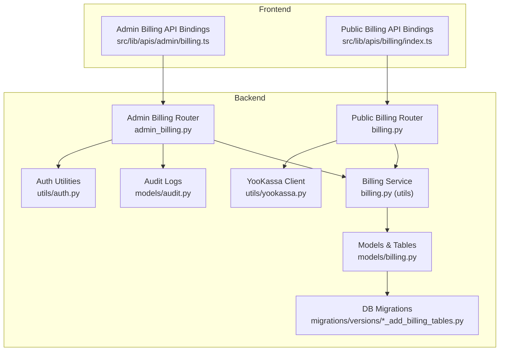
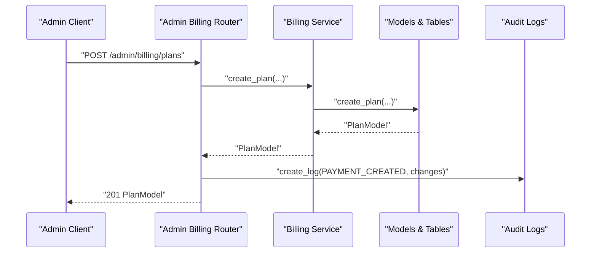
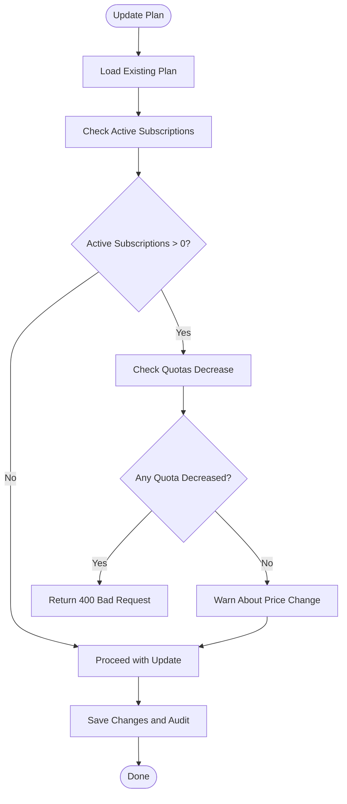
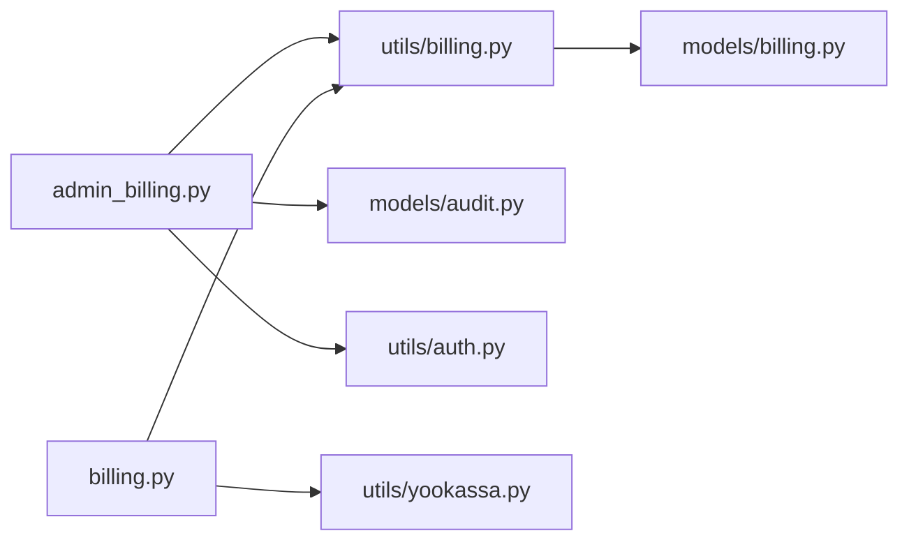

# Billing Plans API

<cite>
**Referenced Files in This Document**
- [admin_billing.py](file://backend/open_webui/routers/admin_billing.py)
- [billing.py](file://backend/open_webui/routers/billing.py)
- [billing.py](file://backend/open_webui/models/billing.py)
- [billing.py](file://backend/open_webui/utils/billing.py)
- [audit.py](file://backend/open_webui/models/audit.py)
- [auth.py](file://backend/open_webui/utils/auth.py)
- [yookassa.py](file://backend/open_webui/utils/yookassa.py)
- [billing.ts](file://src/lib/apis/admin/billing.ts)
- [billing.ts](file://src/lib/apis/billing/index.ts)
- [b2f8a9c1d5e3_add_billing_tables.py](file://backend/open_webui/migrations/versions/b2f8a9c1d5e3_add_billing_tables.py)
</cite>

## Table of Contents
1. [Introduction](#introduction)
2. [Project Structure](#project-structure)
3. [Core Components](#core-components)
4. [Architecture Overview](#architecture-overview)
5. [Detailed Component Analysis](#detailed-component-analysis)
6. [Dependency Analysis](#dependency-analysis)
7. [Performance Considerations](#performance-considerations)
8. [Troubleshooting Guide](#troubleshooting-guide)
9. [Conclusion](#conclusion)
10. [Appendices](#appendices)

## Introduction
This document provides comprehensive API documentation for the billing plans administration endpoints. It covers all CRUD operations for subscription plans, including creation, reading, updating, and deletion. It details request/response schemas for CreatePlanRequest, UpdatePlanRequest, and PlanStatsModel, along with field validations and constraints. It explains the business logic behind plan validation, especially restrictions on modifying plans with active subscriptions. It also documents analytics capabilities, including Monthly Recurring Revenue (MRR) calculations across different billing intervals, and provides examples for creating new plans, updating existing plans with change detection, and retrieving plan statistics with subscriber counts. The audit logging mechanism that tracks administrative actions is explained, and the security model requiring admin authentication is documented. Guidance on error handling for common scenarios, such as attempting to delete a plan with active subscribers, is included.

## Project Structure
The billing system spans backend routers, models, services, and migrations, plus frontend API bindings. Administrative endpoints are under the admin billing router, while public billing endpoints are under the billing router. The billing service encapsulates business logic, and audit logs track administrative actions. Payment integration uses YooKassa.

**Diagram sources**
- [admin_billing.py](file://backend/open_webui/routers/admin_billing.py#L1-L558)
- [billing.py](file://backend/open_webui/routers/billing.py#L1-L413)
- [billing.py](file://backend/open_webui/utils/billing.py#L1-L566)
- [billing.py](file://backend/open_webui/models/billing.py#L1-L524)
- [audit.py](file://backend/open_webui/models/audit.py#L1-L137)
- [auth.py](file://backend/open_webui/utils/auth.py#L403-L419)
- [yookassa.py](file://backend/open_webui/utils/yookassa.py#L1-L355)
- [b2f8a9c1d5e3_add_billing_tables.py](file://backend/open_webui/migrations/versions/b2f8a9c1d5e3_add_billing_tables.py#L1-L188)

**Section sources**
- [admin_billing.py](file://backend/open_webui/routers/admin_billing.py#L1-L558)
- [billing.py](file://backend/open_webui/routers/billing.py#L1-L413)
- [billing.py](file://backend/open_webui/utils/billing.py#L1-L566)
- [billing.py](file://backend/open_webui/models/billing.py#L1-L524)
- [audit.py](file://backend/open_webui/models/audit.py#L1-L137)
- [auth.py](file://backend/open_webui/utils/auth.py#L403-L419)
- [yookassa.py](file://backend/open_webui/utils/yookassa.py#L1-L355)
- [b2f8a9c1d5e3_add_billing_tables.py](file://backend/open_webui/migrations/versions/b2f8a9c1d5e3_add_billing_tables.py#L1-L188)

## Core Components
- Admin Billing Router: Provides plan CRUD, plan statistics, subscribers listing, and plan duplication/toggle endpoints. Enforces admin authentication and audit logging.
- Public Billing Router: Provides plan listing, subscription management, payment creation, usage checks, and billing info.
- Billing Service: Encapsulates business logic for plans, subscriptions, usage tracking, quotas, and payment processing.
- Models and Tables: SQLAlchemy models and Pydantic models for plans, subscriptions, usage, transactions, and audit logs.
- Audit Logs: Tracks administrative actions on plans with detailed change metadata.
- Authentication: Admin-only endpoints require admin role; verified user endpoints require authenticated users.
- Payment Integration: YooKassa client handles payment creation, capture, cancellation, refunds, and webhook verification.

**Section sources**
- [admin_billing.py](file://backend/open_webui/routers/admin_billing.py#L1-L558)
- [billing.py](file://backend/open_webui/routers/billing.py#L1-L413)
- [billing.py](file://backend/open_webui/utils/billing.py#L1-L566)
- [billing.py](file://backend/open_webui/models/billing.py#L1-L524)
- [audit.py](file://backend/open_webui/models/audit.py#L1-L137)
- [auth.py](file://backend/open_webui/utils/auth.py#L403-L419)
- [yookassa.py](file://backend/open_webui/utils/yookassa.py#L1-L355)

## Architecture Overview
The admin billing endpoints are protected and operate on plan data with strict validation and audit logging. Public billing endpoints handle user-facing operations like plan selection, subscription lifecycle, and usage checks. Payment processing integrates with YooKassa, including webhook handling.

**Diagram sources**
- [admin_billing.py](file://backend/open_webui/routers/admin_billing.py#L205-L262)
- [billing.py](file://backend/open_webui/utils/billing.py#L58-L83)
- [billing.py](file://backend/open_webui/models/billing.py#L297-L349)
- [audit.py](file://backend/open_webui/models/audit.py#L83-L115)

## Detailed Component Analysis

### Admin Billing Endpoints (Plan CRUD and Analytics)
- GET /admin/billing/plans: Returns all plans with subscription statistics and MRR. Sorting by display order.
- POST /admin/billing/plans: Creates a new plan. Generates ID if not provided; validates uniqueness; logs audit.
- GET /admin/billing/plans/{plan_id}: Retrieves a plan by ID (including inactive).
- PUT /admin/billing/plans/{plan_id}: Updates an existing plan. Validates business rules for active subscriptions; detects changes for audit.
- DELETE /admin/billing/plans/{plan_id}: Deletes a plan only if no active subscriptions; otherwise returns error.
- PATCH /admin/billing/plans/{plan_id}/toggle: Toggles plan active/inactive status; logs audit.
- POST /admin/billing/plans/{plan_id}/duplicate: Duplicates an existing plan with a new ID; starts inactive; logs audit.
- GET /admin/billing/plans/{plan_id}/subscribers: Paginated list of subscribers to a plan; enforces pagination limits.

Key validations and constraints:
- CreatePlanRequest fields include name, name_ru, description, description_ru, price, currency (RUB/USD/EUR), interval (day/week/month/year), quotas, features, is_active, display_order.
- UpdatePlanRequest allows partial updates; enforces stricter rules when plan has active subscriptions:
  - Cannot decrease quotas for active subscriptions.
  - Price changes are allowed but logged as warnings.
- Delete plan disallows deletion if active subscriptions exist; suggests deactivating instead.

MRR calculation logic:
- Month: MRR = price × active_subscriptions
- Year: MRR = (price / 12) × active_subscriptions
- Week: MRR ≈ price × 4.33 × active_subscriptions
- Day: MRR ≈ price × 30 × active_subscriptions

Audit logging:
- Logs PLAN_CREATED, PLAN_UPDATED, PLAN_DELETED, PLAN_ACTIVATED, PLAN_DEACTIVATED, PLAN_DUPLICATED with entity_id, description, and changes metadata.

Security model:
- All admin endpoints require admin role via get_admin_user dependency.

**Section sources**
- [admin_billing.py](file://backend/open_webui/routers/admin_billing.py#L159-L558)
- [admin_billing.py](file://backend/open_webui/routers/admin_billing.py#L109-L141)
- [admin_billing.py](file://backend/open_webui/routers/admin_billing.py#L142-L153)
- [audit.py](file://backend/open_webui/models/audit.py#L19-L27)
- [auth.py](file://backend/open_webui/utils/auth.py#L412-L419)

### Public Billing Endpoints (Usage, Payments, Subscription)
- GET /billing/plans: Returns active plans for users.
- GET /billing/plans/{plan_id}: Returns a specific plan by ID.
- POST /billing/payment: Creates a payment for a plan via YooKassa; returns transaction_id, payment_id, confirmation_url, status.
- GET /billing/transactions: Returns user’s transaction history.
- GET /billing/usage/{metric}: Returns current usage for a metric with quota limit and remaining.
- POST /billing/usage/check: Checks if a specified amount can be used without exceeding quota.
- GET /billing/me: Returns user’s billing info including subscription, plan, usage, and transactions.
- POST /billing/subscription/cancel: Cancels user’s subscription (immediate or at period end).
- POST /billing/webhook/yookassa: Processes YooKassa webhooks; verifies signature; updates transactions and creates/renews subscriptions.

Payment flow:
- Payment creation stores a pending transaction and calls YooKassa to create a payment with metadata including user_id and plan_id.
- Webhook processing updates transaction status and either creates a new subscription or renews an existing one.

**Section sources**
- [billing.py](file://backend/open_webui/routers/billing.py#L84-L137)
- [billing.py](file://backend/open_webui/routers/billing.py#L144-L175)
- [billing.py](file://backend/open_webui/routers/billing.py#L182-L212)
- [billing.py](file://backend/open_webui/routers/billing.py#L214-L232)
- [billing.py](file://backend/open_webui/routers/billing.py#L239-L285)
- [billing.py](file://backend/open_webui/routers/billing.py#L287-L337)
- [billing.py](file://backend/open_webui/routers/billing.py#L344-L356)
- [billing.py](file://backend/open_webui/routers/billing.py#L363-L413)
- [billing.py](file://backend/open_webui/utils/billing.py#L374-L447)
- [billing.py](file://backend/open_webui/utils/billing.py#L448-L524)
- [yookassa.py](file://backend/open_webui/utils/yookassa.py#L262-L294)

### Data Models and Schemas

#### CreatePlanRequest (Admin)
- Fields: id (optional), name, name_ru, description, description_ru, price (>=0), currency (RUB/USD/EUR), interval (day/week/month/year), quotas (dict), features (list), is_active, display_order (>=0).
- Validation: Pydantic constraints enforced in admin router.

**Section sources**
- [admin_billing.py](file://backend/open_webui/routers/admin_billing.py#L31-L48)

#### UpdatePlanRequest (Admin)
- Fields: name, name_ru, description, description_ru, price (>=0), currency (RUB/USD/EUR), interval (day/week/month/year), quotas, features, is_active, display_order (>=0).
- Validation: Partial updates allowed; business rules enforced during update.

**Section sources**
- [admin_billing.py](file://backend/open_webui/routers/admin_billing.py#L49-L64)

#### PlanStatsModel (Admin)
- Fields: plan (PlanModel), active_subscriptions (int), canceled_subscriptions (int), total_subscriptions (int), mrr (float).
- Calculation: MRR computed based on plan interval and active subscription count.

**Section sources**
- [admin_billing.py](file://backend/open_webui/routers/admin_billing.py#L66-L73)

#### PlanModel (Shared)
- Fields: id, name, name_ru, description, description_ru, price (float), currency (string), interval (string), quotas (dict), features (list), is_active (bool), display_order (int), plan_extra_metadata (dict), created_at (int), updated_at (int).

**Section sources**
- [billing.py](file://backend/open_webui/models/billing.py#L83-L104)

#### SubscriptionModel (Shared)
- Fields: id, user_id, plan_id, status, yookassa_payment_id, yookassa_subscription_id, current_period_start, current_period_end, cancel_at_period_end (bool), trial_end (int), extra_metadata (dict), created_at (int), updated_at (int).

**Section sources**
- [billing.py](file://backend/open_webui/models/billing.py#L147-L169)

#### TransactionModel (Shared)
- Fields: id, user_id, subscription_id, amount (float), currency (string), status, yookassa_payment_id, yookassa_status, description, description_ru, receipt_url, extra_metadata, created_at (int), updated_at (int).

**Section sources**
- [billing.py](file://backend/open_webui/models/billing.py#L267-L289)

#### UsageModel (Shared)
- Fields: id, user_id, subscription_id, metric (string), amount (int), period_start, period_end, model_id, chat_id, extra_metadata, created_at (int).

**Section sources**
- [billing.py](file://backend/open_webui/models/billing.py#L206-L224)

#### AuditLogModel (Shared)
- Fields: id, user_id, action (string), entity_type (string), entity_id (string), description (string), changes (dict), audit_metadata (dict), created_at (int).

**Section sources**
- [audit.py](file://backend/open_webui/models/audit.py#L64-L75)

### Business Logic and Validations

#### Plan Update Validation
- If a plan has active subscriptions, quotas cannot be decreased; attempts to do so return a 400 error with a descriptive message.
- Price changes are permitted but logged as warnings.

**Diagram sources**
- [admin_billing.py](file://backend/open_webui/routers/admin_billing.py#L109-L141)

**Section sources**
- [admin_billing.py](file://backend/open_webui/routers/admin_billing.py#L109-L141)

#### MRR Calculation Across Intervals
- Month: MRR = price × active_subscriptions
- Year: MRR = (price / 12) × active_subscriptions
- Week: MRR ≈ price × 4.33 × active_subscriptions
- Day: MRR ≈ price × 30 × active_subscriptions

**Section sources**
- [admin_billing.py](file://backend/open_webui/routers/admin_billing.py#L172-L182)

### Audit Logging Mechanism
- Admin actions are logged with action type, entity type/id, description, and changes metadata.
- Supported actions include plan creation, update, deletion, activation/deactivation, and duplication.

**Section sources**
- [audit.py](file://backend/open_webui/models/audit.py#L19-L27)
- [audit.py](file://backend/open_webui/models/audit.py#L83-L115)
- [admin_billing.py](file://backend/open_webui/routers/admin_billing.py#L241-L251)
- [admin_billing.py](file://backend/open_webui/routers/admin_billing.py#L318-L328)
- [admin_billing.py](file://backend/open_webui/routers/admin_billing.py#L368-L378)
- [admin_billing.py](file://backend/open_webui/routers/admin_billing.py#L407-L418)
- [admin_billing.py](file://backend/open_webui/routers/admin_billing.py#L466-L476)

### Security Model
- Admin endpoints require admin role via get_admin_user dependency.
- Public endpoints require authenticated users via get_verified_user dependency.

**Section sources**
- [auth.py](file://backend/open_webui/utils/auth.py#L403-L419)
- [billing.py](file://backend/open_webui/routers/billing.py#L84-L108)
- [admin_billing.py](file://backend/open_webui/routers/admin_billing.py#L205-L262)

### Error Handling
Common scenarios and responses:
- Attempting to delete a plan with active subscriptions: Returns 400 with a message suggesting deactivation instead.
- Non-existent plan ID: Returns 404 Not Found.
- Invalid metric in usage endpoints: Returns 400 Bad Request.
- Payment system errors: Returns 503 Service Unavailable for temporary failures.
- Webhook signature verification failure: Returns 401 Unauthorized.

**Section sources**
- [admin_billing.py](file://backend/open_webui/routers/admin_billing.py#L356-L364)
- [billing.py](file://backend/open_webui/routers/billing.py#L98-L108)
- [billing.py](file://backend/open_webui/routers/billing.py#L246-L253)
- [billing.py](file://backend/open_webui/routers/billing.py#L195-L205)
- [billing.py](file://backend/open_webui/routers/billing.py#L383-L386)
- [yookassa.py](file://backend/open_webui/utils/yookassa.py#L262-L294)

### Examples

#### Creating a New Plan (Admin)
- Endpoint: POST /admin/billing/plans
- Request body includes name, price, interval, quotas, features, is_active, display_order, and optional localized fields.
- Response: PlanModel with generated id and timestamps.

**Section sources**
- [admin_billing.py](file://backend/open_webui/routers/admin_billing.py#L205-L262)
- [billing.ts](file://src/lib/apis/admin/billing.ts#L134-L163)

#### Updating an Existing Plan (Admin)
- Endpoint: PUT /admin/billing/plans/{plan_id}
- Request body includes only fields to change (partial updates).
- Validation: Enforces no quota decreases if active subscriptions exist; logs changes.

**Section sources**
- [admin_billing.py](file://backend/open_webui/routers/admin_billing.py#L286-L339)
- [admin_billing.py](file://backend/open_webui/routers/admin_billing.py#L142-L153)
- [billing.ts](file://src/lib/apis/admin/billing.ts#L165-L195)

#### Retrieving Plan Statistics with Subscriber Counts (Admin)
- Endpoint: GET /admin/billing/plans
- Response: List of PlanStatsModel with active_subscriptions, canceled_subscriptions, total_subscriptions, and mrr.

**Section sources**
- [admin_billing.py](file://backend/open_webui/routers/admin_billing.py#L159-L196)
- [billing.ts](file://src/lib/apis/admin/billing.ts#L80-L105)

#### Deleting a Plan (Admin)
- Endpoint: DELETE /admin/billing/plans/{plan_id}
- Constraints: Fails if plan has active subscriptions; returns success message upon deletion.

**Section sources**
- [admin_billing.py](file://backend/open_webui/routers/admin_billing.py#L341-L388)
- [billing.ts](file://src/lib/apis/admin/billing.ts#L197-L222)

#### Retrieving Plan Subscribers (Admin)
- Endpoint: GET /admin/billing/plans/{plan_id}/subscribers?page&page_size
- Response: PaginatedSubscribers with items, total, page, page_size, total_pages.

**Section sources**
- [admin_billing.py](file://backend/open_webui/routers/admin_billing.py#L489-L558)
- [billing.ts](file://src/lib/apis/admin/billing.ts#L278-L314)

## Dependency Analysis
The admin billing endpoints depend on the Billing Service for plan operations, on the audit logging module for administrative tracking, and on the authentication utilities for admin enforcement. Public billing endpoints depend on the Billing Service and YooKassa client for payment processing and webhook handling.

**Diagram sources**
- [admin_billing.py](file://backend/open_webui/routers/admin_billing.py#L1-L558)
- [billing.py](file://backend/open_webui/routers/billing.py#L1-L413)
- [billing.py](file://backend/open_webui/utils/billing.py#L1-L566)
- [billing.py](file://backend/open_webui/models/billing.py#L1-L524)
- [audit.py](file://backend/open_webui/models/audit.py#L1-L137)
- [auth.py](file://backend/open_webui/utils/auth.py#L403-L419)
- [yookassa.py](file://backend/open_webui/utils/yookassa.py#L1-L355)

**Section sources**
- [admin_billing.py](file://backend/open_webui/routers/admin_billing.py#L1-L558)
- [billing.py](file://backend/open_webui/routers/billing.py#L1-L413)
- [billing.py](file://backend/open_webui/utils/billing.py#L1-L566)
- [billing.py](file://backend/open_webui/models/billing.py#L1-L524)
- [audit.py](file://backend/open_webui/models/audit.py#L1-L137)
- [auth.py](file://backend/open_webui/utils/auth.py#L403-L419)
- [yookassa.py](file://backend/open_webui/utils/yookassa.py#L1-L355)

## Performance Considerations
- Indexes on billing tables (subscriptions, usage, transactions, audit logs) improve query performance for analytics and reporting.
- Pagination in subscribers endpoint prevents large payloads and excessive database load.
- Webhook processing returns 200 even on internal errors to avoid repeated retries from YooKassa.

[No sources needed since this section provides general guidance]

## Troubleshooting Guide
- Admin authentication failures: Ensure the client uses a valid admin token; endpoints return 401/403 for unauthorized access.
- Plan update failures due to active subscriptions: Increase quotas or create a new plan instead of decreasing existing quotas.
- Payment creation failures: Check YooKassa client initialization and network connectivity; retry after verifying credentials.
- Webhook signature verification failures: Verify webhook secret configuration and signature header correctness.

**Section sources**
- [auth.py](file://backend/open_webui/utils/auth.py#L412-L419)
- [admin_billing.py](file://backend/open_webui/routers/admin_billing.py#L109-L141)
- [billing.py](file://backend/open_webui/routers/billing.py#L195-L205)
- [yookassa.py](file://backend/open_webui/utils/yookassa.py#L262-L294)

## Conclusion
The billing plans administration API provides robust CRUD operations for subscription plans with strong validation, audit logging, and analytics. Admin endpoints enforce strict business rules to protect active subscribers, while public endpoints offer usage checks, payment processing, and billing information. The system integrates with YooKassa for secure payments and includes comprehensive logging for compliance and traceability.

[No sources needed since this section summarizes without analyzing specific files]

## Appendices

### Database Schema Overview
- billing_plan: Stores plan definitions with pricing, quotas, features, and metadata.
- billing_subscription: Tracks user subscriptions, statuses, and billing periods.
- billing_usage: Records usage metrics per user and period.
- billing_transaction: Stores payment transactions with provider metadata.
- billing_audit_log: Logs administrative actions with changes and metadata.

**Section sources**
- [b2f8a9c1d5e3_add_billing_tables.py](file://backend/open_webui/migrations/versions/b2f8a9c1d5e3_add_billing_tables.py#L18-L168)
- [billing.py](file://backend/open_webui/models/billing.py#L54-L204)
- [billing.py](file://backend/open_webui/models/billing.py#L231-L290)
- [audit.py](file://backend/open_webui/models/audit.py#L34-L62)