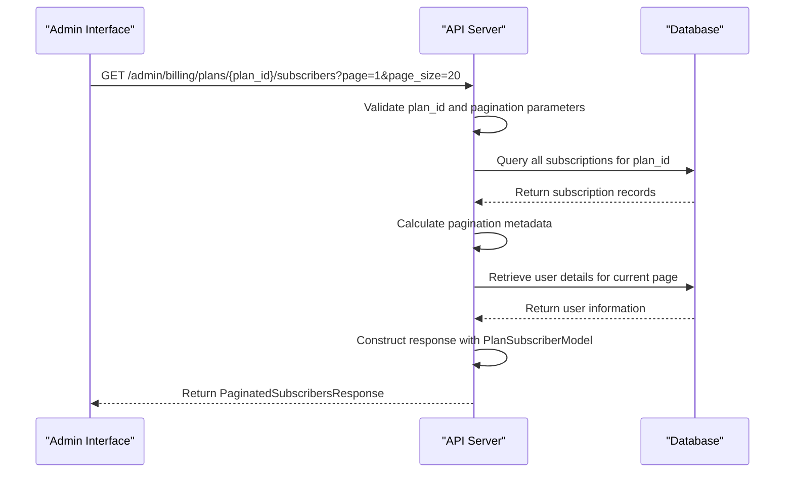
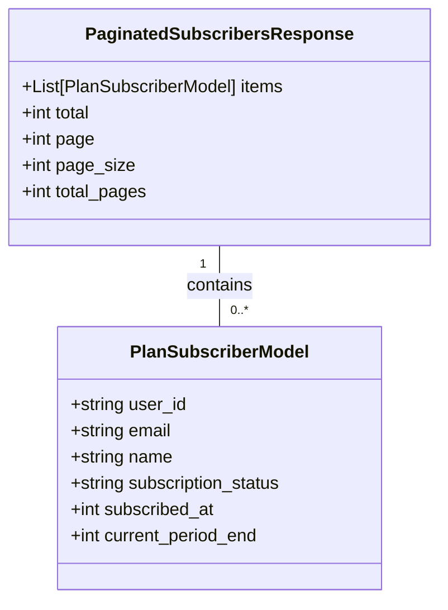
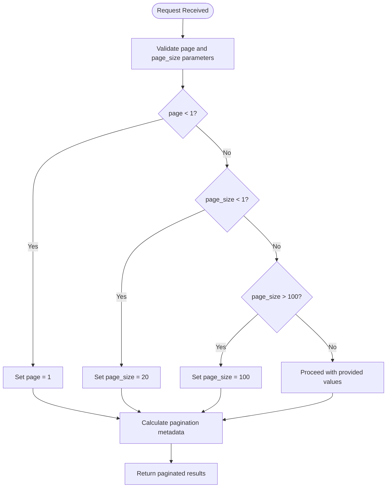
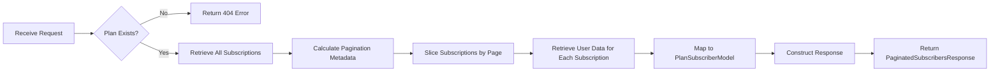
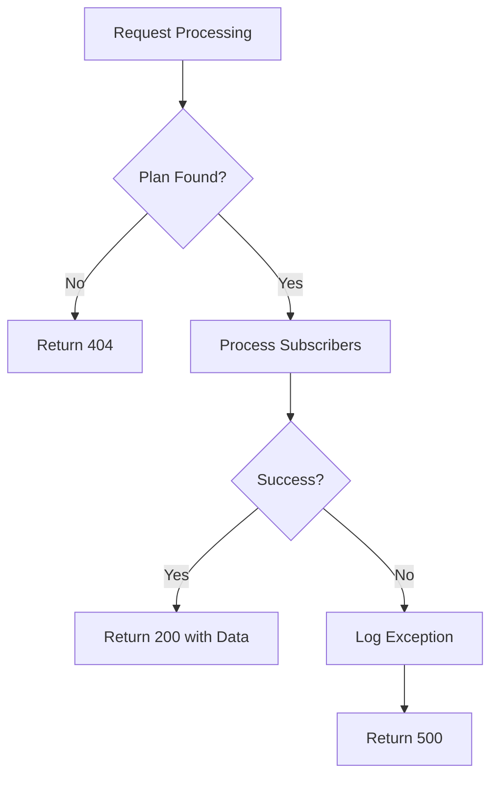

# Plan Subscribers Management

<cite>
**Referenced Files in This Document**   
- [admin_billing.py](file://backend/open_webui/routers/admin_billing.py)
- [billing.py](file://backend/open_webui/routers/billing.py)
- [billing.ts](file://src/lib/apis/admin/billing.ts)
- [models/billing.py](file://backend/open_webui/models/billing.py)
- [models/users.py](file://backend/open_webui/models/users.py)
</cite>

## Table of Contents
1. [Introduction](#introduction)
2. [API Endpoint Overview](#api-endpoint-overview)
3. [Response Model Structure](#response-model-structure)
4. [Pagination Parameters](#pagination-parameters)
5. [Data Retrieval Process](#data-retrieval-process)
6. [Subscription Information](#subscription-information)
7. [Error Handling](#error-handling)
8. [Performance Considerations](#performance-considerations)
9. [Usage Examples](#usage-examples)

## Introduction

The Plan Subscribers Management API provides administrators with the ability to retrieve paginated lists of users subscribed to specific billing plans. This documentation details the `GET /admin/billing/plans/{plan_id}/subscribers` endpoint that enables retrieval of subscriber information for analytics, reporting, and administrative purposes. The endpoint returns comprehensive subscriber data including user details, subscription status, and billing period information in a paginated format to manage large datasets efficiently.

**Section sources**
- [admin_billing.py](file://backend/open_webui/routers/admin_billing.py#L489-L558)

## API Endpoint Overview

The `GET /admin/billing/plans/{plan_id}/subscribers` endpoint provides paginated access to users subscribed to a specific billing plan. This administrative endpoint requires authentication and is designed for use by system administrators to monitor and analyze subscription patterns.

The endpoint accepts the following parameters:
- `plan_id` (path parameter): The unique identifier of the billing plan
- `page` (query parameter): The page number to retrieve (default: 1)
- `page_size` (query parameter): The number of items per page (default: 20)

The response follows a standardized pagination format that includes metadata about the total number of subscribers, current page, and total pages, along with the actual subscriber data for the requested page.



**Diagram sources**
- [admin_billing.py](file://backend/open_webui/routers/admin_billing.py#L489-L558)
- [models/billing.py](file://backend/open_webui/models/billing.py#L350-L413)

**Section sources**
- [admin_billing.py](file://backend/open_webui/routers/admin_billing.py#L489-L558)

## Response Model Structure

The endpoint returns data in the `PaginatedSubscribersResponse` model, which provides a standardized format for paginated results. This model contains both the subscriber data and pagination metadata.

### PaginatedSubscribersResponse Model

The response model includes the following fields:

| Field | Type | Description |
|-------|------|-------------|
| items | Array<PlanSubscriberModel> | List of subscriber objects for the current page |
| total | Integer | Total number of subscribers for the plan |
| page | Integer | Current page number |
| page_size | Integer | Number of items per page |
| total_pages | Integer | Total number of pages available |

### PlanSubscriberModel Fields

Each subscriber in the `items` array contains the following information:

| Field | Type | Description |
|-------|------|-------------|
| user_id | String | Unique identifier of the user |
| email | String | User's email address |
| name | String | User's display name |
| subscription_status | String | Current status of the subscription (e.g., "active", "canceled") |
| subscribed_at | Integer | Unix timestamp when the subscription was created |
| current_period_end | Integer | Unix timestamp when the current billing period ends |



**Diagram sources**
- [admin_billing.py](file://backend/open_webui/routers/admin_billing.py#L85-L92)
- [admin_billing.py](file://backend/open_webui/routers/admin_billing.py#L75-L83)

**Section sources**
- [admin_billing.py](file://backend/open_webui/routers/admin_billing.py#L74-L92)

## Pagination Parameters

The endpoint supports pagination through two query parameters that control the size and position of the data returned.

### Parameter Details

| Parameter | Type | Default | Constraints | Description |
|---------|------|---------|-------------|-------------|
| page | Integer | 1 | Minimum: 1 | Page number to retrieve (1-based indexing) |
| page_size | Integer | 20 | Minimum: 1, Maximum: 100 | Number of subscribers to include per page |

### Validation Rules

The endpoint enforces the following validation rules for pagination parameters:

- If `page` is less than 1, it defaults to 1
- If `page_size` is less than 1, it defaults to 20
- If `page_size` exceeds 100, it is capped at 100 to prevent abuse and ensure system performance

The maximum page size limit of 100 is implemented as a security measure to prevent denial-of-service attacks that could occur from requests for extremely large datasets. This limit ensures that the system remains responsive even under heavy load.



**Diagram sources**
- [admin_billing.py](file://backend/open_webui/routers/admin_billing.py#L498-L504)

**Section sources**
- [admin_billing.py](file://backend/open_webui/routers/admin_billing.py#L498-L504)

## Data Retrieval Process

The process of retrieving subscriber information involves joining subscription records with user data to provide a comprehensive view of subscribers for a specific billing plan.

### Retrieval Workflow

1. **Plan Validation**: The system first verifies that the specified `plan_id` exists in the database
2. **Subscription Retrieval**: All subscriptions associated with the plan are retrieved from the `billing_subscription` table
3. **Pagination Calculation**: The total number of pages is calculated based on the total subscriptions and requested page size
4. **Data Slicing**: The subscriptions are sliced according to the requested page and page size
5. **User Data Join**: For each subscription in the current page, the corresponding user information is retrieved from the users table
6. **Response Construction**: The subscriber data is formatted into the `PlanSubscriberModel` and included in the paginated response

The current implementation loads all subscriptions for a plan into memory before applying pagination. This approach ensures accurate pagination metadata but may impact performance with very large subscriber lists.



**Diagram sources**
- [admin_billing.py](file://backend/open_webui/routers/admin_billing.py#L507-L548)
- [models/billing.py](file://backend/open_webui/models/billing.py#L400-L412)

**Section sources**
- [admin_billing.py](file://backend/open_webui/routers/admin_billing.py#L507-L548)

## Subscription Information

The API exposes detailed subscription information that provides insights into user subscription patterns and billing cycles.

### Subscription Status

The `subscription_status` field indicates the current state of a user's subscription. Possible values include:
- `active`: The subscription is currently active and in good standing
- `canceled`: The subscription has been canceled by the user
- `past_due`: Payment is overdue for the subscription
- `trialing`: The user is in a trial period
- `paused`: The subscription has been temporarily paused

### Billing Period Information

The endpoint exposes two key timestamps related to the billing cycle:

- **subscribed_at**: The Unix timestamp indicating when the user initially subscribed to the plan. This represents the creation time of the subscription record.

- **current_period_end**: The Unix timestamp indicating when the current billing period will end. This is particularly useful for:
  - Determining when users will be billed next
  - Identifying subscriptions approaching renewal
  - Calculating the remaining duration of the current billing cycle

This information is valuable for analytics purposes, allowing administrators to track subscription trends, calculate churn rates, and forecast revenue.

**Section sources**
- [admin_billing.py](file://backend/open_webui/routers/admin_billing.py#L536-L539)
- [models/billing.py](file://backend/open_webui/models/billing.py#L129-L130)

## Error Handling

The endpoint implements comprehensive error handling to provide meaningful feedback for various error conditions.

### Error Types and Responses

| Error Condition | HTTP Status Code | Response Detail |
|----------------|------------------|-----------------|
| Invalid plan_id | 404 Not Found | "Plan '{plan_id}' not found" |
| System failure | 500 Internal Server Error | "Failed to get plan subscribers" |
| Invalid pagination parameters | Automatically corrected | Parameters are normalized to valid ranges |

When a requested `plan_id` does not exist, the endpoint returns a 404 status code with a descriptive message. For system-level failures such as database connectivity issues, a 500 status code is returned. The system automatically handles invalid pagination parameters by normalizing them to acceptable values rather than rejecting the request.

The error handling is implemented with proper exception logging to facilitate debugging while maintaining security by not exposing sensitive system information to clients.



**Diagram sources**
- [admin_billing.py](file://backend/open_webui/routers/admin_billing.py#L509-L512)
- [admin_billing.py](file://backend/open_webui/routers/admin_billing.py#L553-L557)

**Section sources**
- [admin_billing.py](file://backend/open_webui/routers/admin_billing.py#L509-L557)

## Performance Considerations

The current implementation has specific performance characteristics that should be considered when using the endpoint, particularly with large subscriber lists.

### Current Implementation Implications

The primary performance consideration is that the system loads all subscriptions for a plan into memory before applying pagination. This approach has the following implications:

- **Memory Usage**: The memory footprint increases linearly with the number of subscribers to a plan
- **Response Time**: Initial response time may be longer for plans with many subscribers due to the complete dataset retrieval
- **Scalability**: The implementation may face challenges with very large subscriber bases (tens of thousands of subscribers per plan)

### Optimization Opportunities

Potential improvements to enhance performance include:

- Implementing database-level pagination to retrieve only the required subset of data
- Adding database indexes on the `plan_id` field in the subscriptions table
- Implementing caching mechanisms for frequently accessed plan subscriber lists
- Adding filtering options to reduce the dataset size

The maximum page size limit of 100 acts as a protective measure against abuse and helps maintain system stability, but administrators should be aware of the potential performance impact when dealing with plans that have large numbers of subscribers.

**Section sources**
- [admin_billing.py](file://backend/open_webui/routers/admin_billing.py#L514-L524)

## Usage Examples

The Plan Subscribers endpoint can be used for various analytics and administrative purposes.

### Retrieving Subscribers for Analytics

To retrieve the first page of subscribers for a specific plan:

```
GET /admin/billing/plans/pro_plan/subscribers?page=1&page_size=50
```

This request would return the first 50 subscribers to the "pro_plan" along with pagination metadata indicating the total number of subscribers and pages available.

### Processing All Subscribers

For analytics that require processing all subscribers, clients can implement pagination traversal:

1. Make an initial request to get the first page and total page count
2. Iterate through each page by incrementing the page parameter
3. Aggregate the subscriber data from all pages

Administrators can use this data to calculate metrics such as:
- Monthly Recurring Revenue (MRR)
- Churn rate
- Customer acquisition trends
- Geographic distribution of subscribers

The subscriber information can also be exported for further analysis in business intelligence tools or for integration with marketing platforms.

**Section sources**
- [admin_billing.py](file://backend/open_webui/routers/admin_billing.py#L489-L558)
- [billing.ts](file://src/lib/apis/admin/billing.ts#L278-L314)