# System Administration

<cite>
**Referenced Files in This Document**   
- [admin_billing.py](file://backend/open_webui/routers/admin_billing.py)
- [configs.py](file://backend/open_webui/routers/configs.py)
- [users.py](file://backend/open_webui/routers/users.py)
- [audit.py](file://backend/open_webui/models/audit.py)
- [users.py](file://backend/open_webui/models/users.py)
- [access_control.py](file://backend/open_webui/utils/access_control.py)
- [auth.py](file://backend/open_webui/utils/auth.py)
- [rate_limit.py](file://backend/open_webui/utils/rate_limit.py)
- [config.py](file://backend/open_webui/config.py)
</cite>

## Table of Contents
1. [Introduction](#introduction)
2. [System Configuration Management](#system-configuration-management)
3. [User Management](#user-management)
4. [Billing Plan Administration](#billing-plan-administration)
5. [Security and Access Control](#security-and-access-control)
6. [Audit Logging](#audit-logging)
7. [Rate Limiting](#rate-limiting)
8. [Integration with Frontend Components](#integration-with-frontend-components)
9. [Error Handling](#error-handling)
10. [Conclusion](#conclusion)

## Introduction
This document provides comprehensive API documentation for system administration endpoints in the Open WebUI platform. It covers analytics retrieval, user management, system configuration, and billing plan administration. The documentation details HTTP methods, request/response schemas, authentication requirements, data models, and practical examples for admin-only routes. It also addresses security considerations such as role-based access control, audit logging, and protection of sensitive system information.

## System Configuration Management

The system configuration management endpoints allow administrators to manage various aspects of the application's configuration, including connections, tool servers, code execution settings, default models, prompt suggestions, and banners.

### Connections Configuration
Administrators can retrieve and update the connections configuration, which controls direct connections and base models caching.

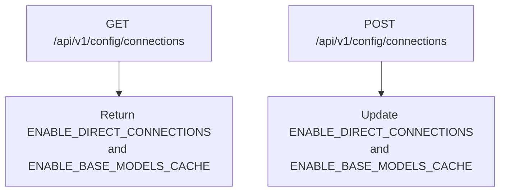

**Diagram sources**
- [configs.py](file://backend/open_webui/routers/configs.py#L68-L97)

### Tool Servers Configuration
Administrators can manage tool server connections, including OpenAPI and MCP (Model Control Protocol) servers.

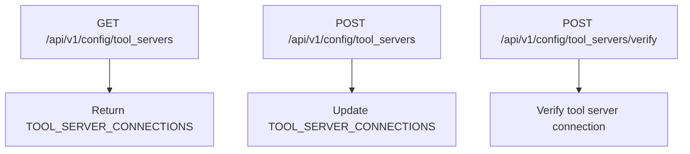

**Diagram sources**
- [configs.py](file://backend/open_webui/routers/configs.py#L142-L215)

### Code Execution Configuration
Administrators can configure code execution settings, including enabling/disabling code execution and interpreter features, and setting up Jupyter server connections.

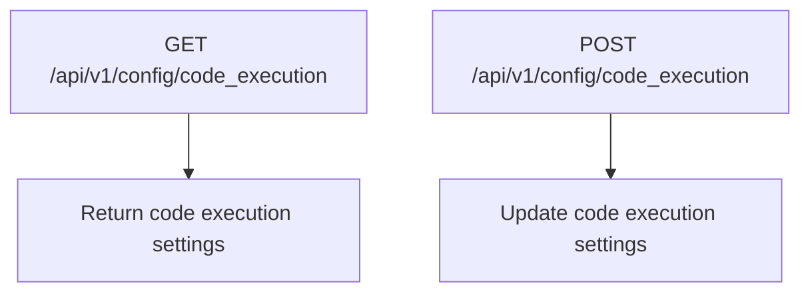

**Diagram sources**
- [configs.py](file://backend/open_webui/routers/configs.py#L355-L458)

### Default Models and Suggestions
Administrators can manage default models, pinned models, model order, and prompt suggestions.

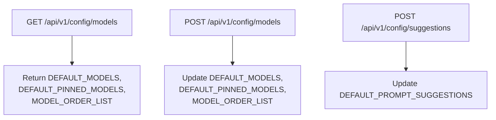

**Diagram sources**
- [configs.py](file://backend/open_webui/routers/configs.py#L464-L510)

### Banners Configuration
Administrators can manage banners displayed in the application.

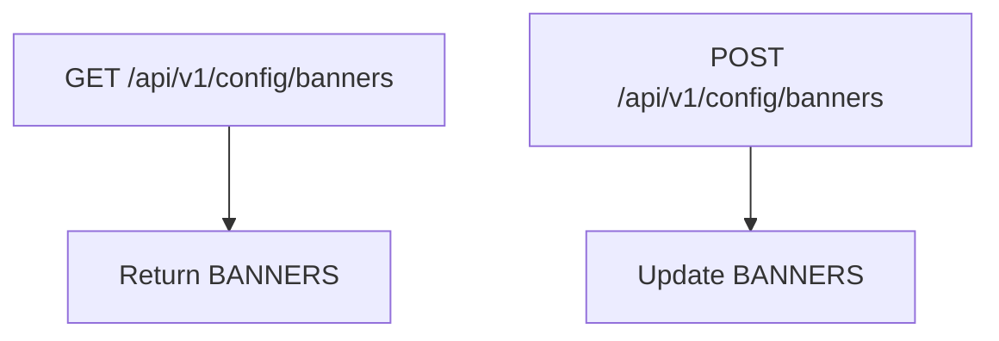

**Diagram sources**
- [configs.py](file://backend/open_webui/routers/configs.py#L518-L538)

**Section sources**
- [configs.py](file://backend/open_webui/routers/configs.py#L38-L538)

## User Management

The user management endpoints provide comprehensive functionality for administrators to manage user accounts, roles, and permissions.

### User Retrieval
Administrators can retrieve user information, including all users, users by search query, and specific user details.

```mermaid
flowchart TD
A[GET /api/v1/users] --> B[Return paginated list of users<br/>with group IDs]
C[GET /api/v1/users/all] --> D[Return all users]
E[GET /api/v1/users/search] --> F[Return users matching search query]
G[GET /api/v1/users/{user_id}] --> H[Return specific user details]
```

**Diagram sources**
- [users.py](file://backend/open_webui/routers/users.py#L57-L428)

### User Update and Deletion
Administrators can update user information and delete user accounts.

```mermaid
flowchart TD
A[POST /api/v1/users/{user_id}/update] --> B[Update user role, name,<br/>email, profile image URL,<br/>and password]
C[DELETE /api/v1/users/{user_id}] --> D[Delete user account]
```

**Diagram sources**
- [users.py](file://backend/open_webui/routers/users.py#L496-L610)

### User Permissions
Administrators can manage default user permissions for workspace, sharing, chat, and features.

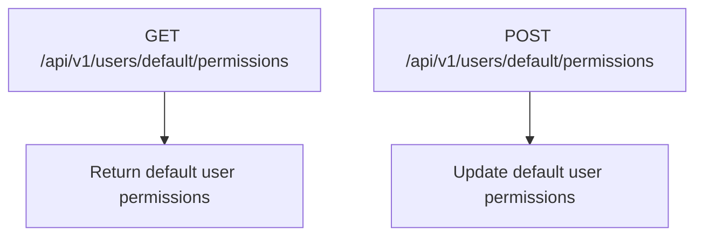

**Diagram sources**
- [users.py](file://backend/open_webui/routers/users.py#L228-L251)

**Section sources**
- [users.py](file://backend/open_webui/routers/users.py#L57-L620)

## Billing Plan Administration

The billing plan administration endpoints allow administrators to manage subscription plans, including creating, reading, updating, deleting, and duplicating plans, as well as retrieving plan statistics and subscribers.

### Plan CRUD Operations
Administrators can perform CRUD operations on billing plans.

```mermaid
flowchart TD
A[GET /api/v1/admin/billing/plans] --> B[Return all plans with statistics]
C[POST /api/v1/admin/billing/plans] --> D[Create new plan]
E[GET /api/v1/admin/billing/plans/{plan_id}] --> F[Return specific plan]
G[PUT /api/v1/admin/billing/plans/{plan_id}] --> H[Update existing plan]
I[DELETE /api/v1/admin/billing/plans/{plan_id}] --> J[Delete plan]
K[PATCH /api/v1/admin/billing/plans/{plan_id}/toggle] --> L[Toggle plan active/inactive]
M[POST /api/v1/admin/billing/plans/{plan_id}/duplicate] --> N[Duplicate plan]
```

**Diagram sources**
- [admin_billing.py](file://backend/open_webui/routers/admin_billing.py#L159-L487)

### Plan Subscribers
Administrators can retrieve paginated lists of users subscribed to a specific plan.

```mermaid
flowchart TD
A[GET /api/v1/admin/billing/plans/{plan_id}/subscribers] --> B[Return paginated list of<br/>plan subscribers]
```

**Diagram sources**
- [admin_billing.py](file://backend/open_webui/routers/admin_billing.py#L489-L557)

**Section sources**
- [admin_billing.py](file://backend/open_webui/routers/admin_billing.py#L159-L557)

## Security and Access Control

The system implements robust security and access control mechanisms to protect administrative endpoints and ensure only authorized users can perform sensitive operations.

### Role-Based Access Control
Access to administrative endpoints is controlled through role-based access control. Only users with the "admin" role can access these endpoints.

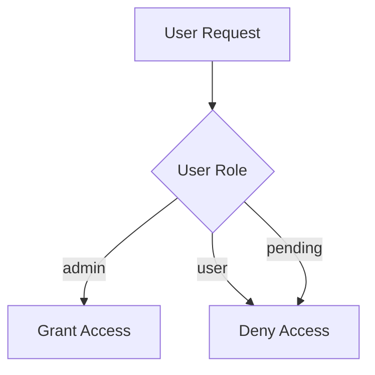

**Diagram sources**
- [auth.py](file://backend/open_webui/utils/auth.py#L412-L418)

### Permission Management
The system uses a hierarchical permission model where permissions are defined at the group level and inherited by users.

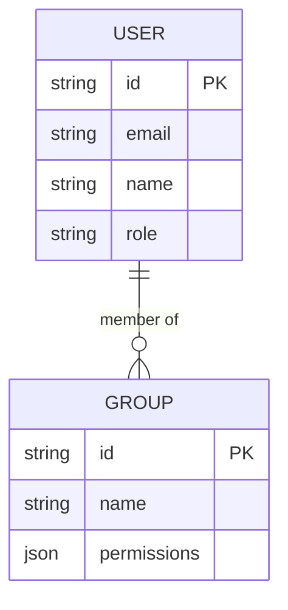

**Diagram sources**
- [access_control.py](file://backend/open_webui/utils/access_control.py#L28-L68)

**Section sources**
- [auth.py](file://backend/open_webui/utils/auth.py#L412-L418)
- [access_control.py](file://backend/open_webui/utils/access_control.py#L28-L68)

## Audit Logging

The system implements comprehensive audit logging to track administrative actions and ensure accountability.

### Audit Log Model
The audit log model captures detailed information about administrative actions, including the user who performed the action, the action type, the affected entity, and any changes made.

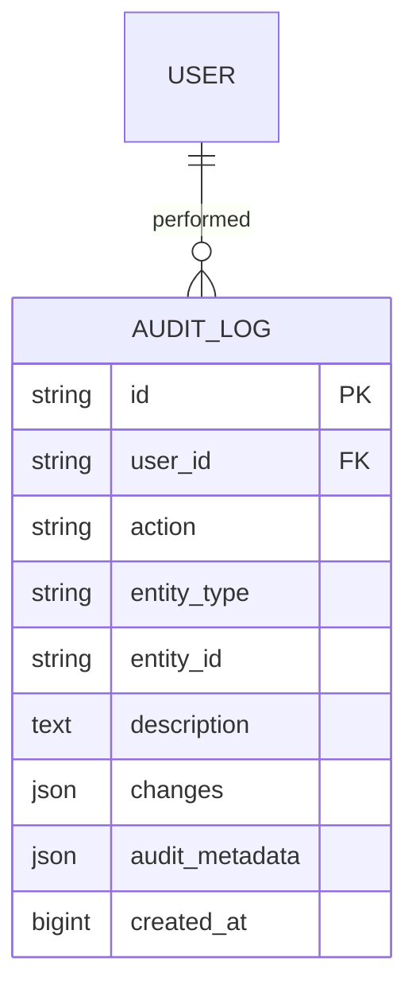

**Diagram sources**
- [audit.py](file://backend/open_webui/models/audit.py#L34-L73)

### Audit Log Endpoints
Administrators can retrieve audit logs with various filters to monitor system activity.

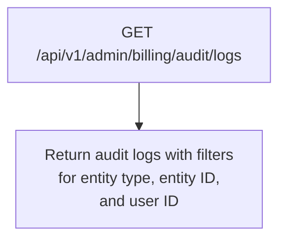

**Section sources**
- [audit.py](file://backend/open_webui/models/audit.py#L83-L136)

## Rate Limiting

The system implements rate limiting to protect against abuse and ensure fair usage of administrative endpoints.

### Rate Limiter Implementation
The rate limiter uses a rolling window strategy with Redis for distributed rate limiting and an in-memory fallback when Redis is not available.

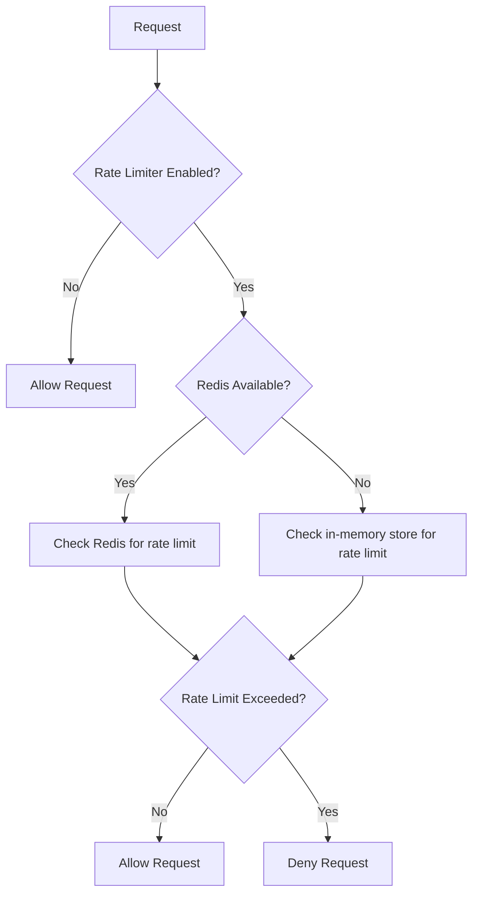

**Diagram sources**
- [rate_limit.py](file://backend/open_webui/utils/rate_limit.py#L6-L140)

**Section sources**
- [rate_limit.py](file://backend/open_webui/utils/rate_limit.py#L6-L140)

## Integration with Frontend Components

The administrative API endpoints are integrated with frontend components to provide a seamless user experience for system administrators.

### Frontend-Backend Interaction
The frontend components communicate with the backend API endpoints to retrieve and update system configuration, manage users, and administer billing plans.

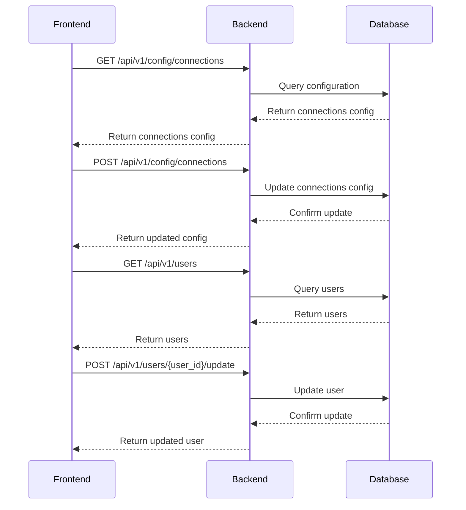

**Section sources**
- [configs.py](file://backend/open_webui/routers/configs.py)
- [users.py](file://backend/open_webui/routers/users.py)

## Error Handling

The system implements comprehensive error handling to provide meaningful feedback to administrators and ensure system stability.

### Error Response Schema
Error responses follow a consistent schema to provide detailed information about the error.

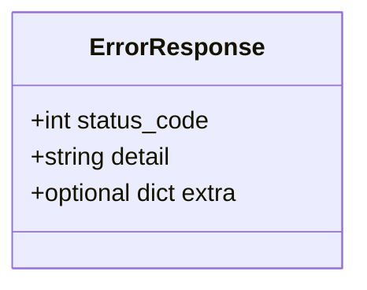

**Section sources**
- [admin_billing.py](file://backend/open_webui/routers/admin_billing.py)
- [configs.py](file://backend/open_webui/routers/configs.py)
- [users.py](file://backend/open_webui/routers/users.py)

## Conclusion
This documentation provides a comprehensive overview of the system administration endpoints in the Open WebUI platform. It covers configuration management, user management, billing plan administration, security and access control, audit logging, rate limiting, integration with frontend components, and error handling. The API endpoints are designed to be secure, reliable, and easy to use, providing administrators with the tools they need to effectively manage the system.