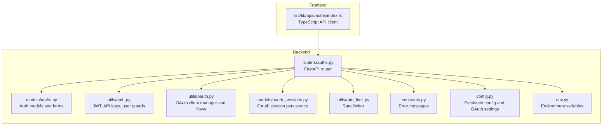
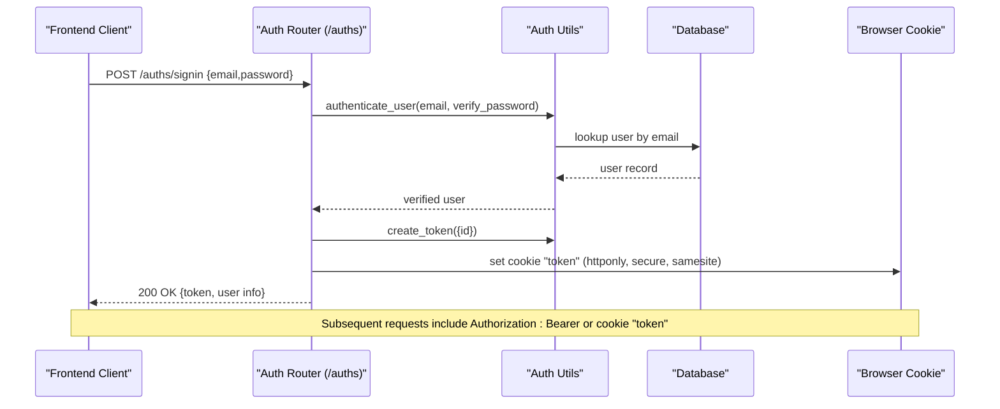
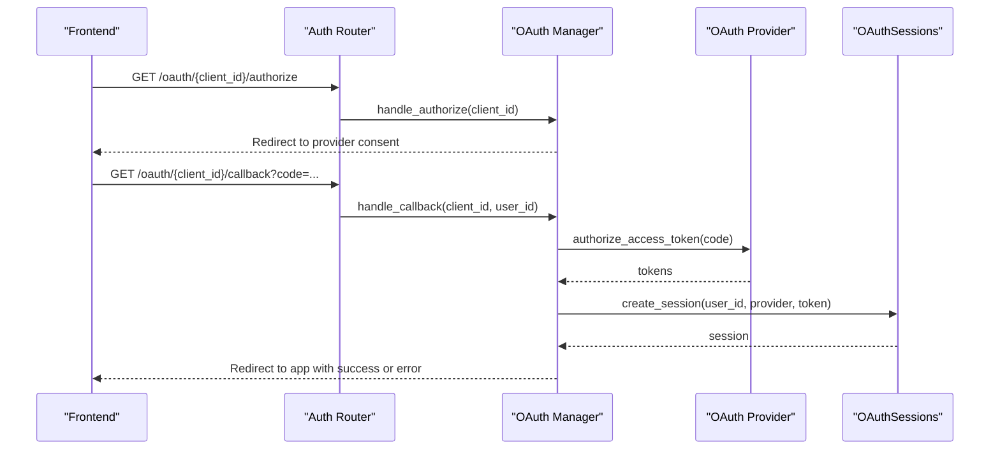
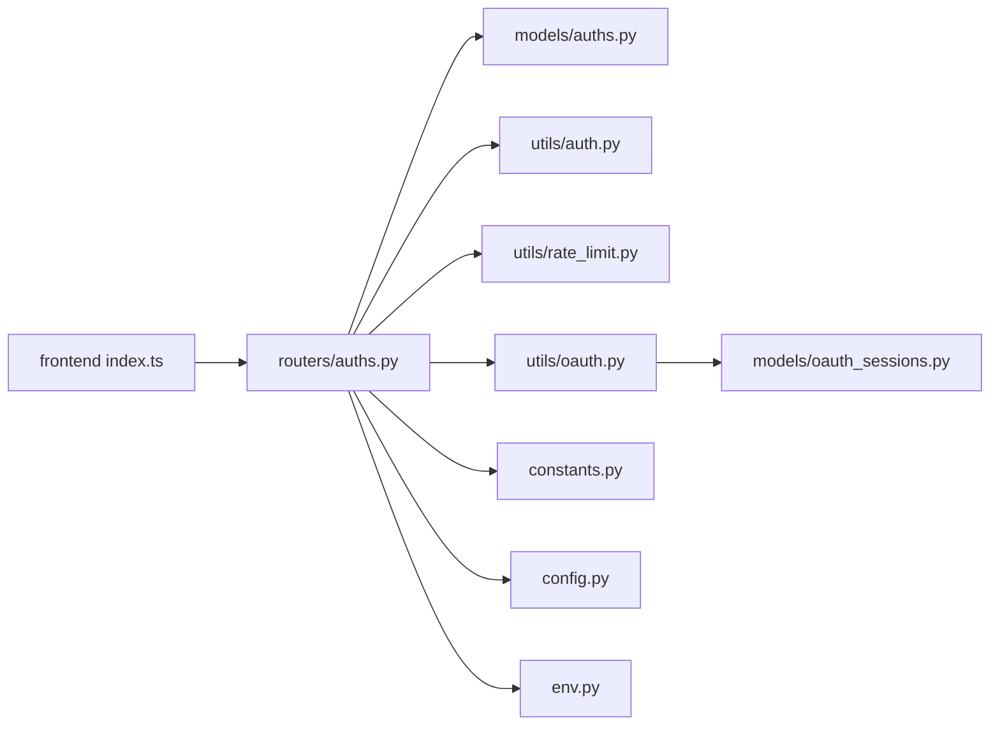

# Authentication API

<cite>
**Referenced Files in This Document**
- [auths.py](file://backend/open_webui/routers/auths.py)
- [auths.py (models)](file://backend/open_webui/models/auths.py)
- [oauth.py](file://backend/open_webui/utils/oauth.py)
- [oauth_sessions.py](file://backend/open_webui/models/oauth_sessions.py)
- [auth.py](file://backend/open_webui/utils/auth.py)
- [index.ts](file://src/lib/apis/auths/index.ts)
- [rate_limit.py](file://backend/open_webui/utils/rate_limit.py)
- [constants.py](file://backend/open_webui/constants.py)
- [config.py](file://backend/open_webui/config.py)
- [env.py](file://backend/open_webui/env.py)
</cite>

## Table of Contents
1. [Introduction](#introduction)
2. [Project Structure](#project-structure)
3. [Core Components](#core-components)
4. [Architecture Overview](#architecture-overview)
5. [Detailed Component Analysis](#detailed-component-analysis)
6. [Dependency Analysis](#dependency-analysis)
7. [Performance Considerations](#performance-considerations)
8. [Troubleshooting Guide](#troubleshooting-guide)
9. [Conclusion](#conclusion)
10. [Appendices](#appendices)

## Introduction
This document provides comprehensive API documentation for the authentication endpoints exposed by the backend authentication router. It covers user registration, login, logout, password updates, LDAP authentication, and OAuth integration. It also documents authentication mechanisms (JWT and session cookies), request/response schemas, error handling, rate limiting, and security considerations such as token expiration and refresh mechanisms.

## Project Structure
The authentication API is implemented in the FastAPI router module and integrates with models, utilities, and frontend API bindings.

**Diagram sources**
- [auths.py](file://backend/open_webui/routers/auths.py#L1-L120)
- [auths.py (models)](file://backend/open_webui/models/auths.py#L1-L120)
- [auth.py](file://backend/open_webui/utils/auth.py#L160-L260)
- [oauth.py](file://backend/open_webui/utils/oauth.py#L1-L120)
- [oauth_sessions.py](file://backend/open_webui/models/oauth_sessions.py#L1-L80)
- [rate_limit.py](file://backend/open_webui/utils/rate_limit.py#L1-L80)
- [constants.py](file://backend/open_webui/constants.py#L1-L120)
- [config.py](file://backend/open_webui/config.py#L320-L470)
- [env.py](file://backend/open_webui/env.py#L1-L120)
- [index.ts](file://src/lib/apis/auths/index.ts#L1-L120)

**Section sources**
- [auths.py](file://backend/open_webui/routers/auths.py#L1-L120)
- [auths.py (models)](file://backend/open_webui/models/auths.py#L1-L120)
- [auth.py](file://backend/open_webui/utils/auth.py#L160-L260)
- [oauth.py](file://backend/open_webui/utils/oauth.py#L1-L120)
- [oauth_sessions.py](file://backend/open_webui/models/oauth_sessions.py#L1-L80)
- [rate_limit.py](file://backend/open_webui/utils/rate_limit.py#L1-L80)
- [constants.py](file://backend/open_webui/constants.py#L1-L120)
- [config.py](file://backend/open_webui/config.py#L320-L470)
- [env.py](file://backend/open_webui/env.py#L1-L120)
- [index.ts](file://src/lib/apis/auths/index.ts#L1-L120)

## Core Components
- Authentication router: Implements endpoints for session retrieval, profile/password updates, LDAP, sign-in/sign-up, sign-out, admin configuration, and API key management.
- Models: Define request/response schemas for authentication forms and responses.
- Utilities: JWT creation/verification, token invalidation, API key generation, and user guards.
- OAuth: OAuth client manager, dynamic client registration, token refresh, and session persistence.
- Frontend API client: TypeScript wrappers for authentication endpoints.

**Section sources**
- [auths.py](file://backend/open_webui/routers/auths.py#L100-L220)
- [auths.py (models)](file://backend/open_webui/models/auths.py#L40-L120)
- [auth.py](file://backend/open_webui/utils/auth.py#L190-L260)
- [oauth.py](file://backend/open_webui/utils/oauth.py#L400-L520)
- [oauth_sessions.py](file://backend/open_webui/models/oauth_sessions.py#L100-L180)
- [index.ts](file://src/lib/apis/auths/index.ts#L80-L120)

## Architecture Overview
The authentication flow integrates JWT-based session tokens and optional session cookies. On successful authentication, the server sets a secure, HTTP-only cookie named “token” and returns a JSON response containing the token and user metadata. Logout invalidates the token and clears cookies, and may trigger provider logout via OpenID Connect endpoints.

**Diagram sources**
- [auths.py](file://backend/open_webui/routers/auths.py#L507-L632)
- [auth.py](file://backend/open_webui/utils/auth.py#L194-L214)
- [auth.py](file://backend/open_webui/utils/auth.py#L231-L252)

## Detailed Component Analysis

### Endpoints Overview
- GET /auths/: Retrieve current session user and set token cookie
- POST /auths/signin: Authenticate via password
- POST /auths/signup: Register a new user
- POST /auths/ldap: Authenticate via LDAP
- POST /auths/update/profile: Update user profile
- POST /auths/update/password: Change password
- GET /auths/signout: Logout and invalidate token
- POST /auths/api_key: Create API key
- GET /auths/api_key: Get API key
- DELETE /auths/api_key: Delete API key

**Section sources**
- [auths.py](file://backend/open_webui/routers/auths.py#L100-L184)
- [auths.py](file://backend/open_webui/routers/auths.py#L507-L751)
- [auths.py](file://backend/open_webui/routers/auths.py#L832-L887)
- [auths.py](file://backend/open_webui/routers/auths.py#L1147-L1185)

### GET /auths/
- Purpose: Return current session user info and set token cookie.
- Authentication: Requires either Authorization Bearer or cookie “token”.
- Response: SessionUserResponse with token, token_type, expires_at, user profile, permissions.
- Cookies: Sets “token” with httponly, secure, samesite policy.

**Section sources**
- [auths.py](file://backend/open_webui/routers/auths.py#L100-L162)
- [auth.py](file://backend/open_webui/utils/auth.py#L272-L368)

### POST /auths/signin
- Purpose: Authenticate a user with email and password.
- Request body: SigninForm {email, password}.
- Response: SessionUserResponse with token and user info.
- Behavior:
  - Rate-limited by a rolling-window Redis-based limiter.
  - Enforces password length constraints.
  - Creates JWT with expiration configured by JWT_EXPIRES_IN.
  - Sets “token” cookie.
- Errors: Invalid credentials, rate limit exceeded, forbidden when password auth is disabled.

**Section sources**
- [auths.py](file://backend/open_webui/routers/auths.py#L507-L632)
- [rate_limit.py](file://backend/open_webui/utils/rate_limit.py#L1-L80)
- [auth.py](file://backend/open_webui/utils/auth.py#L168-L191)

### POST /auths/signup
- Purpose: Register a new user.
- Request body: SignupForm {name, email, password, profile_image_url}.
- Response: SessionUserResponse with token and user info.
- Behavior:
  - Validates email format and password.
  - Assigns role based on existing users and defaults.
  - Applies default group assignment.
  - Creates JWT and sets “token” cookie.
  - Optionally posts webhook on signup.
- Errors: Access prohibited when signup is disabled, email taken, invalid email format.

**Section sources**
- [auths.py](file://backend/open_webui/routers/auths.py#L639-L751)
- [auths.py (models)](file://backend/open_webui/models/auths.py#L72-L81)

### POST /auths/ldap
- Purpose: Authenticate via LDAP.
- Request body: LdapForm {user, password}.
- Response: SessionUserResponse with token and user info.
- Behavior:
  - Validates LDAP configuration and TLS settings.
  - Searches LDAP directory for user and binds with provided credentials.
  - Creates local user if not exists and assigns default role.
  - Syncs groups if enabled.
  - Creates JWT and sets “token” cookie.
- Errors: LDAP disabled, TLS configuration error, bind failure, user not found, internal errors.

**Section sources**
- [auths.py](file://backend/open_webui/routers/auths.py#L218-L499)

### POST /auths/update/profile
- Purpose: Update user profile fields.
- Request body: UpdateProfileForm (mapped from frontend).
- Response: UserProfileImageResponse.
- Errors: Invalid credentials or default error.

**Section sources**
- [auths.py](file://backend/open_webui/routers/auths.py#L169-L184)
- [auths.py (models)](file://backend/open_webui/models/auths.py#L1-L30)

### POST /auths/update/password
- Purpose: Change current user’s password.
- Request body: UpdatePasswordForm {password, new_password}.
- Response: Boolean success.
- Behavior:
  - Validates new password strength.
  - Verifies current password.
  - Updates hashed password.
- Errors: Action prohibited when trusted header mode is enabled, incorrect password, invalid credentials.

**Section sources**
- [auths.py](file://backend/open_webui/routers/auths.py#L191-L213)
- [auth.py](file://backend/open_webui/utils/auth.py#L168-L191)

### GET /auths/signout
- Purpose: Logout the current user.
- Behavior:
  - Invalidates JWT by storing its jti in Redis.
  - Deletes “token”, “oui-session”, “oauth_id_token”, and “oauth_session_id” cookies.
  - Attempts provider logout via OpenID Connect end_session_endpoint if available.
- Errors: Internal error if provider logout fails.

**Section sources**
- [auths.py](file://backend/open_webui/routers/auths.py#L753-L829)
- [auth.py](file://backend/open_webui/utils/auth.py#L231-L252)

### API Key Endpoints
- POST /auths/api_key: Create API key for current user.
- GET /auths/api_key: Retrieve API key for current user.
- DELETE /auths/api_key: Delete API key for current user.
- Behavior:
  - Requires permission features.api_keys and enabled flag.
  - API key format starts with “sk-”.

**Section sources**
- [auths.py](file://backend/open_webui/routers/auths.py#L1147-L1185)
- [auth.py](file://backend/open_webui/utils/auth.py#L257-L260)

### OAuth Integration
- OAuth client manager supports dynamic client registration and token refresh.
- Sessions are stored encrypted in the database with indexes for performance.
- Token refresh is performed automatically when nearing expiry.

**Diagram sources**
- [oauth.py](file://backend/open_webui/utils/oauth.py#L718-L800)
- [oauth_sessions.py](file://backend/open_webui/models/oauth_sessions.py#L108-L139)

**Section sources**
- [oauth.py](file://backend/open_webui/utils/oauth.py#L280-L400)
- [oauth.py](file://backend/open_webui/utils/oauth.py#L718-L800)
- [oauth_sessions.py](file://backend/open_webui/models/oauth_sessions.py#L1-L80)

## Dependency Analysis
- Router depends on models for request/response schemas, utilities for JWT and guards, rate limiter for sign-in throttling, and OAuth manager for provider flows.
- Frontend API client depends on the backend endpoints and uses Authorization Bearer headers and cookie credentials.

**Diagram sources**
- [index.ts](file://src/lib/apis/auths/index.ts#L80-L120)
- [auths.py](file://backend/open_webui/routers/auths.py#L100-L220)
- [auths.py (models)](file://backend/open_webui/models/auths.py#L40-L120)
- [auth.py](file://backend/open_webui/utils/auth.py#L190-L260)
- [rate_limit.py](file://backend/open_webui/utils/rate_limit.py#L1-L80)
- [oauth.py](file://backend/open_webui/utils/oauth.py#L400-L520)
- [oauth_sessions.py](file://backend/open_webui/models/oauth_sessions.py#L100-L180)
- [constants.py](file://backend/open_webui/constants.py#L1-L120)
- [config.py](file://backend/open_webui/config.py#L320-L470)
- [env.py](file://backend/open_webui/env.py#L1-L120)

**Section sources**
- [index.ts](file://src/lib/apis/auths/index.ts#L80-L120)
- [auths.py](file://backend/open_webui/routers/auths.py#L100-L220)
- [auth.py](file://backend/open_webui/utils/auth.py#L190-L260)
- [oauth.py](file://backend/open_webui/utils/oauth.py#L400-L520)
- [oauth_sessions.py](file://backend/open_webui/models/oauth_sessions.py#L100-L180)
- [rate_limit.py](file://backend/open_webui/utils/rate_limit.py#L1-L80)
- [constants.py](file://backend/open_webui/constants.py#L1-L120)
- [config.py](file://backend/open_webui/config.py#L320-L470)
- [env.py](file://backend/open_webui/env.py#L1-L120)

## Performance Considerations
- JWT token creation and verification are lightweight; ensure SECRET_KEY is strong and consistent across instances.
- Redis-backed rate limiting provides efficient sliding window counters; fallback to memory storage occurs if Redis is unavailable.
- OAuth token refresh uses provider metadata endpoints; caching provider configuration reduces latency.
- Database indexes on OAuth sessions improve lookup performance for token refresh and cleanup.

[No sources needed since this section provides general guidance]

## Troubleshooting Guide
Common issues and resolutions:
- Invalid token or unauthorized: Ensure Authorization Bearer header is present or “token” cookie is set. Verify token expiration and revocation.
- Rate limit exceeded on sign-in: Wait for the configured window to reset or reduce login attempts.
- LDAP authentication failures: Verify LDAP server configuration, TLS settings, and bind credentials.
- OAuth callback errors: Check provider consent, state parameter handling, and callback URL configuration.
- API key not found: Ensure API key creation succeeded and the user has the required permissions.

**Section sources**
- [auth.py](file://backend/open_webui/utils/auth.py#L272-L368)
- [rate_limit.py](file://backend/open_webui/utils/rate_limit.py#L46-L95)
- [oauth.py](file://backend/open_webui/utils/oauth.py#L167-L196)
- [auths.py](file://backend/open_webui/routers/auths.py#L1147-L1185)

## Conclusion
The authentication API provides robust endpoints for password-based, LDAP, and OAuth-based authentication, with JWT and cookie-based session management. It includes built-in rate limiting, token invalidation, and OAuth session persistence. The frontend client exposes convenient TypeScript wrappers for all endpoints.

[No sources needed since this section summarizes without analyzing specific files]

## Appendices

### Request/Response Schemas

- SigninForm
  - Fields: email, password
  - Used by: POST /auths/signin

- SignupForm
  - Fields: name, email, password, profile_image_url
  - Used by: POST /auths/signup

- LdapForm
  - Fields: user, password
  - Used by: POST /auths/ldap

- UpdatePasswordForm
  - Fields: password, new_password
  - Used by: POST /auths/update/password

- UpdateProfileForm
  - Fields: profile fields mapped from frontend
  - Used by: POST /auths/update/profile

- SessionUserResponse
  - Fields: token, token_type, expires_at, id, email, name, role, profile_image_url, permissions
  - Returned by: GET /auths/, POST /auths/signin, POST /auths/signup, POST /auths/ldap

- ApiKey
  - Fields: api_key
  - Used by: API key endpoints

**Section sources**
- [auths.py (models)](file://backend/open_webui/models/auths.py#L40-L120)
- [auths.py](file://backend/open_webui/routers/auths.py#L100-L162)
- [auths.py](file://backend/open_webui/routers/auths.py#L507-L632)
- [auths.py](file://backend/open_webui/routers/auths.py#L639-L751)
- [auths.py](file://backend/open_webui/routers/auths.py#L218-L499)
- [auths.py](file://backend/open_webui/routers/auths.py#L1147-L1185)

### Authentication Mechanisms
- JWT: HS256 signed tokens with exp claim and jti for revocation.
- Session cookies: “token” cookie with httponly, secure, and samesite attributes.
- API keys: “sk-” prefixed keys for programmatic access.

**Section sources**
- [auth.py](file://backend/open_webui/utils/auth.py#L194-L214)
- [auth.py](file://backend/open_webui/utils/auth.py#L231-L252)
- [auth.py](file://backend/open_webui/utils/auth.py#L257-L260)
- [auths.py](file://backend/open_webui/routers/auths.py#L100-L162)

### Rate Limiting and Account Lockout
- Sign-in endpoint uses a rolling-window rate limiter with configurable limit and window.
- No explicit account lockout policy is implemented in the router; consider integrating account lockout at the application layer if required.

**Section sources**
- [auths.py](file://backend/open_webui/routers/auths.py#L568-L572)
- [rate_limit.py](file://backend/open_webui/utils/rate_limit.py#L1-L80)

### Security Considerations
- CSRF protection: Not implemented in the provided code; consider adding CSRF tokens for browser-based flows.
- Token expiration: Controlled by JWT_EXPIRES_IN; ensure consistent configuration across instances.
- Refresh mechanisms: Implemented for OAuth tokens; JWTs are short-lived and should be refreshed via re-authentication or API key usage.
- Cookie security: httponly, secure, and samesite attributes are set; ensure HTTPS is enforced in production.

**Section sources**
- [auth.py](file://backend/open_webui/utils/auth.py#L194-L214)
- [auths.py](file://backend/open_webui/routers/auths.py#L100-L162)
- [oauth.py](file://backend/open_webui/utils/oauth.py#L552-L717)

### curl Examples
- Get session user
  - curl -H "Authorization: Bearer <TOKEN>" -c cookies.txt https://your-host/api/auths/
- Sign in
  - curl -X POST -H "Content-Type: application/json" -c cookies.txt https://your-host/api/auths/signin -d '{"email":"user@example.com","password":"pass"}'
- Sign up
  - curl -X POST -H "Content-Type: application/json" -c cookies.txt https://your-host/api/auths/signup -d '{"name":"User","email":"user@example.com","password":"pass","profile_image_url":"/user.png"}'
- Update profile
  - curl -X POST -H "Authorization: Bearer <TOKEN>" -H "Content-Type: application/json" https://your-host/api/auths/update/profile -d '{"bio":"New bio"}'
- Update password
  - curl -X POST -H "Authorization: Bearer <TOKEN>" -H "Content-Type: application/json" https://your-host/api/auths/update/password -d '{"password":"old","new_password":"new"}'
- Logout
  - curl -X GET -b cookies.txt https://your-host/api/auths/signout

[No sources needed since this section provides general guidance]

### TypeScript Examples (frontend API client)
- Get session user
  - getSessionUser(token)
- User sign in
  - userSignIn(email, password)
- User sign up
  - userSignUp(name, email, password, profile_image_url)
- Update profile
  - updateUserProfile(token, profile)
- Update password
  - updateUserPassword(token, password, newPassword)
- Sign out
  - userSignOut()

**Section sources**
- [index.ts](file://src/lib/apis/auths/index.ts#L85-L120)
- [index.ts](file://src/lib/apis/auths/index.ts#L257-L325)
- [index.ts](file://src/lib/apis/auths/index.ts#L396-L424)
- [index.ts](file://src/lib/apis/auths/index.ts#L426-L455)
- [index.ts](file://src/lib/apis/auths/index.ts#L327-L353)