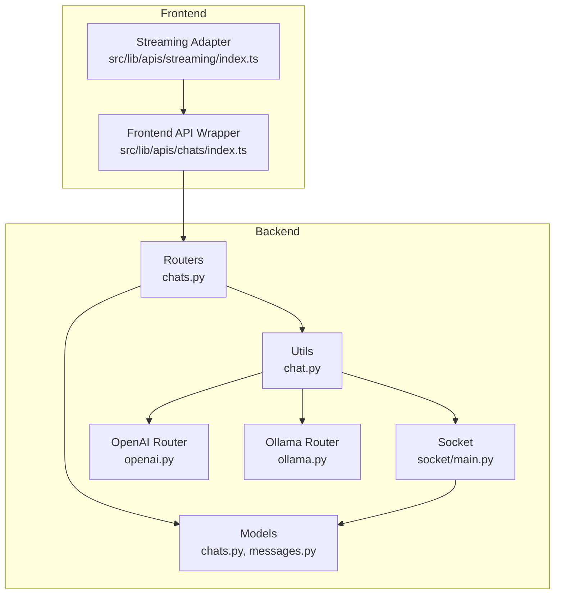
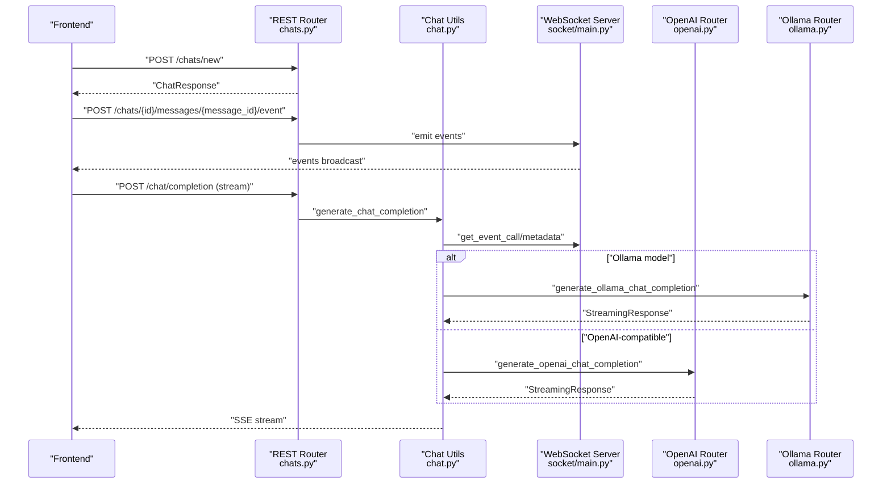
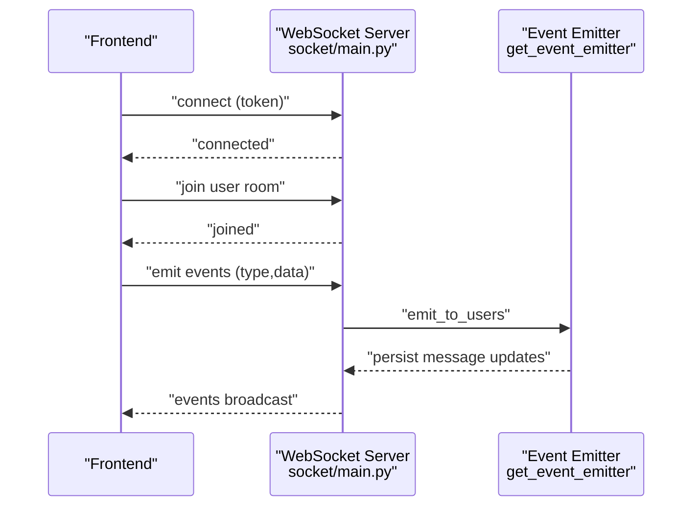
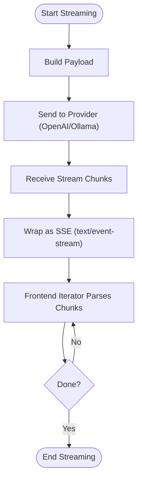
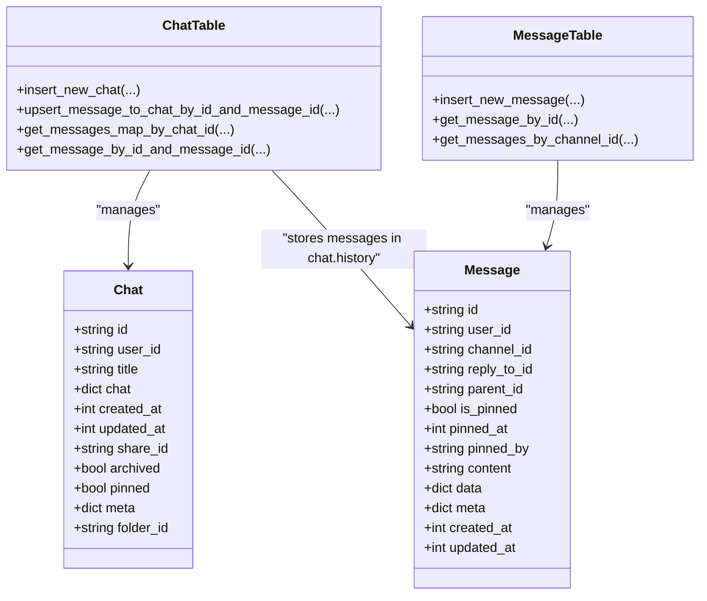
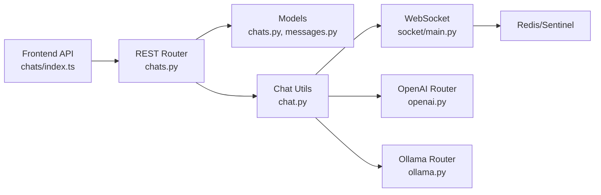

# Chat API

<cite>
**Referenced Files in This Document**
- [chats.py](file://backend/open_webui/routers/chats.py)
- [socket_main.py](file://backend/open_webui/socket/main.py)
- [socket_utils.py](file://backend/open_webui/socket/utils.py)
- [chats_model.py](file://backend/open_webui/models/chats.py)
- [messages_model.py](file://backend/open_webui/models/messages.py)
- [chat_utils.py](file://backend/open_webui/utils/chat.py)
- [openai_router.py](file://backend/open_webui/routers/openai.py)
- [ollama_router.py](file://backend/open_webui/routers/ollama.py)
- [frontend_chats_api.ts](file://src/lib/apis/chats/index.ts)
- [frontend_streaming_api.ts](file://src/lib/apis/streaming/index.ts)
</cite>

## Table of Contents
1. [Introduction](#introduction)
2. [Project Structure](#project-structure)
3. [Core Components](#core-components)
4. [Architecture Overview](#architecture-overview)
5. [Detailed Component Analysis](#detailed-component-analysis)
6. [Dependency Analysis](#dependency-analysis)
7. [Performance Considerations](#performance-considerations)
8. [Troubleshooting Guide](#troubleshooting-guide)
9. [Conclusion](#conclusion)
10. [Appendices](#appendices)

## Introduction
This document provides comprehensive API documentation for the chat functionality, covering:
- RESTful endpoints for chat creation, retrieval, deletion, archiving, cloning, tagging, and sharing
- WebSocket interactions for real-time message streaming and event propagation
- Authentication and permissions
- Message format and streaming protocol
- Relationship between chats, messages, and models
- Error handling for model timeouts, token limits, and connection issues
- Performance considerations and pagination recommendations

## Project Structure
The chat system spans backend routers, models, utilities, and WebSocket handlers, with a frontend API wrapper that consumes the backend endpoints.

**Diagram sources**
- [chats.py](file://backend/open_webui/routers/chats.py#L1-L942)
- [socket_main.py](file://backend/open_webui/socket/main.py#L1-L839)
- [chats_model.py](file://backend/open_webui/models/chats.py#L1-L1175)
- [messages_model.py](file://backend/open_webui/models/messages.py#L1-L463)
- [chat_utils.py](file://backend/open_webui/utils/chat.py#L1-L490)
- [openai_router.py](file://backend/open_webui/routers/openai.py#L1-L200)
- [ollama_router.py](file://backend/open_webui/routers/ollama.py#L1-L200)
- [frontend_chats_api.ts](file://src/lib/apis/chats/index.ts#L1-L1169)
- [frontend_streaming_api.ts](file://src/lib/apis/streaming/index.ts#L43-L93)

**Section sources**
- [chats.py](file://backend/open_webui/routers/chats.py#L1-L942)
- [socket_main.py](file://backend/open_webui/socket/main.py#L1-L839)
- [chats_model.py](file://backend/open_webui/models/chats.py#L1-L1175)
- [messages_model.py](file://backend/open_webui/models/messages.py#L1-L463)
- [chat_utils.py](file://backend/open_webui/utils/chat.py#L1-L490)
- [openai_router.py](file://backend/open_webui/routers/openai.py#L1-L200)
- [ollama_router.py](file://backend/open_webui/routers/ollama.py#L1-L200)
- [frontend_chats_api.ts](file://src/lib/apis/chats/index.ts#L1-L1169)
- [frontend_streaming_api.ts](file://src/lib/apis/streaming/index.ts#L43-L93)

## Core Components
- REST chat router: Defines endpoints for CRUD operations, search, archives, tags, sharing, and metadata management.
- Chat model: Defines the chat schema and message map persistence logic.
- Message model: Defines message schema and related operations.
- Chat utilities: Orchestrates model selection, streaming, billing tracking, and event emission.
- WebSocket server: Manages connections, rooms, usage tracking, and event broadcasting.
- Frontend API wrapper: Provides typed fetch helpers for chat operations and streaming.

**Section sources**
- [chats.py](file://backend/open_webui/routers/chats.py#L1-L942)
- [chats_model.py](file://backend/open_webui/models/chats.py#L1-L1175)
- [messages_model.py](file://backend/open_webui/models/messages.py#L1-L463)
- [chat_utils.py](file://backend/open_webui/utils/chat.py#L1-L490)
- [socket_main.py](file://backend/open_webui/socket/main.py#L1-L839)
- [frontend_chats_api.ts](file://src/lib/apis/chats/index.ts#L1-L1169)

## Architecture Overview
The chat API integrates REST endpoints with WebSocket streaming. REST endpoints manage chat lifecycle and metadata, while WebSocket handles real-time events and streaming responses. The chat utilities coordinate model routing and billing.

**Diagram sources**
- [chats.py](file://backend/open_webui/routers/chats.py#L420-L560)
- [chat_utils.py](file://backend/open_webui/utils/chat.py#L171-L332)
- [socket_main.py](file://backend/open_webui/socket/main.py#L695-L800)
- [openai_router.py](file://backend/open_webui/routers/openai.py#L1-L200)
- [ollama_router.py](file://backend/open_webui/routers/ollama.py#L1-L200)

## Detailed Component Analysis

### REST Endpoints: Chat Lifecycle and Management
- Create new chat
  - Method: POST
  - Path: /chats/new
  - Request body: ChatForm (chat object, optional folder_id)
  - Response: ChatResponse
  - Auth: Verified user
- Import chats
  - Method: POST
  - Path: /chats/import
  - Request body: ChatsImportForm (list of ChatImportForm)
  - Response: list[ChatResponse]
  - Auth: Verified user
- List chats (paginated)
  - Method: GET
  - Path: /chats/ or /chats/list
  - Query: page (optional), include_pinned (optional), include_folders (optional)
  - Response: list[ChatTitleIdResponse]
  - Auth: Verified user
- Search chats
  - Method: GET
  - Path: /chats/search
  - Query: text, page (optional)
  - Response: list[ChatTitleIdResponse]
  - Auth: Verified user
- Get chats by folder
  - Method: GET
  - Path: /chats/folder/{folder_id}
  - Response: list[ChatResponse]
  - Auth: Verified user
- Get chat list by folder (paginated)
  - Method: GET
  - Path: /chats/folder/{folder_id}/list
  - Query: page
  - Response: list[{"title","id","updated_at"}]
  - Auth: Verified user
- Get pinned chats
  - Method: GET
  - Path: /chats/pinned
  - Response: list[ChatTitleIdResponse]
  - Auth: Verified user
- Get all chats for user
  - Method: GET
  - Path: /chats/all
  - Response: list[ChatResponse]
  - Auth: Verified user
- Get archived chats
  - Method: GET
  - Path: /chats/all/archived
  - Response: list[ChatResponse]
  - Auth: Verified user
- Get all tags for user
  - Method: GET
  - Path: /chats/all/tags
  - Response: list[TagModel]
  - Auth: Verified user
- Get all chats in DB (admin)
  - Method: GET
  - Path: /chats/all/db
  - Response: list[ChatResponse]
  - Auth: Admin user
- Archive/unarchive all chats
  - Method: POST
  - Path: /chats/archive/all, /chats/unarchive/all
  - Response: bool
  - Auth: Verified user
- Get archived chat list (paginated)
  - Method: GET
  - Path: /chats/archived
  - Query: page, query, order_by, direction
  - Response: list[ChatTitleIdResponse]
  - Auth: Verified user
- Get shared chat by share_id
  - Method: GET
  - Path: /chats/share/{share_id}
  - Response: ChatResponse or 404
  - Auth: Verified user
- Get chat by id
  - Method: GET
  - Path: /chats/{id}
  - Response: ChatResponse or 404
  - Auth: Verified user
- Update chat by id
  - Method: POST
  - Path: /chats/{id}
  - Request body: ChatForm
  - Response: ChatResponse or 401
  - Auth: Verified user
- Update chat message by id
  - Method: POST
  - Path: /chats/{id}/messages/{message_id}
  - Request body: MessageForm (content)
  - Response: ChatResponse or 401
  - Auth: Verified user
- Send chat message event
  - Method: POST
  - Path: /chats/{id}/messages/{message_id}/event
  - Request body: EventForm (type, data)
  - Response: bool or 401
  - Auth: Verified user
- Delete chat by id
  - Method: DELETE
  - Path: /chats/{id}
  - Response: bool
  - Auth: Verified user or admin with permission
- Get pinned status by id
  - Method: GET
  - Path: /chats/{id}/pinned
  - Response: bool or 401
  - Auth: Verified user
- Toggle pinned by id
  - Method: POST
  - Path: /chats/{id}/pin
  - Response: ChatResponse or 401
  - Auth: Verified user
- Clone chat by id
  - Method: POST
  - Path: /chats/{id}/clone
  - Request body: CloneForm (title optional)
  - Response: ChatResponse or 401
  - Auth: Verified user
- Clone shared chat by id
  - Method: POST
  - Path: /chats/{id}/clone/shared
  - Response: ChatResponse or 401
  - Auth: Verified user
- Archive chat by id
  - Method: POST
  - Path: /chats/{id}/archive
  - Response: ChatResponse or 401
  - Auth: Verified user
- Share chat by id
  - Method: POST
  - Path: /chats/{id}/share
  - Response: ChatResponse or 401
  - Auth: Verified user or admin with permission
- Delete shared chat by id
  - Method: DELETE
  - Path: /chats/{id}/share
  - Response: bool or 401
  - Auth: Verified user
- Update chat folder id
  - Method: POST
  - Path: /chats/{id}/folder
  - Request body: ChatFolderIdForm (folder_id)
  - Response: ChatResponse or 401
  - Auth: Verified user
- Get chat tags by id
  - Method: GET
  - Path: /chats/{id}/tags
  - Response: list[TagModel] or 404
  - Auth: Verified user
- Add chat tag by id
  - Method: POST
  - Path: /chats/{id}/tags
  - Request body: TagForm (name)
  - Response: list[TagModel] or 401
  - Auth: Verified user
- Delete chat tag by id
  - Method: DELETE
  - Path: /chats/{id}/tags
  - Request body: TagForm (name)
  - Response: list[TagModel] or 401
  - Auth: Verified user
- Delete all tags by id
  - Method: DELETE
  - Path: /chats/{id}/tags/all
  - Response: bool or 401
  - Auth: Verified user

Authentication and permissions:
- get_verified_user is used for most endpoints.
- Admin-only endpoints guarded by get_admin_user and permission checks.
- Sharing requires "chat.share" permission for non-admin users.

Pagination:
- Many endpoints accept page with default limit (e.g., 60 or 10) and support skip/limit semantics.

**Section sources**
- [chats.py](file://backend/open_webui/routers/chats.py#L1-L942)
- [frontend_chats_api.ts](file://src/lib/apis/chats/index.ts#L1-L1169)

### WebSocket Interactions: Real-time Streaming and Events
WebSocket server manages connections, rooms, and event broadcasting. It exposes:
- Connect/disconnect lifecycle
- Rooms: user:{id}, channel:{id}, doc_{id}
- Event handlers: usage, heartbeat, join-channels, join-note, events:channel, ydoc:* (collaborative editing)
- Event emitter: get_event_emitter emits "events" to user rooms and updates chat message content/status/embeds/files as needed.

Key behaviors:
- Authentication via token in connect/auth events.
- Usage tracking pool records model usage per session.
- Event types include "typing", "last_read_at", and custom message events (e.g., status, message, replace, embeds, files, source/citation).
- get_event_emitter persists message updates and emits events to subscribed clients.

**Diagram sources**
- [socket_main.py](file://backend/open_webui/socket/main.py#L288-L800)

**Section sources**
- [socket_main.py](file://backend/open_webui/socket/main.py#L1-L839)
- [socket_utils.py](file://backend/open_webui/socket/utils.py#L1-L224)

### Message Format and Streaming Protocol
Message format:
- ChatResponse includes id, user_id, title, chat (JSON), timestamps, share_id, archived, pinned, meta, folder_id.
- Chat messages are stored under chat.history.messages with currentId pointing to the latest message.
- MessageForm for updating a specific message includes content and optional reply/parent metadata.

Streaming protocol:
- SSE (Server-Sent Events) is used for streaming responses.
- Frontend adapter converts SSE to an iterator, handling done markers, error payloads, usage, and content deltas.
- Backend streaming is produced by OpenAI/Ollama routers and wrapped by chat utilities for billing tracking and OpenAI-compatible deltas.

Event types:
- message_start, content_block, message_end are emitted as part of the streaming lifecycle via WebSocket events and SSE.

**Diagram sources**
- [frontend_streaming_api.ts](file://src/lib/apis/streaming/index.ts#L43-L93)
- [chat_utils.py](file://backend/open_webui/utils/chat.py#L171-L332)
- [openai_router.py](file://backend/open_webui/routers/openai.py#L1-L200)
- [ollama_router.py](file://backend/open_webui/routers/ollama.py#L1-L200)

**Section sources**
- [chats_model.py](file://backend/open_webui/models/chats.py#L280-L370)
- [messages_model.py](file://backend/open_webui/models/messages.py#L1-L200)
- [chat_utils.py](file://backend/open_webui/utils/chat.py#L171-L332)
- [frontend_streaming_api.ts](file://src/lib/apis/streaming/index.ts#L43-L93)

### Relationship Between Chats, Messages, and Models
- Chats store conversation history as a JSON structure with messages keyed by message_id and currentId.
- Messages are persisted separately (for channels) but chat messages are embedded in the chat JSON.
- Models are resolved via request state or direct model injection. The chat utilities select models, enforce quotas, and route to providers.

**Diagram sources**
- [chats_model.py](file://backend/open_webui/models/chats.py#L1-L400)
- [messages_model.py](file://backend/open_webui/models/messages.py#L1-L200)

**Section sources**
- [chats_model.py](file://backend/open_webui/models/chats.py#L1-L400)
- [messages_model.py](file://backend/open_webui/models/messages.py#L1-L200)

### Error Handling
Common error scenarios:
- Model not found: raised when requested model is missing from MODELS registry.
- Quota exceeded: enforced before Ollama requests; raises HTTPException for quota errors.
- Connection errors: OpenAI/Ollama routers wrap provider errors and return structured details.
- WebSocket usage cleanup: periodic cleanup lock prevents race conditions; failures are logged and retried.

Recommendations:
- For model timeouts, ensure provider-side timeouts and retries are configured appropriately.
- For token limits, pre-estimate tokens and cap prompt sizes.
- For connection issues, implement exponential backoff and circuit breaker patterns upstream.

**Section sources**
- [chat_utils.py](file://backend/open_webui/utils/chat.py#L270-L332)
- [ollama_router.py](file://backend/open_webui/routers/ollama.py#L115-L194)
- [openai_router.py](file://backend/open_webui/routers/openai.py#L72-L104)
- [socket_main.py](file://backend/open_webui/socket/main.py#L167-L217)

## Dependency Analysis
- REST endpoints depend on models for persistence and on chat utilities for streaming and model routing.
- WebSocket server depends on Redis/Sentinel for distributed state and rooms.
- Frontend API wrapper depends on REST endpoints and SSE streaming adapter.

**Diagram sources**
- [frontend_chats_api.ts](file://src/lib/apis/chats/index.ts#L1-L1169)
- [chats.py](file://backend/open_webui/routers/chats.py#L1-L942)
- [chats_model.py](file://backend/open_webui/models/chats.py#L1-L1175)
- [messages_model.py](file://backend/open_webui/models/messages.py#L1-L463)
- [chat_utils.py](file://backend/open_webui/utils/chat.py#L1-L490)
- [socket_main.py](file://backend/open_webui/socket/main.py#L1-L839)
- [openai_router.py](file://backend/open_webui/routers/openai.py#L1-L200)
- [ollama_router.py](file://backend/open_webui/routers/ollama.py#L1-L200)

**Section sources**
- [chats.py](file://backend/open_webui/routers/chats.py#L1-L942)
- [socket_main.py](file://backend/open_webui/socket/main.py#L1-L839)
- [chat_utils.py](file://backend/open_webui/utils/chat.py#L1-L490)

## Performance Considerations
- Pagination: Use page-based pagination with reasonable limits (e.g., 60) to avoid large payloads.
- Indexes: Chat table includes indexes on folder_id, user_id+archived, user_id+pinned, updated_at+user_id, folder_id+user_id for efficient queries.
- Streaming: Prefer SSE streaming for long-running completions to reduce latency and memory footprint.
- WebSocket usage: Periodic cleanup ensures stale usage entries are removed; tune TIMEOUT_DURATION and lock renewal intervals.
- Large histories: Consider pruning old messages or archiving chats to keep chat.chat JSON manageable.

[No sources needed since this section provides general guidance]

## Troubleshooting Guide
- 401 Unauthorized: Verify token presence and validity; ensure user roles meet endpoint requirements.
- 403 Access Prohibited: Check permissions for actions like sharing or deleting chats.
- Model not found: Ensure model id exists in MODELS registry or direct model injection is used.
- Quota exceeded: Review billing integration and adjust token estimates.
- WebSocket disconnects: Check ping intervals, timeouts, and Redis connectivity.

**Section sources**
- [chats.py](file://backend/open_webui/routers/chats.py#L70-L120)
- [chat_utils.py](file://backend/open_webui/utils/chat.py#L270-L332)
- [socket_main.py](file://backend/open_webui/socket/main.py#L167-L217)

## Conclusion
The chat API provides a robust foundation for chat lifecycle management, real-time streaming, and collaborative features. REST endpoints handle metadata and persistence, while WebSocket enables low-latency event propagation. Proper pagination, streaming, and error handling ensure scalability and reliability.

[No sources needed since this section summarizes without analyzing specific files]

## Appendices

### API Reference Summary

- Chat Creation and Import
  - POST /chats/new
  - POST /chats/import

- Chat Retrieval and Search
  - GET /chats/ or /chats/list
  - GET /chats/search
  - GET /chats/folder/{folder_id}
  - GET /chats/folder/{folder_id}/list
  - GET /chats/pinned
  - GET /chats/all
  - GET /chats/all/archived
  - GET /chats/all/tags
  - GET /chats/all/db (admin)
  - GET /chats/archived

- Chat Operations
  - GET /chats/{id}
  - POST /chats/{id}
  - POST /chats/{id}/messages/{message_id}
  - POST /chats/{id}/messages/{message_id}/event
  - DELETE /chats/{id}
  - GET /chats/{id}/pinned
  - POST /chats/{id}/pin
  - POST /chats/{id}/clone
  - POST /chats/{id}/clone/shared
  - POST /chats/{id}/archive
  - POST /chats/{id}/share
  - DELETE /chats/{id}/share
  - POST /chats/{id}/folder
  - GET /chats/{id}/tags
  - POST /chats/{id}/tags
  - DELETE /chats/{id}/tags
  - DELETE /chats/{id}/tags/all

- WebSocket Events
  - connect, user-join, heartbeat, join-channels, join-note
  - events:channel (typing, last_read_at)
  - ydoc:* (collaborative editing)
  - events (message updates, status, replace, embeds, files, source/citation)

**Section sources**
- [chats.py](file://backend/open_webui/routers/chats.py#L1-L942)
- [socket_main.py](file://backend/open_webui/socket/main.py#L288-L800)
- [frontend_chats_api.ts](file://src/lib/apis/chats/index.ts#L1-L1169)