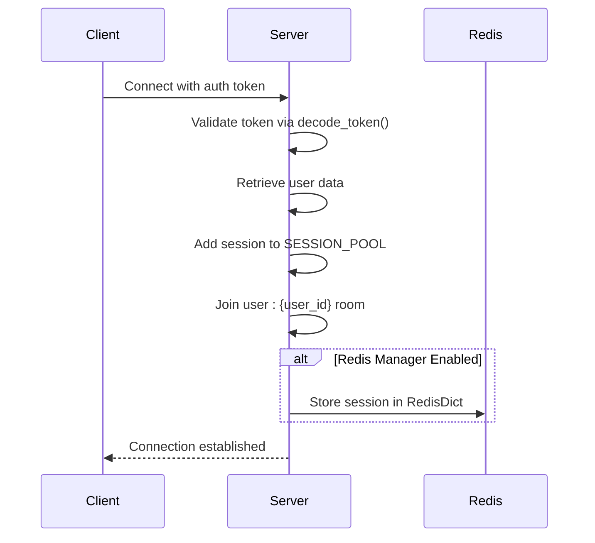
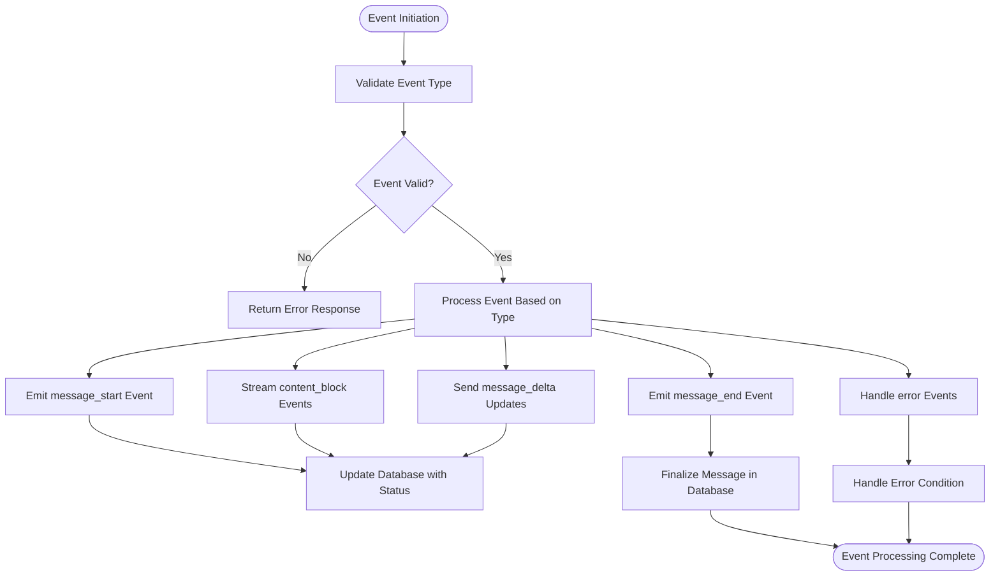
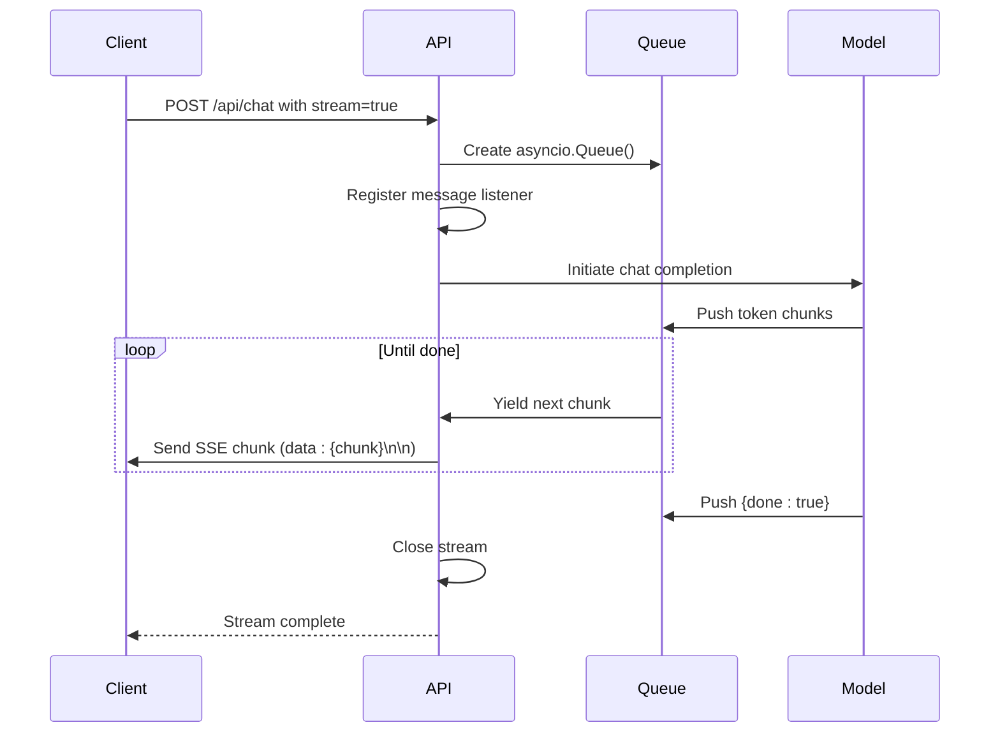
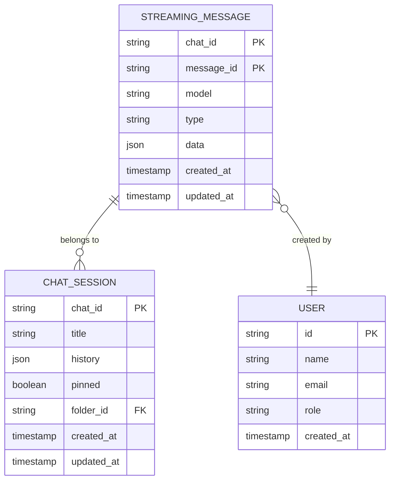
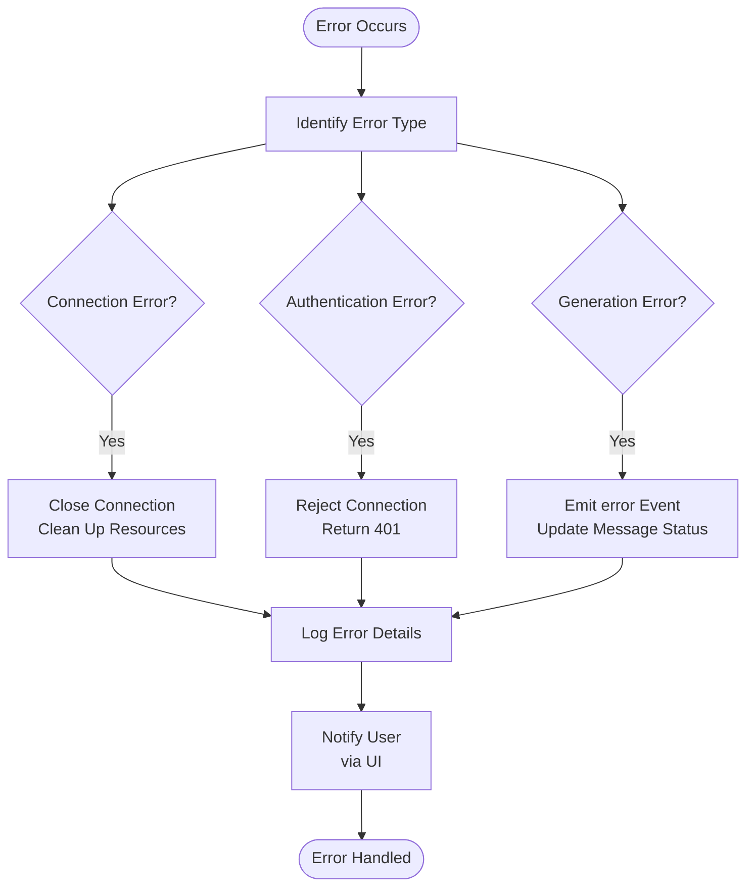
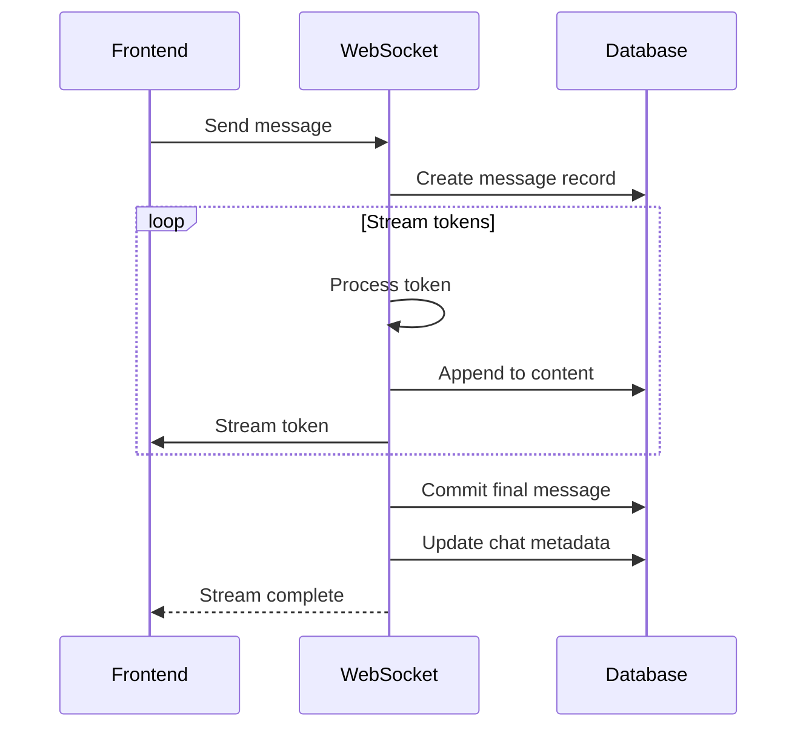

# Chat WebSocket Streaming

<cite>
**Referenced Files in This Document**   
- [main.py](file://backend/open_webui/socket/main.py)
- [utils.py](file://backend/open_webui/socket/utils.py)
- [chat.py](file://backend/open_webui/utils/chat.py)
- [chats.py](file://backend/open_webui/routers/chats.py)
- [+layout.svelte](file://src/routes/+layout.svelte)
- [Messages.svelte](file://src/lib/components/chat/Messages.svelte)
</cite>

## Table of Contents
1. [Introduction](#introduction)
2. [Connection Establishment Process](#connection-establishment-process)
3. [Message Framing and Event Types](#message-framing-and-event-types)
4. [Streaming Protocol for AI Model Responses](#streaming-protocol-for-ai-model-responses)
5. [Data Structure of Streaming Messages](#data-structure-of-streaming-messages)
6. [Frontend Implementation Examples](#frontend-implementation-examples)
7. [Error Handling](#error-handling)
8. [Integration with Chat Persistence System](#integration-with-chat-persistence-system)
9. [Performance Considerations](#performance-considerations)
10. [Conclusion](#conclusion)

## Introduction
The WebSocket-based chat message streaming system in Open WebUI enables real-time, token-by-token delivery of AI model responses to provide an interactive user experience. This documentation details the architecture, implementation, and integration points of the streaming system, focusing on the WebSocket layer, message protocols, and data flow between components.

**Section sources**
- [main.py](file://backend/open_webui/socket/main.py#L1-L839)
- [utils.py](file://backend/open_webui/socket/utils.py#L1-L224)

## Connection Establishment Process
The WebSocket connection establishment process begins with client authentication via JWT tokens. When a client connects to the WebSocket endpoint, it includes an authentication token in the connection request. The server validates this token using the `decode_token` function and retrieves the user information. Upon successful authentication, the server adds the session to the user's room (`user:{user_id}`) and initializes session tracking in the `SESSION_POOL` dictionary.

The system supports both direct and indirect connection modes, with configuration options for Redis-based session management. When Redis is enabled as the WebSocket manager, the system uses `AsyncRedisManager` to handle distributed session state across multiple instances. The connection configuration includes customizable ping intervals and timeouts to maintain connection health.



**Diagram sources**
- [main.py](file://backend/open_webui/socket/main.py#L303-L316)
- [utils.py](file://backend/open_webui/socket/utils.py#L49-L118)

**Section sources**
- [main.py](file://backend/open_webui/socket/main.py#L303-L316)
- [utils.py](file://backend/open_webui/socket/utils.py#L49-L118)

## Message Framing and Event Types
The streaming system implements a comprehensive event-driven architecture with multiple event types for different stages of message processing. The primary event types include:

- **message_start**: Emitted when a new message generation begins
- **content_block**: Delivers partial content chunks during streaming
- **message_delta**: Transmits incremental changes to the message content
- **message_end**: Signals the completion of message generation
- **error**: Communicates error conditions during processing

The system uses Socket.IO's event mechanism to frame messages, with each event carrying a structured payload containing metadata such as chat ID, message ID, and event-specific data. The `get_event_emitter` function creates event emitters that route messages to specific user rooms, ensuring targeted delivery.



**Diagram sources**
- [main.py](file://backend/open_webui/socket/main.py#L695-L800)
- [chats.py](file://backend/open_webui/routers/chats.py#L494-L515)

**Section sources**
- [main.py](file://backend/open_webui/socket/main.py#L695-L800)
- [chats.py](file://backend/open_webui/routers/chats.py#L494-L515)

## Streaming Protocol for AI Model Responses
The streaming protocol facilitates real-time token-by-token response delivery from AI models through a queue-based architecture. When a chat completion request is made with the `stream` parameter set to true, the system creates an asyncio.Queue to buffer response chunks. A message listener is registered on a unique channel (`{user_id}:{session_id}:{request_id}`) to receive streaming data from the model processing pipeline.

The event generator function continuously polls the queue for new messages, yielding them as Server-Sent Events (SSE) with the `text/event-stream` media type. Each chunk is formatted with the `data:` prefix and double newline termination, following the SSE specification. The streaming continues until a `done` flag is received, at which point the connection is closed.



**Diagram sources**
- [chat.py](file://backend/open_webui/utils/chat.py#L91-L149)
- [main.py](file://backend/open_webui/main.py#L1651-L1674)

**Section sources**
- [chat.py](file://backend/open_webui/utils/chat.py#L91-L149)

## Data Structure of Streaming Messages
Streaming messages follow a consistent JSON structure with standardized fields for metadata and content. The core data structure includes:

- **chat_id**: Unique identifier for the chat session
- **message_id**: Unique identifier for the specific message
- **model**: Identifier for the AI model used in generation
- **data**: Payload containing the actual content or event information
- **type**: Event type indicator (status, message, replace, embeds, files, source, citation)

The system maintains message state in both memory and persistent storage, with partial content being incrementally updated in the database during streaming. The `Chats.upsert_message_to_chat_by_id_and_message_id` function handles the incremental updates, concatenating new content chunks to the existing message content.



**Diagram sources**
- [chat.py](file://backend/open_webui/utils/chat.py#L731-L797)
- [chats.py](file://backend/open_webui/routers/chats.py#L464-L493)

**Section sources**
- [chat.py](file://backend/open_webui/utils/chat.py#L731-L797)

## Frontend Implementation Examples
The frontend implementation establishes WebSocket connections and handles streaming responses using Socket.IO client libraries. JavaScript code examples demonstrate how to connect to the WebSocket server, authenticate with tokens, and process incoming message events.

For establishing connections:
```javascript
// Example code structure (path only)
// src/routes/+layout.svelte
```

For handling streaming responses:
```javascript
// Example code structure (path only)
// src/lib/components/chat/Messages.svelte
```

The frontend components subscribe to specific event channels and update the UI in real-time as new tokens arrive. The system implements proper cleanup mechanisms to remove event listeners when components are destroyed, preventing memory leaks.

**Section sources**
- [+layout.svelte](file://src/routes/+layout.svelte#L447-L475)
- [Messages.svelte](file://src/lib/components/chat/Messages.svelte#L1-L465)

## Error Handling
The system implements comprehensive error handling for various failure scenarios including connection timeouts, model generation errors, and authentication failures. When errors occur, the system emits structured error events with detailed information that the frontend can use to provide user feedback.

Connection timeouts are managed through configurable ping intervals and timeouts, with the server automatically cleaning up stale connections. Authentication failures are handled during the connection phase, rejecting unauthorized clients before establishing sessions. Model generation errors are propagated through the event system, allowing the frontend to display appropriate error messages.



**Diagram sources**
- [main.py](file://backend/open_webui/main.py#L1688-L1716)
- [main.py](file://backend/open_webui/socket/main.py#L684-L693)

**Section sources**
- [main.py](file://backend/open_webui/main.py#L1688-L1716)

## Integration with Chat Persistence System
The streaming system is tightly integrated with the chat persistence layer, ensuring that streamed messages are saved to the database upon completion. During the streaming process, the system incrementally updates the message content in the database, concatenating new chunks as they arrive.

When a message is complete, the final content is committed to the database along with metadata such as token counts and generation statistics. The system uses transactional updates to ensure data consistency, with error handling that rolls back incomplete operations if failures occur.

The integration also handles special content types such as files, embeds, and citations, storing them as structured data within the message object. This allows for rich message content that can be reconstructed when loading chat history.



**Diagram sources**
- [chat.py](file://backend/open_webui/utils/chat.py#L731-L797)
- [chats.py](file://backend/open_webui/routers/chats.py#L464-L515)

**Section sources**
- [chat.py](file://backend/open_webui/utils/chat.py#L731-L797)

## Performance Considerations
The system implements several performance optimizations for maintaining long-lived WebSocket connections. Heartbeat mechanisms with configurable intervals ensure connection health, while Redis-based session management enables horizontal scaling across multiple server instances.

Reconnection strategies include exponential backoff algorithms to prevent server overload during network disruptions. The system also implements connection pooling and resource cleanup mechanisms to prevent memory leaks and ensure efficient resource utilization.

For high-traffic scenarios, the Redis-based architecture allows for distributed load balancing, with session state shared across all instances. The system monitors connection metrics and usage patterns to identify potential bottlenecks and optimize performance.

**Section sources**
- [main.py](file://backend/open_webui/socket/main.py#L167-L217)
- [main.py](file://backend/open_webui/socket/main.py#L354-L359)

## Conclusion
The WebSocket-based chat message streaming system in Open WebUI provides a robust foundation for real-time AI interactions. By leveraging Socket.IO for reliable connections, implementing efficient streaming protocols, and integrating with persistent storage, the system delivers a responsive and scalable chat experience. The architecture balances performance, reliability, and maintainability, making it suitable for production deployments with high concurrency requirements.