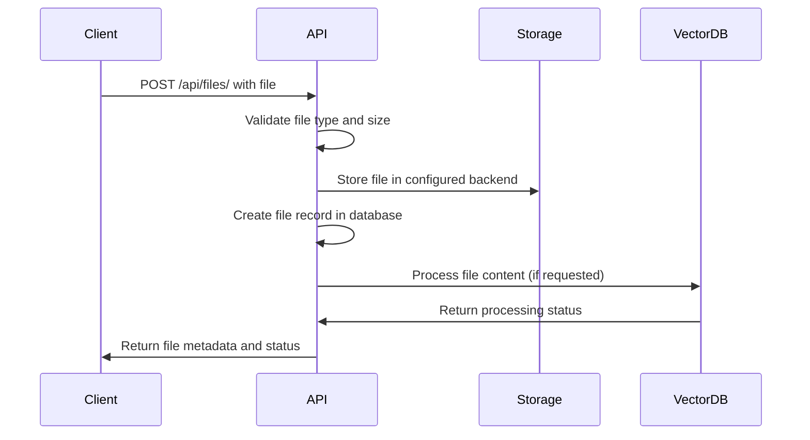
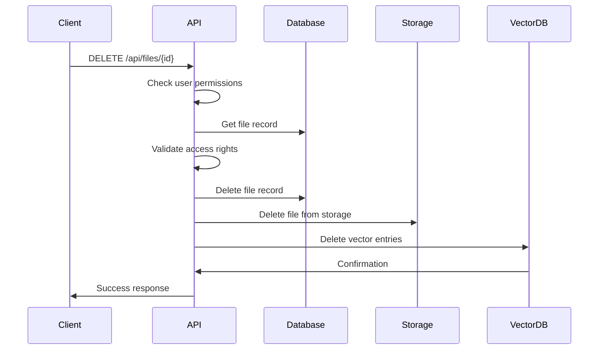
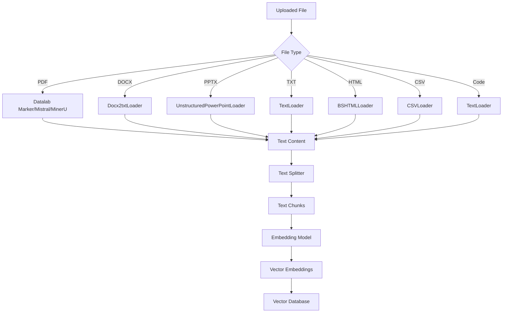
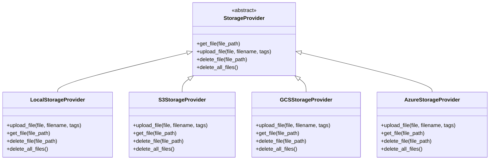

# File Management API

<cite>
**Referenced Files in This Document**   
- [files.py](file://backend/open_webui/routers/files.py)
- [knowledge.py](file://backend/open_webui/routers/knowledge.py)
- [provider.py](file://backend/open_webui/storage/provider.py)
- [retrieval.py](file://backend/open_webui/routers/retrieval.py)
- [config.py](file://backend/open_webui/config.py)
- [files.py](file://backend/open_webui/models/files.py)
- [knowledge.py](file://backend/open_webui/models/knowledge.py)
</cite>

## Table of Contents
1. [Introduction](#introduction)
2. [File Upload Process](#file-upload-process)
3. [File Retrieval Endpoints](#file-retrieval-endpoints)
4. [File Deletion and Management](#file-deletion-and-management)
5. [Knowledge Base Integration](#knowledge-base-integration)
6. [Storage Backends](#storage-backends)
7. [Error Handling](#error-handling)
8. [Security Considerations](#security-considerations)

## Introduction
The File Management API provides comprehensive functionality for uploading, retrieving, managing, and processing files within the Open WebUI system. This API enables users to upload various file types, store them in different backends, and integrate them with knowledge bases for Retrieval-Augmented Generation (RAG) systems. The API supports multipart form data uploads, file metadata management, and seamless integration with vector databases for document processing.

## File Upload Process

### Multipart Form Data Requirements
The file upload endpoint accepts multipart form data with the following parameters:
- `file`: The file to upload (required)
- `metadata`: JSON string containing additional metadata (optional)
- `process`: Boolean indicating whether to process the file after upload (default: true)
- `process_in_background`: Boolean indicating whether to process the file in the background (default: true)

The upload endpoint is accessible via POST request to `/api/files/` and requires authentication.

### Supported File Types and Size Limits
The system supports a wide range of file types, with allowed extensions configurable through the `RAG_ALLOWED_FILE_EXTENSIONS` environment variable. By default, the system accepts common document formats including PDF, DOCX, TXT, and various code files.

File size limits are controlled by the `RAG_FILE_MAX_SIZE` configuration, which specifies the maximum file size in bytes. The default limit can be overridden by environment variables.



**Diagram sources**
- [files.py](file://backend/open_webui/routers/files.py#L152-L286)
- [retrieval.py](file://backend/open_webui/routers/retrieval.py#L801-L1000)

**Section sources**
- [files.py](file://backend/open_webui/routers/files.py#L152-L286)
- [config.py](file://backend/open_webui/config.py#L2629-L2669)

## File Retrieval Endpoints

### Listing User Files
The API provides endpoints to list files with various filtering options. Users can retrieve their files through GET requests to `/api/files/`.

#### Query Parameters
- `content`: Boolean to include file content in response (default: true)
- `filename`: Pattern to search for files by filename (supports wildcards)

The response returns a list of file objects with metadata including file ID, name, size, content type, and processing status.

### Retrieving File Metadata
Individual file metadata can be retrieved using the file ID through a GET request to `/api/files/{id}`. This endpoint returns detailed information about the file including:
- File ID and user ID
- Filename and path
- Metadata (content type, size, name)
- Data (processing status, error messages)
- Timestamps (created_at, updated_at)

### Retrieving File Content
File content can be retrieved through several endpoints:
- `/api/files/{id}/content` - Returns the file content with appropriate headers
- `/api/files/{id}/data/content` - Returns only the processed text content
- `/api/files/{id}/content/html` - Returns HTML content (admin only)

The content endpoint supports an `attachment` parameter to force download instead of inline display.

```mermaid
flowchart TD
A[Client Request] --> B{Endpoint Type}
B --> |List Files| C[/api/files/]
B --> |Get File Metadata| D[/api/files/{id}]
B --> |Get File Content| E[/api/files/{id}/content]
B --> |Get Processed Content| F[/api/files/{id}/data/content]
C --> G[Return File List]
D --> H[Return File Metadata]
E --> I[Return File Content]
F --> J[Return Processed Text]
```

**Diagram sources**
- [files.py](file://backend/open_webui/routers/files.py#L294-L306)
- [files.py](file://backend/open_webui/routers/files.py#L383-L403)
- [files.py](file://backend/open_webui/routers/files.py#L541-L657)

**Section sources**
- [files.py](file://backend/open_webui/routers/files.py#L294-L657)

## File Deletion and Management

### Deleting Individual Files
Files can be deleted by sending a DELETE request to `/api/files/{id}`. The system performs the following operations:
1. Validates user permissions
2. Removes the file record from the database
3. Deletes the file from storage
4. Removes associated vector database entries

Users can only delete files they own or have write access to, unless they are administrators.

### Deleting All Files
Administrators can delete all files by sending a DELETE request to `/api/files/all`. This operation removes all files from the system, including:
- All file records from the database
- All files from storage
- All vector database collections

### Checking Processing Status
The processing status of a file can be checked using `/api/files/{id}/process/status`. This endpoint returns the current status of file processing, which can be:
- "pending" - File is queued for processing
- "completed" - File processing completed successfully
- "failed" - File processing failed (includes error message)
- "not_found" - File does not exist

The endpoint supports streaming responses via Server-Sent Events when the `stream` parameter is set to true.



**Diagram sources**
- [files.py](file://backend/open_webui/routers/files.py#L722-L755)
- [files.py](file://backend/open_webui/routers/files.py#L356-L375)
- [files.py](file://backend/open_webui/routers/files.py#L406-L460)

**Section sources**
- [files.py](file://backend/open_webui/routers/files.py#L356-L761)

## Knowledge Base Integration

### Document Processing Pipeline
The system integrates file management with knowledge bases through a document processing pipeline. When files are uploaded or added to knowledge bases, they undergo the following processing steps:

1. **Content Extraction**: The system extracts text content from the file using appropriate loaders based on file type
2. **Text Splitting**: Extracted content is split into chunks using configurable text splitters
3. **Embedding Generation**: Text chunks are converted to vector embeddings using the configured embedding model
4. **Vector Storage**: Embeddings are stored in the vector database with metadata linking to the original file

### RAG System Integration
Files can be associated with knowledge bases for use in Retrieval-Augmented Generation systems. The integration process involves:

1. Creating or selecting a knowledge base
2. Adding files to the knowledge base
3. Processing files to generate embeddings
4. Storing embeddings in a dedicated vector collection

The knowledge base system supports access control, allowing files to be shared with specific users or groups.

### Processing Configuration
The document processing pipeline is highly configurable through the following settings:
- `RAG_TEXT_SPLITTER`: Text splitter to use (recursive, token, markdown headers)
- `CHUNK_SIZE`: Size of text chunks (default: 1000)
- `CHUNK_OVERLAP`: Overlap between chunks (default: 100)
- `RAG_EMBEDDING_MODEL`: Model used for generating embeddings
- `RAG_EMBEDDING_BATCH_SIZE`: Number of documents to process in parallel



**Diagram sources**
- [retrieval.py](file://backend/open_webui/routers/retrieval.py#L801-L1000)
- [main.py](file://backend/open_webui/retrieval/loaders/main.py#L1-L200)
- [retrieval.py](file://backend/open_webui/routers/retrieval.py#L2774-L2781)

**Section sources**
- [retrieval.py](file://backend/open_webui/routers/retrieval.py#L801-L1000)
- [knowledge.py](file://backend/open_webui/routers/knowledge.py#L277-L340)
- [main.py](file://backend/open_webui/retrieval/loaders/main.py#L1-L200)

## Storage Backends

### Supported Storage Providers
The system supports multiple storage backends, configurable through the `STORAGE_PROVIDER` environment variable. Available providers include:

- **Local Storage**: Files are stored in the local filesystem (default)
- **S3**: Amazon S3 or compatible object storage
- **GCS**: Google Cloud Storage
- **Azure**: Azure Blob Storage

### Configuration
Each storage backend requires specific configuration parameters:

#### S3 Configuration
- `S3_ACCESS_KEY_ID`: AWS access key ID
- `S3_SECRET_ACCESS_KEY`: AWS secret access key
- `S3_REGION_NAME`: AWS region name
- `S3_BUCKET_NAME`: S3 bucket name
- `S3_KEY_PREFIX`: Optional prefix for object keys
- `S3_ENDPOINT_URL`: Custom endpoint URL (for S3-compatible services)

#### Google Cloud Storage Configuration
- `GCS_BUCKET_NAME`: GCS bucket name
- `GOOGLE_APPLICATION_CREDENTIALS_JSON`: Service account credentials as JSON

#### Azure Blob Storage Configuration
- `AZURE_STORAGE_ENDPOINT`: Storage account endpoint
- `AZURE_STORAGE_CONTAINER_NAME`: Container name
- `AZURE_STORAGE_KEY`: Storage account key

### Storage Provider Implementation
The storage system uses an abstract interface with specific implementations for each provider. All providers implement the same core methods:
- `upload_file()`: Upload a file and return its path
- `get_file()`: Retrieve a file from storage
- `delete_file()`: Remove a file from storage
- `delete_all_files()`: Remove all files from storage

When using cloud storage providers, files are also cached locally to improve retrieval performance.



**Diagram sources**
- [provider.py](file://backend/open_webui/storage/provider.py#L43-L377)
- [config.py](file://backend/open_webui/config.py#L880-L903)

**Section sources**
- [provider.py](file://backend/open_webui/storage/provider.py#L43-L377)
- [config.py](file://backend/open_webui/config.py#L880-L903)

## Error Handling

### File Parsing Failures
The system handles various file parsing failures with specific error responses:

- **Unsupported File Type**: Returns 400 Bad Request when the file extension is not in the allowed list
- **Empty Content**: Returns 400 Bad Request when the uploaded file has no content
- **Processing Errors**: Returns 400 Bad Request with specific error details when content extraction fails
- **Storage Errors**: Returns 400 Bad Request when file storage operations fail

When a file fails to process, the system updates the file record with the error status and message, which can be retrieved through the file status endpoint.

### Storage Limitations
The system enforces storage limitations through configuration:

- **File Size Limits**: Enforced through the `RAG_FILE_MAX_SIZE` configuration
- **File Count Limits**: Enforced through the `RAG_FILE_MAX_COUNT` configuration
- **Extension Restrictions**: Enforced through the `RAG_ALLOWED_FILE_EXTENSIONS` configuration

When limitations are exceeded, the system returns appropriate HTTP error codes:
- 400 Bad Request for size and count limits
- 413 Payload Too Large for files exceeding size limits

### Error Response Format
Error responses follow a consistent format:
```json
{
  "detail": "Error message describing the issue"
}
```

The error message provides specific details about the failure, which can be used for troubleshooting.

**Section sources**
- [files.py](file://backend/open_webui/routers/files.py#L281-L286)
- [files.py](file://backend/open_webui/routers/files.py#L207-L213)
- [provider.py](file://backend/open_webui/storage/provider.py#L69-L70)

## Security Considerations

### File Type Validation
The system implements strict file type validation through multiple mechanisms:

1. **Extension Validation**: Files are validated against the `ALLOWED_FILE_EXTENSIONS` list
2. **Content Type Validation**: The system checks the MIME type of uploaded files
3. **Content Validation**: For certain file types, additional content validation is performed

The validation occurs during the upload process, preventing unauthorized file types from being stored.

### Access Control
The system implements comprehensive access control for file operations:

- **Ownership**: Users can only modify files they own
- **Permissions**: Files can be shared with specific users or groups with read or write permissions
- **Admin Access**: Administrators have full access to all files
- **Knowledge Base Access**: File access through knowledge bases follows the knowledge base's access control rules

Access checks are performed on all file operations, ensuring that users can only access files they have permission to view or modify.

### Virus Scanning
While the current implementation does not include built-in virus scanning, the architecture supports integration with external scanning services through the following mechanisms:

1. **Pre-processing Hooks**: Custom processing functions can be added to scan files before storage
2. **External Services**: Integration with external document processing services that include virus scanning
3. **Storage Provider Features**: Utilizing virus scanning features of cloud storage providers

The system can be extended to include virus scanning by implementing custom processing functions that integrate with antivirus APIs.

**Section sources**
- [files.py](file://backend/open_webui/routers/files.py#L207-L213)
- [files.py](file://backend/open_webui/routers/files.py#L393-L403)
- [files.py](file://backend/open_webui/routers/files.py#L732-L736)
- [knowledge.py](file://backend/open_webui/routers/knowledge.py#L197-L201)