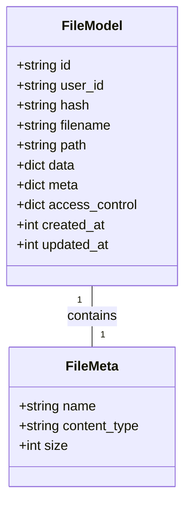
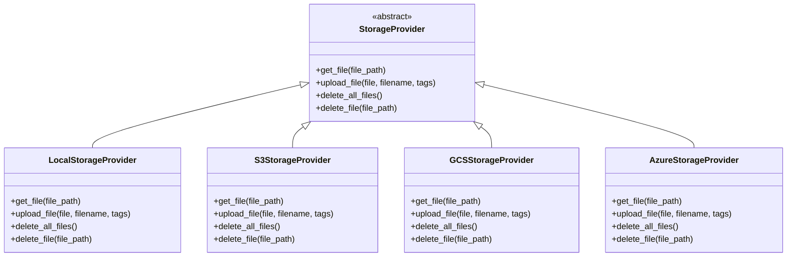
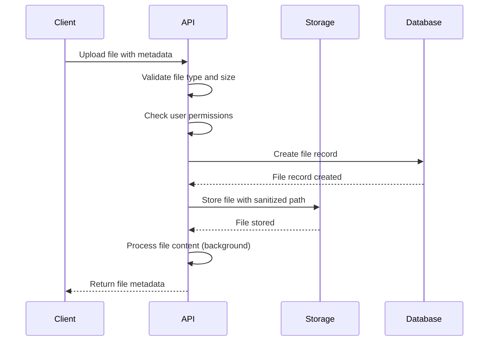

# File Operations API

<cite>
**Referenced Files in This Document**   
- [files.py](file://backend/open_webui/routers/files.py)
- [provider.py](file://backend/open_webui/storage/provider.py)
- [files.py](file://backend/open_webui/models/files.py)
- [files.py](file://backend/open_webui/utils/files.py)
- [config.py](file://backend/open_webui/config.py)
- [constants.py](file://backend/open_webui/constants.py)
- [index.ts](file://src/lib/apis/files/index.ts)
</cite>

## Table of Contents
1. [Introduction](#introduction)
2. [API Endpoints](#api-endpoints)
3. [File Metadata Structure](#file-metadata-structure)
4. [Storage Backend Configuration](#storage-backend-configuration)
5. [Security Measures](#security-measures)
6. [Usage Examples](#usage-examples)
7. [Troubleshooting Guide](#troubleshooting-guide)
8. [Error Codes](#error-codes)

## Introduction
The File Operations API provides comprehensive functionality for managing files within the Open WebUI application. This API enables users to upload, download, list, and delete files through REST endpoints. The system supports various file types including PDF, DOCX, TXT, and others, with configurable size limitations and storage backends. Files are processed for content extraction and indexing to support retrieval-augmented generation (RAG) capabilities.

The API is designed with security in mind, implementing access control checks, file type validation, and path sanitization. It supports both local storage and cloud storage providers including AWS S3, Google Cloud Storage (GCS), and Azure Blob Storage. The API endpoints are protected by authentication and authorization mechanisms to ensure only authorized users can perform operations on files.

**Section sources**
- [files.py](file://backend/open_webui/routers/files.py#L1-L761)
- [provider.py](file://backend/open_webui/storage/provider.py#L1-L377)

## API Endpoints

### POST /upload
Uploads a file to the server with optional metadata. The file is processed according to the configuration settings.

**Request Parameters**
- `file` (required): The file to upload as multipart form data
- `metadata` (optional): JSON string containing additional metadata
- `process` (query parameter, default: true): Whether to process the file after upload
- `process_in_background` (query parameter, default: true): Whether to process the file in background

**Response Schema**
```json
{
  "status": true,
  "id": "string",
  "user_id": "string",
  "filename": "string",
  "data": {
    "status": "string",
    "error": "string"
  },
  "meta": {
    "name": "string",
    "content_type": "string",
    "size": "integer",
    "data": {}
  },
  "created_at": "integer",
  "updated_at": "integer"
}
```

**Section sources**
- [files.py](file://backend/open_webui/routers/files.py#L152-L287)

### GET /list
Retrieves a list of files accessible to the authenticated user.

**Request Parameters**
- `content` (query parameter, default: true): Whether to include file content in the response

**Response Schema**
```json
[
  {
    "id": "string",
    "user_id": "string",
    "filename": "string",
    "data": {},
    "meta": {
      "name": "string",
      "content_type": "string",
      "size": "integer",
      "data": {}
    },
    "created_at": "integer",
    "updated_at": "integer"
  }
]
```

**Section sources**
- [files.py](file://backend/open_webui/routers/files.py#L294-L307)

### GET /{file_id}
Retrieves metadata for a specific file by ID.

**Response Schema**
```json
{
  "id": "string",
  "user_id": "string",
  "filename": "string",
  "path": "string",
  "data": {},
  "meta": {
    "name": "string",
    "content_type": "string",
    "size": "integer",
    "data": {}
  },
  "access_control": {},
  "created_at": "integer",
  "updated_at": "integer"
}
```

**Section sources**
- [files.py](file://backend/open_webui/routers/files.py#L383-L403)

### GET /{file_id}/content
Downloads the content of a specific file.

**Request Parameters**
- `attachment` (query parameter, default: false): Whether to force attachment download

**Section sources**
- [files.py](file://backend/open_webui/routers/files.py#L541-L608)

### DELETE /{file_id}
Deletes a specific file by ID.

**Response Schema**
```json
{
  "message": "File deleted successfully"
}
```

**Section sources**
- [files.py](file://backend/open_webui/routers/files.py#L722-L755)

## File Metadata Structure
The file metadata structure contains comprehensive information about each file, stored in the database and accessible through the API.

### Core Properties
- **id**: Unique identifier for the file (UUID)
- **user_id**: ID of the user who uploaded the file
- **filename**: Original filename provided during upload
- **path**: Storage path where the file is persisted
- **data**: Processing status and additional data
- **meta**: Metadata including name, content type, size, and custom data
- **access_control**: Access control configuration
- **created_at**: Timestamp of file creation (epoch)
- **updated_at**: Timestamp of last update (epoch)

### Metadata Fields
- **name**: Display name of the file
- **content_type**: MIME type of the file
- **size**: File size in bytes
- **data**: Custom metadata provided during upload



**Diagram sources **
- [files.py](file://backend/open_webui/models/files.py#L18-L53)
- [files.py](file://backend/open_webui/models/files.py#L60-L65)

**Section sources**
- [files.py](file://backend/open_webui/models/files.py#L18-L290)

## Storage Backend Configuration
The system supports multiple storage backends that can be configured through environment variables.

### Configuration Options
- **STORAGE_PROVIDER**: Storage provider to use (local, s3, gcs, azure)
- **UPLOAD_DIR**: Directory for local file storage
- **S3_ACCESS_KEY_ID**: AWS S3 access key ID
- **S3_SECRET_ACCESS_KEY**: AWS S3 secret access key
- **S3_REGION_NAME**: AWS S3 region name
- **S3_BUCKET_NAME**: AWS S3 bucket name
- **S3_KEY_PREFIX**: Prefix for S3 object keys
- **S3_ENDPOINT_URL**: Custom S3 endpoint URL
- **GCS_BUCKET_NAME**: Google Cloud Storage bucket name
- **GOOGLE_APPLICATION_CREDENTIALS_JSON**: GCS service account credentials
- **AZURE_STORAGE_ENDPOINT**: Azure Storage endpoint
- **AZURE_STORAGE_CONTAINER_NAME**: Azure container name
- **AZURE_STORAGE_KEY**: Azure Storage account key

### Storage Provider Implementation
The storage system uses an abstract base class with concrete implementations for each provider:



**Diagram sources **
- [provider.py](file://backend/open_webui/storage/provider.py#L43-L62)
- [provider.py](file://backend/open_webui/storage/provider.py#L63-L106)
- [provider.py](file://backend/open_webui/storage/provider.py#L108-L224)
- [provider.py](file://backend/open_webui/storage/provider.py#L226-L290)
- [provider.py](file://backend/open_webui/storage/provider.py#L292-L359)

**Section sources**
- [provider.py](file://backend/open_webui/storage/provider.py#L1-L377)
- [config.py](file://backend/open_webui/config.py#L880-L909)

## Security Measures
The file operations API implements multiple security measures to protect against common vulnerabilities.

### Authentication and Authorization
- All endpoints require authentication via Bearer token
- Users can only access their own files unless they have admin privileges
- Access control checks are performed for shared files through knowledge bases
- Admin users have full access to all files

### File Validation
- File type validation based on allowed extensions
- Content type verification
- File size limits enforced
- Path sanitization to prevent directory traversal
- Metadata validation and sanitization

### Processing Security
- Content extraction performed in isolated environment
- File processing errors are logged and reported
- Failed processing attempts are tracked in file metadata
- Background processing with error handling



**Diagram sources **
- [files.py](file://backend/open_webui/routers/files.py#L194-L213)
- [files.py](file://backend/open_webui/routers/files.py#L219-L228)
- [files.py](file://backend/open_webui/routers/files.py#L230-L248)

**Section sources**
- [files.py](file://backend/open_webui/routers/files.py#L1-L761)
- [provider.py](file://backend/open_webui/storage/provider.py#L1-L377)

## Usage Examples

### Uploading Files via curl
```bash
# Upload a PDF file with metadata
curl -X POST "http://localhost:8080/files/" \
  -H "Authorization: Bearer <your_token>" \
  -H "Accept: application/json" \
  -F "file=@document.pdf" \
  -F "metadata={\"category\": \"research\"}" \
  -F "process=true"

# Upload a text file without processing
curl -X POST "http://localhost:8080/files/" \
  -H "Authorization: Bearer <your_token>" \
  -H "Accept: application/json" \
  -F "file=@notes.txt" \
  -F "process=false"
```

### Uploading Files via JavaScript fetch
```javascript
// Upload file with metadata
async function uploadFile(token, file, metadata = null) {
  const data = new FormData();
  data.append('file', file);
  if (metadata) {
    data.append('metadata', JSON.stringify(metadata));
  }

  const response = await fetch(`${WEBUI_API_BASE_URL}/files/`, {
    method: 'POST',
    headers: {
      Accept: 'application/json',
      authorization: `Bearer ${token}`
    },
    body: data
  });

  if (!response.ok) {
    throw await response.json();
  }

  return response.json();
}

// Example usage
const fileInput = document.getElementById('file-input');
const file = fileInput.files[0];
const metadata = { category: 'research', tags: ['ai', 'ml'] };

try {
  const result = await uploadFile('your-token', file, metadata);
  console.log('File uploaded:', result);
} catch (error) {
  console.error('Upload failed:', error);
}
```

### Listing Files
```javascript
async function getFiles(token) {
  const response = await fetch(`${WEBUI_API_BASE_URL}/files/`, {
    method: 'GET',
    headers: {
      Accept: 'application/json',
      authorization: `Bearer ${token}`
    }
  });

  if (!response.ok) {
    throw await response.json();
  }

  return response.json();
}
```

**Section sources**
- [index.ts](file://src/lib/apis/files/index.ts#L4-L85)
- [index.ts](file://src/lib/apis/files/index.ts#L137-L197)

## Troubleshooting Guide

### Upload Failures
**Symptoms**: Upload requests return 400 Bad Request errors.

**Possible Causes and Solutions**:
- **File type not allowed**: Check the `RAG_ALLOWED_FILE_EXTENSIONS` environment variable and ensure the file extension is included
- **File too large**: Verify the file size is within the limit defined by `RAG_FILE_MAX_SIZE`
- **Invalid metadata**: Ensure metadata is valid JSON format
- **Storage full**: Check available disk space for local storage or storage quota for cloud providers

### Permission Errors
**Symptoms**: Access denied errors when trying to access or delete files.

**Possible Causes and Solutions**:
- **Insufficient privileges**: Verify the user has appropriate permissions (users can only access their own files)
- **Authentication token expired**: Refresh the authentication token
- **Admin access required**: For operations requiring admin privileges, ensure the user has admin role

### Storage Quota Limits
**Symptoms**: Uploads fail with "Error uploading file" messages.

**Possible Causes and Solutions**:
- **Local storage full**: Clean up the upload directory or increase disk space
- **Cloud storage quota exceeded**: Check the storage provider's quota limits and upgrade if necessary
- **File count limit reached**: The system enforces a maximum file count per user defined by `RAG_FILE_MAX_COUNT`

### Processing Issues
**Symptoms**: Files show "failed" status in processing.

**Possible Causes and Solutions**:
- **Content extraction engine issues**: Check the `CONTENT_EXTRACTION_ENGINE` configuration and logs
- **Unsupported file format**: Verify the file format is supported by the extraction engine
- **Memory limitations**: Increase system memory or configure smaller chunk sizes

**Section sources**
- [files.py](file://backend/open_webui/routers/files.py#L281-L286)
- [files.py](file://backend/open_webui/routers/files.py#L743-L749)
- [constants.py](file://backend/open_webui/constants.py#L62-L63)
- [constants.py](file://backend/open_webui/constants.py#L99-L100)

## Error Codes
The API returns standardized error responses with descriptive messages.

### Common Error Codes
- **400 Bad Request**: Invalid request parameters, file type not allowed, or metadata format error
- **401 Unauthorized**: Missing or invalid authentication token
- **403 Forbidden**: Insufficient permissions to perform the operation
- **404 Not Found**: File or endpoint not found
- **500 Internal Server Error**: Server-side error during file operations

### Error Response Schema
```json
{
  "detail": "Error description"
}
```

### Specific Error Messages
- **File type not allowed**: "File type {extension} is not allowed"
- **File too large**: "File is too large. Maximum size is {size}"
- **File not found**: "File not found"
- **Access denied**: "Access denied"
- **Error uploading file**: "Error uploading file"
- **Error deleting file**: "Error deleting file"

**Section sources**
- [constants.py](file://backend/open_webui/constants.py#L19-L107)
- [files.py](file://backend/open_webui/routers/files.py#L283-L286)
- [files.py](file://backend/open_webui/routers/files.py#L746-L749)