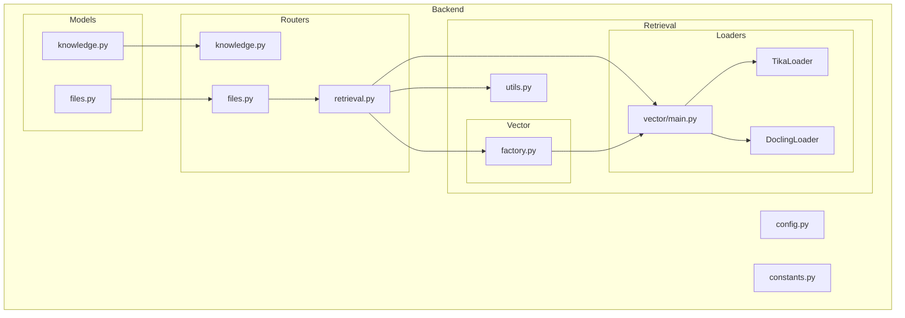
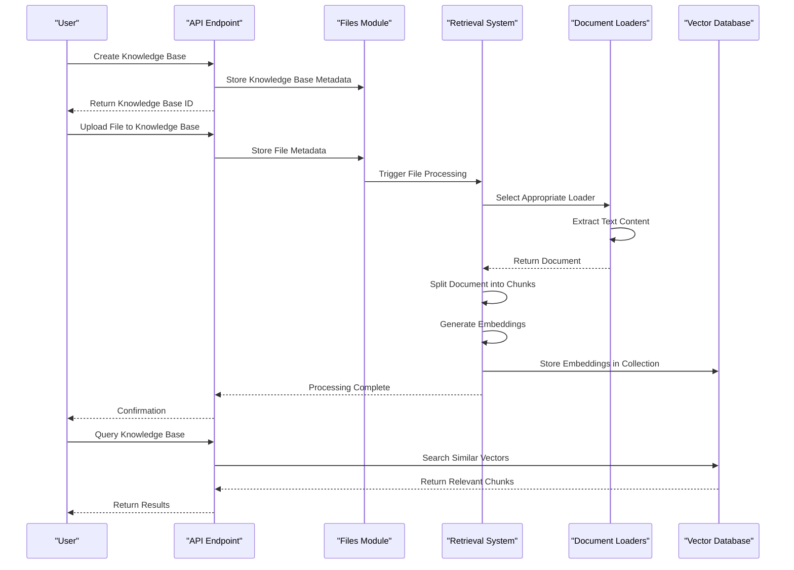
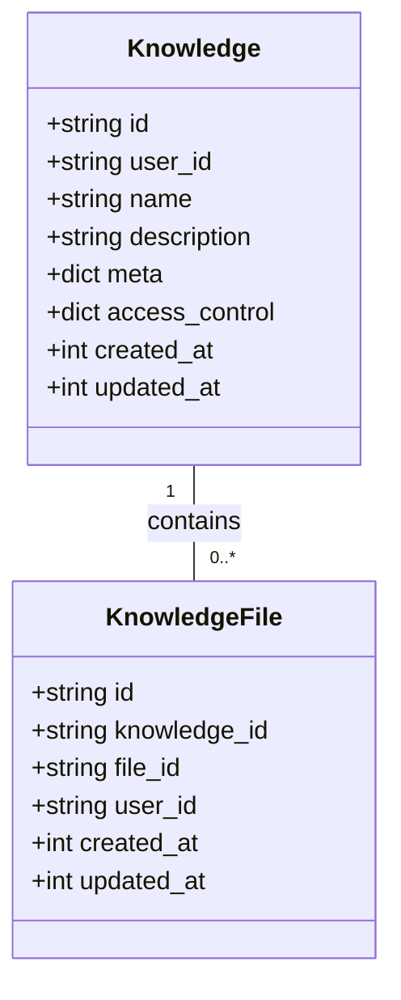
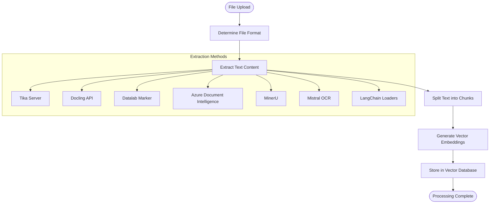
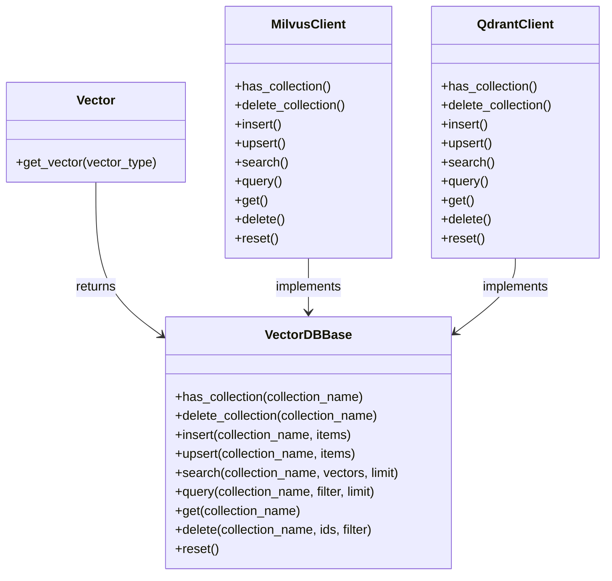
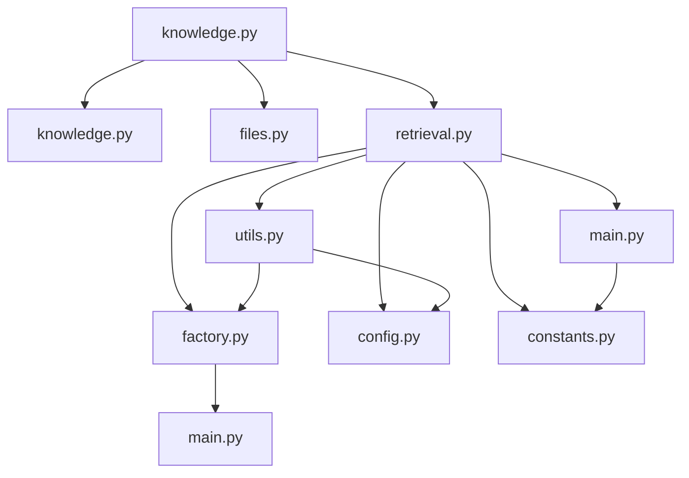

# Knowledge Integration API

<cite>
**Referenced Files in This Document**   
- [knowledge.py](file://backend/open_webui/models/knowledge.py)
- [knowledge.py](file://backend/open_webui/routers/knowledge.py)
- [files.py](file://backend/open_webui/models/files.py)
- [main.py](file://backend/open_webui/retrieval/loaders/main.py)
- [retrieval.py](file://backend/open_webui/routers/retrieval.py)
- [factory.py](file://backend/open_webui/retrieval/vector/factory.py)
- [utils.py](file://backend/open_webui/retrieval/utils.py)
- [main.py](file://backend/open_webui/retrieval/vector/main.py)
- [config.py](file://backend/open_webui/config.py)
- [constants.py](file://backend/open_webui/constants.py)
</cite>

## Table of Contents
1. [Introduction](#introduction)
2. [Project Structure](#project-structure)
3. [Core Components](#core-components)
4. [Architecture Overview](#architecture-overview)
5. [Detailed Component Analysis](#detailed-component-analysis)
6. [Dependency Analysis](#dependency-analysis)
7. [Performance Considerations](#performance-considerations)
8. [Troubleshooting Guide](#troubleshooting-guide)
9. [Conclusion](#conclusion)

## Introduction
The Knowledge Integration API provides a comprehensive system for processing uploaded files into searchable knowledge bases. This documentation details the workflow from file upload to vectorization, including document parsing through retrieval/loaders, endpoints for creating knowledge bases, adding files to knowledge bases, and processing status tracking. The integration between files.py and knowledge.py when a file is marked for RAG processing is explained, along with supported document formats and text extraction methods (Tika, Docling, etc.). The vector storage configuration and how processed content is indexed for retrieval are described, along with examples of creating a knowledge base, uploading a document to it, and querying the embedded content. Error handling for parsing failures, unsupported formats, and indexing errors is addressed, as well as how users can associate knowledge bases with AI models for contextual responses.

## Project Structure
The Knowledge Integration API is organized within the backend/open_webui directory structure, with key components separated into logical modules. The core functionality is distributed across models, routers, retrieval, and utils directories. The models directory contains the data schema definitions for knowledge bases and files, while the routers directory handles the API endpoints. The retrieval directory contains the document processing pipeline, including loaders for different document types and vector database integration. Configuration and constants are managed in separate files to provide a clean separation of concerns.

**Diagram sources**
- [knowledge.py](file://backend/open_webui/models/knowledge.py)
- [files.py](file://backend/open_webui/models/files.py)
- [retrieval.py](file://backend/open_webui/routers/retrieval.py)
- [main.py](file://backend/open_webui/retrieval/loaders/main.py)
- [factory.py](file://backend/open_webui/retrieval/vector/factory.py)
- [main.py](file://backend/open_webui/retrieval/vector/main.py)
- [utils.py](file://backend/open_webui/retrieval/utils.py)

**Section sources**
- [knowledge.py](file://backend/open_webui/models/knowledge.py)
- [files.py](file://backend/open_webui/models/files.py)
- [retrieval.py](file://backend/open_webui/routers/retrieval.py)
- [main.py](file://backend/open_webui/retrieval/loaders/main.py)
- [factory.py](file://backend/open_webui/retrieval/vector/factory.py)
- [utils.py](file://backend/open_webui/retrieval/utils.py)
- [config.py](file://backend/open_webui/config.py)

## Core Components
The Knowledge Integration API consists of several core components that work together to process documents and make them searchable. The knowledge.py module defines the data model for knowledge bases and their relationships with files. The retrieval system uses various document loaders to extract text from different file formats, which are then processed and stored in a vector database for efficient retrieval. The API endpoints in knowledge.py and retrieval.py provide the interface for creating knowledge bases, adding files, and querying content. Configuration settings in config.py control the behavior of the document processing pipeline, including which extraction engine to use and how to split text into chunks.

**Section sources**
- [knowledge.py](file://backend/open_webui/models/knowledge.py)
- [retrieval.py](file://backend/open_webui/routers/retrieval.py)
- [main.py](file://backend/open_webui/retrieval/loaders/main.py)
- [config.py](file://backend/open_webui/config.py)

## Architecture Overview
The Knowledge Integration API follows a modular architecture with clear separation between data models, API endpoints, and processing logic. When a file is uploaded, it is first stored in the file system and recorded in the database through the files.py module. The retrieval system then processes the file based on its type, using appropriate loaders to extract text content. The extracted text is split into chunks according to configuration settings and converted into vector embeddings using the configured embedding model. These embeddings are stored in a vector database collection associated with the knowledge base. When querying, the system searches for similar vectors and returns the most relevant content.

**Diagram sources**
- [knowledge.py](file://backend/open_webui/models/knowledge.py)
- [files.py](file://backend/open_webui/models/files.py)
- [retrieval.py](file://backend/open_webui/routers/retrieval.py)
- [main.py](file://backend/open_webui/retrieval/loaders/main.py)
- [factory.py](file://backend/open_webui/retrieval/vector/factory.py)

## Detailed Component Analysis

### Knowledge Base Management
The knowledge base management system provides endpoints for creating, updating, and deleting knowledge bases. Each knowledge base has a unique ID, name, description, and access control settings that determine who can read or write to it. When a knowledge base is created, it is stored in the database with metadata about its creator and creation time. Users can add files to a knowledge base, which creates a relationship between the knowledge base and the file in the database.

#### Knowledge Base Data Model

**Diagram sources**
- [knowledge.py](file://backend/open_webui/models/knowledge.py#L36-L102)

**Section sources**
- [knowledge.py](file://backend/open_webui/models/knowledge.py#L36-L370)
- [knowledge.py](file://backend/open_webui/routers/knowledge.py#L7-L662)

### Document Processing Pipeline
The document processing pipeline handles the extraction of text content from uploaded files and its conversion into searchable vectors. The system supports multiple document formats and uses different extraction methods based on configuration settings. When a file is marked for processing, the appropriate loader is selected based on the file type and configured extraction engine. The extracted text is then split into chunks and converted into vector embeddings for storage in the vector database.

#### Document Processing Workflow

**Diagram sources**
- [main.py](file://backend/open_webui/retrieval/loaders/main.py#L187-L397)
- [retrieval.py](file://backend/open_webui/routers/retrieval.py#L1445-L1667)

**Section sources**
- [main.py](file://backend/open_webui/retrieval/loaders/main.py#L1-L398)
- [retrieval.py](file://backend/open_webui/routers/retrieval.py#L1233-L1437)

### Vector Storage Configuration
The vector storage system provides a flexible interface to multiple vector database backends through a factory pattern. The system supports various vector databases including Milvus, Qdrant, Pinecone, and others. The configuration determines which vector database to use and whether to enable multitenancy modes for certain databases. The vector client provides methods for creating collections, inserting vectors, searching by similarity, and managing metadata.

#### Vector Database Abstraction

**Diagram sources**
- [factory.py](file://backend/open_webui/retrieval/vector/factory.py#L10-L78)
- [main.py](file://backend/open_webui/retrieval/vector/main.py#L23-L86)

**Section sources**
- [factory.py](file://backend/open_webui/retrieval/vector/factory.py#L1-L79)
- [main.py](file://backend/open_webui/retrieval/vector/main.py#L1-L87)

## Dependency Analysis
The Knowledge Integration API has a well-defined dependency structure that separates concerns between components. The knowledge.py module depends on the files.py module to access file metadata when retrieving knowledge bases with their associated files. The retrieval system depends on the vector database client to store and search vector embeddings. Configuration settings from config.py are used throughout the system to control behavior such as which document extraction engine to use and how to split text into chunks. Error messages from constants.py are used consistently across the API to provide standardized responses.

**Diagram sources**
- [knowledge.py](file://backend/open_webui/routers/knowledge.py)
- [retrieval.py](file://backend/open_webui/routers/retrieval.py)
- [factory.py](file://backend/open_webui/retrieval/vector/factory.py)
- [main.py](file://backend/open_webui/retrieval/loaders/main.py)
- [utils.py](file://backend/open_webui/retrieval/utils.py)
- [config.py](file://backend/open_webui/config.py)
- [constants.py](file://backend/open_webui/constants.py)

**Section sources**
- [knowledge.py](file://backend/open_webui/routers/knowledge.py#L7-L662)
- [retrieval.py](file://backend/open_webui/routers/retrieval.py#L1-L2504)
- [factory.py](file://backend/open_webui/retrieval/vector/factory.py#L1-L79)
- [main.py](file://backend/open_webui/retrieval/loaders/main.py#L1-L398)
- [utils.py](file://backend/open_webui/retrieval/utils.py#L1-L1324)
- [config.py](file://backend/open_webui/config.py#L1-L3840)
- [constants.py](file://backend/open_webui/constants.py#L1-L127)

## Performance Considerations
The Knowledge Integration API includes several performance optimizations to handle document processing efficiently. The system supports asynchronous embedding generation to prevent blocking API requests during vectorization. Document text is split into configurable chunks to balance retrieval accuracy with performance. The vector database client provides batch operations for inserting multiple vectors at once, reducing database round trips. Caching mechanisms are used where appropriate, such as in the Datalab Marker integration which can skip processing if a document has already been processed. The system also includes rate limiting and resource management to prevent overloading.

**Section sources**
- [retrieval.py](file://backend/open_webui/routers/retrieval.py#L1376-L1413)
- [config.py](file://backend/open_webui/config.py#L1-L3840)

## Troubleshooting Guide
The Knowledge Integration API includes comprehensive error handling to assist with troubleshooting common issues. When document processing fails, the system updates the file status to "failed" and stores the error message in the file metadata. Common errors include unsupported file formats, missing dependencies like Pandoc for certain conversions, and authentication issues with external services. The API returns standardized error messages from constants.py to provide consistent feedback. Processing status can be monitored through the file status endpoint, which supports streaming updates for long-running operations.

**Section sources**
- [retrieval.py](file://backend/open_webui/routers/retrieval.py#L1650-L1666)
- [constants.py](file://backend/open_webui/constants.py#L1-L127)
- [files.py](file://backend/open_webui/routers/files.py#L406-L477)

## Conclusion
The Knowledge Integration API provides a robust system for processing documents into searchable knowledge bases. By leveraging multiple document extraction methods and flexible vector storage options, it can handle a wide variety of file formats and scale to different deployment scenarios. The modular architecture separates concerns between data models, API endpoints, and processing logic, making the system maintainable and extensible. With comprehensive error handling and monitoring capabilities, the API provides a reliable foundation for building AI-powered applications that require document retrieval and analysis.