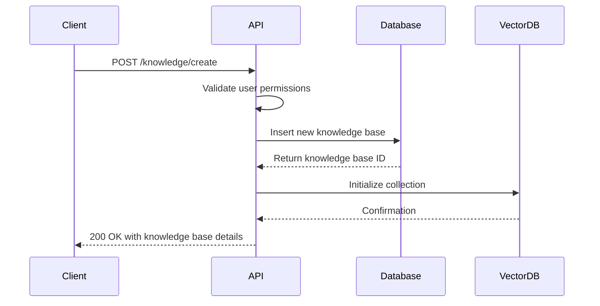
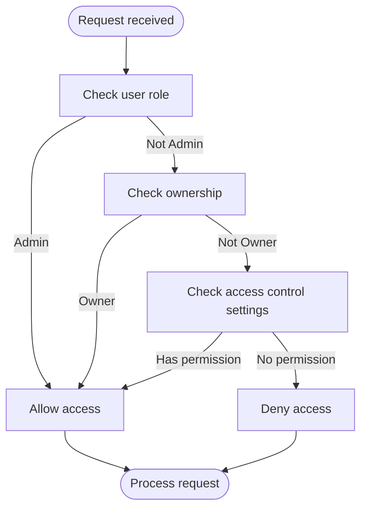
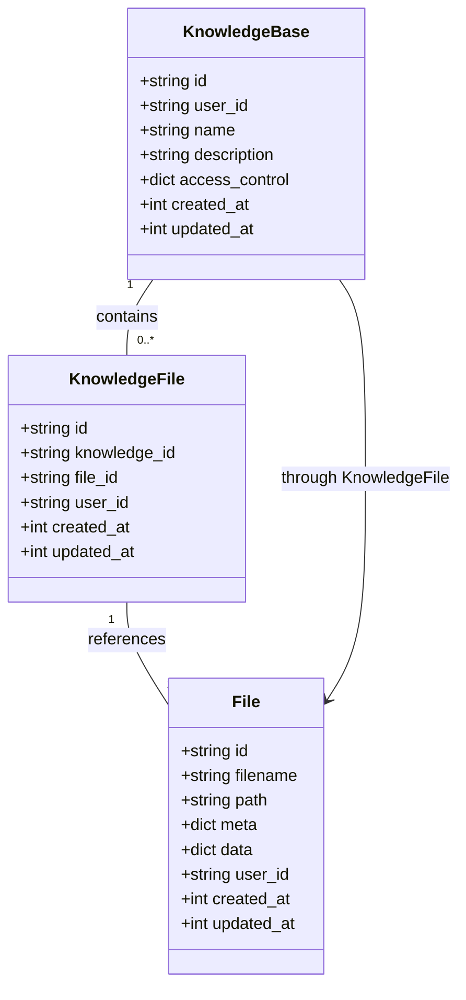
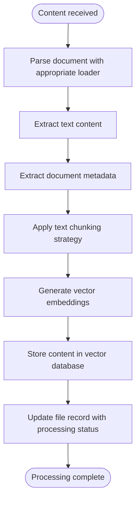
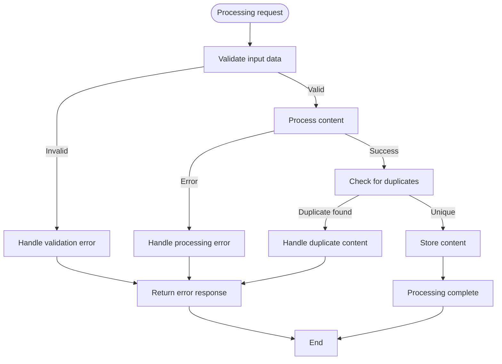
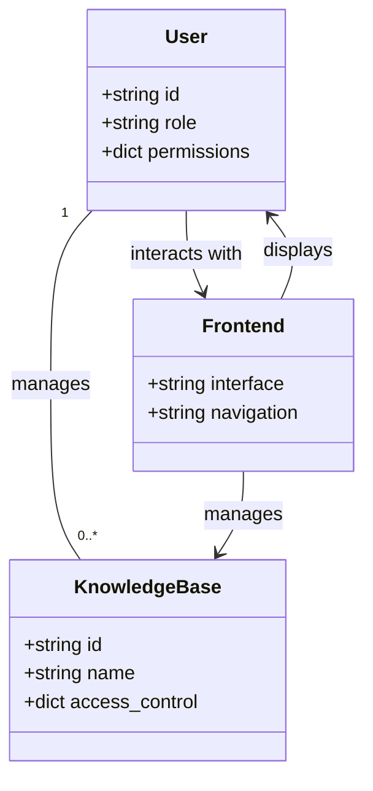

# Knowledge Base Management

<cite>
**Referenced Files in This Document**   
- [knowledge.py](file://backend/open_webui/routers/knowledge.py)
- [knowledge.py](file://backend/open_webui/models/knowledge.py)
- [retrieval.py](file://backend/open_webui/routers/retrieval.py)
- [main.py](file://backend/open_webui/retrieval/loaders/main.py)
- [utils.py](file://backend/open_webui/retrieval/utils.py)
- [factory.py](file://backend/open_webui/retrieval/vector/factory.py)
- [index.ts](file://src/lib/apis/knowledge/index.ts)
- [config.py](file://backend/open_webui/config.py)
</cite>

## Table of Contents
1. [Introduction](#introduction)
2. [API Endpoints for Knowledge Base Management](#api-endpoints-for-knowledge-base-management)
3. [Access Control and Visibility Settings](#access-control-and-visibility-settings)
4. [Content Addition Methods](#content-addition-methods)
5. [Ingestion Pipeline](#ingestion-pipeline)
6. [Custom Parsing Rules and Exclusion Patterns](#custom-parsing-rules-and-exclusion-patterns)
7. [Error Handling](#error-handling)
8. [Frontend Integration](#frontend-integration)
9. [Performance Considerations](#performance-considerations)
10. [Conclusion](#conclusion)

## Introduction
The Knowledge Base Management subsystem in Open WebUI provides a comprehensive solution for organizing, storing, and retrieving information through various content sources. This system enables users to create structured knowledge repositories that can be accessed and utilized by AI models for enhanced responses. The subsystem supports multiple content ingestion methods, sophisticated access control mechanisms, and integrates seamlessly with the frontend workspace interface.

**Section sources**
- [knowledge.py](file://backend/open_webui/routers/knowledge.py#L1-L662)
- [knowledge.py](file://backend/open_webui/models/knowledge.py#L1-L371)

## API Endpoints for Knowledge Base Management

The Knowledge Base Management subsystem provides a comprehensive set of RESTful API endpoints for creating, updating, and deleting knowledge bases. These endpoints follow standard HTTP methods and return JSON responses with appropriate status codes.

### Creation Endpoint
The `POST /knowledge/create` endpoint allows authorized users to create new knowledge bases. The request requires a JSON payload containing the knowledge base name, description, and access control settings. Only users with appropriate permissions or administrators can create knowledge bases.



**Diagram sources**
- [knowledge.py](file://backend/open_webui/routers/knowledge.py#L84-L117)
- [knowledge.py](file://backend/open_webui/models/knowledge.py#L138-L164)

### Update Endpoint
The `POST /knowledge/{id}/update` endpoint enables modification of existing knowledge bases. Users can update the name, description, and access control settings. The system verifies that the requesting user has write access to the knowledge base before applying changes.

### Deletion Endpoint
The `DELETE /knowledge/{id}/delete` endpoint removes a knowledge base and all associated data. Before deletion, the system checks user permissions and updates any models that reference the knowledge base to prevent broken references.

**Section sources**
- [knowledge.py](file://backend/open_webui/routers/knowledge.py#L84-L483)
- [index.ts](file://src/lib/apis/knowledge/index.ts#L3-L347)

## Access Control and Visibility Settings

The knowledge base system implements a sophisticated access control model that determines who can view, modify, and share knowledge bases. This model is based on user roles, group memberships, and explicit permissions.

### Access Control Structure
The access control system uses a JSON structure to define permissions for read and write operations. The structure supports three main configurations:

- `null`: Public access, available to all users with the "user" role
- `{}`: Private access, restricted exclusively to the owner
- Custom permissions: Specific access control for reading and writing, with options to specify group or user-level restrictions

```json
{
  "read": {
    "group_ids": ["group_id1", "group_id2"],
    "user_ids": ["user_id1", "user_id2"]
  },
  "write": {
    "group_ids": ["group_id1", "group_id2"],
    "user_ids": ["user_id1", "user_id2"]
  }
}
```

### Permission Verification
The system verifies permissions through the `has_access` function, which checks if a user has the required permission level for a specific knowledge base. The verification process considers the user's role, ownership, and group memberships.



**Diagram sources**
- [knowledge.py](file://backend/open_webui/models/knowledge.py#L45-L62)
- [knowledge.py](file://backend/open_webui/routers/knowledge.py#L88-L94)

**Section sources**
- [knowledge.py](file://backend/open_webui/models/knowledge.py#L27-L211)
- [config.py](file://backend/open_webui/config.py#L1431-L1453)

## Content Addition Methods

The system supports multiple methods for adding content to knowledge bases, including file uploads, web URLs, and direct text input. Each method is processed through the retrieval loader system to ensure consistent handling and storage.

### File Uploads
Users can upload various file types to be added to knowledge bases. The system supports common document formats including PDF, DOCX, PPTX, and plain text files. When a file is uploaded, it is processed by the appropriate loader based on its file type.

### Web URLs
Content can be added from web URLs, which are processed using web loaders. The system supports various web sources including standard web pages, YouTube videos, and specialized document intelligence services.

### Direct Text Input
Users can add content directly through text input, which is particularly useful for adding notes, summaries, or other short pieces of information. The text is processed and stored with appropriate metadata.



**Diagram sources**
- [knowledge.py](file://backend/open_webui/models/knowledge.py#L36-L115)
- [retrieval.py](file://backend/open_webui/routers/retrieval.py#L1445-L1600)

**Section sources**
- [retrieval.py](file://backend/open_webui/routers/retrieval.py#L1445-L1600)
- [main.py](file://backend/open_webui/retrieval/loaders/main.py#L187-L398)

## Ingestion Pipeline

The ingestion pipeline processes content from various sources and prepares it for storage in the vector database. This pipeline consists of several stages: document parsing, text chunking, metadata extraction, and vector embedding.

### Document Parsing
The system uses specialized loaders to parse different document types. For example:
- PDF files are processed using PyPDFLoader or alternative engines like Tika, Datalab Marker, or Document Intelligence
- DOCX files are processed using Docx2txtLoader
- Web pages are processed using BSHTMLLoader
- CSV files are processed using CSVLoader

The choice of loader depends on the configured content extraction engine and available services.

### Text Chunking Strategies
The system implements multiple text chunking strategies to optimize content for retrieval:

- **Recursive Character Splitting**: Splits text by characters with configurable chunk size and overlap
- **Token-based Splitting**: Splits text based on tokens using a specified encoding
- **Markdown Header Splitting**: Splits text at markdown headers while preserving context

The chunking strategy is configurable through system settings, allowing optimization for different use cases.

### Metadata Extraction
During processing, the system extracts and preserves metadata from source documents. This includes:
- Document name and source
- Creation and modification timestamps
- Author information
- File-specific metadata (e.g., PDF properties)
- Custom metadata added by users



**Diagram sources**
- [retrieval.py](file://backend/open_webui/routers/retrieval.py#L1276-L1344)
- [main.py](file://backend/open_webui/retrieval/loaders/main.py#L187-L398)

**Section sources**
- [retrieval.py](file://backend/open_webui/routers/retrieval.py#L1233-L1437)
- [main.py](file://backend/open_webui/retrieval/loaders/main.py#L187-L398)

## Custom Parsing Rules and Exclusion Patterns

The system supports configuration of custom parsing rules and exclusion patterns to fine-tune the content processing behavior. These configurations allow users to optimize the ingestion pipeline for specific document types or use cases.

### Configuration Options
Users can configure various aspects of the parsing process through environment variables or system settings:

- **Content Extraction Engine**: Specifies which engine to use for document processing (e.g., "tika", "datalab_marker", "document_intelligence")
- **Text Splitter**: Determines the text chunking strategy ("character", "token", "markdown_header")
- **Chunk Size and Overlap**: Configures the size of text chunks and the amount of overlap between adjacent chunks
- **PDF Image Extraction**: Controls whether images are extracted from PDF documents

### Advanced Processing Options
For specialized use cases, the system supports advanced processing options:

- **Datalab Marker API**: Provides advanced document processing with OCR capabilities
- **Document Intelligence**: Uses Azure AI services for sophisticated document analysis
- **External Document Loader**: Allows integration with external document processing services

**Section sources**
- [retrieval.py](file://backend/open_webui/routers/retrieval.py#L1276-L1344)
- [main.py](file://backend/open_webui/retrieval/loaders/main.py#L214-L398)

## Error Handling

The system implements comprehensive error handling for various scenarios, including unsupported file types and malformed URLs. Errors are handled gracefully to provide meaningful feedback to users while maintaining system stability.

### Unsupported File Types
When encountering unsupported file types, the system returns a specific error message indicating that the file format is not supported. The error handling process includes:

- Validation of file extensions against known supported types
- MIME type verification
- Fallback to text-based processing when possible

### Malformed URLs
For malformed URLs, the system performs validation and returns appropriate error messages. The validation process includes:

- Syntax checking for valid URL structure
- Protocol verification (http, https)
- Domain and path validation

### Duplicate Content Detection
The system prevents duplicate content by calculating SHA-256 hashes of processed content. When a document with identical content is detected, the system raises a duplicate content error to prevent redundant storage.



**Diagram sources**
- [retrieval.py](file://backend/open_webui/routers/retrieval.py#L1263-L1275)
- [constants.py](file://backend/open_webui/constants.py#L103-L105)

**Section sources**
- [retrieval.py](file://backend/open_webui/routers/retrieval.py#L1263-L1275)
- [constants.py](file://backend/open_webui/constants.py#L103-L105)

## Frontend Integration

The knowledge base system integrates seamlessly with the frontend workspace interface, providing users with an intuitive way to manage their knowledge repositories. The integration follows the user permissions model to ensure appropriate access control.

### Workspace Interface
The workspace interface provides dedicated sections for knowledge base management, accessible based on user permissions. Users with knowledge management permissions can access the knowledge section from the workspace navigation.

### User Permissions Model
The system implements a comprehensive permissions model that controls access to knowledge base features:

- **Workspace Knowledge Access**: Determines if users can access the knowledge management interface
- **Knowledge Sharing**: Controls whether users can share knowledge bases with others
- **Public Knowledge Sharing**: Determines if users can make knowledge bases publicly accessible

The permissions are configured through environment variables and can be customized for different deployment scenarios.



**Diagram sources**
- [index.ts](file://src/lib/apis/knowledge/index.ts#L3-L376)
- [config.py](file://backend/open_webui/config.py#L1431-L1453)

**Section sources**
- [index.ts](file://src/lib/apis/knowledge/index.ts#L3-L376)
- [config.py](file://backend/open_webui/config.py#L1431-L1453)

## Performance Considerations

The knowledge base management system includes several performance optimizations for handling bulk imports and managing large knowledge repositories.

### Bulk Import Optimization
For bulk imports, the system processes files in batches to improve efficiency. The batch processing system:

- Groups multiple files into single processing operations
- Uses parallel processing where possible
- Implements error handling that allows partial success (some files may fail while others succeed)

### Large Repository Management
For large knowledge repositories, the system implements several optimization strategies:

- **Efficient Indexing**: Uses vector database indexing for fast retrieval
- **Memory Management**: Processes large files in chunks to minimize memory usage
- **Caching**: Implements caching for frequently accessed content
- **Asynchronous Processing**: Uses background tasks for time-consuming operations

### Configuration Recommendations
To optimize performance for large repositories, consider the following recommendations:

- Adjust chunk size based on document complexity and query patterns
- Use appropriate text splitting strategies for different content types
- Configure batch sizes based on available system resources
- Monitor vector database performance and adjust indexing strategies as needed

**Section sources**
- [retrieval.py](file://backend/open_webui/routers/retrieval.py#L587-L662)
- [utils.py](file://backend/open_webui/retrieval/utils.py#L402-L454)

## Conclusion
The Knowledge Base Management subsystem in Open WebUI provides a robust and flexible solution for organizing and utilizing information. With comprehensive API endpoints, sophisticated access control, multiple content ingestion methods, and optimized performance characteristics, the system enables users to create powerful knowledge repositories that enhance AI interactions. The integration with the frontend workspace and adherence to user permissions ensures a secure and user-friendly experience for managing knowledge content.