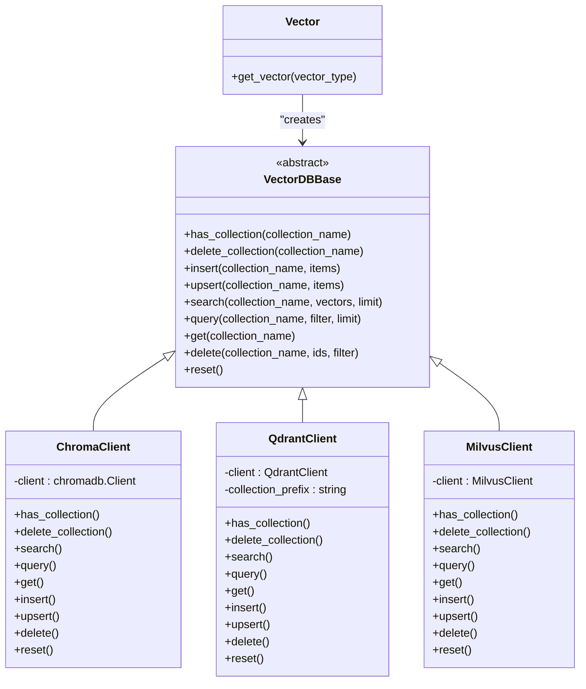
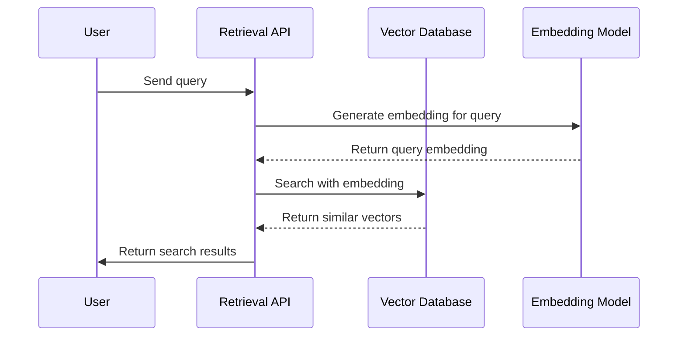
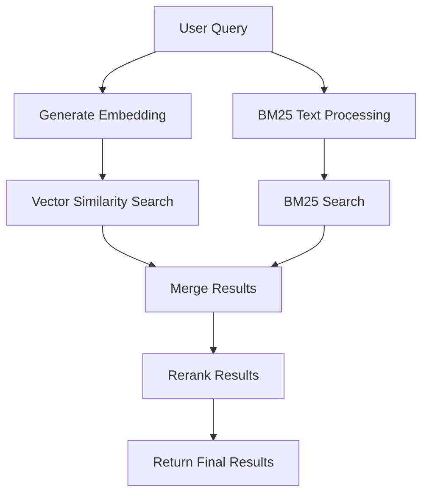
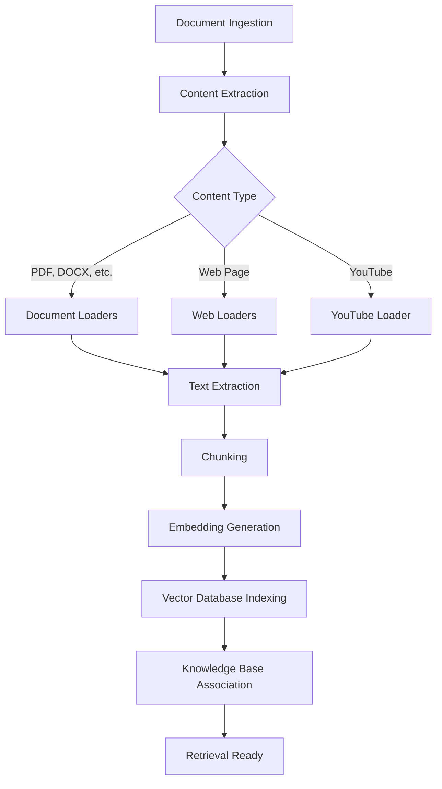

# Knowledge Retrieval API

<cite>
**Referenced Files in This Document**   
- [knowledge.py](file://backend/open_webui/routers/knowledge.py)
- [retrieval.py](file://backend/open_webui/routers/retrieval.py)
- [knowledge.py](file://backend/open_webui/models/knowledge.py)
- [main.py](file://backend/open_webui/retrieval/vector/main.py)
- [factory.py](file://backend/open_webui/retrieval/vector/factory.py)
- [embeddings.py](file://backend/open_webui/utils/embeddings.py)
- [main.py](file://backend/open_webui/retrieval/loaders/main.py)
</cite>

## Table of Contents
1. [Introduction](#introduction)
2. [Knowledge Base Management](#knowledge-base-management)
3. [Document Ingestion and Processing](#document-ingestion-and-processing)
4. [Vector Database and Embedding Integration](#vector-database-and-embedding-integration)
5. [Retrieval and Search Functionality](#retrieval-and-search-functionality)
6. [Data Flow and Processing Pipeline](#data-flow-and-processing-pipeline)
7. [Error Handling](#error-handling)
8. [Performance Considerations](#performance-considerations)

## Introduction
The Knowledge Retrieval API provides a comprehensive system for managing knowledge bases and enabling retrieval-augmented generation (RAG) capabilities. This API allows users to create knowledge bases, add content from various sources including files and URLs, and query the knowledge with advanced retrieval parameters. The system integrates with vector databases for efficient similarity search and supports multiple embedding models and retrieval strategies. This documentation details the endpoints, data flow, configuration options, and best practices for optimal performance.

## Knowledge Base Management

The knowledge base management endpoints provide CRUD operations for creating, retrieving, updating, and deleting knowledge bases. Each knowledge base serves as a container for related documents and can be configured with access controls and metadata.

### Create Knowledge Base
Creates a new knowledge base with specified name, description, and access control settings.

**Endpoint**: `POST /api/knowledge/create`  
**Request Body**:
```json
{
  "name": "string",
  "description": "string",
  "access_control": {
    "read": {
      "group_ids": ["string"],
      "user_ids": ["string"]
    },
    "write": {
      "group_ids": ["string"],
      "user_ids": ["string"]
    }
  }
}
```

**Response**: Returns the created knowledge base with ID and metadata.

### List Knowledge Bases
Retrieves a list of knowledge bases accessible to the user based on their permissions.

**Endpoint**: `GET /api/knowledge/`  
**Response**: Returns an array of knowledge bases with read access.

**Endpoint**: `GET /api/knowledge/list`  
**Response**: Returns an array of knowledge bases with write access.

### Knowledge Base Operations
Additional operations include retrieving, updating, and deleting knowledge bases by ID, as well as adding, updating, and removing files from knowledge bases.

**Section sources**
- [knowledge.py](file://backend/open_webui/routers/knowledge.py#L38-L662)
- [knowledge.py](file://backend/open_webui/models/knowledge.py#L1-L371)

## Document Ingestion and Processing

The document ingestion system supports multiple content sources including local files, URLs, and web content. Documents are processed through a pipeline that includes content extraction, chunking, and embedding.

### File Processing
Processes a file and adds its content to a vector database collection.

**Endpoint**: `POST /api/retrieval/process/file`  
**Request Body**:
```json
{
  "file_id": "string",
  "content": "string",
  "collection_name": "string"
}
```

The system supports various file types including PDF, DOCX, PPTX, CSV, HTML, and plain text. Content extraction is handled by different engines based on configuration:
- **Tika**: Apache Tika server for document parsing
- **Datalab Marker**: Advanced PDF and document processing
- **Docling**: Document intelligence processing
- **Document Intelligence**: Azure AI Document Intelligence
- **MinerU**: PDF processing with layout preservation
- **Mistral OCR**: OCR processing for scanned documents

### URL and Web Content Processing
Processes web content from URLs, including YouTube videos and web pages.

**Endpoint**: `POST /api/retrieval/process/web`  
**Request Body**:
```json
{
  "url": "string",
  "collection_name": "string"
}
```

The system automatically detects content type and uses appropriate loaders:
- YouTube videos are processed using YouTubeLoader
- Web pages are processed using configurable web loaders
- The content is extracted and prepared for embedding

**Section sources**
- [retrieval.py](file://backend/open_webui/routers/retrieval.py#L1233-L1762)
- [main.py](file://backend/open_webui/retrieval/loaders/main.py#L1-L398)

## Vector Database and Embedding Integration

The system integrates with various vector databases for efficient storage and retrieval of embeddings. Multiple embedding models are supported, allowing flexibility in choosing the appropriate model for specific use cases.

### Supported Vector Databases
The system supports multiple vector database backends through a factory pattern:



**Diagram sources**
- [main.py](file://backend/open_webui/retrieval/vector/main.py#L1-L87)
- [factory.py](file://backend/open_webui/retrieval/vector/factory.py#L1-L79)
- [chroma.py](file://backend/open_webui/retrieval/vector/dbs/chroma.py#L1-L199)
- [qdrant.py](file://backend/open_webui/retrieval/vector/dbs/qdrant.py#L1-L255)

### Embedding Models
The system supports multiple embedding model providers:

- **Local models**: Sentence Transformers with configurable models
- **OpenAI**: OpenAI embeddings API
- **Ollama**: Ollama embeddings API
- **Azure OpenAI**: Azure OpenAI embeddings API

Configuration is managed through environment variables and API endpoints, allowing runtime changes to the embedding model.

**Section sources**
- [retrieval.py](file://backend/open_webui/routers/retrieval.py#L254-L432)
- [embeddings.py](file://backend/open_webui/utils/embeddings.py#L1-L91)

## Retrieval and Search Functionality

The retrieval system provides advanced search capabilities with support for hybrid search, reranking, and various retrieval strategies.

### Search Endpoints
The search functionality is exposed through multiple endpoints that support different query patterns.

**Endpoint**: `POST /api/retrieval/search`  
**Request Body**:
```json
{
  "queries": ["string"]
}
```

**Response**: Returns search results with documents, metadata, and relevance scores.

### Retrieval Strategies
The system supports multiple retrieval strategies:

#### Similarity Search
Standard vector similarity search using cosine distance:



**Diagram sources**
- [retrieval.py](file://backend/open_webui/routers/retrieval.py#L402-L453)
- [utils.py](file://backend/open_webui/retrieval/utils.py#L135-L153)

#### Hybrid Search
Combines vector similarity search with keyword-based BM25 search for improved relevance:



**Diagram sources**
- [utils.py](file://backend/open_webui/retrieval/utils.py#L207-L314)
- [retrieval.py](file://backend/open_webui/routers/retrieval.py#L456-L532)

### Relevance Scoring and Citation
Search results include relevance scores and metadata for citation generation. The system preserves source information including:
- Document filename
- Source URL
- Section headings (from markdown documents)
- Content snippets

This information is used to generate proper citations when presenting search results.

**Section sources**
- [retrieval.py](file://backend/open_webui/routers/retrieval.py#L239-L253)
- [utils.py](file://backend/open_webui/retrieval/utils.py#L169-L204)

## Data Flow and Processing Pipeline

The document processing pipeline follows a structured flow from ingestion to indexing, ensuring consistent and reliable processing of content.

### Document Processing Flow
The complete data flow from document ingestion to retrieval:



**Diagram sources**
- [retrieval.py](file://backend/open_webui/routers/retrieval.py#L1233-L1667)
- [main.py](file://backend/open_webui/retrieval/loaders/main.py#L1-L398)

### Chunking Strategies
The system supports multiple text splitting strategies:

- **Recursive Character**: Splits text by characters with configurable chunk size and overlap
- **Token-based**: Splits text by tokens using specified encoding
- **Markdown Header**: Splits markdown documents by header levels, preserving document structure

Configuration parameters:
- `CHUNK_SIZE`: Number of characters/tokens per chunk
- `CHUNK_OVERLAP`: Number of overlapping characters/tokens between chunks
- `TEXT_SPLITTER`: Strategy to use (character, token, markdown_header)

### Embedding and Indexing
Documents are processed through the following steps:
1. Content is extracted and cleaned
2. Text is split into chunks
3. Each chunk is converted to an embedding vector
4. Vectors are stored in the vector database with metadata
5. Metadata includes source information, file ID, and content hash

The system prevents duplicate content by checking content hashes before processing.

**Section sources**
- [retrieval.py](file://backend/open_webui/routers/retrieval.py#L1233-L1667)
- [utils.py](file://backend/open_webui/retrieval/utils.py#L135-L153)

## Error Handling

The system implements comprehensive error handling for document processing and retrieval operations.

### Document Parsing Failures
Common errors during document parsing include:
- Missing dependencies (e.g., pandoc for certain formats)
- Authentication failures for external services
- Network timeouts
- Invalid file formats

Error responses include specific error codes and messages to help diagnose issues.

### Retrieval Timeouts
The system handles retrieval timeouts through:
- Configurable timeout settings
- Graceful degradation when external services are unavailable
- Fallback mechanisms for critical operations

### Error Response Format
All API endpoints return consistent error responses:

```json
{
  "detail": "Error description"
}
```

With appropriate HTTP status codes (400, 401, 404, 500, etc.).

**Section sources**
- [retrieval.py](file://backend/open_webui/routers/retrieval.py#L1650-L1666)
- [knowledge.py](file://backend/open_webui/routers/knowledge.py#L113-L116)

## Performance Considerations

The system includes several performance optimizations for handling large knowledge bases and ensuring responsive search.

### Optimal Chunk Sizes
Recommended chunk size configurations:
- **Small chunks (256-512)**: Better precision for fact-based queries
- **Medium chunks (512-1024)**: Balance between precision and context
- **Large chunks (1024-2048)**: Better for contextual understanding

The optimal size depends on the use case and content type.

### Batch Processing
The system supports batch processing of multiple files:
- Configurable batch size for embedding generation
- Parallel processing where possible
- Progress tracking for long-running operations

### Caching Strategies
The system implements caching at multiple levels:
- Content extraction results
- Embedding vectors
- Search results (when appropriate)

This reduces redundant processing and improves response times for repeated queries.

**Section sources**
- [retrieval.py](file://backend/open_webui/routers/retrieval.py#L1376-L1414)
- [retrieval.py](file://backend/open_webui/routers/retrieval.py#L426-L443)