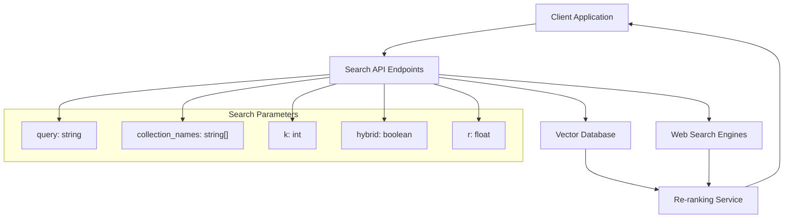
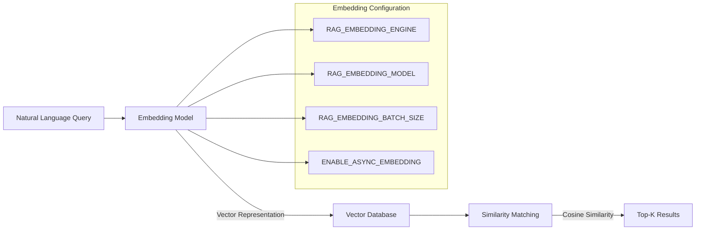
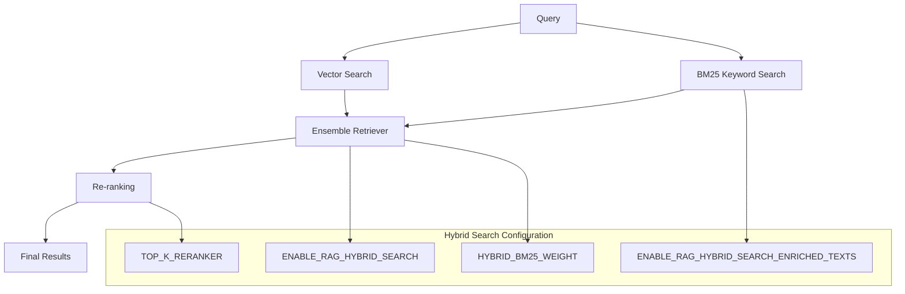
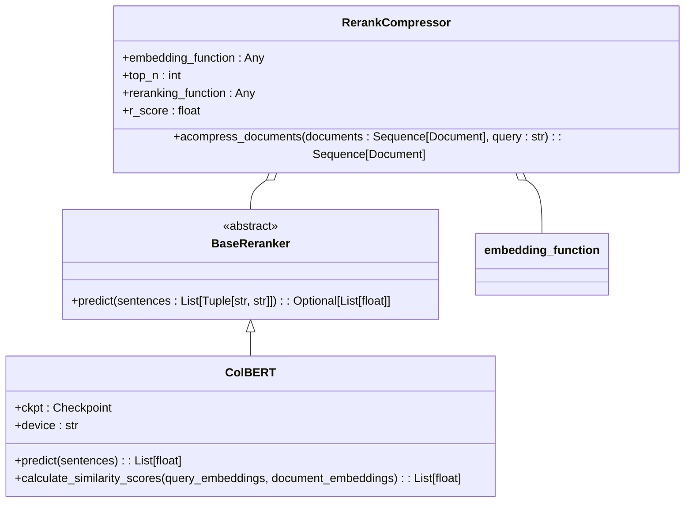
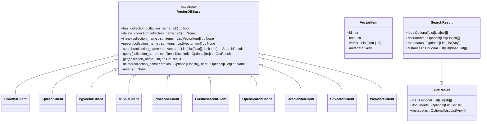

# Retrieval Operations

<cite>
**Referenced Files in This Document**   
- [retrieval.py](file://backend/open_webui/routers/retrieval.py)
- [main.py](file://backend/open_webui/retrieval/vector/main.py)
- [factory.py](file://backend/open_webui/retrieval/vector/factory.py)
- [utils.py](file://backend/open_webui/retrieval/utils.py)
- [chroma.py](file://backend/open_webui/retrieval/vector/dbs/chroma.py)
- [qdrant.py](file://backend/open_webui/retrieval/vector/dbs/qdrant.py)
- [pgvector.py](file://backend/open_webui/retrieval/vector/dbs/pgvector.py)
- [base_reranker.py](file://backend/open_webui/retrieval/models/base_reranker.py)
- [colbert.py](file://backend/open_webui/retrieval/models/colbert.py)
</cite>

## Table of Contents
1. [Introduction](#introduction)
2. [Search Endpoints](#search-endpoints)
3. [Vector Search Pipeline](#vector-search-pipeline)
4. [Hybrid Search Implementation](#hybrid-search-implementation)
5. [Re-ranking and MMR Diversification](#re-ranking-and-mmr-diversification)
6. [Query Construction and Filtering](#query-construction-and-filtering)
7. [Citation Generation and Result Scoring](#citation-generation-and-result-scoring)
8. [Error Handling and Latency Optimization](#error-handling-and-latency-optimization)
9. [RAG Integration](#rag-integration)
10. [Vector Database Support](#vector-database-support)

## Introduction
The retrieval operations subsystem in Open WebUI provides a comprehensive framework for querying knowledge bases using natural language. This system enables users to search across various document collections, web sources, and knowledge bases through a unified API interface. The retrieval pipeline supports multiple vector databases, hybrid search strategies, and advanced re-ranking techniques to deliver relevant results for RAG (Retrieval-Augmented Generation) applications. The system is designed to handle various document types including files, web pages, YouTube videos, and structured knowledge bases.

**Section sources**
- [retrieval.py](file://backend/open_webui/routers/retrieval.py#L240-L253)

## Search Endpoints
The retrieval system exposes several endpoints for querying different types of content. The primary search endpoints allow querying document collections, web sources, and specific files. The `/query/collection` endpoint accepts a list of collection names and a query string, returning the top-k most relevant results based on vector similarity. The `/query/doc` endpoint performs a similar function but targets a single collection. For web-based searches, the `/process/web/search` endpoint enables querying multiple search engines like Google, Bing, DuckDuckGo, and specialized services like Tavily and Perplexity. These endpoints support parameters for controlling the number of results (TOP_K), relevance thresholds, and hybrid search configurations.

**Diagram sources**
- [retrieval.py](file://backend/open_webui/routers/retrieval.py#L2191-L2333)

**Section sources**
- [retrieval.py](file://backend/open_webui/routers/retrieval.py#L2191-L2333)

## Vector Search Pipeline
The vector search pipeline begins with query embedding, where natural language queries are converted into vector representations using configured embedding models. The system supports multiple embedding engines including Sentence Transformers, OpenAI, Azure OpenAI, and Ollama. The `get_embedding_function` utility creates the appropriate embedding function based on the configured engine. Once the query is embedded, the system performs similarity matching against vectors stored in the configured vector database. The pipeline supports batch processing of multiple queries across multiple collections, with results merged and sorted by relevance. The vector search operations are abstracted through the `VectorDBBase` interface, allowing seamless integration with different vector database backends.

**Diagram sources**
- [retrieval.py](file://backend/open_webui/routers/retrieval.py#L122-L215)
- [utils.py](file://backend/open_webui/retrieval/utils.py#L777-L856)

**Section sources**
- [retrieval.py](file://backend/open_webui/routers/retrieval.py#L122-L215)
- [utils.py](file://backend/open_webui/retrieval/utils.py#L777-L856)

## Hybrid Search Implementation
The system implements hybrid search by combining semantic vector search with keyword-based BM25 retrieval. When hybrid search is enabled, the system creates enriched text representations that include document metadata such as filenames, titles, and section headings. These enriched texts are used to create a BM25 index alongside the vector embeddings. The `query_collection_with_hybrid_search` function orchestrates the hybrid search process, combining results from both retrieval methods using weighted ensemble techniques. The `HYBRID_BM25_WEIGHT` parameter controls the balance between vector and keyword search results. The system also supports enriched text processing, which adds metadata context to the search terms, improving keyword matching accuracy for document retrieval.

**Diagram sources**
- [utils.py](file://backend/open_webui/retrieval/utils.py#L207-L315)

**Section sources**
- [utils.py](file://backend/open_webui/retrieval/utils.py#L207-L315)

## Re-ranking and MMR Diversification
The retrieval system incorporates re-ranking to improve result relevance and diversity. The re-ranking process is handled by the `RerankCompressor` class, which can utilize various re-ranking models including cross-encoders and specialized models like Jina ColBERT. The system supports both internal re-ranking models and external re-ranking services. The `get_rf` function initializes the appropriate re-ranking model based on configuration. While the current implementation focuses on relevance-based re-ranking, the architecture supports MMR (Maximal Marginal Relevance) diversification through the re-ranking function interface. The re-ranking process considers both relevance scores and document similarity to balance relevance with content diversity in the final results.

**Diagram sources**
- [base_reranker.py](file://backend/open_webui/retrieval/models/base_reranker.py#L5-L9)
- [colbert.py](file://backend/open_webui/retrieval/models/colbert.py#L16-L90)
- [utils.py](file://backend/open_webui/retrieval/utils.py#L1245-L1324)

**Section sources**
- [base_reranker.py](file://backend/open_webui/retrieval/models/base_reranker.py#L5-L9)
- [colbert.py](file://backend/open_webui/retrieval/models/colbert.py#L16-L90)
- [utils.py](file://backend/open_webui/retrieval/utils.py#L1245-L1324)

## Query Construction and Filtering
The system supports complex query construction with filters and metadata constraints. Queries can be constructed to target specific collections, file types, or metadata attributes. The filtering system allows constraining results based on document properties such as file ID, hash values, or custom metadata fields. The `filter_metadata` utility processes metadata to exclude large or non-serializable fields before storage. When querying, the system can apply filters to retrieve only documents matching specific criteria. The search endpoints support multiple queries simultaneously, with results aggregated across collections. For web searches, domain filtering is supported through the `WEB_SEARCH_DOMAIN_FILTER_LIST` configuration, allowing restriction of results to specific domains.

**Section sources**
- [utils.py](file://backend/open_webui/retrieval/utils.py#L6-L29)
- [retrieval.py](file://backend/open_webui/routers/retrieval.py#L2191-L2333)

## Citation Generation and Result Scoring
The retrieval system generates citations and scores for search results to support transparent RAG applications. Each result includes metadata that can be used to generate citations, including source URLs, document titles, and file references. The system returns relevance scores with search results, normalized to a 0-1 scale where 1 represents the highest relevance. For hybrid search, the final scores incorporate both vector similarity and keyword matching components. The scoring system also supports relevance thresholding through the `RELEVANCE_THRESHOLD` parameter, allowing filtering of results below a minimum quality threshold. The metadata accompanying each result provides sufficient information to generate proper citations in the final response.

**Section sources**
- [retrieval.py](file://backend/open_webui/routers/retrieval.py#L2200-L2261)
- [utils.py](file://backend/open_webui/retrieval/utils.py#L207-L315)

## Error Handling and Latency Optimization
The retrieval system implements comprehensive error handling for various failure scenarios. Connection issues with vector databases trigger appropriate exceptions that are propagated to the client with descriptive error messages. The system includes timeout handling for external services and implements retry logic for transient failures. For latency optimization, the system supports asynchronous embedding generation and parallel processing of multiple queries. The `ENABLE_ASYNC_EMBEDDING` configuration parameter controls whether embeddings are generated asynchronously. The system also implements result caching and efficient vector database indexing to minimize response times. When vector database connectivity issues occur, the system provides fallback mechanisms and clear error reporting to ensure robust operation.

**Section sources**
- [retrieval.py](file://backend/open_webui/routers/retrieval.py#L2256-L2261)
- [utils.py](file://backend/open_webui/retrieval/utils.py#L534-L775)

## RAG Integration
The retrieval system is designed for seamless integration with RAG workflows. The search results are formatted to be directly usable by language models, with content and metadata structured appropriately for prompt construction. The system supports bypass modes where full document content is returned instead of vector search results, enabling different RAG patterns. The `BYPASS_EMBEDDING_AND_RETRIEVAL` configuration parameter controls this behavior. The retrieval pipeline integrates with chat workflows by supporting attachment of search results to conversations, allowing context augmentation for ongoing dialogues. The system also supports processing of various content types including text, files, web pages, and YouTube videos, making it versatile for different RAG use cases.

**Section sources**
- [retrieval.py](file://backend/open_webui/routers/retrieval.py#L1233-L1671)

## Vector Database Support
The retrieval system supports multiple vector databases through a pluggable architecture. The `VectorDBBase` abstract class defines the interface for vector database operations, including collection management, vector insertion, and similarity search. Currently supported databases include Chroma, Qdrant, PGVector, Milvus, Pinecone, Elasticsearch, OpenSearch, Oracle 23ai, S3Vector, and Weaviate. The `Vector` factory class in `factory.py` instantiates the appropriate vector database client based on the `VECTOR_DB` configuration. Each database implementation handles specific configuration parameters such as connection URLs, API keys, and indexing options. The system allows configuration of database-specific parameters like HNSW M value for Qdrant or IVF lists for PGVector to optimize performance.

**Diagram sources**
- [main.py](file://backend/open_webui/retrieval/vector/main.py#L6-L87)
- [factory.py](file://backend/open_webui/retrieval/vector/factory.py#L10-L79)

**Section sources**
- [main.py](file://backend/open_webui/retrieval/vector/main.py#L6-L87)
- [factory.py](file://backend/open_webui/retrieval/vector/factory.py#L10-L79)