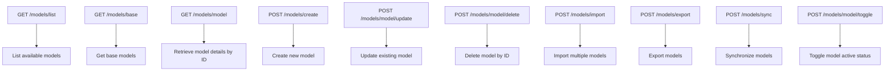
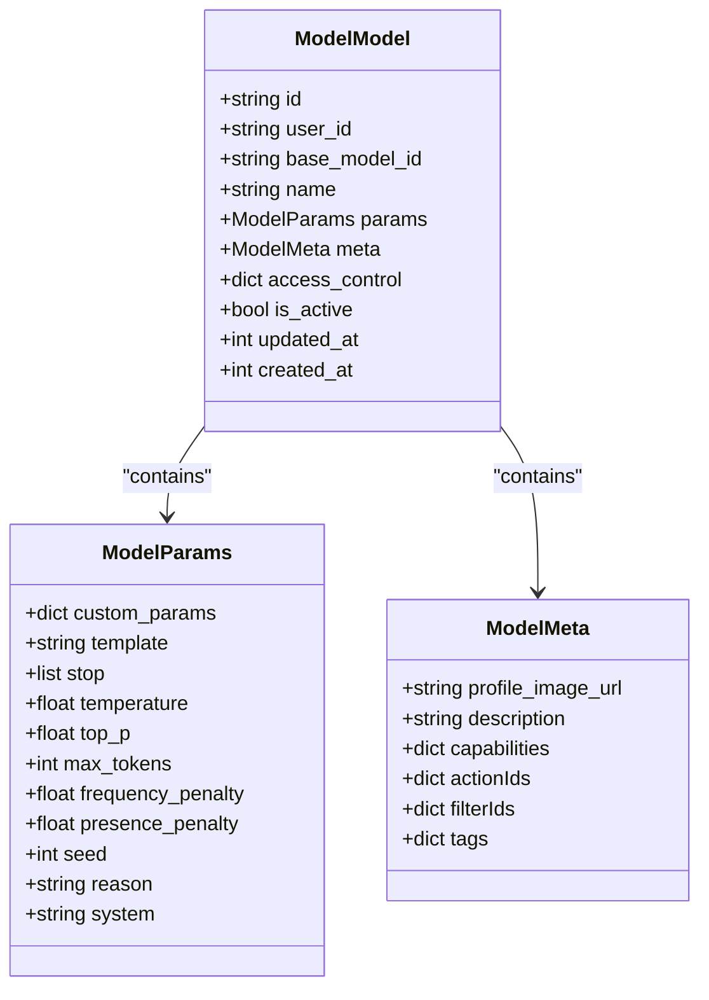
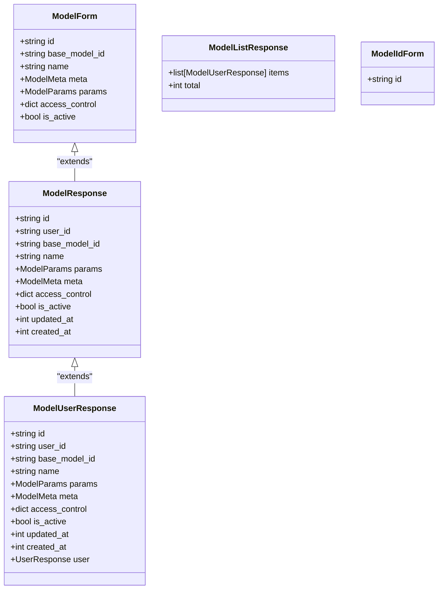
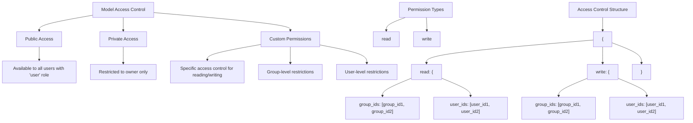
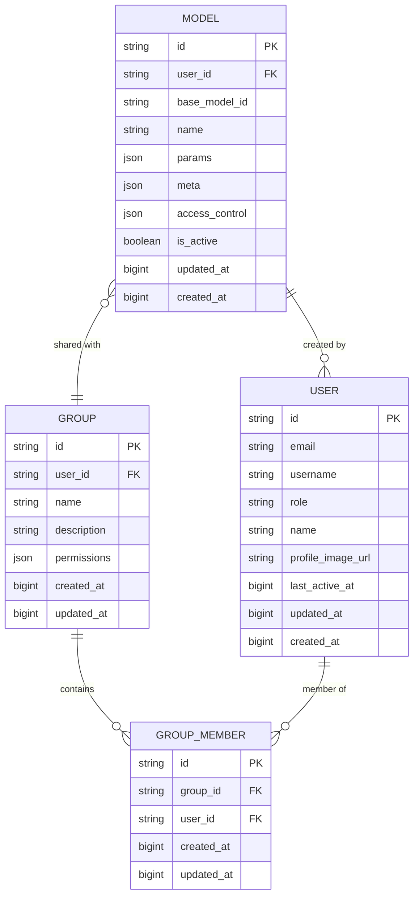
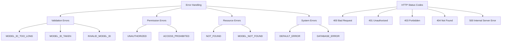
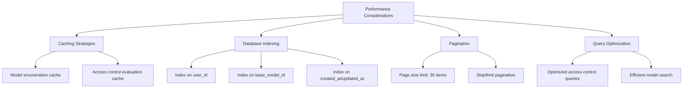
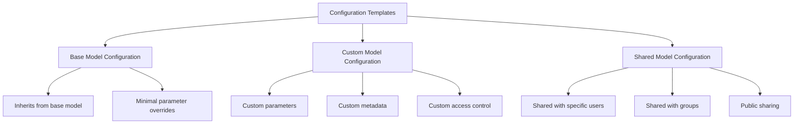

# Core Model Management

<cite>
**Referenced Files in This Document**   
- [models.py](file://backend/open_webui/models/models.py)
- [models.py](file://backend/open_webui/routers/models.py)
- [models.py](file://backend/open_webui/utils/models.py)
- [config.py](file://backend/open_webui/config.py)
- [users.py](file://backend/open_webui/models/users.py)
- [groups.py](file://backend/open_webui/models/groups.py)
- [index.ts](file://src/lib/apis/models/index.ts)
</cite>

## Table of Contents
1. [Introduction](#introduction)
2. [Model Management Endpoints](#model-management-endpoints)
3. [Model Metadata Structure](#model-metadata-structure)
4. [Request/Response Schemas](#requestresponse-schemas)
5. [Access Control System](#access-control-system)
6. [Database Storage and Relationships](#database-storage-and-relationships)
7. [Error Handling](#error-handling)
8. [Performance Considerations](#performance-considerations)
9. [Configuration Templates and Examples](#configuration-templates-and-examples)

## Introduction
The Core Model Management system provides a comprehensive API for managing AI models within the Open WebUI platform. This documentation details the endpoints, data structures, access control mechanisms, and operational considerations for model CRUD operations. The system enables users to create custom model configurations, manage access permissions, and organize models through a robust API interface. Model configurations are stored in a database with relationships to user and group entities, allowing for sophisticated access control and sharing capabilities.

## Model Management Endpoints

The model management API provides several endpoints for listing, creating, updating, and deleting models. These endpoints support various query parameters for filtering and pagination.

**Diagram sources**
- [models.py](file://backend/open_webui/routers/models.py#L51-L418)

**Section sources**
- [models.py](file://backend/open_webui/routers/models.py#L51-L418)
- [index.ts](file://src/lib/apis/models/index.ts#L1-L348)

## Model Metadata Structure

The model metadata structure consists of several components that define a model's configuration, parameters, and access controls. The core data structure is defined by the ModelModel class, which includes essential fields for model identification, configuration, and metadata.

**Diagram sources**
- [models.py](file://backend/open_webui/models/models.py#L107-L123)
- [models.py](file://backend/open_webui/models/models.py#L33-L52)

**Section sources**
- [models.py](file://backend/open_webui/models/models.py#L55-L123)

### Model Parameters
Model parameters define the behavior and characteristics of a model during inference. These parameters include standard LLM configuration options such as temperature, top_p, max_tokens, and others that control the generation process.

The system supports both standard parameters and custom parameters through the custom_params field, which allows for model-specific configurations. Parameters are validated and applied when processing requests to ensure consistent behavior.

### Model Metadata
Model metadata includes descriptive information about the model, such as its name, description, profile image URL, and capabilities. The metadata structure also supports tags for categorization and organization of models within the system.

The access_control field defines who can access and modify the model, with support for both user-level and group-level permissions. This field is crucial for implementing the platform's access control system.

## Request/Response Schemas

The API uses well-defined request and response schemas to ensure consistency and reliability in model management operations. These schemas are implemented using Pydantic models and are validated at the API level.

**Diagram sources**
- [models.py](file://backend/open_webui/models/models.py#L129-L151)
- [models.py](file://backend/open_webui/models/models.py#L138-L141)

**Section sources**
- [models.py](file://backend/open_webui/models/models.py#L129-L151)

### Validation Rules
The system enforces several validation rules for model configurations:

1. Model ID validation: IDs must be non-empty and no longer than 256 characters
2. Required fields: All models must have an ID, name, and user ID
3. Parameter validation: Numeric parameters are validated for appropriate ranges
4. Access control validation: Access control structures are validated for correct format

These validation rules are implemented in the ModelForm class and are automatically applied when creating or updating models through the API.

## Access Control System

The access control system provides fine-grained permissions for model management, allowing for both public and private models with customizable access levels.

**Diagram sources**
- [models.py](file://backend/open_webui/models/models.py#L84-L99)
- [access_control.py](file://backend/open_webui/utils/access_control.py#L124-L150)

**Section sources**
- [models.py](file://backend/open_webui/models/models.py#L84-L99)
- [access_control.py](file://backend/open_webui/utils/access_control.py#L124-L150)

### Permission Levels
The system supports two primary permission levels:

1. **Read**: Allows viewing model details and using the model for inference
2. **Write**: Allows modifying model configuration and settings

Administrators have special privileges that can bypass certain access controls, depending on the system configuration.

### Group and User Access
The access control system supports both individual user access and group-based access. Users can be granted access directly through user_ids, or indirectly through group membership via group_ids. This allows for flexible sharing and collaboration scenarios.

## Database Storage and Relationships

Model configurations are stored in a relational database with defined relationships to users and groups. The database schema is designed to support efficient querying and access control evaluation.

**Diagram sources**
- [models.py](file://backend/open_webui/models/models.py#L55-L105)
- [users.py](file://backend/open_webui/models/users.py#L45-L76)
- [groups.py](file://backend/open_webui/models/groups.py#L36-L52)

**Section sources**
- [models.py](file://backend/open_webui/models/models.py#L55-L105)
- [users.py](file://backend/open_webui/models/users.py#L45-L76)
- [groups.py](file://backend/open_webui/models/groups.py#L36-L52)

### Data Relationships
The model management system establishes several key relationships:

1. Each model is owned by a specific user (user_id foreign key)
2. Models can be shared with groups through the access_control field
3. Groups contain multiple users through the GroupMember relationship
4. Users can belong to multiple groups

These relationships enable the implementation of the access control system and support collaborative workflows.

## Error Handling

The system implements comprehensive error handling for various scenarios, ensuring that clients receive meaningful error messages and status codes.

**Diagram sources**
- [models.py](file://backend/open_webui/routers/models.py#L136-L149)
- [models.py](file://backend/open_webui/routers/models.py#L372-L380)
- [constants.py](file://backend/open_webui/constants.py#L39-L67)

**Section sources**
- [models.py](file://backend/open_webui/routers/models.py#L136-L149)
- [models.py](file://backend/open_webui/routers/models.py#L372-L380)
- [constants.py](file://backend/open_webui/constants.py#L39-L67)

### Common Error Scenarios
The system handles several common error scenarios:

1. **Invalid configurations**: When model parameters or metadata don't meet validation requirements
2. **Permission denied**: When a user attempts to access or modify a model without appropriate permissions
3. **Model not found**: When attempting to retrieve or modify a non-existent model
4. **Database errors**: When there are issues with database operations

Each error scenario returns an appropriate HTTP status code and error message to help clients understand and resolve the issue.

## Performance Considerations

The model management system includes several performance optimizations to ensure efficient operation, particularly for model enumeration and access control evaluation.

**Diagram sources**
- [models.py](file://backend/open_webui/models/models.py#L48)
- [models.py](file://backend/open_webui/models/models.py#L268-L352)
- [env.py](file://backend/open_webui/env.py#L547-L555)

**Section sources**
- [models.py](file://backend/open_webui/models/models.py#L48)
- [models.py](file://backend/open_webui/models/models.py#L268-L352)
- [env.py](file://backend/open_webui/env.py#L547-L555)

### Caching Strategies
The system implements caching at multiple levels:

1. **Model enumeration cache**: Results from get_all_models operations are cached to reduce database load
2. **Access control evaluation**: Frequently accessed models and their permissions are cached
3. **Configuration cache**: System-wide model configurations are cached for quick access

The cache TTL (time-to-live) is configurable through the MODELS_CACHE_TTL environment variable, with a default value of 1 second.

### Pagination
To handle large numbers of models efficiently, the system implements pagination for list operations:

- Default page size: 30 items
- Configurable through the PAGE_ITEM_COUNT constant
- Supports skip/limit style pagination
- Returns total count for client-side pagination controls

This approach prevents performance degradation when dealing with large model collections.

## Configuration Templates and Examples

The system supports configuration templates and examples to help users create and manage model configurations effectively.

**Diagram sources**
- [models.py](file://backend/open_webui/models/models.py#L143-L151)
- [models.py](file://backend/open_webui/routers/models.py#L130-L165)

**Section sources**
- [models.py](file://backend/open_webui/models/models.py#L143-L151)
- [models.py](file://backend/open_webui/routers/models.py#L130-L165)

### Creating Custom Model Configurations
To create a custom model configuration, users can use the /models/create endpoint with a ModelForm payload. The configuration can include:

1. Custom parameters that override the base model settings
2. Custom metadata with description, tags, and capabilities
3. Access control settings that define who can use and modify the model

### Sharing Models Between Users
Models can be shared between users through the access_control field. The system supports:

1. **Direct sharing**: Adding specific user IDs to the access control list
2. **Group sharing**: Sharing with all members of a group
3. **Public sharing**: Making the model available to all users

### Applying Configuration Templates
The system allows for the creation and application of configuration templates. These templates can include predefined parameter sets, metadata structures, and access control configurations that can be applied to new or existing models.

The import/export functionality enables users to share configuration templates across instances or backup their model configurations.