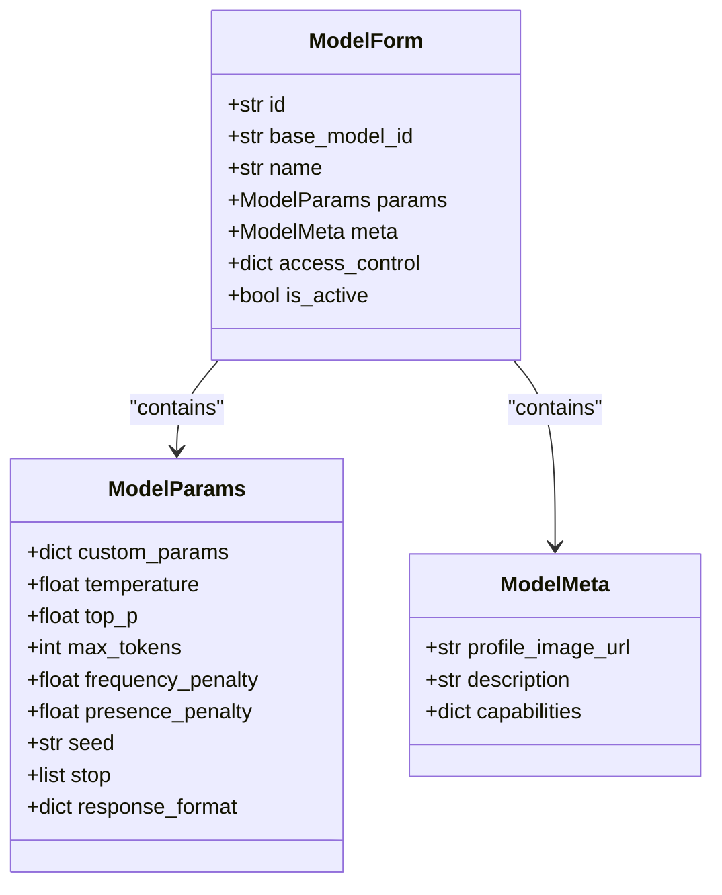
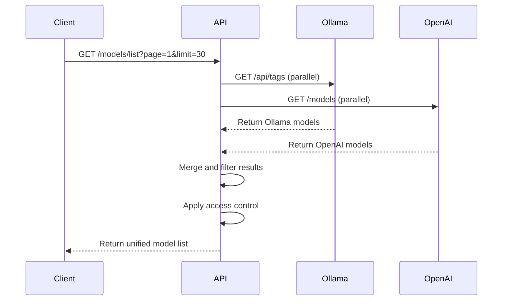
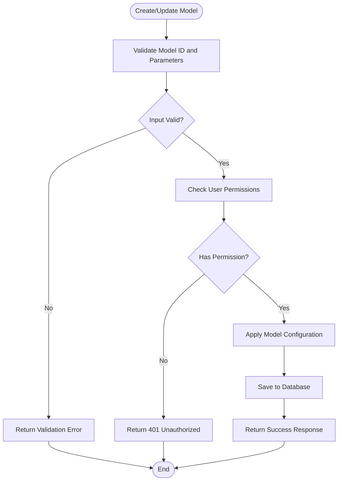
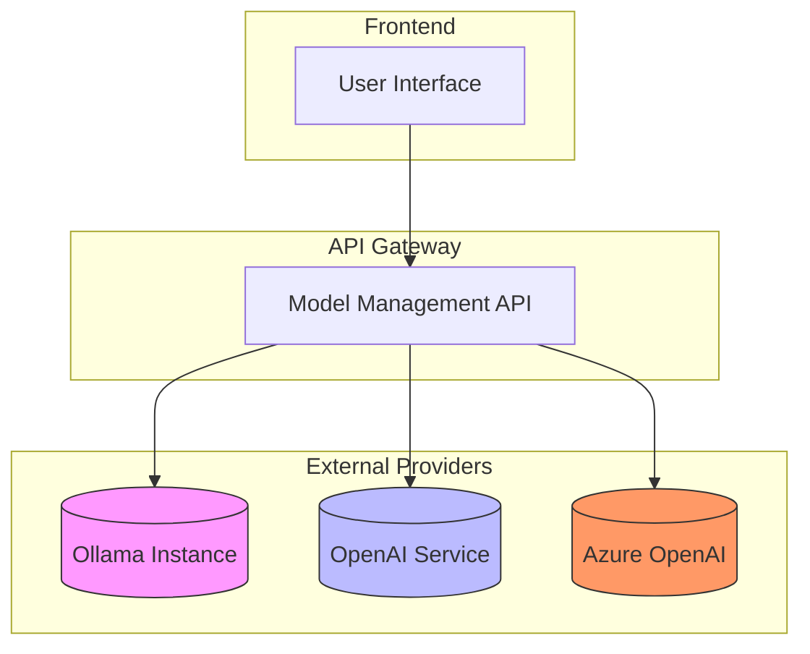
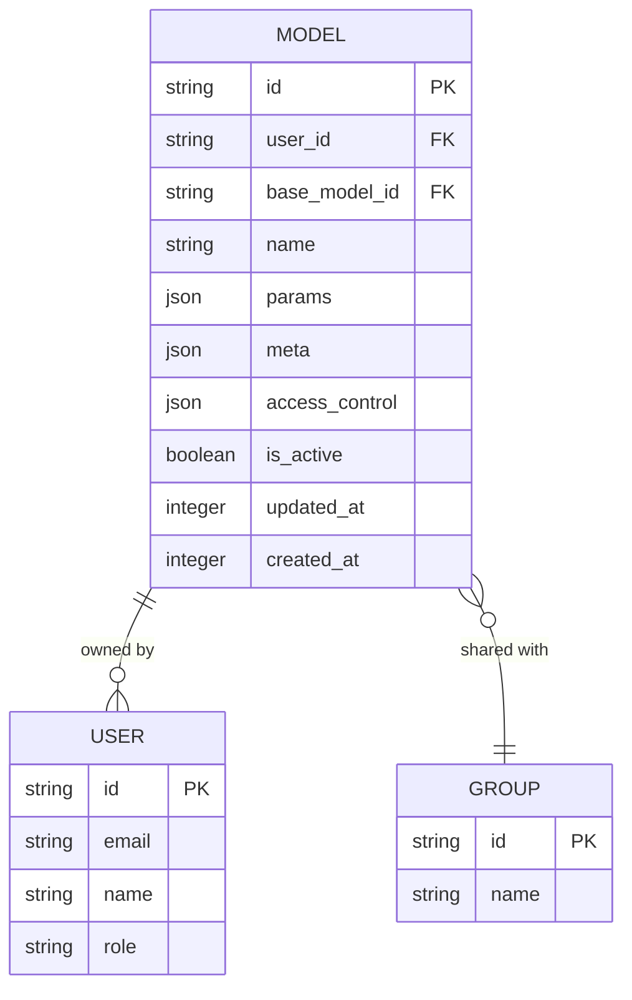
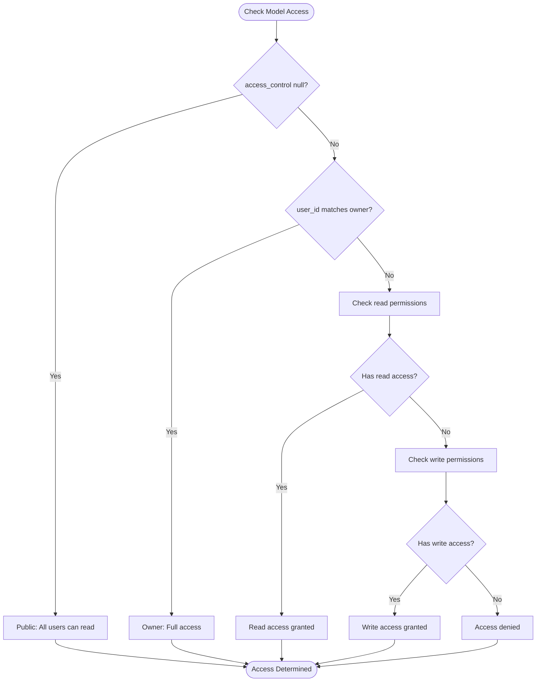

# Model Management API

<cite>
**Referenced Files in This Document**   
- [models.py](file://backend/open_webui/models/models.py)
- [models.py](file://backend/open_webui/routers/models.py)
- [ollama.py](file://backend/open_webui/routers/ollama.py)
- [openai.py](file://backend/open_webui/routers/openai.py)
- [utils/models.py](file://backend/open_webui/utils/models.py)
- [payload.py](file://backend/open_webui/utils/payload.py)
- [config.py](file://backend/open_webui/config.py)
</cite>

## Table of Contents
1. [Introduction](#introduction)
2. [Model Configuration](#model-configuration)
3. [Model Listing](#model-listing)
4. [Model Management](#model-management)
5. [External Model Provider Integration](#external-model-provider-integration)
6. [Model Metadata and Parameters](#model-metadata-and-parameters)
7. [Access Control and Sharing](#access-control-and-sharing)
8. [Error Handling](#error-handling)
9. [Conclusion](#conclusion)

## Introduction
The Model Management API provides comprehensive functionality for configuring, listing, and managing AI models within the Open WebUI platform. This API enables users to retrieve available models, configure model parameters such as temperature and top_p, and manage access controls for model sharing. The system integrates with external model providers through dedicated routers for Ollama and OpenAI, allowing seamless interaction with various backend services.

The API supports creating custom model configurations, sharing models between users, and switching between different model backends. It provides detailed information about model formats, parameter schemas, and validation rules to ensure proper configuration. The model metadata structure is designed to store essential information about each model, which is utilized in chat requests to maintain consistent behavior across sessions.

**Section sources**
- [models.py](file://backend/open_webui/models/models.py#L1-L461)
- [models.py](file://backend/open_webui/routers/models.py#L1-L418)

## Model Configuration
The Model Management API provides robust configuration capabilities for AI models, allowing users to customize various parameters that control model behavior. Model configuration is managed through the ModelParams class, which serves as a container for all configurable parameters.

Key configuration parameters include:
- **Temperature**: Controls randomness in model outputs (higher values = more random)
- **Top_p**: Controls diversity via nucleus sampling
- **Max_tokens**: Limits the maximum number of tokens in the response
- **Frequency_penalty**: Penalizes repeated tokens
- **Presence_penalty**: Encourages the model to talk about new topics
- **Seed**: Sets a random seed for reproducible outputs

The API supports both standard parameters and custom parameters through the "custom_params" field, which allows for provider-specific configurations. When configuring models, parameters are validated according to their expected data types (float, int, bool) before being applied.



**Diagram sources **
- [models.py](file://backend/open_webui/models/models.py#L34-L52)
- [models.py](file://backend/open_webui/models/models.py#L143-L151)

**Section sources**
- [models.py](file://backend/open_webui/models/models.py#L34-L52)
- [payload.py](file://backend/open_webui/utils/payload.py#L89-L120)

## Model Listing
The API provides comprehensive endpoints for retrieving available models from various sources, including local Ollama instances and external OpenAI services. The model listing functionality aggregates models from multiple backends and presents them in a unified format.

The primary endpoint for retrieving models is the `/models/list` route, which returns a paginated list of available models. This endpoint supports various filtering options:

- **Query filtering**: Search models by name or ID
- **View options**: Filter by created models or shared models
- **Tag filtering**: Retrieve models with specific tags
- **Sorting**: Order results by name, creation date, or update date
- **Pagination**: Control the number of results per page

The API also provides specialized endpoints for retrieving base models and model tags. Base models represent the fundamental models available in the system, while the tag endpoint returns all available tags across accessible models, enabling better organization and discovery.



**Diagram sources **
- [models.py](file://backend/open_webui/routers/models.py#L51-L88)
- [ollama.py](file://backend/open_webui/routers/ollama.py#L325-L423)
- [openai.py](file://backend/open_webui/routers/openai.py#L477-L545)

**Section sources**
- [models.py](file://backend/open_webui/routers/models.py#L51-L88)
- [ollama.py](file://backend/open_webui/routers/ollama.py#L325-L423)
- [openai.py](file://backend/open_webui/routers/openai.py#L477-L545)

## Model Management
The Model Management API provides comprehensive CRUD (Create, Read, Update, Delete) operations for managing custom model configurations. These operations allow users to create, modify, and delete model configurations through dedicated endpoints.

### Create Operations
The `/models/create` endpoint enables users to create new model configurations. When creating a model, users must provide:
- A unique model ID (limited to 256 characters)
- A human-readable name
- Parameter configuration
- Metadata
- Access control settings

The system validates that the model ID is not already taken before creation.

### Update Operations
The `/models/model/update` endpoint allows users to modify existing model configurations. Users can update any aspect of the model configuration, including parameters, metadata, and access controls. The update operation performs validation to ensure the model exists and the user has appropriate permissions.

### Delete Operations
The API provides two deletion endpoints:
- `/models/model/delete`: Deletes a specific model by ID
- `/models/delete/all`: Deletes all models (admin only)

Deletion requires appropriate permissions, with users able to delete their own models or models where they have write access.

### Toggle Operations
The `/models/model/toggle` endpoint allows users to activate or deactivate models without deleting them. This is useful for temporarily disabling models while preserving their configuration.



**Diagram sources **
- [models.py](file://backend/open_webui/routers/models.py#L130-L165)
- [models.py](file://backend/open_webui/routers/models.py#L360-L383)
- [models.py](file://backend/open_webui/routers/models.py#L391-L411)

**Section sources**
- [models.py](file://backend/open_webui/routers/models.py#L130-L165)
- [models.py](file://backend/open_webui/routers/models.py#L360-L383)
- [models.py](file://backend/open_webui/routers/models.py#L391-L411)

## External Model Provider Integration
The Model Management API integrates with external model providers through dedicated routers for Ollama and OpenAI. These routers handle communication with the respective backend services, providing a unified interface for model management.

### Ollama Integration
The Ollama router (`ollama.py`) provides extensive functionality for interacting with Ollama instances:

- **Model retrieval**: Fetches available models from configured Ollama URLs
- **Model operations**: Supports pulling, pushing, creating, and copying models
- **Instance management**: Allows unloading models from memory
- **Configuration**: Manages multiple Ollama instances with different configurations

The integration supports advanced features like model prefixing, tagging, and connection type identification. It also handles authentication through API keys and supports both local and remote Ollama instances.

### OpenAI Integration
The OpenAI router (`openai.py`) facilitates interaction with OpenAI services and compatible APIs:

- **Model listing**: Retrieves available models from OpenAI and other OpenAI-compatible services
- **Authentication**: Supports various authentication methods including bearer tokens and Azure AD
- **Configuration**: Manages multiple API endpoints with different configurations
- **Special handling**: Implements specific logic for reasoning models and system role conversion

The integration supports Azure OpenAI with Microsoft Entra ID authentication and handles various OpenAI-compatible providers through configurable headers and authentication types.



**Diagram sources **
- [ollama.py](file://backend/open_webui/routers/ollama.py#L325-L423)
- [openai.py](file://backend/open_webui/routers/openai.py#L477-L545)

**Section sources**
- [ollama.py](file://backend/open_webui/routers/ollama.py#L325-L423)
- [openai.py](file://backend/open_webui/routers/openai.py#L477-L545)

## Model Metadata and Parameters
The Model Management API employs a structured approach to model metadata and parameters, enabling rich configuration and discovery capabilities. The system separates model information into distinct components for better organization and extensibility.

### Metadata Structure
Model metadata is defined by the ModelMeta class and includes:

- **profile_image_url**: URL or data URI for the model's profile image
- **description**: User-facing description of the model's capabilities and purpose
- **capabilities**: Dictionary containing model-specific capabilities
- **tags**: Array of tags for categorization and filtering
- **actionIds**: Identifiers for associated action functions
- **filterIds**: Identifiers for associated filter functions

The metadata structure also supports custom fields through the "extra" attribute, allowing for future extensibility without schema changes.

### Parameter Schema
The parameter system is designed to handle both standard and provider-specific parameters:

- **Standard parameters**: Temperature, top_p, max_tokens, etc.
- **Provider-specific parameters**: Ollama's num_ctx, num_batch, etc.
- **Custom parameters**: Arbitrary key-value pairs in the custom_params field

The API automatically converts parameter names between different providers (e.g., OpenAI's max_tokens to Ollama's num_predict) to ensure compatibility.

### Validation Rules
The system enforces several validation rules:
- Model IDs must be unique and ≤ 256 characters
- Required fields must be present
- Parameter values must match expected data types
- Access control rules must follow the defined schema



**Diagram sources **
- [models.py](file://backend/open_webui/models/models.py#L55-L104)
- [models.py](file://backend/open_webui/models/models.py#L39-L52)

**Section sources**
- [models.py](file://backend/open_webui/models/models.py#L39-L52)
- [payload.py](file://backend/open_webui/utils/payload.py#L89-L120)
- [payload.py](file://backend/open_webui/utils/payload.py#L123-L176)

## Access Control and Sharing
The Model Management API implements a comprehensive access control system that governs model visibility and modification rights. This system enables fine-grained control over who can access and modify models.

### Access Control Schema
The access_control field in the Model table supports three access levels:

- **Public access**: When access_control is null, the model is available to all users with the "user" role
- **Private access**: When access_control is an empty object, the model is restricted exclusively to the owner
- **Custom permissions**: Specific access rules for reading and writing, with options to specify group or user-level restrictions

The custom permissions structure follows this format:
```json
{
  "read": {
    "group_ids": ["group_id1", "group_id2"],
    "user_ids": ["user_id1", "user_id2"]
  },
  "write": {
    "group_ids": ["group_id1", "group_id2"],
    "user_ids": ["user_id1", "user_id2"]
  }
}
```

### Sharing Mechanism
Models can be shared between users through the following mechanisms:

- **Direct user sharing**: Add specific user IDs to the access_control rules
- **Group sharing**: Share with entire groups by adding group IDs
- **Public sharing**: Make models accessible to all users by setting access_control to null

The system also supports filtering models by sharing status through the "view_option" parameter in the list endpoint, allowing users to view only models they created or only models shared with them.



**Diagram sources **
- [models.py](file://backend/open_webui/models/models.py#L84-L99)
- [models.py](file://backend/open_webui/models/models.py#L225-L264)

**Section sources**
- [models.py](file://backend/open_webui/models/models.py#L84-L99)
- [models.py](file://backend/open_webui/models/models.py#L225-L264)
- [access_control.py](file://backend/open_webui/utils/access_control.py#L124-L150)

## Error Handling
The Model Management API implements comprehensive error handling to provide meaningful feedback for various failure scenarios. The system returns appropriate HTTP status codes and descriptive error messages to help users diagnose and resolve issues.

### Configuration Validation Failures
When model configuration validation fails, the API returns specific error responses:

- **400 Bad Request**: For invalid model IDs (too long) or missing required fields
- **401 Unauthorized**: When attempting to create a model with an ID that's already taken
- **403 Forbidden**: When a user lacks permission to perform an operation

The validation system checks for:
- Model ID length (≤ 256 characters)
- Required fields in model configuration
- Proper data types for parameter values
- Valid access control structures

### Unavailable Models
When attempting to access unavailable models, the API returns appropriate error responses:

- **404 Not Found**: When a requested model ID does not exist
- **500 Internal Server Error**: When communication with external providers fails

The system also handles cases where models are deactivated, returning appropriate access denied errors rather than indicating the model doesn't exist.

### Provider Communication Errors
When communicating with external model providers, the API handles various error conditions:

- **Connection errors**: When unable to connect to Ollama or OpenAI services
- **Authentication errors**: When API keys are invalid or missing
- **Rate limiting**: When provider rate limits are exceeded
- **Service unavailability**: When external services are temporarily down

The error responses include details about the underlying issue to aid in troubleshooting.

**Section sources**
- [models.py](file://backend/open_webui/routers/models.py#L145-L149)
- [models.py](file://backend/open_webui/routers/models.py#L151-L155)
- [models.py](file://backend/open_webui/routers/models.py#L271-L283)
- [constants.py](file://backend/open_webui/constants.py#L77-L79)

## Conclusion
The Model Management API provides a comprehensive solution for configuring, listing, and managing AI models within the Open WebUI platform. Through its well-designed endpoints and robust integration with external providers, the API enables users to effectively manage their model ecosystem.

Key features include:
- Unified interface for multiple model providers (Ollama, OpenAI)
- Comprehensive CRUD operations for model configurations
- Flexible parameter system supporting both standard and custom parameters
- Granular access control for model sharing
- Robust error handling and validation

The API's architecture separates concerns effectively, with distinct components for model data, parameter handling, and provider integration. This design enables extensibility and maintainability while providing a consistent user experience across different model backends.

By leveraging this API, users can create custom model configurations, share models with collaborators, and seamlessly switch between different model providers based on their needs.

**Section sources**
- [models.py](file://backend/open_webui/models/models.py#L1-L461)
- [models.py](file://backend/open_webui/routers/models.py#L1-L418)
- [ollama.py](file://backend/open_webui/routers/ollama.py#L1-L1806)
- [openai.py](file://backend/open_webui/routers/openai.py#L1-L1189)