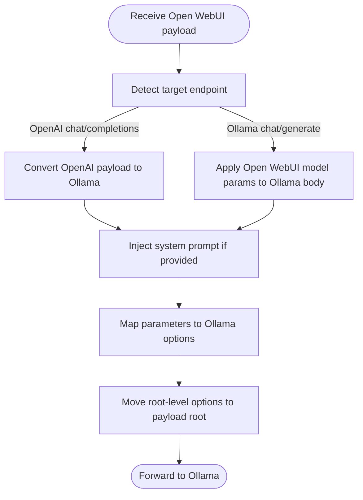

# Ollama Integration

<cite>
**Referenced Files in This Document**
- [backend/open_webui/routers/ollama.py](file://backend/open_webui/routers/ollama.py)
- [backend/open_webui/utils/payload.py](file://backend/open_webui/utils/payload.py)
- [backend/open_webui/env.py](file://backend/open_webui/env.py)
- [backend/open_webui/config.py](file://backend/open_webui/config.py)
- [backend/open_webui/constants.py](file://backend/open_webui/constants.py)
- [src/lib/apis/ollama/index.ts](file://src/lib/apis/ollama/index.ts)
- [backend/open_webui/utils/misc.py](file://backend/open_webui/utils/misc.py)
</cite>

## Table of Contents
1. [Introduction](#introduction)
2. [Project Structure](#project-structure)
3. [Core Components](#core-components)
4. [Architecture Overview](#architecture-overview)
5. [Detailed Component Analysis](#detailed-component-analysis)
6. [Dependency Analysis](#dependency-analysis)
7. [Performance Considerations](#performance-considerations)
8. [Troubleshooting Guide](#troubleshooting-guide)
9. [Conclusion](#conclusion)
10. [Appendices](#appendices)

## Introduction
This document describes the Ollama integration within Open WebUI, focusing on how the backend proxies requests to Ollama services and exposes a unified API for model management. It covers endpoints for listing, pulling, deleting, and creating models, as well as streaming downloads and uploads. It also explains request/response transformations between Open WebUI’s configuration and Ollama’s native API, parameter mapping, connection management, authentication, error handling, and security considerations.

## Project Structure
The Ollama integration spans backend routing, utilities for payload transformation, configuration and environment settings, and frontend API bindings.

**Diagram sources**
- [backend/open_webui/routers/ollama.py](file://backend/open_webui/routers/ollama.py#L1-L1806)
- [backend/open_webui/utils/payload.py](file://backend/open_webui/utils/payload.py#L1-L392)
- [backend/open_webui/utils/misc.py](file://backend/open_webui/utils/misc.py#L428-L474)
- [backend/open_webui/config.py](file://backend/open_webui/config.py#L912-L1004)
- [backend/open_webui/env.py](file://backend/open_webui/env.py#L664-L711)
- [backend/open_webui/constants.py](file://backend/open_webui/constants.py#L1-L127)
- [src/lib/apis/ollama/index.ts](file://src/lib/apis/ollama/index.ts#L1-L562)

**Section sources**
- [backend/open_webui/routers/ollama.py](file://backend/open_webui/routers/ollama.py#L1-L1806)
- [src/lib/apis/ollama/index.ts](file://src/lib/apis/ollama/index.ts#L1-L562)

## Core Components
- Backend Ollama router: Provides endpoints for model listing, pulling, pushing, deleting, creating, showing, and streaming downloads/uploads. Also exposes OpenAI-compatible endpoints and version checks.
- Payload utilities: Transform Open WebUI model parameters into Ollama-compatible bodies and handle OpenAI-to-Ollama conversions.
- Configuration and environment: Manage base URLs, API keys, timeouts, SSL settings, and access control toggles.
- Frontend API bindings: JavaScript module that calls backend endpoints for UI interactions.

Key responsibilities:
- Proxy requests to Ollama instances with authentication and user info forwarding.
- Normalize model lists across multiple Ollama backends.
- Map Open WebUI model parameters to Ollama execution parameters.
- Stream model downloads and uploads with progress events.
- Enforce access control and admin-only operations where appropriate.

**Section sources**
- [backend/open_webui/routers/ollama.py](file://backend/open_webui/routers/ollama.py#L213-L1806)
- [backend/open_webui/utils/payload.py](file://backend/open_webui/utils/payload.py#L1-L392)
- [backend/open_webui/config.py](file://backend/open_webui/config.py#L912-L1004)
- [backend/open_webui/env.py](file://backend/open_webui/env.py#L664-L711)
- [src/lib/apis/ollama/index.ts](file://src/lib/apis/ollama/index.ts#L1-L562)

## Architecture Overview
The integration uses a FastAPI router to expose endpoints that either:
- Fetch model lists from multiple Ollama backends and merge them.
- Forward requests to a selected Ollama backend with optional authentication and user info headers.
- Stream downloads and uploads with progress events.

**Diagram sources**
- [backend/open_webui/routers/ollama.py](file://backend/open_webui/routers/ollama.py#L308-L551)
- [backend/open_webui/utils/payload.py](file://backend/open_webui/utils/payload.py#L123-L203)
- [backend/open_webui/config.py](file://backend/open_webui/config.py#L912-L1004)
- [backend/open_webui/env.py](file://backend/open_webui/env.py#L664-L711)

## Detailed Component Analysis

### Backend Router: Endpoints and Behavior
- Status and verification
  - GET/HEAD “/”: Returns health status.
  - POST “/verify”: Verifies connectivity to a given Ollama URL and returns version info.
- Configuration
  - GET “/config”: Returns current Ollama configuration (enable flag, base URLs, API configs).
  - POST “/config/update”: Updates configuration and prunes stale API configs.
- Model discovery and filtering
  - GET “/api/tags”: Lists tags across configured Ollama backends; supports per-backend filtering by tags, prefixes, and model IDs.
  - GET “/api/ps”: Lists models currently loaded in memory across backends.
  - GET “/api/version”: Returns the lowest Ollama version across backends; supports per-index retrieval.
- Model lifecycle
  - POST “/api/pull”: Pulls a model to a specific backend; supports streaming progress.
  - POST “/api/push”: Pushes a model to a specific backend.
  - DELETE “/api/delete”: Deletes a model from a specific backend.
  - POST “/api/create”: Creates a model from a payload.
  - POST “/api/unload”: Unloads a model from all backends it is known to reside on.
  - POST “/api/show”: Retrieves model info from a chosen backend.
- Embeddings and completions
  - POST “/api/embed” and “/api/embeddings”: Compute embeddings via Ollama.
  - POST “/api/generate”: Single-turn generation.
  - POST “/api/chat”: Chat-style generation with streaming.
  - OpenAI-compatible endpoints:
    - POST “/v1/completions”
    - POST “/v1/chat/completions”
    - GET “/v1/models”
- Streaming downloads and uploads
  - POST “/models/download”: Streams a file from allowed hosts, computes SHA256, and uploads to Ollama blobs.
  - POST “/models/upload”: Streams a local file upload, computes SHA256, uploads to Ollama blobs, and creates a model.

Access control:
- Many endpoints require verified or admin users. Filtering logic ensures users can only access models they own or have access to.

**Section sources**
- [backend/open_webui/routers/ollama.py](file://backend/open_webui/routers/ollama.py#L213-L1806)

### Request/Response Transformation and Parameter Mapping
- OpenAI-to-Ollama mapping:
  - Converts OpenAI payload fields to Ollama equivalents, including message normalization, tool calls, and response format handling.
  - Remaps max_tokens to num_predict and moves system prompt into the payload root for Ollama.
- Ollama parameter mapping:
  - Applies Open WebUI model parameters to Ollama options, converting names and types (e.g., temperature, top_p, num_predict, repeat_penalty).
  - Handles special root-level options (format, keep_alive, think) by moving them out of options.
  - Supports custom_params merging and JSON parsing for complex values.
- System prompt injection:
  - Adds or replaces system messages in chat payloads based on user metadata and model configuration.

**Diagram sources**
- [backend/open_webui/utils/payload.py](file://backend/open_webui/utils/payload.py#L123-L203)
- [backend/open_webui/utils/payload.py](file://backend/open_webui/utils/payload.py#L279-L363)

**Section sources**
- [backend/open_webui/utils/payload.py](file://backend/open_webui/utils/payload.py#L1-L392)

### Connection Management, Authentication, and Headers
- Base URLs and API configs:
  - Multiple Ollama backends can be configured via environment variables and persisted configuration.
  - Per-backend API keys and flags (enable/disable) are supported.
- Timeouts and SSL:
  - Global client timeouts and SSL settings are configurable via environment variables.
- User info forwarding:
  - Optional forwarding of user identity headers to Ollama backends for auditing and policy enforcement.
- Access control:
  - Admin-only endpoints restrict model lifecycle operations.
  - User-visible model lists are filtered by ownership or access control policies.

**Section sources**
- [backend/open_webui/config.py](file://backend/open_webui/config.py#L912-L1004)
- [backend/open_webui/env.py](file://backend/open_webui/env.py#L664-L711)
- [backend/open_webui/routers/ollama.py](file://backend/open_webui/routers/ollama.py#L278-L551)

### Error Handling and Network Scenarios
- HTTP exceptions are raised with detailed messages when Ollama returns non-200 responses.
- Parsing errors for JSON responses are caught and surfaced as structured details.
- Timeout and SSL configuration help mitigate network latency and TLS issues.
- Version mismatch detection compares numeric segments of version strings to select the lowest version across backends.

**Section sources**
- [backend/open_webui/routers/ollama.py](file://backend/open_webui/routers/ollama.py#L81-L194)
- [backend/open_webui/routers/ollama.py](file://backend/open_webui/routers/ollama.py#L554-L625)
- [backend/open_webui/constants.py](file://backend/open_webui/constants.py#L1-L127)

### Frontend API Bindings
- The frontend module exposes functions to:
  - Verify Ollama connection and fetch configuration.
  - Update Ollama configuration.
  - Retrieve Ollama versions and model lists.
  - Pull, push, delete, create, and unload models.
  - Upload and download models with streaming progress.
- These functions wrap backend endpoints and surface errors with user-friendly messages.

**Section sources**
- [src/lib/apis/ollama/index.ts](file://src/lib/apis/ollama/index.ts#L1-L562)

### Model Tags and Custom Parameters
- Tags and prefixes:
  - Tags can be attached to models discovered from backends; prefixes can be applied to normalize model IDs across clusters.
- Custom parameters:
  - Open WebUI model parameters are transformed into Ollama options, including custom_params merging and JSON parsing.
- Modelfile parsing:
  - Utilities extract base model, template, and stop sequences from modelfile text for model configuration.

**Section sources**
- [backend/open_webui/routers/ollama.py](file://backend/open_webui/routers/ollama.py#L308-L551)
- [backend/open_webui/utils/payload.py](file://backend/open_webui/utils/payload.py#L123-L203)
- [backend/open_webui/utils/misc.py](file://backend/open_webui/utils/misc.py#L428-L474)

## Dependency Analysis

**Diagram sources**
- [src/lib/apis/ollama/index.ts](file://src/lib/apis/ollama/index.ts#L1-L562)
- [backend/open_webui/routers/ollama.py](file://backend/open_webui/routers/ollama.py#L1-L1806)
- [backend/open_webui/utils/payload.py](file://backend/open_webui/utils/payload.py#L1-L392)
- [backend/open_webui/utils/misc.py](file://backend/open_webui/utils/misc.py#L428-L474)
- [backend/open_webui/config.py](file://backend/open_webui/config.py#L912-L1004)
- [backend/open_webui/env.py](file://backend/open_webui/env.py#L664-L711)
- [backend/open_webui/constants.py](file://backend/open_webui/constants.py#L1-L127)

**Section sources**
- [backend/open_webui/routers/ollama.py](file://backend/open_webui/routers/ollama.py#L1-L1806)
- [backend/open_webui/utils/payload.py](file://backend/open_webui/utils/payload.py#L1-L392)
- [backend/open_webui/utils/misc.py](file://backend/open_webui/utils/misc.py#L428-L474)
- [backend/open_webui/config.py](file://backend/open_webui/config.py#L912-L1004)
- [backend/open_webui/env.py](file://backend/open_webui/env.py#L664-L711)
- [backend/open_webui/constants.py](file://backend/open_webui/constants.py#L1-L127)

## Performance Considerations
- Parallel model fetching: The router aggregates model lists concurrently across multiple backends to reduce latency.
- Streaming downloads and uploads: Progress is streamed to the client, enabling responsive UI updates during long transfers.
- Caching: Model lists are cached with a TTL controlled by environment configuration to balance freshness and performance.
- Timeouts: Adjustable client timeouts and SSL settings help manage slow or unreliable networks.

[No sources needed since this section provides general guidance]

## Troubleshooting Guide
Common issues and resolutions:
- Service unavailability:
  - Use “/verify” to check connectivity and version. If unavailable, adjust base URLs or credentials.
- Permission denied:
  - Some endpoints require admin privileges; ensure the caller has the correct role.
- Model not found:
  - Ensure the model name includes a version (e.g., “model:latest”) or is present in the unified model list.
- Parameter mapping errors:
  - Verify that custom parameters are valid JSON strings and that unsupported fields are not passed directly in the root payload.
- Network timeouts:
  - Increase AIOHTTP client timeouts and ensure SSL settings match the deployment environment.

**Section sources**
- [backend/open_webui/routers/ollama.py](file://backend/open_webui/routers/ollama.py#L213-L277)
- [backend/open_webui/env.py](file://backend/open_webui/env.py#L664-L711)
- [backend/open_webui/constants.py](file://backend/open_webui/constants.py#L1-L127)

## Conclusion
The Ollama integration provides a robust, configurable, and secure bridge between Open WebUI and Ollama. It supports multi-backend model management, parameter mapping, streaming operations, and access control. Proper configuration of base URLs, API keys, and timeouts enables reliable operation across diverse environments.

[No sources needed since this section summarizes without analyzing specific files]

## Appendices

### API Endpoints Summary
- Health and verification
  - GET/HEAD “/”
  - POST “/verify”
- Configuration
  - GET “/config”
  - POST “/config/update”
- Model discovery
  - GET “/api/tags”
  - GET “/api/ps”
  - GET “/api/version”
- Lifecycle
  - POST “/api/pull”
  - POST “/api/push”
  - DELETE “/api/delete”
  - POST “/api/create”
  - POST “/api/unload”
  - POST “/api/show”
- Embeddings and completions
  - POST “/api/embed”
  - POST “/api/embeddings”
  - POST “/api/generate”
  - POST “/api/chat”
  - POST “/v1/completions”
  - POST “/v1/chat/completions”
  - GET “/v1/models”
- Streaming operations
  - POST “/models/download”
  - POST “/models/upload”

**Section sources**
- [backend/open_webui/routers/ollama.py](file://backend/open_webui/routers/ollama.py#L213-L1806)

### Security Considerations
- Admin-only operations: Model lifecycle endpoints require admin privileges.
- Access control: User-visible model lists are filtered by ownership or access control policies.
- User info forwarding: Optional forwarding of user identity headers to backends for auditing.
- TLS and timeouts: Configure SSL and timeouts appropriately for your deployment.

**Section sources**
- [backend/open_webui/routers/ollama.py](file://backend/open_webui/routers/ollama.py#L278-L551)
- [backend/open_webui/env.py](file://backend/open_webui/env.py#L210-L222)