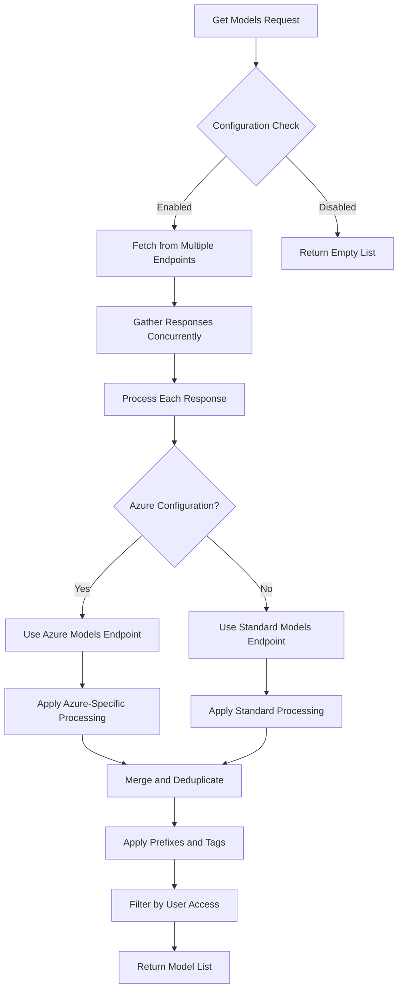
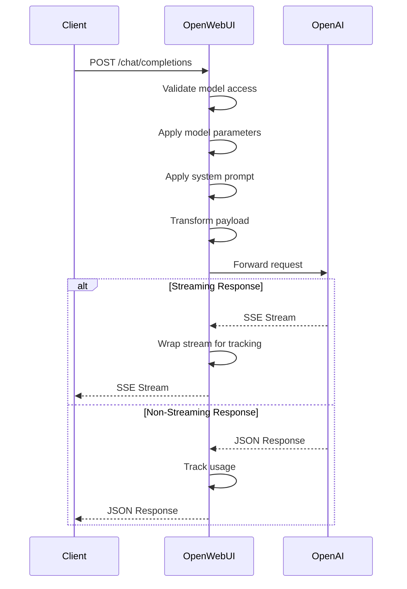
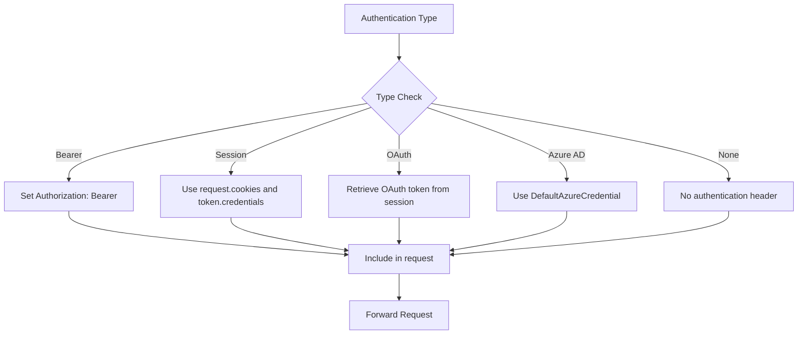
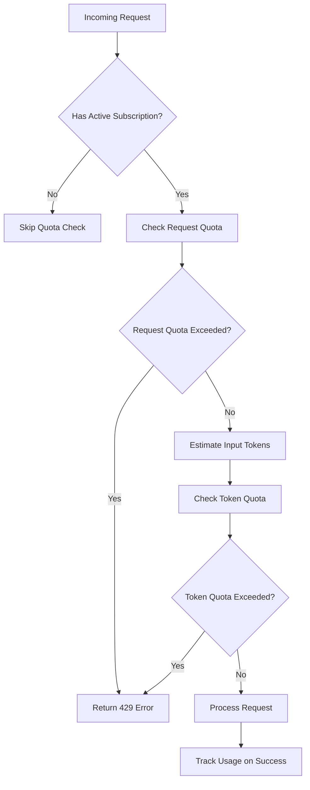
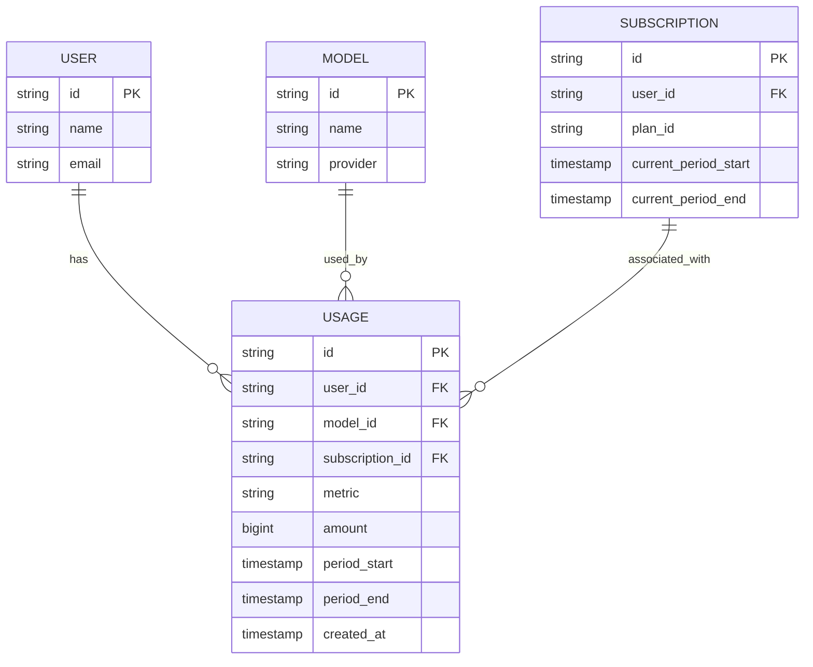

# OpenAI Integration

<cite>
**Referenced Files in This Document**   
- [openai.py](file://backend/open_webui/routers/openai.py)
- [models.py](file://backend/open_webui/models/models.py)
- [payload.py](file://backend/open_webui/utils/payload.py)
- [billing_integration.py](file://backend/open_webui/utils/billing_integration.py)
- [env.py](file://backend/open_webui/env.py)
- [config.py](file://backend/open_webui/config.py)
</cite>

## Table of Contents
1. [Introduction](#introduction)
2. [API Endpoints](#api-endpoints)
3. [Model Management](#model-management)
4. [Request/Response Transformation](#requestresponse-transformation)
5. [Parameter Validation and Exposure](#parameter-validation-and-exposure)
6. [Authentication and API Key Management](#authentication-and-api-key-management)
7. [Rate Limiting and Quota Management](#rate-limiting-and-quota-management)
8. [Error Handling](#error-handling)
9. [Usage Monitoring and Cost Estimation](#usage-monitoring-and-cost-estimation)
10. [Advanced Configuration](#advanced-configuration)

## Introduction
The OpenAI integration in Open WebUI provides a comprehensive interface for managing and interacting with OpenAI models through a proxy API. This documentation details the architecture, endpoints, and functionality that enable users to enumerate models, configure parameters, and manage authentication for OpenAI services. The system acts as an intermediary between the Open WebUI frontend and OpenAI's API, handling request transformation, authentication, rate limiting, and usage tracking. The integration supports various authentication methods including standard API keys, Azure Entra ID, and OAuth, while providing detailed control over model parameters and system prompts.

**Section sources**
- [openai.py](file://backend/open_webui/routers/openai.py#L1-L1189)

## API Endpoints
The OpenAI integration exposes several key endpoints for interacting with OpenAI services. The primary endpoint is `/chat/completions` which handles chat completion requests and serves as the main interface for model interaction. This endpoint supports both streaming and non-streaming responses, with appropriate handling for Server-Sent Events (SSE) in the response headers. Additional endpoints include `/models` for retrieving available models, `/config` for accessing configuration settings, and `/verify` for testing connection configurations. The system also includes a deprecated proxy endpoint that forwards requests to any OpenAI-compatible API path. Each endpoint implements comprehensive error handling and authentication checks to ensure secure access to OpenAI services.

```mermaid
graph TD
A[Client] --> B[/chat/completions]
A --> C[/models]
A --> D[/config]
A --> E[/verify]
A --> F[/audio/speech]
B --> G[OpenAI API]
C --> G
D --> H[Configuration]
E --> G
F --> I[Speech Generation]
```

**Diagram sources**
- [openai.py](file://backend/open_webui/routers/openai.py#L802-L1189)

**Section sources**
- [openai.py](file://backend/open_webui/routers/openai.py#L215-L1189)

## Model Management
The model management system provides comprehensive functionality for enumerating and configuring OpenAI models. The `/models` endpoint retrieves available models from configured OpenAI API endpoints, with support for filtering and categorization. Models can be organized using prefix IDs and tags, allowing for logical grouping and identification. The system automatically handles model enumeration from multiple OpenAI API endpoints, merging results while eliminating duplicates. Administrators can configure which models are exposed through the API by specifying model IDs in the configuration. The integration also supports Azure OpenAI models, with special handling for Azure-specific endpoints and authentication methods. Model access control is enforced based on user roles and permissions, ensuring that users can only access models they are authorized to use.



**Diagram sources**
- [openai.py](file://backend/open_webui/routers/openai.py#L547-L633)

**Section sources**
- [openai.py](file://backend/open_webui/routers/openai.py#L351-L633)
- [models.py](file://backend/open_webui/models/models.py#L1-L402)

## Request/Response Transformation
The request/response transformation layer handles the conversion between Open WebUI's API format and OpenAI's API format. When a chat completion request is received, the system first validates the model access and applies any configured model parameters and system prompts. The request payload is then transformed to match the expected format of the target OpenAI endpoint, with special handling for Azure OpenAI requirements. For streaming responses, the system wraps the response stream to track usage and handle cleanup operations. The transformation process includes handling of metadata, user information, and custom parameters. Response handling differs between streaming and non-streaming cases, with streaming responses requiring special processing to extract usage information from the final SSE chunk while maintaining the streaming nature of the response.



**Diagram sources**
- [openai.py](file://backend/open_webui/routers/openai.py#L802-L1189)
- [payload.py](file://backend/open_webui/utils/payload.py#L1-L392)

**Section sources**
- [openai.py](file://backend/open_webui/routers/openai.py#L802-L1189)
- [payload.py](file://backend/open_webui/utils/payload.py#L1-L392)

## Parameter Validation and Exposure
The system exposes and validates standard OpenAI model parameters including temperature, top_p, frequency_penalty, presence_penalty, and max_tokens. These parameters are validated and converted to appropriate types before being included in the forwarded request. Special handling exists for certain parameter types: logit_bias values are converted from string input to JSON format, and stop sequences are processed to handle escape characters. The system also supports custom parameters through the custom_params field, which allows for JSON-encoded parameters to be merged with the main parameters. For reasoning models (those starting with "o1", "o3", "o4", or "gpt-5"), special processing is applied, including converting max_tokens to max_completion_tokens and restricting temperature to its default value of 1. The response_format parameter is supported for controlling the structure of model outputs, enabling JSON mode and other structured output formats.

**Section sources**
- [payload.py](file://backend/open_webui/utils/payload.py#L89-L120)
- [openai.py](file://backend/open_webui/routers/openai.py#L770-L797)

## Authentication and API Key Management
The authentication system supports multiple methods for accessing OpenAI services, including standard API keys, Azure Entra ID, and session-based authentication. API keys are configured through the admin interface and stored securely in the application state. For Azure OpenAI, the system can use DefaultAzureCredential to obtain access tokens automatically, eliminating the need to manage API keys directly. The authentication flow varies by type: bearer tokens are included in the Authorization header, session authentication uses cookies and token credentials, and OAuth flows retrieve access tokens from stored OAuth sessions. The system also supports forwarding user information in requests when enabled through the ENABLE_FORWARD_USER_INFO_HEADERS configuration. API key management is handled through the configuration endpoints, allowing administrators to update keys and endpoints without restarting the service.



**Diagram sources**
- [openai.py](file://backend/open_webui/routers/openai.py#L126-L188)

**Section sources**
- [openai.py](file://backend/open_webui/routers/openai.py#L126-L204)
- [config.py](file://backend/open_webui/config.py#L290-L313)

## Rate Limiting and Quota Management
The rate limiting and quota management system enforces usage limits based on user subscriptions and plan configurations. Before processing a chat completion request, the system checks both request and token quotas using the check_and_enforce_quota function. The quota check first verifies that the user has an active subscription, then enforces limits on the number of requests and estimated input tokens. Token estimation is performed using a simple character-based approximation (4 characters ≈ 1 token) when exact counts are not available. If a quota is exceeded, a 429 Too Many Requests error is returned with details about the exceeded limit. The system is designed to be resilient to billing service failures, logging errors but allowing requests to proceed if the quota checking system itself encounters issues. Usage tracking occurs after successful responses, with both streaming and non-streaming responses having appropriate tracking mechanisms.



**Diagram sources**
- [billing_integration.py](file://backend/open_webui/utils/billing_integration.py#L22-L78)

**Section sources**
- [billing_integration.py](file://backend/open_webui/utils/billing_integration.py#L22-L78)
- [openai.py](file://backend/open_webui/routers/openai.py#L857-L871)

## Error Handling
The error handling system provides comprehensive management of various error conditions that may occur during OpenAI API interactions. Connection errors are caught and logged, with appropriate HTTP 500 errors returned to clients. Authentication failures result in 401 Unauthorized responses, while quota exceeded conditions trigger 429 Too Many Requests errors. The system distinguishes between different types of errors, providing specific error details when available from the upstream OpenAI API. For streaming responses, error handling is integrated with the stream processing to ensure proper cleanup of resources. The error handling also includes special processing for Azure OpenAI endpoints, where different error response formats (JSON vs plain text) are handled appropriately. Validation errors for model access result in 403 Forbidden responses, while requests for non-existent models return 404 Not Found errors.

**Section sources**
- [openai.py](file://backend/open_webui/routers/openai.py#L944-L1010)
- [billing_integration.py](file://backend/open_webui/utils/billing_integration.py#L108-L117)

## Usage Monitoring and Cost Estimation
The usage monitoring system tracks model usage for billing and analytics purposes. Usage data is extracted from API responses, capturing prompt_tokens, completion_tokens, and total_tokens. This data is then used to update usage metrics in the billing system, with separate tracking for input tokens, output tokens, and request counts. The system supports both streaming and non-streaming response tracking through specialized wrapper functions that intercept the final response chunk to extract usage information. Cost estimation is based on the tracked token counts and configured pricing models, with usage aggregated by user, model, and time period. The billing integration stores usage data in a dedicated database with indexes optimized for analytics queries, allowing for detailed usage reporting and quota enforcement. Administrators can monitor usage patterns and generate reports to understand resource consumption across different models and users.



**Diagram sources**
- [billing_integration.py](file://backend/open_webui/utils/billing_integration.py#L182-L218)
- [billing.py](file://backend/open_webui/models/billing.py#L176-L204)

**Section sources**
- [billing_integration.py](file://backend/open_webui/utils/billing_integration.py#L162-L289)
- [billing.py](file://backend/open_webui/models/billing.py#L176-L224)

## Advanced Configuration
The advanced configuration system allows administrators to customize the OpenAI integration through various settings and parameters. The OPENAI_API_CONFIGS configuration supports per-endpoint settings including authentication type, API version for Azure, custom headers, and model filtering. The prefix_id parameter enables namespace isolation by prefixing model IDs, while the tags parameter allows for categorization of models from different endpoints. The system supports legacy configuration formats for backward compatibility, automatically mapping URL-based configurations to index-based configurations. Special handling exists for reasoning models and Azure OpenAI, with parameter conversion and filtering of unsupported parameters. The configuration also includes timeout settings for different types of requests, with separate timeouts for model enumeration and regular API calls. Environment variables control various aspects of the integration, including SSL settings, client timeouts, and caching behavior.

**Section sources**
- [openai.py](file://backend/open_webui/routers/openai.py#L225-L273)
- [env.py](file://backend/open_webui/env.py#L664-L691)
- [config.py](file://backend/open_webui/config.py#L158-L222)