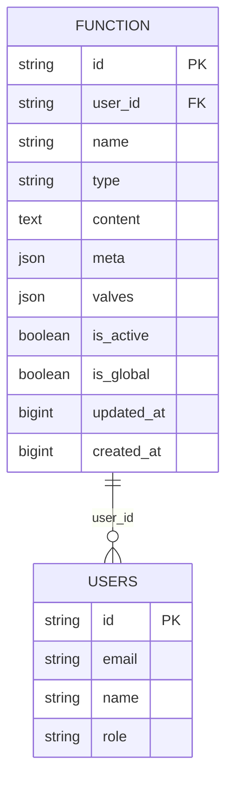
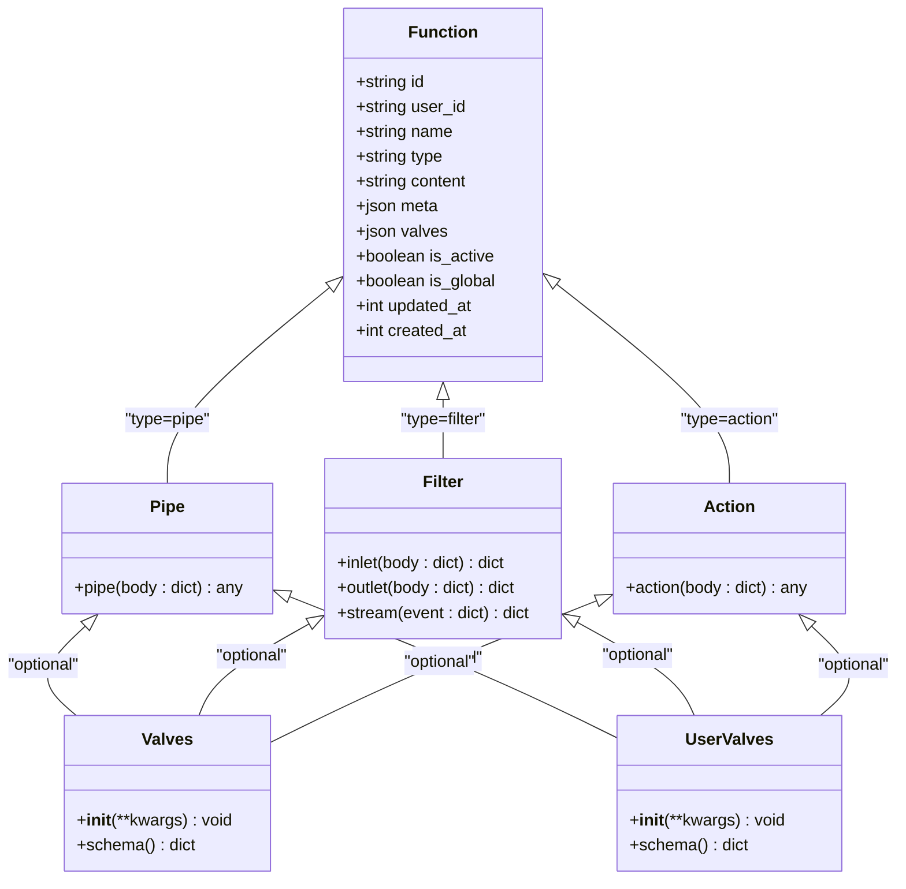
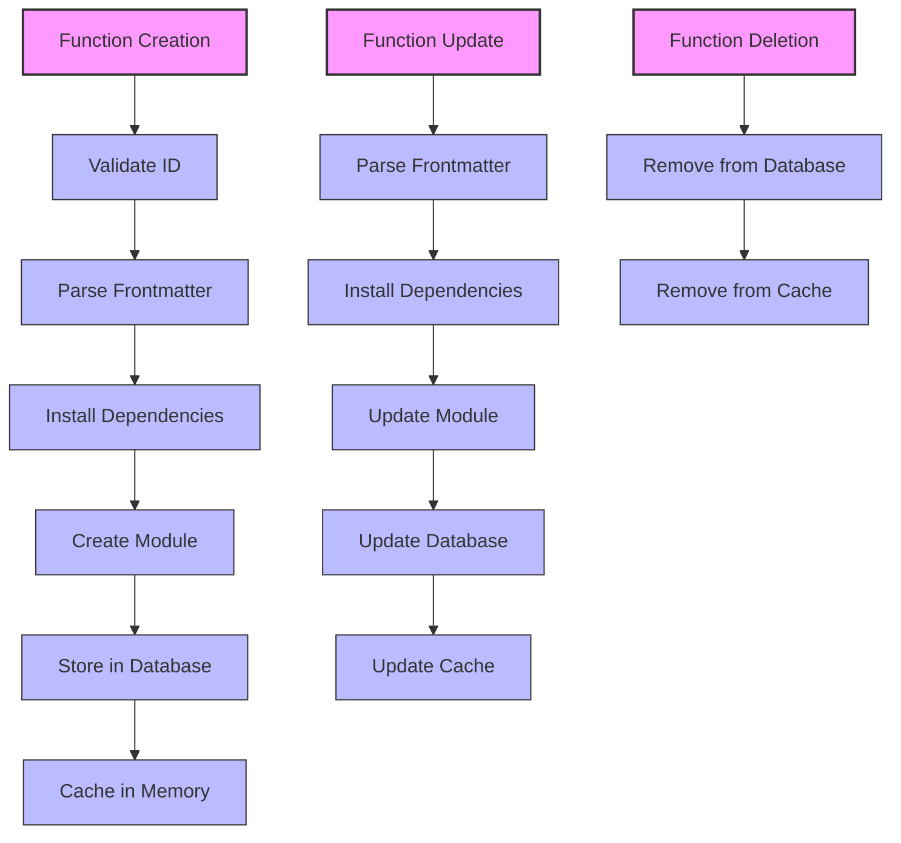
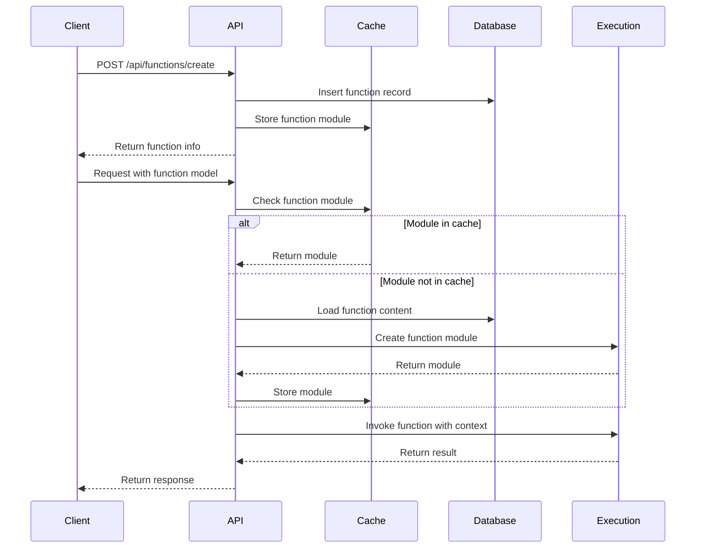
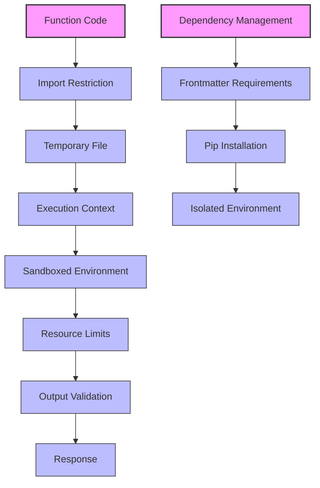
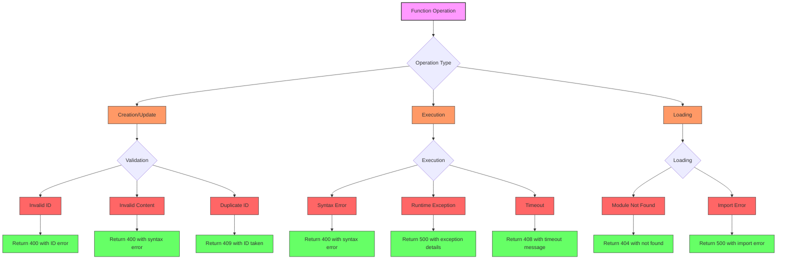
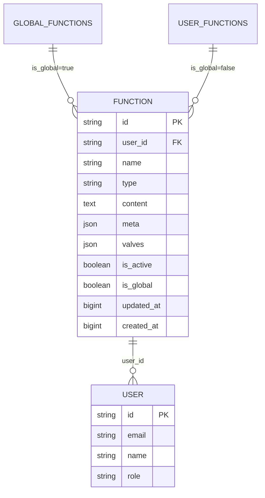
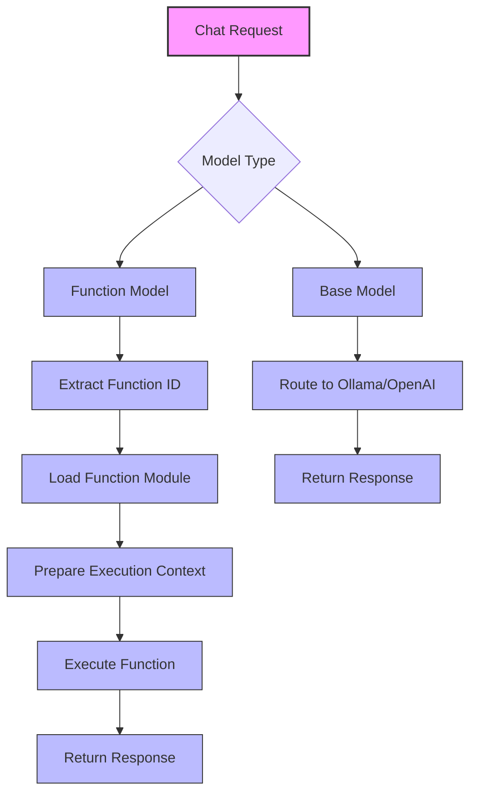
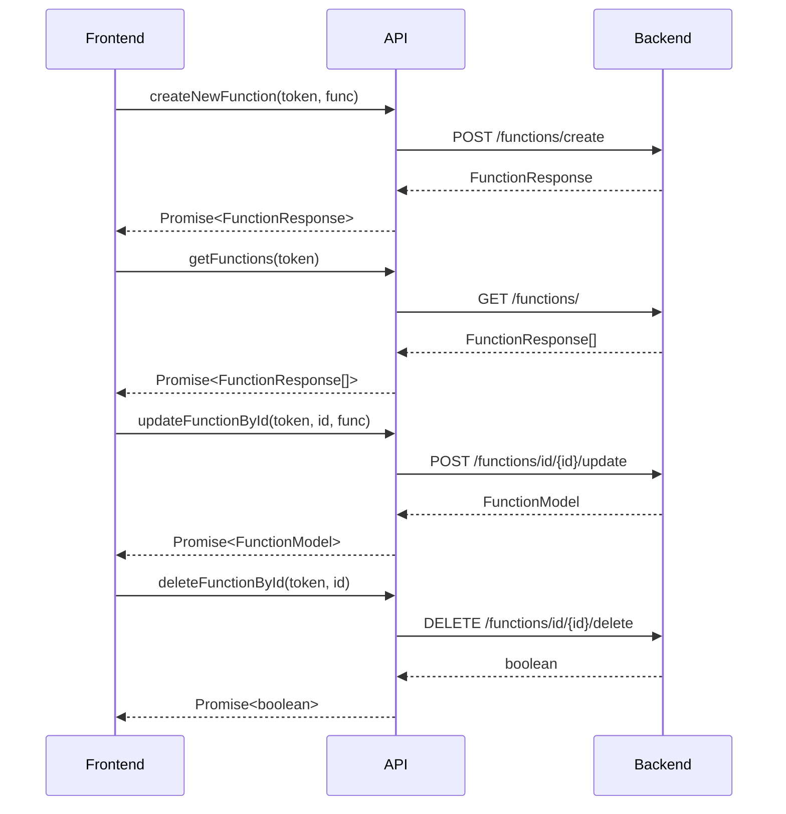

# Functions API

<cite>
**Referenced Files in This Document**   
- [functions.py](file://backend/open_webui/routers/functions.py)
- [functions.py](file://backend/open_webui/models/functions.py)
- [functions.py](file://backend/open_webui/functions.py)
- [plugin.py](file://backend/open_webui/utils/plugin.py)
- [015_add_functions.py](file://backend/open_webui/internal/migrations/015_add_functions.py)
- [018_add_function_is_global.py](file://backend/open_webui/internal/migrations/018_add_function_is_global.py)
- [index.ts](file://src/lib/apis/functions/index.ts)
</cite>

## Table of Contents
1. [Introduction](#introduction)
2. [API Endpoints](#api-endpoints)
3. [Function Schema](#function-schema)
4. [Function Types and Execution](#function-types-and-execution)
5. [Function Storage and Management](#function-storage-and-management)
6. [Function Registration and Invocation](#function-registration-and-invocation)
7. [Security and Execution Environment](#security-and-execution-environment)
8. [Error Handling](#error-handling)
9. [Function Versioning and Scope](#function-versioning-and-scope)
10. [Integration with AI Models](#integration-with-ai-models)
11. [Frontend Integration](#frontend-integration)

## Introduction

The Functions API provides a comprehensive system for managing custom Python functions that extend the business logic of the application. This API enables users to create, manage, and execute custom functions that can be integrated into the chat processing pipeline. Functions are distinct from tools, which represent external API integrations. Functions are user-defined or system-level Python callables that execute directly within the backend environment, providing powerful customization capabilities.

The API supports four primary endpoints for managing functions: GET /api/functions, POST /api/functions, PUT /api/functions/{id}, and DELETE /api/functions/{id}. These endpoints allow for full CRUD operations on functions, with appropriate authentication and authorization controls. Functions can be used for various purposes including filtering input/output, performing actions, or serving as pipes in the processing pipeline.

**Section sources**
- [functions.py](file://backend/open_webui/routers/functions.py#L1-L546)

## API Endpoints

The Functions API provides a comprehensive set of endpoints for managing functions. All endpoints require authentication, with most requiring admin privileges for modification operations.

```mermaid
flowchart TD
A[Client] --> B[GET /api/functions]
A --> C[POST /api/functions]
A --> D[PUT /api/functions/{id}]
A --> E[DELETE /api/functions/{id}]
A --> F[GET /api/functions/list]
A --> G[POST /api/functions/load/url]
A --> H[POST /api/functions/sync]
A --> I[POST /api/functions/id/{id}/toggle]
A --> J[POST /api/functions/id/{id}/toggle/global]
A --> K[GET /api/functions/id/{id}]
A --> L[GET /api/functions/export]
B --> M[Return list of active functions]
C --> N[Create new function]
D --> O[Update existing function]
E --> P[Delete function]
F --> Q[Return list with user info]
G --> R[Load function from URL]
H --> S[Sync multiple functions]
I --> T[Toggle function active status]
J --> U[Toggle function global status]
K --> V[Get function by ID]
L --> W[Export functions with valves]
style A fill:#f9f,stroke:#333,stroke-width:2px
style M fill:#bbf,stroke:#333,stroke-width:1px
style N fill:#bbf,stroke:#333,stroke-width:1px
style O fill:#bbf,stroke:#333,stroke-width:1px
style P fill:#bbf,stroke:#333,stroke-width:1px
style Q fill:#bbf,stroke:#333,stroke-width:1px
style R fill:#bbf,stroke:#333,stroke-width:1px
style S fill:#bbf,stroke:#333,stroke-width:1px
style T fill:#bbf,stroke:#333,stroke-width:1px
style U fill:#bbf,stroke:#333,stroke-width:1px
style V fill:#bbf,stroke:#333,stroke-width:1px
style W fill:#bbf,stroke:#333,stroke-width:1px
```

**Diagram sources**
- [functions.py](file://backend/open_webui/routers/functions.py#L41-L366)

### GET /api/functions

Retrieves a list of all active functions. This endpoint is accessible to verified users.

- **Method**: GET
- **Path**: /api/functions
- **Authentication**: Required (verified user)
- **Response**: Array of FunctionResponse objects
- **Status Codes**: 
  - 200: Success
  - 401: Unauthorized

### POST /api/functions

Creates a new function. This endpoint is restricted to admin users.

- **Method**: POST
- **Path**: /api/functions/create
- **Authentication**: Required (admin user)
- **Request Body**: FunctionForm object
- **Response**: FunctionResponse object or null
- **Status Codes**:
  - 200: Success
  - 400: Bad request (invalid ID or content)
  - 401: Unauthorized
  - 409: ID already taken

### PUT /api/functions/{id}

Updates an existing function. This endpoint is restricted to admin users.

- **Method**: POST
- **Path**: /api/functions/id/{id}/update
- **Authentication**: Required (admin user)
- **Request Body**: FunctionForm object
- **Response**: FunctionModel object or null
- **Status Codes**:
  - 200: Success
  - 400: Bad request
  - 401: Unauthorized
  - 404: Function not found

### DELETE /api/functions/{id}

Deletes a function by ID. This endpoint is restricted to admin users.

- **Method**: DELETE
- **Path**: /api/functions/id/{id}/delete
- **Authentication**: Required (admin user)
- **Response**: Boolean indicating success
- **Status Codes**:
  - 200: Success
  - 401: Unauthorized

### Additional Endpoints

The API also provides several additional endpoints for specialized operations:

- **GET /api/functions/list**: Returns a list of functions with associated user information (admin only)
- **GET /api/functions/export**: Exports functions including valve configurations (admin only)
- **POST /api/functions/load/url**: Loads a function from a URL, supporting GitHub repository links (admin only)
- **POST /api/functions/sync**: Synchronizes multiple functions at once (admin only)
- **POST /api/functions/id/{id}/toggle**: Toggles the active status of a function (admin only)
- **POST /api/functions/id/{id}/toggle/global**: Toggles the global status of a function (admin only)
- **GET /api/functions/id/{id}**: Retrieves a specific function by ID (admin only)

**Section sources**
- [functions.py](file://backend/open_webui/routers/functions.py#L41-L366)
- [index.ts](file://src/lib/apis/functions/index.ts#L1-L521)

## Function Schema

The function schema defines the structure and properties of functions within the system. Functions are stored in the database with a specific schema that includes metadata, content, and configuration options.



**Diagram sources**
- [functions.py](file://backend/open_webui/models/functions.py#L19-L35)
- [015_add_functions.py](file://backend/open_webui/internal/migrations/015_add_functions.py#L41-L56)
- [018_add_function_is_global.py](file://backend/open_webui/internal/migrations/018_add_function_is_global.py#L40-L43)

### Core Properties

The function schema includes the following core properties:

- **id**: Unique identifier for the function (string, primary key)
- **user_id**: ID of the user who created the function (string, foreign key to users)
- **name**: Display name of the function (string)
- **type**: Function type (string, one of "pipe", "filter", or "action")
- **content**: Python code implementation of the function (text)
- **meta**: Metadata including description and manifest (JSON)
- **valves**: Configuration values for the function (JSON)
- **is_active**: Boolean indicating if the function is currently active (boolean)
- **is_global**: Boolean indicating if the function is globally available (boolean)
- **updated_at**: Timestamp of last update (bigint, epoch)
- **created_at**: Timestamp of creation (bigint, epoch)

### FunctionForm Model

The FunctionForm model is used for creating and updating functions:

- **id**: Function identifier (string)
- **name**: Function name (string)
- **content**: Python code (string)
- **meta**: Metadata object with description and manifest (FunctionMeta)

### FunctionMeta Model

The FunctionMeta model contains additional metadata:

- **description**: Text description of the function (string, optional)
- **manifest**: Frontmatter extracted from the function code (dictionary, optional)

The manifest is extracted from triple-quoted comments at the beginning of the function code and can include properties like "icon_url", "requirements", and other custom metadata.

**Section sources**
- [functions.py](file://backend/open_webui/models/functions.py#L19-L105)

## Function Types and Execution

Functions are categorized into different types based on their purpose and execution pattern. The system supports three primary function types: pipes, filters, and actions.



**Diagram sources**
- [functions.py](file://backend/open_webui/utils/plugin.py#L149-L157)
- [functions.py](file://backend/open_webui/functions.py#L159-L354)

### Function Types

#### Pipe Functions
Pipe functions are used to process chat completions and generate responses. They implement a `pipe` method that takes a body parameter containing the chat request and returns a response. Pipe functions can return strings, generators, or streaming responses.

#### Filter Functions
Filter functions are used to modify input and output data at various stages of processing. They can implement one or more of the following methods:
- **inlet**: Processes incoming requests before they are handled
- **outlet**: Processes outgoing responses before they are returned
- **stream**: Processes streaming events as they occur

#### Action Functions
Action functions perform specific operations or tasks. They implement an `action` method that can be invoked to perform a specific function within the application.

### Execution Context

When a function is executed, it receives a rich context that includes:
- **body**: The main request or event data
- **__event_emitter__**: Function to emit events during processing
- **__event_call__**: Function to make event calls
- **__chat_id__**: ID of the current chat
- **__session_id__**: ID of the current session
- **__message_id__**: ID of the current message
- **__task__**: Current task information
- **__task_body__**: Body of the current task
- **__files__**: Files associated with the request
- **__user__**: User information and valves
- **__metadata__**: Additional metadata
- **__oauth_token__**: OAuth token for external API access
- **__request__**: The original HTTP request object
- **__tools__**: Available tools for the function to use
- **__model__**: Model information
- **__messages__**: Chat messages

**Section sources**
- [functions.py](file://backend/open_webui/functions.py#L159-L354)
- [plugin.py](file://backend/open_webui/utils/plugin.py#L149-L157)

## Function Storage and Management

Functions are stored in a relational database with a dedicated table structure. The system provides comprehensive management capabilities for creating, updating, and deleting functions.



**Diagram sources**
- [functions.py](file://backend/open_webui/models/functions.py#L106-L393)
- [functions.py](file://backend/open_webui/routers/functions.py#L183-L233)

### Database Schema

The function table in the database has the following structure:
- **id**: Primary key, unique identifier
- **user_id**: Foreign key to the user who created the function
- **name**: Display name
- **type**: Function type (pipe, filter, action)
- **content**: Python code
- **meta**: JSON field for metadata
- **valves**: JSON field for configuration values
- **is_active**: Boolean flag for active status
- **is_global**: Boolean flag for global availability
- **updated_at**: Last update timestamp
- **created_at**: Creation timestamp

An index is created on the is_global field to optimize queries for global functions.

### Migration History

The database schema has evolved through migrations:
- **015_add_functions.py**: Initial creation of the function table with basic fields
- **018_add_function_is_global.py**: Addition of the is_global field to support global functions

### In-Memory Caching

For performance optimization, functions are cached in memory when loaded. The system maintains two caches:
- **FUNCTIONS**: Cache of loaded function modules
- **FUNCTION_CONTENTS**: Cache of function content to detect changes

When a function is accessed, the system first checks if the content has changed since the last load. If unchanged, the cached module is returned. Otherwise, the function is reloaded and the cache is updated.

**Section sources**
- [functions.py](file://backend/open_webui/models/functions.py#L19-L396)
- [015_add_functions.py](file://backend/open_webui/internal/migrations/015_add_functions.py#L37-L62)
- [018_add_function_is_global.py](file://backend/open_webui/internal/migrations/018_add_function_is_global.py#L37-L50)

## Function Registration and Invocation

The system provides a robust mechanism for registering and invoking functions. Functions are registered through the API and can be invoked through various integration points.



**Diagram sources**
- [functions.py](file://backend/open_webui/routers/functions.py#L183-L233)
- [functions.py](file://backend/open_webui/functions.py#L159-L354)
- [plugin.py](file://backend/open_webui/utils/plugin.py#L118-L264)

### Function Registration Process

When a function is created or updated, the following registration process occurs:

1. **Validation**: The function ID is validated to ensure it's a valid Python identifier
2. **Content Processing**: Import paths are replaced to ensure proper module resolution
3. **Module Loading**: The function content is loaded as a Python module
4. **Frontmatter Extraction**: Metadata is extracted from triple-quoted comments
5. **Dependency Installation**: Required packages specified in the frontmatter are installed
6. **Database Storage**: Function data is stored in the database
7. **Memory Caching**: The function module is cached in memory for quick access

### Function Invocation Process

When a function is invoked, typically as part of a chat completion request, the following process occurs:

1. **Function Identification**: The function ID is extracted from the model name
2. **Module Retrieval**: The function module is retrieved from cache or loaded from the database
3. **Valve Configuration**: System and user-specific valves are applied to the function
4. **Parameter Preparation**: Execution parameters are prepared based on the function signature
5. **Function Execution**: The function is executed with the prepared parameters
6. **Response Handling**: The function result is processed and returned to the client

### Manifold Functions

The system supports manifold functions, which are functions that can expose multiple sub-functions. A manifold function can define a `pipes` attribute that contains a list of sub-function definitions. When registered, each sub-function is exposed as a separate model, allowing for multiple entry points from a single code base.

**Section sources**
- [functions.py](file://backend/open_webui/routers/functions.py#L183-L233)
- [functions.py](file://backend/open_webui/functions.py#L81-L156)
- [plugin.py](file://backend/open_webui/utils/plugin.py#L118-L264)

## Security and Execution Environment

The system implements several security measures to ensure safe execution of custom functions while maintaining system integrity.



**Diagram sources**
- [plugin.py](file://backend/open_webui/utils/plugin.py#L118-L264)
- [plugin.py](file://backend/open_webui/utils/plugin.py#L267-L313)

### Code Execution Security

Functions are executed in a secure environment with the following protections:

- **Temporary Files**: Function code is written to temporary files before execution to prevent direct code injection
- **Import Restriction**: The system can restrict imports of certain modules that could compromise security
- **Sandboxing**: Functions are executed in a restricted environment with limited access to system resources
- **Memory Management**: Temporary files are automatically cleaned up after execution

### Dependency Management

Functions can specify dependencies in their frontmatter using the "requirements" field. When a function is loaded, the system automatically installs these dependencies using pip:

```python
"""
requirements: requests, pandas
icon_url: https://example.com/icon.png
"""
```

The dependency installation process:
1. Extract requirements from frontmatter
2. Install packages using pip with configured options
3. Handle installation errors gracefully
4. Log installation status

All dependencies for active functions are installed when the application starts, ensuring they are available when needed.

### Resource Limits

While the code doesn't explicitly show resource limits, the architecture supports the potential for:
- **Time limits**: Functions could be configured with execution time limits
- **Memory limits**: Execution environment could restrict memory usage
- **Rate limiting**: Function invocation could be rate-limited based on user roles

**Section sources**
- [plugin.py](file://backend/open_webui/utils/plugin.py#L118-L313)

## Error Handling

The system implements comprehensive error handling for function operations, providing clear feedback for various failure scenarios.



**Diagram sources**
- [functions.py](file://backend/open_webui/routers/functions.py#L183-L347)
- [functions.py](file://backend/open_webui/functions.py#L340-L345)

### Error Types

The system handles several types of errors:

#### Syntax Errors
- Invalid function ID (non-alphanumeric characters)
- Malformed Python code
- Missing required classes (Pipe, Filter, Action)
- Invalid frontmatter format

#### Runtime Exceptions
- Exceptions raised during function execution
- Import errors for required modules
- Dependency installation failures
- External API call failures

#### Configuration Errors
- Invalid valve configurations
- Missing required parameters
- Access control violations
- Global function conflicts

### Error Responses

The API returns standardized error responses with appropriate HTTP status codes:

- **400 Bad Request**: Validation errors, syntax errors, or invalid parameters
- **401 Unauthorized**: Authentication required or insufficient permissions
- **404 Not Found**: Function or resource not found
- **409 Conflict**: Resource conflict (e.g., duplicate ID)
- **500 Internal Server Error**: Unhandled exceptions or system errors

Error responses include descriptive messages to help users diagnose and fix issues. For example, when a function fails to load due to a syntax error, the response includes details about the specific error.

**Section sources**
- [functions.py](file://backend/open_webui/routers/functions.py#L183-L347)
- [functions.py](file://backend/open_webui/functions.py#L340-L345)

## Function Versioning and Scope

The system implements a scope-based model for functions rather than explicit versioning. Functions can be either user-specific or global, providing flexibility in sharing and access control.



**Diagram sources**
- [functions.py](file://backend/open_webui/models/functions.py#L19-L35)
- [018_add_function_is_global.py](file://backend/open_webui/internal/migrations/018_add_function_is_global.py#L40-L43)

### Global vs. User-Specific Functions

The `is_global` field in the function schema determines the scope of a function:

- **Global Functions** (`is_global=true`): Available to all users in the system. These functions are typically system-level utilities or shared business logic.
- **User-Specific Functions** (`is_global=false`): Available only to the user who created them or users with appropriate permissions.

The migration `018_add_function_is_global.py` added this field to support global functions, allowing for shared functionality across users.

### Access Control

Access to functions is controlled through:
- **User ID**: Functions are associated with the user who created them
- **Global Flag**: Determines if a function is available system-wide
- **Active Status**: Functions can be deactivated without deletion
- **Role-Based Access**: Admin users can manage all functions, while regular users can only manage their own

### Function Updates

The system does not implement explicit versioning for functions. Instead, updating a function replaces the existing implementation. This approach:
- Simplifies the model by avoiding version complexity
- Ensures that references to a function ID always use the latest implementation
- Requires careful consideration when updating shared functions

When a function is updated, the system:
1. Validates the new content
2. Updates the database record
3. Refreshes the in-memory cache
4. Maintains the same function ID

This means that any references to the function by ID will automatically use the updated implementation.

**Section sources**
- [functions.py](file://backend/open_webui/models/functions.py#L19-L35)
- [018_add_function_is_global.py](file://backend/open_webui/internal/migrations/018_add_function_is_global.py#L37-L50)

## Integration with AI Models

Functions are integrated with the AI model system, allowing them to be selected and used during chat processing. This integration enables functions to be treated as models in the OpenAI-compatible API.



**Diagram sources**
- [functions.py](file://backend/open_webui/functions.py#L159-L354)
- [functions.py](file://backend/open_webui/routers/functions.py#L41-L43)

### Model Exposure

Functions are exposed as models through the `get_function_models` function, which:
1. Retrieves all active pipe functions
2. For each function, creates a model entry with:
   - ID: Function ID (or sub-function ID for manifolds)
   - Name: Function name
   - Object type: "model"
   - Creation timestamp
   - Owned by: "openai" (for API compatibility)
   - Pipe flag: Indicates it's a function-based model
   - User valves flag: Indicates if user-specific valves are supported

### Function Selection

During chat processing, when a request specifies a function-based model:
1. The system extracts the function ID from the model name
2. Loads the corresponding function module
3. Prepares the execution context with request data and user information
4. Executes the function's `pipe` method
5. Returns the result in the appropriate format (streaming or complete)

### Valve Integration

Functions can define `Valves` and `UserValves` classes for configuration:
- **Valves**: System-level configuration controlled by administrators
- **UserValves**: User-specific configuration that individual users can customize

When a function is executed, the appropriate valves are applied based on the user context, allowing for both system-wide and personalized configuration.

**Section sources**
- [functions.py](file://backend/open_webui/functions.py#L81-L156)

## Frontend Integration

The frontend provides a comprehensive interface for managing functions through API calls. The integration is implemented in the functions API client.



**Diagram sources**
- [index.ts](file://src/lib/apis/functions/index.ts#L3-L521)
- [functions.py](file://backend/open_webui/routers/functions.py#L41-L366)

### API Client Functions

The frontend implements the following functions for interacting with the Functions API:

- **createNewFunction**: Creates a new function with the provided definition
- **getFunctions**: Retrieves a list of available functions
- **getFunctionList**: Retrieves a list of functions with user information (admin only)
- **loadFunctionByUrl**: Loads a function from a URL (admin only)
- **exportFunctions**: Exports functions with valve configurations (admin only)
- **getFunctionById**: Retrieves a specific function by ID (admin only)
- **updateFunctionById**: Updates an existing function (admin only)
- **deleteFunctionById**: Deletes a function by ID (admin only)
- **toggleFunctionById**: Toggles the active status of a function (admin only)
- **toggleGlobalById**: Toggles the global status of a function (admin only)
- **getFunctionValvesById**: Retrieves system valves for a function (admin only)
- **getFunctionValvesSpecById**: Retrieves the valve schema for a function (admin only)
- **updateFunctionValvesById**: Updates system valves for a function (admin only)
- **getUserValvesById**: Retrieves user-specific valves for a function
- **getUserValvesSpecById**: Retrieves the user valve schema for a function
- **updateUserValvesById**: Updates user-specific valves for a function

### Error Handling

The frontend client implements robust error handling:
- Catches API errors and extracts error details
- Logs errors to the console for debugging
- Throws descriptive error messages for user feedback
- Returns null on failure, allowing callers to handle the error appropriately

The client uses the Bearer token authentication scheme, passing the user's token in the Authorization header for all requests.

**Section sources**
- [index.ts](file://src/lib/apis/functions/index.ts#L3-L521)