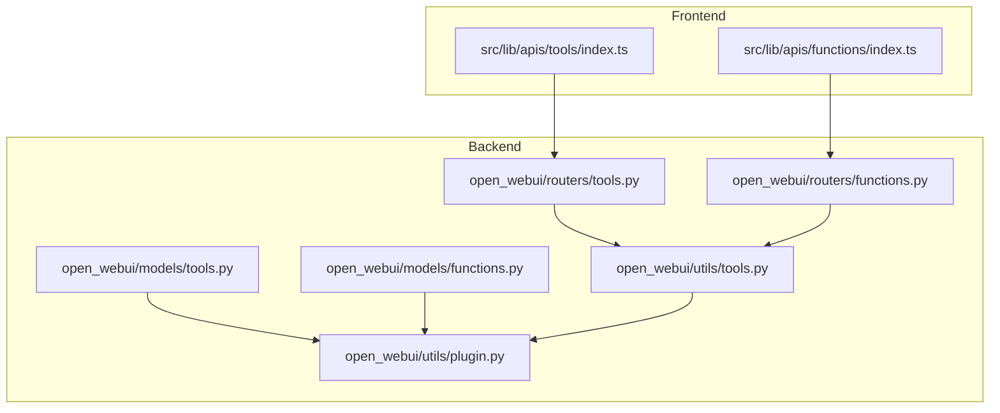
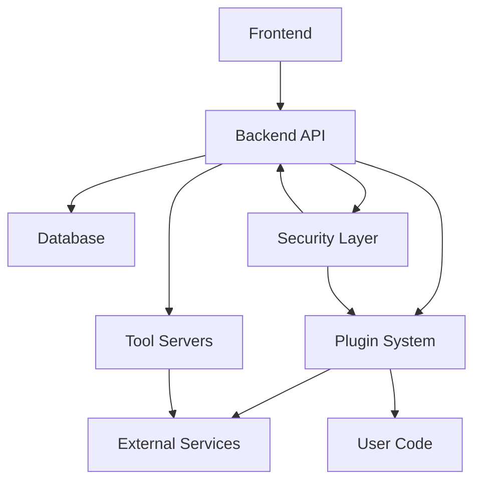
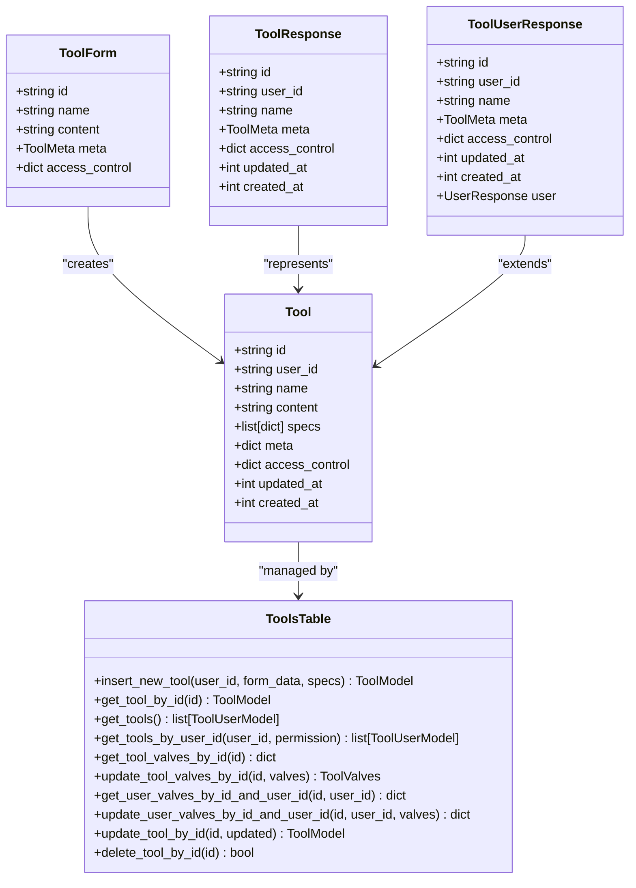
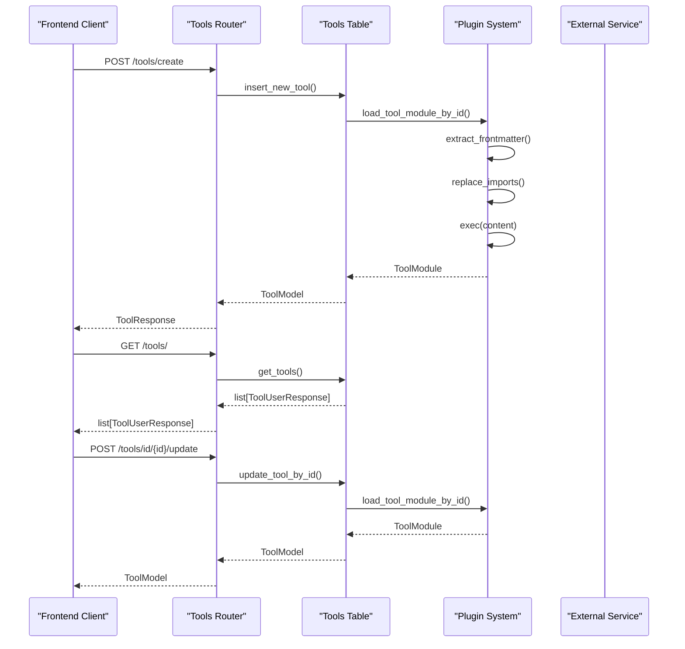
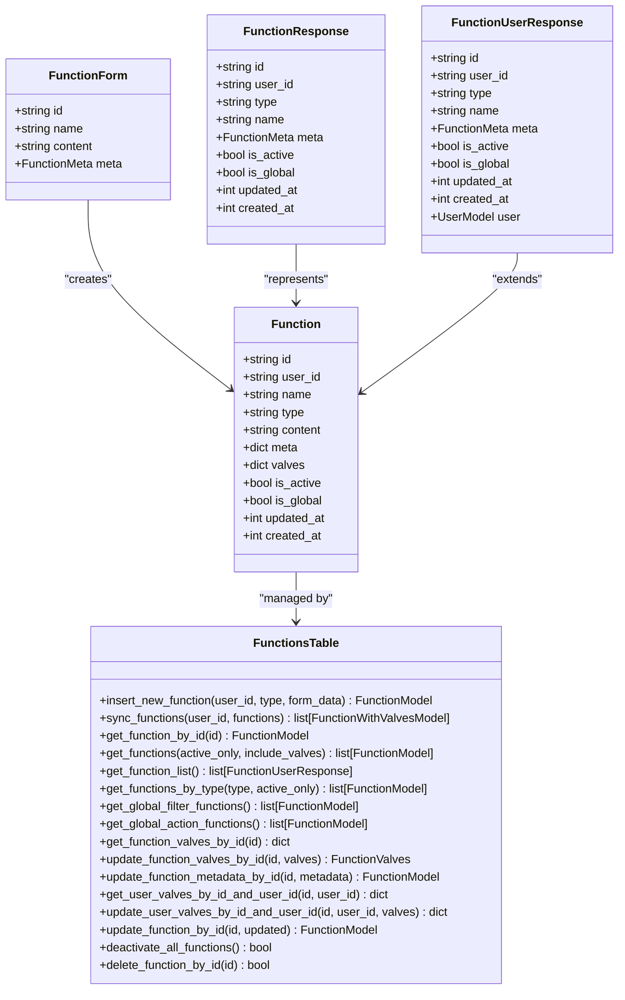
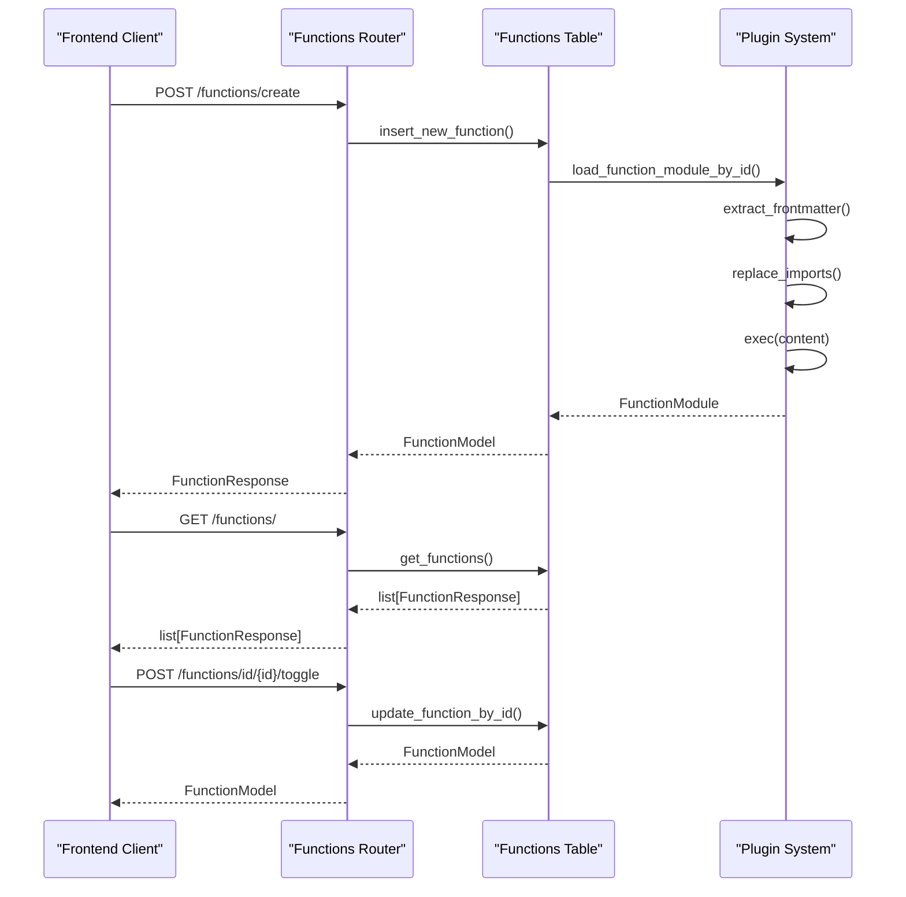
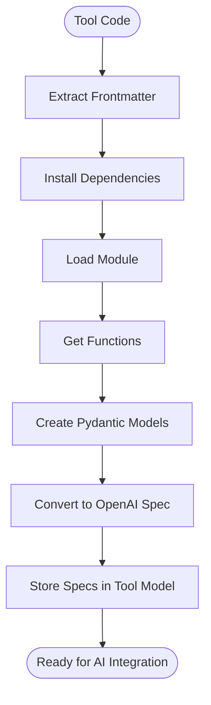
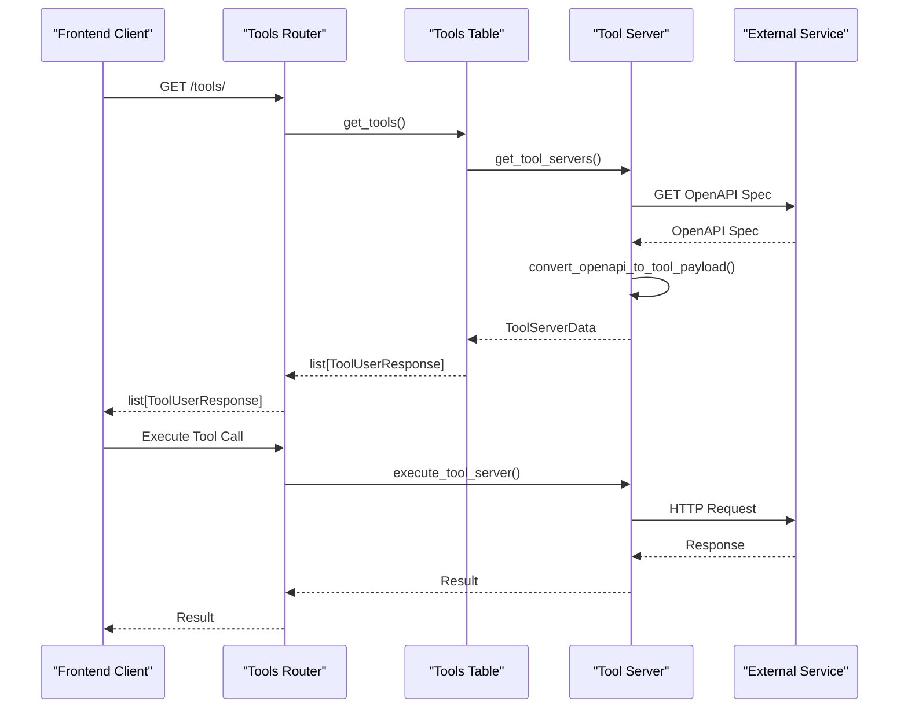
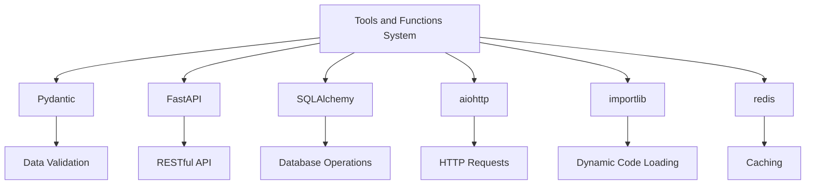

# Tool and Function API

<cite>
**Referenced Files in This Document**   
- [tools.py](file://backend/open_webui/routers/tools.py)
- [functions.py](file://backend/open_webui/routers/functions.py)
- [tools.py](file://backend/open_webui/models/tools.py)
- [functions.py](file://backend/open_webui/models/functions.py)
- [tools.py](file://backend/open_webui/utils/tools.py)
- [plugin.py](file://backend/open_webui/utils/plugin.py)
- [index.ts](file://src/lib/apis/tools/index.ts)
- [index.ts](file://src/lib/apis/functions/index.ts)
</cite>

## Table of Contents
1. [Introduction](#introduction)
2. [Project Structure](#project-structure)
3. [Core Components](#core-components)
4. [Architecture Overview](#architecture-overview)
5. [Detailed Component Analysis](#detailed-component-analysis)
6. [Dependency Analysis](#dependency-analysis)
7. [Performance Considerations](#performance-considerations)
8. [Troubleshooting Guide](#troubleshooting-guide)
9. [Conclusion](#conclusion)
10. [Appendices](#appendices) (if necessary)

## Introduction
The Open WebUI platform provides a comprehensive extensibility system through its tools and functions API. This documentation details the architecture, endpoints, and workflows for managing tools and functions within the system. The platform enables users to extend functionality through custom tools that can execute arbitrary code, call external APIs, and integrate with AI models. The system distinguishes between tools and functions, with tools focusing on external API integrations and functions providing pipeline processing capabilities. Security considerations, including sandboxing and permission controls, are integral to the design, ensuring safe execution of user-provided code.

## Project Structure
The tools and functions system is organized across multiple directories in the Open WebUI codebase. The backend contains the core implementation in the `open_webui` package, with routers handling API endpoints, models defining database schemas, and utils providing helper functions. The frontend implementation is located in the `src/lib` directory, with API clients and components for managing tools and functions. The system supports both local tools/functions and external tool servers via OpenAPI specifications.

**Diagram sources**
- [tools.py](file://backend/open_webui/routers/tools.py)
- [functions.py](file://backend/open_webui/routers/functions.py)
- [tools.py](file://backend/open_webui/models/tools.py)
- [functions.py](file://backend/open_webui/models/functions.py)
- [tools.py](file://backend/open_webui/utils/tools.py)
- [plugin.py](file://backend/open_webui/utils/plugin.py)
- [index.ts](file://src/lib/apis/tools/index.ts)
- [index.ts](file://src/lib/apis/functions/index.ts)

**Section sources**
- [tools.py](file://backend/open_webui/routers/tools.py)
- [functions.py](file://backend/open_webui/routers/functions.py)

## Core Components
The tools and functions system consists of several core components that work together to provide extensibility. The tools API allows for the creation, management, and execution of tools that can call external APIs or execute custom code. Functions provide pipeline processing capabilities with filter, action, and pipe types. The system uses a plugin architecture to load and execute user-provided code safely. Tool servers enable integration with external services via OpenAPI specifications. The frontend provides a user interface for managing tools and functions, with API clients that communicate with the backend endpoints.

**Section sources**
- [tools.py](file://backend/open_webui/routers/tools.py)
- [functions.py](file://backend/open_webui/routers/functions.py)
- [tools.py](file://backend/open_webui/models/tools.py)
- [functions.py](file://backend/open_webui/models/functions.py)

## Architecture Overview
The tools and functions system follows a modular architecture with clear separation between the frontend, backend, and data layers. The frontend provides a user interface for managing tools and functions, with API clients that communicate with the backend. The backend exposes RESTful endpoints for CRUD operations on tools and functions, with business logic implemented in the routers and models. The system uses a plugin architecture to load and execute user-provided code, with security measures to prevent unauthorized access. Tool servers enable integration with external services via OpenAPI specifications, with the system converting these specifications into tool payloads that can be executed by AI models.

**Diagram sources**
- [tools.py](file://backend/open_webui/routers/tools.py)
- [functions.py](file://backend/open_webui/routers/functions.py)
- [tools.py](file://backend/open_webui/utils/tools.py)
- [plugin.py](file://backend/open_webui/utils/plugin.py)

## Detailed Component Analysis

### Tools API Analysis
The tools API provides endpoints for managing tools, which are used to extend the functionality of the Open WebUI platform. Tools can be created from local code or external URLs, and can call external APIs or execute custom code. The API supports listing available tools, executing tool calls, and managing tool configurations. Tools are registered with the system and exposed to AI models for function calling.

#### Class Diagram for Tools System

**Diagram sources**
- [tools.py](file://backend/open_webui/models/tools.py)
- [tools.py](file://backend/open_webui/routers/tools.py)

#### Sequence Diagram for Tool Execution

**Diagram sources**
- [tools.py](file://backend/open_webui/routers/tools.py)
- [tools.py](file://backend/open_webui/models/tools.py)
- [plugin.py](file://backend/open_webui/utils/plugin.py)

### Functions API Analysis
The functions API provides endpoints for managing functions, which are used for pipeline processing in the Open WebUI platform. Functions can be of type filter, action, or pipe, and are used to process data as it flows through the system. The API supports listing available functions, creating new functions, and managing function configurations. Functions are registered with the system and can be activated or deactivated as needed.

#### Class Diagram for Functions System

**Diagram sources**
- [functions.py](file://backend/open_webui/models/functions.py)
- [functions.py](file://backend/open_webui/routers/functions.py)

#### Sequence Diagram for Function Management

**Diagram sources**
- [functions.py](file://backend/open_webui/routers/functions.py)
- [functions.py](file://backend/open_webui/models/functions.py)
- [plugin.py](file://backend/open_webui/utils/plugin.py)

### Tool and Function Comparison
The system distinguishes between tools and functions, with different use cases and implementation details. Tools are primarily used for external API integrations and arbitrary code execution, while functions are used for pipeline processing within the system. The following table summarizes the key differences:

| Feature | Tools | Functions |
|-------|-------|-----------|
| **Purpose** | External API integration, arbitrary code execution | Pipeline processing, data transformation |
| **Types** | Single type with multiple functions | Filter, Action, Pipe |
| **Execution** | Direct API calls, external service integration | Integrated into processing pipeline |
| **Configuration** | Valves, UserValves, access control | Valves, UserValves, activation state |
| **Security** | Sandboxed execution, permission controls | Sandboxed execution, permission controls |
| **API Endpoints** | /tools/* | /functions/* |
| **Frontend Components** | Tools management interface | Functions management interface |

**Diagram sources**
- [tools.py](file://backend/open_webui/models/tools.py)
- [functions.py](file://backend/open_webui/models/functions.py)

### Tool Manifests and Parameter Schemas
Tools in the Open WebUI system use manifests and parameter schemas to define their interface and capabilities. The manifest is extracted from the tool's code using frontmatter comments, and includes metadata such as the tool's name, description, and required dependencies. The parameter schema is automatically generated from the tool's functions using Pydantic models, and is converted to OpenAI function calling format for use with AI models.

#### Flowchart for Tool Manifest Processing

**Diagram sources**
- [plugin.py](file://backend/open_webui/utils/plugin.py)
- [tools.py](file://backend/open_webui/utils/tools.py)

### Tool Server Integration
The system supports integration with external tool servers via OpenAPI specifications. Tool servers can be configured with URLs to their OpenAPI specs, which are then converted into tool payloads that can be executed by AI models. The system handles authentication, parameter mapping, and response handling for tool server calls.

#### Sequence Diagram for Tool Server Integration

**Diagram sources**
- [tools.py](file://backend/open_webui/routers/tools.py)
- [tools.py](file://backend/open_webui/utils/tools.py)

## Dependency Analysis
The tools and functions system has several key dependencies that enable its functionality. The system relies on Pydantic for data validation and model creation, FastAPI for the RESTful API, and SQLAlchemy for database operations. The plugin system uses Python's importlib to dynamically load user-provided code, with security measures to prevent unauthorized access. The system also depends on aiohttp for asynchronous HTTP requests, particularly for tool server integration.

**Diagram sources**
- [tools.py](file://backend/open_webui/routers/tools.py)
- [functions.py](file://backend/open_webui/routers/functions.py)
- [tools.py](file://backend/open_webui/utils/tools.py)
- [plugin.py](file://backend/open_webui/utils/plugin.py)

## Performance Considerations
The tools and functions system is designed with performance in mind, using caching and asynchronous operations to minimize latency. Tool and function modules are cached in memory after loading to avoid repeated file I/O and code execution. The system uses asynchronous HTTP requests for tool server integration, allowing for non-blocking operations. Database queries are optimized with appropriate indexing, particularly for frequently accessed fields like tool and function IDs.

## Troubleshooting Guide
When troubleshooting issues with the tools and functions system, consider the following common problems and solutions:

1. **Tool/Function Not Loading**: Verify that the code is valid Python and that all required dependencies are specified in the frontmatter. Check the server logs for import errors.

2. **Authentication Issues with Tool Servers**: Ensure that the authentication method and credentials are correctly configured in the tool server settings.

3. **Parameter Validation Errors**: Verify that the function parameters match the schema defined in the tool's spec. Check for type mismatches or missing required parameters.

4. **Performance Issues**: Monitor the system for slow tool server responses or high CPU usage. Consider optimizing the tool code or adding caching.

5. **Security Warnings**: Always verify the trustworthiness of tools and functions before installing them, as they can execute arbitrary code.

**Section sources**
- [tools.py](file://backend/open_webui/routers/tools.py)
- [functions.py](file://backend/open_webui/routers/functions.py)
- [tools.py](file://backend/open_webui/utils/tools.py)
- [plugin.py](file://backend/open_webui/utils/plugin.py)

## Conclusion
The tools and functions API in Open WebUI provides a powerful and flexible system for extending the platform's capabilities. By allowing users to create custom tools and functions, the system enables integration with external services and custom processing pipelines. The architecture is designed with security in mind, using sandboxing and permission controls to prevent unauthorized access. The system supports both local code execution and integration with external tool servers via OpenAPI specifications, providing a comprehensive solution for AI-powered function calling. With proper implementation and security practices, the tools and functions system can significantly enhance the functionality of the Open WebUI platform.