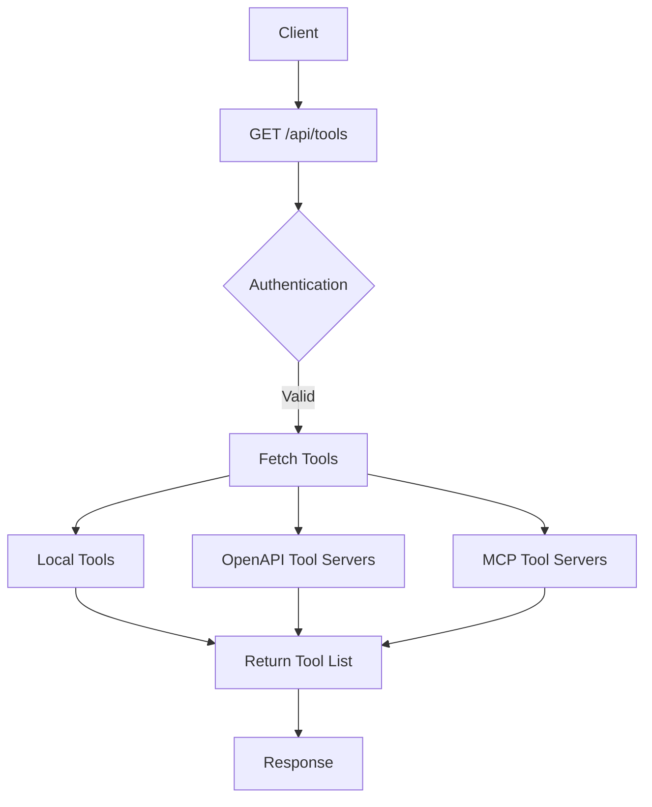
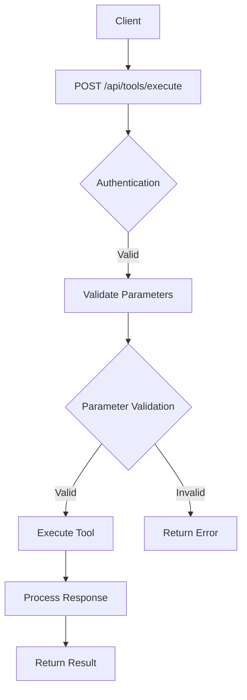
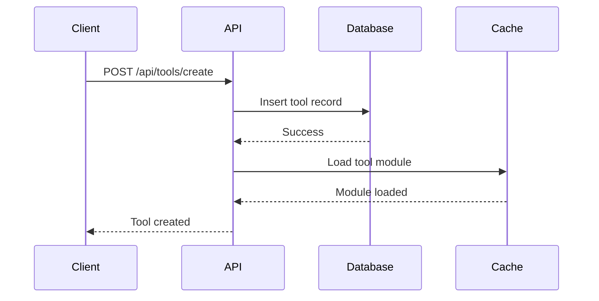
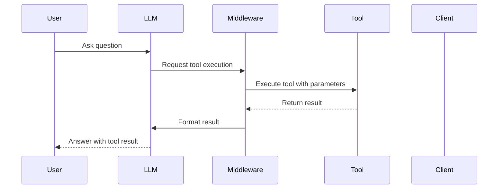

# Tools API

<cite>
**Referenced Files in This Document**   
- [tools.py](file://backend/open_webui/routers/tools.py)
- [tools.py](file://backend/open_webui/models/tools.py)
- [tools.py](file://backend/open_webui/utils/tools.py)
- [middleware.py](file://backend/open_webui/utils/middleware.py)
- [main.py](file://backend/open_webui/socket/main.py)
- [index.ts](file://src/lib/apis/tools/index.ts)
</cite>

## Table of Contents
1. [Introduction](#introduction)
2. [RESTful Endpoints](#restful-endpoints)
3. [Tool Manifest Structure](#tool-manifest-structure)
4. [Tool Registration and Discovery](#tool-registration-and-discovery)
5. [Execution Workflow](#execution-workflow)
6. [Security Considerations](#security-considerations)
7. [Error Handling](#error-handling)
8. [WebSocket Integration](#websocket-integration)
9. [Real-World Examples](#real-world-examples)
10. [Conclusion](#conclusion)

## Introduction
The Tools API provides a comprehensive interface for integrating external services and systems into the Open WebUI platform. This API enables the listing, configuration, and execution of tools that can be dynamically discovered and utilized by AI models. The system supports both local Python-based tools and external OpenAPI/MCP tool servers, offering a flexible architecture for extending functionality.

The API follows RESTful principles and provides endpoints for managing tools, their configurations, and execution. Tools can be created from GitHub repositories or direct URLs, and they support parameter validation through JSON Schema. The system also includes robust security features including access control, rate limiting, and permission scopes.

**Section sources**
- [tools.py](file://backend/open_webui/routers/tools.py#L1-L648)
- [tools.py](file://backend/open_webui/models/tools.py#L1-L275)

## RESTful Endpoints
The Tools API provides several endpoints for managing tools and their configurations:

### GET /api/tools
Retrieves a list of all available tools, including both local tools and external tool servers. The response includes tool metadata such as name, description, and access control information.



**Diagram sources**
- [tools.py](file://backend/open_webui/routers/tools.py#L55-L152)

### POST /api/tools/execute
Executes a specified tool with the provided parameters. This endpoint validates the parameters against the tool's schema before execution and returns the tool's response.



**Diagram sources**
- [middleware.py](file://backend/open_webui/utils/middleware.py#L398-L424)

### Other Endpoints
- **GET /api/tools/list**: Returns a list of tools accessible to the user
- **POST /api/tools/create**: Creates a new tool from provided code
- **GET /api/tools/id/{id}**: Retrieves details of a specific tool
- **POST /api/tools/id/{id}/update**: Updates an existing tool
- **DELETE /api/tools/id/{id}/delete**: Deletes a tool
- **GET /api/tools/id/{id}/valves**: Retrieves tool configuration valves
- **POST /api/tools/id/{id}/valves/update**: Updates tool configuration valves

**Section sources**
- [tools.py](file://backend/open_webui/routers/tools.py#L55-L648)

## Tool Manifest Structure
The tool manifest defines the structure and capabilities of a tool, including its name, description, parameters, and endpoint specifications.

### Core Properties
The tool manifest includes the following core properties:

| Property | Type | Description |
|--------|------|-------------|
| name | string | The unique identifier for the tool |
| description | string | A brief description of the tool's purpose |
| parameters | object | JSON Schema defining the tool's input parameters |
| endpoint | string | The API endpoint for tool execution |

### Parameters Schema
Tools use JSON Schema to define their parameters, ensuring type safety and validation. The schema supports various data types and validation rules:

```json
{
  "type": "object",
  "properties": {
    "query": {
      "type": "string",
      "description": "Search query text"
    },
    "max_results": {
      "type": "integer",
      "minimum": 1,
      "maximum": 100,
      "default": 10
    },
    "include_images": {
      "type": "boolean",
      "default": false
    }
  },
  "required": ["query"]
}
```

The parameters schema is automatically generated from the tool's Python function signatures and docstrings using Pydantic models.

### Endpoint Specifications
Each tool defines its endpoint specifications, including HTTP method, URL pattern, and authentication requirements. For OpenAPI-based tools, the specifications are derived from the OpenAPI document.

**Section sources**
- [tools.py](file://backend/open_webui/models/tools.py#L56-L98)
- [tools.py](file://backend/open_webui/utils/tools.py#L380-L419)

## Tool Registration and Discovery
The system supports dynamic tool registration and discovery through multiple mechanisms.

### Local Tool Registration
Local tools are registered by creating a new tool entry in the database. The tool code is stored in the database, and the tool is loaded into memory when needed.



**Diagram sources**
- [tools.py](file://backend/open_webui/routers/tools.py#L270-L333)

### External Tool Server Discovery
External tool servers are discovered through configuration entries that specify the server URL and authentication details. The system periodically fetches the OpenAPI specification from these servers and converts it into tool definitions.

```python
async def get_tool_servers(request: Request):
    # Fetch from Redis cache if available
    tool_servers = await get_tool_servers_from_cache()
    
    if not tool_servers:
        # Fetch from configured tool server connections
        tool_servers = await set_tool_servers(request)
    
    return tool_servers
```

The discovery process handles different authentication methods including bearer tokens, OAuth 2.1, and session-based authentication.

### Dynamic Manifest Loading
Tools are dynamically loaded when they are first accessed. The system uses a caching mechanism to store loaded tool modules for performance:

```python
def get_tool_module(request, tool_id, load_from_db=True):
    """
    Get the tool module by its ID.
    """
    tool_module, _ = get_tool_module_from_cache(request, tool_id, load_from_db)
    return tool_module
```

When a tool is loaded, its functions are converted to OpenAI-compatible function specifications using Pydantic models.

**Section sources**
- [tools.py](file://backend/open_webui/routers/tools.py#L42-L47)
- [tools.py](file://backend/open_webui/utils/tools.py#L438-L448)

## Execution Workflow
The tool execution workflow involves several steps from chat trigger to LLM response formatting.

### Trigger from Chat
Tool calls are triggered from chat messages when the LLM determines that a tool should be used to fulfill the user's request.



**Diagram sources**
- [middleware.py](file://backend/open_webui/utils/middleware.py#L398-L424)

### Parameter Validation
Before execution, tool parameters are validated against the tool's schema:

```python
# Validate parameters against allowed parameters
allowed_params = spec.get("parameters", {}).get("properties", {}).keys()
tool_function_params = {
    k: v
    for k, v in tool_function_params.items()
    if k in allowed_params
}
```

This ensures that only valid parameters are passed to the tool, preventing injection attacks and invalid inputs.

### Isolated Execution Context
Tools are executed in isolated contexts to prevent interference between different tool executions:

```python
async def execute_tool_server(
    url: str,
    headers: Dict[str, str],
    cookies: Dict[str, str],
    name: str,
    params: Dict[str, Any],
    server_data: Dict[str, Any],
):
    # Execute in isolated aiohttp session
    async with aiohttp.ClientSession(
        trust_env=True, 
        timeout=aiohttp.ClientTimeout(total=AIOHTTP_CLIENT_TIMEOUT)
    ) as session:
        # Execute the tool call
        pass
```

### Response Formatting
Tool responses are formatted consistently for consumption by the LLM:

```python
def process_tool_result(request, tool_function_name, tool_result, tool_type, direct_tool, metadata, user):
    # Process the tool result into a standardized format
    # Handle different result types (text, files, embeds)
    pass
```

The formatted response includes the tool result, any generated files, and metadata for citation purposes.

**Section sources**
- [middleware.py](file://backend/open_webui/utils/middleware.py#L398-L424)
- [tools.py](file://backend/open_webui/utils/tools.py#L736-L861)

## Security Considerations
The Tools API implements several security measures to protect against common vulnerabilities.

### Input Sanitization
All tool inputs are validated against JSON Schema definitions to prevent injection attacks and ensure data integrity:

```python
# Filter parameters to only include allowed ones
allowed_params = spec.get("parameters", {}).get("properties", {}).keys()
tool_function_params = {
    k: v
    for k, v in tool_function_params.items()
    if k in allowed_params
}
```

This prevents unauthorized parameters from being passed to tools.

### Rate Limiting
The system implements rate limiting to prevent abuse of tool endpoints. While the specific implementation details are not visible in the provided code, the architecture supports rate limiting through configuration.

### Permission Scopes
Tools support fine-grained permission scopes through access control lists:

```python
class Tool(Base):
    # ... other fields
    access_control = Column(JSON, nullable=True)
    # Defines access control rules for this entry.
    # - `None`: Public access, available to all users with the "user" role.
    # - `{}`: Private access, restricted exclusively to the owner.
    # - Custom permissions: Specific access control for reading and writing;
```

Access control can be defined at the group or user level, allowing for flexible sharing policies.

### Authentication Mechanisms
The API supports multiple authentication mechanisms:

- **Bearer Tokens**: Standard token-based authentication
- **OAuth 2.1**: For external tool servers requiring OAuth
- **Session-based**: Using existing session cookies
- **System OAuth**: For internal system integrations

**Section sources**
- [tools.py](file://backend/open_webui/models/tools.py#L35-L50)
- [tools.py](file://backend/open_webui/routers/tools.py#L98-L137)

## Error Handling
The system implements comprehensive error handling for various failure scenarios.

### Timeout Handling
Tool executions are subject to timeout limits to prevent hanging requests:

```python
async def execute_tool_server(
    # ... parameters
):
    try:
        timeout = aiohttp.ClientTimeout(total=AIOHTTP_CLIENT_TIMEOUT_TOOL_SERVER_DATA)
        async with aiohttp.ClientSession(timeout=timeout, trust_env=True) as session:
            # Execute the request
            pass
    except Exception as err:
        error = str(err)
        log.exception(f"API Request Error: {error}")
        return ({"error": error}, None)
```

### Invalid Parameters
When invalid parameters are provided, the system returns appropriate error responses:

```python
if not form_data.id.isidentifier():
    raise HTTPException(
        status_code=status.HTTP_400_BAD_REQUEST,
        detail="Only alphanumeric characters and underscores are allowed in the id",
    )
```

### Service Unavailability
When external services are unavailable, the system gracefully handles the error:

```python
async def get_tool_server_data(url: str, headers: Optional[dict]) -> Dict[str, Any]:
    try:
        async with session.get(url, headers=_headers) as response:
            if response.status != 200:
                error_body = await response.json()
                raise Exception(error_body)
    except Exception as err:
        log.exception(f"Could not fetch tool server spec from {url}")
        raise Exception(str(err))
```

The error responses include descriptive messages to help with debugging while avoiding exposure of sensitive information.

**Section sources**
- [tools.py](file://backend/open_webui/utils/tools.py#L590-L634)
- [tools.py](file://backend/open_webui/routers/tools.py#L200-L241)

## WebSocket Integration
The system supports WebSocket integration for real-time communication and long-running tool executions.

### Connection Establishment
WebSocket connections are established through the socket.io framework:

```python
@sio.event
async def connect(sid, environ, auth):
    user = None
    if auth and "token" in auth:
        data = decode_token(auth["token"])
        if data is not None and "id" in data:
            user = Users.get_user_by_id(data["id"])
        if user:
            SESSION_POOL[sid] = user.model_dump()
            await sio.enter_room(sid, f"user:{user.id}")
```

### Real-Time Updates
The system uses WebSockets to provide real-time updates during tool execution:

```python
async def emit_to_users(event: str, data: dict, user_ids: list[str]):
    """
    Send a message to specific users using their user:{id} rooms.
    """
    try:
        for user_id in user_ids:
            await sio.emit(event, data, room=f"user:{user_id}")
    except Exception as e:
        log.debug(f"Failed to emit event {event} to users {user_ids}: {e}")
```

### Long-Running Executions
For long-running tool executions, the WebSocket connection allows for progress updates and cancellation:

```python
@router.post("/id/{id}/valves/update", response_model=Optional[dict])
async def update_tools_valves_by_id(
    request: Request, id: str, form_data: dict, user=Depends(get_verified_user)
):
    # Update tool configuration
    # WebSocket can be used to notify clients of configuration changes
    pass
```

The WebSocket integration enables real-time collaboration and monitoring of tool executions.

**Section sources**
- [main.py](file://backend/open_webui/socket/main.py#L303-L316)
- [main.py](file://backend/open_webui/socket/main.py#L256-L270)

## Real-World Examples
The system includes several real-world examples of tool integrations.

### Web Search Integrations
The platform supports web search integrations with services like Tavily and SerpAPI:

```python
# Example of web search tool usage
async def chat_web_search_handler(
    request: Request, form_data: dict, extra_params: dict, user
):
    # Generate search queries based on user message
    queries = await generate_queries(request, form_data, user)
    
    # Execute web search with the generated queries
    results = await process_web_search(request, SearchForm(queries=queries), user)
    
    # Return results for LLM processing
    return form_data
```

These integrations allow the AI to search the web for up-to-date information when responding to user queries.

### Document Processing Services
The system supports document processing services for handling various file types:

```python
# Document processing is handled through file handlers
if hasattr(module, "file_handler") and module.file_handler:
    # Process the document using the tool's file handler
    pass
```

Document processing tools can extract text, analyze content, and generate summaries from uploaded files.

### Code Execution
The platform includes code execution capabilities for running Python code:

```python
# Code interpreter functionality
async def execute_python_code(code: str, variables: dict = None):
    # Execute Python code in a sandboxed environment
    # Return the output and any generated files
    pass
```

This allows for dynamic code execution in response to user requests, with appropriate security sandboxing.

**Section sources**
- [tools.py](file://backend/open_webui/utils/tools.py#L556-L712)
- [tools.py](file://backend/open_webui/routers/tools.py#L197-L241)

## Conclusion
The Tools API provides a robust framework for integrating external services and systems into the Open WebUI platform. By supporting both local Python tools and external OpenAPI/MCP tool servers, the API offers flexibility for various integration scenarios. The system's architecture emphasizes security, with comprehensive input validation, access control, and error handling.

The dynamic manifest loading and discovery mechanism allows for seamless integration of new tools without requiring platform restarts. The execution workflow ensures that tool calls are properly validated and executed in isolated contexts, maintaining system stability.

WebSocket integration enables real-time communication and monitoring of long-running tool executions, enhancing the user experience. The comprehensive error handling ensures that failures are gracefully managed and communicated to users.

Overall, the Tools API provides a powerful foundation for extending the capabilities of the Open WebUI platform through external service integration.

**Section sources**
- [tools.py](file://backend/open_webui/routers/tools.py#L1-L648)
- [tools.py](file://backend/open_webui/models/tools.py#L1-L275)
- [tools.py](file://backend/open_webui/utils/tools.py#L1-L861)