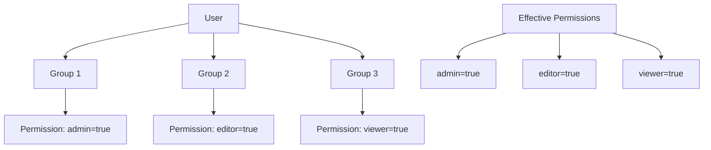
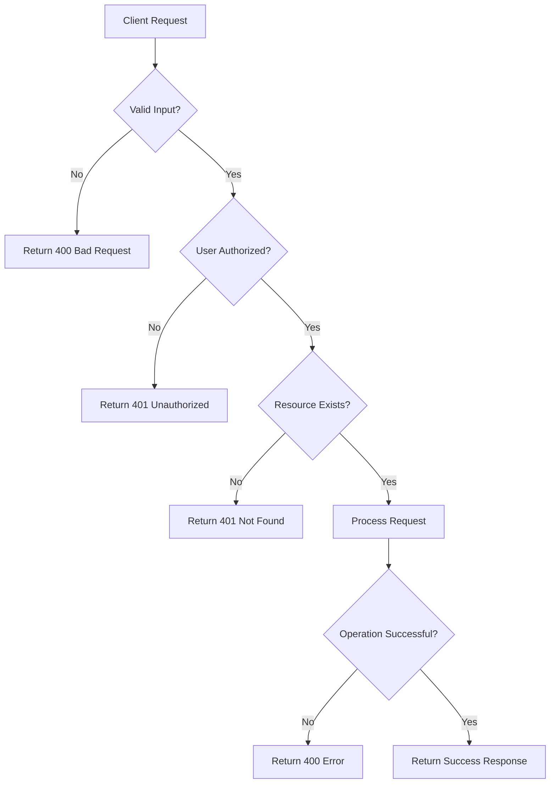
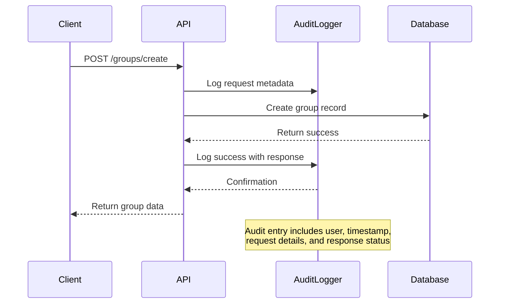

# Group Management

<cite>
**Referenced Files in This Document**   
- [groups.py](file://backend/open_webui/routers/groups.py)
- [groups.py](file://backend/open_webui/models/groups.py)
- [access_control.py](file://backend/open_webui/utils/access_control.py)
- [audit.py](file://backend/open_webui/utils/audit.py)
- [index.ts](file://src/lib/apis/groups/index.ts)
</cite>

## Table of Contents
1. [Introduction](#introduction)
2. [API Endpoints](#api-endpoints)
3. [Request/Response Schemas](#requestresponse-schemas)
4. [Group Membership Model](#group-membership-model)
5. [Permission Inheritance](#permission-inheritance)
6. [Usage Examples](#usage-examples)
7. [Validation Rules and Error Handling](#validation-rules-and-error-handling)
8. [Access Control](#access-control)
9. [Audit Logging](#audit-logging)

## Introduction
The Group Management API provides comprehensive functionality for managing user groups within the system. This includes creating and deleting groups, adding and removing users from groups, retrieving group memberships, and updating group settings. The API supports administrative operations for managing group-based access control and permissions. All endpoints require authentication and are restricted to admin users, ensuring secure management of group resources.

## API Endpoints

### GET /api/v1/groups/
Retrieve a list of all groups. Non-admin users can only see groups they are members of.

**Parameters:**
- `share` (boolean, optional): Filter groups by share status

**HTTP Method:** GET  
**Authentication Required:** Yes  
**Access Control:** Admin users can see all groups; non-admin users can only see groups they belong to

**Section sources**
- [groups.py](file://backend/open_webui/routers/groups.py#L33-L45)

### POST /api/v1/groups/create
Create a new group with specified name, description, permissions, and data.

**HTTP Method:** POST  
**Authentication Required:** Yes  
**Access Control:** Admin users only

**Section sources**
- [groups.py](file://backend/open_webui/routers/groups.py#L53-L72)

### GET /api/v1/groups/id/{id}
Retrieve a specific group by ID.

**HTTP Method:** GET  
**Authentication Required:** Yes  
**Access Control:** Admin users only

**Section sources**
- [groups.py](file://backend/open_webui/routers/groups.py#L80-L92)

### GET /api/v1/groups/id/{id}/export
Export a specific group with its member list.

**HTTP Method:** GET  
**Authentication Required:** Yes  
**Access Control:** Admin users only

**Section sources**
- [groups.py](file://backend/open_webui/routers/groups.py#L105-L118)

### POST /api/v1/groups/id/{id}/update
Update an existing group's settings.

**HTTP Method:** POST  
**Authentication Required:** Yes  
**Access Control:** Admin users only

**Section sources**
- [groups.py](file://backend/open_webui/routers/groups.py#L144-L165)

### POST /api/v1/groups/id/{id}/users/add
Add users to a group.

**HTTP Method:** POST  
**Authentication Required:** Yes  
**Access Control:** Admin users only

**Section sources**
- [groups.py](file://backend/open_webui/routers/groups.py#L173-L197)

### POST /api/v1/groups/id/{id}/users/remove
Remove users from a group.

**HTTP Method:** POST  
**Authentication Required:** Yes  
**Access Control:** Admin users only

**Section sources**
- [groups.py](file://backend/open_webui/routers/groups.py#L200-L221)

### DELETE /api/v1/groups/id/{id}/delete
Delete a group by ID.

**HTTP Method:** DELETE  
**Authentication Required:** Yes  
**Access Control:** Admin users only

**Section sources**
- [groups.py](file://backend/open_webui/routers/groups.py#L229-L245)

## Request/Response Schemas

### GroupForm (Request Schema)
```json
{
  "name": "string",
  "description": "string",
  "permissions": {
    "property1": {},
    "property2": {}
  },
  "data": {
    "property1": {},
    "property2": {}
  }
}
```

**Field Definitions:**
- `name`: The name of the group (required)
- `description`: A description of the group (required)
- `permissions`: Optional JSON object containing permission settings
- `data`: Optional JSON object containing additional group data

**Section sources**
- [groups.py](file://backend/open_webui/models/groups.py#L103-L108)

### GroupResponse (Response Schema)
```json
{
  "id": "string",
  "user_id": "string",
  "name": "string",
  "description": "string",
  "data": {
    "property1": {},
    "property2": {}
  },
  "meta": {
    "property1": {},
    "property2": {}
  },
  "permissions": {
    "property1": {},
    "property2": {}
  },
  "created_at": 0,
  "updated_at": 0,
  "member_count": 0
}
```

**Field Definitions:**
- `id`: Unique identifier for the group
- `user_id`: ID of the user who created the group
- `name`: The name of the group
- `description`: A description of the group
- `data`: Additional group data stored as JSON
- `meta`: Metadata stored as JSON
- `permissions`: Permission settings stored as JSON
- `created_at`: Timestamp of group creation (epoch)
- `updated_at`: Timestamp of last update (epoch)
- `member_count`: Number of users in the group

**Section sources**
- [groups.py](file://backend/open_webui/models/groups.py#L99-L101)

### UserIdsForm (Request Schema)
```json
{
  "user_ids": ["string"]
}
```

**Field Definitions:**
- `user_ids`: Array of user IDs to add or remove from a group

**Section sources**
- [groups.py](file://backend/open_webui/models/groups.py#L110-L112)

### GroupExportResponse (Response Schema)
```json
{
  "id": "string",
  "user_id": "string",
  "name": "string",
  "description": "string",
  "data": {
    "property1": {},
    "property2": {}
  },
  "meta": {
    "property1": {},
    "property2": {}
  },
  "permissions": {
    "property1": {},
    "property2": {}
  },
  "created_at": 0,
  "updated_at": 0,
  "member_count": 0,
  "user_ids": ["string"]
}
```

**Field Definitions:**
- All fields from GroupResponse plus:
- `user_ids`: Array of user IDs that are members of the group

**Section sources**
- [groups.py](file://backend/open_webui/routers/groups.py#L100-L102)

## Group Membership Model
The group membership model uses a many-to-many relationship between users and groups, implemented through a dedicated `group_member` table. This design allows users to belong to multiple groups and groups to contain multiple users.

The `group_member` table has the following structure:
- `id`: Unique identifier for the membership record
- `group_id`: Foreign key referencing the group
- `user_id`: Foreign key referencing the user
- `created_at`: Timestamp when the membership was created
- `updated_at`: Timestamp of the last update to the membership

This model supports efficient querying of group memberships and user group affiliations. When a user is added to a group, a new record is created in the `group_member` table. When a user is removed from a group, the corresponding record is deleted.

The model also includes cascading deletes, meaning that when a group is deleted, all associated membership records are automatically removed. Similarly, when a user is deleted, all their group memberships are removed.

**Section sources**
- [groups.py](file://backend/open_webui/models/groups.py#L72-L84)
- [37f288994c47_add_group_member_table.py](file://backend/open_webui/migrations/versions/37f288994c47_add_group_member_table.py#L27-L45)

## Permission Inheritance
Permissions in the system are inherited through group membership. When a user belongs to one or more groups, their effective permissions are calculated by combining the permissions from all their groups.

The permission inheritance model follows these rules:
1. Permissions are stored as JSON objects in the `permissions` field of the group model
2. When multiple groups define the same permission, the most permissive value is used (True takes precedence over False)
3. Permissions are hierarchical and can be nested using dot notation (e.g., "admin.users.create")
4. If a permission is not defined in any group, the system falls back to default permissions

The permission system uses a "union" approach where permissions from all groups are combined. This means that if any group grants a permission, the user has that permission. There is no concept of permission denial at the group level - groups can only grant permissions, not restrict them.



**Diagram sources**
- [access_control.py](file://backend/open_webui/utils/access_control.py#L38-L54)
- [groups.py](file://backend/open_webui/models/groups.py#L48)

**Section sources**
- [access_control.py](file://backend/open_webui/utils/access_control.py#L28-L68)

## Usage Examples

### Creating a New Group
```javascript
import { createNewGroup } from '$lib/apis/groups/index';

const newGroup = {
  name: "Data Science Team",
  description: "Team for data science projects",
  permissions: {
    "admin": true,
    "models": {
      "create": true,
      "delete": false
    }
  },
  data: {
    "department": "Analytics",
    "budget": 10000
  }
};

try {
  const result = await createNewGroup(token, newGroup);
  console.log("Group created:", result);
} catch (error) {
  console.error("Error creating group:", error);
}
```

**Section sources**
- [index.ts](file://src/lib/apis/groups/index.ts#L3-L32)
- [groups.py](file://backend/open_webui/routers/groups.py#L53-L72)

### Assigning Users to a Group
```javascript
import { addUserToGroup } from '$lib/apis/groups/index';

const userIds = ["user123", "user456", "user789"];

try {
  const result = await addUserToGroup(token, "group987", userIds);
  console.log("Users added to group:", result);
} catch (error) {
  console.error("Error adding users to group:", error);
}
```

**Section sources**
- [index.ts](file://src/lib/apis/groups/index.ts#L169-L202)
- [groups.py](file://backend/open_webui/routers/groups.py#L173-L197)

### Retrieving All Groups a User Belongs To
```javascript
import { getGroups } from '$lib/apis/groups/index';

try {
  // For admin users - get all groups
  const allGroups = await getGroups(adminToken);
  console.log("All groups:", allGroups);
  
  // For regular users - get only groups they belong to
  const userGroups = await getGroups(userToken);
  console.log("User's groups:", userGroups);
  
  // Filter by share status
  const sharedGroups = await getGroups(adminToken, true);
  console.log("Shared groups:", sharedGroups);
} catch (error) {
  console.error("Error retrieving groups:", error);
}
```

**Section sources**
- [index.ts](file://src/lib/apis/groups/index.ts#L34-L68)
- [groups.py](file://backend/open_webui/routers/groups.py#L33-L45)

## Validation Rules and Error Handling

### Validation Rules
- Group names must be unique across the system
- Group names and descriptions are required fields
- User IDs must exist in the system when adding users to groups
- The maximum length for group names and descriptions is not explicitly defined but is limited by the database schema (Text field)
- There is no explicit limit on the number of members in a group

### Error Handling
The API implements comprehensive error handling for various scenarios:

**Duplicate Group Names:**
When attempting to create a group with a name that already exists, the system will return a 400 Bad Request error with a message indicating the error occurred during group creation.

**Non-existent User IDs:**
When adding users to a group, the system validates user IDs through the `Users.get_valid_user_ids()` method. Invalid user IDs are filtered out, and only valid users are added to the group.

**Group Not Found:**
When attempting to access, update, or delete a non-existent group, the API returns a 401 Unauthorized error with the message "Not found".

**Permission Errors:**
Non-admin users attempting to access admin-only endpoints will receive a 401 Unauthorized response.

**Database Errors:**
All database operations are wrapped in try-catch blocks. If a database operation fails, the system returns a 400 Bad Request error with an appropriate message.



**Diagram sources**
- [groups.py](file://backend/open_webui/routers/groups.py#L53-L72)
- [groups.py](file://backend/open_webui/routers/groups.py#L80-L92)
- [groups.py](file://backend/open_webui/routers/groups.py#L229-L245)

**Section sources**
- [groups.py](file://backend/open_webui/routers/groups.py#L53-L72)
- [groups.py](file://backend/open_webui/routers/groups.py#L80-L92)
- [groups.py](file://backend/open_webui/routers/groups.py#L229-L245)

## Access Control
The group management system implements strict access control to ensure that only authorized users can perform administrative operations.

### Admin-Only Access
All group management endpoints require admin privileges. The `get_admin_user` dependency is used to verify that the authenticated user has admin role:

```python
@router.post("/create", response_model=Optional[GroupResponse])
async def create_new_group(form_data: GroupForm, user=Depends(get_admin_user)):
```

### Role-Based Permissions
The system distinguishes between admin and non-admin users:
- Admin users can create, read, update, and delete any group
- Non-admin users can only view groups they belong to via the GET /groups/ endpoint
- All other operations are restricted to admin users

### Default Group Assignment
The system supports automatic assignment of users to default groups through the `apply_default_group_assignment` function:

```python
def apply_default_group_assignment(
    default_group_id: str,
    user_id: str,
) -> None:
    """
    Apply default group assignment to a user if default_group_id is provided.
    """
    if default_group_id:
        try:
            Groups.add_users_to_group(default_group_id, [user_id])
        except Exception as e:
            log.error(
                f"Failed to add user {user_id} to default group {default_group_id}: {e}"
            )
```

**Section sources**
- [groups.py](file://backend/open_webui/routers/groups.py#L54)
- [groups.py](file://backend/open_webui/routers/groups.py#L81)
- [groups.py](file://backend/open_webui/routers/groups.py#L230)
- [groups.py](file://backend/open_webui/utils/groups.py#L7-L25)

## Audit Logging
All group management operations are subject to audit logging to provide a complete record of administrative activities.

### Audit Level Configuration
The system supports different audit levels:
- NONE: No audit logging
- METADATA: Log basic request metadata
- REQUEST: Log request metadata and body
- REQUEST_RESPONSE: Log request metadata, body, and response

### Logged Information
For each audited operation, the system logs:
- User information (ID, name, email, role)
- HTTP method (verb)
- Request URI
- Source IP address
- User agent
- Timestamp
- Request and response bodies (depending on audit level)

### Sensitive Data Redaction
The audit system automatically redacts sensitive information such as passwords from logged request bodies:

```python
# Redact sensitive information
if "password" in request_body:
    request_body = re.sub(
        r'"password":\s*"(.*?)"',
        '"password": "********"',
        request_body,
    )
```

### Automatic Auditing
The following operations are automatically audited:
- Creating a new group
- Updating a group
- Adding users to a group
- Removing users from a group
- Deleting a group

Authentication endpoints are also always logged regardless of the audit level setting.



**Diagram sources**
- [audit.py](file://backend/open_webui/utils/audit.py#L121-L284)
- [groups.py](file://backend/open_webui/routers/groups.py#L53-L72)

**Section sources**
- [audit.py](file://backend/open_webui/utils/audit.py#L121-L284)
- [groups.py](file://backend/open_webui/routers/groups.py#L53-L72)