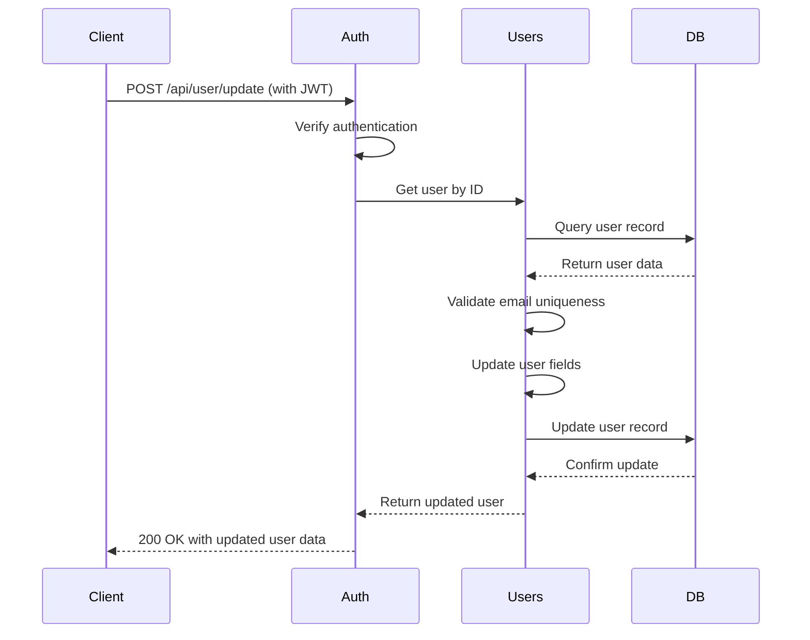
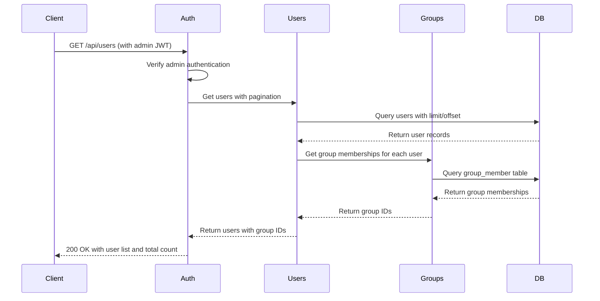
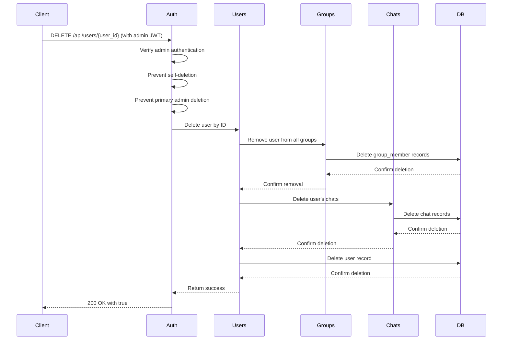
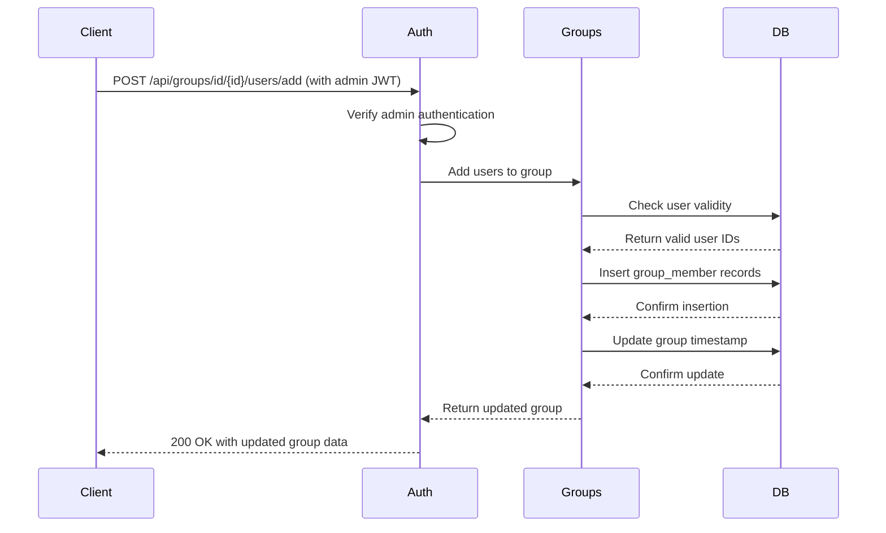
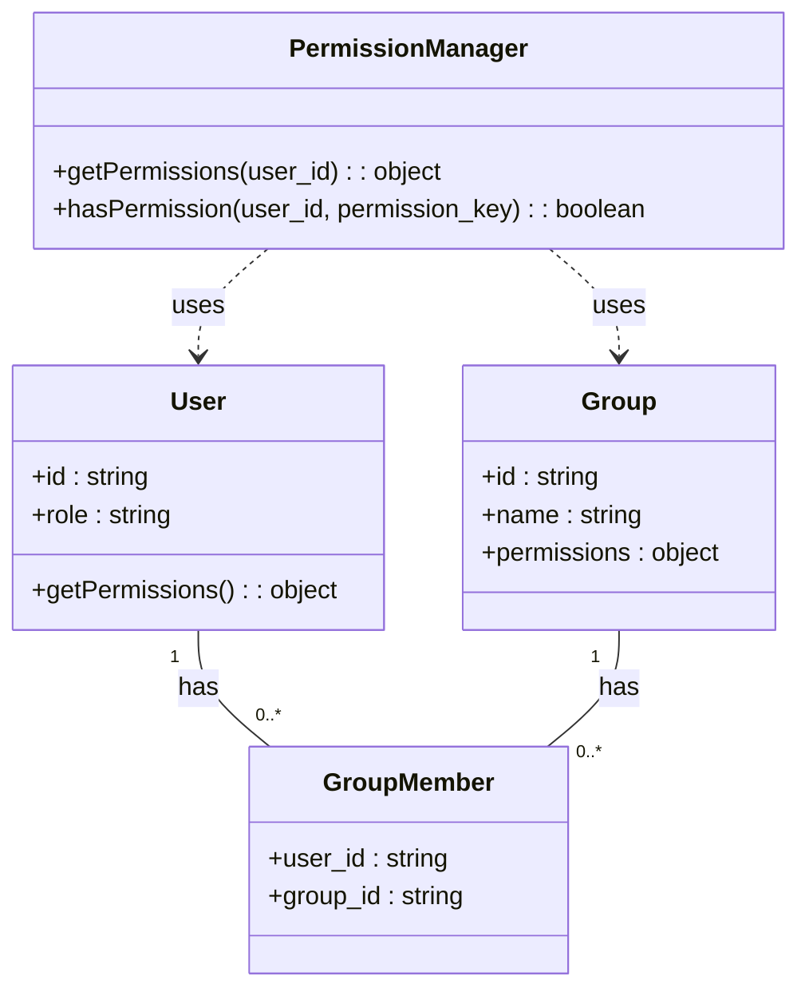

# User Management API

<cite>
**Referenced Files in This Document**   
- [users.py](file://backend/open_webui/routers/users.py)
- [groups.py](file://backend/open_webui/routers/groups.py)
- [users.py](file://backend/open_webui/models/users.py)
- [groups.py](file://backend/open_webui/models/groups.py)
- [auth.py](file://backend/open_webui/utils/auth.py)
- [access_control.py](file://backend/open_webui/utils/access_control.py)
- [constants.py](file://backend/open_webui/constants.py)
- [config.py](file://backend/open_webui/config.py)
</cite>

## Table of Contents
1. [Introduction](#introduction)
2. [User Data Model](#user-data-model)
3. [Group Data Model](#group-data-model)
4. [User Profile Management](#user-profile-management)
5. [User Listing (Admin)](#user-listing-admin)
6. [User Deletion](#user-deletion)
7. [Group Operations](#group-operations)
8. [Role-Based Access Control](#role-based-access-control)
9. [Authentication Requirements](#authentication-requirements)
10. [Error Handling](#error-handling)
11. [Data Validation](#data-validation)
12. [Privacy Considerations](#privacy-considerations)

## Introduction
The User Management API provides comprehensive functionality for managing users and groups within the Open WebUI system. This API enables administrators to manage user profiles, list and search users, delete users, and manage group operations including creating groups, assigning users to groups, and managing group permissions. The system implements a robust role-based access control mechanism with support for admin and regular user roles, along with group-based permission inheritance.

The API follows RESTful principles with clear endpoints for each operation, using standard HTTP methods and status codes. Authentication is required for all endpoints, with role-based access control determining which operations a user can perform. The system supports both JWT tokens and API keys for authentication, with admin privileges required for most management operations.

This documentation details all endpoints for user and group management, including request/response schemas, authentication requirements, and error conditions.

**Section sources**
- [users.py](file://backend/open_webui/routers/users.py#L1-L621)
- [groups.py](file://backend/open_webui/routers/groups.py#L1-L246)

## User Data Model

The user data model defines the structure and attributes of a user within the system. Each user has a comprehensive set of profile fields that can be managed through the API.

### User Attributes
The User model contains the following attributes:

| Attribute | Type | Description | Required |
|---------|------|-------------|----------|
| id | string | Unique identifier for the user | Yes |
| email | string | User's email address | Yes |
| username | string | User's username (optional) | No |
| role | string | User's role (admin, user, pending) | Yes |
| name | string | User's display name | Yes |
| profile_image_url | string | URL to the user's profile image | Yes |
| profile_banner_image_url | string | URL to the user's profile banner image | No |
| bio | string | User's biography or description | No |
| gender | string | User's gender information | No |
| date_of_birth | date | User's date of birth | No |
| timezone | string | User's timezone preference | No |
| presence_state | string | User's presence state (online, offline, etc.) | No |
| status_emoji | string | Emoji representing user's current status | No |
| status_message | string | Text message describing user's current status | No |
| status_expires_at | integer | Timestamp when status expires (epoch) | No |
| info | object | Additional user information stored as JSON | No |
| settings | object | User settings stored as JSON | No |
| oauth | object | OAuth provider information stored as JSON | No |
| last_active_at | integer | Timestamp of last activity (epoch) | Yes |
| updated_at | integer | Timestamp of last update (epoch) | Yes |
| created_at | integer | Timestamp of creation (epoch) | Yes |

### User Status
The system tracks user activity and presence through several status-related fields:
- **last_active_at**: Updated when a user interacts with the system, used to determine active status
- **presence_state**: Current presence state of the user
- **status_emoji** and **status_message**: Custom status information set by the user
- **status_expires_at**: Optional timestamp when the custom status should expire

The system considers a user "active" if their last_active_at timestamp is within the last 3 minutes.

**Section sources**
- [users.py](file://backend/open_webui/models/users.py#L45-L75)
- [users.py](file://backend/open_webui/models/users.py#L105-L107)

## Group Data Model

The group data model defines the structure and relationships for user groups within the system. Groups serve as a mechanism for organizing users and managing permissions collectively.

### Group Attributes
The Group model contains the following attributes:

| Attribute | Type | Description | Required |
|---------|------|-------------|----------|
| id | string | Unique identifier for the group | Yes |
| user_id | string | ID of the user who created the group | Yes |
| name | string | Name of the group | Yes |
| description | string | Description of the group | Yes |
| data | object | Additional group data stored as JSON | No |
| meta | object | Metadata about the group stored as JSON | No |
| permissions | object | Group permissions stored as JSON | No |
| created_at | integer | Timestamp of creation (epoch) | Yes |
| updated_at | integer | Timestamp of last update (epoch) | Yes |

### Group Membership
The GroupMember model manages the many-to-many relationship between users and groups:

| Attribute | Type | Description | Required |
|---------|------|-------------|----------|
| id | string | Unique identifier for the membership | Yes |
| group_id | string | ID of the associated group | Yes |
| user_id | string | ID of the associated user | Yes |
| created_at | integer | Timestamp of membership creation (epoch) | No |
| updated_at | integer | Timestamp of last membership update (epoch) | No |

### Permission Inheritance
Groups support permission inheritance through the permissions field, which contains a hierarchical JSON structure defining what actions members of the group can perform. When a user belongs to multiple groups, their effective permissions are the union of all group permissions, with the most permissive value taking precedence (True > False).

The permission system supports hierarchical keys separated by dots (e.g., "features.api_keys", "chat.controls"), allowing for fine-grained control over system functionality.

**Section sources**
- [groups.py](file://backend/open_webui/models/groups.py#L36-L52)
- [groups.py](file://backend/open_webui/models/groups.py#L72-L83)
- [access_control.py](file://backend/open_webui/utils/access_control.py#L28-L68)

## User Profile Management

The User Profile Management API provides endpoints for users to manage their own profile information and for administrators to manage user profiles.

### Update User Profile
Allows a user to update their own profile information.



**Diagram sources**
- [users.py](file://backend/open_webui/routers/users.py#L496-L570)

#### Endpoint
- **URL**: `/api/user/{user_id}/update`
- **Method**: POST
- **Authentication**: Required (admin role required for updating other users)
- **Content-Type**: application/json

#### Request Body
```json
{
  "role": "string",
  "name": "string",
  "email": "string",
  "profile_image_url": "string",
  "password": "string"
}
```

#### Parameters
| Field | Type | Description | Required |
|------|------|-------------|----------|
| role | string | User role (admin, user, pending) | No |
| name | string | User's display name | Yes |
| email | string | User's email address | Yes |
| profile_image_url | string | URL to profile image | Yes |
| password | string | User's password (optional) | No |

#### Response
- **200 OK**: Returns updated user object
- **400 Bad Request**: Invalid input or email already taken
- **403 Forbidden**: Insufficient permissions
- **404 Not Found**: User not found

**Section sources**
- [users.py](file://backend/open_webui/routers/users.py#L496-L570)

### Get User Profile
Retrieves a user's profile information.

#### Endpoint
- **URL**: `/api/user/{user_id}`
- **Method**: GET
- **Authentication**: Required (user can view own profile, admin can view any profile)
- **Content-Type**: application/json

#### Response
Returns a UserActiveResponse object containing all user profile fields plus active status.

**Section sources**
- [users.py](file://backend/open_webui/routers/users.py#L399-L428)

## User Listing (Admin)

The User Listing API provides administrative functionality for listing and searching users in the system.

### List All Users
Retrieves a paginated list of all users in the system.



**Diagram sources**
- [users.py](file://backend/open_webui/routers/users.py#L57-L96)

#### Endpoint
- **URL**: `/api/users`
- **Method**: GET
- **Authentication**: Required (admin role)
- **Content-Type**: application/json

#### Query Parameters
| Parameter | Type | Description | Required |
|---------|------|-------------|----------|
| query | string | Search term for name or email | No |
| order_by | string | Field to order by (name, email, created_at, etc.) | No |
| direction | string | Sort direction (asc, desc) | No |
| page | integer | Page number (1-indexed) | No |

#### Response
Returns a UserGroupIdsListResponse object containing:
- **users**: Array of UserGroupIdsModel objects (user data plus group_ids array)
- **total**: Total number of users matching the filter

**Section sources**
- [users.py](file://backend/open_webui/routers/users.py#L57-L96)

### Search Users
Allows authenticated users to search for other users by name or email.

#### Endpoint
- **URL**: `/api/users/search`
- **Method**: GET
- **Authentication**: Required (any authenticated user)
- **Content-Type**: application/json

#### Query Parameters
Same as List All Users endpoint.

#### Response
Returns a UserInfoListResponse object with users matching the search criteria.

**Section sources**
- [users.py](file://backend/open_webui/routers/users.py#L106-L132)

## User Deletion

The User Deletion API provides functionality for administrators to remove users from the system.

### Delete User
Removes a user from the system, including all associated data.



**Diagram sources**
- [users.py](file://backend/open_webui/routers/users.py#L578-L611)

#### Endpoint
- **URL**: `/api/users/{user_id}`
- **Method**: DELETE
- **Authentication**: Required (admin role)
- **Content-Type**: application/json

#### Response
- **200 OK**: Returns `true` on successful deletion
- **403 Forbidden**: Attempting to delete self or primary admin
- **500 Internal Server Error**: Error during deletion process

**Section sources**
- [users.py](file://backend/open_webui/routers/users.py#L578-L611)

## Group Operations

The Group Operations API provides comprehensive functionality for managing user groups, including creating groups, managing membership, and retrieving group information.

### Create Group
Creates a new user group.

#### Endpoint
- **URL**: `/api/groups/create`
- **Method**: POST
- **Authentication**: Required (admin role)
- **Content-Type**: application/json

#### Request Body
```json
{
  "name": "string",
  "description": "string",
  "permissions": {},
  "data": {}
}
```

#### Parameters
| Field | Type | Description | Required |
|------|------|-------------|----------|
| name | string | Name of the group | Yes |
| description | string | Description of the group | Yes |
| permissions | object | Group permissions | No |
| data | object | Additional group data | No |

#### Response
Returns a GroupResponse object with the created group information.

**Section sources**
- [groups.py](file://backend/open_webui/routers/groups.py#L53-L67)

### Get Groups
Retrieves a list of groups the authenticated user can access.

#### Endpoint
- **URL**: `/api/groups`
- **Method**: GET
- **Authentication**: Required
- **Content-Type**: application/json

#### Query Parameters
| Parameter | Type | Description | Required |
|---------|------|-------------|----------|
| share | boolean | Filter by share status | No |

#### Response
Returns an array of GroupResponse objects.

**Section sources**
- [groups.py](file://backend/open_webui/routers/groups.py#L33-L45)

### Update Group
Modifies an existing group's properties.

#### Endpoint
- **URL**: `/api/groups/id/{id}/update`
- **Method**: POST
- **Authentication**: Required (admin role)
- **Content-Type**: application/json

#### Request Body
Same structure as Create Group request, with only changed fields required.

#### Response
Returns updated GroupResponse object.

**Section sources**
- [groups.py](file://backend/open_webui/routers/groups.py#L144-L166)

### Manage Group Membership
Adds or removes users from a group.



**Diagram sources**
- [groups.py](file://backend/open_webui/routers/groups.py#L173-L197)

#### Endpoints
- **Add Users**: `POST /api/groups/id/{id}/users/add`
- **Remove Users**: `POST /api/groups/id/{id}/users/remove`

#### Request Body
```json
{
  "user_ids": ["string"]
}
```

#### Response
Returns updated GroupResponse object with current member count.

**Section sources**
- [groups.py](file://backend/open_webui/routers/groups.py#L173-L221)

### Delete Group
Removes a group from the system.

#### Endpoint
- **URL**: `/api/groups/id/{id}/delete`
- **Method**: DELETE
- **Authentication**: Required (admin role)
- **Content-Type**: application/json

#### Response
- **200 OK**: Returns `true` on successful deletion
- **400 Bad Request**: Error during deletion

**Section sources**
- [groups.py](file://backend/open_webui/routers/groups.py#L229-L245)

## Role-Based Access Control

The system implements a comprehensive role-based access control (RBAC) system that governs access to API endpoints and features.

### User Roles
The system supports three user roles:
- **admin**: Full administrative privileges
- **user**: Regular user with standard privileges
- **pending**: User who has registered but not yet approved

The primary admin user (first user created) has special protections and cannot be modified or deleted by other admins.

### Permission System
The permission system combines role-based and group-based permissions:



**Diagram sources**
- [access_control.py](file://backend/open_webui/utils/access_control.py#L28-L68)
- [users.py](file://backend/open_webui/models/users.py#L45-L75)
- [groups.py](file://backend/open_webui/models/groups.py#L36-L52)

### Permission Hierarchy
Permissions are organized in a hierarchical structure with four main categories:

1. **Workspace**: Controls access to workspace resources (models, knowledge, prompts, tools)
2. **Sharing**: Controls sharing capabilities for various resources
3. **Chat**: Controls chat-related features and functionality
4. **Features**: Controls access to system features (API keys, notes, channels, etc.)

Each permission is represented as a boolean value, with more specific permissions taking precedence over general ones.

### Permission Inheritance
When a user belongs to multiple groups, their effective permissions are calculated by combining the permissions from all groups, with the most permissive value (True) taking precedence over less permissive values (False).

The system also supports default permissions that apply to all users, which can be overridden by group permissions.

**Section sources**
- [access_control.py](file://backend/open_webui/utils/access_control.py#L28-L68)
- [config.py](file://backend/open_webui/config.py#L1430-L1488)

## Authentication Requirements

The User Management API requires authentication for all endpoints, with different levels of access based on user roles.

### Authentication Methods
The system supports two authentication methods:

1. **JWT Tokens**: Used for standard user authentication
2. **API Keys**: Used for programmatic access

Both methods are handled through the Authorization header with the Bearer scheme.

### Access Control Functions
The system uses dependency injection functions to enforce authentication requirements:

```mermaid
flowchart TD
A[Request] --> B{Has Token?}
B --> |No| C[401 Unauthorized]
B --> |Yes| D{Token Type?}
D --> |JWT| E[Verify JWT Signature]
D --> |API Key| F[Lookup API Key]
E --> G{Valid?}
F --> G
G --> |No| C
G --> |Yes| H{User Exists?}
H --> |No| C
H --> |Yes| I{Role Check}
I --> |get_verified_user| J[role in {user, admin}]
I --> |get_admin_user| K[role == admin]
J --> L[Process Request]
K --> L
L --> M[Response]
```

**Diagram sources**
- [auth.py](file://backend/open_webui/utils/auth.py#L272-L419)

### Authentication Endpoints
While not part of the user management API, the authentication system provides the following functions:

- **get_verified_user**: Dependency that ensures the user is authenticated and has a valid role (user or admin)
- **get_admin_user**: Dependency that ensures the user is authenticated and has admin role

These functions are used as dependencies in API route definitions to automatically enforce authentication requirements.

**Section sources**
- [auth.py](file://backend/open_webui/utils/auth.py#L272-L419)

## Error Handling

The API implements comprehensive error handling with standardized error responses for common conditions.

### Standard Error Responses
The system uses a consistent error response format:

```json
{
  "detail": "Error message"
}
```

### Common Error Conditions
The following error conditions are handled by the API:

| HTTP Status | Error Code | Description |
|------------|------------|-------------|
| 400 Bad Request | EMAIL_TAKEN | Email address is already registered |
| 400 Bad Request | PASSWORD_TOO_LONG | Password exceeds maximum length |
| 400 Bad Request | INVALID_PASSWORD | Password does not meet validation criteria |
| 401 Unauthorized | INVALID_TOKEN | Authentication token is invalid or expired |
| 401 Unauthorized | UNAUTHORIZED | User is not authenticated |
| 403 Forbidden | ACCESS_PROHIBITED | User does not have permission to perform the action |
| 403 Forbidden | ACTION_PROHIBITED | Action is prohibited (e.g., deleting primary admin) |
| 404 Not Found | USER_NOT_FOUND | Requested user does not exist |

### Error Response Examples
**Email Already Taken**
```http
HTTP/1.1 400 Bad Request
Content-Type: application/json

{
  "detail": "Uh-oh! This email is already registered. Sign in with your existing account or choose another email to start anew."
}
```

**Insufficient Permissions**
```http
HTTP/1.1 403 Forbidden
Content-Type: application/json

{
  "detail": "The requested action has been restricted as a security measure."
}
```

**User Not Found**
```http
HTTP/1.1 404 Not Found
Content-Type: application/json

{
  "detail": "We could not find what you're looking for :/"
}
```

**Section sources**
- [constants.py](file://backend/open_webui/constants.py#L19-L68)
- [users.py](file://backend/open_webui/routers/users.py#L534-L537)
- [users.py](file://backend/open_webui/routers/users.py#L584-L587)

## Data Validation

The system implements comprehensive data validation rules to ensure data integrity and security.

### User Profile Validation
The following validation rules apply to user profile data:

| Field | Validation Rules |
|------|------------------|
| email | Must be a valid email format, must be unique across the system |
| password | Must not exceed 72 bytes, must meet complexity requirements if enabled |
| name | Required, no specific format restrictions |
| username | Optional, must be unique if provided |

### Password Validation
When password validation is enabled (controlled by ENABLE_PASSWORD_VALIDATION environment variable), passwords must meet the requirements specified in PASSWORD_VALIDATION_REGEX_PATTERN, which defaults to requiring:
- At least one lowercase letter
- At least one uppercase letter
- At least one digit
- At least one special character
- Minimum 8 characters

### Input Validation
All API endpoints perform validation on input data:
- Required fields are checked for presence
- Data types are validated
- Business rules are enforced (e.g., email uniqueness)
- Security constraints are applied (e.g., preventing privilege escalation)

The system returns appropriate error responses when validation fails, helping clients understand and correct the issues.

**Section sources**
- [constants.py](file://backend/open_webui/constants.py#L30-L35)
- [auth.py](file://backend/open_webui/utils/auth.py#L168-L179)
- [env.py](file://backend/open_webui/env.py#L432-L440)

## Privacy Considerations

The User Management API implements several privacy features to protect user data and comply with privacy regulations.

### Data Minimization
The API follows the principle of data minimization by:
- Only collecting necessary user information
- Providing optional fields for sensitive information (gender, date of birth)
- Allowing users to control their profile visibility

### Access Control
Strict access controls ensure that users can only access appropriate data:
- Users can only view and modify their own profile information
- Admins can view all user information but are subject to audit logging
- Group membership information is only accessible to admins and group members

### Audit Logging
The system implements audit logging for sensitive operations:
- User creation, modification, and deletion
- Group creation and modification
- Permission changes

These logs help track changes and support compliance with privacy regulations.

### Data Retention
When a user is deleted:
- All personal data is removed from the system
- Chat history associated with the user is deleted
- Group memberships are removed
- Authentication credentials are deleted

This ensures that user data is completely removed from the system when no longer needed.

**Section sources**
- [users.py](file://backend/open_webui/routers/users.py#L628-L645)
- [users.py](file://backend/open_webui/models/users.py#L628-L645)
- [groups.py](file://backend/open_webui/models/groups.py#L345-L372)