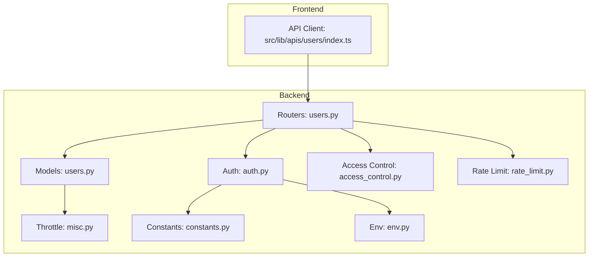
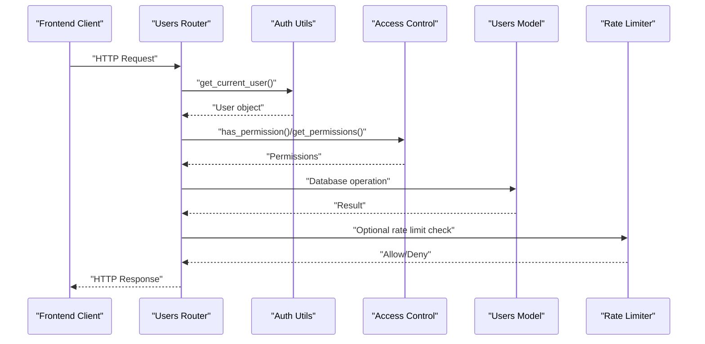
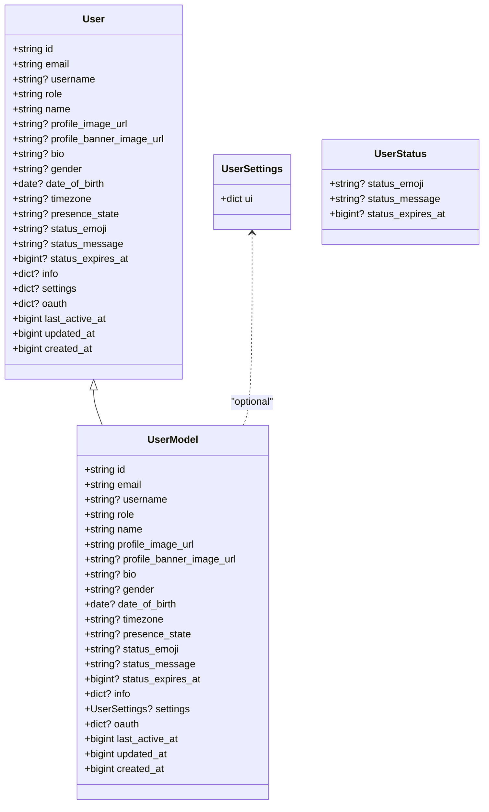
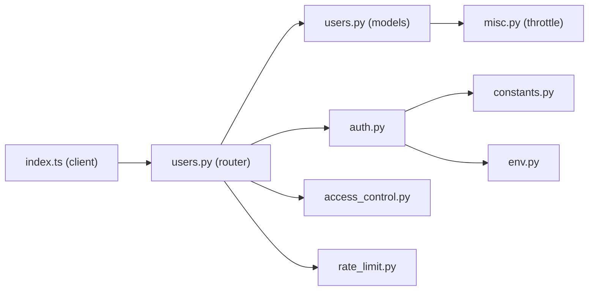

# User Operations

<cite>
**Referenced Files in This Document**
- [users.py](file://backend/open_webui/routers/users.py)
- [users.py](file://backend/open_webui/models/users.py)
- [auth.py](file://backend/open_webui/utils/auth.py)
- [access_control.py](file://backend/open_webui/utils/access_control.py)
- [constants.py](file://backend/open_webui/constants.py)
- [env.py](file://backend/open_webui/env.py)
- [rate_limit.py](file://backend/open_webui/utils/rate_limit.py)
- [misc.py](file://backend/open_webui/utils/misc.py)
- [index.ts](file://src/lib/apis/users/index.ts)
</cite>

## Table of Contents
1. [Introduction](#introduction)
2. [Project Structure](#project-structure)
3. [Core Components](#core-components)
4. [Architecture Overview](#architecture-overview)
5. [Detailed Component Analysis](#detailed-component-analysis)
6. [Dependency Analysis](#dependency-analysis)
7. [Performance Considerations](#performance-considerations)
8. [Troubleshooting Guide](#troubleshooting-guide)
9. [Conclusion](#conclusion)
10. [Appendices](#appendices)

## Introduction
This document provides comprehensive API documentation for user management operations in the Open WebUI backend. It covers endpoints for listing users (admin-only), retrieving individual user profiles, updating user settings and preferences, updating user status, updating user info, retrieving profile images, and deleting users. It also explains authentication and authorization requirements using JWT or session-based tokens, the user data model, validation rules, error handling, privacy considerations, and rate limiting behavior.

## Project Structure
The user management APIs are implemented in the backend FastAPI router module and backed by SQLAlchemy models and utilities for authentication, access control, and rate limiting. The frontend client library provides typed API calls to these endpoints.

**Diagram sources**
- [users.py](file://backend/open_webui/routers/users.py#L1-L621)
- [users.py](file://backend/open_webui/models/users.py#L1-L719)
- [auth.py](file://backend/open_webui/utils/auth.py#L1-L419)
- [access_control.py](file://backend/open_webui/utils/access_control.py#L1-L175)
- [rate_limit.py](file://backend/open_webui/utils/rate_limit.py#L1-L140)
- [misc.py](file://backend/open_webui/utils/misc.py#L548-L578)
- [constants.py](file://backend/open_webui/constants.py#L1-L127)
- [env.py](file://backend/open_webui/env.py#L410-L480)
- [index.ts](file://src/lib/apis/users/index.ts#L1-L553)

**Section sources**
- [users.py](file://backend/open_webui/routers/users.py#L1-L621)
- [users.py](file://backend/open_webui/models/users.py#L1-L719)
- [auth.py](file://backend/open_webui/utils/auth.py#L1-L419)
- [access_control.py](file://backend/open_webui/utils/access_control.py#L1-L175)
- [rate_limit.py](file://backend/open_webui/utils/rate_limit.py#L1-L140)
- [misc.py](file://backend/open_webui/utils/misc.py#L548-L578)
- [constants.py](file://backend/open_webui/constants.py#L1-L127)
- [env.py](file://backend/open_webui/env.py#L410-L480)
- [index.ts](file://src/lib/apis/users/index.ts#L1-L553)

## Core Components
- User router endpoints: GET /users/, GET /users/all, GET /users/search, GET /users/{user_id}, GET /users/{user_id}/profile/image, GET /users/{user_id}/active, POST /users/{user_id}/update, DELETE /users/{user_id}, GET /users/{user_id}/groups, GET /users/groups, GET /users/permissions, GET /users/default/permissions, POST /users/default/permissions, GET /users/user/settings, POST /users/user/settings/update, GET /users/user/status, POST /users/user/status/update, GET /users/user/info, POST /users/user/info/update, GET /users/{user_id}/oauth/sessions.
- Authentication and authorization: JWT bearer tokens and session cookies; admin-required decorators; permission checks via access control.
- Data models: UserModel, UserStatus, UserSettings, forms and responses for user operations.
- Utilities: throttle decorator for last active updates, rate limiter for request limiting, environment variables controlling auth and secrets.

**Section sources**
- [users.py](file://backend/open_webui/routers/users.py#L57-L621)
- [users.py](file://backend/open_webui/models/users.py#L78-L110)
- [auth.py](file://backend/open_webui/utils/auth.py#L272-L419)
- [access_control.py](file://backend/open_webui/utils/access_control.py#L1-L175)
- [misc.py](file://backend/open_webui/utils/misc.py#L548-L578)
- [rate_limit.py](file://backend/open_webui/utils/rate_limit.py#L1-L140)

## Architecture Overview
The user management API follows a layered architecture:
- Router layer validates and enforces access control.
- Service-like methods in the Users model encapsulate database operations.
- Authentication utilities resolve the current user from JWT or session cookies.
- Access control aggregates permissions from groups and defaults.
- Throttling prevents excessive updates to user last-active timestamps.
- Frontend client invokes endpoints with Authorization headers.

**Diagram sources**
- [users.py](file://backend/open_webui/routers/users.py#L57-L621)
- [auth.py](file://backend/open_webui/utils/auth.py#L272-L419)
- [access_control.py](file://backend/open_webui/utils/access_control.py#L1-L175)
- [users.py](file://backend/open_webui/models/users.py#L551-L564)
- [rate_limit.py](file://backend/open_webui/utils/rate_limit.py#L1-L140)

## Detailed Component Analysis

### Authentication and Authorization
- Authentication supports JWT bearer tokens and session cookies. Tokens starting with “sk-” are treated as API keys.
- Two decorators enforce roles:
  - get_verified_user: requires role in {"user","admin"}.
  - get_admin_user: requires role == "admin".
- Token validation includes decoding, JTI revocation checks via Redis, and optional trusted header verification.
- Password validation and hashing utilities are available for secure updates.

**Section sources**
- [auth.py](file://backend/open_webui/utils/auth.py#L272-L419)
- [constants.py](file://backend/open_webui/constants.py#L19-L127)
- [env.py](file://backend/open_webui/env.py#L410-L480)

### User Data Model
The user data model defines fields for identity, profile, status, preferences, and metadata. Timestamps are epoch integers. Profile image can be a URL or base64 data URI.

**Diagram sources**
- [users.py](file://backend/open_webui/models/users.py#L45-L110)
- [users.py](file://backend/open_webui/models/users.py#L39-L43)
- [users.py](file://backend/open_webui/models/users.py#L175-L180)

**Section sources**
- [users.py](file://backend/open_webui/models/users.py#L45-L110)
- [users.py](file://backend/open_webui/models/users.py#L39-L43)
- [users.py](file://backend/open_webui/models/users.py#L175-L180)

### Endpoints Overview

#### List Users (Admin-only)
- Method: GET
- URL: /users/
- Query parameters:
  - query: optional string to filter by name or email
  - order_by: optional field among name, email, created_at, last_active_at, updated_at, role
  - direction: asc or desc
  - page: integer, default 1
- Authentication: Bearer JWT or session cookie; requires admin role.
- Response: UserGroupIdsListResponse with users and total count.

Validation and behavior:
- Pagination uses PAGE_ITEM_COUNT constant.
- Filters and ordering are applied server-side.

**Section sources**
- [users.py](file://backend/open_webui/routers/users.py#L57-L96)
- [users.py](file://backend/open_webui/models/users.py#L318-L453)

#### List All Users (Admin-only)
- Method: GET
- URL: /users/all
- Authentication: Admin required.
- Response: UserInfoListResponse with users and total count.

**Section sources**
- [users.py](file://backend/open_webui/routers/users.py#L99-L104)
- [users.py](file://backend/open_webui/models/users.py#L199-L202)

#### Search Users (Authenticated)
- Method: GET
- URL: /users/search
- Query parameters:
  - query: optional string to filter by name or email
  - order_by: optional field among name, email, created_at, last_active_at, updated_at, role
  - direction: asc or desc
  - page: integer, default 1
- Authentication: Verified user (role in {"user","admin"}).
- Response: UserInfoListResponse with users and total count.

**Section sources**
- [users.py](file://backend/open_webui/routers/users.py#L106-L132)
- [users.py](file://backend/open_webui/models/users.py#L318-L453)

#### Get User by ID (Authenticated)
- Method: GET
- URL: /users/{user_id}
- Authentication: Verified user.
- Behavior:
  - If user_id starts with "shared-", resolves to the underlying user via chat.
  - Returns user plus is_active flag computed from last_active_at.
- Response: UserActiveResponse.

**Section sources**
- [users.py](file://backend/open_webui/routers/users.py#L399-L428)
- [users.py](file://backend/open_webui/models/users.py#L708-L716)

#### Get User Active Status by ID (Authenticated)
- Method: GET
- URL: /users/{user_id}/active
- Authentication: Verified user.
- Response: {"active": boolean}

**Section sources**
- [users.py](file://backend/open_webui/routers/users.py#L484-L489)
- [users.py](file://backend/open_webui/models/users.py#L708-L716)

#### Get User Profile Image by ID (Authenticated)
- Method: GET
- URL: /users/{user_id}/profile/image
- Authentication: Verified user.
- Behavior:
  - If stored profile_image_url is a URL, redirects with 302 Found.
  - If base64 data URI, streams image bytes.
  - Otherwise returns default static image.
- Response: Redirect or FileResponse.

**Section sources**
- [users.py](file://backend/open_webui/routers/users.py#L447-L477)

#### Get User Groups by ID (Admin-only)
- Method: GET
- URL: /users/{user_id}/groups
- Authentication: Admin required.
- Response: Groups list.

**Section sources**
- [users.py](file://backend/open_webui/routers/users.py#L618-L621)

#### Get User OAuth Sessions by ID (Admin-only)
- Method: GET
- URL: /users/{user_id}/oauth/sessions
- Authentication: Admin required.
- Response: OAuth sessions list.

**Section sources**
- [users.py](file://backend/open_webui/routers/users.py#L430-L440)

#### Get User Groups (Authenticated)
- Method: GET
- URL: /users/groups
- Authentication: Verified user.
- Response: Groups list.

**Section sources**
- [users.py](file://backend/open_webui/routers/users.py#L139-L142)

#### Get User Permissions (Authenticated)
- Method: GET
- URL: /users/permissions
- Authentication: Verified user.
- Response: User permissions computed from group memberships and defaults.

**Section sources**
- [users.py](file://backend/open_webui/routers/users.py#L149-L156)
- [access_control.py](file://backend/open_webui/utils/access_control.py#L28-L69)

#### Get Default User Permissions (Admin-only)
- Method: GET
- URL: /users/default/permissions
- Authentication: Admin required.
- Response: Nested permissions object.

**Section sources**
- [users.py](file://backend/open_webui/routers/users.py#L228-L244)
- [access_control.py](file://backend/open_webui/utils/access_control.py#L1-L27)

#### Update Default User Permissions (Admin-only)
- Method: POST
- URL: /users/default/permissions
- Authentication: Admin required.
- Body: UserPermissions object.
- Response: Updated permissions.

**Section sources**
- [users.py](file://backend/open_webui/routers/users.py#L246-L252)
- [access_control.py](file://backend/open_webui/utils/access_control.py#L1-L27)

#### Get User Settings by Session User (Authenticated)
- Method: GET
- URL: /users/user/settings
- Authentication: Verified user.
- Response: UserSettings or null.

**Section sources**
- [users.py](file://backend/open_webui/routers/users.py#L259-L269)
- [users.py](file://backend/open_webui/models/users.py#L39-L43)

#### Update User Settings by Session User (Authenticated)
- Method: POST
- URL: /users/user/settings/update
- Authentication: Verified user.
- Body: UserSettings object.
- Behavior:
  - Admins can set toolServers; non-admins without permission lose this setting.
- Response: Updated UserSettings.

**Section sources**
- [users.py](file://backend/open_webui/routers/users.py#L276-L301)
- [access_control.py](file://backend/open_webui/utils/access_control.py#L71-L106)

#### Get User Status by Session User (Authenticated)
- Method: GET
- URL: /users/user/status
- Authentication: Verified user.
- Response: User object.

**Section sources**
- [users.py](file://backend/open_webui/routers/users.py#L308-L318)

#### Update User Status by Session User (Authenticated)
- Method: POST
- URL: /users/user/status/update
- Authentication: Verified user.
- Body: UserStatus object.
- Response: Updated User object.

**Section sources**
- [users.py](file://backend/open_webui/routers/users.py#L325-L338)
- [users.py](file://backend/open_webui/models/users.py#L521-L535)

#### Get User Info by Session User (Authenticated)
- Method: GET
- URL: /users/user/info
- Authentication: Verified user.
- Response: User.info dict or null.

**Section sources**
- [users.py](file://backend/open_webui/routers/users.py#L345-L355)

#### Update User Info by Session User (Authenticated)
- Method: POST
- URL: /users/user/info/update
- Authentication: Verified user.
- Body: Partial info object merged into existing info.
- Response: Updated info dict.

**Section sources**
- [users.py](file://backend/open_webui/routers/users.py#L362-L384)

#### Update User by ID (Admin-only)
- Method: POST
- URL: /users/{user_id}/update
- Authentication: Admin required.
- Body: UserUpdateForm with role, name, email, profile_image_url, optional password.
- Validation:
  - Email uniqueness enforced.
  - Password validated and hashed before update.
- Response: Updated UserModel.

**Section sources**
- [users.py](file://backend/open_webui/routers/users.py#L496-L571)
- [users.py](file://backend/open_webui/models/users.py#L597-L606)
- [auth.py](file://backend/open_webui/utils/auth.py#L163-L191)

#### Delete User by ID (Admin-only)
- Method: DELETE
- URL: /users/{user_id}
- Authentication: Admin required.
- Constraints:
  - Self-deletion forbidden.
  - Cannot delete the primary admin user.
- Response: boolean.

**Section sources**
- [users.py](file://backend/open_webui/routers/users.py#L578-L611)
- [users.py](file://backend/open_webui/models/users.py#L628-L646)

### Request/Response Schemas

- UserGroupIdsListResponse
  - users: list of UserGroupIdsModel
  - total: int
- UserGroupIdsModel
  - Inherits UserModel fields
  - group_ids: list of string
- UserInfoListResponse
  - users: list of UserInfoResponse
  - total: int
- UserInfoResponse
  - id: string
  - name: string
  - email: string
  - role: string
- UserActiveResponse
  - Inherits UserModel fields
  - is_active: bool
- UserStatus
  - status_emoji: string?
  - status_message: string?
  - status_expires_at: int?
- UserSettings
  - ui: dict
- UserUpdateForm
  - role: string
  - name: string
  - email: string
  - profile_image_url: string
  - password: string?

Notes:
- All timestamps are epoch integers.
- Profile image may be a URL or base64 data URI.
- Responses are Pydantic models validated by FastAPI.

**Section sources**
- [users.py](file://backend/open_webui/models/users.py#L157-L202)
- [users.py](file://backend/open_webui/models/users.py#L175-L180)
- [users.py](file://backend/open_webui/models/users.py#L229-L236)

### Authentication Requirements
- Authorization header: Bearer <JWT or session token>.
- Token types:
  - JWT: HS256 signed with WEBUI_SECRET_KEY.
  - API key: "sk-" prefixed token resolved to a user.
- Session cookies: token and oauth_id_token are supported.
- Role checks:
  - get_verified_user: role in {"user","admin"}.
  - get_admin_user: role == "admin".

**Section sources**
- [auth.py](file://backend/open_webui/utils/auth.py#L160-L214)
- [auth.py](file://backend/open_webui/utils/auth.py#L272-L419)
- [env.py](file://backend/open_webui/env.py#L451-L480)

### Access Control and Permissions
- Permissions are aggregated from group memberships and defaults.
- has_permission checks nested keys (e.g., "features.direct_tool_servers").
- get_permissions returns combined permissions for a user.

**Section sources**
- [access_control.py](file://backend/open_webui/utils/access_control.py#L28-L106)

### Privacy Considerations
- Sensitive fields:
  - Email and password are protected; password updates require validation and hashing.
  - OAuth provider data is stored in a JSON field; treat as sensitive.
- Recommendations:
  - Avoid exposing unnecessary fields in responses.
  - Enforce admin-only access for privileged endpoints.
  - Use HTTPS and secure cookies in production.

**Section sources**
- [users.py](file://backend/open_webui/models/users.py#L45-L76)
- [auth.py](file://backend/open_webui/utils/auth.py#L163-L191)
- [env.py](file://backend/open_webui/env.py#L462-L479)

### Rate Limiting for Profile Update Requests
- No explicit per-endpoint rate limiting is implemented in the user router.
- The system includes a general-purpose RateLimiter utility for rolling-window limits.
- Throttling is used for user last-active updates to reduce DB write frequency.

**Section sources**
- [rate_limit.py](file://backend/open_webui/utils/rate_limit.py#L1-L140)
- [misc.py](file://backend/open_webui/utils/misc.py#L548-L578)
- [users.py](file://backend/open_webui/models/users.py#L551-L564)

### Error Handling
Common error responses include:
- 400 Bad Request: USER_NOT_FOUND, EMAIL_TAKEN, INVALID_PASSWORD, INVALID_EMAIL_FORMAT, etc.
- 401 Unauthorized: INVALID_TOKEN, UNAUTHORIZED, ACCESS_PROHIBITED.
- 403 Forbidden: ACTION_PROHIBITED, API_KEY_NOT_ALLOWED.
- 404 Not Found: USER_NOT_FOUND.
- 429 Too Many Requests: RATE_LIMIT_EXCEEDED.

**Section sources**
- [constants.py](file://backend/open_webui/constants.py#L19-L127)
- [users.py](file://backend/open_webui/routers/users.py#L534-L569)
- [auth.py](file://backend/open_webui/utils/auth.py#L370-L401)

### Examples

#### Updating User Preferences
- Endpoint: POST /users/user/settings/update
- Authentication: Bearer JWT or session cookie; verified user.
- Behavior: Non-admins without permission lose toolServers key; admin can set it.
- Response: Updated UserSettings.

**Section sources**
- [users.py](file://backend/open_webui/routers/users.py#L276-L301)
- [access_control.py](file://backend/open_webui/utils/access_control.py#L71-L106)

#### Handling Duplicate Emails
- Endpoint: POST /users/{user_id}/update
- Behavior: If email changed, ensures uniqueness; raises BAD_REQUEST with EMAIL_TAKEN if taken.
- Response: Updated UserModel or error.

**Section sources**
- [users.py](file://backend/open_webui/routers/users.py#L531-L537)

#### Managing User Status Changes
- Endpoint: POST /users/user/status/update
- Authentication: Verified user.
- Behavior: Updates status fields; returns updated user.
- Response: Updated UserModel.

**Section sources**
- [users.py](file://backend/open_webui/routers/users.py#L325-L338)
- [users.py](file://backend/open_webui/models/users.py#L521-L535)

#### Retrieving Profile Image
- Endpoint: GET /users/{user_id}/profile/image
- Authentication: Verified user.
- Behavior: Returns redirect or image stream; falls back to default image.
- Response: Redirect or FileResponse.

**Section sources**
- [users.py](file://backend/open_webui/routers/users.py#L447-L477)

## Dependency Analysis

**Diagram sources**
- [users.py](file://backend/open_webui/routers/users.py#L1-L621)
- [users.py](file://backend/open_webui/models/users.py#L1-L719)
- [auth.py](file://backend/open_webui/utils/auth.py#L1-L419)
- [access_control.py](file://backend/open_webui/utils/access_control.py#L1-L175)
- [rate_limit.py](file://backend/open_webui/utils/rate_limit.py#L1-L140)
- [misc.py](file://backend/open_webui/utils/misc.py#L548-L578)
- [constants.py](file://backend/open_webui/constants.py#L1-L127)
- [env.py](file://backend/open_webui/env.py#L410-L480)
- [index.ts](file://src/lib/apis/users/index.ts#L1-L553)

**Section sources**
- [users.py](file://backend/open_webui/routers/users.py#L1-L621)
- [users.py](file://backend/open_webui/models/users.py#L1-L719)
- [auth.py](file://backend/open_webui/utils/auth.py#L1-L419)
- [access_control.py](file://backend/open_webui/utils/access_control.py#L1-L175)
- [rate_limit.py](file://backend/open_webui/utils/rate_limit.py#L1-L140)
- [misc.py](file://backend/open_webui/utils/misc.py#L548-L578)
- [constants.py](file://backend/open_webui/constants.py#L1-L127)
- [env.py](file://backend/open_webui/env.py#L410-L480)
- [index.ts](file://src/lib/apis/users/index.ts#L1-L553)

## Performance Considerations
- Throttling: update_last_active_by_id is decorated with throttle to limit DB writes for last_active_at updates.
- Pagination: List endpoints use fixed page size and server-side filtering/ordering.
- Redis-backed rate limiting: Rolling window strategy with bucketing; falls back to memory if Redis unavailable.

**Section sources**
- [users.py](file://backend/open_webui/models/users.py#L551-L564)
- [misc.py](file://backend/open_webui/utils/misc.py#L548-L578)
- [rate_limit.py](file://backend/open_webui/utils/rate_limit.py#L1-L140)

## Troubleshooting Guide
- Unauthorized access:
  - Ensure Authorization header contains a valid Bearer token or session cookie.
  - Verify token is not revoked and matches trusted headers if configured.
- Forbidden actions:
  - Admin-only endpoints require role == "admin".
  - Self-deletion and primary admin protection enforced.
- Validation errors:
  - Invalid email format or taken emails cause BAD_REQUEST.
  - Password validation errors are raised during updates.
- Resource not found:
  - USER_NOT_FOUND returned when user does not exist.

**Section sources**
- [auth.py](file://backend/open_webui/utils/auth.py#L272-L419)
- [users.py](file://backend/open_webui/routers/users.py#L578-L611)
- [users.py](file://backend/open_webui/routers/users.py#L531-L537)
- [constants.py](file://backend/open_webui/constants.py#L19-L127)

## Conclusion
The user management API provides robust endpoints for listing, retrieving, updating, and deleting users with strong authentication and authorization controls. The data model supports rich user attributes, and the system incorporates throttling and rate limiting utilities. Administrators can manage user roles, permissions, and settings, while authenticated users can update their own preferences and status. Proper error handling and privacy safeguards are implemented throughout.

## Appendices

### Endpoint Reference Summary

- GET /users/ — List users (admin-only)
- GET /users/all — List all users (admin-only)
- GET /users/search — Search users (authenticated)
- GET /users/{user_id} — Get user by ID (authenticated)
- GET /users/{user_id}/active — Get active status (authenticated)
- GET /users/{user_id}/profile/image — Get profile image (authenticated)
- GET /users/{user_id}/groups — Get user groups (admin-only)
- GET /users/{user_id}/oauth/sessions — Get OAuth sessions (admin-only)
- GET /users/groups — Get current user’s groups (authenticated)
- GET /users/permissions — Get user permissions (authenticated)
- GET /users/default/permissions — Get default permissions (admin-only)
- POST /users/default/permissions — Update default permissions (admin-only)
- GET /users/user/settings — Get user settings (authenticated)
- POST /users/user/settings/update — Update user settings (authenticated)
- GET /users/user/status — Get user status (authenticated)
- POST /users/user/status/update — Update user status (authenticated)
- GET /users/user/info — Get user info (authenticated)
- POST /users/user/info/update — Update user info (authenticated)
- POST /users/{user_id}/update — Update user (admin-only)
- DELETE /users/{user_id} — Delete user (admin-only)

**Section sources**
- [users.py](file://backend/open_webui/routers/users.py#L57-L621)