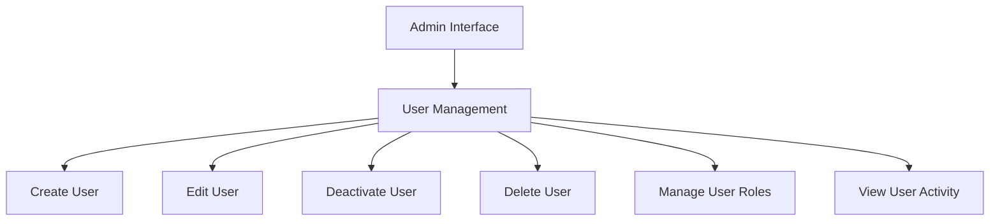
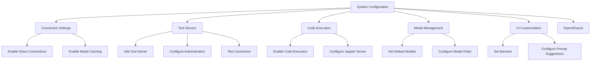
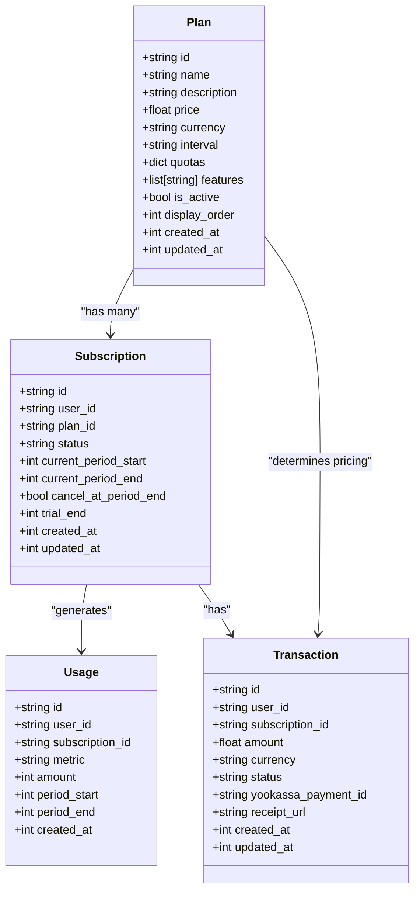
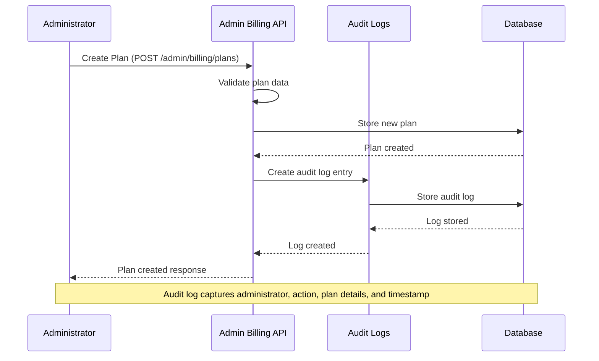
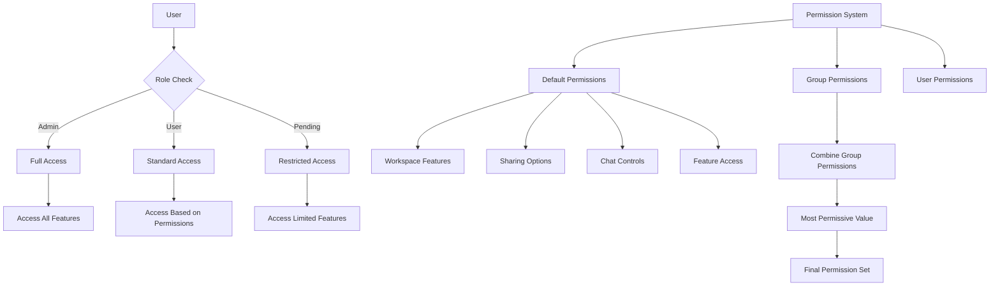

# Administration and User Management

<cite>
**Referenced Files in This Document**   
- [admin_billing.py](file://backend/open_webui/routers/admin_billing.py)
- [users.py](file://backend/open_webui/routers/users.py)
- [billing.py](file://backend/open_webui/models/billing.py)
- [audit.py](file://backend/open_webui/models/audit.py)
- [access_control.py](file://backend/open_webui/utils/access_control.py)
- [auth.py](file://backend/open_webui/utils/auth.py)
- [configs.py](file://backend/open_webui/routers/configs.py)
- [users.py](file://backend/open_webui/models/users.py)
- [billing.ts](file://src/lib/apis/admin/billing.ts)
- [Users.svelte](file://src/lib/components/admin/Users.svelte)
- [+page.svelte](file://src/routes/(app)/admin/billing/plans/+page.svelte)
- [+page.svelte](file://src/routes/(app)/admin/billing/plans/[id]/analytics/+page.svelte)
</cite>

## Table of Contents
1. [Introduction](#introduction)
2. [User Management](#user-management)
3. [System Configuration](#system-configuration)
4. [Billing and Subscription Management](#billing-and-subscription-management)
5. [Audit Logging and Monitoring](#audit-logging-and-monitoring)
6. [Role-Based Access Control](#role-based-access-control)
7. [Practical Administrative Tasks](#practical-administrative-tasks)
8. [Security Considerations](#security-considerations)

## Introduction
The Administration and User Management section of open-webui provides comprehensive tools for administrators to manage users, configure system settings, manage billing plans, and monitor system activity. This documentation details the various administrative features available in the platform, focusing on the capabilities accessible to users with administrative privileges. The system offers a robust interface for managing user accounts, configuring application-wide settings, implementing billing plans, and maintaining security through audit logging and role-based access control.

## User Management
The user management system in open-webui enables administrators to create, edit, and deactivate user accounts through a dedicated administrative interface. The system provides comprehensive user management capabilities through the admin panel, accessible via the Users section in the administration interface.

Administrators can perform various user management operations including creating new user accounts, editing existing user information, updating user roles, and deactivating or deleting user accounts. The system implements safeguards to prevent unauthorized modification of the primary administrator account, ensuring that the first user created in the system maintains administrative privileges.

User information management includes the ability to update user details such as name, email address, profile image, and role assignments. The system also supports user status management, allowing administrators to view and modify user presence status, status messages, and other profile information.

**Diagram sources**
- [users.py](file://backend/open_webui/routers/users.py#L496-L571)
- [Users.svelte](file://src/lib/components/admin/Users.svelte#L1-L122)

**Section sources**
- [users.py](file://backend/open_webui/routers/users.py#L496-L571)
- [Users.svelte](file://src/lib/components/admin/Users.svelte#L1-L122)

## System Configuration
The system configuration interface provides administrators with extensive control over application settings and features. Configuration options are organized into various categories, allowing for granular control over different aspects of the system.

Key configuration areas include:
- Connection settings for direct connections and model caching
- Tool server configurations for integrating external services
- Code execution settings for enabling and configuring code interpretation capabilities
- Model management for setting default models and model ordering
- UI customization options including banners and prompt suggestions

The configuration system supports importing and exporting configuration data, enabling administrators to backup settings or transfer configurations between environments. Configuration changes are applied dynamically, with appropriate validation to prevent invalid settings.

**Diagram sources**
- [configs.py](file://backend/open_webui/routers/configs.py#L68-L491)
- [+page.svelte](file://src/routes/(app)/admin/settings/+page.svelte)

**Section sources**
- [configs.py](file://backend/open_webui/routers/configs.py#L68-L491)

## Billing and Subscription Management
The billing and subscription management system in open-webui provides a comprehensive framework for managing subscription plans, tracking usage, and handling payments. Administrators can configure and manage billing plans through the dedicated billing administration interface.

### Plan Configuration
Administrators can create, edit, and manage subscription plans with various configuration options:
- Plan name and description (with support for multiple languages)
- Pricing information including amount, currency, and billing interval
- Usage quotas for different metrics (tokens, requests, images, etc.)
- Feature sets available for each plan
- Display order for plan presentation

The system includes validation rules to prevent administrators from making changes that could negatively impact users with active subscriptions. For example, administrators cannot decrease quotas for plans that have active subscriptions, ensuring service continuity for existing customers.

### Usage Tracking
The system tracks user usage across various metrics including:
- Input and output tokens
- API requests
- Image generation
- Audio processing minutes

Usage is tracked within billing periods, and administrators can view current usage against plan quotas. The system provides APIs to check if a user's requested usage would exceed their quota, enabling proactive management of resource consumption.

### Analytics and Reporting
The billing analytics interface provides detailed insights into plan performance and subscription metrics:
- Monthly Recurring Revenue (MRR) calculations
- Subscriber counts and churn rates
- Revenue trends over time
- Detailed subscriber lists with subscription status

**Diagram sources**
- [billing.py](file://backend/open_webui/models/billing.py#L54-L141)
- [admin_billing.py](file://backend/open_webui/routers/admin_billing.py#L31-L46)

**Section sources**
- [admin_billing.py](file://backend/open_webui/routers/admin_billing.py#L159-L387)
- [billing.py](file://backend/open_webui/models/billing.py#L291-L351)
- [+page.svelte](file://src/routes/(app)/admin/billing/plans/+page.svelte#L269-L309)
- [+page.svelte](file://src/routes/(app)/admin/billing/plans/[id]/analytics/+page.svelte#L34-L219)

## Audit Logging and Monitoring
The audit logging system in open-webui provides comprehensive tracking of administrative actions and system events. This monitoring capability enables administrators to maintain oversight of system changes and ensure accountability for configuration modifications.

### Audit Log Features
The audit system tracks various administrative actions including:
- Creation, modification, and deletion of billing plans
- Activation and deactivation of plans
- Duplication of existing plans
- Changes to user subscriptions

Each audit log entry includes detailed information about the action performed:
- User ID of the administrator who performed the action
- Type of action (categorized by AuditAction enum)
- Entity type and ID affected by the action
- Descriptive text explaining the action
- Details of changes made (for update operations)
- Timestamp of when the action occurred

### Log Querying and Filtering
Administrators can query audit logs using various filters:
- By entity type (e.g., "plan", "subscription")
- By entity ID to track changes to specific resources
- By user ID to monitor actions performed by specific administrators
- By date range to analyze activity during specific periods

The system creates database indexes on key audit log fields to ensure efficient querying performance, even with large volumes of audit data.

**Diagram sources**
- [audit.py](file://backend/open_webui/models/audit.py#L19-L26)
- [admin_billing.py](file://backend/open_webui/routers/admin_billing.py#L242-L249)

**Section sources**
- [audit.py](file://backend/open_webui/models/audit.py#L83-L114)
- [admin_billing.py](file://backend/open_webui/routers/admin_billing.py#L242-L249)

## Role-Based Access Control
The role-based access control system in open-webui implements a comprehensive permissions framework that governs access to administrative functions and system features. This security model ensures that users have appropriate access levels based on their roles and group memberships.

### User Roles
The system supports multiple user roles with different privilege levels:
- **Admin**: Full administrative privileges including user management, system configuration, and billing plan management
- **User**: Standard user with access to core application features
- **Pending**: Users who have registered but not yet been approved or activated

### Permission System
The permission system operates on multiple levels:
- **Default permissions**: System-wide default settings for feature access
- **Group permissions**: Permissions assigned to user groups that are inherited by members
- **Hierarchical permissions**: Permissions organized in a tree structure (e.g., "features.api_keys")

The system evaluates permissions by combining group permissions and checking against default permissions when group permissions don't explicitly allow or deny access. The most permissive value is used when a permission is defined in multiple groups (True takes precedence over False).

### Access Control Implementation
Access control is enforced through dependency injection and decorator patterns:
- `get_admin_user` dependency ensures only administrators can access protected endpoints
- `get_verified_user` dependency ensures users are authenticated and have valid roles
- `has_permission` function checks specific permission keys against user group permissions

**Diagram sources**
- [access_control.py](file://backend/open_webui/utils/access_control.py#L28-L68)
- [auth.py](file://backend/open_webui/utils/auth.py#L412-L418)

**Section sources**
- [access_control.py](file://backend/open_webui/utils/access_control.py#L28-L68)
- [auth.py](file://backend/open_webui/utils/auth.py#L412-L418)
- [users.py](file://backend/open_webui/routers/users.py#L228-L252)

## Practical Administrative Tasks
This section provides guidance on common administrative tasks that administrators perform when managing the open-webui system.

### Onboarding New Users
To onboard new users, administrators can:
1. Navigate to the Users section in the admin interface
2. Use the user creation functionality to add new accounts
3. Assign appropriate roles and permissions
4. Configure user-specific settings as needed
5. Notify users of their account creation and provide login instructions

The system supports bulk user operations and can integrate with external identity providers for streamlined user management.

### Configuring System-Wide Settings
When configuring system-wide settings, administrators should:
1. Access the Settings section in the admin interface
2. Review current configuration values
3. Make changes to connection settings, tool servers, or code execution options as needed
4. Test configurations using available verification tools
5. Save changes and verify that they take effect as expected

For critical changes, administrators should consider implementing changes during maintenance windows and communicating updates to users.

### Managing Billing Plans
To effectively manage billing plans, administrators should:
1. Review current plan performance metrics and subscriber data
2. Create new plans or modify existing ones based on business requirements
3. Use the duplicate plan feature to create variations of existing plans
4. Monitor usage patterns to ensure quotas are appropriate
5. Analyze revenue trends and adjust pricing strategies as needed

When modifying active plans, administrators should be aware of restrictions that prevent decreasing quotas for plans with active subscriptions.

## Security Considerations
The administration system implements several security measures to protect privileged operations and maintain system integrity.

### Privileged Operation Protections
The system includes safeguards for critical administrative functions:
- Prevention of primary admin account modification by other administrators
- Prohibition of self-deletion for administrative accounts
- Validation of plan modifications to prevent quota reductions for active subscriptions
- Audit logging of all administrative actions for accountability

### Authentication and Authorization
The system employs robust authentication and authorization mechanisms:
- JWT-based authentication with token expiration and revocation
- API key authentication for programmatic access
- Role-based access control for endpoint protection
- Permission checking for feature-level access

### Data Protection
Administrative interfaces implement security best practices:
- Input validation for all user-provided data
- Protection against common web vulnerabilities
- Secure handling of sensitive information
- Comprehensive audit logging for compliance and monitoring

The system also supports integration with external authentication providers and can operate in environments with trusted email headers for enhanced security.

**Section sources**
- [auth.py](file://backend/open_webui/utils/auth.py#L502-L526)
- [users.py](file://backend/open_webui/routers/users.py#L578-L610)
- [admin_billing.py](file://backend/open_webui/routers/admin_billing.py#L114-L132)