# Billing and Subscription Management

<cite>
**Referenced Files in This Document**   
- [billing.py](file://backend/open_webui/models/billing.py)
- [billing.py](file://backend/open_webui/routers/billing.py)
- [billing.py](file://backend/open_webui/utils/billing.py)
- [init_billing_plans.py](file://backend/scripts/init_billing_plans.py)
- [BILLING_SETUP.md](file://BILLING_SETUP.md)
- [yookassa.py](file://backend/open_webui/utils/yookassa.py)
- [plan_templates.py](file://backend/open_webui/utils/plan_templates.py)
- [b2f8a9c1d5e3_add_billing_tables.py](file://backend/open_webui/migrations/versions/b2f8a9c1d5e3_add_billing_tables.py)
</cite>

## Table of Contents
1. [Introduction](#introduction)
2. [Data Model](#data-model)
3. [Billing Plan Creation](#billing-plan-creation)
4. [Subscription Management](#subscription-management)
5. [Usage Analytics and Metering](#usage-analytics-and-metering)
6. [Payment Processing and Webhooks](#payment-processing-and-webhooks)
7. [Feature Access and Quota Enforcement](#feature-access-and-quota-enforcement)
8. [Plan Migration and Subscription Lifecycle](#plan-migration-and-subscription-lifecycle)
9. [Configuration and Initialization](#configuration-and-initialization)
10. [Security Considerations](#security-considerations)

## Introduction

The Billing and Subscription Management system in open-webui provides a comprehensive solution for monetizing AI services through tiered subscription plans, usage-based metering, and integration with payment providers. The system is designed to support both free and paid tiers, with granular control over feature access and resource quotas. Built with extensibility in mind, it supports multiple payment providers through a pluggable architecture, with initial implementation focused on YooKassa for Russian market compliance.

The system tracks user activity across various metrics including token usage, API requests, and multimedia processing, enabling precise billing and quota enforcement. It integrates seamlessly with the application's authentication and access control systems to ensure that users only access features and resources appropriate to their subscription level.

**Section sources**
- [BILLING_SETUP.md](file://BILLING_SETUP.md#L1-L333)

## Data Model

The billing system is built on four core database tables that track plans, subscriptions, usage, and transactions. These tables are created through Alembic migrations and are designed for efficient querying and analytics.

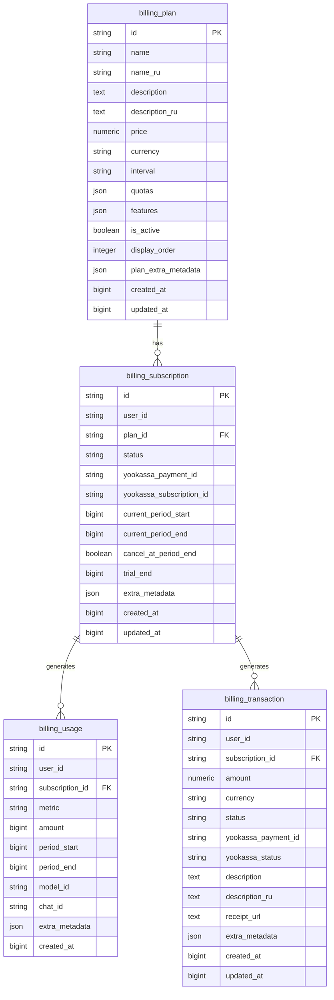

**Diagram sources**
- [b2f8a9c1d5e3_add_billing_tables.py](file://backend/open_webui/migrations/versions/b2f8a9c1d5e3_add_billing_tables.py#L18-L187)
- [billing.py](file://backend/open_webui/models/billing.py#L54-L265)

### Plan Data Structure

The `Plan` model defines subscription tiers with pricing, quotas, and feature sets. Each plan includes:

- **Pricing**: Fixed price per interval (monthly or annual) in a specific currency (default RUB)
- **Quotas**: Usage limits for various metrics like input/output tokens, requests, images, and audio minutes
- **Features**: List of accessible AI models and premium features
- **Metadata**: Display order, activation status, and optional Russian language translations

Plans can be configured as unlimited by setting quotas to null, which is used for enterprise-tier subscriptions.

### Subscription Lifecycle

Subscriptions track a user's active plan and billing period. Key fields include:

- **Status**: ACTIVE, CANCELED, PAST_DUE, TRIALING, or PAUSED
- **Billing Period**: Current period start and end timestamps
- **Cancellation**: Flag to indicate if subscription should cancel at period end
- **Trial**: Optional trial period end timestamp
- **Payment Provider**: YooKassa-specific identifiers for payment and subscription management

The system supports both immediate cancellation and end-of-period cancellation, providing flexibility for user experience design.

### Usage Metering

The usage system tracks resource consumption with high granularity:

- **Metrics**: Token input/output, API requests, image generation, and audio processing time
- **Context**: Associated model ID, chat ID, and metadata for analytics
- **Period**: Start and end timestamps for the usage period
- **Amount**: Quantity consumed (e.g., number of tokens)

Usage records are created after each AI interaction and are used to enforce quotas and generate analytics.

### Transaction History

Transactions record all payment activity:

- **Payment Details**: Amount, currency, status, and provider-specific information
- **Descriptive Metadata**: Human-readable descriptions in multiple languages
- **Receipts**: URLs to payment receipts provided by the payment gateway
- **Status Tracking**: PENDING, SUCCEEDED, FAILED, or CANCELED states

This provides a complete audit trail for financial operations and customer support.

**Section sources**
- [billing.py](file://backend/open_webui/models/billing.py#L54-L265)
- [b2f8a9c1d5e3_add_billing_tables.py](file://backend/open_webui/migrations/versions/b2f8a9c1d5e3_add_billing_tables.py#L18-L187)

## Billing Plan Creation

Billing plans are created through either API endpoints or initialization scripts, defining the available subscription tiers for users. The system supports programmatic creation, modification, and deletion of plans with appropriate administrative controls.

### Plan Configuration

Plans are configured with a comprehensive set of parameters that define their characteristics:

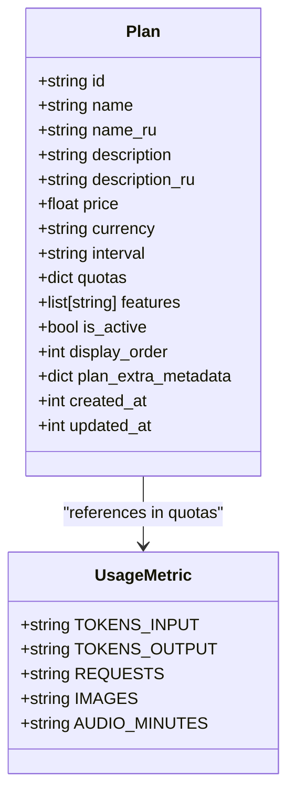

**Diagram sources**
- [billing.py](file://backend/open_webui/models/billing.py#L54-L81)
- [billing.py](file://backend/open_webui/models/billing.py#L41-L47)

### API-Based Plan Creation

Administrators can create plans through the REST API using the `/api/v1/billing/plans` endpoint. The request requires authentication with admin privileges and includes all plan parameters:

```json
{
  "name": "Pro",
  "name_ru": "Профессиональный",
  "description": "Advanced features and higher quotas",
  "description_ru": "Расширенные возможности и увеличенные квоты",
  "price": 990.00,
  "currency": "RUB",
  "interval": "month",
  "quotas": {
    "tokens_input": 1000000,
    "tokens_output": 500000,
    "requests": 10000
  },
  "features": [
    "gpt4_access",
    "claude_access",
    "priority_support"
  ],
  "is_active": true,
  "display_order": 1
}
```

The API validates input parameters and creates the plan in the database, returning the complete plan object with generated timestamps and ID.

### Template-Based Initialization

The system includes a script for initializing plans from templates, which is particularly useful for deployment and testing:

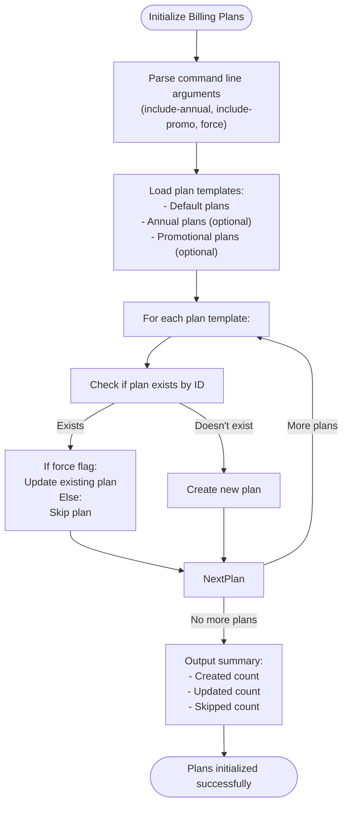

**Diagram sources**
- [init_billing_plans.py](file://backend/scripts/init_billing_plans.py#L29-L74)
- [plan_templates.py](file://backend/open_webui/utils/plan_templates.py#L10-L304)

The `init_billing_plans.py` script provides command-line options to include annual plans (with 20% discount) and promotional plans, and can overwrite existing plans when the force flag is set. This enables consistent plan configuration across environments.

### Default Plan Templates

The system includes comprehensive plan templates that reflect market research and competitive positioning:

- **Free Tier**: Entry-level access with limited quotas for user onboarding
- **Starter Tier**: For students and hobbyists with moderate resource limits
- **Pro Tier**: For professionals and small businesses with advanced features
- **Business Tier**: For companies and power users with high quotas
- **Unlimited Tier**: Enterprise-level access with no usage limits

These templates include Russian language translations and are designed to be immediately deployable. Annual variants provide discounted pricing for users who commit to longer terms.

**Section sources**
- [init_billing_plans.py](file://backend/scripts/init_billing_plans.py#L1-L120)
- [plan_templates.py](file://backend/open_webui/utils/plan_templates.py#L1-L305)
- [billing.py](file://backend/open_webui/routers/billing.py#L110-L137)

## Subscription Management

The subscription system manages the lifecycle of user subscriptions, from creation and renewal to cancellation and expiration. It integrates with the payment provider to ensure that subscriptions are properly synchronized with payment status.

### Subscription Creation

When a user subscribes to a plan, the system creates a subscription record with the following workflow:

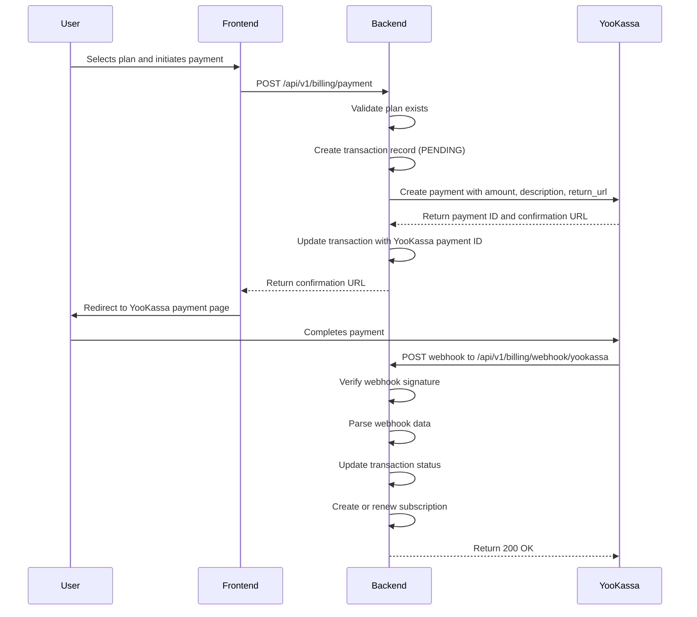

**Diagram sources**
- [billing.py](file://backend/open_webui/utils/billing.py#L374-L447)
- [billing.py](file://backend/open_webui/routers/billing.py#L182-L211)
- [yookassa.py](file://backend/open_webui/utils/yookassa.py#L86-L137)

### Subscription States

Subscriptions can exist in several states that reflect their lifecycle:

- **ACTIVE**: Current subscription with access to features
- **TRIALING**: During a trial period before payment
- **CANCELED**: Subscription has been canceled
- **PAST_DUE**: Payment failed and subscription is overdue
- **PAUSED**: Subscription temporarily suspended

The system uses these states to determine feature access and quota enforcement. For example, trialing subscriptions have full access to premium features during the trial period, while canceled subscriptions lose access at the end of their billing period.

### Subscription Renewal

Subscriptions are automatically renewed when payment is successfully processed. The renewal process extends the billing period and updates the subscription record:

```python
def renew_subscription(self, subscription_id: str) -> Optional[SubscriptionModel]:
    subscription = self.subscriptions.get_subscription_by_id(subscription_id)
    plan = self.get_plan(subscription.plan_id)
    
    # Calculate new period based on plan interval
    if plan.interval == "month":
        new_period_end = subscription.current_period_end + (30 * 24 * 60 * 60)
    elif plan.interval == "year":
        new_period_end = subscription.current_period_end + (365 * 24 * 60 * 60)
    
    updates = {
        "current_period_start": subscription.current_period_end,
        "current_period_end": new_period_end,
        "status": SubscriptionStatus.ACTIVE,
        "cancel_at_period_end": False,
    }
    
    return self.subscriptions.update_subscription(subscription_id, updates)
```

This ensures seamless continuity of service for users with valid payment methods.

### Cancellation Process

Users can cancel their subscriptions through the API, with options for immediate or end-of-period cancellation:

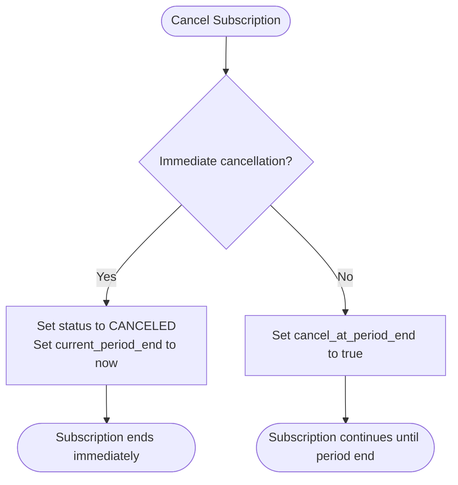

**Diagram sources**
- [billing.py](file://backend/open_webui/utils/billing.py#L156-L184)

Immediate cancellation terminates access immediately, while end-of-period cancellation allows users to continue using the service until the end of their current billing cycle. This provides flexibility for user experience design and reduces churn.

**Section sources**
- [billing.py](file://backend/open_webui/utils/billing.py#L86-L223)
- [billing.py](file://backend/open_webui/routers/billing.py#L144-L174)

## Usage Analytics and Metering

The usage tracking system monitors resource consumption across multiple dimensions, enabling accurate quota enforcement and business analytics. It captures detailed information about each AI interaction for billing and optimization purposes.

### Usage Metrics

The system tracks several key metrics that correspond to different types of resource consumption:

- **TOKENS_INPUT**: Number of input tokens processed by AI models
- **TOKENS_OUTPUT**: Number of output tokens generated by AI models
- **REQUESTS**: Number of API requests made
- **IMAGES**: Number of images generated
- **AUDIO_MINUTES**: Minutes of audio processed

These metrics are defined as an enumeration and can be extended to support additional resource types as needed.

### Usage Tracking Workflow

Usage is tracked after each AI interaction through a standardized process:

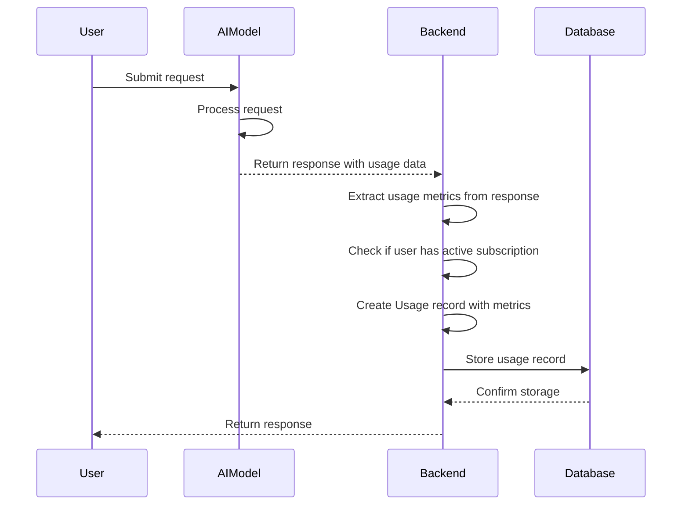

**Diagram sources**
- [billing.py](file://backend/open_webui/utils/billing.py#L227-L269)

The system automatically extracts usage information from AI model responses (typically in the `usage` field) and creates corresponding usage records. This happens transparently to the user and is integrated into the request-response cycle.

### Quota Checking

Before processing requests, the system checks whether the user has sufficient quota remaining:

```python
def check_quota(self, user_id: str, metric: UsageMetric, amount: int = 1) -> bool:
    subscription = self.get_user_subscription(user_id)
    if not subscription:
        return True  # No subscription = unlimited (policy decision)
        
    plan = self.get_plan(subscription.plan_id)
    quota_limit = plan.quotas.get(metric)
    if quota_limit is None:
        return True  # No limit for this metric = unlimited
        
    current_usage = self.get_current_period_usage(user_id, metric)
    would_exceed = (current_usage + amount) > quota_limit
    return not would_exceed
```

This check is performed synchronously before processing each request to prevent quota overages.

### Usage Aggregation

The system provides APIs to retrieve usage data for specific periods and metrics:

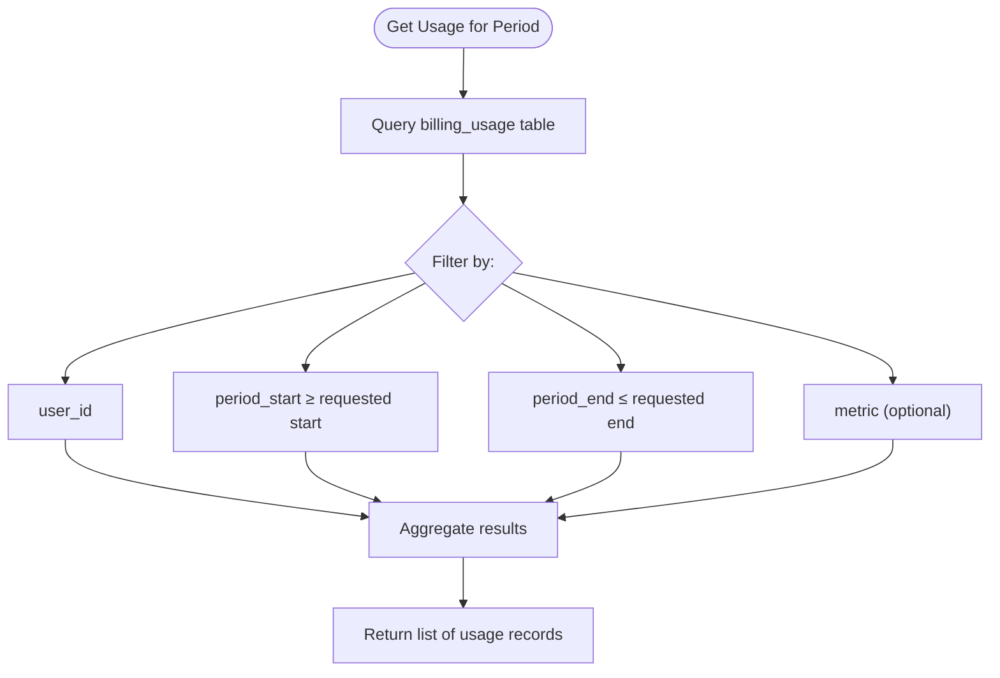

**Diagram sources**
- [billing.py](file://backend/open_webui/models/billing.py#L414-L443)

This enables both real-time quota enforcement and historical analytics. The system uses database indexes on user_id and metric for efficient querying.

### Analytics Endpoints

The API provides several endpoints for retrieving usage information:

- **GET /api/v1/billing/usage/{metric}**: Get current usage for a specific metric
- **POST /api/v1/billing/usage/check**: Check if a specified amount can be used without exceeding quota
- **GET /api/v1/billing/me**: Get complete billing information including usage across all metrics

These endpoints enable client applications to display usage dashboards and warn users when they are approaching their limits.

**Section sources**
- [billing.py](file://backend/open_webui/utils/billing.py#L226-L351)
- [billing.py](file://backend/open_webui/routers/billing.py#L239-L337)
- [billing.py](file://backend/open_webui/models/billing.py#L176-L199)

## Payment Processing and Webhooks

The payment system integrates with YooKassa, a Russian payment provider, to handle subscription billing and one-time payments. It uses webhooks to receive real-time notifications about payment status changes and automatically update subscription states.

### Payment Flow

The payment process follows a standard redirect-based flow:

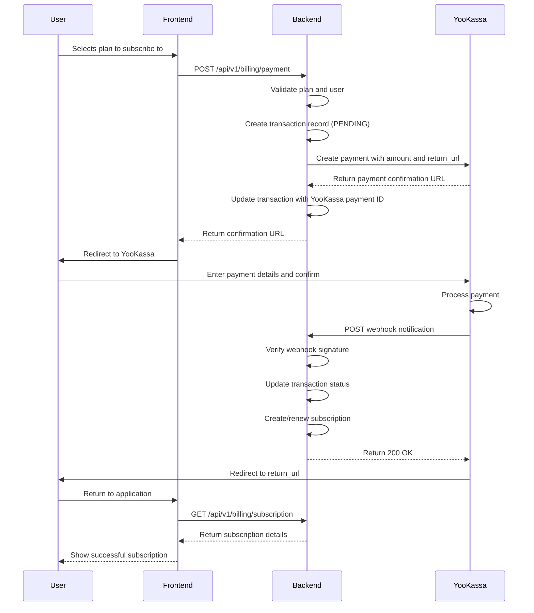

**Diagram sources**
- [billing.py](file://backend/open_webui/utils/billing.py#L374-L447)
- [yookassa.py](file://backend/open_webui/utils/yookassa.py#L86-L137)

### Webhook Processing

Webhooks are critical for maintaining synchronization between the payment provider and the application. The system validates webhook signatures and processes events accordingly:

```python
def process_payment_webhook(self, webhook_data: Dict[str, Any]) -> Optional[SubscriptionModel]:
    event_type = webhook_data.get("event_type")
    metadata = webhook_data.get("metadata", {})
    
    # Find transaction
    transaction_id = metadata.get("transaction_id")
    transaction = self.transactions.get_transaction_by_id(transaction_id)
    
    # Update transaction status
    if event_type == "payment.succeeded":
        self.transactions.update_transaction(transaction_id, {
            "status": TransactionStatus.SUCCEEDED,
            "yookassa_status": webhook_data.get("status"),
        })
        
        # Create or renew subscription
        user_id = metadata.get("user_id")
        plan_id = metadata.get("plan_id")
        
        existing_subscription = self.get_user_subscription(user_id)
        if existing_subscription:
            return self.renew_subscription(existing_subscription.id)
        else:
            return self.create_subscription(user_id, plan_id)
            
    elif event_type == "payment.canceled":
        self.transactions.update_transaction(transaction_id, {
            "status": TransactionStatus.CANCELED,
            "yookassa_status": webhook_data.get("status"),
        })
```

This ensures that subscriptions are created or renewed only after payment has been confirmed, preventing fraud and accounting errors.

### YooKassa Integration

The YooKassa integration is implemented as a dedicated client class that handles API requests and webhook verification:

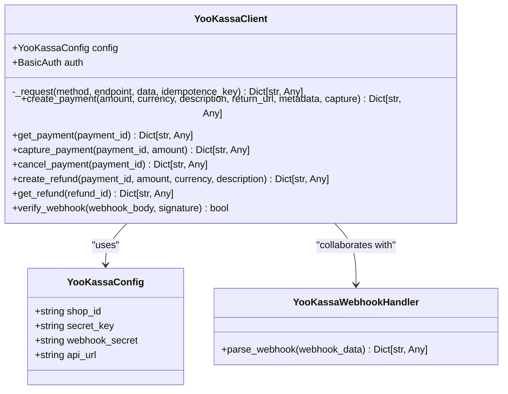

**Diagram sources**
- [yookassa.py](file://backend/open_webui/utils/yookassa.py#L38-L354)

The client handles authentication, request signing, error handling, and response parsing. It uses idempotency keys to prevent duplicate payments and provides methods for all necessary payment operations.

### Configuration

The YooKassa integration is configured through environment variables:

```bash
YOOKASSA_SHOP_ID='your_shop_id'
YOOKASSA_SECRET_KEY='your_secret_key'
YOOKASSA_WEBHOOK_SECRET='your_webhook_secret'
YOOKASSA_API_URL='https://api.yookassa.ru/v3'
```

These variables are used to initialize the YooKassa client at application startup. The webhook secret is optional but recommended for enhanced security.

**Section sources**
- [yookassa.py](file://backend/open_webui/utils/yookassa.py#L1-L355)
- [billing.py](file://backend/open_webui/utils/billing.py#L26-L27)
- [BILLING_SETUP.md](file://BILLING_SETUP.md#L52-L62)

## Feature Access and Quota Enforcement

The system enforces feature access and resource quotas based on a user's subscription plan. This ensures that users only access features and consume resources appropriate to their payment tier.

### Rate Limiting Integration

The billing system integrates with the application's rate limiting infrastructure to enforce quotas:

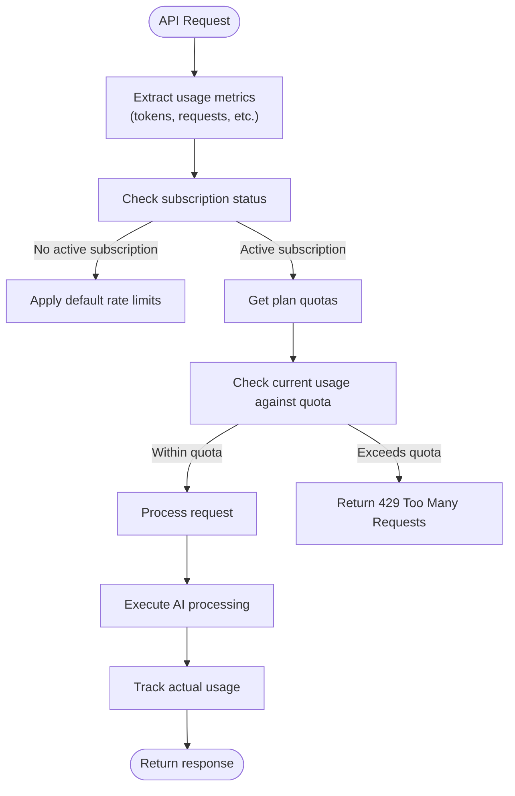

**Diagram sources**
- [billing.py](file://backend/open_webui/utils/billing.py#L311-L351)
- [rate_limit.py](file://backend/open_webui/utils/rate_limit.py#L6-L139)

The `check_quota` method is called before processing each request to ensure the user has sufficient quota remaining. If the requested usage would exceed the quota, the system raises a `QuotaExceededError` which is translated to an HTTP 429 response.

### Feature Access Control

In addition to quantitative quotas, the system controls access to specific features based on the user's plan:

```python
def has_feature_access(user_id: str, feature: str) -> bool:
    subscription = billing_service.get_user_subscription(user_id)
    if not subscription:
        return False
        
    plan = billing_service.get_plan(subscription.plan_id)
    if not plan or not plan.features:
        return False
        
    return feature in plan.features
```

This allows plans to include or exclude specific AI models, integrations, or premium features. For example, the "Pro" plan might include access to GPT-4 while the "Starter" plan only includes GPT-3.5.

### Quota Enforcement Policies

The system implements several policies for handling quota limits:

- **Free Tier Users**: Have limited quotas but can continue using basic features
- **Paid Tier Users**: Have higher quotas and lose access when limits are exceeded
- **Enterprise Users**: May have unlimited quotas or custom limits

The exact behavior can be configured based on business requirements. Some deployments might choose to allow overages at a premium rate, while others strictly enforce limits.

### Real-time Usage Tracking

Usage is tracked in real-time after each request to ensure accurate quota enforcement:

```python
def track_usage(
    self,
    user_id: str,
    metric: UsageMetric,
    amount: int,
    model_id: Optional[str] = None,
    chat_id: Optional[str] = None,
    metadata: Optional[Dict[str, Any]] = None,
) -> UsageModel:
    subscription = self.get_user_subscription(user_id)
    
    usage = UsageModel(
        id=str(uuid.uuid4()),
        user_id=user_id,
        subscription_id=subscription.id if subscription else None,
        metric=metric,
        amount=amount,
        period_start=int(time.time()),
        period_end=int(time.time()),
        model_id=model_id,
        chat_id=chat_id,
        metadata=metadata,
        created_at=int(time.time()),
    )
    
    return self.usage_tracking.track_usage(usage)
```

This creates an immutable record of resource consumption that can be used for billing, analytics, and auditing.

**Section sources**
- [billing.py](file://backend/open_webui/utils/billing.py#L311-L371)
- [rate_limit.py](file://backend/open_webui/utils/rate_limit.py#L6-L139)

## Plan Migration and Subscription Lifecycle

The system supports plan migration, allowing users to upgrade or downgrade between subscription tiers. This is a critical feature for customer retention and revenue optimization.

### Upgrade Process

When a user upgrades to a higher-tier plan, the system handles the transition seamlessly:

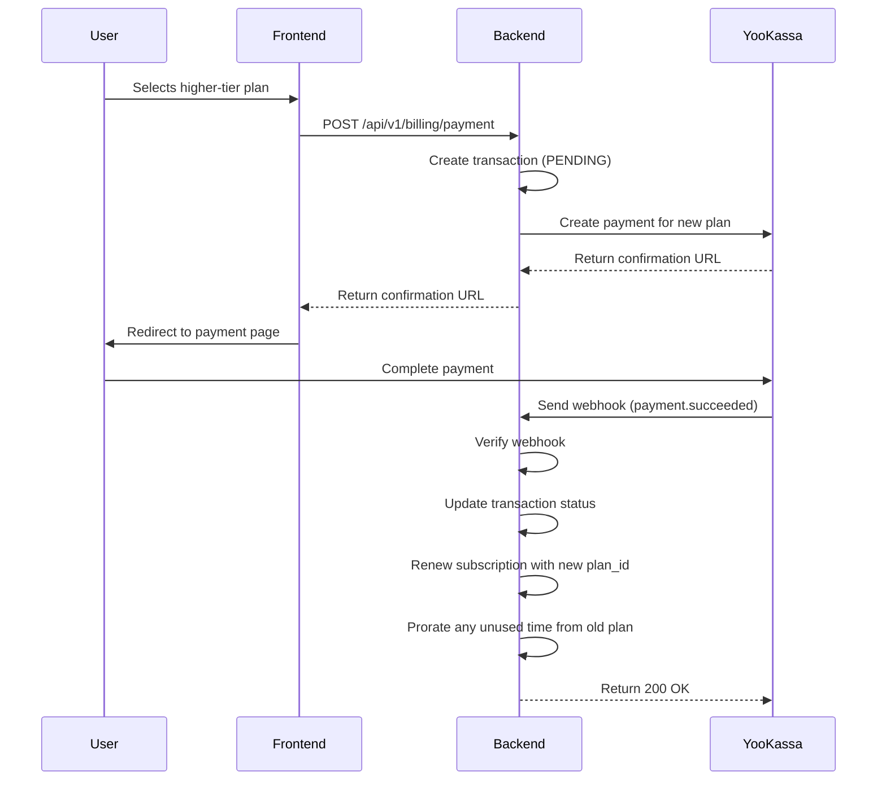

**Diagram sources**
- [billing.py](file://backend/open_webui/utils/billing.py#L487-L503)

The upgrade takes effect immediately, giving the user access to the higher-tier features and quotas. Any unused time from the previous plan is typically credited toward the new plan (proration), though this behavior can be configured.

### Downgrade Process

When a user downgrades to a lower-tier plan, the system typically applies the change at the end of the current billing period:

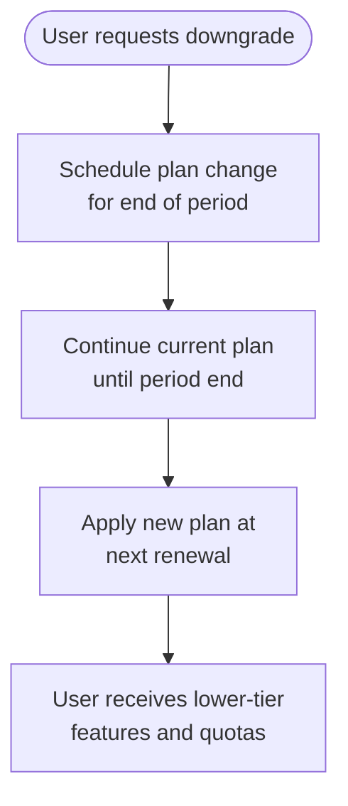

**Diagram sources**
- [billing.py](file://backend/open_webui/utils/billing.py#L156-L184)

This approach prevents disruption of service during the current billing cycle and encourages users to consider their needs before downgrading. The user continues to have access to the higher-tier features until the end of their paid period.

### Trial Management

The system supports trial periods for new users or promotional offers:

```python
def create_subscription(
    self,
    user_id: str,
    plan_id: str,
    trial_days: Optional[int] = None,
) -> SubscriptionModel:
    # ... other code ...
    
    # Set trial if provided
    trial_end = None
    status = SubscriptionStatus.ACTIVE
    if trial_days and trial_days > 0:
        trial_end = now + (trial_days * 24 * 60 * 60)
        status = SubscriptionStatus.TRIALING
        
    subscription = SubscriptionModel(
        # ... other fields ...
        status=status,
        trial_end=trial_end,
    )
```

During the trial period, users have full access to the plan's features and quotas. The system tracks the trial end date and automatically transitions to a paid subscription if payment is set up, or deactivates the subscription if not.

### Subscription Expiration

When subscriptions expire due to cancellation or payment failure, the system handles the transition gracefully:

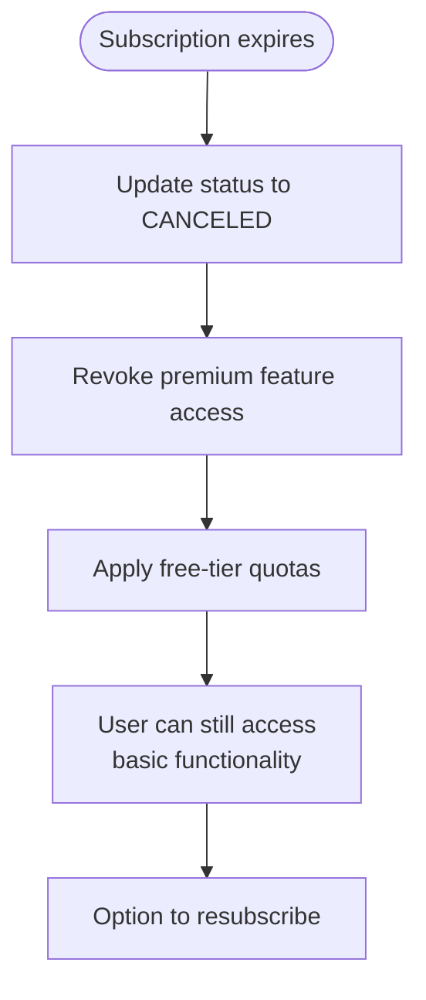

**Diagram sources**
- [billing.py](file://backend/open_webui/utils/billing.py#L156-L184)

Expired subscribers lose access to premium features but can continue using the free tier. This encourages reactivation while maintaining a positive user experience.

**Section sources**
- [billing.py](file://backend/open_webui/utils/billing.py#L102-L223)
- [billing.py](file://backend/open_webui/utils/billing.py#L487-L503)

## Configuration and Initialization

The billing system is configured through environment variables and initialization scripts, making it easy to deploy and customize for different environments.

### Environment Variables

The system uses several environment variables to configure the billing functionality:

```bash
# YooKassa Configuration
YOOKASSA_SHOP_ID='your_shop_id'
YOOKASSA_SECRET_KEY='your_secret_key'
YOOKASSA_WEBHOOK_SECRET='your_webhook_secret'
YOOKASSA_API_URL='https://api.yookassa.ru/v3'

# Logging Configuration
SRC_LOG_LEVELS='{"BILLING": "INFO", "YOOKASSA": "INFO"}'
```

These variables are loaded at application startup and used to initialize the YooKassa client and configure logging levels.

### Initialization Script

The `init_billing_plans.py` script provides a convenient way to set up default plans:

```bash
python -m backend.scripts.init_billing_plans \
  --include-annual \
  --include-promo \
  --force
```

The script accepts several options:
- `--include-annual`: Creates annual versions of plans with discounted pricing
- `--include-promo`: Creates promotional plans for special offers
- `--force`: Overwrites existing plans with template values

This enables consistent plan configuration across development, staging, and production environments.

### Migration Management

The billing tables are created and managed through Alembic migrations, ensuring database schema consistency:

```python
def upgrade():
    # Create billing_plan table
    op.create_table(
        "billing_plan",
        sa.Column("id", sa.String(), nullable=False),
        sa.Column("name", sa.String(), nullable=False),
        # ... other columns ...
    )
    
    # Create billing_subscription table
    op.create_table(
        "billing_subscription",
        sa.Column("id", sa.String(), nullable=False),
        sa.Column("user_id", sa.String(), nullable=False),
        # ... other columns ...
    )
    
    # ... create other tables ...
```

The migration includes appropriate indexes for performance and foreign key constraints for data integrity.

### API Endpoints

The system exposes a comprehensive API for billing operations:

```bash
# Public endpoints (authenticated users)
GET /api/v1/billing/plans
GET /api/v1/billing/subscription
POST /api/v1/billing/payment
POST /api/v1/billing/subscription/cancel
GET /api/v1/billing/usage/{metric}
POST /api/v1/billing/usage/check
GET /api/v1/billing/me

# Admin endpoints
POST /api/v1/billing/plans
```

These endpoints follow REST conventions and use standard HTTP status codes for error handling.

**Section sources**
- [BILLING_SETUP.md](file://BILLING_SETUP.md#L43-L333)
- [init_billing_plans.py](file://backend/scripts/init_billing_plans.py#L1-L120)
- [b2f8a9c1d5e3_add_billing_tables.py](file://backend/open_webui/migrations/versions/b2f8a9c1d5e3_add_billing_tables.py#L18-L187)

## Security Considerations

The billing system implements several security measures to protect financial data and prevent fraud.

### Webhook Verification

The system verifies the authenticity of payment webhooks using HMAC-SHA256 signatures:

```python
def verify_webhook(
    self,
    webhook_body: str,
    signature: str,
) -> bool:
    if not self.config.webhook_secret:
        return True
        
    expected_signature = hmac.new(
        self.config.webhook_secret.encode("utf-8"),
        webhook_body.encode("utf-8"),
        hashlib.sha256,
    ).hexdigest()
    
    return hmac.compare_digest(signature, expected_signature)
```

This prevents attackers from forging payment notifications and gaining unauthorized access to premium features.

### Idempotency Keys

The YooKassa client uses idempotency keys for all POST requests to prevent duplicate operations:

```python
async def _request(
    self,
    method: str,
    endpoint: str,
    data: Optional[Dict[str, Any]] = None,
    idempotence_key: Optional[str] = None,
) -> Dict[str, Any]:
    headers = {"Content-Type": "application/json"}
    if idempotence_key:
        headers["Idempotence-Key"] = idempotence_key
```

This ensures that network issues or retries do not result in duplicate payments or subscriptions.

### Data Protection

Financial data is protected through several mechanisms:

- **Encryption**: Sensitive data is encrypted at rest
- **Access Control**: Only authorized personnel can access financial data
- **Audit Logging**: All financial operations are logged for accountability
- **Minimal Data Storage**: The system stores only necessary payment information

The system follows the principle of least privilege, ensuring that components only have access to the data they need to function.

### Error Handling

The system implements robust error handling to prevent information leakage:

```python
@router.post("/webhook/yookassa")
async def yookassa_webhook(request: Request):
    try:
        # ... webhook processing ...
        return JSONResponse(status_code=200, content={"status": "ok"})
    except Exception as e:
        log.exception(f"Error processing webhook: {e}")
        # Return 200 to prevent retry, but log the error
        return JSONResponse(
            status_code=200,
            content={"status": "error", "message": str(e)},
        )
```

Even when internal errors occur, the system returns a 200 status code to the payment provider to prevent repeated webhook delivery, while logging the error for debugging.

**Section sources**
- [yookassa.py](file://backend/open_webui/utils/yookassa.py#L262-L293)
- [billing.py](file://backend/open_webui/routers/billing.py#L363-L412)
- [BILLING_SETUP.md](file://BILLING_SETUP.md#L269-L272)