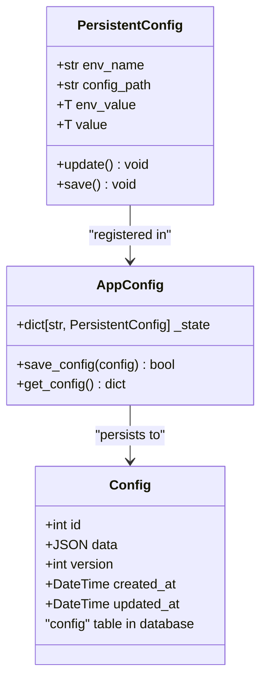
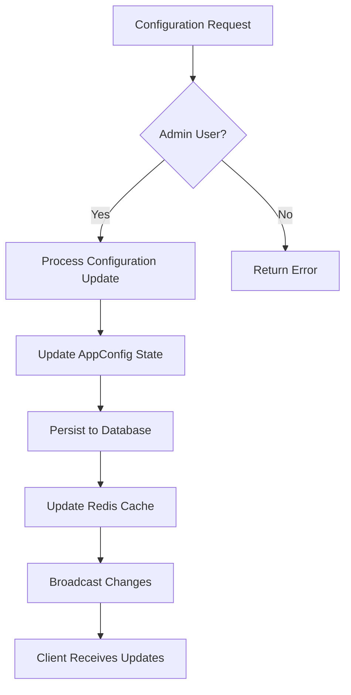
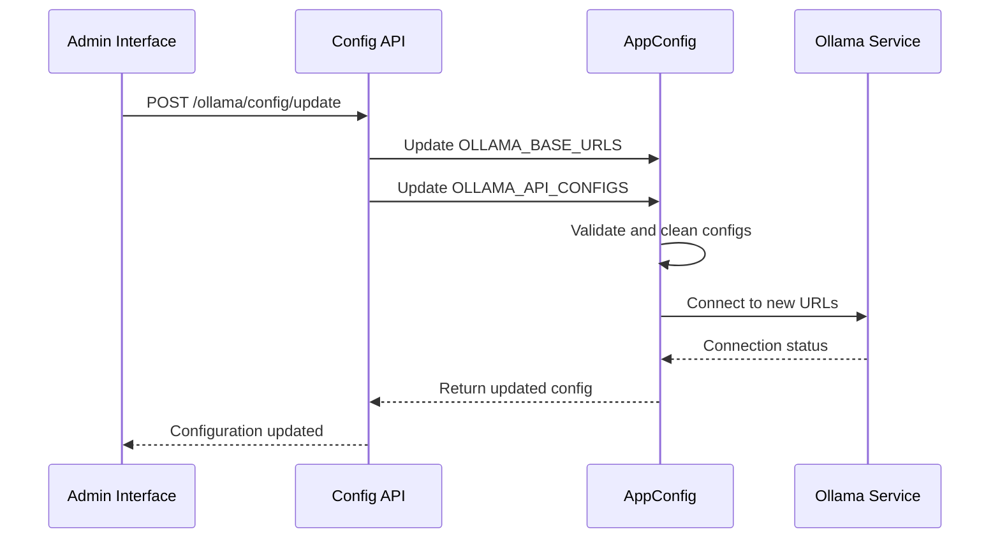
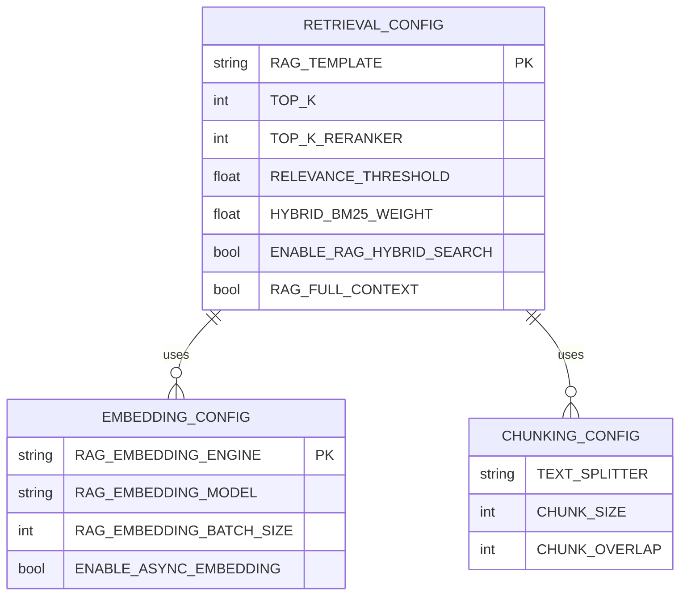

# System Configuration

<cite>
**Referenced Files in This Document**   
- [config.py](file://backend/open_webui/config.py)
- [env.py](file://backend/open_webui/env.py)
- [configs.py](file://backend/open_webui/routers/configs.py)
- [retrieval.py](file://backend/open_webui/routers/retrieval.py)
- [ollama.py](file://backend/open_webui/routers/ollama.py)
- [main.py](file://backend/open_webui/main.py)
- [ca81bd47c050_add_config_table.py](file://backend/open_webui/migrations/versions/ca81bd47c050_add_config_table.py)
- [011_add_user_settings.py](file://backend/open_webui/internal/migrations/011_add_user_settings.py)
</cite>

## Table of Contents
1. [Introduction](#introduction)
2. [Configuration Architecture](#configuration-architecture)
3. [System Settings Management](#system-settings-management)
4. [AI Provider Configuration](#ai-provider-configuration)
5. [Knowledge Base and Retrieval Settings](#knowledge-base-and-retrieval-settings)
6. [Configuration Persistence and Migration](#configuration-persistence-and-migration)
7. [Troubleshooting and Optimization](#troubleshooting-and-optimization)
8. [Conclusion](#conclusion)

## Introduction

The Open WebUI system configuration framework provides comprehensive control over application behavior, interface customization, AI provider connections, and knowledge management. This document details the implementation of system-wide settings management, focusing on the configuration system's architecture, persistence mechanisms, and integration points. The configuration system supports both environment variable overrides and persistent database storage, enabling flexible deployment across different environments while maintaining user preferences and system defaults.

**Section sources**
- [config.py](file://backend/open_webui/config.py#L1-L800)
- [env.py](file://backend/open_webui/env.py#L1-L800)

## Configuration Architecture

The Open WebUI configuration system employs a hierarchical architecture that combines environment variables, persistent database storage, and runtime configuration objects. The core of this system is the `PersistentConfig` class, which manages configuration values that can be overridden by environment variables but are ultimately persisted in the database.



**Diagram sources**
- [config.py](file://backend/open_webui/config.py#L165-L223)
- [ca81bd47c050_add_config_table.py](file://backend/open_webui/migrations/versions/ca81bd47c050_add_config_table.py#L20-L37)

The configuration system follows a specific initialization sequence:
1. Environment variables are loaded from the `.env` file and system environment
2. Configuration values are defined as `PersistentConfig` instances with default values
3. The system checks for legacy `config.json` and migrates it to the database
4. Configuration values are loaded from the database, overriding environment defaults when present
5. Runtime configuration is managed through the `AppConfig` class, which provides a unified interface for accessing configuration values

This architecture ensures that configuration changes are properly propagated throughout the system while maintaining backward compatibility and supporting environment-specific overrides.

**Section sources**
- [config.py](file://backend/open_webui/config.py#L107-L125)
- [env.py](file://backend/open_webui/env.py#L18-L250)

## System Settings Management

System settings in Open WebUI are managed through a comprehensive configuration system that handles interface customization, model defaults, and user preferences. The system distinguishes between system-wide settings and user-specific preferences, with clear override behaviors.

### Interface Customization

The interface customization settings allow administrators to configure the application's appearance and behavior. Key configuration options include:



**Diagram sources**
- [configs.py](file://backend/open_webui/routers/configs.py#L38-L539)
- [main.py](file://backend/open_webui/main.py#L844-L878)

The system supports banner management through the `BannerModel` configuration, allowing administrators to display important messages to users. Banners can be configured with different types (info, warning, error, success), content, and URLs for additional information. The configuration system also manages default models and pinned models through the `DEFAULT_MODELS` and `DEFAULT_PINNED_MODELS` settings, which can be overridden by user preferences.

### Model Defaults and User Preferences

The relationship between system settings and user preferences is managed through a hierarchical override system. System defaults are defined in the configuration, but users can customize their experience through their profile settings. The system resolves configuration values in the following order:

1. User-specific preferences (stored in user settings)
2. System configuration (stored in database)
3. Environment variables
4. Hard-coded defaults

This override behavior ensures that users can personalize their experience while maintaining system-wide consistency. The configuration system also supports model ordering through the `MODEL_ORDER_LIST` setting, which allows administrators to control the display order of available models in the interface.

**Section sources**
- [config.py](file://backend/open_webui/config.py#L1113-L1121)
- [configs.py](file://backend/open_webui/routers/configs.py#L464-L491)

## AI Provider Configuration

The AI provider configuration system in Open WebUI supports multiple AI services, including Ollama and OpenAI, with flexible connection options and authentication methods.

### Ollama Configuration

Ollama integration is configured through the `OLLAMA_BASE_URLS` and `OLLAMA_API_CONFIGS` settings, which support multiple Ollama instances and API configurations:



**Diagram sources**
- [ollama.py](file://backend/open_webui/routers/ollama.py#L278-L305)
- [config.py](file://backend/open_webui/config.py#L978-L987)

The configuration supports prefix IDs for model routing, allowing administrators to direct specific models to particular Ollama instances. This enables load balancing and specialized model deployment across multiple Ollama servers.

### OpenAI and Other AI Providers

OpenAI integration is managed through the `ENABLE_OPENAI_API`, `OPENAI_API_KEY`, and `OPENAI_API_BASE_URL` settings. The system also supports Google's Gemini API through the `GEMINI_API_KEY` and `GEMINI_API_BASE_URL` configuration options. These settings can be configured through environment variables or the admin interface, with values persisted to the database for consistency across application restarts.

The configuration system also supports direct connections to AI providers, controlled by the `ENABLE_DIRECT_CONNECTIONS` setting, which can improve performance by bypassing intermediate routing when appropriate.

**Section sources**
- [config.py](file://backend/open_webui/config.py#L993-L1004)
- [ollama.py](file://backend/open_webui/routers/ollama.py#L1312-L1333)

## Knowledge Base and Retrieval Settings

The knowledge base and retrieval system in Open WebUI provides advanced configuration options for document processing, search, and retrieval augmentation.

### Knowledge Base Configuration

Knowledge bases are configured through the retrieval system's comprehensive settings, which include:

- Document processing engines (Datalab Marker, Tika, Docling, etc.)
- PDF extraction options, including image extraction
- File upload restrictions (size, count, extensions)
- Content extraction and preprocessing settings

The system supports multiple knowledge base types, including local files, web content, and external document sources. Configuration options allow administrators to control which file types are allowed, maximum file sizes, and processing behavior for different document formats.

### Retrieval Parameters

The retrieval system offers extensive configuration options for search and retrieval behavior:



**Diagram sources**
- [retrieval.py](file://backend/open_webui/routers/retrieval.py#L612-L686)
- [main.py](file://backend/open_webui/main.py#L858-L878)

Key retrieval parameters include:
- `TOP_K`: Number of documents to retrieve for each query
- `TOP_K_RERANKER`: Number of documents to rerank
- `RELEVANCE_THRESHOLD`: Minimum relevance score for retrieved documents
- `HYBRID_BM25_WEIGHT`: Weighting factor for hybrid search combining semantic and keyword search
- `RAG_FULL_CONTEXT`: Whether to include full document context in responses

The system also supports hybrid search with BM25 weighting, allowing for more accurate results by combining semantic search with traditional keyword-based retrieval.

**Section sources**
- [retrieval.py](file://backend/open_webui/routers/retrieval.py#L254-L253)
- [config.py](file://backend/open_webui/config.py#L2582-L2628)

## Configuration Persistence and Migration

The configuration persistence system in Open WebUI ensures that settings are maintained across application restarts and server instances.

### Database Storage

Configuration values are stored in a dedicated `config` table in the application database, with the following schema:

```sql
CREATE TABLE config (
    id INTEGER PRIMARY KEY,
    data JSON NOT NULL,
    version INTEGER NOT NULL,
    created_at DATETIME NOT NULL DEFAULT CURRENT_TIMESTAMP,
    updated_at DATETIME NULL ON UPDATE CURRENT_TIMESTAMP
);
```

The system automatically migrates legacy `config.json` files to the database during initialization, ensuring backward compatibility while moving to a more robust storage mechanism. The migration is handled by the code that checks for the existence of `config.json` and transfers its contents to the database before renaming the file to `old_config.json`.

### Environment Variable Overrides

The configuration system supports environment variable overrides through the `PersistentConfig` class, which checks for environment variables during initialization. This allows for flexible deployment configurations without modifying the database. The system follows a specific precedence order:

1. Database values (most specific)
2. Environment variables 
3. Hard-coded defaults (least specific)

This hierarchy ensures that environment-specific configurations can be applied without affecting the base configuration, while still allowing for persistent changes through the admin interface.

**Section sources**
- [config.py](file://backend/open_webui/config.py#L108-L112)
- [env.py](file://backend/open_webui/env.py#L272-L308)

## Troubleshooting and Optimization

This section provides guidance for common configuration issues and performance optimization for large-scale deployments.

### Common Configuration Issues

**Misconfigured Services**: When AI provider services are not responding, verify the following:
- Check that the API base URLs are correctly configured and accessible
- Verify API keys are valid and have appropriate permissions
- Ensure network connectivity between Open WebUI and the AI service
- Check firewall rules and proxy configurations

**Configuration Persistence Problems**: If configuration changes are not persisting:
- Verify database connectivity and permissions
- Check that the `ENABLE_PERSISTENT_CONFIG` environment variable is set to `true`
- Ensure the `config` table exists and is writable
- Verify Redis connectivity if Redis is configured for caching

### Performance Optimization

For large-scale deployments, consider the following optimization strategies:

- **Caching**: Enable Redis caching for frequently accessed configuration values to reduce database load
- **Connection Pooling**: Configure appropriate database connection pool sizes based on expected load
- **Asynchronous Processing**: Enable asynchronous embedding generation to improve responsiveness
- **Batch Processing**: Configure appropriate batch sizes for embedding generation to balance memory usage and processing speed
- **Hybrid Search**: Use hybrid search with appropriate BM25 weighting to improve retrieval accuracy while maintaining performance

The system also supports configuration of thread pool size through the `THREAD_POOL_SIZE` setting, which can be tuned based on available CPU resources and expected concurrent load.

**Section sources**
- [config.py](file://backend/open_webui/config.py#L350-L364)
- [env.py](file://backend/open_webui/env.py#L310-L349)

## Conclusion

The Open WebUI system configuration framework provides a robust and flexible approach to managing application settings, AI provider connections, and knowledge base configurations. By combining environment variable overrides with persistent database storage, the system offers both deployment flexibility and configuration consistency. The hierarchical override system ensures that user preferences are respected while maintaining system-wide defaults, and the comprehensive API allows for programmatic configuration management. For large-scale deployments, the system's performance can be optimized through caching, connection pooling, and appropriate configuration of processing parameters.