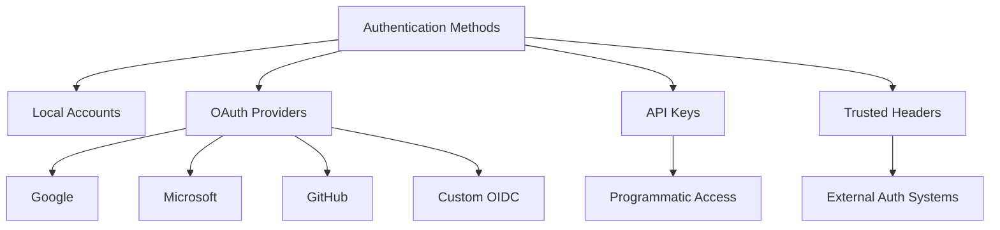
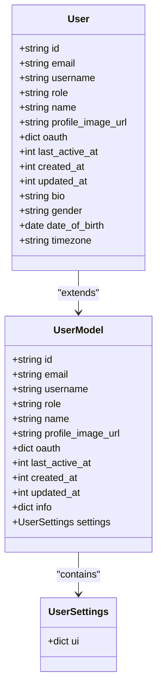
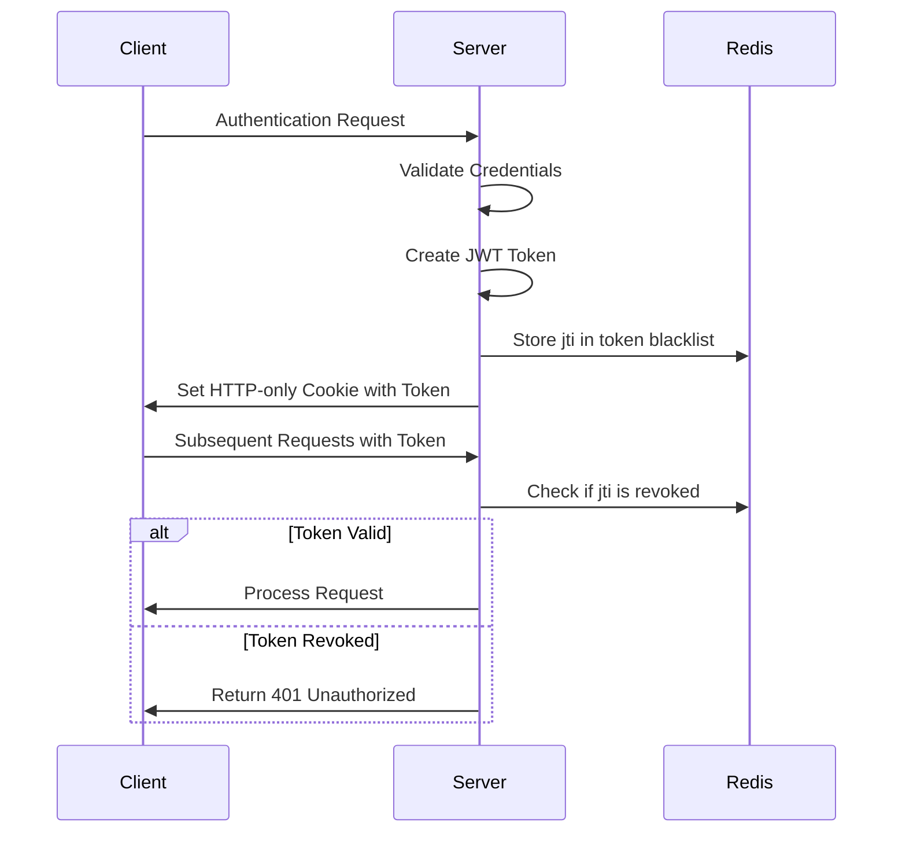
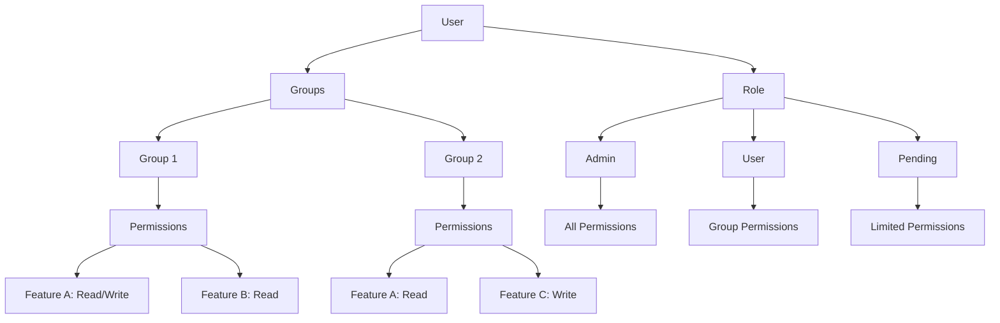
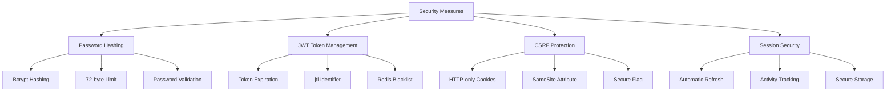
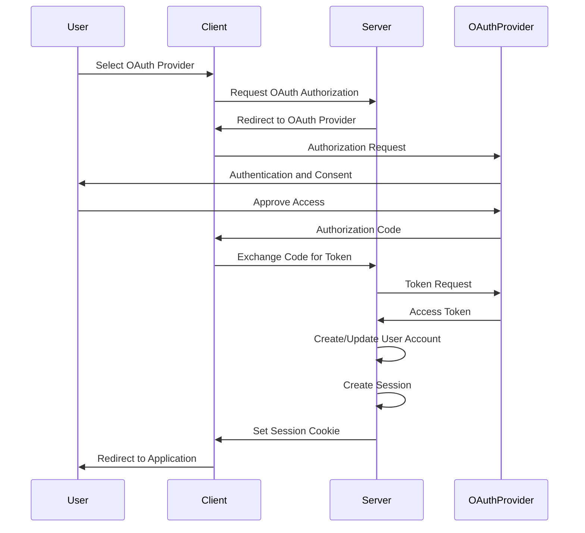
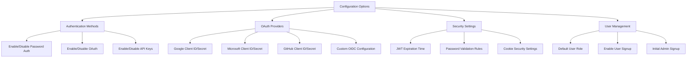

# Authentication and Authorization

<cite>
**Referenced Files in This Document**   
- [users.py](file://backend/open_webui/models/users.py)
- [auths.py](file://backend/open_webui/models/auths.py)
- [routers/auths.py](file://backend/open_webui/routers/auths.py)
- [utils/auth.py](file://backend/open_webui/utils/auth.py)
- [utils/oauth.py](file://backend/open_webui/utils/oauth.py)
- [config.py](file://backend/open_webui/config.py)
- [env.py](file://backend/open_webui/env.py)
- [oauth_sessions.py](file://backend/open_webui/models/oauth_sessions.py)
- [index.ts](file://src/lib/apis/auths/index.ts)
</cite>

## Table of Contents
1. [Introduction](#introduction)
2. [Authentication System](#authentication-system)
3. [User Model](#user-model)
4. [Session Management](#session-management)
5. [Authorization Framework](#authorization-framework)
6. [Security Measures](#security-measures)
7. [Authentication Flows](#authentication-flows)
8. [Configuration Options](#configuration-options)
9. [Troubleshooting Guide](#troubleshooting-guide)

## Introduction
The open-webui authentication and authorization system provides a comprehensive security framework supporting multiple authentication methods, role-based access control, and secure session management. This document details the implementation of local accounts, OAuth providers (Google, Microsoft, GitHub), and API keys, along with the user model, session management, authorization framework, and security measures. The system is designed to be flexible and secure, allowing administrators to configure authentication methods and integrate custom OAuth providers while maintaining robust security practices.

## Authentication System
The open-webui authentication system supports multiple methods including local accounts, OAuth providers, and API keys. The system is designed to be flexible and secure, allowing users to authenticate through various methods while maintaining robust security practices.

Local account authentication is implemented through email and password credentials, with password hashing using bcrypt for security. The system supports OAuth authentication with Google, Microsoft, and GitHub providers, allowing users to sign in with their existing accounts from these services. Additionally, API key authentication is available for programmatic access to the system.

The authentication system is configurable through environment variables and persistent configuration settings, allowing administrators to enable or disable specific authentication methods based on their requirements. The system also supports trusted header authentication for integration with external authentication systems.

**Diagram sources**
- [routers/auths.py](file://backend/open_webui/routers/auths.py#L507-L632)
- [utils/auth.py](file://backend/open_webui/utils/auth.py#L272-L419)
- [config.py](file://backend/open_webui/config.py#L289-L322)

**Section sources**
- [routers/auths.py](file://backend/open_webui/routers/auths.py#L507-L632)
- [utils/auth.py](file://backend/open_webui/utils/auth.py#L272-L419)
- [config.py](file://backend/open_webui/config.py#L289-L322)

## User Model
The user model in open-webui defines the structure and attributes of user accounts, storing essential information for authentication, authorization, and user management. The model includes fields for authentication data, user profile information, and metadata for system operations.

The User model contains the following key fields:
- **id**: Unique identifier for the user
- **email**: User's email address, used for authentication and identification
- **username**: Optional username for display purposes
- **role**: User role (admin, user, pending) determining access level
- **name**: User's display name
- **profile_image_url**: URL to the user's profile image
- **oauth**: JSON field storing OAuth provider information
- **last_active_at**: Timestamp of the user's last activity
- **created_at**: Timestamp when the user account was created
- **updated_at**: Timestamp of the last update to the user record

The model also includes optional fields for additional user information such as bio, gender, date of birth, and timezone. The oauth field stores provider-specific information, allowing users to link multiple OAuth accounts to a single user profile.

**Diagram sources**
- [users.py](file://backend/open_webui/models/users.py#L45-L118)
- [users.py](file://backend/open_webui/models/users.py#L78-L117)

**Section sources**
- [users.py](file://backend/open_webui/models/users.py#L45-L118)

## Session Management
The session management system in open-webui handles user sessions through JWT tokens and API keys, providing secure authentication and authorization for both web and programmatic access. The system implements token-based authentication with expiration and revocation capabilities to enhance security.

User sessions are managed through JWT tokens stored in HTTP-only cookies, preventing cross-site scripting (XSS) attacks. The tokens contain a unique identifier (jti) that allows for token revocation and validation against a blacklist stored in Redis. When a user authenticates successfully, a JWT token is generated with an expiration time based on the JWT_EXPIRES_IN configuration.

For API key authentication, the system validates the API key against the database and checks the user's permissions before granting access. API keys are stored in the database with metadata including creation time, expiration, and last use time. The system supports token refresh for OAuth sessions, automatically refreshing expired tokens when possible.

**Diagram sources**
- [utils/auth.py](file://backend/open_webui/utils/auth.py#L194-L252)
- [routers/auths.py](file://backend/open_webui/routers/auths.py#L106-L162)
- [utils/auth.py](file://backend/open_webui/utils/auth.py#L272-L367)

**Section sources**
- [utils/auth.py](file://backend/open_webui/utils/auth.py#L194-L252)
- [routers/auths.py](file://backend/open_webui/routers/auths.py#L106-L162)

## Authorization Framework
The authorization framework in open-webui implements role-based access control (RBAC) with support for user groups and granular permissions. The system determines user access rights based on their role, group membership, and specific permissions assigned to those groups.

Users can have one of three roles: admin, user, or pending. Admin users have full access to all system features, while regular users have access based on their group permissions. Pending users are newly created accounts that require administrative approval before gaining full access.

The system supports user groups with configurable permissions. Group permissions are combined using a "most permissive" approach, where if a user belongs to multiple groups, they inherit the most permissive access level. Permissions are defined as a nested dictionary structure, with hierarchical keys representing different features and actions.

**Diagram sources**
- [access_control.py](file://backend/open_webui/utils/access_control.py#L28-L175)
- [users.py](file://backend/open_webui/models/users.py#L51-L52)
- [groups.py](file://backend/open_webui/models/groups.py)

**Section sources**
- [access_control.py](file://backend/open_webui/utils/access_control.py#L28-L175)

## Security Measures
The open-webui system implements multiple security measures to protect user data and prevent unauthorized access. These measures include password hashing, JWT token management, CSRF protection, and secure session handling.

Password security is ensured through bcrypt hashing with a maximum password length of 72 bytes. The system validates passwords against configurable requirements, including minimum length, character complexity, and pattern matching. Passwords are never stored in plain text and are hashed before storage in the database.

JWT tokens are used for session management, with tokens containing a unique identifier (jti) that enables token revocation. The system uses Redis to maintain a blacklist of revoked tokens, ensuring that invalidated sessions cannot be reused. Tokens are stored in HTTP-only cookies with configurable SameSite and Secure attributes to prevent cross-site request forgery (CSRF) and man-in-the-middle attacks.

**Diagram sources**
- [auth.py](file://backend/open_webui/models/auths.py#L19-L26)
- [utils/auth.py](file://backend/open_webui/utils/auth.py#L163-L192)
- [routers/auths.py](file://backend/open_webui/routers/auths.py#L128-L139)
- [utils/auth.py](file://backend/open_webui/utils/auth.py#L208-L213)

**Section sources**
- [auth.py](file://backend/open_webui/models/auths.py#L19-L26)
- [utils/auth.py](file://backend/open_webui/utils/auth.py#L163-L192)

## Authentication Flows
The open-webui system implements several authentication flows for different credential types, including local accounts, OAuth providers, and API keys. Each flow follows a secure process to authenticate users and establish sessions.

For local account authentication, users provide their email and password through a sign-in form. The system verifies the credentials against the hashed password in the database and creates a JWT token upon successful authentication. The token is stored in an HTTP-only cookie for subsequent requests.

OAuth authentication follows the standard authorization code flow. Users are redirected to the OAuth provider's authorization endpoint, where they authenticate and grant permission. The system receives an authorization code, exchanges it for an access token, and creates a local user account if one doesn't exist. The OAuth session is stored server-side with encrypted tokens.

API key authentication is used for programmatic access to the system. Clients include the API key in the Authorization header of their requests. The system validates the key against the database, checks the user's permissions, and processes the request if authorized. API keys can be created, viewed, and deleted through the user interface or API.

**Diagram sources**
- [routers/auths.py](file://backend/open_webui/routers/auths.py#L507-L632)
- [routers/auths.py](file://backend/open_webui/routers/auths.py#L218-L499)
- [utils/auth.py](file://backend/open_webui/utils/auth.py#L370-L400)

**Section sources**
- [routers/auths.py](file://backend/open_webui/routers/auths.py#L507-L632)
- [routers/auths.py](file://backend/open_webui/routers/auths.py#L218-L499)

## Configuration Options
The open-webui authentication system provides extensive configuration options through environment variables and persistent settings. These options allow administrators to customize the authentication behavior, enable or disable specific methods, and integrate custom OAuth providers.

Authentication methods can be enabled or disabled through configuration settings. Local password authentication can be controlled with the ENABLE_PASSWORD_AUTH environment variable. OAuth providers (Google, Microsoft, GitHub) can be configured with their respective client IDs and secrets. The system also supports custom OpenID Connect providers through generic OAuth configuration.

**Diagram sources**
- [config.py](file://backend/open_webui/config.py#L289-L629)
- [env.py](file://backend/open_webui/env.py#L414-L487)
- [config.py](file://backend/open_webui/config.py#L331-L335)

**Section sources**
- [config.py](file://backend/open_webui/config.py#L289-L629)
- [env.py](file://backend/open_webui/env.py#L414-L487)

## Troubleshooting Guide
Common authentication issues in open-webui typically relate to configuration errors, network connectivity problems, or incorrect credentials. This section provides guidance for diagnosing and resolving these issues.

For OAuth authentication failures, verify that the client ID and secret are correctly configured for the selected provider. Ensure that the redirect URI matches the one registered with the OAuth provider. Check network connectivity to the OAuth provider's endpoints, as firewall rules or network restrictions may prevent token exchange.

When users cannot sign in with local accounts, verify that the email and password are correct. Check that the WEBUI_AUTH environment variable is set to "true" to enable local authentication. If password validation is enabled, ensure that the password meets the required complexity rules.

For API key issues, confirm that API key functionality is enabled in the configuration. Verify that the user has permission to use API keys, as this may be restricted to admin users or specific roles. Check that the API key is included in the Authorization header with the correct format (Bearer <api_key>).

**Section sources**
- [routers/auths.py](file://backend/open_webui/routers/auths.py#L507-L632)
- [utils/auth.py](file://backend/open_webui/utils/auth.py#L272-L419)
- [constants.py](file://backend/open_webui/constants.py#L19-L110)