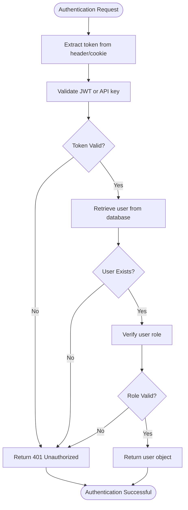
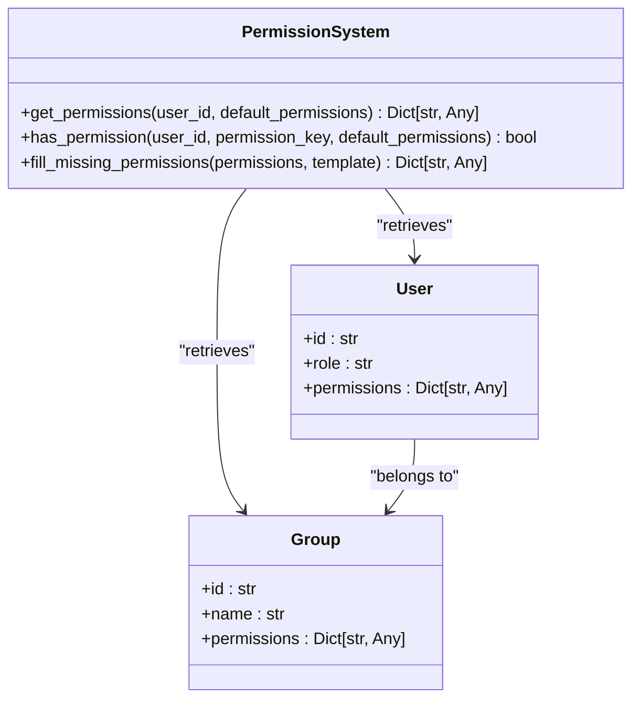
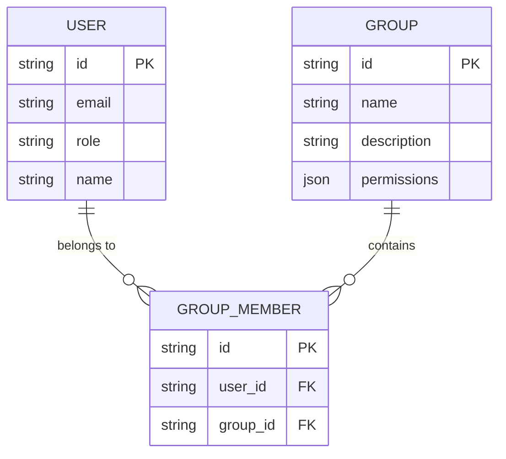
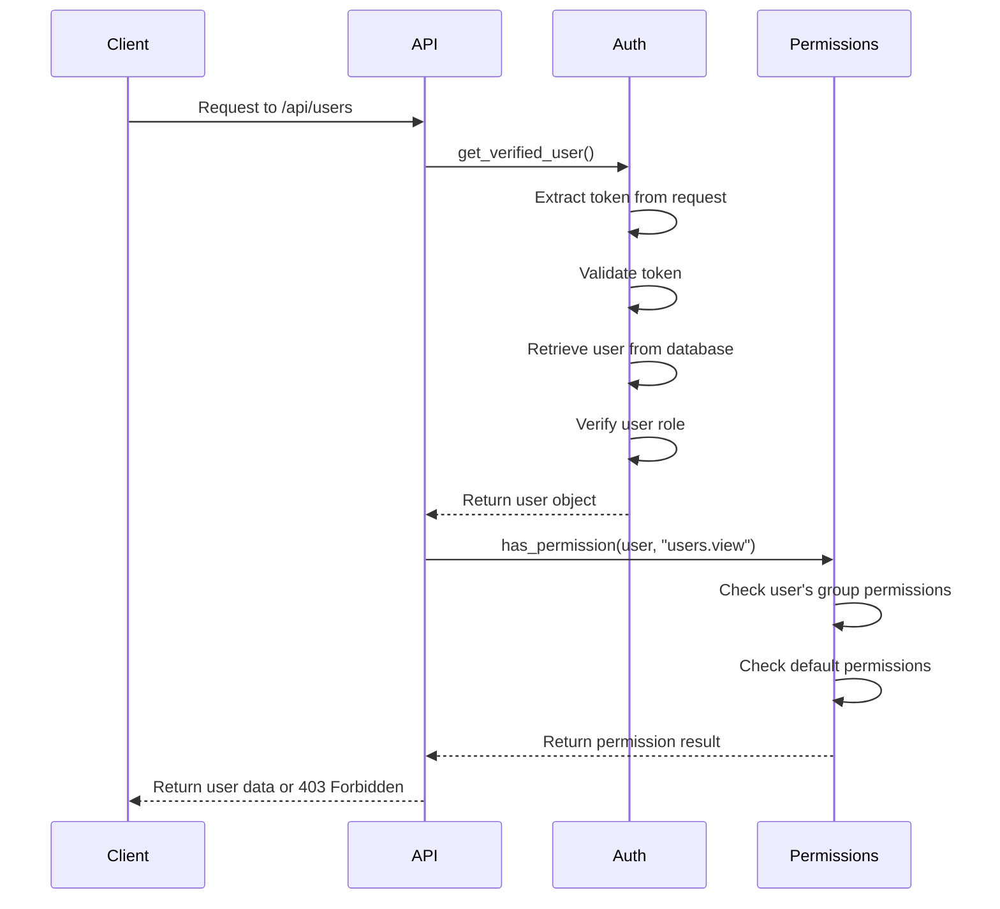

# Authorization Framework

<cite>
**Referenced Files in This Document**   
- [access_control.py](file://backend/open_webui/utils/access_control.py)
- [auth.py](file://backend/open_webui/utils/auth.py)
- [users.py](file://backend/open_webui/models/users.py)
- [groups.py](file://backend/open_webui/models/groups.py)
- [config.py](file://backend/open_webui/config.py)
- [auths.py](file://backend/open_webui/routers/auths.py)
- [users.py](file://backend/open_webui/routers/users.py)
</cite>

## Table of Contents
1. [Introduction](#introduction)
2. [User Roles and Status](#user-roles-and-status)
3. [Authentication Functions](#authentication-functions)
4. [Permission System](#permission-system)
5. [Access Control Implementation](#access-control-implementation)
6. [Group-Based Permissions](#group-based-permissions)
7. [Configuration Options](#configuration-options)
8. [API Endpoint Authorization](#api-endpoint-authorization)
9. [Troubleshooting Authorization Issues](#troubleshooting-authorization-issues)
10. [Conclusion](#conclusion)

## Introduction
The Open WebUI authorization framework implements a comprehensive role-based access control system that manages user permissions through a combination of roles, groups, and hierarchical permission structures. This system ensures secure access to application resources while providing flexibility for administrators to configure and extend permission policies. The framework integrates with authentication mechanisms to verify user identity and enforce access rules across all API endpoints and resources.

## User Roles and Status
The system implements a role-based access control model with three primary user roles: admin, user, and pending. The role system is designed to provide graduated levels of access and functionality within the application.

The "admin" role grants full administrative privileges, allowing users to manage system settings, configure permissions, and access all user data. The "user" role provides standard access to application features with permissions defined by the default user permissions configuration. The "pending" role is assigned to new users during registration, restricting their access until they are verified or approved.

User roles are stored in the database as part of the user model and can be updated through administrative interfaces. The system automatically assigns the "admin" role to the first user created in the system, ensuring there is always at least one administrative account available. Subsequent users are assigned the default role configured in the system settings.

**Section sources**
- [users.py](file://backend/open_webui/models/users.py#L45-L107)
- [auth.py](file://backend/open_webui/utils/auth.py#L403-L418)

## Authentication Functions
The authorization framework provides several dependency functions that handle user authentication and verification. These functions are designed to be used as FastAPI dependencies to protect API endpoints and ensure proper access control.

The `get_current_user` function is the primary authentication mechanism that verifies user credentials from JWT tokens or API keys. It extracts authentication information from request headers or cookies and validates the token against the system's secret key. If the token is valid, it returns the corresponding user object; otherwise, it raises an HTTP 401 Unauthorized exception.

The `get_verified_user` function builds upon `get_current_user` by adding role verification. It ensures that the authenticated user has either "user" or "admin" role, preventing access by users with "pending" status. This function is typically used for endpoints that require verified users but don't need administrative privileges.

The `get_admin_user` function provides the highest level of access control by verifying that the authenticated user has the "admin" role. This function is used for administrative endpoints that require full system privileges.



**Diagram sources **
- [auth.py](file://backend/open_webui/utils/auth.py#L272-L418)

**Section sources**
- [auth.py](file://backend/open_webui/utils/auth.py#L272-L418)

## Permission System
The permission system in Open WebUI implements a hierarchical structure that allows for fine-grained control over user capabilities. Permissions are organized into categories such as workspace, sharing, chat, and features, with each category containing specific permission flags.

The system uses a permission inheritance model where user permissions are derived from their group memberships. Each group can have its own permission configuration, and a user's effective permissions are the combination of permissions from all groups they belong to. When a permission is defined in multiple groups, the most permissive value (True) takes precedence over more restrictive values (False).

Default user permissions are defined in the system configuration and serve as the baseline for all users with the "user" role. Administrators can modify these default permissions through the administrative interface, allowing them to customize the feature set available to standard users.

The permission system supports hierarchical permission keys separated by dots, enabling a tree-like structure for organizing permissions. For example, "chat.controls" and "chat.params" are sub-permissions under the "chat" category. This hierarchical structure allows for both broad category-level checks and specific feature-level checks.



**Diagram sources **
- [access_control.py](file://backend/open_webui/utils/access_control.py#L28-L68)
- [users.py](file://backend/open_webui/models/users.py#L45-L107)
- [groups.py](file://backend/open_webui/models/groups.py#L36-L68)

**Section sources**
- [access_control.py](file://backend/open_webui/utils/access_control.py#L28-L68)
- [config.py](file://backend/open_webui/config.py#L1430-L1495)

## Access Control Implementation
The access control implementation in Open WebUI provides functions for checking resource-level permissions based on user identity, group membership, and access control configurations. The system uses a flexible access control model that supports both user-specific and group-based access rules.

The `has_access` function determines whether a user has permission to perform a specific action (read, write, etc.) on a resource. It evaluates the user's direct permissions, group memberships, and the resource's access control configuration. The function returns true if the user is explicitly listed in the permitted users or if they belong to a group that has access to the resource.

The `get_users_with_access` function retrieves all users who have access to a specific resource, considering both direct user permissions and group memberships. This function is useful for determining which users can view or modify shared resources.

Access control configurations are stored as JSON structures that define permitted user IDs and group IDs for different access types (read, write, etc.). These configurations can be attached to various resources such as models, chats, and files, allowing for granular control over resource sharing and collaboration.

```mermaid
flowchart TD
Start([Access Check]) --> GetAccessControl["Retrieve resource access control"]
GetAccessControl --> AccessControlExists{"Access Control Exists?"}
AccessControlExists --> |No| UseDefault["Use default access rules"]
AccessControlExists --> |Yes| GetPermittedIds["Get permitted user and group IDs"]
UseDefault --> CheckAccessType{"Access Type = 'read'?}
GetPermittedIds --> GetUserGroups["Retrieve user's group memberships"]
CheckAccessType --> |Yes| AllowAccess["Allow access"]
CheckAccessType --> |No| DenyAccess["Deny access"]
GetUserGroups --> CheckMembership["Check if user or user's groups in permitted lists"]
AllowAccess --> End([Access Granted])
DenyAccess --> End([Access Denied])
CheckMembership --> |Yes| AllowAccess
CheckMembership --> |No| DenyAccess
```

**Diagram sources **
- [access_control.py](file://backend/open_webui/utils/access_control.py#L108-L174)
- [models.py](file://backend/open_webui/models/models.py#L213-L223)

**Section sources**
- [access_control.py](file://backend/open_webui/utils/access_control.py#L108-L174)
- [models.py](file://backend/open_webui/models/models.py#L213-L223)

## Group-Based Permissions
The group-based permission system allows administrators to organize users into groups and assign permissions at the group level. This approach simplifies permission management by enabling bulk assignment of capabilities to multiple users simultaneously.

Groups are implemented as first-class entities in the system with their own permissions configuration. When a user is added to a group, they inherit all permissions assigned to that group. A user can belong to multiple groups, and their effective permissions are the union of permissions from all their groups, with the most permissive setting taking precedence.

The system provides functions for managing group memberships, including adding and removing users from groups, creating new groups, and updating group permissions. Administrators can use these functions to implement organizational structures and collaboration workflows within the application.

Group-based permissions are particularly useful for managing access to shared resources such as models, prompts, and tools. By assigning these resources to specific groups, administrators can control which teams or departments have access to particular capabilities.



**Diagram sources **
- [groups.py](file://backend/open_webui/models/groups.py#L36-L84)
- [users.py](file://backend/open_webui/models/users.py#L45-L107)

**Section sources**
- [groups.py](file://backend/open_webui/models/groups.py#L36-L84)
- [access_control.py](file://backend/open_webui/utils/access_control.py#L56-L64)

## Configuration Options
The authorization framework provides several configuration options that allow administrators to customize the system's behavior. These options are exposed through environment variables and can be modified through the administrative interface.

The `DEFAULT_USER_ROLE` configuration determines the role assigned to new users during registration. By default, this is set to "pending", requiring administrative approval before users can access the system. Administrators can change this to "user" to enable self-service registration.

The `ENABLE_OAUTH_ROLE_MANAGEMENT` configuration enables integration with external identity providers for role assignment. When enabled, the system can map roles from OAuth providers to internal roles, allowing for centralized user management.

The `OAUTH_ALLOWED_ROLES` and `OAUTH_ADMIN_ROLES` configurations define which external roles are mapped to the internal "user" and "admin" roles, respectively. This allows organizations to control access based on their existing role hierarchies.

Default user permissions can be configured through the administrative interface, allowing administrators to customize which features are available to standard users. These settings are stored in the database and can be updated without requiring system restarts.

**Section sources**
- [config.py](file://backend/open_webui/config.py#L1172-L1175)
- [config.py](file://backend/open_webui/config.py#L552-L609)
- [auths.py](file://backend/open_webui/routers/auths.py#L989-L990)

## API Endpoint Authorization
API endpoint authorization is implemented through FastAPI dependency injection, using the authentication and verification functions described earlier. Each endpoint specifies its required authorization level by including the appropriate dependency in its function signature.

Endpoints that require any authenticated user use the `get_current_user` dependency. Endpoints that require verified users (with "user" or "admin" role) use the `get_verified_user` dependency. Administrative endpoints use the `get_admin_user` dependency to ensure only administrators can access them.

The system also implements permission-based authorization for specific features. For example, endpoints related to API key management check the "features.api_keys" permission before allowing access, even for authenticated users. This provides an additional layer of security beyond simple role-based access control.

Custom permission checks can be implemented by calling the `has_permission` function within endpoint handlers. This allows for fine-grained control over feature access based on the user's effective permissions.



**Diagram sources **
- [chats.py](file://backend/open_webui/routers/chats.py#L77-L83)
- [users.py](file://backend/open_webui/routers/users.py#L101-L107)
- [auths.py](file://backend/open_webui/routers/auths.py#L171-L172)

**Section sources**
- [chats.py](file://backend/open_webui/routers/chats.py#L77-L83)
- [users.py](file://backend/open_webui/routers/users.py#L101-L107)
- [auths.py](file://backend/open_webui/routers/auths.py#L171-L172)

## Troubleshooting Authorization Issues
Common authorization issues typically fall into several categories: authentication failures, permission denials, and role assignment problems. Understanding these issues and their solutions is essential for maintaining system security and usability.

Authentication failures often occur due to expired or invalid tokens. Users experiencing authentication issues should try logging out and logging back in to refresh their session. Administrators can check the system logs for authentication error messages, which typically include details about the specific failure reason.

Permission denials may occur when users attempt to access features they don't have permission for. This can happen if the default user permissions have been restricted or if the user's group memberships don't grant the necessary permissions. Administrators should verify the user's role and group memberships, and check the permission configuration for the specific feature.

Role assignment issues can occur during user registration or when integrating with external identity providers. If users are not receiving the expected roles, administrators should check the `DEFAULT_USER_ROLE` configuration and, if using OAuth, verify the `ENABLE_OAUTH_ROLE_MANAGEMENT` settings and role mapping configurations.

When troubleshooting authorization issues, administrators should also check for proper configuration of environment variables related to authentication and authorization. Missing or incorrect values for variables like `WEBUI_SECRET_KEY` or `OAUTH_CLIENT_ID` can prevent proper authentication and role assignment.

**Section sources**
- [auth.py](file://backend/open_webui/utils/auth.py#L304-L318)
- [oauth.py](file://backend/open_webui/utils/oauth.py#L1002-L1074)
- [constants.py](file://backend/open_webui/constants.py#L43-L56)

## Conclusion
The Open WebUI authorization framework provides a robust and flexible system for managing user access and permissions. By combining role-based access control with group-based permissions and hierarchical permission structures, the system offers both security and flexibility. The framework's integration with authentication mechanisms and its implementation through FastAPI dependencies ensure consistent enforcement of access rules across all application endpoints. Administrators can customize the system's behavior through configuration options and the administrative interface, allowing them to adapt the authorization model to their specific organizational needs.