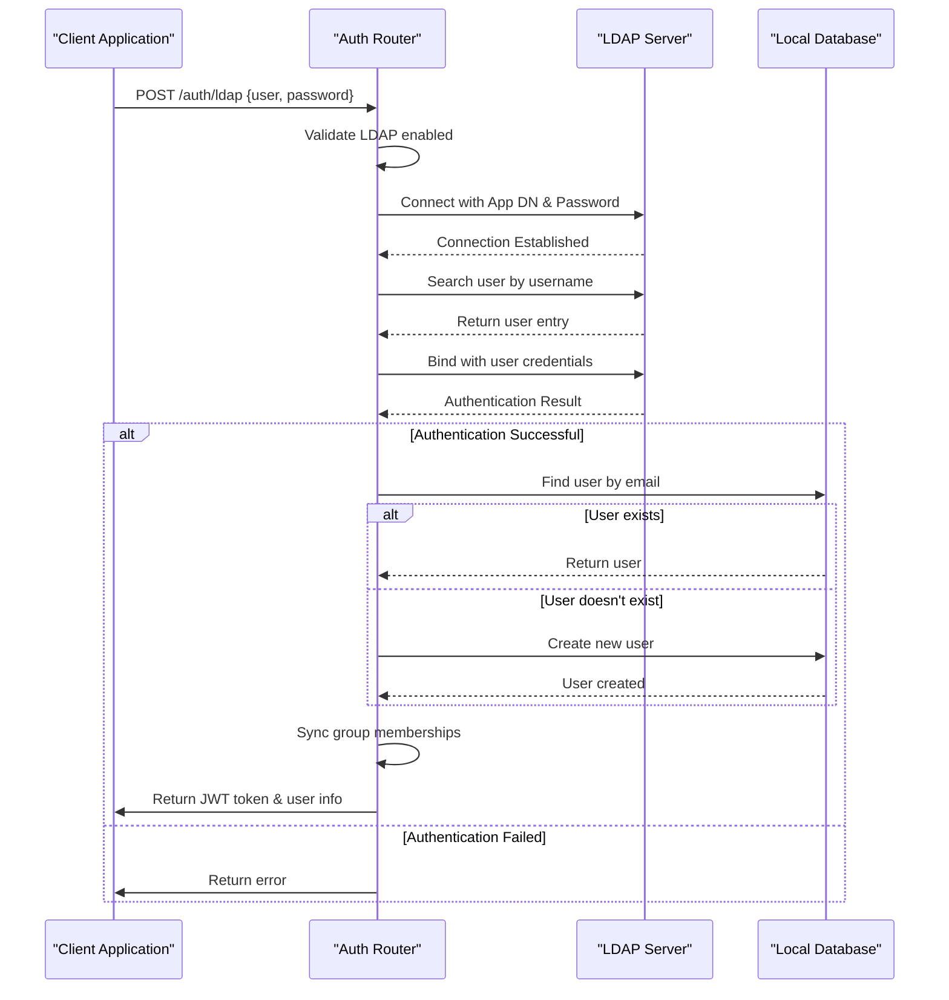
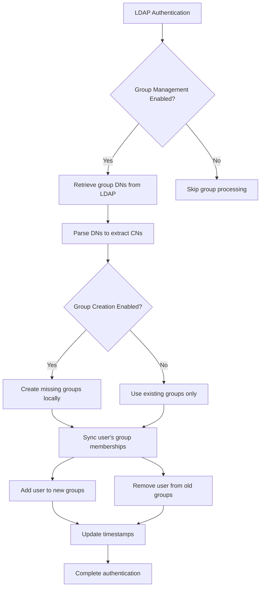

# LDAP Authentication

<cite>
**Referenced Files in This Document**   
- [auths.py](file://backend/open_webui/routers/auths.py)
- [auths.py](file://backend/open_webui/models/auths.py)
- [config.py](file://backend/open_webui/config.py)
- [users.py](file://backend/open_webui/models/users.py)
- [groups.py](file://backend/open_webui/models/groups.py)
</cite>

## Table of Contents
1. [Introduction](#introduction)
2. [LdapForm Model](#ldapform-model)
3. [LDAP Authentication Endpoint](#ldap-authentication-endpoint)
4. [Connection Configuration](#connection-configuration)
5. [User Provisioning](#user-provisioning)
6. [Group Synchronization](#group-synchronization)
7. [Configuration Options](#configuration-options)
8. [Common Directory Service Examples](#common-directory-service-examples)
9. [Troubleshooting Guide](#troubleshooting-guide)

## Introduction
The LDAP Authentication feature enables enterprise users to authenticate against LDAP/Active Directory servers. This integration allows organizations to leverage their existing directory services for user authentication and group management within the application. The implementation supports secure connections via TLS/SSL, certificate validation, and comprehensive group synchronization capabilities. The system is designed to work seamlessly with various directory services while providing administrators with extensive configuration options to tailor the integration to their specific environment requirements.

**Section sources**
- [auths.py](file://backend/open_webui/routers/auths.py#L218-L500)
- [config.py](file://backend/open_webui/config.py#L3740-L3839)

## LdapForm Model
The LdapForm model defines the data structure for LDAP authentication requests. It contains two essential fields: 'user' and 'password'. The 'user' field represents the username or identifier used to locate the user in the LDAP directory, while the 'password' field contains the user's credentials for authentication. This model is used as the request body for the LDAP authentication endpoint, ensuring proper validation and type safety for incoming authentication requests. The model is implemented using Pydantic's BaseModel, providing automatic data validation and serialization capabilities.

**Section sources**
- [auths.py](file://backend/open_webui/models/auths.py#L58-L61)

## LDAP Authentication Endpoint
The LDAP authentication endpoint processes user authentication requests against the configured LDAP server. When a request is received, the system first verifies that LDAP authentication is enabled and password authentication is allowed. It then establishes a connection to the LDAP server using the application credentials (bind DN and password) to search for the user. The search operation uses configurable attributes for username and email lookup, combined with optional search filters. Once the user is located, a separate bind operation is performed using the user's provided credentials to verify authentication. Upon successful authentication, the system either retrieves an existing user from the local database or creates a new user account, provisions group memberships, and returns a JWT token for session management.

**Diagram sources**
- [auths.py](file://backend/open_webui/routers/auths.py#L218-L500)
- [auths.py](file://backend/open_webui/models/auths.py#L58-L61)

**Section sources**
- [auths.py](file://backend/open_webui/routers/auths.py#L218-L500)

## Connection Configuration
The LDAP connection configuration includes several key parameters that define how the application connects to the LDAP server. The connection is established using the LDAP server host and port, with support for both standard (389) and LDAPS (636) ports. The system supports TLS/SSL encryption for secure communication, with configurable certificate validation options. The application connects to the LDAP server using a service account (bind DN and password) specified in the configuration. This service account must have sufficient permissions to search for users and read their attributes. The connection process includes TLS configuration with options for certificate authority files and cipher specifications, ensuring secure and compliant communication with the directory server.

**Section sources**
- [config.py](file://backend/open_webui/config.py#L3740-L3839)
- [auths.py](file://backend/open_webui/routers/auths.py#L231-L249)

## User Provisioning
User provisioning occurs when an LDAP-authenticated user does not already exist in the local database. The system automatically creates a new user account using information retrieved from the LDAP directory, including the user's email, username, and common name (CN). The local password field is populated with a randomly generated UUID since authentication is handled by the LDAP server. New users are assigned a default role, typically "user", unless they are the first user created, in which case they receive the "admin" role. The provisioning process also applies default group assignments based on the system configuration. This automatic provisioning ensures that users can seamlessly access the application after successful LDAP authentication without requiring manual account creation by administrators.

**Section sources**
- [auths.py](file://backend/open_webui/routers/auths.py#L400-L434)
- [users.py](file://backend/open_webui/models/users.py#L238-L269)
- [groups.py](file://backend/open_webui/utils/groups.py#L7-L25)

## Group Synchronization
Group synchronization enables the application to reflect LDAP group memberships in its local permission system. When enabled, the system retrieves the user's group memberships from the LDAP directory using the configured group attribute (typically 'memberOf'). The distinguished names (DNs) of the groups are parsed to extract the common names (CNs), which are then used to manage local group assignments. The synchronization process supports two modes: creation and management. When group creation is enabled, any LDAP groups that don't exist locally are automatically created. The system then ensures the user's group memberships in the local database match their LDAP group memberships by adding missing groups and removing groups the user no longer belongs to. This bidirectional synchronization keeps user permissions up-to-date with changes in the directory service.

**Diagram sources**
- [auths.py](file://backend/open_webui/routers/auths.py#L326-L387)
- [groups.py](file://backend/open_webui/models/groups.py#L405-L464)

**Section sources**
- [auths.py](file://backend/open_webui/routers/auths.py#L326-L482)
- [groups.py](file://backend/open_webui/models/groups.py#L405-L464)

## Configuration Options
The LDAP integration provides extensive configuration options through environment variables and persistent settings. Key configuration parameters include the LDAP server host and port, bind credentials (DN and password), and search base for locating users. The system allows customization of attribute names used for email, username, and group membership lookups, enabling compatibility with various directory schemas. Security settings include TLS/SSL configuration with options for certificate validation and custom CA certificate files. Administrators can control group management behavior through flags that enable or disable group synchronization and automatic group creation. These configuration options can be set via environment variables at startup or updated dynamically through the administration interface, providing flexibility for different deployment scenarios.

**Section sources**
- [config.py](file://backend/open_webui/config.py#L3740-L3839)
- [auths.py](file://backend/open_webui/routers/auths.py#L1055-L1106)

## Common Directory Service Examples
The LDAP integration supports various directory services with appropriate configuration. For Active Directory, the typical configuration uses port 389 (or 636 for LDAPS), with the userPrincipalName or sAMAccountName attribute for username lookup and userPrincipalName for email. The search base is typically set to the Users container or a specific organizational unit. For OpenLDAP, the configuration often uses uid for username lookup and mail for email, with the search base pointing to the appropriate organizational unit. Google Workspace LDAP requires specific configuration with Google's LDAP gateway settings, including the domain-based host name and appropriate service account credentials. Each directory service may require specific attribute mappings and search filters to ensure proper user lookup and attribute retrieval.

**Section sources**
- [config.py](file://backend/open_webui/config.py#L3740-L3839)
- [auths.py](file://backend/open_webui/routers/auths.py#L231-L249)

## Troubleshooting Guide
Common issues with LDAP authentication typically fall into connectivity, authentication, or group synchronization categories. Connectivity problems often stem from incorrect server host or port configuration, firewall restrictions, or TLS/SSL certificate issues. Authentication failures may occur due to incorrect bind credentials, user not found in the search base, or password policy violations. Group synchronization issues can arise from incorrect group attribute configuration or insufficient permissions to read group membership information. To troubleshoot connectivity issues, verify network connectivity to the LDAP server and validate TLS/SSL settings, including certificate trust chains. For authentication problems, confirm the bind DN and password are correct and that the search base includes the user's location in the directory. When experiencing group synchronization issues, verify the group attribute name matches the directory schema and that the bind account has permission to read group membership attributes.

**Section sources**
- [auths.py](file://backend/open_webui/routers/auths.py#L251-L261)
- [auths.py](file://backend/open_webui/routers/auths.py#L277-L278)
- [auths.py](file://backend/open_webui/routers/auths.py#L306-L307)
- [auths.py](file://backend/open_webui/routers/auths.py#L397-L398)
- [auths.py](file://backend/open_webui/routers/auths.py#L497-L499)