# Local Authentication

<cite>
**Referenced Files in This Document**   
- [auths.py](file://backend/open_webui/routers/auths.py)
- [auths.py](file://backend/open_webui/models/auths.py)
- [auth.py](file://backend/open_webui/utils/auth.py)
- [rate_limit.py](file://backend/open_webui/utils/rate_limit.py)
- [config.py](file://backend/open_webui/config.py)
- [constants.py](file://backend/open_webui/constants.py)
- [+page.svelte](file://src/routes/auth/+page.svelte)
- [index.ts](file://src/lib/apis/auths/index.ts)
- [SensitiveInput.svelte](file://src/lib/components/common/SensitiveInput.svelte)
</cite>

## Table of Contents
1. [Introduction](#introduction)
2. [Authentication Models](#authentication-models)
3. [Password Management](#password-management)
4. [Authentication Endpoints](#authentication-endpoints)
5. [Rate Limiting Mechanism](#rate-limiting-mechanism)
6. [Configuration Options](#configuration-options)
7. [Authentication Flows](#authentication-flows)
8. [Troubleshooting Guide](#troubleshooting-guide)

## Introduction
The Local Authentication system in Open WebUI provides a secure email/password authentication mechanism for user access. This system implements industry-standard security practices including bcrypt password hashing, JWT token generation, and rate limiting to protect against brute force attacks. The authentication system is designed to be flexible, supporting both local password authentication and integration with external authentication providers. This documentation details the implementation of the local authentication sub-feature, covering the SigninForm and SignupForm models, password hashing with bcrypt, JWT token generation, and the configuration options that control authentication behavior.

**Section sources**
- [auths.py](file://backend/open_webui/routers/auths.py#L1-L1185)
- [auths.py](file://backend/open_webui/models/auths.py#L1-L199)

## Authentication Models

### SigninForm and SignupForm Models
The authentication system utilizes two primary Pydantic models for handling user authentication data: SigninForm and SignupForm. The SigninForm model, defined in the auths.py file, contains two fields: email (string) and password (string), representing the credentials required for user sign-in. The SignupForm model extends this with additional user information, including name (string), email (string), password (string), and an optional profile_image_url with a default value of "/user.png". These models serve as the data transfer objects between the frontend and backend, ensuring type safety and data validation.

The frontend implementation in the +page.svelte file uses Svelte components to capture user input, with the SensitiveInput component providing password masking functionality. The form data is then transmitted to the backend via API calls defined in the index.ts file, which handles the communication between the frontend and the authentication endpoints.

**Diagram sources **
- [auths.py](file://backend/open_webui/models/auths.py#L53-L77)
- [+page.svelte](file://src/routes/auth/+page.svelte#L30-L35)

**Section sources**
- [auths.py](file://backend/open_webui/models/auths.py#L53-L77)
- [+page.svelte](file://src/routes/auth/+page.svelte#L30-L35)

## Password Management

### Password Hashing with Bcrypt
The system implements secure password storage using the bcrypt hashing algorithm, as defined in the auth.py utility file. The get_password_hash function takes a plaintext password as input and returns a bcrypt-hashed version suitable for secure storage. The implementation uses bcrypt.gensalt() to generate a random salt for each password, ensuring that identical passwords result in different hash values. This approach protects against rainbow table attacks and makes brute force attacks significantly more difficult.

The system enforces a maximum password length of 72 bytes, which is a limitation of the bcrypt algorithm. When a password exceeds this length, the system truncates it to 72 bytes before hashing, as indicated by the TODO comment in the code. This limitation is documented in the error message PASSWORD_TOO_LONG, which informs users that passwords must be less than 72 bytes long.

### Password Validation Rules
Password validation is implemented through the validate_password function in auth.py, which performs several checks on user passwords. The primary validation rule enforces the 72-byte length limit of bcrypt. Additionally, the system supports optional regex-based password complexity requirements through the ENABLE_PASSWORD_VALIDATION flag and PASSWORD_VALIDATION_REGEX_PATTERN configuration. When enabled, passwords must match the specified regex pattern, allowing administrators to enforce complexity requirements such as minimum length, required character types, or other security policies.

The frontend enforces password confirmation during signup when the enable_signup_password_confirmation feature flag is enabled. This is implemented in the +page.svelte file, where the signUpHandler function compares the password and confirmPassword fields before submitting the form. This client-side validation provides immediate feedback to users and reduces unnecessary server requests.

```mermaid
flowchart TD
Start([Password Input]) --> LengthCheck["Check password length ≤ 72 bytes"]
LengthCheck --> |Too long| Truncate["Truncate to 72 bytes"]
LengthCheck --> |Valid length| RegexCheck["Check against PASSWORD_VALIDATION_REGEX_PATTERN"]
RegexCheck --> |Pattern match| Hash["Hash with bcrypt"]
RegexCheck --> |Pattern mismatch| Error["Return INVALID_PASSWORD error"]
Truncate --> RegexCheck
Hash --> Store["Store hashed password in database"]
Error --> Client["Return error to client"]
```

**Diagram sources **
- [auth.py](file://backend/open_webui/utils/auth.py#L163-L179)
- [auths.py](file://backend/open_webui/routers/auths.py#L666-L670)
- [+page.svelte](file://src/routes/auth/+page.svelte#L69-L74)

**Section sources**
- [auth.py](file://backend/open_webui/utils/auth.py#L163-L179)
- [auths.py](file://backend/open_webui/routers/auths.py#L666-L670)

## Authentication Endpoints

### Signin Endpoint
The signin endpoint, implemented as a POST request to /auths/signin, handles user authentication with email and password credentials. The endpoint first checks if password authentication is enabled via the ENABLE_PASSWORD_AUTH configuration. If enabled, it applies rate limiting to prevent brute force attacks, allowing 15 attempts within a 3-minute window. The authentication process involves verifying the provided password against the stored bcrypt hash using the authenticate_user method of the AuthsTable class.

Upon successful authentication, the system generates a JWT token using the create_token function, which includes the user's ID as a claim and sets an expiration based on the JWT_EXPIRES_IN configuration. The token is returned in the response along with user information such as email, name, role, and permissions. The token is also set as an HTTP-only cookie for browser-based clients, with SameSite and Secure attributes configured according to the WEBUI_AUTH_COOKIE_SAME_SITE and WEBUI_AUTH_COOKIE_SECURE settings.

### Signup Endpoint
The signup endpoint, available at /auths/signup, allows new users to create accounts. The endpoint checks several preconditions before allowing registration, including whether signup is enabled (ENABLE_SIGNUP), whether the login form is enabled (ENABLE_LOGIN_FORM), and whether initial admin signup is allowed (ENABLE_INITIAL_ADMIN_SIGNUP). The system validates the email format and checks for existing users with the same email address to prevent duplication.

During user creation, the system hashes the password using bcrypt before storing it in the database. The first user created is automatically assigned the "admin" role, while subsequent users receive the default role specified in DEFAULT_USER_ROLE. After the first user is created, the system automatically disables further signups by setting ENABLE_SIGNUP to False, preventing additional user registration unless explicitly re-enabled by an administrator.

**Diagram sources **
- [auths.py](file://backend/open_webui/routers/auths.py#L507-L632)
- [auths.py](file://backend/open_webui/routers/auths.py#L639-L751)
- [auth.py](file://backend/open_webui/utils/auth.py#L194-L205)

**Section sources**
- [auths.py](file://backend/open_webui/routers/auths.py#L507-L751)

## Rate Limiting Mechanism
The authentication system implements a rate limiting mechanism to protect against brute force attacks on the signin endpoint. The RateLimiter class, defined in rate_limit.py, uses a rolling window strategy with Redis as the primary storage backend, falling back to in-memory storage if Redis is not available. The rate limiter is configured to allow 15 sign-in attempts within a 3-minute window (5 attempts per minute), as defined by the signin_rate_limiter instance in auths.py.

The rate limiting is applied at the signin endpoint before any authentication processing occurs. If a user exceeds the rate limit, the system returns a 429 Too Many Requests HTTP status code with the RATE_LIMIT_EXCEEDED error message. The implementation uses Redis's INCR command to increment a counter for each attempt, with automatic expiration set to ensure that old attempts are automatically removed from consideration.

The rate limiting system is designed to be resilient, gracefully handling cases where Redis is unavailable by falling back to in-memory storage. This ensures that the authentication system remains functional even if the Redis service is temporarily unavailable, while still providing protection against brute force attacks.

**Diagram sources **
- [rate_limit.py](file://backend/open_webui/utils/rate_limit.py#L6-L140)
- [auths.py](file://backend/open_webui/routers/auths.py#L86-L88)
- [auths.py](file://backend/open_webui/routers/auths.py#L568-L572)

**Section sources**
- [rate_limit.py](file://backend/open_webui/utils/rate_limit.py#L6-L140)

## Configuration Options
The local authentication system is controlled by several configuration options that can be set through environment variables or the application's configuration interface. The ENABLE_PASSWORD_AUTH environment variable is the primary switch that enables or disables password-based authentication entirely. When set to false, the signin and signup endpoints return a 403 Forbidden status, preventing password authentication regardless of other settings.

Additional configuration options include ENABLE_SIGNUP, which controls whether new users can register accounts; ENABLE_LOGIN_FORM, which determines whether the login form is displayed in the UI; and JWT_EXPIRES_IN, which sets the expiration time for JWT tokens (defaulting to "4w" for 4 weeks). The DEFAULT_USER_ROLE configuration specifies the role assigned to new users, while ENABLE_INITIAL_ADMIN_SIGNUP controls whether the initial admin user can be created through signup.

These configuration options are implemented as PersistentConfig objects in config.py, allowing them to be modified at runtime through the admin interface and persisting across application restarts. The configuration system also supports environment variable overrides, enabling different settings for development, testing, and production environments.

**Section sources**
- [config.py](file://backend/open_webui/config.py#L1105-L1184)
- [auths.py](file://backend/open_webui/routers/auths.py#L45-L48)

## Authentication Flows
The local authentication system supports several practical authentication flows for different use cases. For standard user login, the flow begins with the user entering their email and password in the frontend form, which submits a POST request to the /auths/signin endpoint. Upon successful authentication, the frontend stores the JWT token in localStorage and redirects the user to the application interface.

For new user registration, the signup flow requires the user to provide their name, email, and password. The system validates the email format and checks for existing accounts before creating a new user with a bcrypt-hashed password. After successful registration, the system automatically authenticates the user and returns a JWT token, providing a seamless transition from signup to application access.

API clients can authenticate using the same endpoints, passing credentials in the request body and receiving a JWT token for subsequent authenticated requests. The token can be included in the Authorization header as a Bearer token or sent as a cookie, depending on the client's capabilities.

**Section sources**
- [auths.py](file://backend/open_webui/routers/auths.py#L507-L751)
- [+page.svelte](file://src/routes/auth/+page.svelte#L59-L84)
- [index.ts](file://src/lib/apis/auths/index.ts#L257-L287)

## Troubleshooting Guide
This section addresses common issues encountered with the local authentication system and provides guidance for resolution.

### Invalid Credentials
When users receive the "INVALID_CRED" error (detailed as "The email or password provided is incorrect"), verify that the email and password are entered correctly, paying attention to case sensitivity and special characters. Ensure that the user has completed the signup process successfully and that their account is active. Check the application logs for authentication attempts to identify patterns of failed logins.

### Rate Limiting Issues
If users encounter the "RATE_LIMIT_EXCEEDED" error, they must wait for the rate limit window to expire before attempting to sign in again. The default window is 3 minutes with a limit of 15 attempts. Administrators can adjust these settings by modifying the signin_rate_limiter configuration. For immediate access, administrators can manually clear the rate limit counter in Redis using the key pattern "ratelimit:{email}:{bucket_index}".

### Password Complexity Requirements
When users receive password validation errors, ensure their password meets the requirements defined by the PASSWORD_VALIDATION_REGEX_PATTERN. If no custom pattern is set, the only requirement is that the password does not exceed 72 bytes in length. For passwords longer than 72 bytes, users should create a shorter password, as the system will truncate longer passwords without notification.

### Configuration-Related Issues
If password authentication appears to be disabled despite correct configuration, verify that the ENABLE_PASSWORD_AUTH environment variable is set to "true" and that there are no conflicting settings in the application's persistent configuration. Check that the web server is properly reloading environment variables after configuration changes.

**Section sources**
- [constants.py](file://backend/open_webui/constants.py#L23-L53)
- [auths.py](file://backend/open_webui/routers/auths.py#L568-L572)
- [auth.py](file://backend/open_webui/utils/auth.py#L168-L179)