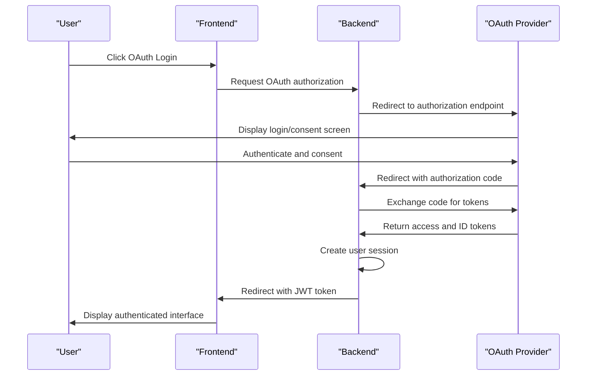
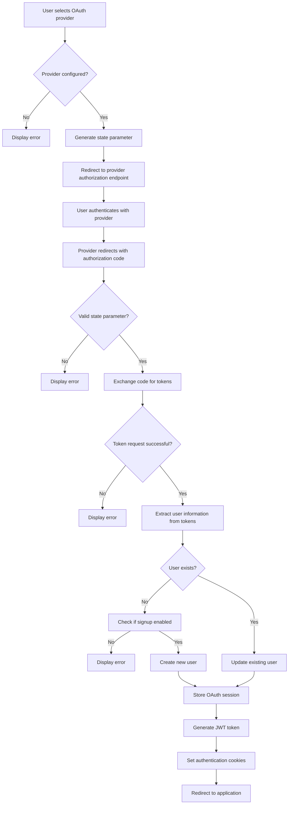
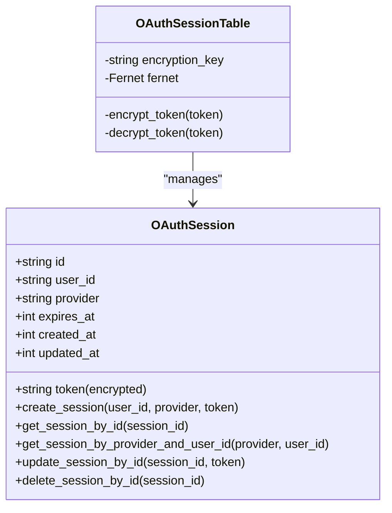
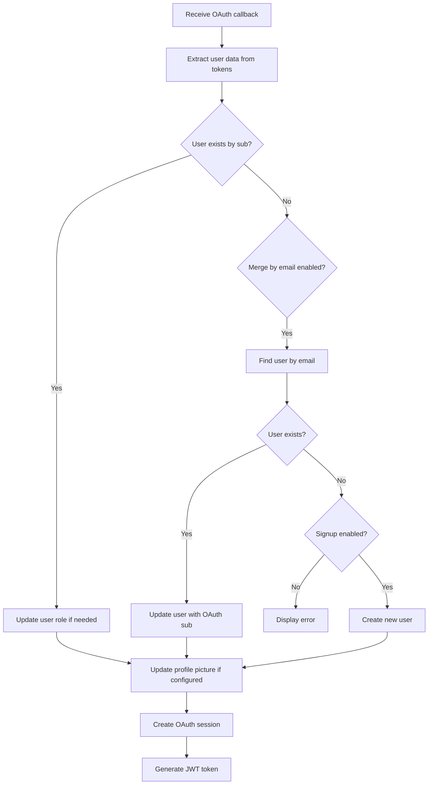

# OAuth Authentication

<cite>
**Referenced Files in This Document**   
- [oauth.py](file://backend/open_webui/utils/oauth.py)
- [oauth_sessions.py](file://backend/open_webui/models/oauth_sessions.py)
- [auths.py](file://backend/open_webui/routers/auths.py)
- [config.py](file://backend/open_webui/config.py)
- [env.py](file://backend/open_webui/env.py)
- [main.py](file://backend/open_webui/main.py)
</cite>

## Table of Contents
1. [Introduction](#introduction)
2. [OAuth Implementation](#oauth-implementation)
3. [Configuration Options](#configuration-options)
4. [OAuth Flow](#oauth-flow)
5. [Session Management](#session-management)
6. [User Provisioning and Profile Synchronization](#user-provisioning-and-profile-synchronization)
7. [Provider-Specific Integration](#provider-specific-integration)
8. [Troubleshooting Common Issues](#troubleshooting-common-issues)
9. [Conclusion](#conclusion)

## Introduction
The OAuth Authentication system in Open WebUI provides secure integration with external identity providers such as Google, Microsoft, and GitHub. This implementation enables users to authenticate using their existing accounts from these providers, streamlining the login process while maintaining security standards. The system supports OpenID Connect (OIDC) protocols and includes comprehensive features for session management, user provisioning, and profile synchronization. Configuration options allow administrators to control signup policies, role management, and group assignments based on OAuth claims.

## OAuth Implementation

The OAuth implementation in Open WebUI is built on the Authlib library, specifically using the Starlette integration for OAuth client functionality. The system supports multiple OAuth providers through a modular configuration approach that allows for easy addition of new providers. The core components include the OAuthManager class, which handles the authentication flow, and the OAuthSessions model, which securely stores OAuth tokens.

The implementation follows the OAuth 2.0 authorization code flow with PKCE (Proof Key for Code Exchange) support, providing enhanced security against authorization code interception attacks. When a user initiates login through an OAuth provider, the system redirects to the provider's authorization endpoint with appropriate parameters including state, nonce, and code challenge when supported by the provider.



**Diagram sources**
- [main.py](file://backend/open_webui/main.py#L2235-L2249)
- [oauth.py](file://backend/open_webui/utils/oauth.py#L1263-L1274)

**Section sources**
- [oauth.py](file://backend/open_webui/utils/oauth.py#L807-L1581)
- [main.py](file://backend/open_webui/main.py#L2235-L2249)

## Configuration Options

The OAuth system provides extensive configuration options through environment variables and persistent configuration settings. These options control various aspects of the OAuth integration, including provider credentials, claim mappings, and security policies.

### Environment Variables
The following environment variables configure the OAuth system:

| Environment Variable | Description | Default Value |
|----------------------|-------------|---------------|
| ENABLE_OAUTH_SIGNUP | Enables user registration through OAuth providers | false |
| OAUTH_CLIENT_INFO_ENCRYPTION_KEY | Encryption key for OAuth client information | WEBUI_SECRET_KEY |
| OAUTH_SESSION_TOKEN_ENCRYPTION_KEY | Encryption key for OAuth session tokens | WEBUI_SECRET_KEY |
| ENABLE_OAUTH_EMAIL_FALLBACK | Enables email fallback when provider doesn't supply email | false |
| ENABLE_OAUTH_ID_TOKEN_COOKIE | Sets ID token in cookie for frontend access | true |
| OAUTH_TIMEOUT | Timeout for OAuth requests in seconds | "" (no timeout) |

### Persistent Configuration
The system uses PersistentConfig objects to store configuration that can be updated at runtime:

```python
ENABLE_OAUTH_SIGNUP = PersistentConfig(
    "ENABLE_OAUTH_SIGNUP",
    "oauth.enable_signup",
    os.environ.get("ENABLE_OAUTH_SIGNUP", "False").lower() == "true",
)

OAUTH_MERGE_ACCOUNTS_BY_EMAIL = PersistentConfig(
    "OAUTH_MERGE_ACCOUNTS_BY_EMAIL",
    "oauth.merge_accounts_by_email",
    os.environ.get("OAUTH_MERGE_ACCOUNTS_BY_EMAIL", "False").lower() == "true",
)
```

Additional configuration options include role and group management settings, claim mappings, and domain restrictions that control which users can authenticate.

**Section sources**
- [config.py](file://backend/open_webui/config.py#L331-L629)
- [env.py](file://backend/open_webui/env.py#L488-L505)

## OAuth Flow

The OAuth flow in Open WebUI follows the standard authorization code grant type with additional security measures. The process begins when a user selects an OAuth provider from the login interface, triggering a series of steps that authenticate the user and establish a session.



**Diagram sources**
- [oauth.py](file://backend/open_webui/utils/oauth.py#L1275-L1581)
- [main.py](file://backend/open_webui/main.py#L2247-L2249)

The flow includes several security measures:
- State parameter validation to prevent CSRF attacks
- PKCE (Proof Key for Code Exchange) support for public clients
- Token encryption at rest using Fernet encryption
- Validation of ID tokens when available
- Domain restrictions based on configured allowed domains

When the user accesses the OAuth callback endpoint, the system validates the authorization code, exchanges it for tokens, and processes the user information. The access token is used to retrieve additional user details if not included in the ID token.

**Section sources**
- [oauth.py](file://backend/open_webui/utils/oauth.py#L1275-L1581)
- [main.py](file://backend/open_webui/main.py#L2247-L2249)

## Session Management

The OAuth session management system securely stores OAuth tokens and related information in the database, encrypted using Fernet encryption. The OAuthSessions model handles the creation, retrieval, and deletion of OAuth sessions, ensuring that sensitive token data is protected.

### OAuth Session Model
The OAuthSession database model includes the following fields:
- id: Unique identifier for the session
- user_id: Reference to the user who owns the session
- provider: OAuth provider name (e.g., "google", "microsoft")
- token: Encrypted JSON containing access_token, refresh_token, and other token data
- expires_at: Timestamp when the access token expires
- created_at: Timestamp when the session was created
- updated_at: Timestamp when the session was last updated



**Diagram sources**
- [oauth_sessions.py](file://backend/open_webui/models/oauth_sessions.py#L25-L277)
- [oauth.py](file://backend/open_webui/utils/oauth.py#L155-L164)

The session management system automatically handles token refresh when needed. Before using an access token, the system checks if it will expire within the next 5 minutes. If so, it attempts to refresh the token using the refresh token. This ensures uninterrupted access for users while maintaining security by using short-lived access tokens.

The system also supports multiple OAuth sessions per user, allowing a single user to connect to multiple providers or maintain multiple sessions with the same provider. However, when creating a new session, the system first removes any existing sessions for the same user and provider to prevent duplication.

**Section sources**
- [oauth_sessions.py](file://backend/open_webui/models/oauth_sessions.py#L108-L252)
- [oauth.py](file://backend/open_webui/utils/oauth.py#L552-L626)

## User Provisioning and Profile Synchronization

The user provisioning system in Open WebUI handles the creation and updating of user accounts based on OAuth authentication. When a user authenticates with an OAuth provider, the system either creates a new user account or updates an existing one with information from the OAuth provider.

### User Creation Process
When a new user authenticates via OAuth, the system follows this process:
1. Extract user information from the ID token or user info endpoint
2. Normalize and validate the email address
3. Check if a user with the same email already exists
4. If signup is enabled and email is available, create a new user
5. Assign appropriate role based on OAuth claims or default role
6. Set profile picture if available and configured to update on login
7. Create OAuth session with encrypted tokens



**Diagram sources**
- [oauth.py](file://backend/open_webui/utils/oauth.py#L1375-L1492)
- [auths.py](file://backend/open_webui/routers/auths.py#L639-L747)

### Role and Group Management
The system supports role and group management through OAuth claims. Administrators can configure which claims contain role and group information, and map these to Open WebUI roles and groups.

Role management is controlled by the following configuration options:
- ENABLE_OAUTH_ROLE_MANAGEMENT: Enables role assignment based on OAuth claims
- OAUTH_ROLES_CLAIM: Specifies the claim containing role information
- OAUTH_ALLOWED_ROLES: List of roles that can be assigned to users
- OAUTH_ADMIN_ROLES: List of roles that grant administrative privileges

Group management includes:
- ENABLE_OAUTH_GROUP_MANAGEMENT: Enables group assignment based on OAuth claims
- ENABLE_OAUTH_GROUP_CREATION: Allows creation of new groups from OAuth claims
- OAUTH_GROUPS_CLAIM: Specifies the claim containing group information
- OAUTH_BLOCKED_GROUPS: List of groups that users cannot be assigned to

When a user logs in, the system updates their group memberships based on the current OAuth claims, removing them from groups they no longer belong to and adding them to new groups.

**Section sources**
- [oauth.py](file://backend/open_webui/utils/oauth.py#L1002-L1217)
- [config.py](file://backend/open_webui/config.py#L552-L575)

## Provider-Specific Integration

Open WebUI supports integration with multiple OAuth providers, each with specific configuration requirements and endpoints. The system is designed to be extensible, allowing for easy addition of new providers.

### Google Integration
To integrate with Google OAuth, configure the following environment variables:
- GOOGLE_CLIENT_ID: Your Google OAuth client ID
- GOOGLE_CLIENT_SECRET: Your Google OAuth client secret
- GOOGLE_REDIRECT_URI: The redirect URI registered with Google (typically /oauth/google/callback)

The system uses Google's OpenID Connect discovery document at https://accounts.google.com/.well-known/openid-configuration to automatically configure the authorization and token endpoints.

### Microsoft Integration
For Microsoft Azure AD integration, set these environment variables:
- MICROSOFT_CLIENT_ID: Your Azure AD application (client) ID
- MICROSOFT_CLIENT_SECRET: Your Azure AD application secret
- MICROSOFT_CLIENT_TENANT_ID: Your Azure AD tenant ID
- MICROSOFT_REDIRECT_URI: The redirect URI for your application

The system constructs the OpenID Connect discovery URL using the tenant ID: https://login.microsoftonline.com/{tenant_id}/v2.0/.well-known/openid-configuration

### GitHub Integration
To enable GitHub OAuth:
- GITHUB_CLIENT_ID: Your GitHub OAuth application client ID
- GITHUB_CLIENT_SECRET: Your GitHub OAuth application client secret
- GITHUB_CLIENT_REDIRECT_URI: The redirect URI for your application

Unlike Google and Microsoft, GitHub does not support OpenID Connect natively, so the system uses GitHub's OAuth 2.0 endpoints directly.

### Generic OpenID Connect
For other OpenID Connect providers, use these configuration options:
- OAUTH_CLIENT_ID: The client ID provided by the provider
- OAUTH_CLIENT_SECRET: The client secret provided by the provider
- OPENID_PROVIDER_URL: The base URL of the OpenID Connect provider
- OPENID_REDIRECT_URI: The redirect URI for your application

The system automatically discovers the provider's endpoints using the .well-known/openid-configuration discovery document.

**Section sources**
- [config.py](file://backend/open_webui/config.py#L632-L793)
- [oauth.py](file://backend/open_webui/utils/oauth.py#L632-L793)

## Troubleshooting Common Issues

This section addresses common issues encountered when configuring and using OAuth authentication in Open WebUI.

### Callback Errors
Callback errors typically occur when there's a mismatch between the configured redirect URI and the one used in the authorization request. To resolve:

1. Verify that the redirect URI in your OAuth provider configuration matches exactly with the one used by Open WebUI
2. Check that the WEBUI_URL environment variable is correctly set to your application's base URL
3. Ensure that your reverse proxy (if used) properly forwards the original host and protocol

Common error messages include "redirect_uri_mismatch" and "invalid_request". These indicate that the provider rejected the callback due to URI mismatch.

### Token Expiration
Access tokens have limited lifetimes and will eventually expire. The system automatically handles token refresh using refresh tokens when available. If you encounter token expiration issues:

1. Ensure that your OAuth provider issues refresh tokens (check provider documentation)
2. Verify that the "offline_access" scope is requested if required by the provider
3. Check that the refresh token is being properly stored in the OAuth session

The system attempts to refresh tokens when they are within 5 minutes of expiration, ensuring seamless user experience.

### User Provisioning Failures
User provisioning failures can occur due to several reasons:

- **Email already taken**: When ENABLE_OAUTH_SIGNUP is true but a user with the same email already exists from another authentication method
- **Missing email**: When the OAuth provider doesn't supply an email address and ENABLE_OAUTH_EMAIL_FALLBACK is false
- **Domain restriction**: When the user's email domain is not in the allowed domains list

To resolve provisioning issues:
1. Check the application logs for specific error messages
2. Verify that the required claims (email, name) are being provided by the OAuth provider
3. Adjust configuration settings like ENABLE_OAUTH_EMAIL_FALLBACK as needed

### Configuration Issues
Common configuration problems include:
- Incorrect client ID or secret
- Missing encryption keys (OAUTH_CLIENT_INFO_ENCRYPTION_KEY)
- Misconfigured WEBUI_URL affecting redirect URIs
- Network connectivity issues preventing access to OAuth provider endpoints

Always check the application logs for detailed error messages, which can provide specific information about configuration problems.

**Section sources**
- [oauth.py](file://backend/open_webui/utils/oauth.py#L167-L195)
- [auths.py](file://backend/open_webui/routers/auths.py#L507-L632)

## Conclusion
The OAuth authentication system in Open WebUI provides a robust and secure method for integrating with external identity providers. By supporting standard OAuth 2.0 and OpenID Connect protocols, it enables seamless user authentication while maintaining high security standards. The flexible configuration options allow administrators to tailor the authentication experience to their specific needs, from simple social login to enterprise identity integration. With proper configuration and understanding of the OAuth flow, organizations can provide a convenient and secure authentication experience for their users.