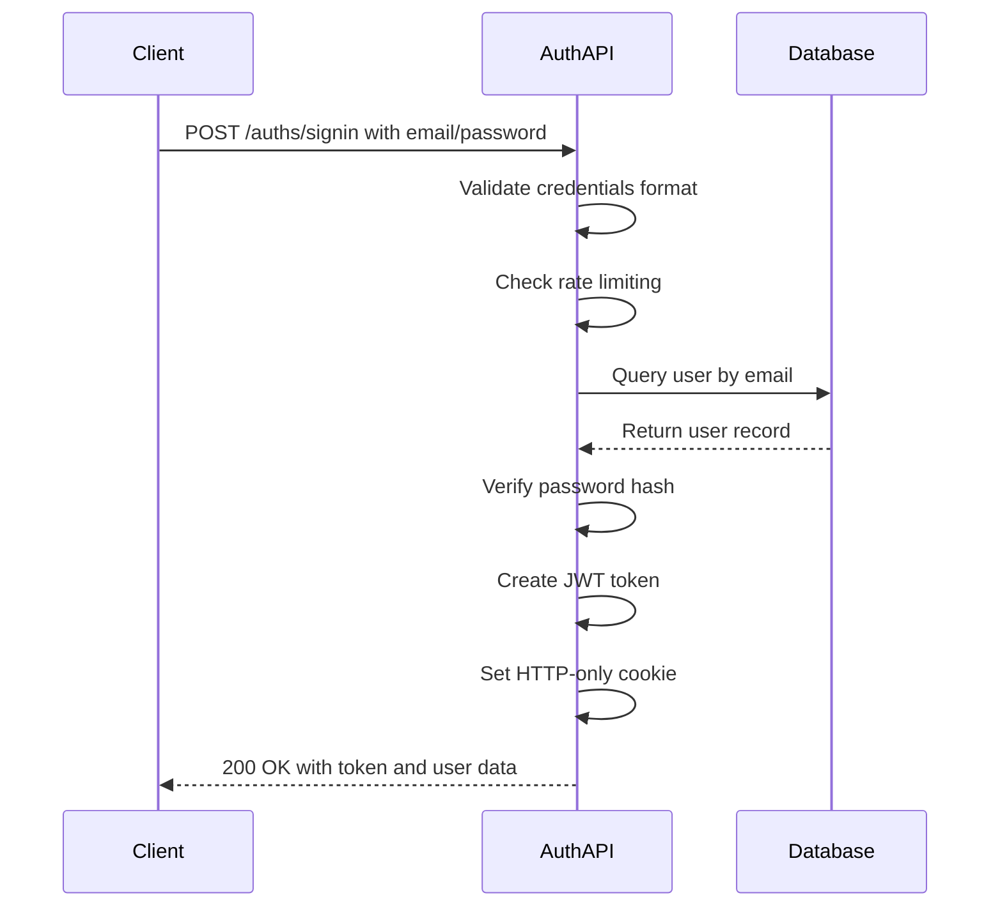
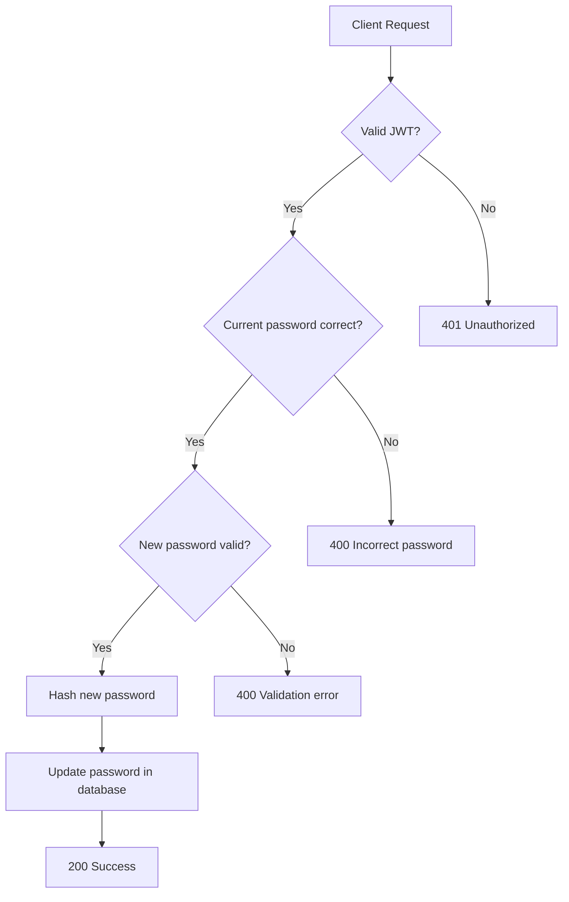
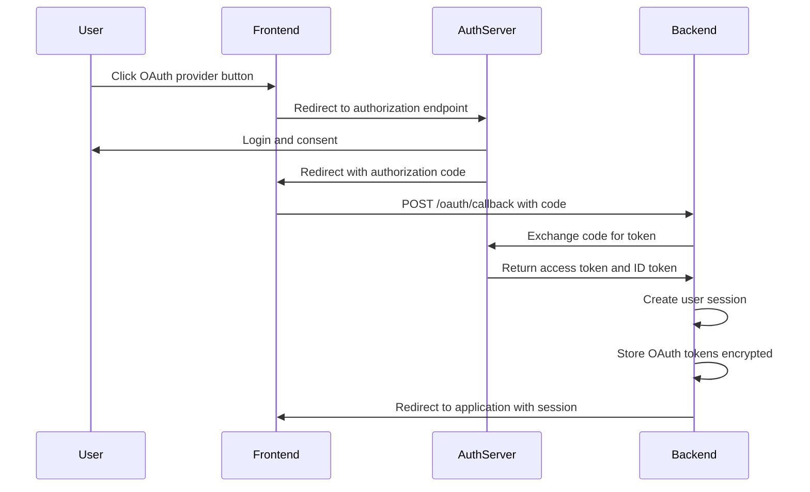
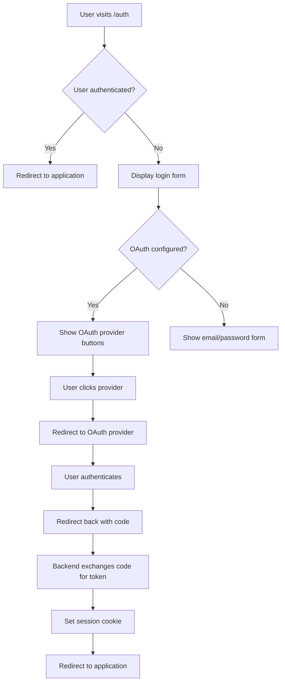

# Authentication API

<cite>
**Referenced Files in This Document**   
- [auths.py](file://backend/open_webui/routers/auths.py)
- [auths.py](file://backend/open_webui/models/auths.py)
- [oauth.py](file://backend/open_webui/utils/oauth.py)
- [auth.py](file://backend/open_webui/utils/auth.py)
- [oauth_sessions.py](file://backend/open_webui/models/oauth_sessions.py)
- [misc.py](file://backend/open_webui/utils/misc.py)
- [config.py](file://backend/open_webui/config.py)
- [index.ts](file://src/lib/apis/auths/index.ts)
- [+page.svelte](file://src/routes/auth/+page.svelte)
</cite>

## Table of Contents
1. [Introduction](#introduction)
2. [Authentication Endpoints](#authentication-endpoints)
3. [Request/Response Schemas](#requestresponse-schemas)
4. [OAuth Integration](#oauth-integration)
5. [Session Management](#session-management)
6. [Security Considerations](#security-considerations)
7. [Frontend Integration](#frontend-integration)
8. [Error Handling](#error-handling)
9. [Configuration](#configuration)

## Introduction
The Authentication API in open-webui provides comprehensive user authentication and authorization functionality, supporting multiple authentication methods including traditional email/password, LDAP, and OAuth integration with popular providers such as Google, GitHub, and Microsoft. The API is designed to securely manage user sessions, implement robust security measures, and integrate seamlessly with the frontend application.

The authentication system is built on JWT (JSON Web Tokens) for session management, with additional support for API keys and OAuth token exchange. It includes features such as password hashing, rate limiting, CSRF protection, and token expiration to ensure security. The API endpoints are organized in the auths.py router and interact with various utility modules for authentication, OAuth handling, and session management.

**Section sources**
- [auths.py](file://backend/open_webui/routers/auths.py#L1-L1185)
- [auth.py](file://backend/open_webui/utils/auth.py#L1-L419)

## Authentication Endpoints

### User Login (Sign In)
The `/auths/signin` endpoint handles user authentication using email and password credentials.

**HTTP Method**: POST  
**URL Pattern**: `/auths/signin`  
**Authentication Mechanism**: JWT (Bearer Token)  

This endpoint validates user credentials against the database, creates a JWT token upon successful authentication, and sets it as an HTTP-only cookie for session management. The endpoint includes rate limiting to prevent brute force attacks, with a limit of 5 attempts every 3 minutes.

When authentication is successful, the API returns a session token along with user information including ID, email, name, role, profile image URL, and permissions. The token is also set as an HTTP-only cookie to prevent XSS attacks.



**Diagram sources**
- [auths.py](file://backend/open_webui/routers/auths.py#L507-L632)

### User Registration (Sign Up)
The `/auths/signup` endpoint enables new users to create an account.

**HTTP Method**: POST  
**URL Pattern**: `/auths/signup`  
**Authentication Mechanism**: None (public endpoint)  

User registration is subject to configuration settings that control whether signups are enabled. The endpoint validates the email format, checks for existing users with the same email, and applies password validation rules. Passwords are hashed using bcrypt before storage, with a maximum length of 72 bytes.

Upon successful registration, the API creates a new user record, generates a JWT token, sets it as a cookie, and returns the token along with user information. If configured, a webhook notification is sent to inform external systems of the new user signup.

**Section sources**
- [auths.py](file://backend/open_webui/routers/auths.py#L639-L750)
- [auths.py](file://backend/open_webui/models/auths.py#L72-L77)

### Password Update
The `/auths/update/password` endpoint allows authenticated users to change their password.

**HTTP Method**: POST  
**URL Pattern**: `/auths/update/password`  
**Authentication Mechanism**: JWT (Bearer Token)  

This endpoint requires the user to provide their current password for verification before setting a new password. It includes validation to ensure the new password meets security requirements. The endpoint is prohibited for users authenticated via trusted headers to prevent conflicts with external authentication systems.



**Diagram sources**
- [auths.py](file://backend/open_webui/routers/auths.py#L191-L213)
- [auths.py](file://backend/open_webui/models/auths.py#L67-L70)

### Session Retrieval
The `/auths/` endpoint retrieves the current user's session information.

**HTTP Method**: GET  
**URL Pattern**: `/auths/`  
**Authentication Mechanism**: JWT (Bearer Token) or Session Cookie  

This endpoint validates the provided token, checks if it has expired, and returns comprehensive user information including session details, profile data, and permissions. The endpoint also refreshes the cookie expiration time to extend the user's session.

**Section sources**
- [auths.py](file://backend/open_webui/routers/auths.py#L106-L161)

### User Sign Out
The `/auths/signout` endpoint terminates the user's session.

**HTTP Method**: GET  
**URL Pattern**: `/auths/signout`  
**Authentication Mechanism**: JWT (Bearer Token) or Session Cookie  

This endpoint invalidates the current session by removing the authentication token from Redis (if configured), deletes the session cookie, and handles OpenID Connect logout if the user authenticated via OAuth. It also clears any OAuth-related cookies to ensure complete session termination.

**Section sources**
- [auths.py](file://backend/open_webui/routers/auths.py#L753-L829)

## Request/Response Schemas

### Pydantic Models
The authentication API uses Pydantic models to define request and response schemas, ensuring type safety and data validation.

#### SigninForm
```python
class SigninForm(BaseModel):
    email: str
    password: str
```
Used for user login requests, validating that both email and password are provided as strings.

#### SignupForm
```python
class SignupForm(BaseModel):
    name: str
    email: str
    password: str
    profile_image_url: Optional[str] = "/user.png"
```
Used for user registration, requiring name, email, and password, with an optional profile image URL that defaults to "/user.png" if not provided.

#### Token
```python
class Token(BaseModel):
    token: str
    token_type: str
```
Base model for authentication tokens, used as a foundation for other response models.

#### SessionUserResponse
```python
class SessionUserResponse(Token, UserProfileImageResponse):
    expires_at: Optional[int] = None
    permissions: Optional[dict] = None
```
Combines token information with user profile data and session expiration details.

#### SessionUserInfoResponse
```python
class SessionUserInfoResponse(SessionUserResponse, UserStatus):
    bio: Optional[str] = None
    gender: Optional[str] = None
    date_of_birth: Optional[datetime.date] = None
```
Extends SessionUserResponse with additional user profile information such as bio, gender, and date of birth.

**Section sources**
- [auths.py](file://backend/open_webui/models/auths.py#L39-L82)

## OAuth Integration

### OAuth Provider Setup
The system supports integration with multiple OAuth providers including Google, GitHub, Microsoft, and generic OpenID Connect providers. Configuration is handled through environment variables that specify client credentials and endpoints.

#### Google OAuth
- **Client ID**: GOOGLE_CLIENT_ID
- **Client Secret**: GOOGLE_CLIENT_SECRET  
- **Scope**: openid email profile (configurable via GOOGLE_OAUTH_SCOPE)
- **Redirect URI**: GOOGLE_REDIRECT_URI
- **Server Metadata URL**: https://accounts.google.com/.well-known/openid-configuration

#### GitHub OAuth
- **Client ID**: GITHUB_CLIENT_ID
- **Client Secret**: GITHUB_CLIENT_SECRET
- **Scope**: user:email (configurable via GITHUB_CLIENT_SCOPE)
- **Redirect URI**: GITHUB_CLIENT_REDIRECT_URI
- **Custom Endpoints**: Uses GitHub's specific OAuth endpoints for token exchange and user information

#### Microsoft OAuth
- **Client ID**: MICROSOFT_CLIENT_ID
- **Client Secret**: MICROSOFT_CLIENT_SECRET
- **Tenant ID**: MICROSOFT_CLIENT_TENANT_ID
- **Scope**: openid email profile (configurable via MICROSOFT_OAUTH_SCOPE)
- **Redirect URI**: MICROSOFT_REDIRECT_URI
- **Login Base URL**: Configurable via MICROSOFT_CLIENT_LOGIN_BASE_URL

#### Generic OpenID Connect
- **Client ID**: OAUTH_CLIENT_ID
- **Client Secret**: OAUTH_CLIENT_SECRET (optional if using PKCE)
- **Provider URL**: OPENID_PROVIDER_URL
- **Redirect URI**: OPENID_REDIRECT_URI
- **Scopes**: Configurable via OAUTH_SCOPES
- **Token Endpoint Auth Method**: Configurable via OAUTH_TOKEN_ENDPOINT_AUTH_METHOD

**Section sources**
- [config.py](file://backend/open_webui/config.py#L346-L793)
- [oauth.py](file://backend/open_webui/utils/oauth.py#L34-L55)

### Token Exchange Process
The OAuth token exchange process follows the Authorization Code flow with PKCE (Proof Key for Code Exchange) when supported by the provider.



The backend handles the token exchange securely, storing the OAuth tokens in an encrypted format in the database. The system supports token refresh using refresh tokens when available, automatically refreshing expired access tokens when needed.

**Diagram sources**
- [oauth.py](file://backend/open_webui/utils/oauth.py#L718-L791)
- [oauth_sessions.py](file://backend/open_webui/models/oauth_sessions.py#L108-L139)

### Group and Role Management
The OAuth system supports synchronization of user roles and groups from the identity provider:

- **Role Mapping**: Configured via OAUTH_ROLES_CLAIM, which specifies the JWT claim containing role information
- **Group Mapping**: Configured via OAUTH_GROUPS_CLAIM, which specifies the JWT claim containing group membership
- **Admin Roles**: Configured via OAUTH_ADMIN_ROLES, which defines which roles grant administrative privileges
- **Allowed Roles**: Configured via OAUTH_ALLOWED_ROLES, which restricts authentication to users with specific roles
- **Blocked Groups**: Configured via OAUTH_BLOCKED_GROUPS, which prevents users in certain groups from authenticating

The system can automatically create groups in the application when ENABLE_OAUTH_GROUP_CREATION is enabled, and sync group membership when ENABLE_OAUTH_GROUP_MANAGEMENT is enabled.

**Section sources**
- [config.py](file://backend/open_webui/config.py#L552-L618)
- [oauth.py](file://backend/open_webui/utils/oauth.py#L35-L45)

## Session Management

### JWT Implementation
The authentication system uses JWT (JSON Web Tokens) for stateless session management. Tokens are created with the following characteristics:

- **Algorithm**: HS256 (HMAC with SHA-256)
- **Secret Key**: WEBUI_SECRET_KEY from environment variables
- **Expiration**: Configurable via JWT_EXPIRES_IN setting (default: 4 weeks)
- **Claims**: Includes user ID (jti), expiration time (exp), and issued at time (iat)

Tokens are validated on each request, with additional checks for token revocation when Redis is configured. The system supports token invalidation by maintaining a blacklist of revoked tokens in Redis, preventing their reuse even before expiration.

### Cookie Configuration
Authentication tokens are stored in HTTP-only cookies with the following security settings:

- **HttpOnly**: True (prevents access via JavaScript)
- **SameSite**: Configurable via WEBUI_AUTH_COOKIE_SAME_SITE (default: Lax)
- **Secure**: Configurable via WEBUI_AUTH_COOKIE_SECURE (requires HTTPS)
- **Expiration**: Matches the token's expiration time

This configuration protects against XSS attacks by preventing JavaScript access to the token, while the SameSite attribute helps prevent CSRF attacks.

### Session Persistence
User sessions are persisted across application restarts through the combination of database storage and Redis caching:

- **Database**: User and authentication records are stored in the SQL database
- **Redis**: Active sessions and revoked tokens are cached in Redis for performance
- **Encryption**: OAuth tokens are encrypted using Fernet before storage in the database

The system also supports trusted header authentication, allowing integration with reverse proxies that handle authentication externally. In this mode, the system trusts headers like WEBUI_AUTH_TRUSTED_EMAIL_HEADER to identify the authenticated user.

**Section sources**
- [auth.py](file://backend/open_webui/utils/auth.py#L51-L53)
- [auths.py](file://backend/open_webui/routers/auths.py#L127-L139)

## Security Considerations

### Password Security
The system implements multiple layers of password security:

- **Hashing**: Passwords are hashed using bcrypt with a randomly generated salt
- **Length Limitation**: Passwords are limited to 72 bytes for bcrypt compatibility
- **Validation**: Optional password strength validation using regex patterns
- **Storage**: Hashed passwords are stored in the database, never plaintext

The password hashing process uses bcrypt's built-in salt generation, ensuring that even identical passwords result in different hash values. The system also includes a password validation function that can enforce complexity requirements when ENABLE_PASSWORD_VALIDATION is enabled.

### Brute Force Protection
The authentication system includes rate limiting to prevent brute force attacks:

- **Signin Rate Limiter**: Limits login attempts to 5 per 3 minutes per email address
- **Implementation**: Uses Redis to track attempt counts and timestamps
- **Bypass**: Trusted header authentication bypasses rate limiting

The rate limiter is implemented using a custom RateLimiter class that integrates with Redis for distributed rate limiting across multiple application instances.

### CSRF Protection
The system implements CSRF protection through multiple mechanisms:

- **SameSite Cookies**: Authentication cookies are configured with SameSite=Lax
- **CSRF Tokens**: Not explicitly implemented but mitigated by SameSite cookies
- **Trusted Origins**: API endpoints validate request origins when possible

The use of SameSite cookies provides protection against CSRF attacks by preventing the browser from sending authentication cookies in cross-site requests.

### Token Security
Multiple measures protect authentication tokens:

- **HTTP-only Cookies**: Prevents XSS attacks from stealing tokens
- **Token Revocation**: Supports invalidating tokens before expiration
- **Short Expiration**: Configurable token expiration times
- **Secure Transmission**: Optional HTTPS enforcement for cookies

The system also supports API keys as an alternative authentication method for programmatic access, with separate permission controls.

**Section sources**
- [auth.py](file://backend/open_webui/utils/auth.py#L163-L180)
- [auths.py](file://backend/open_webui/routers/auths.py#L86-L88)

## Frontend Integration

### API Client Implementation
The frontend implements a comprehensive API client for authentication in `src/lib/apis/auths/index.ts`, providing wrapper functions for all authentication endpoints:

```typescript
export const userSignIn = async (email: string, password: string) => {
    // Implementation details
};

export const userSignUp = async (
    name: string,
    email: string,
    password: string,
    profile_image_url: string
) => {
    // Implementation details
};

export const userSignOut = async () => {
    // Implementation details
};
```

These functions handle HTTP requests, error handling, and response parsing, providing a clean interface for the application components.

### Authentication Flow
The frontend authentication flow is managed by the `+page.svelte` component, which handles the complete user journey:



The component also handles OAuth callback processing by checking for the presence of the token cookie and automatically completing the authentication flow.

### State Management
User authentication state is managed using Svelte stores:

- **user store**: Stores the current user's session data
- **config store**: Stores application configuration including authentication settings
- **socket store**: Manages WebSocket connection with authentication

The stores are updated upon successful authentication and provide reactive data to the application components.

**Section sources**
- [index.ts](file://src/lib/apis/auths/index.ts#L1-L699)
- [+page.svelte](file://src/routes/auth/+page.svelte#L1-L588)

## Error Handling

### Standard Error Responses
The authentication API uses consistent error response formats:

```json
{
    "detail": "Error message describing the issue"
}
```

Common error responses include:

- **400 Bad Request**: Invalid credentials, email format, or password validation failure
- **401 Unauthorized**: Invalid or expired token, authentication required
- **403 Forbidden**: Action prohibited, insufficient permissions
- **404 Not Found**: Resource not found
- **429 Too Many Requests**: Rate limit exceeded
- **500 Internal Server Error**: Unexpected server error

### Specific Error Cases
The system handles various authentication-specific error scenarios:

- **Invalid Credentials**: Returns 400 with "Invalid credentials" message
- **Email Taken**: Returns 400 when attempting to register with an existing email
- **Password Too Long**: Returns 400 when password exceeds 72 bytes
- **Rate Limit Exceeded**: Returns 429 when too many login attempts are made
- **OAuth Callback Errors**: Returns descriptive error messages for OAuth failures

Error messages are defined in the ERROR_MESSAGES constants and are designed to be user-friendly while avoiding disclosure of sensitive information.

**Section sources**
- [auths.py](file://backend/open_webui/routers/auths.py#L122-L125)
- [auths.py](file://backend/open_webui/routers/auths.py#L630-L631)

## Configuration

### Environment Variables
The authentication system is configured through environment variables that control various aspects of behavior:

- **WEBUI_AUTH**: Enables/disables authentication (when false, uses default admin account)
- **ENABLE_PASSWORD_AUTH**: Controls whether email/password authentication is allowed
- **ENABLE_SIGNUP**: Controls whether new user registration is permitted
- **ENABLE_OAUTH_SIGNUP**: Controls whether OAuth users can create new accounts
- **JWT_EXPIRES_IN**: Sets the token expiration duration
- **WEBUI_AUTH_COOKIE_SAME_SITE**: Configures SameSite attribute for cookies
- **WEBUI_AUTH_COOKIE_SECURE**: Requires HTTPS for cookie transmission

### Dynamic Configuration
The system supports runtime configuration changes through admin endpoints:

- **GET /auths/admin/config**: Retrieves current configuration
- **POST /auths/admin/config**: Updates configuration settings
- **GET /auths/admin/config/ldap**: Retrieves LDAP configuration
- **POST /auths/admin/config/ldap**: Updates LDAP configuration

Configuration changes are persisted to the database and broadcast to all application instances when Redis is available, ensuring consistency across a distributed deployment.

**Section sources**
- [config.py](file://backend/open_webui/config.py#L290-L316)
- [auths.py](file://backend/open_webui/routers/auths.py#L925-L1036)