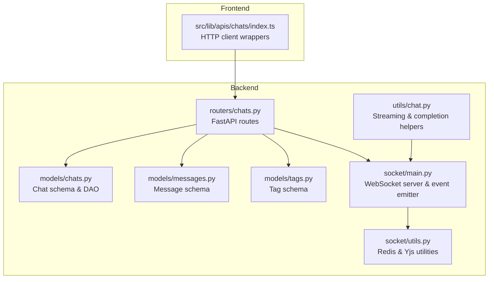
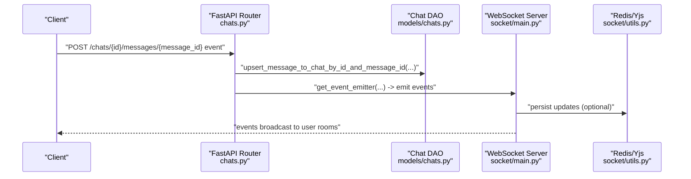
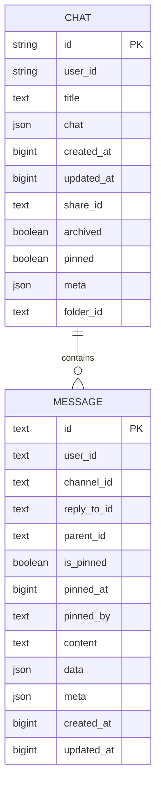
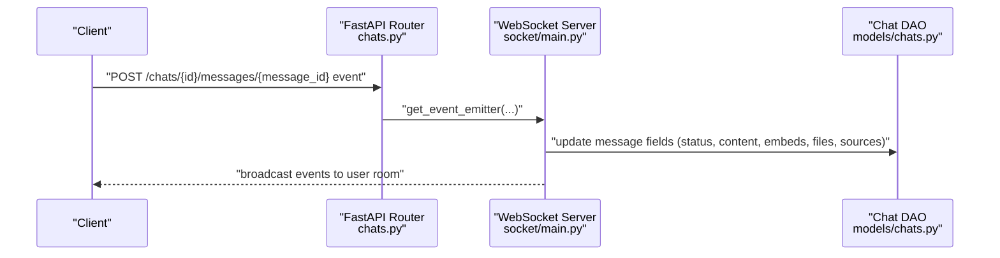
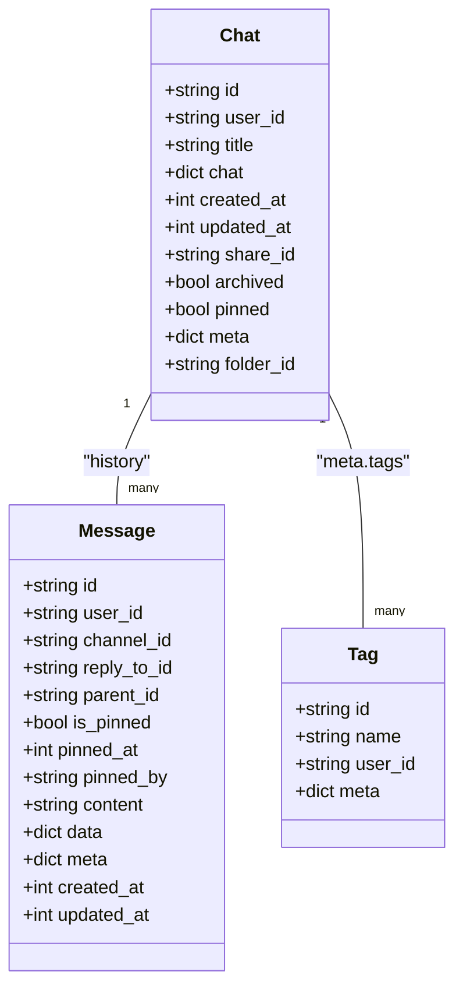
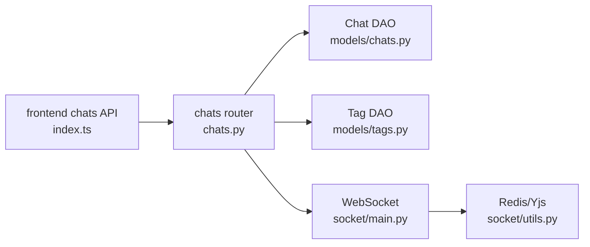
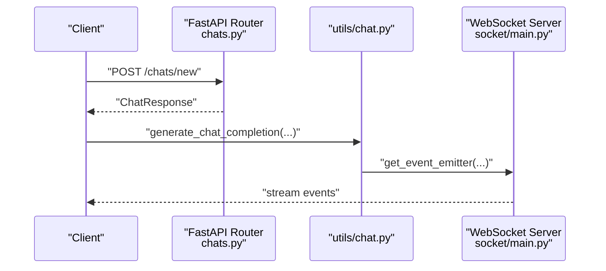

# Chat Management API

<cite>
**Referenced Files in This Document**
- [chats.py](file://backend/open_webui/routers/chats.py)
- [chats.py (models)](file://backend/open_webui/models/chats.py)
- [messages.py](file://backend/open_webui/models/messages.py)
- [tags.py](file://backend/open_webui/models/tags.py)
- [socket/main.py](file://backend/open_webui/socket/main.py)
- [socket/utils.py](file://backend/open_webui/socket/utils.py)
- [chat.py](file://backend/open_webui/utils/chat.py)
- [index.ts (frontend chats API)](file://src/lib/apis/chats/index.ts)
</cite>

## Table of Contents
1. [Introduction](#introduction)
2. [Project Structure](#project-structure)
3. [Core Components](#core-components)
4. [Architecture Overview](#architecture-overview)
5. [Detailed Component Analysis](#detailed-component-analysis)
6. [Dependency Analysis](#dependency-analysis)
7. [Performance Considerations](#performance-considerations)
8. [Troubleshooting Guide](#troubleshooting-guide)
9. [Conclusion](#conclusion)
10. [Appendices](#appendices)

## Introduction
This document describes the Chat Management API in Open WebUI. It covers all RESTful endpoints under the chats router, including creation, retrieval, updates, deletion, archiving, cloning, sharing, tagging, and folder organization. It also explains the chat metadata structure, tagging system, archival functionality, and real-time synchronization via WebSocket events.

## Project Structure
The Chat Management API is implemented in the backend as FastAPI routes and SQLAlchemy-backed models. Frontend clients consume these endpoints through typed API helpers.

**Diagram sources**
- [chats.py](file://backend/open_webui/routers/chats.py#L1-L120)
- [chats.py (models)](file://backend/open_webui/models/chats.py#L1-L120)
- [messages.py](file://backend/open_webui/models/messages.py#L1-L120)
- [tags.py](file://backend/open_webui/models/tags.py#L1-L115)
- [socket/main.py](file://backend/open_webui/socket/main.py#L1-L120)
- [socket/utils.py](file://backend/open_webui/socket/utils.py#L1-L120)
- [chat.py](file://backend/open_webui/utils/chat.py#L1-L120)
- [index.ts (frontend chats API)](file://src/lib/apis/chats/index.ts#L1-L120)

**Section sources**
- [chats.py](file://backend/open_webui/routers/chats.py#L1-L120)
- [chats.py (models)](file://backend/open_webui/models/chats.py#L1-L120)
- [index.ts (frontend chats API)](file://src/lib/apis/chats/index.ts#L1-L120)

## Core Components
- Chat resource model and DAO: defines the chat schema, CRUD operations, search/filtering, and message-level updates.
- Tagging system: associates tags with chats and manages tag lifecycle.
- Message-level updates: supports incremental message edits and streaming updates via WebSocket events.
- Archival and pinning: toggles archive/pinned states and affects visibility and indexing.
- Sharing: creates shared copies of chats with a separate share identifier.
- WebSocket integration: emits and reacts to real-time events for collaborative editing and streaming.

**Section sources**
- [chats.py (models)](file://backend/open_webui/models/chats.py#L1-L120)
- [tags.py](file://backend/open_webui/models/tags.py#L1-L115)
- [socket/main.py](file://backend/open_webui/socket/main.py#L695-L839)

## Architecture Overview
The API exposes REST endpoints for chat management. Many operations trigger WebSocket events to synchronize state across devices. The WebSocket layer integrates with Redis for distributed state and Yjs for collaborative editing.

**Diagram sources**
- [chats.py](file://backend/open_webui/routers/chats.py#L526-L560)
- [chats.py (models)](file://backend/open_webui/models/chats.py#L304-L330)
- [socket/main.py](file://backend/open_webui/socket/main.py#L695-L839)
- [socket/utils.py](file://backend/open_webui/socket/utils.py#L120-L224)

## Detailed Component Analysis

### REST Endpoints Overview
- Base path: /chats
- Authentication: Requires a verified user token; admin privileges enable additional operations.
- Permissions: Some actions require explicit permissions (e.g., delete, share).

Endpoints:
- GET /chats
- DELETE /chats
- GET /chats/list/user/{user_id}
- POST /chats/new
- POST /chats/import
- GET /chats/search
- GET /chats/folder/{folder_id}
- GET /chats/folder/{folder_id}/list
- GET /chats/pinned
- GET /chats/all
- GET /chats/all/archived
- GET /chats/all/tags
- GET /chats/all/db
- GET /chats/archived
- POST /chats/archive/all
- POST /chats/unarchive/all
- GET /chats/share/{share_id}
- POST /chats/tags
- GET /chats/{id}
- POST /chats/{id}
- POST /chats/{id}/messages/{message_id}
- POST /chats/{id}/messages/{message_id}/event
- DELETE /chats/{id}
- GET /chats/{id}/pinned
- POST /chats/{id}/pin
- POST /chats/{id}/clone
- POST /chats/{id}/clone/shared
- POST /chats/{id}/archive
- POST /chats/{id}/share
- DELETE /chats/{id}/share
- POST /chats/{id}/folder
- GET /chats/{id}/tags
- POST /chats/{id}/tags
- DELETE /chats/{id}/tags
- DELETE /chats/{id}/tags/all

Notes:
- Batch operations: DELETE /chats, POST /chats/archive/all, POST /chats/unarchive/all.
- Tagging endpoints: POST /chats/tags, GET /chats/{id}/tags, POST /chats/{id}/tags, DELETE /chats/{id}/tags, DELETE /chats/{id}/tags/all.
- Folder operations: GET /chats/folder/{folder_id}, GET /chats/folder/{folder_id}/list, POST /chats/{id}/folder.
- Sharing: POST /chats/{id}/share, DELETE /chats/{id}/share, GET /chats/share/{share_id}.
- Cloning: POST /chats/{id}/clone, POST /chats/{id}/clone/shared.

**Section sources**
- [chats.py](file://backend/open_webui/routers/chats.py#L38-L942)
- [index.ts (frontend chats API)](file://src/lib/apis/chats/index.ts#L1-L1169)

### Chat Metadata and Message History
- Chat metadata: stored in the meta field of the Chat model. It includes tags, pinned state, folder association, and share identifiers.
- Message history: embedded within chat.chat.history. The DAO supports retrieving and updating individual messages by message_id, including content, statusHistory, files, embeds, sources, and citations.

**Diagram sources**
- [chats.py (models)](file://backend/open_webui/models/chats.py#L26-L76)
- [messages.py](file://backend/open_webui/models/messages.py#L41-L85)

**Section sources**
- [chats.py (models)](file://backend/open_webui/models/chats.py#L26-L120)
- [messages.py](file://backend/open_webui/models/messages.py#L1-L120)

### Tagging System
- Tags are stored separately with a composite primary key (id, user_id).
- Chat meta.tags holds tag identifiers. Operations:
  - GET /chats/{id}/tags: retrieve tags for a chat.
  - POST /chats/{id}/tags: add a tag by name.
  - DELETE /chats/{id}/tags: remove a tag by name.
  - DELETE /chats/{id}/tags/all: clear all tags.
  - POST /chats/tags: list chats by tag name.
  - GET /chats/all/tags: list all tags for the user.

Behavior:
- Adding a tag normalizes the name to lowercase and replaces spaces with underscores.
- Deleting a tag removes it from the chat; if no other chats reference the tag, it is deleted globally.

**Section sources**
- [tags.py](file://backend/open_webui/models/tags.py#L1-L115)
- [chats.py](file://backend/open_webui/routers/chats.py#L846-L942)

### Archival and Visibility
- Toggle archive state via POST /chats/{id}/archive.
- Archive/unarchive all chats via POST /chats/archive/all and POST /chats/unarchive/all.
- Retrieve archived chats via GET /chats/all/archived and GET /chats/archived.
- Archived chats are excluded from default lists and filtered by archived flag in search.

**Section sources**
- [chats.py](file://backend/open_webui/routers/chats.py#L349-L367)
- [chats.py (models)](file://backend/open_webui/models/chats.py#L486-L534)

### Sharing and Cloning
- Share a chat via POST /chats/{id}/share. This creates a shared copy with a distinct share_id and updates the original chat’s share_id.
- Delete a shared copy via DELETE /chats/{id}/share.
- Clone a chat via POST /chats/{id}/clone or POST /chats/{id}/clone/shared. The clone preserves history and branch points.

**Section sources**
- [chats.py](file://backend/open_webui/routers/chats.py#L759-L819)
- [chats.py (models)](file://backend/open_webui/models/chats.py#L370-L428)

### Real-time Updates via WebSocket
- Message streaming and incremental updates: POST /chats/{id}/messages/{message_id}/event emits events to the user’s room.
- Event types handled include status, message, replace, embeds, files, source/citation.
- The event emitter persists relevant data to the chat history and notifies connected clients.

**Diagram sources**
- [chats.py](file://backend/open_webui/routers/chats.py#L526-L560)
- [socket/main.py](file://backend/open_webui/socket/main.py#L695-L839)
- [chats.py (models)](file://backend/open_webui/models/chats.py#L304-L330)

**Section sources**
- [socket/main.py](file://backend/open_webui/socket/main.py#L695-L839)
- [chat.py](file://backend/open_webui/utils/chat.py#L1-L120)

### Relationship Between Chats, Messages, and Users
- Each chat belongs to a user and contains a history of messages.
- Messages can be replies or threads; the DAO supports retrieving replies and thread counts.
- Users can share chats, creating a separate shared record with a dedicated share_id.

**Diagram sources**
- [chats.py (models)](file://backend/open_webui/models/chats.py#L26-L76)
- [messages.py](file://backend/open_webui/models/messages.py#L41-L85)
- [tags.py](file://backend/open_webui/models/tags.py#L17-L42)

**Section sources**
- [chats.py (models)](file://backend/open_webui/models/chats.py#L1-L120)
- [messages.py](file://backend/open_webui/models/messages.py#L1-L120)
- [tags.py](file://backend/open_webui/models/tags.py#L1-L115)

### Endpoint Reference and Payloads

- GET /chats
  - Purpose: List chat summaries for the current user.
  - Query: page, include_folders, include_pinned.
  - Response: Array of ChatTitleIdResponse.

- DELETE /chats
  - Purpose: Delete all chats for the current user.
  - Response: Boolean.

- GET /chats/list/user/{user_id}
  - Purpose: Admin-only listing of chats for a specific user.
  - Query: page, query, order_by, direction.
  - Response: Array of ChatResponse.

- POST /chats/new
  - Purpose: Create a new chat.
  - Body: ChatForm (chat, folder_id).
  - Response: ChatResponse.

- POST /chats/import
  - Purpose: Import multiple chats.
  - Body: ChatsImportForm (chats[]).
  - Response: Array of ChatResponse.

- GET /chats/search
  - Purpose: Search chats by text with filters.
  - Query: text, page.
  - Response: Array of ChatTitleIdResponse.

- GET /chats/folder/{folder_id}
  - Purpose: List chats in a folder and its subfolders.
  - Response: Array of ChatResponse.

- GET /chats/folder/{folder_id}/list
  - Purpose: Paginated list of chat titles in a folder.
  - Query: page.
  - Response: Array of {title, id, updated_at}.

- GET /chats/pinned
  - Purpose: List pinned chats.
  - Response: Array of ChatTitleIdResponse.

- GET /chats/all
  - Purpose: List all chats for the current user.
  - Response: Array of ChatResponse.

- GET /chats/all/archived
  - Purpose: List archived chats for the current user.
  - Response: Array of ChatResponse.

- GET /chats/all/tags
  - Purpose: List all tags for the current user.
  - Response: Array of TagModel.

- GET /chats/all/db
  - Purpose: Admin-only export of all chats.
  - Response: Array of ChatResponse.

- GET /chats/archived
  - Purpose: Filtered archived list with query/ordering.
  - Query: page, query, order_by, direction.
  - Response: Array of ChatTitleIdResponse.

- POST /chats/archive/all
  - Purpose: Archive all chats for the current user.
  - Response: Boolean.

- POST /chats/unarchive/all
  - Purpose: Unarchive all chats for the current user.
  - Response: Boolean.

- GET /chats/share/{share_id}
  - Purpose: Retrieve a shared chat by share_id.
  - Response: ChatResponse or 404.

- POST /chats/tags
  - Purpose: List chats by tag name.
  - Body: TagFilterForm (name, skip, limit).
  - Response: Array of ChatTitleIdResponse.

- GET /chats/{id}
  - Purpose: Retrieve a chat by id.
  - Response: ChatResponse or 404.

- POST /chats/{id}
  - Purpose: Update a chat (merge partial chat into existing).
  - Body: ChatForm (chat).
  - Response: ChatResponse or 401.

- POST /chats/{id}/messages/{message_id}
  - Purpose: Upsert message content by message_id.
  - Body: MessageForm (content).
  - Response: ChatResponse.

- POST /chats/{id}/messages/{message_id}/event
  - Purpose: Emit a streaming/real-time event for a message.
  - Body: EventForm (type, data).
  - Response: Boolean or False if no emitter.

- DELETE /chats/{id}
  - Purpose: Delete a chat by id.
  - Response: Boolean.

- GET /chats/{id}/pinned
  - Purpose: Get pinned status.
  - Response: Boolean or 401.

- POST /chats/{id}/pin
  - Purpose: Toggle pinned status.
  - Response: ChatResponse.

- POST /chats/{id}/clone
  - Purpose: Clone a chat.
  - Body: CloneForm (title).
  - Response: ChatResponse.

- POST /chats/{id}/clone/shared
  - Purpose: Clone a shared chat.
  - Response: ChatResponse.

- POST /chats/{id}/archive
  - Purpose: Toggle archive status and sync tags.
  - Response: ChatResponse.

- POST /chats/{id}/share
  - Purpose: Create or refresh a shared copy.
  - Response: ChatResponse.

- DELETE /chats/{id}/share
  - Purpose: Delete a shared copy and clear share_id.
  - Response: Boolean.

- POST /chats/{id}/folder
  - Purpose: Move chat to a folder.
  - Body: ChatFolderIdForm (folder_id).
  - Response: ChatResponse.

- GET /chats/{id}/tags
  - Purpose: List tags for a chat.
  - Response: Array of TagModel.

- POST /chats/{id}/tags
  - Purpose: Add a tag to a chat.
  - Body: TagForm (name).
  - Response: Array of TagModel.

- DELETE /chats/{id}/tags
  - Purpose: Remove a tag from a chat.
  - Body: TagForm (name).
  - Response: Array of TagModel.

- DELETE /chats/{id}/tags/all
  - Purpose: Clear all tags from a chat.
  - Response: Boolean.

Example request payloads:
- Create chat with model configuration:
  - POST /chats/new with body containing chat (including model and messages) and optional folder_id.
- Update chat metadata:
  - POST /chats/{id} with body containing chat (partial updates merge into existing).
- Add a tag:
  - POST /chats/{id}/tags with body { name: "work" }.
- Archive a chat:
  - POST /chats/{id}/archive.

Response schemas:
- ChatResponse: id, user_id, title, chat, updated_at, created_at, share_id, archived, pinned, meta, folder_id.
- ChatTitleIdResponse: id, title, updated_at, created_at.
- TagModel: id, name, user_id, meta.

**Section sources**
- [chats.py](file://backend/open_webui/routers/chats.py#L38-L942)
- [chats.py (models)](file://backend/open_webui/models/chats.py#L83-L128)
- [tags.py](file://backend/open_webui/models/tags.py#L36-L42)
- [index.ts (frontend chats API)](file://src/lib/apis/chats/index.ts#L1-L1169)

## Dependency Analysis
- Router-to-model coupling:
  - The chats router depends on Chat DAO methods for persistence and search.
  - Tag operations depend on Tag DAO.
- WebSocket integration:
  - get_event_emitter returns a callable that emits events to user rooms and optionally updates DB fields.
- Frontend-to-backend:
  - Frontend API wrappers call the backend endpoints and parse responses.

**Diagram sources**
- [index.ts (frontend chats API)](file://src/lib/apis/chats/index.ts#L1-L120)
- [chats.py](file://backend/open_webui/routers/chats.py#L1-L120)
- [chats.py (models)](file://backend/open_webui/models/chats.py#L1-L120)
- [tags.py](file://backend/open_webui/models/tags.py#L1-L115)
- [socket/main.py](file://backend/open_webui/socket/main.py#L695-L839)
- [socket/utils.py](file://backend/open_webui/socket/utils.py#L1-L120)

**Section sources**
- [chats.py](file://backend/open_webui/routers/chats.py#L1-L120)
- [chats.py (models)](file://backend/open_webui/models/chats.py#L1-L120)
- [socket/main.py](file://backend/open_webui/socket/main.py#L695-L839)

## Performance Considerations
- Pagination: Many list endpoints accept page and limit parameters to constrain result sets.
- Indexing: Chat table includes indexes on user_id, pinned, archived, updated_at, folder_id, and composite indices to optimize common queries.
- Streaming: Real-time updates leverage WebSocket channels to minimize polling and reduce latency.
- Tag cleanup: When chats are deleted or archived, unused tags are removed to keep metadata lean.

[No sources needed since this section provides general guidance]

## Troubleshooting Guide
Common issues and resolutions:
- Unauthorized access:
  - Ensure the user has appropriate role and permissions for privileged endpoints (e.g., admin export, share).
- Invalid chat id:
  - Retrieving or updating a non-existent chat returns 404; verify chat id and ownership.
- Permission denied:
  - Some actions require explicit permissions; check user permissions configuration.
- WebSocket events not received:
  - Verify WebSocket connectivity and that the user is in the correct room; ensure event emitter is available.

**Section sources**
- [chats.py](file://backend/open_webui/routers/chats.py#L567-L594)
- [socket/main.py](file://backend/open_webui/socket/main.py#L695-L839)

## Conclusion
The Chat Management API provides a comprehensive set of endpoints for creating, organizing, tagging, archiving, sharing, and synchronizing chats. Its integration with WebSocket ensures real-time collaboration and responsive updates across devices. The tagging and archival systems offer flexible organization and discoverability, while permission-aware routes protect sensitive operations.

## Appendices

### API Workflow: Create and Stream Chat Completion

**Diagram sources**
- [chats.py](file://backend/open_webui/routers/chats.py#L133-L143)
- [chat.py](file://backend/open_webui/utils/chat.py#L171-L332)
- [socket/main.py](file://backend/open_webui/socket/main.py#L695-L839)