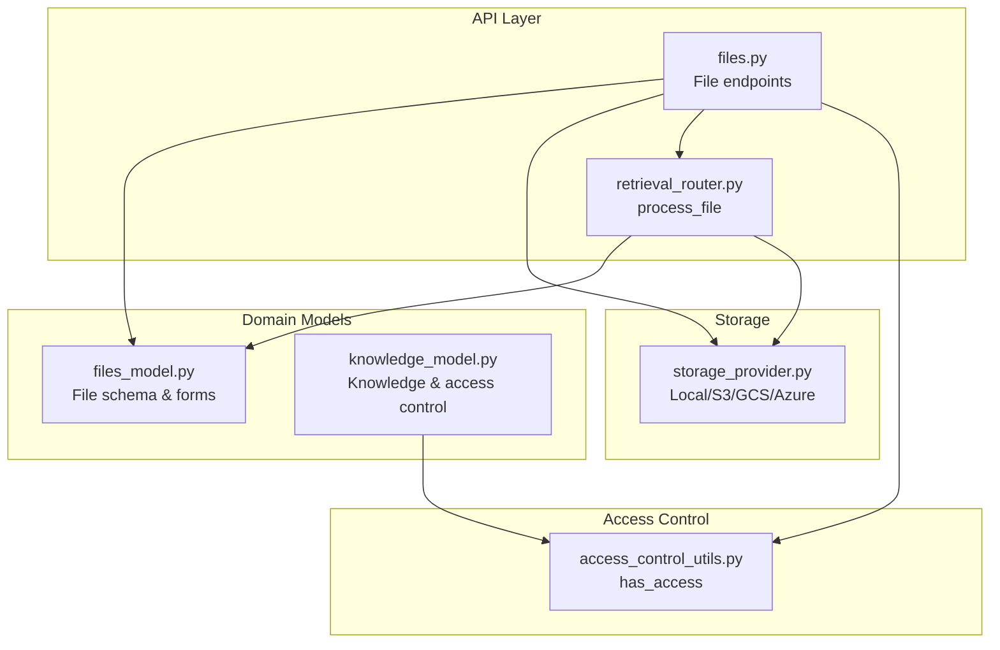
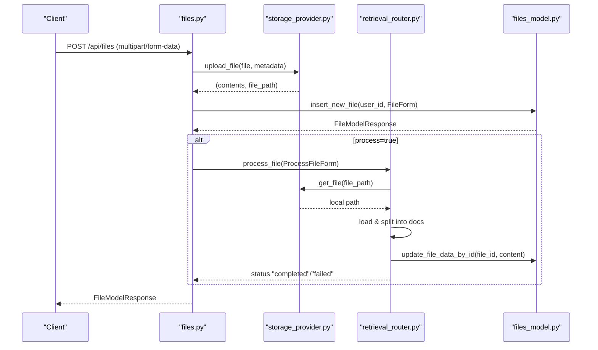
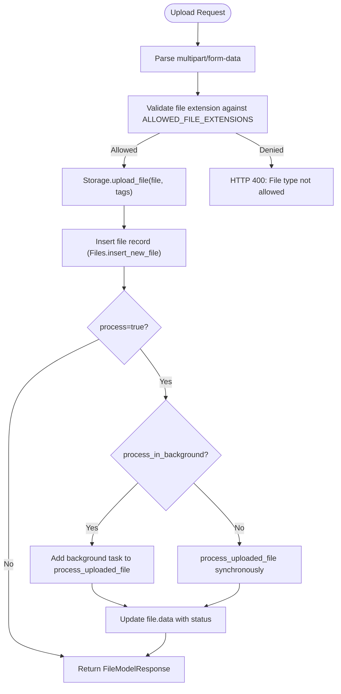
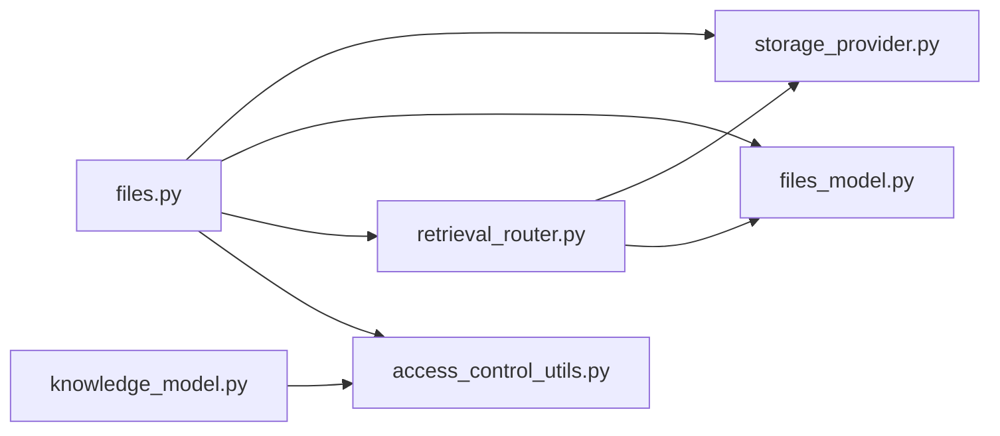

# File Management API

<cite>
**Referenced Files in This Document**
- [files.py](file://backend/open_webui/routers/files.py)
- [files_model.py](file://backend/open_webui/models/files.py)
- [retrieval_router.py](file://backend/open_webui/routers/retrieval.py)
- [storage_provider.py](file://backend/open_webui/storage/provider.py)
- [knowledge_model.py](file://backend/open_webui/models/knowledge.py)
- [access_control_utils.py](file://backend/open_webui/utils/access_control.py)
- [files_utils.py](file://backend/open_webui/utils/files.py)
- [constants.py](file://backend/open_webui/constants.py)
</cite>

## Table of Contents
1. [Introduction](#introduction)
2. [Project Structure](#project-structure)
3. [Core Components](#core-components)
4. [Architecture Overview](#architecture-overview)
5. [Detailed Component Analysis](#detailed-component-analysis)
6. [Dependency Analysis](#dependency-analysis)
7. [Performance Considerations](#performance-considerations)
8. [Troubleshooting Guide](#troubleshooting-guide)
9. [Conclusion](#conclusion)

## Introduction
This document describes the File Management API endpoints in open-webui, focusing on uploading, retrieving, updating, and deleting files. It explains multipart form data requirements, file type validation, storage mechanisms, metadata retrieval, content extraction, and integration with the knowledge base and RAG pipeline. It also covers access controls, sharing permissions, and retention policies.

## Project Structure
The File Management API is implemented in the backend under the routers and models packages. Key components:
- Router endpoints for file operations
- Models for file schema and responses
- Retrieval pipeline for content extraction and vector indexing
- Storage provider abstraction for local/S3/GCS/Azure
- Access control utilities for sharing and permissions
- Utilities for audio transcription and base64 uploads

**Diagram sources**
- [files.py](file://backend/open_webui/routers/files.py#L1-L761)
- [files_model.py](file://backend/open_webui/models/files.py#L1-L290)
- [retrieval_router.py](file://backend/open_webui/routers/retrieval.py#L1445-L1599)
- [storage_provider.py](file://backend/open_webui/storage/provider.py#L1-L377)
- [knowledge_model.py](file://backend/open_webui/models/knowledge.py#L1-L200)
- [access_control_utils.py](file://backend/open_webui/utils/access_control.py#L124-L175)

**Section sources**
- [files.py](file://backend/open_webui/routers/files.py#L1-L761)
- [files_model.py](file://backend/open_webui/models/files.py#L1-L290)

## Core Components
- File router: Implements upload, list/search, get by id, content retrieval, update content, process status, and delete.
- File model: Defines schema, forms, and response models for file metadata and data.
- Retrieval router: Processes files into text chunks, embeds them, and stores vectors for RAG.
- Storage provider: Abstracts local and cloud storage with upload/get/delete operations.
- Access control: Enforces read/write permissions across users, groups, and knowledge base access control.
- Utilities: Handles audio transcription and base64 uploads for images/audio.

**Section sources**
- [files.py](file://backend/open_webui/routers/files.py#L1-L761)
- [files_model.py](file://backend/open_webui/models/files.py#L1-L290)
- [retrieval_router.py](file://backend/open_webui/routers/retrieval.py#L1445-L1599)
- [storage_provider.py](file://backend/open_webui/storage/provider.py#L1-L377)
- [access_control_utils.py](file://backend/open_webui/utils/access_control.py#L124-L175)

## Architecture Overview
The File Management API integrates with the retrieval pipeline and storage providers. On upload, files are validated, stored, and optionally processed asynchronously. Processed content is embedded and indexed for RAG. Access control ensures only authorized users can access files. Deletion removes records, content, and vectors.

**Diagram sources**
- [files.py](file://backend/open_webui/routers/files.py#L152-L271)
- [storage_provider.py](file://backend/open_webui/storage/provider.py#L63-L106)
- [retrieval_router.py](file://backend/open_webui/routers/retrieval.py#L1445-L1599)
- [files_model.py](file://backend/open_webui/models/files.py#L107-L170)

## Detailed Component Analysis

### Upload File
- Endpoint: POST /api/files
- Authentication: Requires verified user.
- Multipart form data:
  - file: binary file
  - metadata: optional JSON string or object (parsed into file.meta.data)
  - process: optional boolean (default true) to trigger content extraction
  - process_in_background: optional boolean (default true) to run processing asynchronously
- Validation:
  - Allowed file extensions enforced via configuration.
  - Content type detection influences processing path.
- Storage:
  - Stores file via Storage.upload_file with tags including user and file identifiers.
- Processing:
  - If audio/video content type and STT engine configured, transcribes and processes text.
  - Otherwise, loads content via configured loader and processes into chunks.
  - Updates file.data with extracted content and status.
- Response:
  - Returns FileModelResponse with id, filename, meta, timestamps, and status if pending.

Success example response shape:
- id: string
- user_id: string
- filename: string
- data: object (may include status, content)
- meta: object (includes name, content_type, size, data)
- created_at: integer (epoch)
- updated_at: integer (epoch)

Notes:
- If process=false, returns immediately with pending status until manual processing.
- Background processing uses FastAPI BackgroundTasks.

**Section sources**
- [files.py](file://backend/open_webui/routers/files.py#L152-L271)
- [storage_provider.py](file://backend/open_webui/storage/provider.py#L63-L106)
- [retrieval_router.py](file://backend/open_webui/routers/retrieval.py#L1445-L1599)
- [files_model.py](file://backend/open_webui/models/files.py#L60-L105)

### List Files
- Endpoint: GET /api/files
- Query parameters:
  - content: boolean (default true) to include content in responses
- Access:
  - Admin sees all files; others see their own files.

**Section sources**
- [files.py](file://backend/open_webui/routers/files.py#L294-L306)

### Search Files
- Endpoint: GET /api/files/search
- Query parameters:
  - filename: pattern with wildcards (e.g., "*.txt")
  - content: boolean (default true)
- Access:
  - Admin sees all files; others see their own files.

**Section sources**
- [files.py](file://backend/open_webui/routers/files.py#L314-L348)

### Get File By Id
- Endpoint: GET /api/files/{id}
- Access:
  - Owner, admin, or user with read access via knowledge base access control.

**Section sources**
- [files.py](file://backend/open_webui/routers/files.py#L383-L404)

### Get File Process Status
- Endpoint: GET /api/files/{id}/process/status
- Query parameters:
  - stream: boolean (default false) to receive SSE events
- Access:
  - Owner, admin, or user with read access.

Status values:
- pending, completed, failed

**Section sources**
- [files.py](file://backend/open_webui/routers/files.py#L406-L461)

### Get File Data Content By Id
- Endpoint: GET /api/files/{id}/data/content
- Access:
  - Owner, admin, or user with read access.

**Section sources**
- [files.py](file://backend/open_webui/routers/files.py#L468-L489)

### Update File Data Content By Id
- Endpoint: POST /api/files/{id}/data/content/update
- Body: JSON with content field
- Access:
  - Owner, admin, or user with write access.
- Behavior:
  - Re-processes file content and updates vector collection.

**Section sources**
- [files.py](file://backend/open_webui/routers/files.py#L500-L534)
- [retrieval_router.py](file://backend/open_webui/routers/retrieval.py#L1445-L1599)

### Get File Content By Id
- Endpoint: GET /api/files/{id}/content
- Query parameters:
  - attachment: boolean (default false) to force attachment disposition
- Access:
  - Owner, admin, or user with read access.
- Behavior:
  - Returns FileResponse with appropriate Content-Disposition and media type.
  - For PDFs, sets inline display and forces application/pdf media type.

**Section sources**
- [files.py](file://backend/open_webui/routers/files.py#L541-L609)

### Get HTML Content By Id
- Endpoint: GET /api/files/{id}/content/html
- Access:
  - Admin required for this endpoint.

**Section sources**
- [files.py](file://backend/open_webui/routers/files.py#L611-L658)

### Get File Content By Id (alternative path)
- Endpoint: GET /api/files/{id}/content/{file_name}
- Access:
  - Owner, admin, or user with read access.
- Behavior:
  - Returns FileResponse or streams text/plain if path not present.

**Section sources**
- [files.py](file://backend/open_webui/routers/files.py#L660-L714)

### Delete File By Id
- Endpoint: DELETE /api/files/{id}
- Access:
  - Owner, admin, or user with write access.
- Behavior:
  - Deletes record, file content, and associated vector collection.

**Section sources**
- [files.py](file://backend/open_webui/routers/files.py#L722-L761)

### Delete All Files
- Endpoint: DELETE /api/files/all
- Access:
  - Admin required.
- Behavior:
  - Deletes all records, content, and resets vector collections.

**Section sources**
- [files.py](file://backend/open_webui/routers/files.py#L356-L375)

### File Upload Flow (Multipart/Form-Data)

**Diagram sources**
- [files.py](file://backend/open_webui/routers/files.py#L173-L271)
- [storage_provider.py](file://backend/open_webui/storage/provider.py#L63-L106)
- [files_model.py](file://backend/open_webui/models/files.py#L107-L170)

## Dependency Analysis
- File router depends on:
  - Storage provider for file IO
  - Retrieval router for content extraction and embedding
  - Access control utilities for sharing permissions
  - File models for persistence and response shapes
- Retrieval router depends on:
  - Loader engine selection (external/Tika/Datalab/OCR/Mistral/Mineru)
  - Vector DB client for indexing
- Storage provider supports:
  - Local filesystem
  - S3 with tagging and local caching
  - GCS
  - Azure Blob Storage

**Diagram sources**
- [files.py](file://backend/open_webui/routers/files.py#L1-L761)
- [storage_provider.py](file://backend/open_webui/storage/provider.py#L1-L377)
- [files_model.py](file://backend/open_webui/models/files.py#L1-L290)
- [retrieval_router.py](file://backend/open_webui/routers/retrieval.py#L1445-L1599)
- [knowledge_model.py](file://backend/open_webui/models/knowledge.py#L1-L200)
- [access_control_utils.py](file://backend/open_webui/utils/access_control.py#L124-L175)

**Section sources**
- [files.py](file://backend/open_webui/routers/files.py#L1-L761)
- [storage_provider.py](file://backend/open_webui/storage/provider.py#L1-L377)
- [retrieval_router.py](file://backend/open_webui/routers/retrieval.py#L1445-L1599)
- [files_model.py](file://backend/open_webui/models/files.py#L1-L290)
- [knowledge_model.py](file://backend/open_webui/models/knowledge.py#L1-L200)
- [access_control_utils.py](file://backend/open_webui/utils/access_control.py#L124-L175)

## Performance Considerations
- Asynchronous processing: Use process_in_background=true to avoid blocking uploads.
- Large files: Consider external loaders and cloud storage for scalability.
- Vector indexing: Embedding and indexing can be CPU/memory intensive; batch operations where possible.
- Content extraction: Choose appropriate loader engines based on file types to reduce overhead.

[No sources needed since this section provides general guidance]

## Troubleshooting Guide
Common issues and resolutions:
- File type not allowed:
  - Cause: Extension not in ALLOWED_FILE_EXTENSIONS.
  - Resolution: Configure allowed extensions or upload a supported type.
- File not found:
  - Cause: Invalid id or insufficient permissions.
  - Resolution: Verify id and access rights; ensure user belongs to knowledge base with read access.
- File not processed:
  - Cause: Content extraction failed or not triggered.
  - Resolution: Check process status endpoint; review logs; retry with process=true.
- Access denied:
  - Cause: Missing read/write permissions via knowledge base access control.
  - Resolution: Update knowledge base access control or ensure ownership/admin role.
- Storage errors:
  - Cause: Cloud storage misconfiguration or quota limits.
  - Resolution: Verify credentials and bucket/container settings; check local disk space.

**Section sources**
- [files.py](file://backend/open_webui/routers/files.py#L383-L404)
- [files.py](file://backend/open_webui/routers/files.py#L406-L461)
- [constants.py](file://backend/open_webui/constants.py#L19-L127)

## Conclusion
The File Management API provides robust endpoints for uploading, processing, retrieving, and deleting files. It integrates with storage providers and the retrieval pipeline to support RAG workflows. Access control ensures secure sharing across users and groups, while metadata and content extraction enable downstream applications. Proper configuration of allowed extensions, loaders, and storage backends is essential for reliable operation.