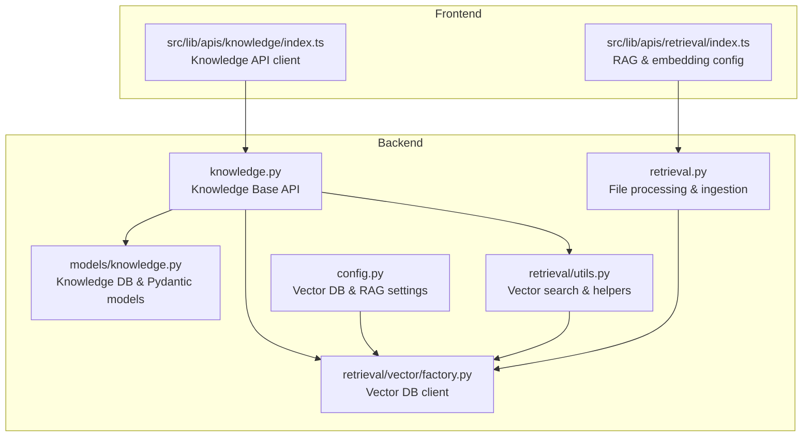
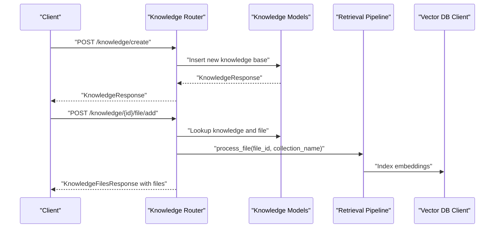
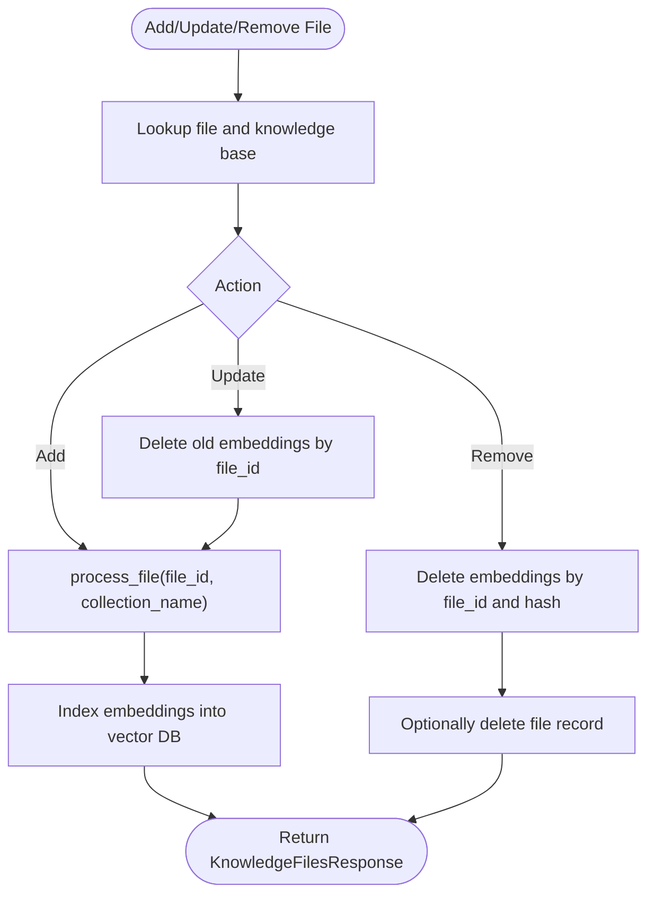
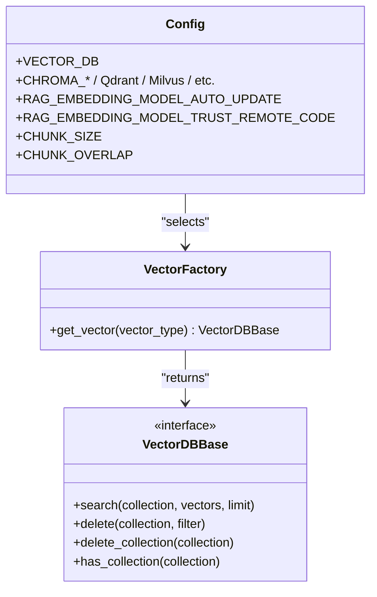
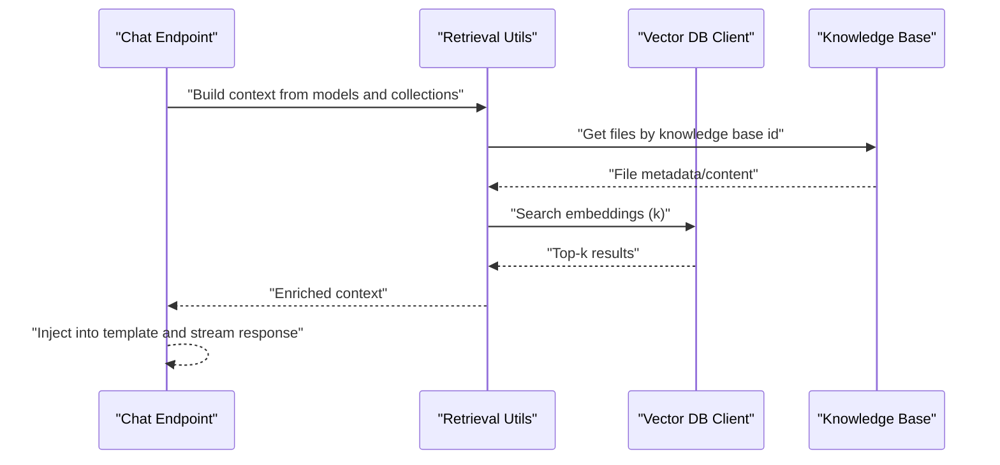
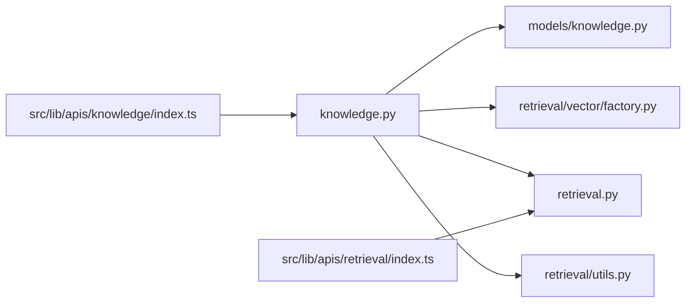

# Knowledge Base API

<cite>
**Referenced Files in This Document**
- [knowledge.py](file://backend/open_webui/routers/knowledge.py)
- [models/knowledge.py](file://backend/open_webui/models/knowledge.py)
- [retrieval/vector/factory.py](file://backend/open_webui/retrieval/vector/factory.py)
- [retrieval/utils.py](file://backend/open_webui/retrieval/utils.py)
- [retrieval.py](file://backend/open_webui/routers/retrieval.py)
- [files.py](file://backend/open_webui/routers/files.py)
- [config.py](file://backend/open_webui/config.py)
- [index.ts (knowledge)](file://src/lib/apis/knowledge/index.ts)
- [index.ts (retrieval)](file://src/lib/apis/retrieval/index.ts)
</cite>

## Table of Contents
1. [Introduction](#introduction)
2. [Project Structure](#project-structure)
3. [Core Components](#core-components)
4. [Architecture Overview](#architecture-overview)
5. [Detailed Component Analysis](#detailed-component-analysis)
6. [Dependency Analysis](#dependency-analysis)
7. [Performance Considerations](#performance-considerations)
8. [Troubleshooting Guide](#troubleshooting-guide)
9. [Conclusion](#conclusion)
10. [Appendices](#appendices)

## Introduction
This document provides API documentation for the Knowledge Base endpoints in open-webui. It covers:
- Creating, retrieving, updating, and deleting knowledge bases
- Adding, updating, and removing documents from knowledge bases
- File ingestion and text extraction workflows
- Knowledge base configuration, embedding settings, and vector database integration
- Examples of request payloads and responses
- How knowledge bases integrate with the Retrieval-Augmented Generation (RAG) system and chat endpoints to provide context-aware responses

## Project Structure
The Knowledge Base API is implemented in the backend router and backed by SQLAlchemy models. It integrates with the retrieval pipeline and vector database abstraction.

**Diagram sources**
- [knowledge.py](file://backend/open_webui/routers/knowledge.py#L1-L662)
- [models/knowledge.py](file://backend/open_webui/models/knowledge.py#L1-L371)
- [retrieval/vector/factory.py](file://backend/open_webui/retrieval/vector/factory.py#L1-L79)
- [retrieval/utils.py](file://backend/open_webui/retrieval/utils.py#L1-L200)
- [retrieval.py](file://backend/open_webui/routers/retrieval.py#L1-L200)
- [config.py](file://backend/open_webui/config.py#L2108-L2140)
- [index.ts (knowledge)](file://src/lib/apis/knowledge/index.ts#L1-L376)
- [index.ts (retrieval)](file://src/lib/apis/retrieval/index.ts#L63-L200)

**Section sources**
- [knowledge.py](file://backend/open_webui/routers/knowledge.py#L1-L662)
- [models/knowledge.py](file://backend/open_webui/models/knowledge.py#L1-L371)
- [retrieval/vector/factory.py](file://backend/open_webui/retrieval/vector/factory.py#L1-L79)
- [retrieval/utils.py](file://backend/open_webui/retrieval/utils.py#L1-L200)
- [retrieval.py](file://backend/open_webui/routers/retrieval.py#L1-L200)
- [config.py](file://backend/open_webui/config.py#L2108-L2140)
- [index.ts (knowledge)](file://src/lib/apis/knowledge/index.ts#L1-L376)
- [index.ts (retrieval)](file://src/lib/apis/retrieval/index.ts#L63-L200)

## Core Components
- Knowledge Base Router: Implements CRUD and document management endpoints for knowledge bases.
- Knowledge Models: SQLAlchemy ORM and Pydantic models for knowledge base records and relationships.
- Vector DB Abstraction: Factory selects the configured vector database client.
- Retrieval Utilities: Vector search and enrichment helpers.
- File Processing: Ingestion pipeline for extracting text and indexing into the vector database.
- Frontend APIs: Client-side wrappers for knowledge base and retrieval configuration.

**Section sources**
- [knowledge.py](file://backend/open_webui/routers/knowledge.py#L1-L662)
- [models/knowledge.py](file://backend/open_webui/models/knowledge.py#L1-L371)
- [retrieval/vector/factory.py](file://backend/open_webui/retrieval/vector/factory.py#L1-L79)
- [retrieval/utils.py](file://backend/open_webui/retrieval/utils.py#L1-L200)
- [retrieval.py](file://backend/open_webui/routers/retrieval.py#L1-L200)

## Architecture Overview
The Knowledge Base API orchestrates:
- Access control checks against knowledge base ownership and shared permissions
- File ingestion and embedding updates via the retrieval pipeline
- Vector database operations for search and reset
- Integration with chat and RAG flows to provide context-aware answers

**Diagram sources**
- [knowledge.py](file://backend/open_webui/routers/knowledge.py#L84-L117)
- [knowledge.py](file://backend/open_webui/routers/knowledge.py#L276-L341)
- [models/knowledge.py](file://backend/open_webui/models/knowledge.py#L132-L164)
- [retrieval.py](file://backend/open_webui/routers/retrieval.py#L1566-L1600)
- [retrieval/vector/factory.py](file://backend/open_webui/retrieval/vector/factory.py#L78-L79)

## Detailed Component Analysis

### Knowledge Base Endpoints
- GET /knowledge/
  - Description: Retrieve knowledge bases with read access for the current user.
  - Response: Array of KnowledgeUserResponse with embedded file metadata.
- GET /knowledge/list
  - Description: Retrieve knowledge bases with write access for the current user.
  - Response: Array of KnowledgeUserResponse with embedded file metadata.
- POST /knowledge/create
  - Description: Create a new knowledge base. Enforces permissions and optional public sharing controls.
  - Request body: KnowledgeForm (name, description, access_control)
  - Response: KnowledgeResponse or error.
- GET /knowledge/{id}
  - Description: Retrieve a knowledge base by ID with read access checks.
  - Response: KnowledgeFilesResponse with files metadata.
- POST /knowledge/{id}/update
  - Description: Update knowledge base metadata and access control.
  - Request body: KnowledgeForm (optional fields)
  - Response: KnowledgeFilesResponse or error.
- POST /knowledge/{id}/reset
  - Description: Reset a knowledge base (clears file relations and updates timestamps).
  - Response: KnowledgeResponse or error.
- DELETE /knowledge/{id}/delete
  - Description: Delete a knowledge base; removes references from models and cleans vector DB.
  - Response: Boolean success indicator.
- POST /knowledge/reindex
  - Description: Rebuild embeddings for all knowledge bases (admin-only).
  - Response: Boolean success indicator.

**Section sources**
- [knowledge.py](file://backend/open_webui/routers/knowledge.py#L43-L76)
- [knowledge.py](file://backend/open_webui/routers/knowledge.py#L84-L117)
- [knowledge.py](file://backend/open_webui/routers/knowledge.py#L191-L211)
- [knowledge.py](file://backend/open_webui/routers/knowledge.py#L218-L265)
- [knowledge.py](file://backend/open_webui/routers/knowledge.py#L553-L580)
- [knowledge.py](file://backend/open_webui/routers/knowledge.py#L490-L546)
- [knowledge.py](file://backend/open_webui/routers/knowledge.py#L124-L179)

### Document Management Endpoints
- POST /knowledge/{id}/file/add
  - Description: Add a processed file to a knowledge base and index it into the vector DB.
  - Request body: { file_id: string }
  - Response: KnowledgeFilesResponse or error.
- POST /knowledge/{id}/file/update
  - Description: Replace a file’s embedding in the knowledge base collection.
  - Request body: { file_id: string }
  - Response: KnowledgeFilesResponse or error.
- POST /knowledge/{id}/file/remove
  - Description: Remove a file from a knowledge base and delete its embeddings. Optionally deletes the file record.
  - Request body: { file_id: string }, query param delete_file=true|false
  - Response: KnowledgeFilesResponse or error.
- POST /knowledge/{id}/files/batch/add
  - Description: Add multiple files to a knowledge base with batch processing.
  - Request body: [{ file_id: string }]
  - Response: KnowledgeFilesResponse with warnings if any failures.

**Section sources**
- [knowledge.py](file://backend/open_webui/routers/knowledge.py#L276-L341)
- [knowledge.py](file://backend/open_webui/routers/knowledge.py#L343-L403)
- [knowledge.py](file://backend/open_webui/routers/knowledge.py#L410-L483)
- [knowledge.py](file://backend/open_webui/routers/knowledge.py#L587-L662)

### Data Models and Access Control
- Knowledge (SQLAlchemy)
  - Fields: id, user_id, name, description, meta, access_control, created_at, updated_at
  - Access control semantics: None (public), {} (private), or structured read/write rules.
- KnowledgeForm (Pydantic)
  - Fields: name, description, access_control
- KnowledgeResponse/KnowledgeUserResponse
  - Extend KnowledgeModel with optional files metadata.
- KnowledgeTable (ORM facade)
  - Methods: insert_new_knowledge, get_knowledge_bases, get_knowledge_by_id, add/remove file relations, reset, update, delete.

**Section sources**
- [models/knowledge.py](file://backend/open_webui/models/knowledge.py#L36-L115)
- [models/knowledge.py](file://backend/open_webui/models/knowledge.py#L120-L164)
- [models/knowledge.py](file://backend/open_webui/models/knowledge.py#L165-L371)

### File Ingestion and Text Extraction Workflow
- Files are processed via retrieval pipeline:
  - Extract text content and compute a content hash
  - Store enriched content and metadata
  - Index embeddings into the vector DB under the knowledge base collection name
- Knowledge endpoints trigger this pipeline when adding/updating/removing files.

**Diagram sources**
- [knowledge.py](file://backend/open_webui/routers/knowledge.py#L312-L341)
- [knowledge.py](file://backend/open_webui/routers/knowledge.py#L375-L403)
- [knowledge.py](file://backend/open_webui/routers/knowledge.py#L445-L472)
- [retrieval.py](file://backend/open_webui/routers/retrieval.py#L1566-L1600)
- [retrieval/vector/factory.py](file://backend/open_webui/retrieval/vector/factory.py#L78-L79)

**Section sources**
- [knowledge.py](file://backend/open_webui/routers/knowledge.py#L312-L341)
- [knowledge.py](file://backend/open_webui/routers/knowledge.py#L375-L403)
- [knowledge.py](file://backend/open_webui/routers/knowledge.py#L445-L472)
- [retrieval.py](file://backend/open_webui/routers/retrieval.py#L1566-L1600)

### Knowledge Base Configuration, Embeddings, and Vector Database
- Vector Database Selection
  - The vector DB client is selected by configuration and exposed globally.
- Retrieval Configuration
  - Embedding and reranking models, chunk sizes, prefixes, and templates are configurable.
- Knowledge Base Embedding Lifecycle
  - Knowledge base ID serves as the vector collection name.
  - Reset/delete operations manage collection lifecycle.

**Diagram sources**
- [retrieval/vector/factory.py](file://backend/open_webui/retrieval/vector/factory.py#L1-L79)
- [config.py](file://backend/open_webui/config.py#L2108-L2140)

**Section sources**
- [retrieval/vector/factory.py](file://backend/open_webui/retrieval/vector/factory.py#L1-L79)
- [config.py](file://backend/open_webui/config.py#L2108-L2140)
- [retrieval/utils.py](file://backend/open_webui/retrieval/utils.py#L135-L167)

### Integration with RAG and Chat Endpoints
- RAG Template and Context Injection
  - Chat middleware injects retrieved context into the model prompt using a configurable template.
- Knowledge Base Context
  - Retrieval utilities can assemble full context from knowledge base files when enabled.
- Model Knowledge References
  - Deleting a knowledge base updates model configurations that reference it.

**Diagram sources**
- [retrieval/utils.py](file://backend/open_webui/retrieval/utils.py#L1073-L1103)
- [retrieval/utils.py](file://backend/open_webui/retrieval/utils.py#L135-L167)
- [knowledge.py](file://backend/open_webui/routers/knowledge.py#L512-L537)

**Section sources**
- [retrieval/utils.py](file://backend/open_webui/retrieval/utils.py#L1073-L1103)
- [knowledge.py](file://backend/open_webui/routers/knowledge.py#L512-L537)

## Dependency Analysis
- Router-to-Model Coupling
  - Knowledge router depends on KnowledgeTable for persistence and on Files for file metadata.
- Vector DB Coupling
  - Knowledge router and retrieval utilities depend on a global vector client.
- Frontend Coupling
  - Frontend knowledge API client maps directly to backend endpoints.

**Diagram sources**
- [knowledge.py](file://backend/open_webui/routers/knowledge.py#L1-L662)
- [models/knowledge.py](file://backend/open_webui/models/knowledge.py#L1-L371)
- [retrieval/vector/factory.py](file://backend/open_webui/retrieval/vector/factory.py#L1-L79)
- [retrieval.py](file://backend/open_webui/routers/retrieval.py#L1-L200)
- [retrieval/utils.py](file://backend/open_webui/retrieval/utils.py#L1-L200)
- [index.ts (knowledge)](file://src/lib/apis/knowledge/index.ts#L1-L376)
- [index.ts (retrieval)](file://src/lib/apis/retrieval/index.ts#L63-L200)

**Section sources**
- [knowledge.py](file://backend/open_webui/routers/knowledge.py#L1-L662)
- [models/knowledge.py](file://backend/open_webui/models/knowledge.py#L1-L371)
- [retrieval/vector/factory.py](file://backend/open_webui/retrieval/vector/factory.py#L1-L79)
- [retrieval.py](file://backend/open_webui/routers/retrieval.py#L1-L200)
- [retrieval/utils.py](file://backend/open_webui/retrieval/utils.py#L1-L200)
- [index.ts (knowledge)](file://src/lib/apis/knowledge/index.ts#L1-L376)
- [index.ts (retrieval)](file://src/lib/apis/retrieval/index.ts#L63-L200)

## Performance Considerations
- Batch Operations
  - Prefer batch add endpoints for multiple files to reduce overhead.
- Vector DB Limits
  - Tune top-k and chunk settings to balance recall and latency.
- Reindexing
  - Reindexing is admin-only and can be expensive; schedule during maintenance windows.
- Concurrency
  - File processing runs in thread pools; ensure adequate resources for large batches.

[No sources needed since this section provides general guidance]

## Troubleshooting Guide
- Unauthorized Access
  - Ensure the user has appropriate permissions or is the owner/admin.
- File Not Processed
  - Adding a file requires prior processing; verify the file has content and a computed hash.
- Vector DB Errors
  - Verify vector DB client configuration and connectivity; check collection existence before deletion/reset.
- Model References
  - Deleting a knowledge base updates model configurations that reference it; confirm model updates succeeded.

**Section sources**
- [knowledge.py](file://backend/open_webui/routers/knowledge.py#L284-L341)
- [knowledge.py](file://backend/open_webui/routers/knowledge.py#L445-L472)
- [knowledge.py](file://backend/open_webui/routers/knowledge.py#L512-L537)

## Conclusion
The Knowledge Base API provides a robust foundation for managing knowledge bases, integrating file ingestion, and enabling RAG-powered chat experiences. By leveraging the vector database abstraction and retrieval utilities, applications can scale knowledge-driven capabilities while maintaining strong access control and operational flexibility.

[No sources needed since this section summarizes without analyzing specific files]

## Appendices

### API Reference

- Authentication
  - All endpoints require a valid bearer token.
- Permissions
  - Read access: any user with read access or admin
  - Write access: owner, users with write access, or admin
  - Admin-only: reindex, delete knowledge base

- Endpoints
  - GET /knowledge/
    - Response: Array of KnowledgeUserResponse
  - GET /knowledge/list
    - Response: Array of KnowledgeUserResponse
  - POST /knowledge/create
    - Body: KnowledgeForm
    - Response: KnowledgeResponse
  - GET /knowledge/{id}
    - Response: KnowledgeFilesResponse
  - POST /knowledge/{id}/update
    - Body: KnowledgeForm
    - Response: KnowledgeFilesResponse
  - POST /knowledge/{id}/reset
    - Response: KnowledgeResponse
  - DELETE /knowledge/{id}/delete
    - Response: Boolean
  - POST /knowledge/reindex
    - Response: Boolean

- Document Management
  - POST /knowledge/{id}/file/add
    - Body: { file_id: string }
    - Response: KnowledgeFilesResponse
  - POST /knowledge/{id}/file/update
    - Body: { file_id: string }
    - Response: KnowledgeFilesResponse
  - POST /knowledge/{id}/file/remove
    - Body: { file_id: string }, query param delete_file=true|false
    - Response: KnowledgeFilesResponse
  - POST /knowledge/{id}/files/batch/add
    - Body: [{ file_id: string }]
    - Response: KnowledgeFilesResponse (may include warnings)

- Request Payload Examples
  - Create Knowledge Base
    - {
      "name": "Project Docs",
      "description": "Internal documentation",
      "access_control": null
    }
  - Update Knowledge Base
    - {
      "name": "Updated Name",
      "description": "Updated Description",
      "access_control": {}
    }
  - Add File
    - {
      "file_id": "uuid-of-processed-file"
    }

- Response Examples
  - KnowledgeResponse
    - {
      "id": "uuid",
      "user_id": "uuid",
      "name": "Project Docs",
      "description": "Internal documentation",
      "meta": null,
      "access_control": null,
      "created_at": 1710000000,
      "updated_at": 1710000000
    }
  - KnowledgeFilesResponse
    - Same as KnowledgeResponse plus:
      "files": [FileMetadataResponse...]

- Retrieval Configuration (Frontend)
  - Embedding config endpoint: GET /retrieval/embedding
  - RAG config update endpoint: POST /retrieval/config/update
  - Query settings endpoints: GET /retrieval/query/settings, POST /retrieval/query/settings/update

**Section sources**
- [knowledge.py](file://backend/open_webui/routers/knowledge.py#L43-L76)
- [knowledge.py](file://backend/open_webui/routers/knowledge.py#L84-L117)
- [knowledge.py](file://backend/open_webui/routers/knowledge.py#L191-L211)
- [knowledge.py](file://backend/open_webui/routers/knowledge.py#L218-L265)
- [knowledge.py](file://backend/open_webui/routers/knowledge.py#L553-L580)
- [knowledge.py](file://backend/open_webui/routers/knowledge.py#L490-L546)
- [knowledge.py](file://backend/open_webui/routers/knowledge.py#L124-L179)
- [knowledge.py](file://backend/open_webui/routers/knowledge.py#L276-L341)
- [knowledge.py](file://backend/open_webui/routers/knowledge.py#L343-L403)
- [knowledge.py](file://backend/open_webui/routers/knowledge.py#L410-L483)
- [knowledge.py](file://backend/open_webui/routers/knowledge.py#L587-L662)
- [models/knowledge.py](file://backend/open_webui/models/knowledge.py#L120-L164)
- [index.ts (knowledge)](file://src/lib/apis/knowledge/index.ts#L1-L376)
- [index.ts (retrieval)](file://src/lib/apis/retrieval/index.ts#L63-L200)