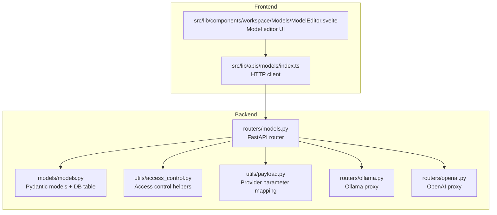
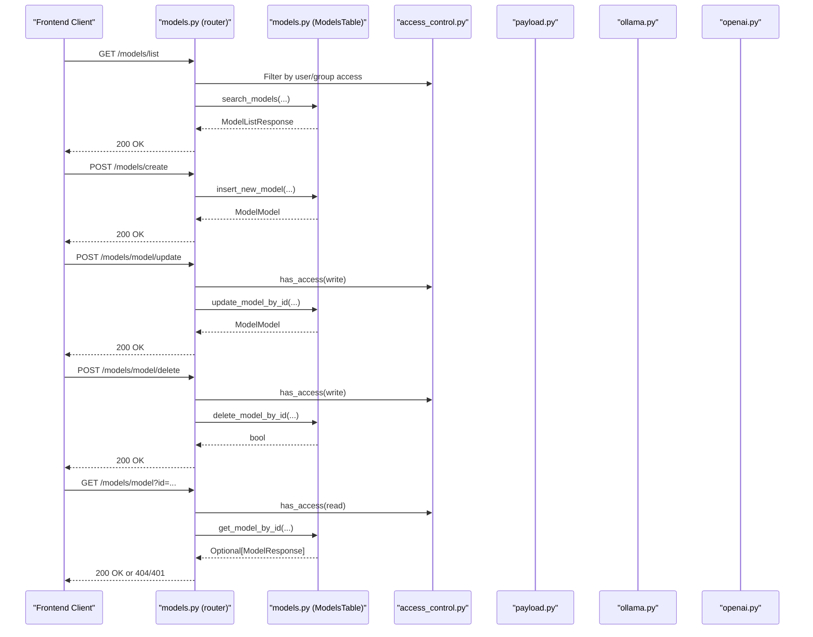
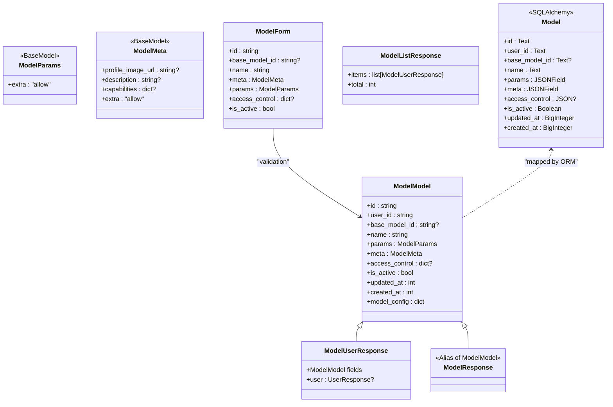
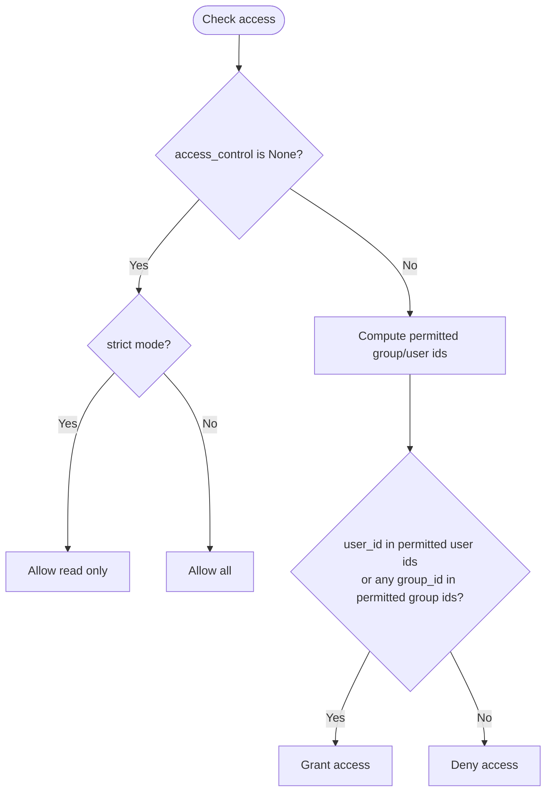
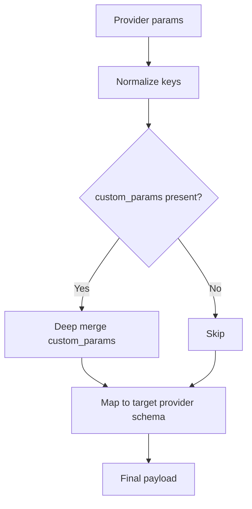
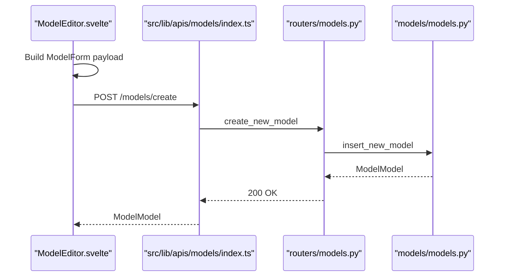
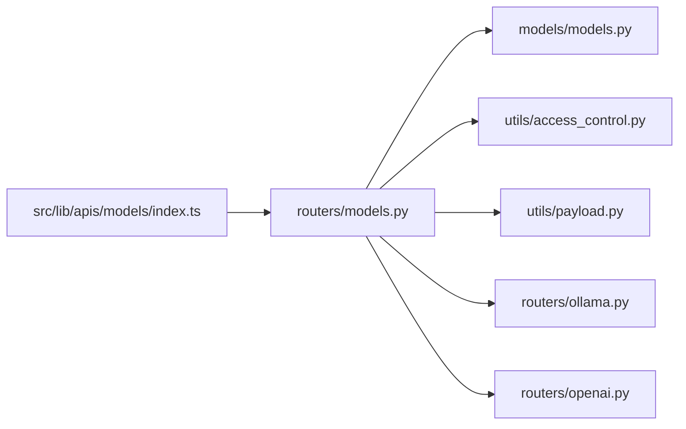

# Model Configuration API

<cite>
**Referenced Files in This Document**
- [models.py](file://backend/open_webui/routers/models.py)
- [models.py](file://backend/open_webui/models/models.py)
- [access_control.py](file://backend/open_webui/utils/access_control.py)
- [payload.py](file://backend/open_webui/utils/payload.py)
- [ollama.py](file://backend/open_webui/routers/ollama.py)
- [openai.py](file://backend/open_webui/routers/openai.py)
- [index.ts](file://src/lib/apis/models/index.ts)
- [ModelEditor.svelte](file://src/lib/components/workspace/Models/ModelEditor.svelte)
</cite>

## Table of Contents
1. [Introduction](#introduction)
2. [Project Structure](#project-structure)
3. [Core Components](#core-components)
4. [Architecture Overview](#architecture-overview)
5. [Detailed Component Analysis](#detailed-component-analysis)
6. [Dependency Analysis](#dependency-analysis)
7. [Performance Considerations](#performance-considerations)
8. [Troubleshooting Guide](#troubleshooting-guide)
9. [Conclusion](#conclusion)

## Introduction
This document describes the Model Configuration API in open-webui, covering endpoints for listing, retrieving, creating, updating, toggling, importing, exporting, and deleting AI models. It also explains how model configurations integrate with backend providers (Ollama and OpenAI-compatible APIs), and details model sharing and access control mechanisms including public/private visibility and organization-level sharing.

## Project Structure
The Model Configuration API is implemented in the backend router module and backed by a database model. Frontend API bindings and UI components orchestrate user interactions.

**Diagram sources**
- [models.py](file://backend/open_webui/routers/models.py#L1-L418)
- [models.py](file://backend/open_webui/models/models.py#L1-L461)
- [access_control.py](file://backend/open_webui/utils/access_control.py#L1-L175)
- [payload.py](file://backend/open_webui/utils/payload.py#L1-L200)
- [ollama.py](file://backend/open_webui/routers/ollama.py#L1-L200)
- [openai.py](file://backend/open_webui/routers/openai.py#L1-L200)
- [index.ts](file://src/lib/apis/models/index.ts#L1-L348)
- [ModelEditor.svelte](file://src/lib/components/workspace/Models/ModelEditor.svelte#L1-L200)

**Section sources**
- [models.py](file://backend/open_webui/routers/models.py#L1-L418)
- [models.py](file://backend/open_webui/models/models.py#L1-L461)
- [index.ts](file://src/lib/apis/models/index.ts#L1-L348)
- [ModelEditor.svelte](file://src/lib/components/workspace/Models/ModelEditor.svelte#L1-L200)

## Core Components
- Backend router exposing REST endpoints for model management.
- Pydantic models defining request/response schemas and database table structure.
- Access control utilities enforcing read/write permissions and organization-level sharing.
- Provider integration helpers for translating model parameters between OpenAI and Ollama conventions.
- Frontend API bindings and UI editor for creating/updating models.

Key responsibilities:
- Listing models with filters, ordering, pagination, and access control.
- Retrieving model details by ID with permission checks.
- Creating custom models with validation and uniqueness checks.
- Updating model configurations (including parameters and metadata).
- Deleting models with ownership and permission checks.
- Import/export/sync operations for bulk model management.

**Section sources**
- [models.py](file://backend/open_webui/routers/models.py#L48-L418)
- [models.py](file://backend/open_webui/models/models.py#L107-L461)
- [access_control.py](file://backend/open_webui/utils/access_control.py#L108-L175)
- [payload.py](file://backend/open_webui/utils/payload.py#L88-L200)
- [index.ts](file://src/lib/apis/models/index.ts#L1-L348)
- [ModelEditor.svelte](file://src/lib/components/workspace/Models/ModelEditor.svelte#L123-L200)

## Architecture Overview
The backend exposes model endpoints that enforce access control and delegate provider-specific parameter mapping. Frontend clients call these endpoints to manage models.

**Diagram sources**
- [models.py](file://backend/open_webui/routers/models.py#L48-L418)
- [models.py](file://backend/open_webui/models/models.py#L267-L461)
- [access_control.py](file://backend/open_webui/utils/access_control.py#L108-L175)
- [payload.py](file://backend/open_webui/utils/payload.py#L88-L200)
- [ollama.py](file://backend/open_webui/routers/ollama.py#L1-L200)
- [openai.py](file://backend/open_webui/routers/openai.py#L1-L200)

## Detailed Component Analysis

### Endpoint Catalog

- GET /models/list
  - Purpose: List models with filters, ordering, pagination, and access control.
  - Query parameters:
    - query: text search across name/base_model_id
    - view_option: "created" or "shared"
    - tag: filter by tag embedded in meta.tags
    - order_by: "name", "created_at", "updated_at"
    - direction: "asc" or "desc"
    - page: integer (default 1)
  - Authentication: Verified user.
  - Access control: Non-admin users are filtered by their groups and personal models.
  - Response: ModelListResponse with items and total count.

- GET /models/base
  - Purpose: Retrieve base models (no base_model_id).
  - Authentication: Admin user.
  - Response: Array of ModelResponse.

- GET /models/tags
  - Purpose: Enumerate unique tags across models visible to the user.
  - Authentication: Verified user.
  - Response: Array of strings.

- POST /models/create
  - Purpose: Create a new custom model.
  - Body: ModelForm (id, base_model_id, name, meta, params, access_control, is_active).
  - Authentication: Admin or permission "workspace.models".
  - Validation: id length <= 256; id must be unique.
  - Response: Optional[ModelModel].

- GET /models/export
  - Purpose: Export models owned by the user or all models for admin.
  - Authentication: Admin or permission "workspace.models_export".
  - Response: Array of ModelModel.

- POST /models/import
  - Purpose: Bulk import models; updates existing or inserts new.
  - Body: ModelsImportForm(models: list[dict]).
  - Authentication: Admin or permission "workspace.models_import".
  - Response: bool.

- POST /models/sync
  - Purpose: Sync a list of models for an admin user.
  - Body: SyncModelsForm(models: list[ModelModel]).
  - Authentication: Admin user.
  - Response: list[ModelModel].

- GET /models/model
  - Purpose: Retrieve a model by id with access control.
  - Query: id (supports forward slashes).
  - Authentication: Verified user.
  - Access control: Admin bypass, owner, or read access granted.
  - Response: Optional[ModelResponse].

- GET /models/model/profile/image
  - Purpose: Serve model profile image (URL redirect or inline data).
  - Query: id.
  - Authentication: Verified user.
  - Response: Redirect to external URL, streamed image, or fallback favicon.

- POST /models/model/toggle
  - Purpose: Toggle is_active flag.
  - Query: id.
  - Authentication: Verified user.
  - Access control: Admin, owner, or write access.
  - Response: Optional[ModelResponse].

- POST /models/model/update
  - Purpose: Update an existing model.
  - Body: ModelForm (id required).
  - Authentication: Verified user.
  - Access control: Owner, write access, or admin.
  - Response: Optional[ModelModel].

- POST /models/model/delete
  - Purpose: Delete a model.
  - Body: ModelIdForm(id).
  - Authentication: Verified user.
  - Access control: Admin, owner, or write access.
  - Response: bool.

- DELETE /models/delete/all
  - Purpose: Delete all models (admin only).
  - Authentication: Admin user.
  - Response: bool.

**Section sources**
- [models.py](file://backend/open_webui/routers/models.py#L48-L418)
- [index.ts](file://src/lib/apis/models/index.ts#L1-L348)

### Data Models and Schemas

**Diagram sources**
- [models.py](file://backend/open_webui/models/models.py#L33-L124)
- [models.py](file://backend/open_webui/models/models.py#L107-L141)
- [models.py](file://backend/open_webui/models/models.py#L354-L461)

**Section sources**
- [models.py](file://backend/open_webui/models/models.py#L33-L124)
- [models.py](file://backend/open_webui/models/models.py#L107-L141)
- [models.py](file://backend/open_webui/models/models.py#L354-L461)

### Access Control and Sharing

- Access control structure:
  - access_control: JSON object with optional "read" and "write" keys.
  - Each key contains "group_ids" and "user_ids" lists.
  - None/null means public access; empty object means private access.
- Permission checks:
  - has_access(user_id, type, access_control, user_group_ids) determines if a user can read/write.
  - has_permission(user_id, permission_key, default_permissions) checks group-level permissions.
- Organization-level sharing:
  - Users are members of groups; access can be granted to specific groups or users.
  - Filtering in search_models applies group membership and user ownership.

**Diagram sources**
- [access_control.py](file://backend/open_webui/utils/access_control.py#L108-L175)
- [models.py](file://backend/open_webui/models/models.py#L225-L266)

**Section sources**
- [access_control.py](file://backend/open_webui/utils/access_control.py#L108-L175)
- [models.py](file://backend/open_webui/models/models.py#L225-L266)

### Provider Integration and Parameter Mapping

- OpenAI vs Ollama parameter translation:
  - apply_model_params_to_body_openai(params, form_data) removes OpenWebUI-specific keys and merges custom_params.
  - apply_model_params_to_body_ollama(params, form_data) converts OpenAI names to Ollama equivalents (e.g., max_tokens -> num_predict) and places parameters under options.
- Payload helpers:
  - apply_system_prompt_to_body(system, form_data, metadata, user, replace) injects or replaces system messages.
  - remove_open_webui_params(params) strips internal keys.

**Diagram sources**
- [payload.py](file://backend/open_webui/utils/payload.py#L88-L200)

**Section sources**
- [payload.py](file://backend/open_webui/utils/payload.py#L88-L200)
- [ollama.py](file://backend/open_webui/routers/ollama.py#L1-L200)
- [openai.py](file://backend/open_webui/routers/openai.py#L1-L200)

### Frontend Integration

- API bindings:
  - src/lib/apis/models/index.ts defines typed HTTP calls for all model endpoints.
- UI editor:
  - src/lib/components/workspace/Models/ModelEditor.svelte constructs ModelForm payloads, manages tags, capabilities, access control, and knowledge/tool filters, then submits to backend.

**Diagram sources**
- [index.ts](file://src/lib/apis/models/index.ts#L152-L179)
- [ModelEditor.svelte](file://src/lib/components/workspace/Models/ModelEditor.svelte#L123-L200)
- [models.py](file://backend/open_webui/routers/models.py#L130-L166)
- [models.py](file://backend/open_webui/models/models.py#L153-L179)

**Section sources**
- [index.ts](file://src/lib/apis/models/index.ts#L1-L348)
- [ModelEditor.svelte](file://src/lib/components/workspace/Models/ModelEditor.svelte#L123-L200)
- [models.py](file://backend/open_webui/routers/models.py#L130-L166)
- [models.py](file://backend/open_webui/models/models.py#L153-L179)

## Dependency Analysis

- Coupling:
  - routers/models.py depends on models/models.py for persistence and access_control.py for permission checks.
  - Provider mapping is centralized in payload.py.
- Cohesion:
  - Model CRUD and listing are cohesive within routers/models.py.
- External dependencies:
  - Ollama and OpenAI routers handle upstream provider communication and parameter normalization.

**Diagram sources**
- [models.py](file://backend/open_webui/routers/models.py#L1-L418)
- [models.py](file://backend/open_webui/models/models.py#L1-L461)
- [access_control.py](file://backend/open_webui/utils/access_control.py#L1-L175)
- [payload.py](file://backend/open_webui/utils/payload.py#L1-L200)
- [ollama.py](file://backend/open_webui/routers/ollama.py#L1-L200)
- [openai.py](file://backend/open_webui/routers/openai.py#L1-L200)
- [index.ts](file://src/lib/apis/models/index.ts#L1-L348)

**Section sources**
- [models.py](file://backend/open_webui/routers/models.py#L1-L418)
- [models.py](file://backend/open_webui/models/models.py#L1-L461)
- [access_control.py](file://backend/open_webui/utils/access_control.py#L1-L175)
- [payload.py](file://backend/open_webui/utils/payload.py#L1-L200)
- [ollama.py](file://backend/open_webui/routers/ollama.py#L1-L200)
- [openai.py](file://backend/open_webui/routers/openai.py#L1-L200)
- [index.ts](file://src/lib/apis/models/index.ts#L1-L348)

## Performance Considerations
- Pagination: /models/list uses page-based pagination with a fixed page size to limit response sizes.
- Access control filtering: search_models applies group membership and user ownership filters efficiently via SQL conditions.
- Parameter mapping: payload.py avoids unnecessary conversions by merging custom_params first, then applying provider-specific mappings.
- Provider calls: Ollama and OpenAI routers use asynchronous HTTP sessions with timeouts and streaming support to minimize latency.

[No sources needed since this section provides general guidance]

## Troubleshooting Guide
- 401 Unauthorized:
  - Occurs when user lacks admin permission or required workspace permission, or when access_control denies read/write access.
- 400 Bad Request:
  - Model ID too long (>256) or invalid JSON format during import.
- 404 Not Found:
  - Model not found by id.
- 500 Internal Server Error:
  - Import/sync failures or database errors.

Common checks:
- Verify user role and permissions for create/import/export/sync.
- Ensure access_control is configured correctly (public vs private vs group/user-level).
- Validate model id uniqueness and length.
- Confirm provider URLs and keys are configured in Ollama/OpenAI routers.

**Section sources**
- [models.py](file://backend/open_webui/routers/models.py#L130-L166)
- [models.py](file://backend/open_webui/routers/models.py#L198-L241)
- [models.py](file://backend/open_webui/routers/models.py#L252-L257)
- [models.py](file://backend/open_webui/routers/models.py#L269-L284)
- [models.py](file://backend/open_webui/routers/models.py#L325-L353)
- [models.py](file://backend/open_webui/routers/models.py#L360-L384)
- [models.py](file://backend/open_webui/routers/models.py#L391-L412)

## Conclusion
The Model Configuration API provides a robust, permission-aware system for managing AI models across providers. It supports listing with filters, creating custom models, updating configurations, and enforcing organization-level sharing. Frontend bindings and UI components streamline model authoring, while backend utilities ensure secure and efficient provider integration.