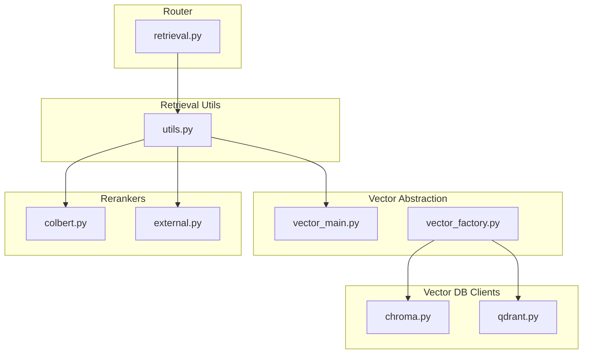
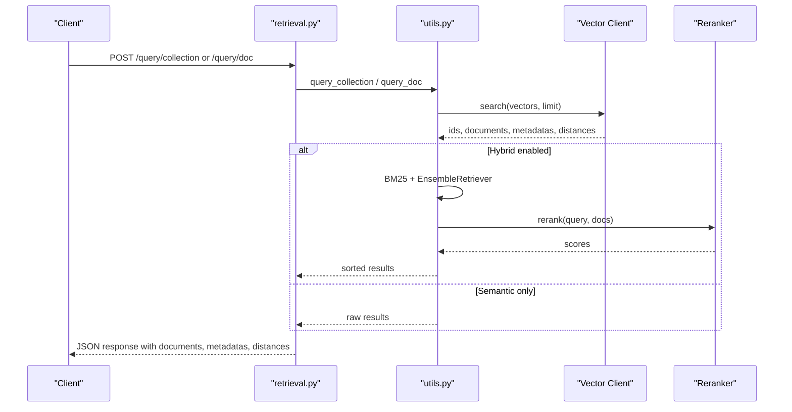
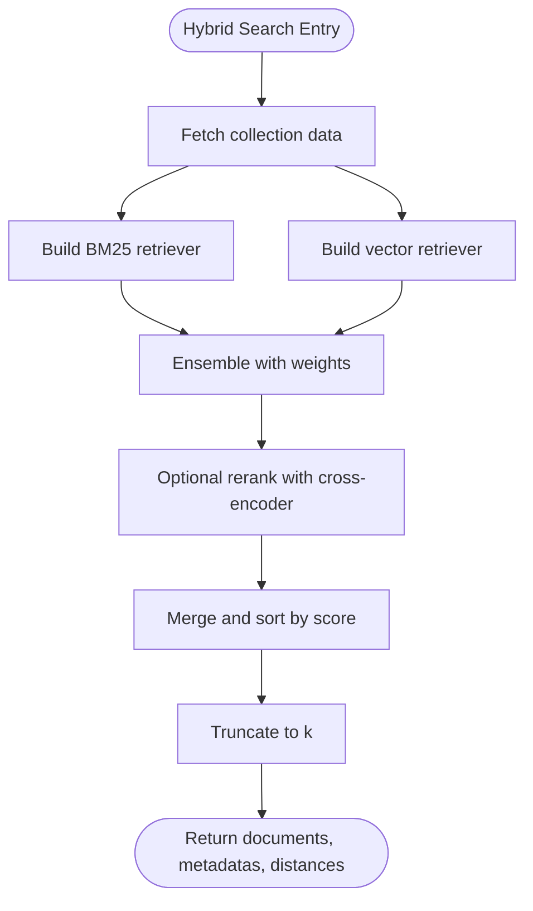
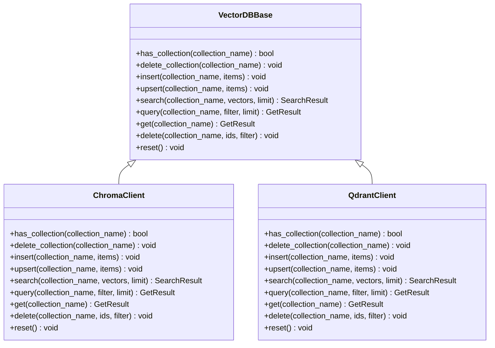

# Retrieval System API

<cite>
**Referenced Files in This Document**
- [retrieval.py](file://backend/open_webui/routers/retrieval.py)
- [utils.py](file://backend/open_webui/retrieval/utils.py)
- [vector_main.py](file://backend/open_webui/retrieval/vector/main.py)
- [vector_factory.py](file://backend/open_webui/retrieval/vector/factory.py)
- [chroma.py](file://backend/open_webui/retrieval/vector/dbs/chroma.py)
- [qdrant.py](file://backend/open_webui/retrieval/vector/dbs/qdrant.py)
- [colbert.py](file://backend/open_webui/retrieval/models/colbert.py)
- [external.py](file://backend/open_webui/retrieval/models/external.py)
</cite>

## Table of Contents
1. [Introduction](#introduction)
2. [Project Structure](#project-structure)
3. [Core Components](#core-components)
4. [Architecture Overview](#architecture-overview)
5. [Detailed Component Analysis](#detailed-component-analysis)
6. [Dependency Analysis](#dependency-analysis)
7. [Performance Considerations](#performance-considerations)
8. [Troubleshooting Guide](#troubleshooting-guide)
9. [Conclusion](#conclusion)

## Introduction
This document describes the Retrieval System API endpoints in open-webui that power document search and retrieval. It covers:
- Semantic search, keyword search, and hybrid retrieval methods
- Query parameters, filters, and response formats
- HTTP methods, URL patterns, and request/response schemas
- Integration with vector databases (Chroma, Qdrant, and others)
- Embeddings generation and similarity search
- Reranking process and how retrieved documents are formatted for AI prompts

## Project Structure
The Retrieval System is implemented under the retrieval router and supporting modules:
- Router endpoints: [retrieval.py](file://backend/open_webui/routers/retrieval.py)
- Utilities for embeddings, reranking, and hybrid search: [utils.py](file://backend/open_webui/retrieval/utils.py)
- Vector database abstraction and clients: [vector_main.py](file://backend/open_webui/retrieval/vector/main.py), [vector_factory.py](file://backend/open_webui/retrieval/vector/factory.py), [chroma.py](file://backend/open_webui/retrieval/vector/dbs/chroma.py), [qdrant.py](file://backend/open_webui/retrieval/vector/dbs/qdrant.py)
- Reranking models: [colbert.py](file://backend/open_webui/retrieval/models/colbert.py), [external.py](file://backend/open_webui/retrieval/models/external.py)

**Diagram sources**
- [retrieval.py](file://backend/open_webui/routers/retrieval.py#L1-L120)
- [utils.py](file://backend/open_webui/retrieval/utils.py#L1-L120)
- [vector_main.py](file://backend/open_webui/retrieval/vector/main.py#L1-L87)
- [vector_factory.py](file://backend/open_webui/retrieval/vector/factory.py#L1-L79)
- [chroma.py](file://backend/open_webui/retrieval/vector/dbs/chroma.py#L1-L199)
- [qdrant.py](file://backend/open_webui/retrieval/vector/dbs/qdrant.py#L1-L255)
- [colbert.py](file://backend/open_webui/retrieval/models/colbert.py#L1-L90)
- [external.py](file://backend/open_webui/retrieval/models/external.py#L1-L71)

**Section sources**
- [retrieval.py](file://backend/open_webui/routers/retrieval.py#L1-L200)
- [utils.py](file://backend/open_webui/retrieval/utils.py#L1-L120)
- [vector_main.py](file://backend/open_webui/retrieval/vector/main.py#L1-L87)
- [vector_factory.py](file://backend/open_webui/retrieval/vector/factory.py#L1-L79)
- [chroma.py](file://backend/open_webui/retrieval/vector/dbs/chroma.py#L1-L199)
- [qdrant.py](file://backend/open_webui/retrieval/vector/dbs/qdrant.py#L1-L255)
- [colbert.py](file://backend/open_webui/retrieval/models/colbert.py#L1-L90)
- [external.py](file://backend/open_webui/retrieval/models/external.py#L1-L71)

## Core Components
- VectorDBBase: Abstract interface for vector database operations (has_collection, delete_collection, insert, upsert, search, query, get, delete, reset)
- Vector clients: ChromaClient and QdrantClient implement VectorDBBase and integrate with respective vector databases
- Embedding and reranking: Utilities generate embeddings (OpenAI, Ollama, Azure OpenAI, Sentence Transformers) and rerankers (ColBERT, CrossEncoder, External)
- Hybrid search: Combines BM25 keyword retrieval with vector similarity and optional cross-encoder reranking

Key responsibilities:
- Retrieval endpoints: document ingestion, web search, and query handlers for single and multiple collections
- Vector DB integration: configurable via factory and environment settings
- Reranking: configurable engine/model and optional external reranker

**Section sources**
- [vector_main.py](file://backend/open_webui/retrieval/vector/main.py#L1-L87)
- [chroma.py](file://backend/open_webui/retrieval/vector/dbs/chroma.py#L1-L199)
- [qdrant.py](file://backend/open_webui/retrieval/vector/dbs/qdrant.py#L1-L255)
- [utils.py](file://backend/open_webui/retrieval/utils.py#L1-L200)
- [colbert.py](file://backend/open_webui/retrieval/models/colbert.py#L1-L90)
- [external.py](file://backend/open_webui/retrieval/models/external.py#L1-L71)

## Architecture Overview
The Retrieval System orchestrates ingestion, embedding, storage, and retrieval:
- Ingestion: process file, text, or web URL into chunks and embeddings
- Storage: insert/upsert into configured vector database (Chroma, Qdrant, etc.)
- Retrieval: semantic similarity search or hybrid search (BM25 + vectors + reranking)
- Formatting: return documents with metadata and relevance scores for prompt construction

**Diagram sources**
- [retrieval.py](file://backend/open_webui/routers/retrieval.py#L2274-L2333)
- [utils.py](file://backend/open_webui/retrieval/utils.py#L402-L533)
- [chroma.py](file://backend/open_webui/retrieval/vector/dbs/chroma.py#L73-L102)
- [qdrant.py](file://backend/open_webui/retrieval/vector/dbs/qdrant.py#L149-L170)
- [colbert.py](file://backend/open_webui/retrieval/models/colbert.py#L1-L90)
- [external.py](file://backend/open_webui/retrieval/models/external.py#L1-L71)

## Detailed Component Analysis

### API Endpoints

#### GET /
- Purpose: Health and configuration probe
- Response: Status and configuration fields (chunk sizes, template, embedding/reranking settings, async embedding flag)

**Section sources**
- [retrieval.py](file://backend/open_webui/routers/retrieval.py#L240-L253)

#### GET /embedding
- Purpose: Retrieve current embedding configuration
- Response: Engine, model, batch size, async flag, plus provider credentials (OpenAI, Ollama, Azure OpenAI)

**Section sources**
- [retrieval.py](file://backend/open_webui/routers/retrieval.py#L255-L277)

#### POST /embedding/update
- Purpose: Update embedding model and provider settings
- Request body: Engine, model, batch size, async flag, plus provider credentials
- Response: Updated configuration

**Section sources**
- [retrieval.py](file://backend/open_webui/routers/retrieval.py#L320-L426)

#### GET /config
- Purpose: Retrieve RAG configuration (templates, TOP_K, hybrid search flags, reranking model/engine, chunking, file limits, web search settings)
- Response: Structured configuration object

**Section sources**
- [retrieval.py](file://backend/open_webui/routers/retrieval.py#L434-L553)

#### POST /config/update
- Purpose: Update RAG configuration
- Request body: Partial configuration updates (supports nested web settings)
- Response: Updated configuration

**Section sources**
- [retrieval.py](file://backend/open_webui/routers/retrieval.py#L687-L1223)

#### POST /process/file
- Purpose: Process a file and save its content to the vector database
- Request body: file_id, optional content, optional collection_name
- Response: status, collection_name, filename, content

Notes:
- Supports overwrite/add modes depending on collection existence
- Uses configured content extraction engine and chunking strategy

**Section sources**
- [retrieval.py](file://backend/open_webui/routers/retrieval.py#L1445-L1671)

#### POST /process/text
- Purpose: Ingest plain text into a collection
- Request body: name, content, optional collection_name
- Response: status, collection_name, content

**Section sources**
- [retrieval.py](file://backend/open_webui/routers/retrieval.py#L1680-L1713)

#### POST /process/web
- Purpose: Ingest a web URL by extracting content and optionally saving to vector DB
- Request body: url, optional collection_name
- Response: status, collection_name, filename, file metadata

**Section sources**
- [retrieval.py](file://backend/open_webui/routers/retrieval.py#L1715-L1761)

#### POST /process/web/search
- Purpose: Perform web search, optionally load pages, and optionally embed/save results
- Request body: queries (list of strings)
- Response: status, collection_names/items/filenames/loaded_count, and optionally docs with content/metadata

**Section sources**
- [retrieval.py](file://backend/open_webui/routers/retrieval.py#L2056-L2188)

#### POST /query/doc
- Purpose: Query a single collection by name
- Request body: collection_name, query, k, k_reranker, r, hybrid, hybrid_bm25_weight
- Response: documents, metadatas, distances (scores normalized to [0,1])

Behavior:
- If hybrid enabled and not disabled, performs hybrid search with BM25 + vectors + reranking
- Otherwise performs semantic search using embeddings

**Section sources**
- [retrieval.py](file://backend/open_webui/routers/retrieval.py#L2200-L2261)

#### POST /query/collection
- Purpose: Query multiple collections with a single query
- Request body: collection_names (list), query, k, k_reranker, r, hybrid, hybrid_bm25_weight, enable_enriched_texts
- Response: merged and sorted documents, metadatas, distances

Behavior:
- If hybrid enabled and not disabled, performs hybrid search across collections
- Otherwise performs semantic search across collections

**Section sources**
- [retrieval.py](file://backend/open_webui/routers/retrieval.py#L2274-L2333)

#### POST /delete
- Purpose: Delete entries from a collection by file hash
- Request body: collection_name, file_id
- Response: status

**Section sources**
- [retrieval.py](file://backend/open_webui/routers/retrieval.py#L2348-L2365)

#### POST /reset/db
- Purpose: Reset the vector database (removes all collections)
- Response: implicit success

**Section sources**
- [retrieval.py](file://backend/open_webui/routers/retrieval.py#L2367-L2371)

#### POST /reset/uploads
- Purpose: Clear uploaded files directory
- Response: True

**Section sources**
- [retrieval.py](file://backend/open_webui/routers/retrieval.py#L2373-L2393)

#### POST /process/files/batch
- Purpose: Batch process multiple files and save to a single collection
- Request body: files (list of file objects), collection_name
- Response: results (per-file status), errors (per-file status/error)

**Section sources**
- [retrieval.py](file://backend/open_webui/routers/retrieval.py#L2423-L2504)

### Request/Response Schemas

Common request/response fields:
- collection_name: string identifier for the vector collection
- queries: list of strings for multi-query operations
- query: single query string
- k: top-k results to return
- k_reranker: top-k for reranking stage
- r: relevance threshold
- hybrid: boolean to enable/disable hybrid search
- hybrid_bm25_weight: weight for BM25 vs vector in ensemble
- enable_enriched_texts: whether to enrich BM25 texts with metadata
- documents: list of text segments
- metadatas: list of metadata objects
- distances: list of normalized similarity scores in [0,1]

Representative schemas:
- QueryDocForm: collection_name, query, k, k_reranker, r, hybrid
- QueryCollectionsForm: collection_names, query, k, k_reranker, r, hybrid, hybrid_bm25_weight, enable_enriched_texts
- ProcessFileForm: file_id, content, collection_name
- ProcessTextForm: name, content, collection_name
- SearchForm: queries (list of strings)

**Section sources**
- [retrieval.py](file://backend/open_webui/routers/retrieval.py#L2191-L2272)
- [retrieval.py](file://backend/open_webui/routers/retrieval.py#L1439-L1444)
- [retrieval.py](file://backend/open_webui/routers/retrieval.py#L1674-L1678)
- [retrieval.py](file://backend/open_webui/routers/retrieval.py#L2056-L2060)

### Search Methods and Behavior

#### Semantic Search
- Generates embeddings for query using configured engine (Sentence Transformers, OpenAI, Ollama, Azure OpenAI)
- Performs similarity search against the vector database
- Returns documents, metadatas, and distances normalized to [0,1]

Integration points:
- Embedding function selection and batching
- Vector client search (Chroma, Qdrant, etc.)

**Section sources**
- [utils.py](file://backend/open_webui/retrieval/utils.py#L777-L800)
- [chroma.py](file://backend/open_webui/retrieval/vector/dbs/chroma.py#L73-L102)
- [qdrant.py](file://backend/open_webui/retrieval/vector/dbs/qdrant.py#L149-L170)

#### Keyword Search (BM25)
- Builds BM25 retriever from documents and optional enriched texts
- Enriched texts include filename/title/headings/source/snippet metadata
- Used in hybrid search ensemble

**Section sources**
- [utils.py](file://backend/open_webui/retrieval/utils.py#L169-L205)

#### Hybrid Retrieval
- Ensemble of BM25 and vector retrievers weighted by hybrid_bm25_weight
- Optional cross-encoder reranking with configurable top-n and relevance threshold
- Results merged and sorted by score, truncated to k

**Diagram sources**
- [utils.py](file://backend/open_webui/retrieval/utils.py#L207-L315)
- [utils.py](file://backend/open_webui/retrieval/utils.py#L456-L533)

**Section sources**
- [utils.py](file://backend/open_webui/retrieval/utils.py#L207-L315)
- [utils.py](file://backend/open_webui/retrieval/utils.py#L456-L533)

### Reranking
Supported rerankers:
- ColBERT: specialized cross-encoder model for fine-grained relevance
- CrossEncoder: generic cross-encoder reranker
- External: external reranker service endpoint

Configuration:
- Engine/model selection and optional external URL/API key
- Top-n and relevance threshold for reranking

**Section sources**
- [colbert.py](file://backend/open_webui/retrieval/models/colbert.py#L1-L90)
- [external.py](file://backend/open_webui/retrieval/models/external.py#L1-L71)
- [retrieval.py](file://backend/open_webui/routers/retrieval.py#L886-L953)

### Vector Database Integration
Factory selects vector database client based on configuration:
- Chroma (local persistent or HTTP)
- Qdrant (REST or gRPC)
- Others supported via factory mapping

Clients implement VectorDBBase:
- has_collection, delete_collection, insert, upsert, search, query, get, delete, reset
- Distances normalized to [0,1] for consistent scoring across backends

**Section sources**
- [vector_factory.py](file://backend/open_webui/retrieval/vector/factory.py#L1-L79)
- [chroma.py](file://backend/open_webui/retrieval/vector/dbs/chroma.py#L64-L102)
- [qdrant.py](file://backend/open_webui/retrieval/vector/dbs/qdrant.py#L149-L170)

### Prompt Formatting
Retrieved documents are returned with:
- page_content (text)
- metadata (source, filename/title/headings/snippet/etc.)
- distances/scores for relevance ordering

These fields are suitable for constructing prompts with context windows and citations.

**Section sources**
- [utils.py](file://backend/open_webui/retrieval/utils.py#L135-L167)
- [utils.py](file://backend/open_webui/retrieval/utils.py#L317-L383)

## Dependency Analysis

**Diagram sources**
- [vector_main.py](file://backend/open_webui/retrieval/vector/main.py#L23-L87)
- [chroma.py](file://backend/open_webui/retrieval/vector/dbs/chroma.py#L33-L199)
- [qdrant.py](file://backend/open_webui/retrieval/vector/dbs/qdrant.py#L33-L255)

**Section sources**
- [vector_main.py](file://backend/open_webui/retrieval/vector/main.py#L1-L87)
- [chroma.py](file://backend/open_webui/retrieval/vector/dbs/chroma.py#L1-L199)
- [qdrant.py](file://backend/open_webui/retrieval/vector/dbs/qdrant.py#L1-L255)

## Performance Considerations
- Embedding batching and async generation reduce latency for multi-query scenarios
- Hybrid search adds computational overhead; tune k_reranker and hybrid_bm25_weight to balance quality and speed
- Vector DB client normalization ensures consistent scoring across backends
- Chunking and text splitters impact recall; choose appropriate splitter and overlap for domain

[No sources needed since this section provides general guidance]

## Troubleshooting Guide
- Duplicate content detection: saving documents raises duplicate content error when hash matches existing entries
- Embedding provider errors: OpenAI/Ollama/Azure failures propagate with HTTP exceptions
- Web search errors: missing API keys or invalid configurations raise explicit errors
- Vector DB reset: admin-only endpoint to clear all collections

**Section sources**
- [retrieval.py](file://backend/open_webui/routers/retrieval.py#L1263-L1275)
- [retrieval.py](file://backend/open_webui/routers/retrieval.py#L1650-L1667)
- [retrieval.py](file://backend/open_webui/routers/retrieval.py#L2092-L2104)
- [retrieval.py](file://backend/open_webui/routers/retrieval.py#L2367-L2371)

## Conclusion
The Retrieval System provides a flexible, extensible framework for document search and retrieval:
- Semantic search via embeddings
- Keyword search via BM25
- Hybrid retrieval with optional reranking
- Pluggable vector databases and rerankers
- Batch ingestion and robust configuration management

This enables high-quality context retrieval for AI prompts while supporting diverse deployment environments and providers.