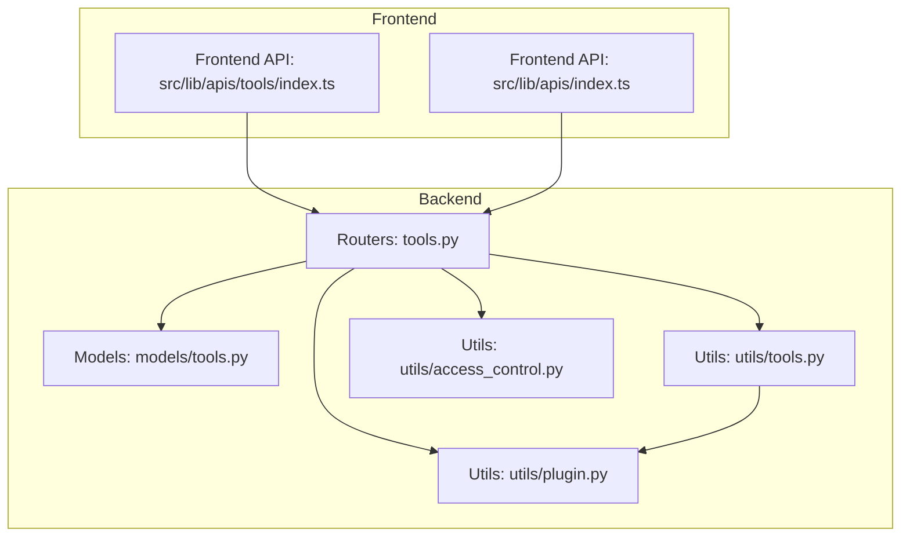
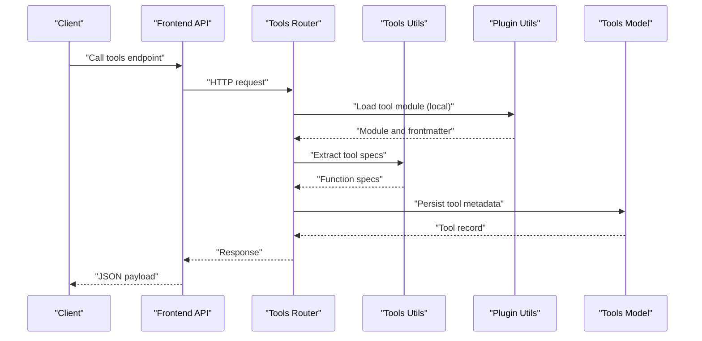
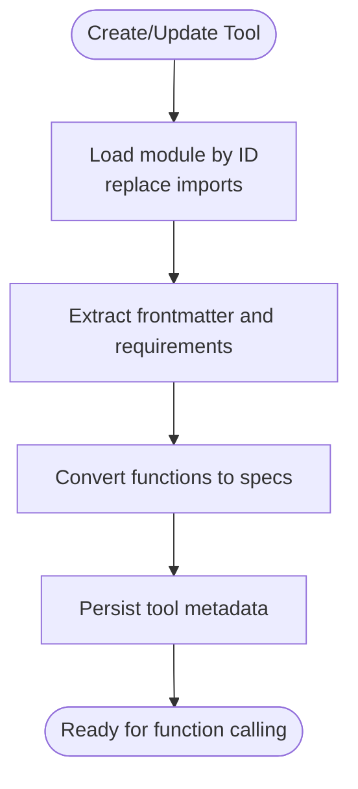
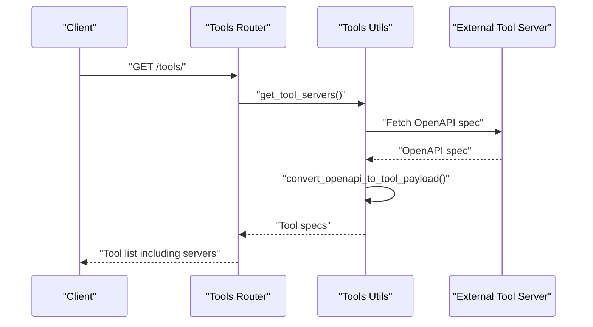
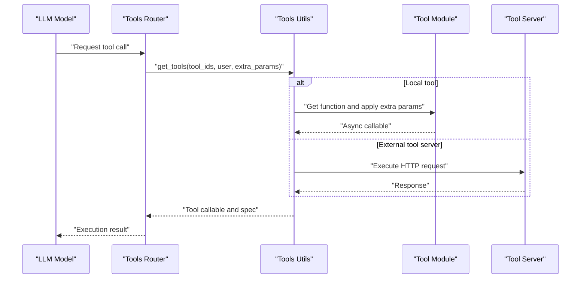
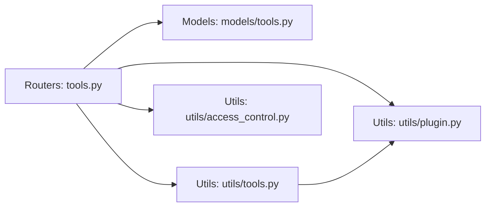

# Tools Integration API

<cite>
**Referenced Files in This Document**
- [tools.py](file://backend/open_webui/routers/tools.py)
- [models/tools.py](file://backend/open_webui/models/tools.py)
- [utils/tools.py](file://backend/open_webui/utils/tools.py)
- [utils/plugin.py](file://backend/open_webui/utils/plugin.py)
- [utils/access_control.py](file://backend/open_webui/utils/access_control.py)
- [src/lib/apis/tools/index.ts](file://src/lib/apis/tools/index.ts)
- [src/lib/apis/index.ts](file://src/lib/apis/index.ts)
</cite>

## Table of Contents
1. [Introduction](#introduction)
2. [Project Structure](#project-structure)
3. [Core Components](#core-components)
4. [Architecture Overview](#architecture-overview)
5. [Detailed Component Analysis](#detailed-component-analysis)
6. [Dependency Analysis](#dependency-analysis)
7. [Performance Considerations](#performance-considerations)
8. [Troubleshooting Guide](#troubleshooting-guide)
9. [Conclusion](#conclusion)
10. [Appendices](#appendices)

## Introduction
This document describes the Tools Integration API in open-webui, focusing on endpoints for managing external tools and functions that can be invoked by AI models. It covers tool registration, tool specification extraction, tool servers integration (OpenAPI and MCP), tool access controls, and how tools are exposed to models during chat interactions. It also documents HTTP methods, URL patterns, request/response schemas, and security considerations for executing external code.

## Project Structure
The Tools Integration API spans backend routers, models, utilities, and frontend API bindings:
- Backend routers expose REST endpoints under the tools router.
- Models define the database schema and Pydantic models for tools and responses.
- Utilities handle tool loading, function-to-spec conversion, tool server discovery, and execution.
- Frontend APIs wrap the backend endpoints for client-side usage.

**Diagram sources**
- [tools.py](file://backend/open_webui/routers/tools.py#L1-L648)
- [models/tools.py](file://backend/open_webui/models/tools.py#L1-L275)
- [utils/tools.py](file://backend/open_webui/utils/tools.py#L1-L861)
- [utils/plugin.py](file://backend/open_webui/utils/plugin.py#L1-L200)
- [utils/access_control.py](file://backend/open_webui/utils/access_control.py#L1-L175)
- [src/lib/apis/tools/index.ts](file://src/lib/apis/tools/index.ts#L1-L457)
- [src/lib/apis/index.ts](file://src/lib/apis/index.ts#L297-L423)

**Section sources**
- [tools.py](file://backend/open_webui/routers/tools.py#L1-L648)
- [models/tools.py](file://backend/open_webui/models/tools.py#L1-L275)
- [utils/tools.py](file://backend/open_webui/utils/tools.py#L1-L861)
- [utils/plugin.py](file://backend/open_webui/utils/plugin.py#L1-L200)
- [utils/access_control.py](file://backend/open_webui/utils/access_control.py#L1-L175)
- [src/lib/apis/tools/index.ts](file://src/lib/apis/tools/index.ts#L1-L457)
- [src/lib/apis/index.ts](file://src/lib/apis/index.ts#L297-L423)

## Core Components
- Tools Router: REST endpoints for listing, creating, updating, deleting, and retrieving tool configurations and valves.
- Tools Model: SQLAlchemy ORM and Pydantic models for tool storage, user exposure, and forms.
- Tools Utilities: Tool loading, function-to-openai-function spec conversion, tool server discovery and execution, and OpenAPI spec parsing.
- Plugin Utilities: Dynamic module loading and import path replacement for tools.
- Access Control Utilities: Permission and access control evaluation for tools.
- Frontend APIs: Client-side wrappers around backend endpoints.

Key responsibilities:
- Manage local tools (Python modules with a Tools class) and external tool servers (OpenAPI/MCP).
- Convert tool functions into function calling specs compatible with LLMs.
- Enforce access control and permissions for tool visibility and mutation.
- Provide user and per-user valves for tool configuration.

**Section sources**
- [tools.py](file://backend/open_webui/routers/tools.py#L55-L648)
- [models/tools.py](file://backend/open_webui/models/tools.py#L24-L275)
- [utils/tools.py](file://backend/open_webui/utils/tools.py#L110-L323)
- [utils/plugin.py](file://backend/open_webui/utils/plugin.py#L71-L116)
- [utils/access_control.py](file://backend/open_webui/utils/access_control.py#L71-L175)
- [src/lib/apis/tools/index.ts](file://src/lib/apis/tools/index.ts#L1-L457)

## Architecture Overview
The Tools Integration API orchestrates:
- Tool CRUD and listing via FastAPI routers.
- Tool loading and function spec extraction via utilities.
- Tool server discovery and execution via utilities.
- Access control enforcement via access control utilities.
- Frontend API bindings for client consumption.

**Diagram sources**
- [tools.py](file://backend/open_webui/routers/tools.py#L270-L333)
- [utils/tools.py](file://backend/open_webui/utils/tools.py#L438-L448)
- [utils/plugin.py](file://backend/open_webui/utils/plugin.py#L71-L116)
- [models/tools.py](file://backend/open_webui/models/tools.py#L114-L139)

## Detailed Component Analysis

### Tools Router Endpoints
The tools router exposes the following endpoints:

- GET /tools/
  - Purpose: List available tools for the current user, including local tools and tool servers.
  - Authentication: Verified user required.
  - Access control: Respects user ownership and configured access control rules.
  - Response: Array of ToolUserResponse.

- GET /tools/list
  - Purpose: List tools accessible to the current user (admin sees all when bypass enabled).
  - Authentication: Verified user required.
  - Response: Array of ToolUserResponse.

- POST /tools/load/url
  - Purpose: Load tool content from a GitHub URL for admin users.
  - Authentication: Admin required.
  - Request: LoadUrlForm with a URL.
  - Response: JSON with name and content.

- GET /tools/export
  - Purpose: Export tools (admin or user with permission).
  - Authentication: Verified user required; permission checked against user permissions.
  - Response: Array of ToolModel.

- POST /tools/create
  - Purpose: Create a new tool from content.
  - Authentication: Verified user required; admin or workspace.tools or workspace.tools_import permission.
  - Request: ToolForm with id, name, content, meta, access_control.
  - Response: ToolResponse.

- GET /tools/id/{id}
  - Purpose: Retrieve a tool by ID.
  - Authentication: Verified user required; owner, group with read access, or admin.
  - Response: ToolModel.

- POST /tools/id/{id}/update
  - Purpose: Update an existing tool.
  - Authentication: Verified user required; owner, group with write access, or admin.
  - Request: ToolForm.
  - Response: ToolModel.

- DELETE /tools/id/{id}/delete
  - Purpose: Delete a tool.
  - Authentication: Verified user required; owner, group with write access, or admin.
  - Response: Boolean.

- GET /tools/id/{id}/valves
  - Purpose: Get tool-wide valves.
  - Authentication: Verified user required.
  - Response: JSON object.

- GET /tools/id/{id}/valves/spec
  - Purpose: Get tool valves schema.
  - Authentication: Verified user required.
  - Response: JSON schema.

- POST /tools/id/{id}/valves/update
  - Purpose: Update tool-wide valves.
  - Authentication: Verified user required; owner, group with write access, or admin.
  - Request: JSON object.
  - Response: JSON object.

- GET /tools/id/{id}/valves/user
  - Purpose: Get per-user valves.
  - Authentication: Verified user required.
  - Response: JSON object.

- GET /tools/id/{id}/valves/user/spec
  - Purpose: Get per-user valves schema.
  - Authentication: Verified user required.
  - Response: JSON schema.

- POST /tools/id/{id}/valves/user/update
  - Purpose: Update per-user valves.
  - Authentication: Verified user required.
  - Request: JSON object.
  - Response: JSON object.

HTTP Methods and URL Patterns
- GET /tools/
- GET /tools/list
- POST /tools/load/url
- GET /tools/export
- POST /tools/create
- GET /tools/id/{id}
- POST /tools/id/{id}/update
- DELETE /tools/id/{id}/delete
- GET /tools/id/{id}/valves
- GET /tools/id/{id}/valves/spec
- POST /tools/id/{id}/valves/update
- GET /tools/id/{id}/valves/user
- GET /tools/id/{id}/valves/user/spec
- POST /tools/id/{id}/valves/user/update

Request/Response Schemas
- ToolForm: id, name, content, meta, access_control.
- ToolModel: id, user_id, name, content, specs, meta, access_control, updated_at, created_at.
- ToolResponse: id, user_id, name, meta, access_control, updated_at, created_at.
- ToolUserResponse: ToolResponse plus user and extra fields.
- ToolValves: valves.
- LoadUrlForm: url.

Examples
- Tool definition payload (ToolForm):
  - id: string (alphanumeric and underscore only)
  - name: string
  - content: string (Python module content)
  - meta: object with description and manifest
  - access_control: optional object controlling read/write access

- Response payload (ToolUserResponse):
  - id, user_id, name, meta, access_control, updated_at, created_at, and extra fields for tool servers

- Tool valves payloads:
  - Tool-wide valves: JSON object
  - Per-user valves: JSON object

Security and Access Controls
- Admin bypass flag affects whether admins can see all tools.
- Access control rules support group and user-level read/write permissions.
- Permissions checked via has_access and has_permission helpers.

**Section sources**
- [tools.py](file://backend/open_webui/routers/tools.py#L55-L648)
- [models/tools.py](file://backend/open_webui/models/tools.py#L56-L112)
- [utils/access_control.py](file://backend/open_webui/utils/access_control.py#L71-L175)
- [src/lib/apis/tools/index.ts](file://src/lib/apis/tools/index.ts#L1-L457)

### Tool Registration and Specification Extraction
Local tools are Python modules with a Tools class. The system:
- Loads the module dynamically.
- Replaces import paths for internal modules.
- Extracts frontmatter and installs requirements if present.
- Converts tool functions into function specs compatible with LLM function calling.

**Diagram sources**
- [utils/plugin.py](file://backend/open_webui/utils/plugin.py#L71-L116)
- [utils/tools.py](file://backend/open_webui/utils/tools.py#L438-L448)
- [tools.py](file://backend/open_webui/routers/tools.py#L270-L333)

**Section sources**
- [utils/plugin.py](file://backend/open_webui/utils/plugin.py#L71-L116)
- [utils/tools.py](file://backend/open_webui/utils/tools.py#L438-L448)
- [tools.py](file://backend/open_webui/routers/tools.py#L270-L333)

### Tool Servers Integration (OpenAPI and MCP)
The system integrates with external tool servers:
- OpenAPI tool servers: Discovery via OpenAPI spec, conversion to tool specs, and execution via HTTP requests.
- MCP tool servers: OAuth 2.1 discovery and session token handling for authenticated connections.

**Diagram sources**
- [tools.py](file://backend/open_webui/routers/tools.py#L71-L139)
- [utils/tools.py](file://backend/open_webui/utils/tools.py#L562-L733)
- [src/lib/apis/index.ts](file://src/lib/apis/index.ts#L297-L423)

**Section sources**
- [tools.py](file://backend/open_webui/routers/tools.py#L71-L139)
- [utils/tools.py](file://backend/open_webui/utils/tools.py#L562-L733)
- [src/lib/apis/index.ts](file://src/lib/apis/index.ts#L297-L423)

### Tool Execution Flow
When a model invokes a tool:
- For local tools: The function is bound with extra parameters (__id__, __user__) and executed asynchronously.
- For tool servers: The matching OpenAPI operation is located and executed with prepared headers/cookies.

**Diagram sources**
- [utils/tools.py](file://backend/open_webui/utils/tools.py#L109-L323)
- [utils/tools.py](file://backend/open_webui/utils/tools.py#L736-L861)

**Section sources**
- [utils/tools.py](file://backend/open_webui/utils/tools.py#L109-L323)
- [utils/tools.py](file://backend/open_webui/utils/tools.py#L736-L861)

### Tool Access Controls and Security
Access control rules:
- access_control: Optional object specifying read/write permissions for groups and users.
- has_access and has_permission enforce permissions based on user roles and group memberships.
- Admin bypass flag allows admins to see all tools when enabled.

Security considerations:
- Tool content is loaded dynamically; import paths are normalized.
- Tool servers support bearer/session/system_oauth authentication modes.
- Tool server specs can be fetched from URLs or provided inline JSON.
- Tool server execution uses aiohttp with timeouts and SSL options.

**Section sources**
- [models/tools.py](file://backend/open_webui/models/tools.py#L24-L54)
- [utils/access_control.py](file://backend/open_webui/utils/access_control.py#L71-L175)
- [tools.py](file://backend/open_webui/routers/tools.py#L141-L153)
- [utils/tools.py](file://backend/open_webui/utils/tools.py#L590-L665)
- [utils/tools.py](file://backend/open_webui/utils/tools.py#L800-L861)

## Dependency Analysis
The tools router depends on:
- Models for persistence and user exposure.
- Utilities for tool loading, spec extraction, tool server discovery, and execution.
- Plugin utilities for dynamic module loading.
- Access control utilities for permission checks.

**Diagram sources**
- [tools.py](file://backend/open_webui/routers/tools.py#L1-L648)
- [models/tools.py](file://backend/open_webui/models/tools.py#L1-L275)
- [utils/tools.py](file://backend/open_webui/utils/tools.py#L1-L861)
- [utils/plugin.py](file://backend/open_webui/utils/plugin.py#L1-L200)
- [utils/access_control.py](file://backend/open_webui/utils/access_control.py#L1-L175)

**Section sources**
- [tools.py](file://backend/open_webui/routers/tools.py#L1-L648)
- [models/tools.py](file://backend/open_webui/models/tools.py#L1-L275)
- [utils/tools.py](file://backend/open_webui/utils/tools.py#L1-L861)
- [utils/plugin.py](file://backend/open_webui/utils/plugin.py#L1-L200)
- [utils/access_control.py](file://backend/open_webui/utils/access_control.py#L1-L175)

## Performance Considerations
- Concurrent tool server discovery: Uses asyncio gather to fetch multiple OpenAPI specs in parallel.
- Caching: Tool modules and content are cached in application state to avoid repeated loads.
- Timeouts: HTTP requests to tool servers use configurable timeouts and SSL options.
- Filtering: Tool server function name filtering reduces unnecessary function exposure.

[No sources needed since this section provides general guidance]

## Troubleshooting Guide
Common issues and resolutions:
- Tool not found: Ensure the tool ID exists and the user has access or is admin.
- Permission denied: Verify user permissions and access_control configuration.
- Tool server connectivity: Check auth_type and keys; verify OpenAPI spec availability.
- Import errors: Confirm import paths are replaced and requirements are installed.

**Section sources**
- [tools.py](file://backend/open_webui/routers/tools.py#L340-L454)
- [utils/tools.py](file://backend/open_webui/utils/tools.py#L590-L665)
- [utils/plugin.py](file://backend/open_webui/utils/plugin.py#L71-L116)

## Conclusion
The Tools Integration API provides a robust framework for registering, exposing, and invoking tools in open-webui. It supports both local Python modules and external tool servers, enforces granular access controls, and integrates seamlessly with the function calling system used by AI models during chat interactions.

[No sources needed since this section summarizes without analyzing specific files]

## Appendices

### API Reference Summary
- Base URL: /tools
- Authentication: Bearer token required for protected endpoints.
- Authorization: Depends on user role and access_control rules.

Endpoints
- GET /tools/ - List tools for the current user
- GET /tools/list - List tools accessible to the user
- POST /tools/load/url - Load tool content from a GitHub URL (admin)
- GET /tools/export - Export tools (admin or permissioned)
- POST /tools/create - Create a new tool
- GET /tools/id/{id} - Get tool by ID
- POST /tools/id/{id}/update - Update tool
- DELETE /tools/id/{id}/delete - Delete tool
- GET /tools/id/{id}/valves - Get tool valves
- GET /tools/id/{id}/valves/spec - Get tool valves schema
- POST /tools/id/{id}/valves/update - Update tool valves
- GET /tools/id/{id}/valves/user - Get per-user valves
- GET /tools/id/{id}/valves/user/spec - Get per-user valves schema
- POST /tools/id/{id}/valves/user/update - Update per-user valves

Request/Response Schemas
- ToolForm: id, name, content, meta, access_control
- ToolModel: id, user_id, name, content, specs, meta, access_control, updated_at, created_at
- ToolResponse: id, user_id, name, meta, access_control, updated_at, created_at
- ToolUserResponse: ToolResponse plus user and extra fields
- ToolValves: valves
- LoadUrlForm: url

**Section sources**
- [tools.py](file://backend/open_webui/routers/tools.py#L55-L648)
- [models/tools.py](file://backend/open_webui/models/tools.py#L56-L112)
- [src/lib/apis/tools/index.ts](file://src/lib/apis/tools/index.ts#L1-L457)