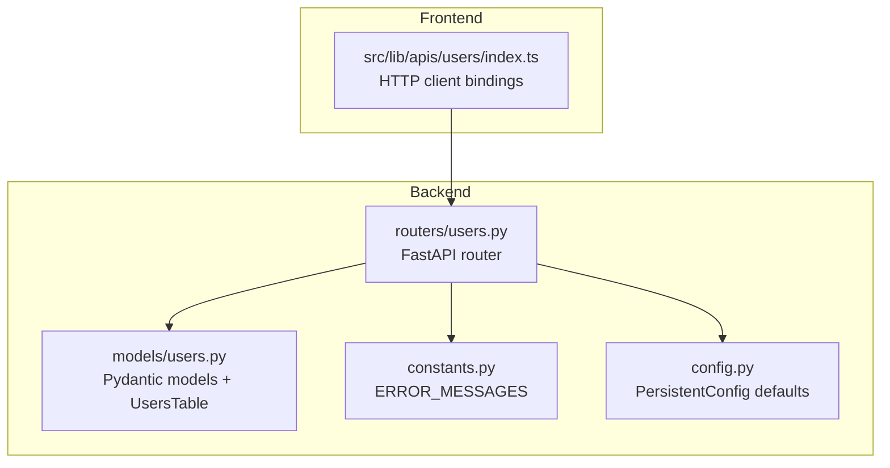
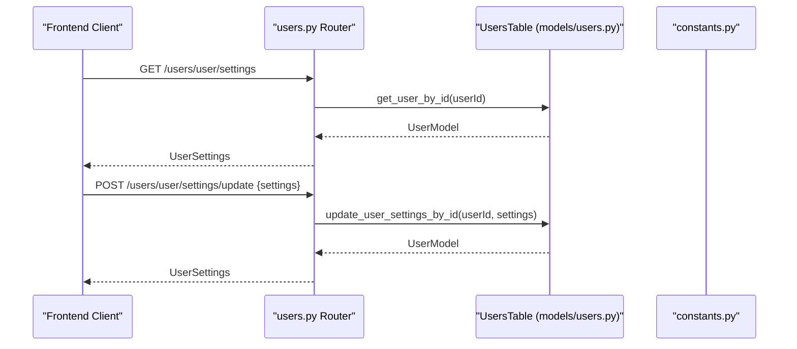
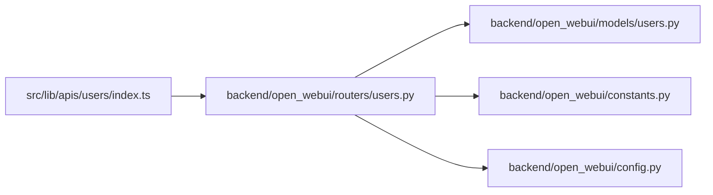

# User Management API

<cite>
**Referenced Files in This Document**
- [users.py](file://backend/open_webui/routers/users.py)
- [users.py](file://backend/open_webui/models/users.py)
- [index.ts](file://src/lib/apis/users/index.ts)
- [constants.py](file://backend/open_webui/constants.py)
- [config.py](file://backend/open_webui/config.py)
</cite>

## Table of Contents
1. [Introduction](#introduction)
2. [Project Structure](#project-structure)
3. [Core Components](#core-components)
4. [Architecture Overview](#architecture-overview)
5. [Detailed Component Analysis](#detailed-component-analysis)
6. [Dependency Analysis](#dependency-analysis)
7. [Performance Considerations](#performance-considerations)
8. [Troubleshooting Guide](#troubleshooting-guide)
9. [Conclusion](#conclusion)

## Introduction
This document describes the User Management API endpoints implemented in the backend router module for retrieving user information, updating user profiles, and managing user settings. It covers:
- Current user endpoints for settings, status, and profile info
- User-specific configuration updates and permissions
- Admin-only endpoints for listing, searching, and updating users
- How user data is persisted and synchronized across sessions
- How user settings influence application behavior and UI

## Project Structure
The User Management API is implemented in the backend router and backed by SQLAlchemy models and database utilities. Frontend API bindings are provided in the frontend library.

**Diagram sources**
- [users.py](file://backend/open_webui/routers/users.py#L1-L621)
- [users.py](file://backend/open_webui/models/users.py#L1-L719)
- [index.ts](file://src/lib/apis/users/index.ts#L1-L553)
- [constants.py](file://backend/open_webui/constants.py#L1-L127)
- [config.py](file://backend/open_webui/config.py#L1100-L1299)

**Section sources**
- [users.py](file://backend/open_webui/routers/users.py#L1-L621)
- [users.py](file://backend/open_webui/models/users.py#L1-L719)
- [index.ts](file://src/lib/apis/users/index.ts#L1-L553)
- [constants.py](file://backend/open_webui/constants.py#L1-L127)
- [config.py](file://backend/open_webui/config.py#L1100-L1299)

## Core Components
- Router module: Defines FastAPI endpoints under the users route prefix.
- Models: Pydantic models define request/response schemas and database-backed UsersTable for persistence.
- Frontend bindings: TypeScript module exposes typed HTTP calls to the backend endpoints.
- Constants: Centralized error messages used by the router.
- Configuration: Persistent configuration keys that influence UI defaults and permissions.

Key responsibilities:
- Retrieve current user settings, status, and profile info
- Update user settings and profile info
- Admin-only listing, searching, and updating users
- Enforce permissions and role-based access

**Section sources**
- [users.py](file://backend/open_webui/routers/users.py#L1-L621)
- [users.py](file://backend/open_webui/models/users.py#L1-L719)
- [index.ts](file://src/lib/apis/users/index.ts#L1-L553)
- [constants.py](file://backend/open_webui/constants.py#L1-L127)
- [config.py](file://backend/open_webui/config.py#L1100-L1299)

## Architecture Overview
The API follows a layered architecture:
- Router layer handles HTTP requests/responses and applies authentication/authorization
- Models layer defines schemas and database operations
- Frontend layer consumes endpoints via typed fetch calls

**Diagram sources**
- [users.py](file://backend/open_webui/routers/users.py#L259-L301)
- [users.py](file://backend/open_webui/models/users.py#L597-L627)
- [constants.py](file://backend/open_webui/constants.py#L19-L75)

## Detailed Component Analysis

### Current User Endpoints
These endpoints are available to verified users and operate on the session user’s identity.

- GET /users/user/settings
  - Purpose: Retrieve current user settings
  - Authentication: Verified user
  - Response: Optional UserSettings
  - Behavior: Returns user.settings from the database; raises error if user not found

- POST /users/user/settings/update
  - Purpose: Update current user settings
  - Authentication: Verified user
  - Request body: UserSettings
  - Behavior:
    - If user is not admin and settings include ui.toolServers, permission check is enforced
    - Updates user.settings and returns the updated settings
  - Errors: USER_NOT_FOUND on failure

- GET /users/user/status
  - Purpose: Retrieve current user status fields
  - Authentication: Verified user
  - Response: UserStatus-like object (status_emoji, status_message, status_expires_at)

- POST /users/user/status/update
  - Purpose: Update current user status fields
  - Authentication: Verified user
  - Request body: UserStatus
  - Response: Updated user record

- GET /users/user/info
  - Purpose: Retrieve current user info (free-form dictionary)
  - Authentication: Verified user
  - Response: Optional dict

- POST /users/user/info/update
  - Purpose: Update current user info (merge operation)
  - Authentication: Verified user
  - Request body: dict (fields to merge)
  - Response: Updated info dict

- GET /users/{user_id}
  - Purpose: Get user by ID with active status flag
  - Authentication: Verified user
  - Path param: user_id (supports shared-chat prefix)
  - Response: UserActiveResponse (includes is_active)

- GET /users/{user_id}/active
  - Purpose: Get active status for a user
  - Authentication: Verified user
  - Response: { active: bool }

- GET /users/{user_id}/profile/image
  - Purpose: Serve user profile image (URL redirect or inline stream)
  - Authentication: Verified user
  - Behavior: If profile_image_url is a URL, redirects; if base64 data URI, streams image; otherwise returns default image

- GET /users/{user_id}/oauth/sessions
  - Purpose: List OAuth sessions for a user
  - Authentication: Admin user
  - Response: OAuth sessions list

- GET /users/{user_id}/groups
  - Purpose: List groups for a user
  - Authentication: Admin user

- DELETE /users/{user_id}
  - Purpose: Delete a user
  - Authentication: Admin user
  - Constraints: Prevents deletion of primary admin and self-deletion

- POST /users/{user_id}/update
  - Purpose: Admin-only update of user profile
  - Authentication: Admin user
  - Request body: UserUpdateForm (role, name, email, profile_image_url, optional password)
  - Behavior:
    - Validates uniqueness of email
    - Validates password if provided
    - Updates credentials and user profile
  - Constraints: Prevents primary admin self-modification and role changes

- GET /users/groups
  - Purpose: Get groups for the current user
  - Authentication: Verified user

- GET /users/permissions
  - Purpose: Get computed permissions for the current user
  - Authentication: Verified user
  - Response: UserPermissions (computed from app config)

- GET /users/default/permissions
  - Purpose: Get default user permissions template
  - Authentication: Admin user
  - Response: UserPermissions

- POST /users/default/permissions
  - Purpose: Update default user permissions template
  - Authentication: Admin user
  - Request body: UserPermissions
  - Response: Updated template

- GET /users/
  - Purpose: Admin-only paginated listing of users with group ids
  - Query params: query, order_by, direction, page
  - Response: UserGroupIdsListResponse

- GET /users/all
  - Purpose: Admin-only listing of all users
  - Response: UserInfoListResponse

- GET /users/search
  - Purpose: Search users (verified user)
  - Query params: query, order_by, direction, page
  - Response: UserInfoListResponse

- GET /users/{user_id}/groups
  - Purpose: Admin-only list groups for a user
  - Response: Groups list

Notes:
- All endpoints that require admin enforce admin-only access via dependency.
- Many endpoints depend on verified user for access control.
- Errors consistently use centralized ERROR_MESSAGES.

**Section sources**
- [users.py](file://backend/open_webui/routers/users.py#L259-L621)
- [users.py](file://backend/open_webui/models/users.py#L1-L719)
- [constants.py](file://backend/open_webui/constants.py#L19-L75)

### Request/Response Schemas

- UserSettings
  - Type: dict-like with ui field
  - Notes: ui is a free-form dict; extra fields allowed

- UserUpdateForm
  - Fields: role, name, email, profile_image_url, password (optional)

- UserStatus
  - Fields: status_emoji (optional), status_message (optional), status_expires_at (optional)

- UserActiveResponse
  - Extends UserStatus with name, profile_image_url, is_active

- UserGroupIdsModel
  - Extends UserModel with group_ids list

- UserPermissions (response)
  - Nested structure:
    - workspace: WorkspacePermissions
    - sharing: SharingPermissions
    - chat: ChatPermissions
    - features: FeaturesPermissions

- WorkspacePermissions
  - Keys: models, knowledge, prompts, tools, models_import, models_export, prompts_import, prompts_export, tools_import, tools_export

- SharingPermissions
  - Keys: models, public_models, knowledge, public_knowledge, prompts, public_prompts, tools, public_tools, notes, public_notes

- ChatPermissions
  - Keys: controls, valves, system_prompt, params, file_upload, delete, delete_message, continue_response, regenerate_response, rate_response, edit, share, export, stt, tts, call, multiple_models, temporary, temporary_enforced

- FeaturesPermissions
  - Keys: api_keys, notes, channels, folders, direct_tool_servers, web_search, image_generation, code_interpreter

- UserInfoResponse
  - Fields: id, name, email, role, status fields

- UserGroupIdsListResponse
  - Fields: users (list of UserGroupIdsModel), total (int)

- UserInfoListResponse
  - Fields: users (list of UserInfoResponse), total (int)

- UserStatusModel
  - Extends UserModel with is_active

- UserModel
  - Fields: id, email, username (optional), role, name, profile_image_url, profile_banner_image_url (optional), bio (optional), gender (optional), date_of_birth (optional), timezone (optional), presence_state (optional), status_emoji (optional), status_message (optional), status_expires_at (optional), info (optional), settings (optional), oauth (optional), last_active_at, updated_at, created_at

**Section sources**
- [users.py](file://backend/open_webui/models/users.py#L39-L236)
- [users.py](file://backend/open_webui/routers/users.py#L161-L244)

### Endpoint Catalog

- Current User Settings
  - GET /users/user/settings
  - POST /users/user/settings/update

- Current User Status and Info
  - GET /users/user/status
  - POST /users/user/status/update
  - GET /users/user/info
  - POST /users/user/info/update

- User Lookup and Images
  - GET /users/{user_id}
  - GET /users/{user_id}/active
  - GET /users/{user_id}/profile/image

- Admin: Users and Groups
  - GET /users/
  - GET /users/all
  - GET /users/search
  - GET /users/{user_id}/groups
  - POST /users/{user_id}/update
  - DELETE /users/{user_id}

- Admin: Permissions
  - GET /users/default/permissions
  - POST /users/default/permissions

- Current User: Groups and Permissions
  - GET /users/groups
  - GET /users/permissions

**Section sources**
- [users.py](file://backend/open_webui/routers/users.py#L57-L621)

### Data Storage and Synchronization

- Persistence
  - UsersTable persists user records with JSON fields for settings and info.
  - Active status is tracked via last_active_at with throttled updates.

- Synchronization Across Sessions
  - Settings and info are stored per-user and returned on demand.
  - Active status is derived from last_active_at and considered active if within a short threshold.

- Throttling
  - Last active timestamp updates are throttled to reduce DB writes.

- OAuth Integration
  - OAuth provider entries are stored in the user’s oauth JSON field.

**Section sources**
- [users.py](file://backend/open_webui/models/users.py#L551-L564)
- [users.py](file://backend/open_webui/models/users.py#L565-L596)

### How User Settings Affect Application Behavior and Interface

- UI Defaults
  - Configuration keys under ui.* influence UI defaults and overlays.
  - Examples include default locale, prompt suggestions, watermark, and pending user overlay content.

- Permissions
  - Default permissions templates are exposed and can be updated by admins.
  - Current user permissions are computed and returned for the session user.

- Role-Based Access
  - Certain endpoints require admin role.
  - Some settings updates are gated by permissions (e.g., direct_tool_servers).

- Frontend Consumption
  - Frontend API module exposes typed calls for settings, status, info, and user updates.

**Section sources**
- [config.py](file://backend/open_webui/config.py#L1100-L1299)
- [users.py](file://backend/open_webui/routers/users.py#L161-L244)
- [index.ts](file://src/lib/apis/users/index.ts#L1-L553)

## Dependency Analysis

- Coupling
  - Router depends on models for schemas and database operations.
  - Router depends on constants for error messages.
  - Router reads configuration for default permissions and UI defaults.

- Cohesion
  - Router encapsulates all user-related endpoints.
  - Models encapsulate schemas and database operations.

- External Dependencies
  - SQLAlchemy ORM for persistence.
  - Pydantic for serialization/deserialization.
  - FastAPI for routing and dependency injection.

Potential circular dependencies:
- None observed between router, models, constants, and config.

**Diagram sources**
- [users.py](file://backend/open_webui/routers/users.py#L1-L621)
- [users.py](file://backend/open_webui/models/users.py#L1-L719)
- [index.ts](file://src/lib/apis/users/index.ts#L1-L553)
- [constants.py](file://backend/open_webui/constants.py#L1-L127)
- [config.py](file://backend/open_webui/config.py#L1100-L1299)

**Section sources**
- [users.py](file://backend/open_webui/routers/users.py#L1-L621)
- [users.py](file://backend/open_webui/models/users.py#L1-L719)
- [index.ts](file://src/lib/apis/users/index.ts#L1-L553)
- [constants.py](file://backend/open_webui/constants.py#L1-L127)
- [config.py](file://backend/open_webui/config.py#L1100-L1299)

## Performance Considerations
- Pagination: Listing/searching endpoints support pagination and ordering to limit payload sizes.
- Throttling: Active status updates are throttled to reduce database load.
- Conditional permissions: Settings updates avoid unnecessary writes by removing disallowed keys for non-admin users.
- Streaming: Profile image endpoint streams base64-encoded images to avoid loading entire files into memory when possible.

[No sources needed since this section provides general guidance]

## Troubleshooting Guide
Common errors and resolutions:
- USER_NOT_FOUND
  - Occurs when a user ID is invalid or missing.
  - Resolution: Verify user ID and ensure the user exists.

- ACTION_PROHIBITED
  - Occurs when attempting actions forbidden by policy (e.g., deleting primary admin, self-deletion, unauthorized role changes).
  - Resolution: Ensure the caller has appropriate permissions and is not violating constraints.

- EMAIL_TAKEN
  - Occurs when attempting to update a user’s email to an already-used address.
  - Resolution: Choose a unique email.

- INVALID_TOKEN / UNAUTHORIZED
  - Occurs when authentication fails.
  - Resolution: Re-authenticate and ensure a valid bearer token is included.

- DELETE_USER_ERROR
  - Occurs when user deletion fails internally.
  - Resolution: Retry or inspect server logs.

**Section sources**
- [constants.py](file://backend/open_webui/constants.py#L19-L75)
- [users.py](file://backend/open_webui/routers/users.py#L578-L611)

## Conclusion
The User Management API provides a comprehensive set of endpoints for current users and administrators to manage profiles, settings, and permissions. It enforces role-based access, persists user data in JSON fields, and integrates with configuration-driven UI defaults. Frontend bindings offer a typed interface to consume these endpoints safely.