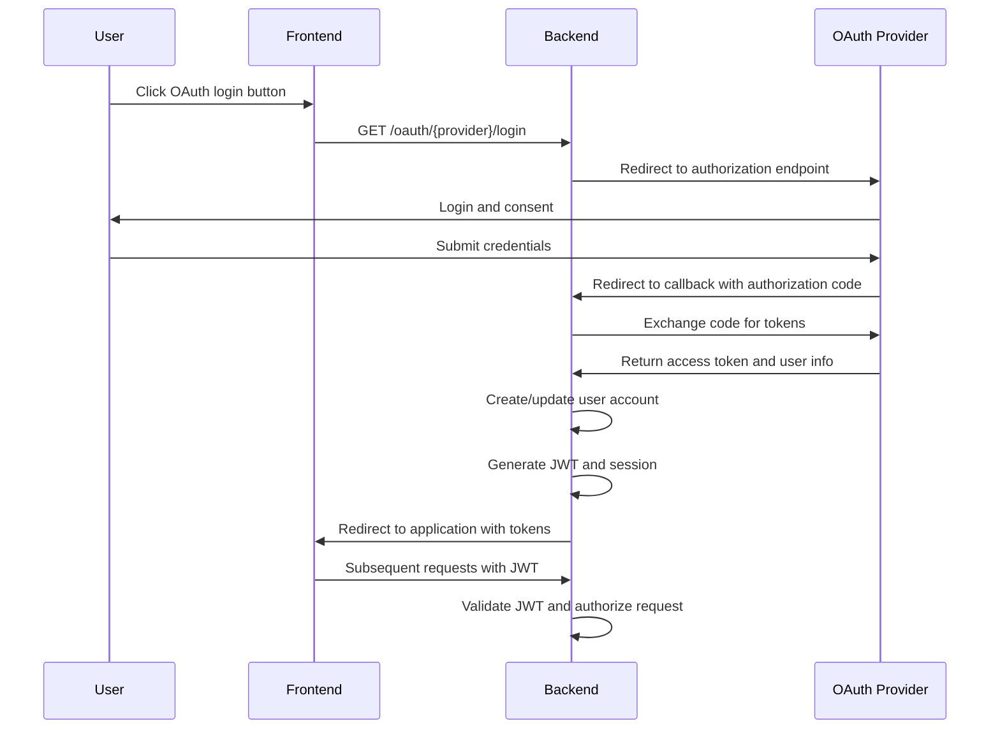
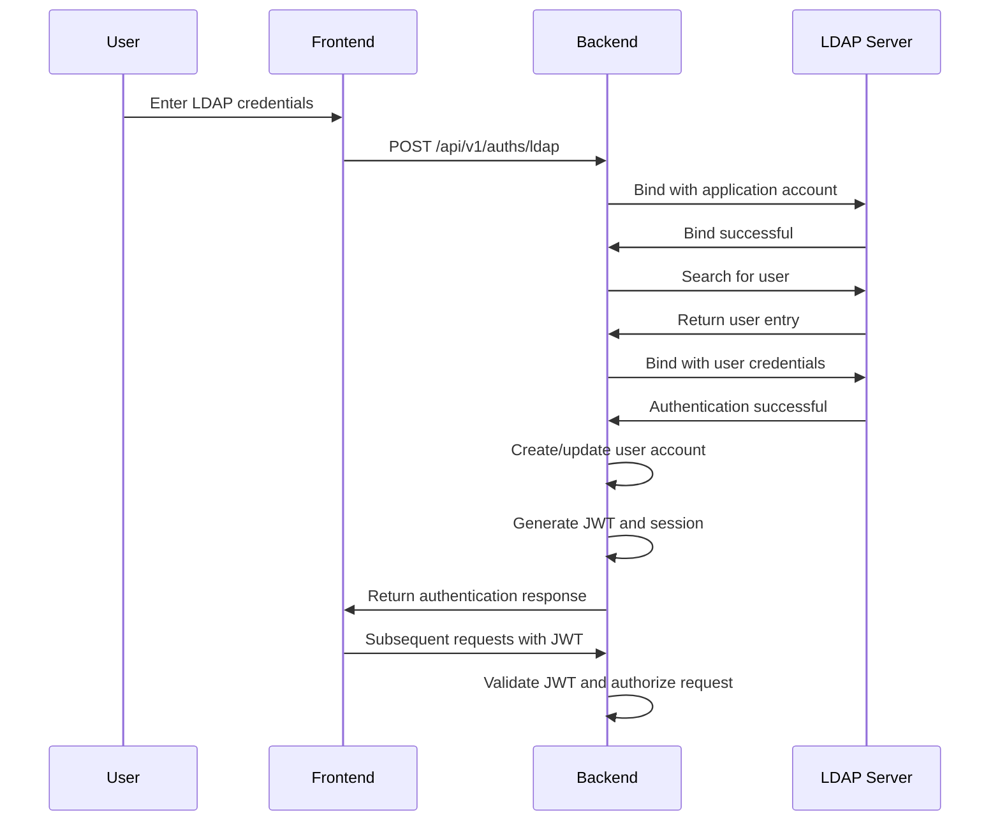
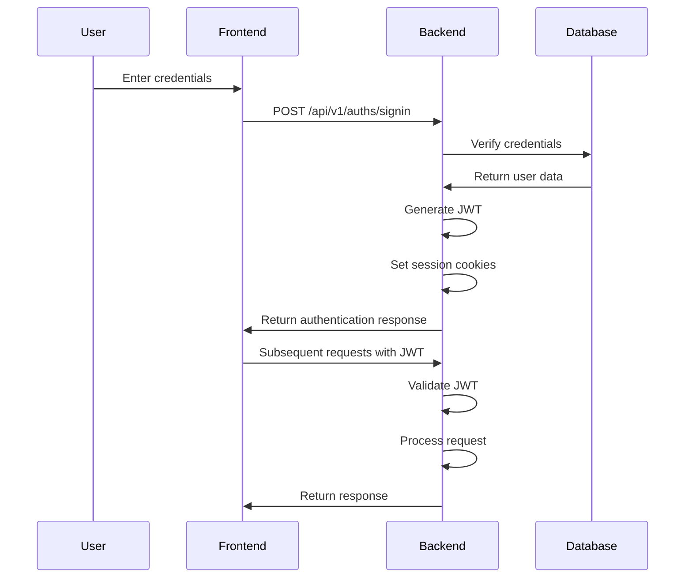
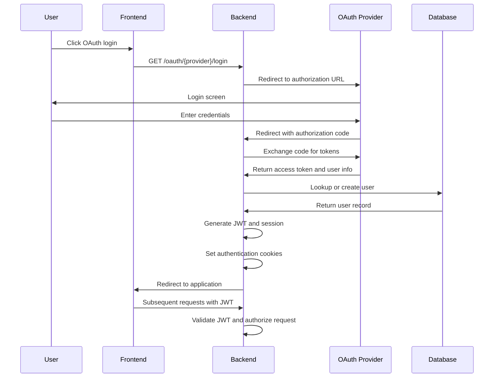
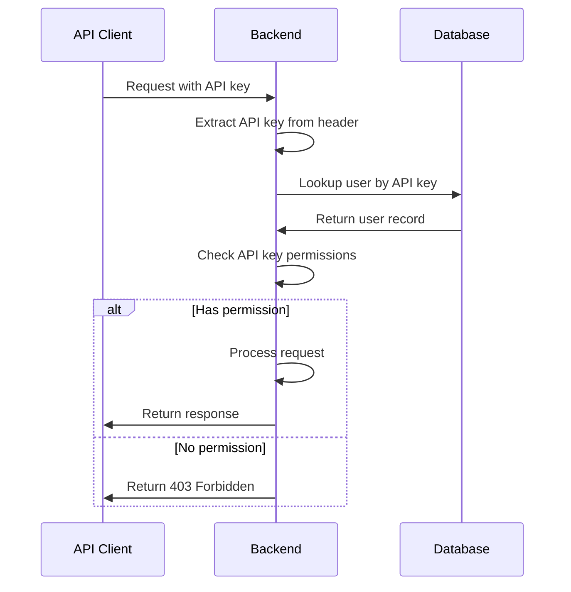

# Authentication Flow

<cite>
**Referenced Files in This Document**   
- [auth.py](file://backend/open_webui/utils/auth.py)
- [auths.py](file://backend/open_webui/routers/auths.py)
- [oauth.py](file://backend/open_webui/utils/oauth.py)
- [config.py](file://backend/open_webui/config.py)
- [oauth_sessions.py](file://backend/open_webui/models/oauth_sessions.py)
- [main.py](file://backend/open_webui/main.py)
</cite>

## Table of Contents
1. [Introduction](#introduction)
2. [Authentication Methods](#authentication-methods)
3. [JWT-Based Authentication](#jwt-based-authentication)
4. [API Key Support](#api-key-support)
5. [OAuth2 Integration](#oauth2-integration)
6. [LDAP Authentication](#ldap-authentication)
7. [Session Management](#session-management)
8. [Middleware and Route Protection](#middleware-and-route-protection)
9. [Security Considerations](#security-considerations)
10. [Sequence Diagrams](#sequence-diagrams)

## Introduction
The open-webui authentication system provides a comprehensive security framework supporting multiple authentication methods including JWT-based authentication, API keys, OAuth2 integration with providers like Google, Microsoft, and GitHub, and optional LDAP authentication. The system is designed to be flexible, secure, and extensible, allowing administrators to configure authentication options based on their deployment requirements. This document details the complete authentication flow from user login to token generation and validation, including refresh token mechanics, session management, and security considerations.

## Authentication Methods
The open-webui platform supports multiple authentication methods to accommodate different deployment scenarios and security requirements. The system allows for simultaneous configuration of different authentication methods, with administrators able to enable or disable specific methods through configuration settings.

### JWT-Based Authentication
JWT (JSON Web Token) authentication serves as the primary authentication mechanism for the open-webui platform. When a user successfully authenticates through any method (password, OAuth2, or LDAP), the system generates a JWT that is used for subsequent requests. The JWT contains user information including the user ID, expiration time, and a unique token identifier (jti) for revocation tracking.

The JWT is signed using the HS256 algorithm with a secret key stored in the WEBUI_SECRET_KEY environment variable. Tokens are issued with an expiration time configurable via the JWT_EXPIRES_IN setting, which defaults to 4 weeks. The system supports token revocation through Redis storage, where invalidated tokens are stored with a TTL matching their remaining validity period.

### API Key Support
The platform supports API key authentication for programmatic access to the API. API keys follow the format "sk-{32-character-uuid}" and are stored in the database associated with user accounts. The system distinguishes between different types of API keys and enforces permissions based on user roles and configured restrictions.

API key authentication is handled by the get_current_user_by_api_key function, which validates the key against the database and checks user permissions before granting access. The system supports endpoint restrictions for API keys, allowing administrators to limit which API endpoints can be accessed with specific keys through the ENABLE_API_KEYS_ENDPOINT_RESTRICTIONS and API_KEYS_ALLOWED_ENDPOINTS configuration options.

### OAuth2 Integration
The open-webui platform provides comprehensive OAuth2 integration with major identity providers including Google, Microsoft, and GitHub. The system also supports generic OpenID Connect providers through configurable endpoints. OAuth2 authentication is implemented using the Authlib library, which handles the OAuth2 authorization code flow, token exchange, and user profile retrieval.

The OAuth2 implementation supports dynamic client registration for providers that support it, allowing the system to automatically register as an OAuth2 client with the identity provider. For providers requiring manual configuration, administrators can specify client IDs, secrets, and redirect URIs through environment variables.

**Diagram sources**
- [main.py](file://backend/open_webui/main.py#L2235-L2249)
- [oauth.py](file://backend/open_webui/utils/oauth.py#L718-L800)

**Section sources**
- [main.py](file://backend/open_webui/main.py#L2235-L2249)
- [oauth.py](file://backend/open_webui/utils/oauth.py#L718-L800)
- [config.py](file://backend/open_webui/config.py#L346-L490)

### LDAP Authentication
LDAP authentication provides enterprise-level integration for organizations using directory services for user management. The LDAP implementation supports configurable server settings including host, port, TLS configuration, and certificate validation. Administrators can specify search bases, filters, and attribute mappings for email, username, and groups.

The LDAP authentication flow involves binding with an application account to search for the user, then binding with the user's credentials to verify authentication. Upon successful authentication, the system creates a local user account if one doesn't exist, synchronizes group memberships if enabled, and generates authentication tokens for the session.

**Diagram sources**
- [auths.py](file://backend/open_webui/routers/auths.py#L218-L500)
- [config.py](file://backend/open_webui/config.py#L491-L512)

**Section sources**
- [auths.py](file://backend/open_webui/routers/auths.py#L218-L500)
- [config.py](file://backend/open_webui/config.py#L491-L512)

## JWT-Based Authentication
The JWT-based authentication system in open-webui follows industry best practices for token generation, validation, and security. The implementation is centered around the create_token, decode_token, and get_current_user functions in the auth.py utility module.

### Token Generation
When a user successfully authenticates, the system generates a JWT containing the following claims:
- **id**: User identifier from the database
- **exp**: Expiration time in UTC
- **jti**: Unique token identifier for revocation tracking
- **iat**: Issuance timestamp

The token is signed using the HS256 algorithm with the secret key configured in WEBUI_SECRET_KEY. The expiration time is determined by the JWT_EXPIRES_IN configuration, which supports human-readable durations like "4w" for 4 weeks.

### Token Validation
Token validation occurs on each authenticated request through the get_current_user dependency. The validation process includes:
1. Extracting the token from the Authorization header or cookies
2. Decoding and verifying the JWT signature
3. Checking token expiration
4. Validating the token has not been revoked (when Redis is available)
5. Retrieving the user record from the database

The system implements token revocation using Redis, storing invalidated tokens with a key pattern that includes the jti and an expiration time matching the token's remaining validity. This allows for immediate revocation while maintaining the stateless nature of JWT for valid tokens.

### Refresh Token Mechanics
While the primary authentication uses JWTs, the OAuth2 integration includes refresh token functionality for maintaining long-lived sessions with identity providers. When an OAuth2 access token expires, the system automatically uses the refresh token to obtain a new access token without requiring the user to re-authenticate.

The refresh process is handled by the OAuthClientManager's _refresh_token method, which makes a token request to the provider's token endpoint with the refresh token. If successful, the new token is stored in the database, updating the expiration time and access token value.

## API Key Support
API key support in open-webui provides a mechanism for programmatic access to the API with configurable permissions and restrictions. The system distinguishes between user API keys and service API keys, with different validation and permission checking processes.

### API Key Generation
API keys are generated using the create_api_key function, which creates a 32-character UUID and prefixes it with "sk-". The key is stored in the database associated with a user account, allowing for tracking and revocation. Users can generate API keys through the application interface or administrative tools.

### API Key Validation
API key validation is performed by the get_current_user_by_api_key function, which:
1. Extracts the API key from the Authorization header
2. Looks up the user associated with the key in the database
3. Verifies the user has permission to use API keys based on their role and permissions configuration
4. Returns the user object for the request context

The system supports fine-grained control over API key usage through the USER_PERMISSIONS configuration, allowing administrators to restrict which features and endpoints can be accessed with API keys.

### Endpoint Restrictions
The platform includes optional endpoint restrictions for API keys through the ENABLE_API_KEYS_ENDPOINT_RESTRICTIONS configuration. When enabled, API keys can only access endpoints specified in the API_KEYS_ALLOWED_ENDPOINTS configuration, which accepts a comma-separated list of path prefixes.

This restriction is enforced by the APIKeyRestrictionMiddleware, which intercepts requests with API key authentication and checks if the requested path matches any of the allowed patterns before allowing the request to proceed.

## OAuth2 Integration
The OAuth2 integration in open-webui provides seamless authentication with external identity providers while maintaining local user management. The system supports both pre-configured providers (Google, Microsoft, GitHub) and generic OpenID Connect providers.

### Provider Configuration
OAuth2 providers are configured through environment variables that specify client credentials, scopes, and endpoints. For Google, the configuration includes GOOGLE_CLIENT_ID, GOOGLE_CLIENT_SECRET, and GOOGLE_OAUTH_SCOPE. For Microsoft, similar variables are used with Microsoft-specific endpoints for profile pictures and login URLs. GitHub configuration includes GITHUB_CLIENT_ID and GITHUB_CLIENT_SECRET with a configurable scope.

Generic OpenID Connect providers can be configured using OAUTH_CLIENT_ID, OAUTH_CLIENT_SECRET, OPENID_PROVIDER_URL, and related variables that specify the provider's endpoints and authentication parameters.

### User Profile Extraction
When a user authenticates via OAuth2, the system extracts profile information from the identity provider's user info endpoint. The extraction process is configurable through settings that specify which claims contain the user's email, name, picture, and other attributes.

The OAUTH_EMAIL_CLAIM, OAUTH_USERNAME_CLAIM, and OAUTH_PICTURE_CLAIM settings determine which JWT claims or user info fields are used for the corresponding user attributes. This allows the system to work with providers that use different claim names for standard profile information.

### Role and Group Management
The OAuth2 integration includes support for role and group management, allowing organizations to map identity provider groups and roles to local user roles and groups. The ENABLE_OAUTH_ROLE_MANAGEMENT and ENABLE_OAUTH_GROUP_MANAGEMENT settings control whether these features are active.

When enabled, the system extracts role and group information from configurable claims (OAUTH_ROLES_CLAIM and OAUTH_GROUPS_CLAIM) and maps them to local roles and groups based on configuration. Administrators can specify allowed roles, admin roles, and blocked groups through configuration settings.

## LDAP Authentication
LDAP authentication provides enterprise integration for organizations using directory services. The implementation supports comprehensive configuration options for connecting to LDAP servers and mapping directory attributes to application user data.

### Configuration Options
LDAP configuration is controlled through several environment variables:
- **ENABLE_LDAP**: Enables or disables LDAP authentication
- **LDAP_SERVER_HOST** and **LDAP_SERVER_PORT**: Specify the LDAP server location
- **LDAP_USE_TLS**: Enables TLS encryption for the connection
- **LDAP_VALIDATE_CERT**: Controls certificate validation
- **LDAP_APP_DN** and **LDAP_APP_PASSWORD**: Credentials for the application account
- **LDAP_SEARCH_BASE**: Base DN for user searches
- **LDAP_SEARCH_FILTERS**: Additional filters for user searches
- **LDAP_ATTRIBUTE_FOR_MAIL**, **LDAP_ATTRIBUTE_FOR_USERNAME**: Attribute mappings

### Group Synchronization
The LDAP implementation includes optional group synchronization features. When ENABLE_LDAP_GROUP_MANAGEMENT is enabled, the system extracts group membership from the user's directory entry and synchronizes it with local groups. The LDAP_ATTRIBUTE_FOR_GROUPS setting specifies which attribute contains group information.

Administrators can enable automatic group creation from directory groups with the ENABLE_LDAP_GROUP_CREATION setting, allowing the system to create local groups that correspond to directory groups.

## Session Management
The open-webui platform implements comprehensive session management to maintain user state across requests while ensuring security and scalability.

### Cookie-Based Sessions
The system uses HTTP-only, secure cookies to store authentication tokens in the browser. The token cookie is named "token" and includes SameSite and Secure attributes controlled by WEBUI_AUTH_COOKIE_SAME_SITE and WEBUI_AUTH_COOKIE_SECURE configuration settings.

For OAuth2 authentication, the system also sets an "oauth_id_token" cookie containing the identity token from the provider, and an "oauth_session_id" cookie for tracking the OAuth session.

### Server-Side Session Storage
OAuth2 sessions are stored server-side in the database using the OAuthSessions model. Each session record contains:
- User ID
- Provider identifier
- Token data (encrypted)
- Expiration time
- Creation and update timestamps

The token data is encrypted using Fernet symmetric encryption with a key configured in OAUTH_SESSION_TOKEN_ENCRYPTION_KEY, providing an additional layer of security for sensitive OAuth tokens.

### Session Expiration and Cleanup
Sessions have configurable expiration times based on the JWT_EXPIRES_IN setting. The system automatically cleans up expired OAuth sessions through periodic cleanup tasks. Users can explicitly sign out, which invalidates their JWT and deletes session cookies.

## Middleware and Route Protection
The open-webui platform uses FastAPI middleware and dependency injection to protect routes and enforce authentication policies.

### Authentication Middleware
The system implements several middleware components for authentication and security:
- **APIKeyRestrictionMiddleware**: Restricts API key access to specific endpoints
- **SecurityHeadersMiddleware**: Sets security-related HTTP headers
- **AuditLoggingMiddleware**: Logs authentication events for auditing

These middleware components are registered in the main application file and process requests in a specific order to ensure proper security enforcement.

### Route Protection
Route protection is implemented using FastAPI dependency injection with several dependency functions:
- **get_current_user**: Base dependency that handles JWT and API key authentication
- **get_verified_user**: Ensures the user has a verified role (user or admin)
- **get_admin_user**: Restricts access to admin users only

These dependencies are applied to route handlers using the Depends decorator, providing a clean and reusable mechanism for authentication and authorization.

## Security Considerations
The open-webui authentication system incorporates multiple security measures to protect user data and prevent common vulnerabilities.

### Token Security
JWT tokens are signed with a strong secret key and include expiration times to limit their validity. The system supports token revocation through Redis storage, allowing immediate invalidation of compromised tokens. API keys are stored in the database with no plaintext storage, and OAuth tokens are encrypted at rest.

### Brute Force Protection
The system implements rate limiting for authentication endpoints to prevent brute force attacks. The signin_rate_limiter in auths.py uses a rolling window strategy to limit login attempts, with configurable limits and window sizes. When Redis is available, rate limiting is distributed across instances; otherwise, an in-memory fallback is used.

### Secure Cookie Settings
Authentication cookies are configured with security best practices:
- **HttpOnly**: Prevents access via JavaScript
- **Secure**: Requires HTTPS transmission
- **SameSite**: Configurable to prevent CSRF attacks
- **No plaintext storage**: Sensitive data is encrypted

### Input Validation
All authentication inputs are validated to prevent injection attacks and ensure data integrity. Passwords are validated for strength and length, with a maximum of 72 bytes to prevent truncation issues with bcrypt. Email addresses are validated for proper format before processing.

### Encryption and Hashing
The system uses industry-standard cryptographic algorithms:
- **bcrypt**: For password hashing
- **HS256**: For JWT signing
- **Fernet**: For encrypting OAuth tokens at rest
- **SHA-256**: For key derivation when needed

## Sequence Diagrams
The following sequence diagrams illustrate the key authentication flows in the open-webui platform.

### Standard Login Flow

**Diagram sources**
- [auths.py](file://backend/open_webui/routers/auths.py#L507-L632)
- [auth.py](file://backend/open_webui/utils/auth.py#L272-L367)

### OAuth2 Login Flow

**Diagram sources**
- [main.py](file://backend/open_webui/main.py#L2235-L2249)
- [oauth.py](file://backend/open_webui/utils/oauth.py#L718-L800)
- [auths.py](file://backend/open_webui/routers/auths.py#L75-L800)

### API Key Authentication Flow

**Diagram sources**
- [auth.py](file://backend/open_webui/utils/auth.py#L370-L400)
- [main.py](file://backend/open_webui/main.py#L1297-L1332)