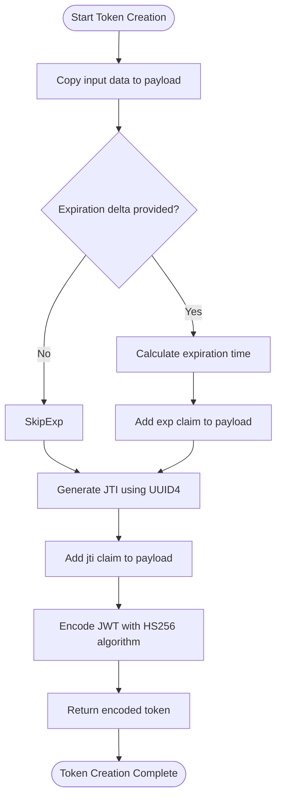
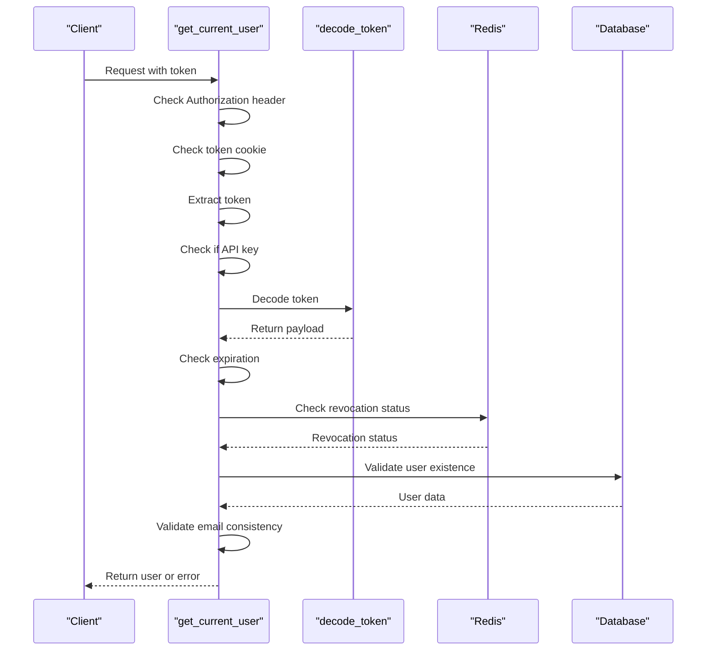
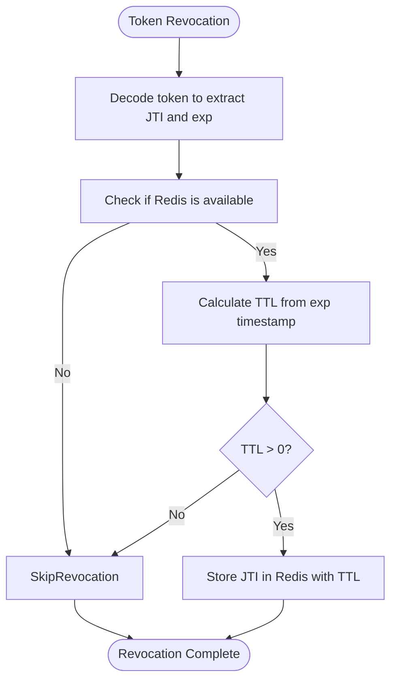
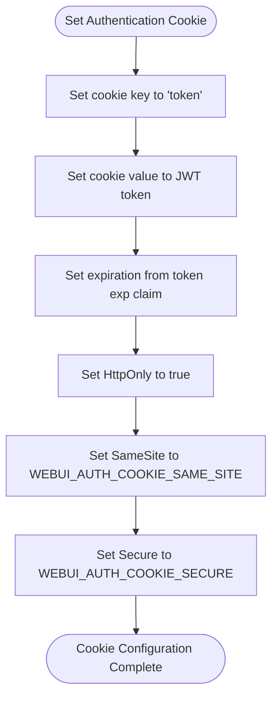
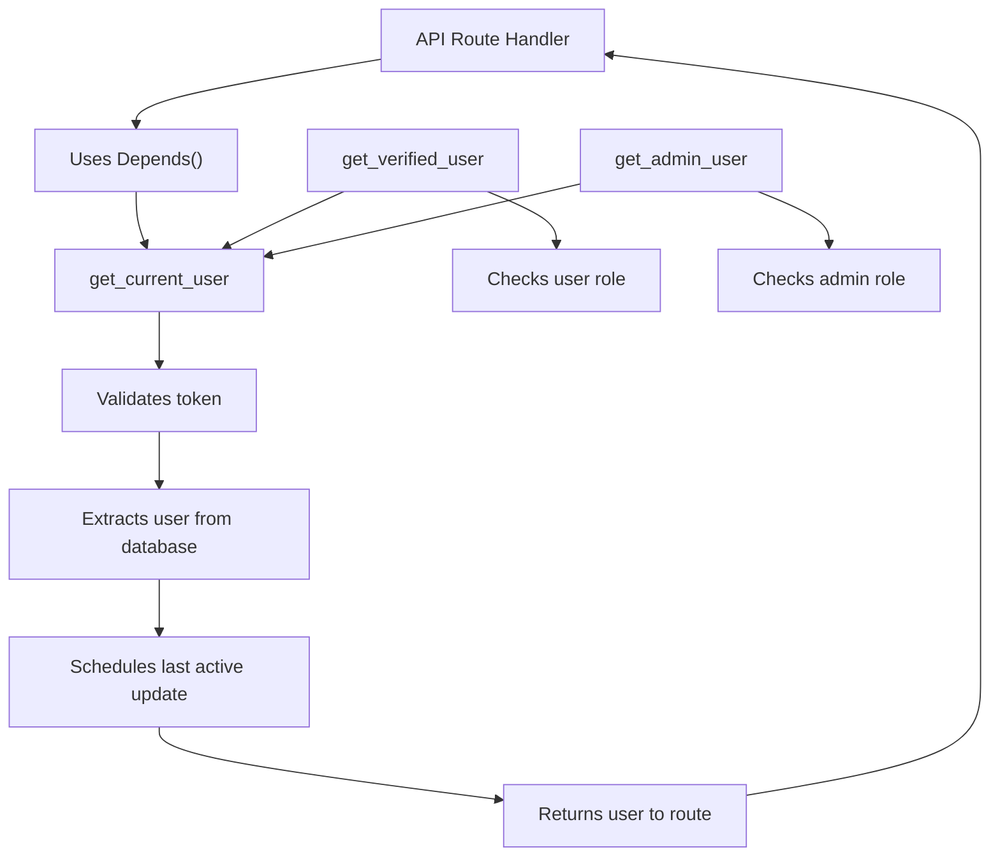

# JWT Authentication

<cite>
**Referenced Files in This Document**   
- [auth.py](file://backend/open_webui/utils/auth.py)
- [auths.py](file://backend/open_webui/routers/auths.py)
- [env.py](file://backend/open_webui/env.py)
- [config.py](file://backend/open_webui/config.py)
</cite>

## Table of Contents
1. [Introduction](#introduction)
2. [Token Creation Process](#token-creation-process)
3. [Token Validation Flow](#token-validation-flow)
4. [Token Refresh and Revocation](#token-refresh-and-revocation)
5. [Secure Cookie Configuration](#secure-cookie-configuration)
6. [Integration with FastAPI Dependency System](#integration-with-fastapi-dependency-system)
7. [Error Handling and Security Considerations](#error-handling-and-security-considerations)
8. [Middleware Integration](#middleware-integration)

## Introduction
The JWT-based authentication system in open-webui provides secure user authentication and authorization for the application. This system implements JSON Web Tokens (JWT) to manage user sessions, with support for both bearer tokens and cookie-based authentication. The implementation includes token creation, validation, refresh mechanisms, and revocation checks, all integrated with the FastAPI framework's dependency system. The authentication system also supports API keys as an alternative authentication method and integrates with OAuth providers for single sign-on capabilities.

**Section sources**
- [auth.py](file://backend/open_webui/utils/auth.py#L1-L419)
- [auths.py](file://backend/open_webui/routers/auths.py#L1-L1185)

## Token Creation Process

The token creation process in open-webui is handled by the `create_token` function in the `auth.py` utility module. This function generates JWT tokens with a specific payload structure, expiration handling, and JTI (JWT ID) generation.

The token creation process follows these steps:
1. The function accepts a data dictionary and an optional expiration delta
2. It creates a copy of the input data to form the token payload
3. If an expiration delta is provided, it calculates the expiration time and adds it to the payload
4. It generates a unique JTI (JWT ID) using UUID4 and adds it to the payload
5. It encodes the payload using the HS256 algorithm with the application's secret key

The payload structure includes:
- User identifier (id) as the primary claim
- Expiration timestamp (exp) when specified
- Unique token identifier (jti) for revocation tracking

The token expiration is configured through the `JWT_EXPIRES_IN` setting, which can be set via environment variables or persistent configuration. The default value is "4w" (4 weeks), but this can be customized to meet security requirements.

**Diagram sources**
- [auth.py](file://backend/open_webui/utils/auth.py#L194-L205)

**Section sources**
- [auth.py](file://backend/open_webui/utils/auth.py#L194-L205)
- [config.py](file://backend/open_webui/config.py#L314-L316)

## Token Validation Flow

The token validation flow in open-webui is implemented through the `get_current_user` function, which handles both bearer tokens and cookie-based authentication. This function follows a comprehensive validation process to ensure token integrity and user authenticity.

The validation process includes:
1. Token extraction from either the Authorization header (bearer token) or the "token" cookie
2. Authentication method determination (API key or JWT token)
3. Token decoding and payload validation
4. Token revocation check via the `is_valid_token` function
5. User session validation against the database

For JWT tokens, the validation flow performs the following steps:
- Decodes the token using the application's secret key
- Verifies the token's expiration time
- Checks if the token has been revoked by querying Redis
- Validates that the user still exists in the database
- Ensures email consistency when trusted email headers are configured

The system supports multiple token sources, allowing clients to authenticate using either bearer tokens in the Authorization header or cookies, providing flexibility for different client types and use cases.

**Diagram sources**
- [auth.py](file://backend/open_webui/utils/auth.py#L272-L354)

**Section sources**
- [auth.py](file://backend/open_webui/utils/auth.py#L272-L354)
- [auths.py](file://backend/open_webui/routers/auths.py#L106-L161)

## Token Refresh and Revocation

The open-webui authentication system implements token refresh and revocation mechanisms to enhance security and user experience. While the system does not automatically refresh tokens before expiration, it provides mechanisms for token invalidation and proper session management.

Token revocation is handled by the `invalidate_token` function, which:
1. Decodes the provided token to extract its JTI and expiration time
2. Calculates the remaining time-to-live (TTL) based on the expiration timestamp
3. Stores the revoked token's JTI in Redis with a TTL matching the token's remaining lifespan
4. This ensures that revoked tokens cannot be used for authentication until they naturally expire

The revocation check is performed by the `is_valid_token` function during the validation process:
1. It queries Redis for the token's JTI
2. If a record exists, the token is considered revoked and authentication fails
3. This provides a mechanism to immediately invalidate tokens without waiting for expiration

The system also handles token cleanup during signout operations:
- The `signout` endpoint invalidates the token using the `invalidate_token` function
- It removes the token cookie from the client
- It clears any associated OAuth session cookies

This approach balances security with performance, using Redis as a lightweight revocation store that automatically expires entries when tokens naturally expire, preventing the revocation list from growing indefinitely.

**Diagram sources**
- [auth.py](file://backend/open_webui/utils/auth.py#L231-L251)

**Section sources**
- [auth.py](file://backend/open_webui/utils/auth.py#L231-L251)
- [auths.py](file://backend/open_webui/routers/auths.py#L753-L780)

## Secure Cookie Configuration

The open-webui authentication system implements secure cookie settings to protect user sessions and prevent common web vulnerabilities. When tokens are delivered via cookies, several security attributes are configured to enhance protection.

The cookie configuration includes:
- **HttpOnly flag**: Set to true to prevent client-side JavaScript access to the token cookie, mitigating cross-site scripting (XSS) attacks
- **SameSite attribute**: Configured through the `WEBUI_AUTH_COOKIE_SAME_SITE` setting, with a default value of "lax" to prevent cross-site request forgery (CSRF) attacks while allowing necessary cross-site usage
- **Secure flag**: Enabled when `WEBUI_AUTH_COOKIE_SECURE` is set to true, ensuring cookies are only transmitted over HTTPS connections

These settings are applied in multiple authentication flows, including:
- Regular sign-in via the `/signin` endpoint
- OAuth authentication flows
- User signup processes

The cookie settings can be customized through environment variables, allowing deployment-specific security configurations. The system also supports legacy cookie compatibility through the `ENABLE_OAUTH_ID_TOKEN_COOKIE` setting, which creates an additional HttpOnly cookie for OAuth ID tokens when needed for compatibility with older frontend versions.

**Diagram sources**
- [auths.py](file://backend/open_webui/routers/auths.py#L701-L708)
- [oauth.py](file://backend/open_webui/utils/oauth.py#L1527-L1534)

**Section sources**
- [auths.py](file://backend/open_webui/routers/auths.py#L701-L708)
- [oauth.py](file://backend/open_webui/utils/oauth.py#L1527-L1534)
- [env.py](file://backend/open_webui/env.py#L468-L478)

## Integration with FastAPI Dependency System

The JWT authentication system in open-webui is tightly integrated with FastAPI's dependency injection system, enabling seamless authentication across API routes. This integration is achieved through several dependency functions that can be used as parameters in route handlers.

The primary dependency functions include:
- `get_current_user`: The main authentication dependency that validates tokens and returns the authenticated user
- `get_verified_user`: A wrapper that ensures the user has a verified role (user or admin)
- `get_admin_user`: A wrapper that ensures the user has admin privileges

These dependencies are implemented using FastAPI's `Depends` functionality, allowing route handlers to declare their authentication requirements declaratively. When a route includes one of these dependencies, FastAPI automatically executes the dependency function before calling the route handler, handling authentication and authorization transparently.

The dependency system also supports background tasks for updating user activity timestamps, ensuring that user last-active information is updated without blocking the main request processing. This is achieved through the `background_tasks` parameter, which allows asynchronous operations to be scheduled during the authentication process.

**Diagram sources**
- [auth.py](file://backend/open_webui/utils/auth.py#L403-L418)

**Section sources**
- [auth.py](file://backend/open_webui/utils/auth.py#L272-L354)
- [auth.py](file://backend/open_webui/utils/auth.py#L403-L418)

## Error Handling and Security Considerations

The JWT authentication system in open-webui implements comprehensive error handling and security measures to protect against common threats and ensure robust operation.

Key security considerations include:
- **Token leakage prevention**: The system uses HttpOnly cookies to prevent JavaScript access to authentication tokens, reducing the risk of XSS-based token theft
- **Brute force protection**: The sign-in endpoint includes rate limiting to prevent brute force attacks on user credentials
- **Secure token storage**: The application secret key is loaded from environment variables, preventing hardcoded secrets in the codebase
- **Token revocation**: The system maintains a revocation list in Redis, allowing immediate invalidation of compromised tokens
- **Email verification**: When trusted email headers are configured, the system verifies that the authenticated user's email matches the trusted header value

Error handling is implemented through HTTP exception raising with appropriate status codes and messages:
- 401 Unauthorized for invalid or missing tokens
- 403 Forbidden for insufficient permissions
- 429 Too Many Requests for rate-limited sign-in attempts
- 500 Internal Server Error for unexpected issues

The system also handles token validation errors gracefully, deleting invalid token cookies to prevent repeated authentication failures. During the authentication process, if any exception occurs after cookie extraction, the system cleans up authentication cookies to ensure a clean state for subsequent attempts.

Security headers and middleware are also employed to enhance protection, including CORS configuration, compression middleware, and audit logging to monitor authentication activities.

**Section sources**
- [auth.py](file://backend/open_webui/utils/auth.py#L356-L367)
- [auths.py](file://backend/open_webui/routers/auths.py#L568-L572)
- [env.py](file://backend/open_webui/env.py#L455-L460)

## Middleware Integration

The JWT authentication system is integrated into the open-webui application through middleware components that process requests before they reach the route handlers. This middleware pipeline ensures that authentication is consistently applied across the application.

The middleware integration includes:
- **Authentication middleware**: Processes the Authorization header and authentication cookies to extract tokens
- **Session management**: Maintains user session state and handles token refresh
- **Request preprocessing**: Sets up authentication state in the request object for use by route handlers

The middleware components work in conjunction with the dependency system to provide a seamless authentication experience. When a request enters the application, the middleware extracts authentication information and makes it available to the dependency functions, which then perform the actual validation and user retrieval.

This layered approach allows for efficient authentication processing, with the middleware handling the initial token extraction and the dependency functions performing the detailed validation and user lookup. The integration also supports background tasks for updating user activity timestamps, ensuring that user last-active information is maintained without impacting request response times.

The middleware pipeline is configured in the main application file, where various middleware components are registered in a specific order to ensure proper request processing flow.

**Section sources**
- [main.py](file://backend/open_webui/main.py#L1348-L1359)
- [middleware.py](file://backend/open_webui/utils/middleware.py#L1-L800)