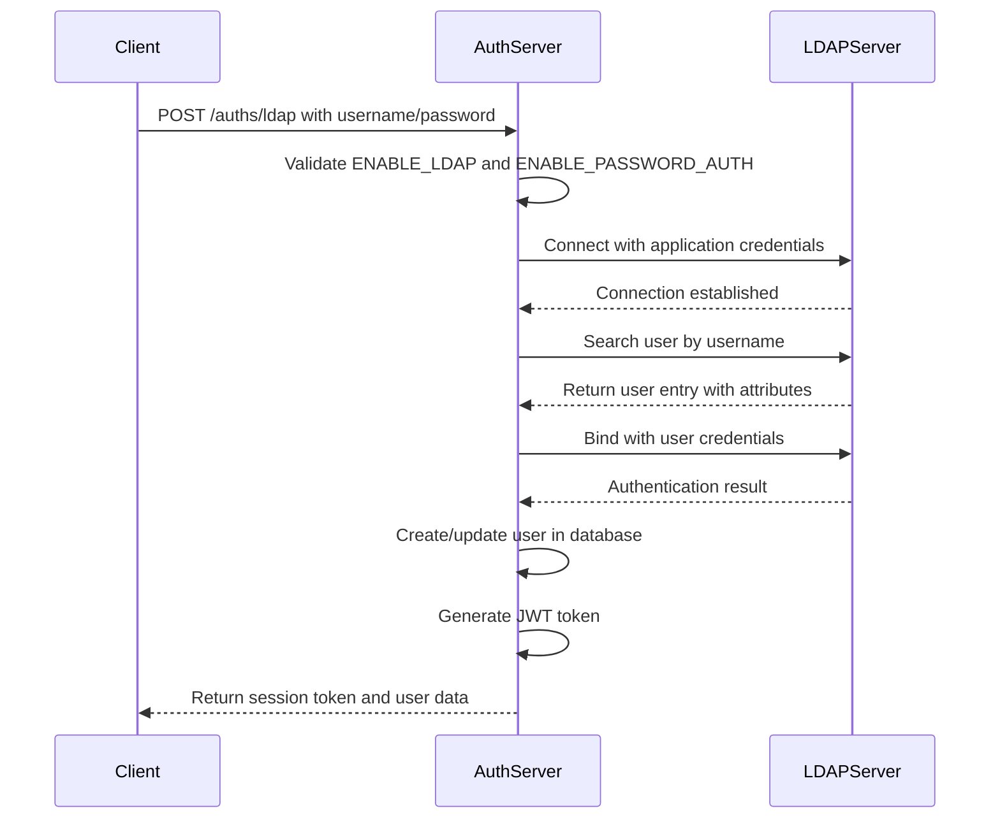
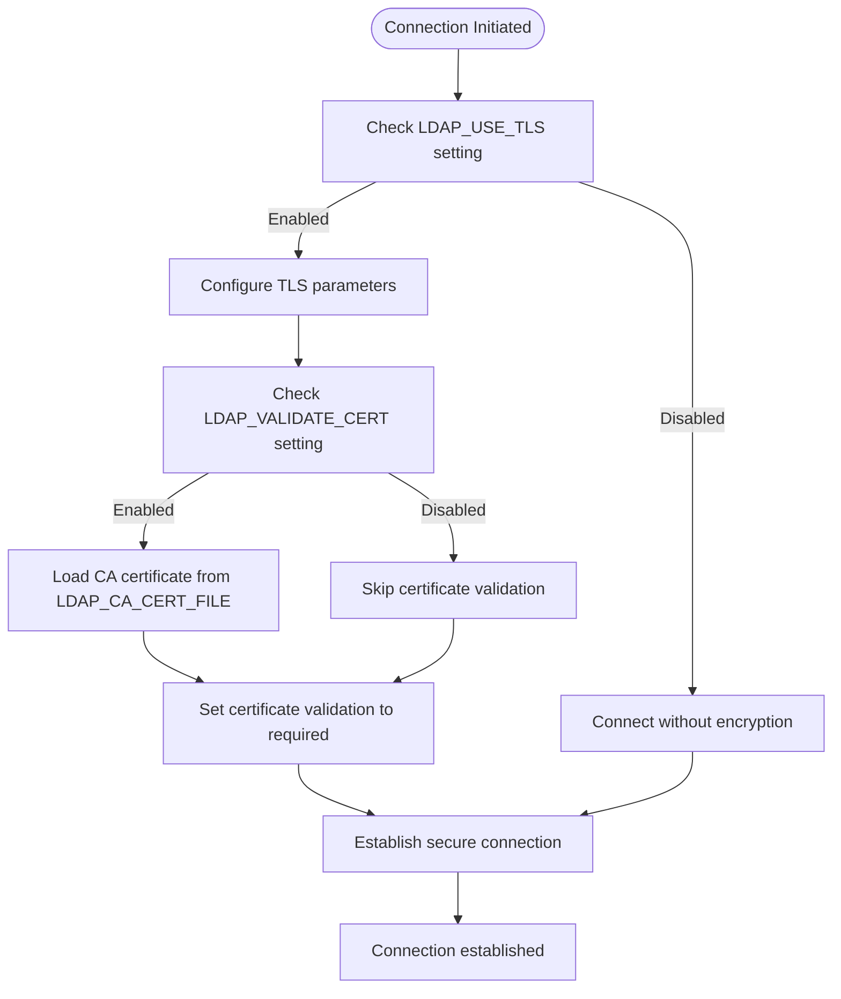
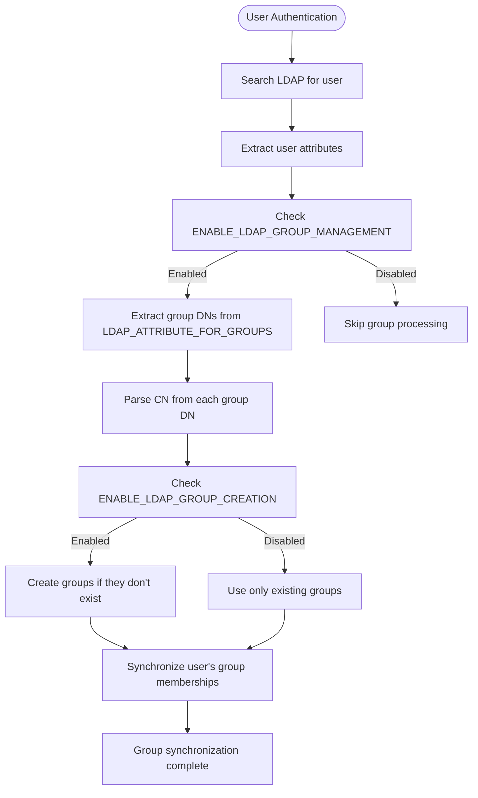

# LDAP Authentication

<cite>
**Referenced Files in This Document**   
- [config.py](file://backend/open_webui/config.py)
- [auths.py](file://backend/open_webui/routers/auths.py)
- [env.py](file://backend/open_webui/env.py)
- [main.py](file://backend/open_webui/main.py)
- [auth.py](file://backend/open_webui/utils/auth.py)
</cite>

## Table of Contents
1. [Introduction](#introduction)
2. [Configuration](#configuration)
3. [Authentication Flow](#authentication-flow)
4. [Connection Security](#connection-security)
5. [User and Group Management](#user-and-group-management)
6. [Fallback Behavior](#fallback-behavior)
7. [Performance Considerations](#performance-considerations)
8. [Common Configuration Scenarios](#common-configuration-scenarios)
9. [Troubleshooting](#troubleshooting)
10. [API Endpoints](#api-endpoints)

## Introduction
LDAP authentication in open-webui provides enterprise-grade user authentication by integrating with existing LDAP directories. This allows organizations to leverage their centralized user management systems for accessing the web interface. The implementation supports standard LDAP operations including user authentication, attribute mapping, and group synchronization. The system is designed to be secure, flexible, and compatible with various LDAP server configurations.

**Section sources**
- [config.py](file://backend/open_webui/config.py#L3740-L3839)
- [auths.py](file://backend/open_webui/routers/auths.py#L218-L500)

## Configuration
LDAP integration is configured through environment variables that control the connection parameters, authentication settings, and attribute mappings. The configuration system supports both environment variable overrides and runtime configuration updates through the admin interface.

### Environment Variables
The following environment variables are used to configure LDAP authentication:

| Environment Variable | Default Value | Description |
|----------------------|-------------|-------------|
| ENABLE_LDAP | false | Enables or disables LDAP authentication |
| LDAP_SERVER_LABEL | LDAP Server | Display label for the LDAP server |
| LDAP_SERVER_HOST | localhost | Hostname or IP address of the LDAP server |
| LDAP_SERVER_PORT | 389 | Port number for LDAP connection |
| LDAP_USE_TLS | true | Enables TLS encryption for LDAP connections |
| LDAP_VALIDATE_CERT | true | Validates the LDAP server's SSL certificate |
| LDAP_CA_CERT_FILE | | Path to CA certificate file for certificate validation |
| LDAP_CIPHERS | ALL | Cipher suite to use for TLS connections |
| LDAP_APP_DN | | Distinguished Name for application binding |
| LDAP_APP_PASSWORD | | Password for application binding account |
| LDAP_SEARCH_BASE | | Base DN for user searches |
| LDAP_SEARCH_FILTERS | | Additional search filters for user queries |
| LDAP_ATTRIBUTE_FOR_USERNAME | uid | LDAP attribute used for username |
| LDAP_ATTRIBUTE_FOR_MAIL | mail | LDAP attribute used for email address |
| LDAP_ATTRIBUTE_FOR_GROUPS | memberOf | LDAP attribute used for group membership |

**Section sources**
- [config.py](file://backend/open_webui/config.py#L3744-L3839)
- [env.py](file://backend/open_webui/env.py#L413-L486)

## Authentication Flow
The LDAP authentication process follows a multi-step flow that validates user credentials against the LDAP directory and creates or updates user accounts in the application.



**Diagram sources**
- [auths.py](file://backend/open_webui/routers/auths.py#L218-L500)
- [auth.py](file://backend/open_webui/utils/auth.py#L194-L205)

**Section sources**
- [auths.py](file://backend/open_webui/routers/auths.py#L218-L500)

## Connection Security
The LDAP implementation supports multiple security mechanisms to protect authentication traffic and ensure secure connections to the LDAP server.

### LDAPS vs STARTTLS
The system supports both LDAPS (LDAP over SSL) and STARTTLS connection methods. When `LDAP_USE_TLS` is enabled, the connection uses TLS encryption. The choice between LDAPS and STARTTLS is determined by the server configuration and port number (typically 636 for LDAPS and 389 for STARTTLS with TLS upgrade).

### Certificate Validation
Certificate validation is controlled by the `LDAP_VALIDATE_CERT` setting. When enabled, the system validates the LDAP server's SSL certificate against the configured CA certificate file specified in `LDAP_CA_CERT_FILE`. This prevents man-in-the-middle attacks and ensures the authenticity of the LDAP server.



**Diagram sources**
- [auths.py](file://backend/open_webui/routers/auths.py#L251-L261)
- [config.py](file://backend/open_webui/config.py#L3800-L3816)

**Section sources**
- [auths.py](file://backend/open_webui/routers/auths.py#L251-L261)
- [config.py](file://backend/open_webui/config.py#L3800-L3816)

## User and Group Management
The LDAP integration automatically manages user accounts and group memberships based on the LDAP directory information.

### User Provisioning
When a user authenticates successfully via LDAP, the system checks if the user exists in the local database. If not, a new user account is created with information from the LDAP directory:
- Email address from the configured mail attribute
- Username from the configured username attribute
- Full name from the common name (cn) attribute
- Role assigned based on system configuration (admin for first user, otherwise default role)

### Group Synchronization
Group management is controlled by the following settings:
- `ENABLE_LDAP_GROUP_MANAGEMENT`: Enables group synchronization from LDAP
- `ENABLE_LDAP_GROUP_CREATION`: Allows creation of new groups based on LDAP groups
- `LDAP_ATTRIBUTE_FOR_GROUPS`: Specifies the LDAP attribute containing group membership information

When enabled, the system extracts group names from the user's group DNs by parsing the CN (Common Name) component of each group DN. These groups are then synchronized with the user's account in the application.



**Diagram sources**
- [auths.py](file://backend/open_webui/routers/auths.py#L280-L388)
- [config.py](file://backend/open_webui/config.py#L3822-L3838)

**Section sources**
- [auths.py](file://backend/open_webui/routers/auths.py#L280-L388)
- [config.py](file://backend/open_webui/config.py#L3822-L3838)

## Fallback Behavior
The LDAP authentication system integrates with the main authentication pipeline and follows specific fallback rules when LDAP authentication is not available or fails.

When `ENABLE_LDAP` is disabled, the system falls back to the configured authentication method (typically local password authentication). If LDAP authentication is enabled but the connection to the LDAP server fails, the authentication attempt fails without falling back to other methods, ensuring security by preventing authentication bypass.

The system also respects the `ENABLE_PASSWORD_AUTH` setting, which must be enabled for LDAP authentication to work, as LDAP is considered an extension of password-based authentication in this implementation.

**Section sources**
- [auths.py](file://backend/open_webui/routers/auths.py#L221-L228)
- [config.py](file://backend/open_webui/config.py#L3744-L3748)

## Performance Considerations
LDAP authentication involves network calls to the LDAP server, which can impact performance. The implementation includes several optimizations to minimize latency and improve user experience.

### Connection Pooling
The system uses connection pooling for LDAP operations, reusing connections to the LDAP server for multiple authentication requests. This reduces the overhead of establishing new connections for each authentication attempt.

### Caching
User information retrieved from LDAP is cached in the application's database after the first successful authentication. Subsequent logins for the same user do not require LDAP lookups for attribute retrieval, only for credential validation.

### Search Optimization
The LDAP search operation is optimized by:
- Limiting returned attributes to only those needed (username, email, common name, and groups)
- Using indexed attributes in search filters
- Applying the configured search filters to narrow the search scope

**Section sources**
- [auths.py](file://backend/open_webui/routers/auths.py#L286-L294)
- [config.py](file://backend/open_webui/config.py#L3794-L3798)

## Common Configuration Scenarios
This section provides examples of common LDAP configuration scenarios for different directory services.

### Active Directory Integration
For Microsoft Active Directory, typical configuration settings include:
- LDAP_SERVER_HOST: ad.example.com
- LDAP_SERVER_PORT: 389 or 636
- LDAP_USE_TLS: true
- LDAP_SEARCH_BASE: OU=Users,DC=example,DC=com
- LDAP_ATTRIBUTE_FOR_USERNAME: sAMAccountName
- LDAP_ATTRIBUTE_FOR_MAIL: mail
- LDAP_ATTRIBUTE_FOR_GROUPS: memberOf
- LDAP_APP_DN: CN=ServiceAccount,OU=ServiceAccounts,DC=example,DC=com

### OpenLDAP Integration
For OpenLDAP servers, typical configuration settings include:
- LDAP_SERVER_HOST: ldap.example.com
- LDAP_SERVER_PORT: 389
- LDAP_USE_TLS: true
- LDAP_SEARCH_BASE: ou=People,dc=example,dc=com
- LDAP_ATTRIBUTE_FOR_USERNAME: uid
- LDAP_ATTRIBUTE_FOR_MAIL: mail
- LDAP_ATTRIBUTE_FOR_GROUPS: memberOf
- LDAP_APP_DN: cn=admin,dc=example,dc=com

### FreeIPA Integration
For FreeIPA servers, typical configuration settings include:
- LDAP_SERVER_HOST: ipa.example.com
- LDAP_SERVER_PORT: 389
- LDAP_USE_TLS: true
- LDAP_SEARCH_BASE: cn=users,cn=accounts,dc=example,dc=com
- LDAP_ATTRIBUTE_FOR_USERNAME: uid
- LDAP_ATTRIBUTE_FOR_MAIL: mail
- LDAP_ATTRIBUTE_FOR_GROUPS: memberof
- LDAP_APP_DN: uid=admin,cn=users,cn=accounts,dc=example,dc=com

**Section sources**
- [config.py](file://backend/open_webui/config.py#L3750-L3838)
- [auths.py](file://backend/open_webui/routers/auths.py#L230-L249)

## Troubleshooting
This section provides guidance for diagnosing and resolving common issues with LDAP authentication.

### Connectivity Issues
Common connectivity problems and their solutions:
- **Connection timeout**: Verify network connectivity between the application server and LDAP server, check firewall rules, and ensure the LDAP server is reachable on the specified port.
- **TLS handshake failure**: Verify that the `LDAP_CA_CERT_FILE` points to the correct CA certificate, check that the LDAP server's certificate is valid and not expired, and ensure the certificate chain is complete.
- **Certificate validation errors**: If using self-signed certificates, either add the certificate to the trusted CA store or set `LDAP_VALIDATE_CERT=false` (not recommended for production).

### Bind Failures
Authentication bind failures can occur due to:
- **Application account bind failure**: Verify that the `LDAP_APP_DN` and `LDAP_APP_PASSWORD` are correct and that the service account has sufficient permissions to search the directory.
- **User authentication failure**: Verify that the user exists in the directory, the username is correct, and the password is valid. Check that the search base and filters are correctly configured to find the user.

### Attribute Mapping Problems
Issues with attribute mapping can cause incomplete user information:
- **Missing email address**: Verify that the `LDAP_ATTRIBUTE_FOR_MAIL` matches the actual attribute name in the directory and that users have a value for this attribute.
- **Incorrect username**: Verify that the `LDAP_ATTRIBUTE_FOR_USERNAME` matches the attribute used for login in the directory.
- **Group synchronization issues**: Check that `LDAP_ATTRIBUTE_FOR_GROUPS` is correctly set and that the group DNs contain CN components that can be extracted as group names.

Enable detailed logging by setting the appropriate log level in the environment to help diagnose these issues.

**Section sources**
- [auths.py](file://backend/open_webui/routers/auths.py#L258-L260)
- [auths.py](file://backend/open_webui/routers/auths.py#L277-L278)
- [auths.py](file://backend/open_webui/routers/auths.py#L314-L321)

## API Endpoints
The LDAP authentication system provides several API endpoints for configuration and authentication.

### Authentication Endpoint
```
POST /auths/ldap
Content-Type: application/json

{
  "user": "username",
  "password": "password"
}
```

This endpoint authenticates a user against the LDAP directory and returns a session token upon successful authentication.

### Configuration Endpoints
```
GET /auths/admin/config/ldap/server
Authorization: Bearer <admin_token>
```
Returns the current LDAP server configuration.

```
POST /auths/admin/config/ldap/server
Authorization: Bearer <admin_token>
Content-Type: application/json

{
  "label": "LDAP Server",
  "host": "ldap.example.com",
  "port": 389,
  "attribute_for_mail": "mail",
  "attribute_for_username": "uid",
  "app_dn": "cn=admin,dc=example,dc=com",
  "app_dn_password": "password",
  "search_base": "ou=users,dc=example,dc=com",
  "search_filters": "",
  "use_tls": true,
  "certificate_path": "/path/to/ca.crt",
  "validate_cert": true,
  "ciphers": "ALL"
}
```
Updates the LDAP server configuration. Requires admin privileges.

**Section sources**
- [auths.py](file://backend/open_webui/routers/auths.py#L218-L219)
- [auths.py](file://backend/open_webui/routers/auths.py#L1055-L1106)
- [main.py](file://backend/open_webui/main.py#L818-L836)