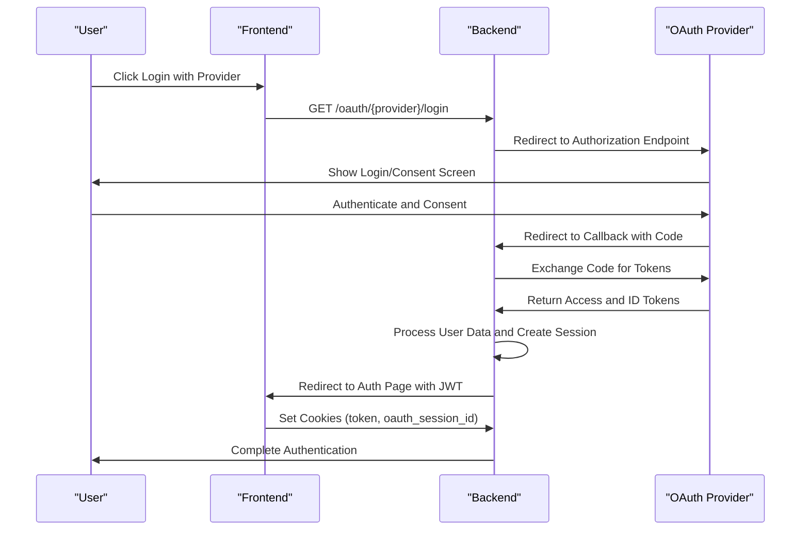
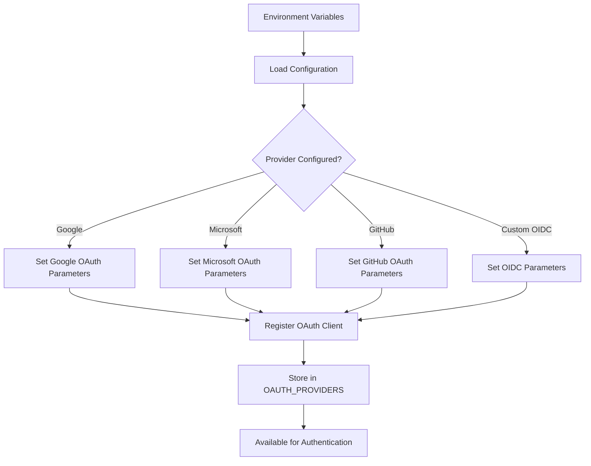
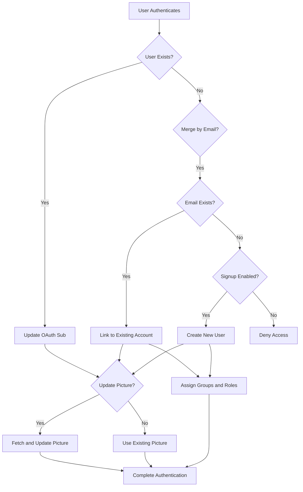

# OAuth2 Integration

<cite>
**Referenced Files in This Document**   
- [oauth.py](file://backend/open_webui/utils/oauth.py)
- [auths.py](file://backend/open_webui/routers/auths.py)
- [oauth_sessions.py](file://backend/open_webui/models/oauth_sessions.py)
- [users.py](file://backend/open_webui/models/users.py)
- [config.py](file://backend/open_webui/config.py)
- [env.py](file://backend/open_webui/env.py)
- [main.py](file://backend/open_webui/main.py)
</cite>

## Table of Contents
1. [Introduction](#introduction)
2. [OAuth2 Flow Overview](#oauth2-flow-overview)
3. [Configuration and Provider Setup](#configuration-and-provider-setup)
4. [Session Management and Security](#session-management-and-security)
5. [User Identity and Data Normalization](#user-identity-and-data-normalization)
6. [Error Handling and Security Considerations](#error-handling-and-security-considerations)
7. [Conclusion](#conclusion)

## Introduction
The OAuth2 integration system in Open WebUI provides a secure and flexible authentication mechanism supporting Google, Microsoft, GitHub, and other OpenID Connect providers. This system enables users to authenticate using their existing identities from these providers while maintaining a consistent user experience within the application. The integration handles the complete OAuth2 authorization code flow, from initiating the login request to processing the callback and establishing a user session. It includes robust features for user data normalization, role and group management, and secure session handling.

**Section sources**
- [oauth.py](file://backend/open_webui/utils/oauth.py#L1-L1581)
- [main.py](file://backend/open_webui/main.py#L2235-L2249)

## OAuth2 Flow Overview
The OAuth2 integration follows the standard authorization code flow with PKCE (Proof Key for Code Exchange) for enhanced security. The process begins with the `handle_login` function, which redirects the user to the selected provider's authorization endpoint. The redirect URI is dynamically generated based on the provider configuration or defaults to a standard callback endpoint. When using Google, Microsoft, or GitHub providers, the system automatically configures the appropriate server metadata URL and scopes. For custom OpenID Connect providers, the configuration is derived from environment variables.

Upon successful authentication at the provider, the user is redirected back to the application's callback endpoint (`/oauth/{provider}/callback`). The `handle_callback` function processes this response, exchanging the authorization code for an access token and ID token. The system validates the state parameter to prevent CSRF attacks and verifies the token signature according to OpenID Connect specifications. The callback flow includes comprehensive error handling, with detailed error messages constructed from OAuth2Error exceptions, HTTP exceptions, and network errors from the upstream provider.

**Diagram sources**
- [oauth.py](file://backend/open_webui/utils/oauth.py#L1262-L1581)
- [main.py](file://backend/open_webui/main.py#L2235-L2249)

**Section sources**
- [oauth.py](file://backend/open_webui/utils/oauth.py#L1262-L1581)
- [main.py](file://backend/open_webui/main.py#L2235-L2249)

## Configuration and Provider Setup
The OAuth2 system is configured through environment variables that define the client credentials, redirect URIs, and provider-specific settings for each supported provider. The configuration is managed through PersistentConfig objects that can be updated at runtime and stored in the database when persistent configuration is enabled. For Google authentication, the system requires `GOOGLE_CLIENT_ID`, `GOOGLE_CLIENT_SECRET`, and `GOOGLE_REDIRECT_URI` variables, with a default scope of "openid email profile". Microsoft authentication requires additional configuration including `MICROSOFT_CLIENT_TENANT_ID` and uses a tenant-specific OpenID configuration endpoint.

GitHub authentication is configured with `GITHUB_CLIENT_ID`, `GITHUB_CLIENT_SECRET`, and `GITHUB_CLIENT_REDIRECT_URI`, with a default scope of "user:email". For custom OpenID Connect providers, the system uses `OAUTH_CLIENT_ID`, `OAUTH_CLIENT_SECRET`, `OPENID_PROVIDER_URL`, and `OPENID_REDIRECT_URI` to establish the connection. The system supports dynamic client registration through the Model Context Protocol (MCP) specification, allowing automatic configuration when provider metadata is available. Configuration options include `OAUTH_SCOPES` for customizing requested permissions, `OAUTH_TIMEOUT` for setting HTTP request timeouts, and `OAUTH_CODE_CHALLENGE_METHOD` for specifying PKCE method (S256 recommended).

**Diagram sources**
- [config.py](file://backend/open_webui/config.py#L331-L793)
- [oauth.py](file://backend/open_webui/utils/oauth.py#L283-L396)

**Section sources**
- [config.py](file://backend/open_webui/config.py#L331-L793)
- [oauth.py](file://backend/open_webui/utils/oauth.py#L283-L396)

## Session Management and Security
The OAuth2 integration employs a comprehensive session management system that combines server-side storage with client-side cookies for enhanced security. When a user successfully authenticates, the system creates an OAuth session stored in the database with encrypted tokens using Fernet encryption. The session includes the access token, refresh token, ID token, and expiration timestamps. The encryption key is derived from `OAUTH_SESSION_TOKEN_ENCRYPTION_KEY`, which defaults to `WEBUI_SECRET_KEY` if not specified. The server-side session is referenced by a randomly generated `oauth_session_id` that is stored in an HttpOnly cookie, preventing client-side access and reducing XSS attack surface.

In addition to the session ID cookie, the system sets a JWT token in a cookie for application authentication. When `ENABLE_OAUTH_ID_TOKEN_COOKIE` is enabled (default), the ID token is also stored in an HttpOnly cookie for legacy compatibility. The session management system includes automatic token refresh functionality, where access tokens are refreshed before expiration using the refresh token. This process is handled transparently to the user and ensures uninterrupted access to protected resources. The system also implements proper logout handling by redirecting to the provider's end session endpoint when available, passing the ID token as a hint for single sign-out.

**Section sources**
- [oauth_sessions.py](file://backend/open_webui/models/oauth_sessions.py#L1-L278)
- [oauth.py](file://backend/open_webui/utils/oauth.py#L552-L626)
- [auths.py](file://backend/open_webui/routers/auths.py#L772-L798)

## User Identity and Data Normalization
The system extracts user identity information from the ID token or userinfo endpoint response, with configurable claim mapping through environment variables. The `OAUTH_SUB_CLAIM` variable specifies which claim contains the unique subject identifier, defaulting to "sub" but configurable for providers with custom claims (e.g., "id" for GitHub). The `OAUTH_EMAIL_CLAIM` and `OAUTH_USERNAME_CLAIM` variables determine which claims provide the user's email and name, defaulting to "email" and "name" respectively. For profile pictures, `OAUTH_PICTURE_CLAIM` specifies the claim containing the avatar URL, with provider-specific fallbacks available in the configuration.

When a user authenticates for the first time, the system checks for existing accounts using multiple strategies. First, it looks for a user with a matching subject ID for the provider. If not found and `OAUTH_MERGE_ACCOUNTS_BY_EMAIL` is enabled, it searches for a user with the same email address. If no existing user is found and `ENABLE_OAUTH_SIGNUP` is true, a new user account is created. For GitHub authentication, if the email claim is not provided (common with private emails), the system makes an additional API call to fetch the user's email addresses and uses the primary email. As a fallback, when `ENABLE_OAUTH_EMAIL_FALLBACK` is enabled, a synthetic email address is generated in the format "{provider}@{sub}.local".

Role and group assignment is handled through configurable claim mapping. The `OAUTH_ROLES_CLAIM` variable specifies which claim contains role information, with roles separated by `OAUTH_ROLES_SEPARATOR` (comma by default). Administrators are identified by roles listed in `OAUTH_ADMIN_ROLES`, while `OAUTH_ALLOWED_ROLES` restricts authentication to users with specific roles. Group membership is extracted from the claim specified by `OAUTH_GROUPS_CLAIM`, with groups separated by `OAUTH_GROUPS_SEPARATOR` (semicolon by default). When `ENABLE_OAUTH_GROUP_CREATION` is enabled, groups are automatically created if they don't exist, and `OAUTH_BLOCKED_GROUPS` can prevent specific groups from being assigned.

**Diagram sources**
- [oauth.py](file://backend/open_webui/utils/oauth.py#L1322-L1507)
- [users.py](file://backend/open_webui/models/users.py#L565-L595)

**Section sources**
- [oauth.py](file://backend/open_webui/utils/oauth.py#L1322-L1507)
- [users.py](file://backend/open_webui/models/users.py#L565-L595)

## Error Handling and Security Considerations
The OAuth2 integration includes comprehensive error handling throughout the authentication flow. The `_build_oauth_callback_error_message` function processes various exception types to produce user-friendly error messages while maintaining security by avoiding information disclosure. OAuth2Error exceptions are parsed to extract the error code and description, while HTTP exceptions and network errors from aiohttp are handled appropriately. The system validates redirect URIs against the provider's configuration to prevent open redirect vulnerabilities and verifies token signatures according to OpenID Connect specifications.

Security considerations include protection against OAuth token injection attacks through strict validation of the sub claim and provider association. The system verifies that email domains are allowed when `OAUTH_ALLOWED_DOMAINS` is configured, preventing unauthorized domains from authenticating. State parameter validation is handled by the authlib library, ensuring CSRF protection. Token encryption using Fernet with a key derived from `OAUTH_CLIENT_INFO_ENCRYPTION_KEY` (defaulting to `WEBUI_SECRET_KEY`) protects sensitive client credentials and tokens at rest. The system also implements proper session cleanup by removing existing OAuth sessions for the same user and provider before creating a new session, preventing session fixation attacks.

**Section sources**
- [oauth.py](file://backend/open_webui/utils/oauth.py#L167-L195)
- [oauth.py](file://backend/open_webui/utils/oauth.py#L1389-L1398)
- [env.py](file://backend/open_webui/env.py#L498-L505)

## Conclusion
The OAuth2 integration in Open WebUI provides a robust, secure, and extensible authentication system that supports multiple providers while maintaining a consistent user experience. The system's modular design allows for easy addition of new providers and customization of authentication behavior through environment variables. Key security features include encrypted token storage, CSRF protection through state parameters, and configurable domain and role restrictions. The integration seamlessly handles user provisioning, data normalization, and session management, making it suitable for both individual users and enterprise deployments. Future enhancements could include support for additional OAuth 2.0 flows, improved error recovery, and more granular permission controls.