# Backend Architecture

<cite>
**Referenced Files in This Document**   
- [main.py](file://backend/open_webui/main.py)
- [config.py](file://backend/open_webui/config.py)
- [db.py](file://backend/open_webui/internal/db.py)
- [env.py](file://backend/open_webui/env.py)
- [chats.py](file://backend/open_webui/routers/chats.py)
- [chat.py](file://backend/open_webui/utils/chat.py)
- [users.py](file://backend/open_webui/models/users.py)
- [auth.py](file://backend/open_webui/utils/auth.py)
- [oauth.py](file://backend/open_webui/utils/oauth.py)
- [auths.py](file://backend/open_webui/routers/auths.py)
- [tasks.py](file://backend/open_webui/tasks.py)
- [socket/main.py](file://backend/open_webui/socket/main.py)
- [models/chats.py](file://backend/open_webui/models/chats.py)
- [models/users.py](file://backend/open_webui/models/users.py)
</cite>

## Table of Contents
1. [Introduction](#introduction)
2. [Project Structure](#project-structure)
3. [FastAPI Application Structure](#fastapi-application-structure)
4. [MVC-like Architecture Pattern](#mvc-like-architecture-pattern)
5. [Database Layer](#database-layer)
6. [Authentication System](#authentication-system)
7. [WebSocket Implementation](#websocket-implementation)
8. [Background Task System](#background-task-system)
9. [Request Flow Example](#request-flow-example)
10. [Scalability Considerations](#scalability-considerations)
11. [Security Practices](#security-practices)
12. [Conclusion](#conclusion)

## Introduction
The open-webui backend is a comprehensive FastAPI application designed to provide a robust interface for interacting with AI models. This document details the architectural components and design patterns used in the system, focusing on the modular structure, data flow, and integration points. The architecture follows an MVC-like pattern with clear separation between routers (controllers), services (utils), and models (data structures). The system incorporates modern web technologies including WebSocket support for real-time communication, a background task system for asynchronous operations, and a sophisticated authentication mechanism supporting multiple providers and API keys.

## Project Structure
The backend structure is organized into several key directories that reflect the application's modular design:

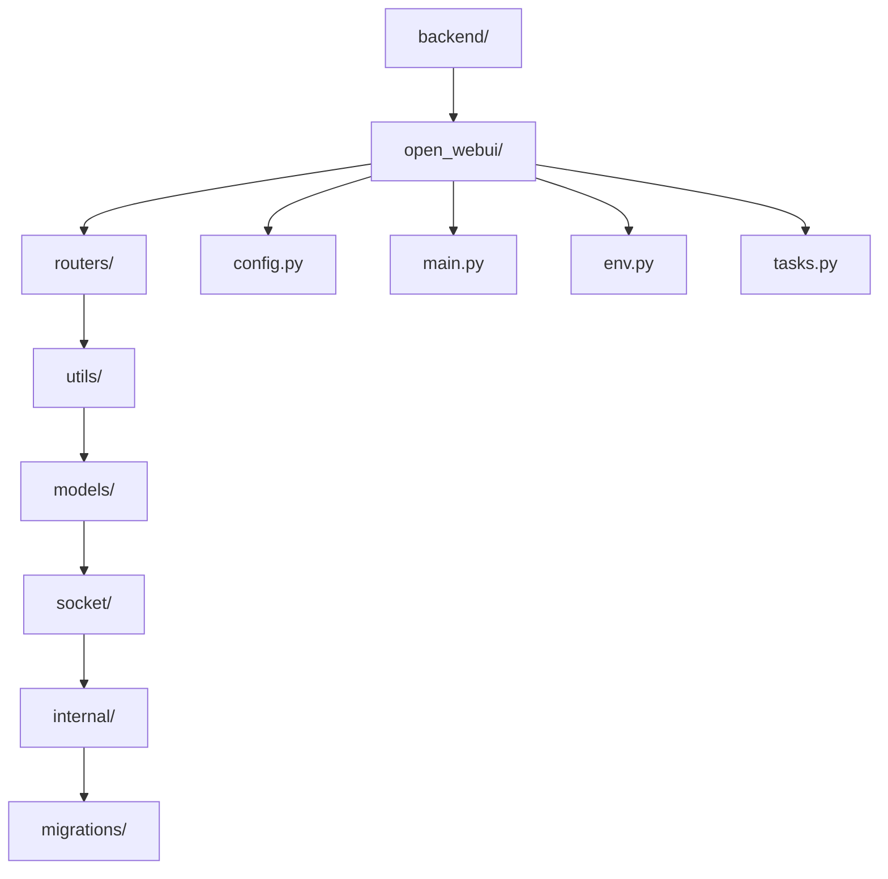

**Diagram sources**
- [main.py](file://backend/open_webui/main.py#L1-L2352)
- [config.py](file://backend/open_webui/config.py#L1-L3840)

**Section sources**
- [main.py](file://backend/open_webui/main.py#L1-L2352)
- [config.py](file://backend/open_webui/config.py#L1-L3840)

## FastAPI Application Structure
The FastAPI application is structured with modular routers that handle different features of the system. Each router corresponds to a specific domain or functionality, allowing for clean separation of concerns and easier maintenance.

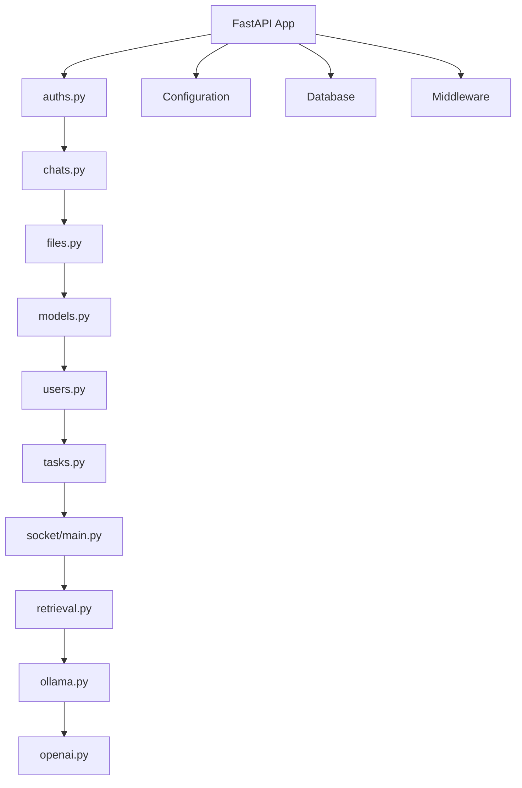

The main application entry point in `main.py` imports and includes these routers, creating a well-organized API structure. The application uses dependency injection for authentication and authorization, with functions like `get_verified_user` and `get_admin_user` providing role-based access control.

**Section sources**
- [main.py](file://backend/open_webui/main.py#L70-L98)
- [chats.py](file://backend/open_webui/routers/chats.py#L31)
- [auths.py](file://backend/open_webui/routers/auths.py#L81)

## MVC-like Architecture Pattern
The application follows an MVC-like pattern with a clear separation between the different layers of the application. This pattern is evident in the organization of the codebase, with routers handling requests (controllers), services in utils/ processing logic (models), and models defining data structures (views).

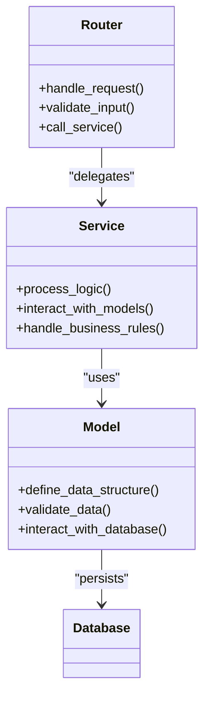

**Diagram sources**
- [chats.py](file://backend/open_webui/routers/chats.py#L31)
- [chat.py](file://backend/open_webui/utils/chat.py#L72)
- [chats.py](file://backend/open_webui/models/chats.py#L26)

The routers act as controllers, receiving HTTP requests and delegating the processing to service functions in the utils directory. These service functions contain the business logic and interact with model classes that define the data structures and handle database operations.

### Request Processing Flow
When a request is received, it follows a specific flow through the application layers:

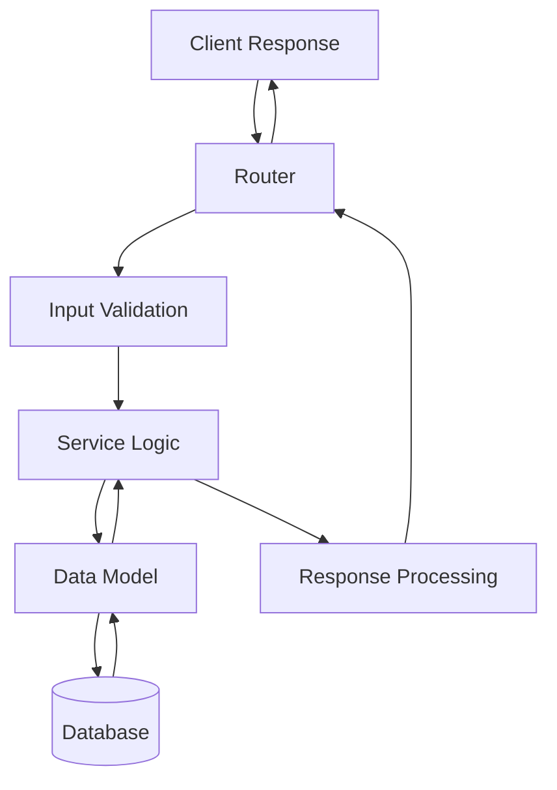

**Diagram sources**
- [chats.py](file://backend/open_webui/routers/chats.py#L133)
- [chat.py](file://backend/open_webui/utils/chat.py#L171)
- [chats.py](file://backend/open_webui/models/chats.py#L167)

## Database Layer
The database layer is built on SQLAlchemy ORM with Alembic for migrations, providing a robust and maintainable data persistence system. The architecture supports multiple database backends including SQLite, PostgreSQL, and SQLCipher for encrypted storage.

### SQLAlchemy ORM Implementation
The application uses SQLAlchemy's declarative base system to define database models. Each model class corresponds to a database table and includes column definitions and relationships.

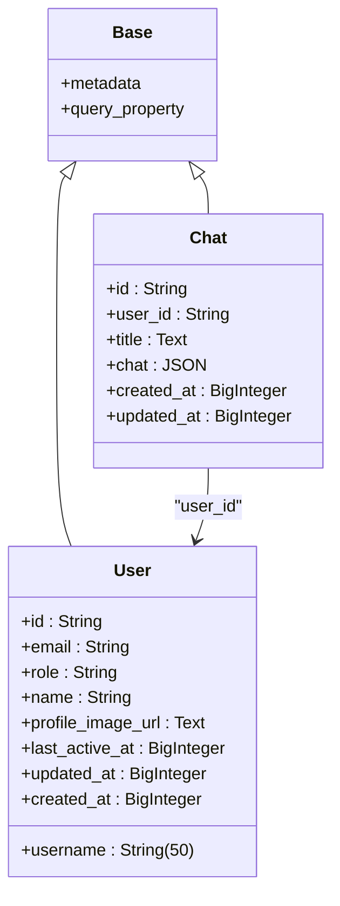

**Diagram sources**
- [db.py](file://backend/open_webui/internal/db.py#L152)
- [chats.py](file://backend/open_webui/models/chats.py#L26)
- [users.py](file://backend/open_webui/models/users.py#L45)

### Migration Strategy
The migration system uses both internal peewee migrations and standard Alembic migrations to handle database schema changes. This dual approach ensures compatibility with existing data while providing a robust framework for future schema evolution.

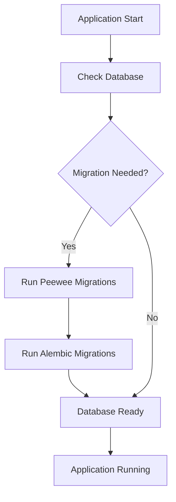

**Diagram sources**
- [db.py](file://backend/open_webui/internal/db.py#L55)
- [config.py](file://backend/open_webui/config.py#L53)
- [script.py.mako](file://backend/open_webui/migrations/script.py.mako#L1)

The migration process first handles any peewee migrations (for backward compatibility) followed by Alembic migrations for the current SQLAlchemy schema. This ensures a smooth transition when upgrading from previous versions of the application.

**Section sources**
- [db.py](file://backend/open_webui/internal/db.py#L55-L80)
- [config.py](file://backend/open_webui/config.py#L53-L68)
- [script.py.mako](file://backend/open_webui/migrations/script.py.mako#L1-L28)

## Authentication System
The authentication system is comprehensive, supporting multiple methods including OAuth providers, API keys, and traditional username/password authentication. The system is designed to be flexible and secure, with configurable options for different deployment scenarios.

### OAuth Implementation
The OAuth system supports multiple providers including Google, Microsoft, GitHub, and custom OpenID Connect configurations. The implementation uses Authlib to handle the OAuth flows securely.

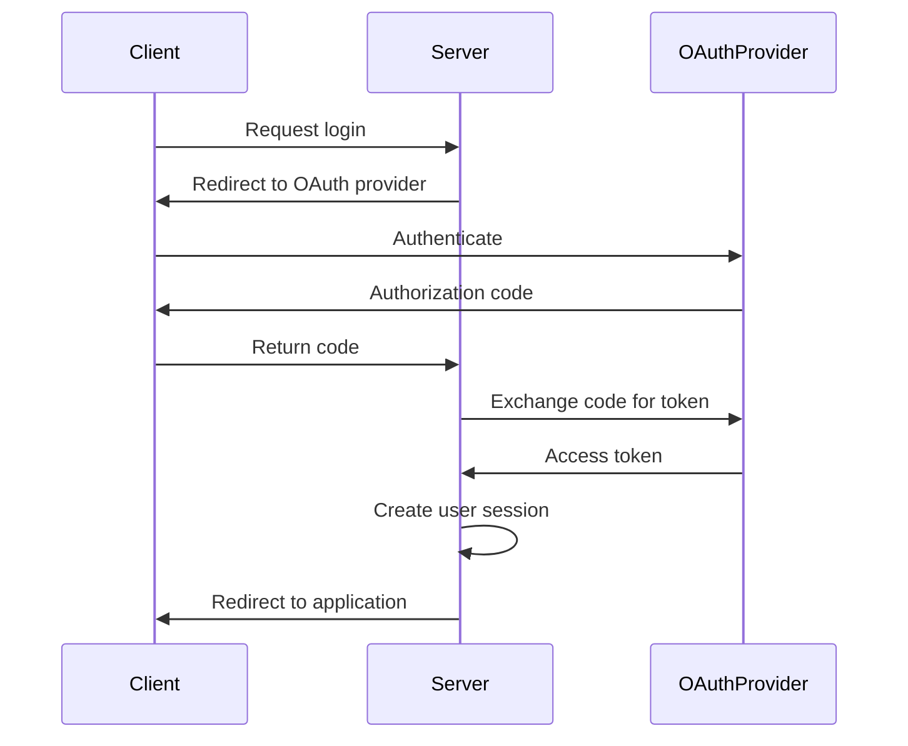

**Diagram sources**
- [oauth.py](file://backend/open_webui/utils/oauth.py#L20)
- [auths.py](file://backend/open_webui/routers/auths.py#L81)
- [main.py](file://backend/open_webui/main.py#L665)

### API Key Support
API key authentication is implemented as an alternative to session-based authentication, allowing for programmatic access to the API. The system supports both global and endpoint-restricted API keys.

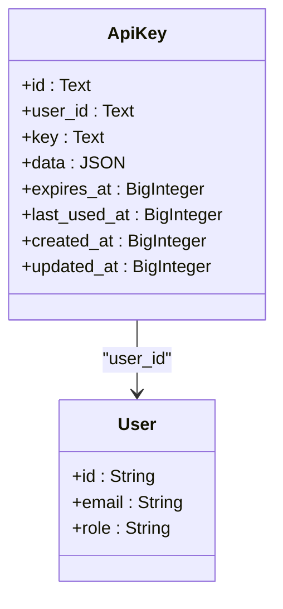

**Diagram sources**
- [users.py](file://backend/open_webui/models/users.py#L118)
- [auths.py](file://backend/open_webui/routers/auths.py#L10)

The API key system allows for fine-grained control over which endpoints can be accessed, with configuration options to restrict keys to specific endpoints or allow access to all endpoints.

**Section sources**
- [auth.py](file://backend/open_webui/utils/auth.py#L160)
- [oauth.py](file://backend/open_webui/utils/oauth.py#L131)
- [auths.py](file://backend/open_webui/routers/auths.py#L58)

## WebSocket Implementation
The WebSocket implementation provides real-time communication capabilities for the application, enabling features like live chat updates and streaming responses from AI models.

### WebSocket Architecture
The WebSocket system is built on Socket.IO, providing a robust real-time communication layer that falls back to polling when WebSocket connections are not available.

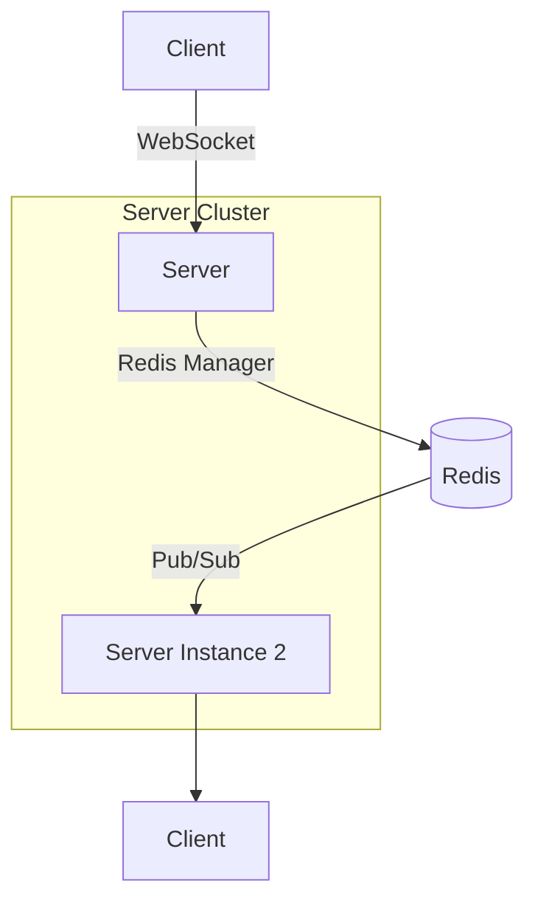

**Diagram sources**
- [socket/main.py](file://backend/open_webui/socket/main.py#L64)
- [main.py](file://backend/open_webui/main.py#L64)

The implementation supports both standalone and clustered deployments, using Redis as a message broker when multiple server instances are running. This allows for horizontal scaling while maintaining real-time communication capabilities across all instances.

### Session and Usage Management
The WebSocket system includes sophisticated session and usage management using Redis dictionaries to track active connections and resource usage.

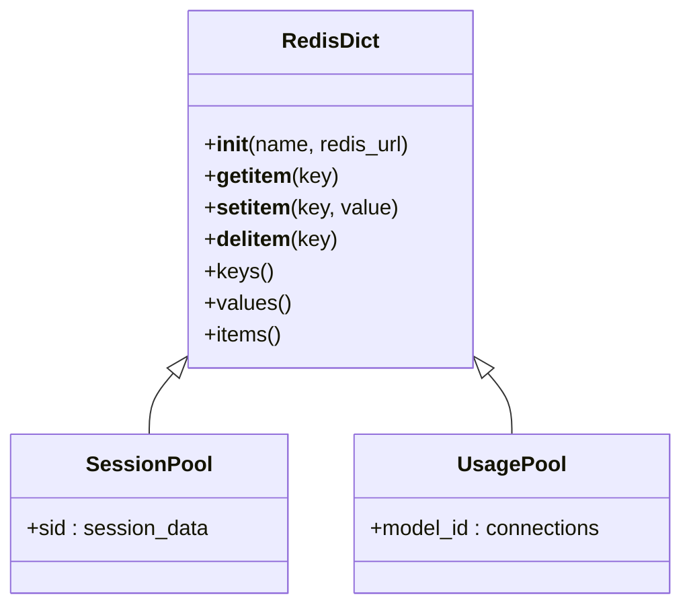

**Diagram sources**
- [socket/main.py](file://backend/open_webui/socket/main.py#L122)
- [socket/utils.py](file://backend/open_webui/socket/utils.py#L1)

The system maintains two primary pools: a session pool that tracks active WebSocket sessions and a usage pool that monitors model usage across connections. This enables features like connection limiting and usage-based routing.

**Section sources**
- [socket/main.py](file://backend/open_webui/socket/main.py#L122-L140)
- [socket/utils.py](file://backend/open_webui/socket/utils.py#L1)

## Background Task System
The background task system manages asynchronous operations in the application, allowing for long-running processes to execute without blocking the main request-response cycle.

### Task Management Architecture
The task system is designed to handle distributed task management across multiple server instances, using Redis for coordination and persistence.

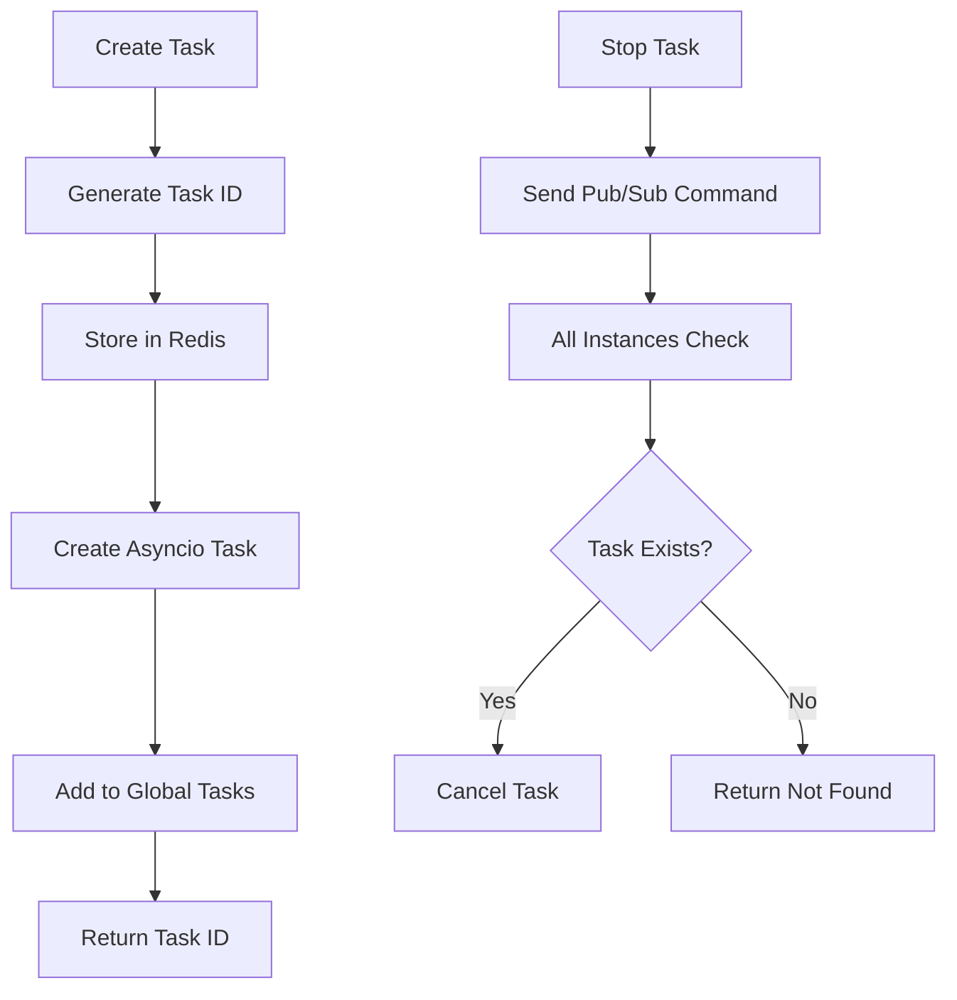

**Diagram sources**
- [tasks.py](file://backend/open_webui/tasks.py#L27)
- [socket/main.py](file://backend/open_webui/socket/main.py#L43)

### Task Lifecycle
The task system manages the complete lifecycle of background tasks, from creation to completion or cancellation.

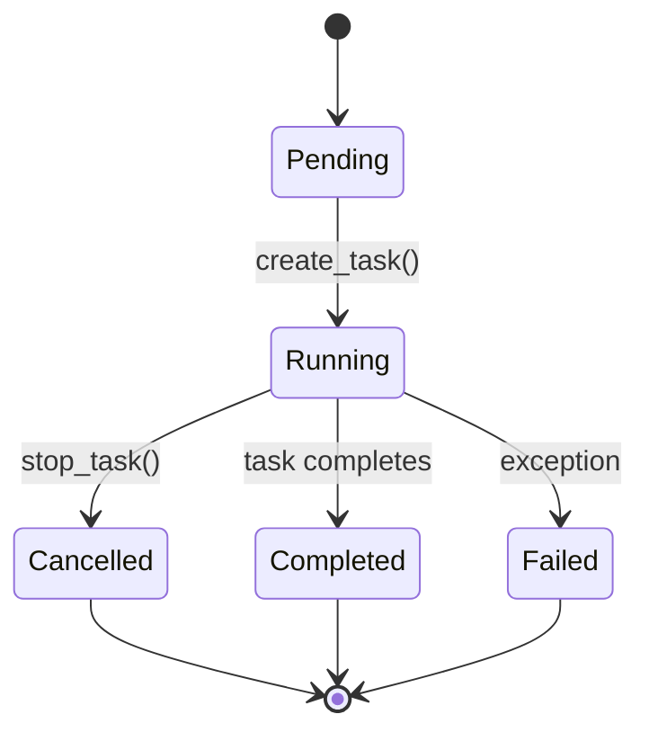

**Diagram sources**
- [tasks.py](file://backend/open_webui/tasks.py#L97)
- [tasks.py](file://backend/open_webui/tasks.py#L140)

The system uses Redis pub/sub to broadcast task cancellation commands across all server instances, ensuring that tasks can be stopped even in distributed deployments. Each task is assigned a unique ID and can be associated with a specific item (like a chat session), allowing for targeted task management.

**Section sources**
- [tasks.py](file://backend/open_webui/tasks.py#L18)
- [tasks.py](file://backend/open_webui/tasks.py#L97)
- [tasks.py](file://backend/open_webui/tasks.py#L140)

## Request Flow Example
This section details the complete flow of a chat message from API endpoint to database storage, illustrating the integration of various components in the system.

### Chat Message Processing Flow
When a user sends a chat message, it follows a specific path through the application:

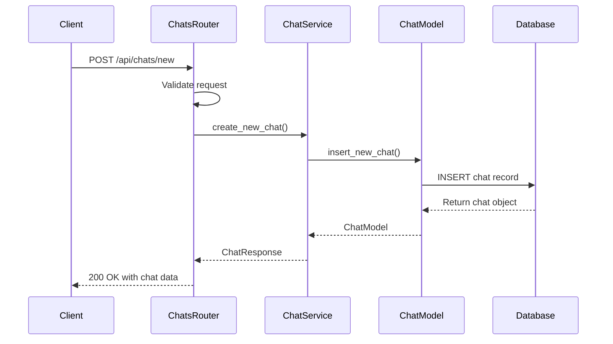

**Diagram sources**
- [chats.py](file://backend/open_webui/routers/chats.py#L133)
- [chat.py](file://backend/open_webui/utils/chat.py#L171)
- [chats.py](file://backend/open_webui/models/chats.py#L167)

### Detailed Processing Steps
The chat message processing involves several steps and components:

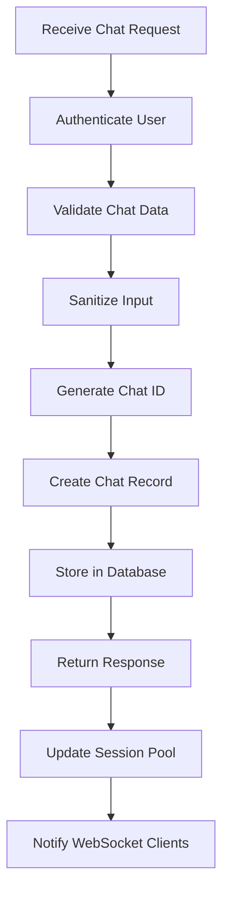

**Diagram sources**
- [chats.py](file://backend/open_webui/routers/chats.py#L133)
- [chats.py](file://backend/open_webui/models/chats.py#L167)
- [socket/main.py](file://backend/open_webui/socket/main.py#L107)

The process begins with authentication to verify the user's identity, followed by validation of the chat data structure. The input is then sanitized to remove any null bytes or potentially problematic characters. A unique chat ID is generated using UUID4, and the chat record is created with timestamps for creation and update. The record is stored in the database with JSON storage for the chat content, and a response is returned to the client. Finally, the session pool is updated, and WebSocket clients are notified of the new chat.

**Section sources**
- [chats.py](file://backend/open_webui/routers/chats.py#L133-L143)
- [chats.py](file://backend/open_webui/models/chats.py#L167-L190)
- [socket/main.py](file://backend/open_webui/socket/main.py#L107-L121)

## Scalability Considerations
The architecture includes several features designed to support scalability and performance in production environments.

### Horizontal Scaling
The application is designed to support horizontal scaling through stateless design and externalized session storage.

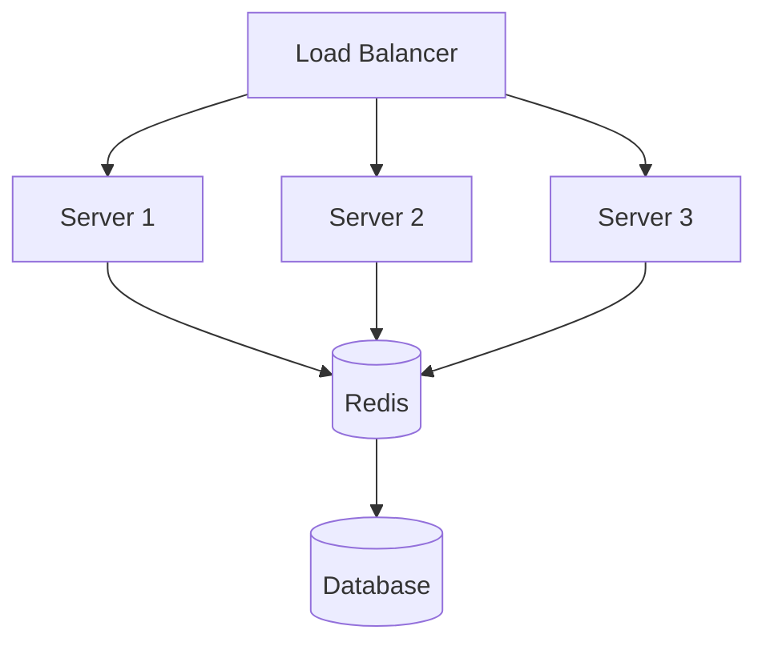

**Diagram sources**
- [socket/main.py](file://backend/open_webui/socket/main.py#L64)
- [main.py](file://backend/open_webui/main.py#L585)

The use of Redis for session storage and WebSocket message brokering allows multiple server instances to share state, enabling true horizontal scaling. The database connection pooling and optimization settings in `db.py` also support high-concurrency scenarios.

### Performance Optimizations
Several performance optimizations are implemented throughout the system:

- **Connection Pooling**: Configurable database connection pooling with settings for pool size, overflow, timeout, and recycle
- **Caching**: Redis-based caching for frequently accessed data like model lists
- **Async Operations**: Extensive use of async/await for non-blocking I/O operations
- **Background Tasks**: Offloading long-running operations to background tasks

These optimizations ensure that the application can handle high loads while maintaining responsive performance.

**Section sources**
- [db.py](file://backend/open_webui/internal/db.py#L129-L145)
- [main.py](file://backend/open_webui/main.py#L585)
- [config.py](file://backend/open_webui/config.py#L165)

## Security Practices
The application implements several security practices to protect user data and system integrity.

### Authentication and Authorization
The system uses JWT tokens for session management with configurable expiration times. Passwords are hashed using bcrypt, and API keys are stored securely.

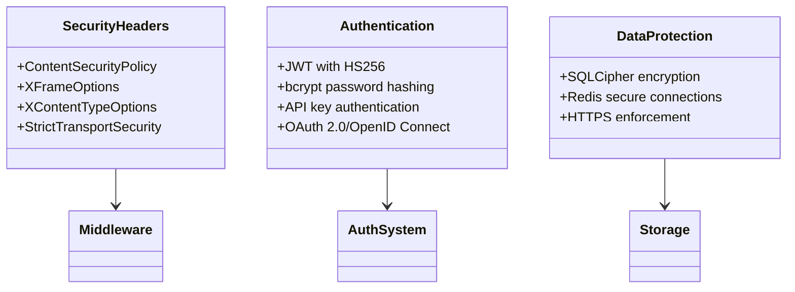

**Diagram sources**
- [auth.py](file://backend/open_webui/utils/auth.py#L51)
- [env.py](file://backend/open_webui/env.py#L455)
- [main.py](file://backend/open_webui/main.py#L511)

### Input Validation and Sanitization
All user input is validated and sanitized to prevent common security vulnerabilities:

- **SQL Injection**: Prevented through SQLAlchemy ORM and parameterized queries
- **XSS**: Addressed through input sanitization and proper output encoding
- **CSRF**: Mitigated through JWT tokens and secure cookie settings
- **Rate Limiting**: Implemented for authentication endpoints to prevent brute force attacks

The system also includes security headers middleware to enforce secure browser policies and protect against common web vulnerabilities.

**Section sources**
- [chats.py](file://backend/open_webui/models/chats.py#L130)
- [auths.py](file://backend/open_webui/routers/auths.py#L86)
- [main.py](file://backend/open_webui/main.py#L511)

## Conclusion
The open-webui backend architecture demonstrates a well-structured, scalable, and secure design that effectively leverages modern Python web development practices. The MVC-like pattern with modular routers, service utilities, and data models provides a clean separation of concerns that enhances maintainability and extensibility. The integration of SQLAlchemy ORM with Alembic migrations ensures robust data management, while the comprehensive authentication system supports multiple methods including OAuth and API keys. The WebSocket implementation enables real-time features, and the background task system allows for asynchronous processing of long-running operations. Security is prioritized throughout the architecture with JWT-based authentication, bcrypt password hashing, and various protections against common web vulnerabilities. The design considerations for scalability, including support for horizontal scaling and performance optimizations, make this architecture suitable for both small-scale deployments and large production environments.