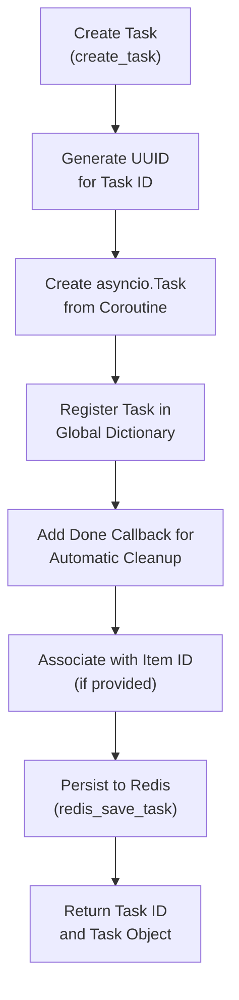
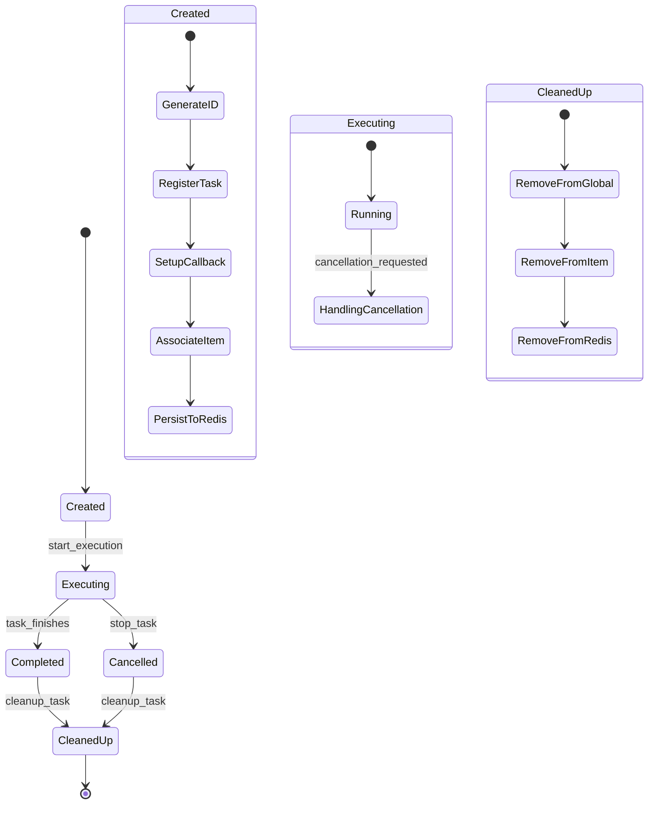
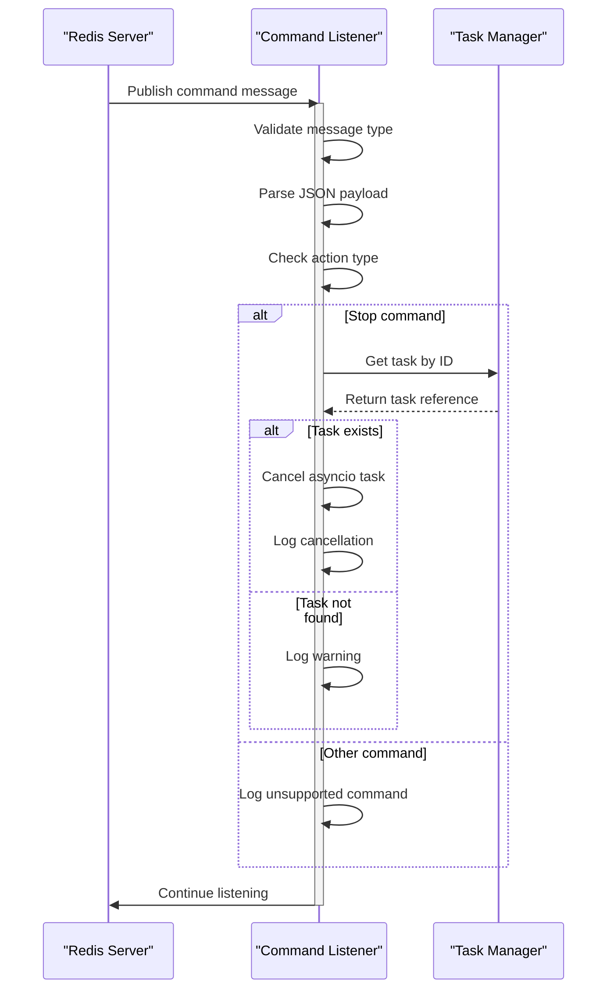
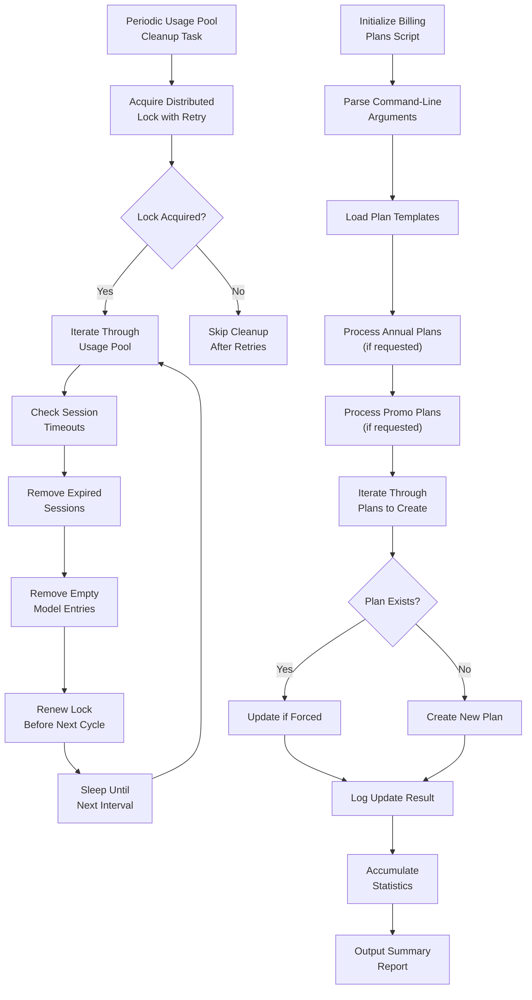
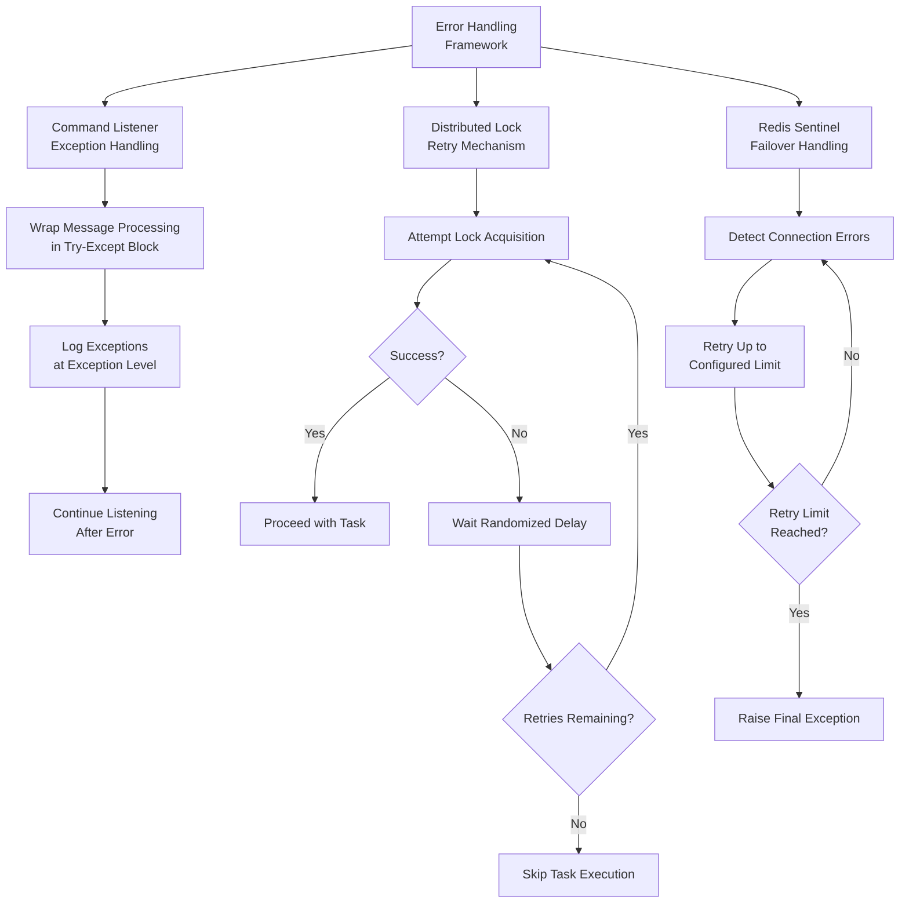

# Background Task System

<cite>
**Referenced Files in This Document**   
- [tasks.py](file://backend/open_webui/tasks.py)
- [main.py](file://backend/open_webui/main.py)
- [socket/main.py](file://backend/open_webui/socket/main.py)
- [routers/tasks.py](file://backend/open_webui/routers/tasks.py)
- [utils/task.py](file://backend/open_webui/utils/task.py)
- [scripts/init_billing_plans.py](file://backend/scripts/init_billing_plans.py)
</cite>

## Table of Contents
1. [Introduction](#introduction)
2. [Task Execution Framework](#task-execution-framework)
3. [Task Lifecycle Management](#task-lifecycle-management)
4. [Redis Integration](#redis-integration)
5. [Task Command Listener](#task-command-listener)
6. [Background Task Examples](#background-task-examples)
7. [Error Handling and Retry Mechanisms](#error-handling-and-retry-mechanisms)
8. [Resource Management](#resource-management)
9. [Scalability Considerations](#scalability-considerations)
10. [Monitoring Approaches](#monitoring-approaches)

## Introduction
The Background Task System in open-webui is a comprehensive framework designed to handle asynchronous operations efficiently. This system enables the platform to perform resource-intensive tasks without blocking the main application flow, ensuring optimal user experience and system responsiveness. Built on Redis as a message broker, the task system provides a robust infrastructure for managing background operations such as billing plan initialization, model caching, and periodic cleanup processes. The architecture supports distributed task management across multiple instances, making it suitable for scalable deployments.

**Section sources**
- [tasks.py](file://backend/open_webui/tasks.py#L1-L20)
- [main.py](file://backend/open_webui/main.py#L590-L603)

## Task Execution Framework
The task execution framework in open-webui is built around asyncio and Redis integration, providing a non-blocking, efficient mechanism for handling background operations. The system maintains two primary data structures: a global dictionary of active tasks and a mapping of tasks to specific items. When a new task is created, it is assigned a unique UUID and registered in both the local memory and Redis storage. The framework supports task creation with optional association to specific items, enabling granular task management and tracking.

The execution model leverages Python's asyncio library to create non-blocking coroutines that can run concurrently with other application processes. Each task is wrapped in an asyncio.Task object and managed through the framework's task registry. The system automatically handles task completion and cleanup through done callbacks, ensuring that resources are properly released when tasks finish, whether successfully or through cancellation.



**Diagram sources **
- [tasks.py](file://backend/open_webui/tasks.py#L97-L119)

**Section sources**
- [tasks.py](file://backend/open_webui/tasks.py#L97-L119)

## Task Lifecycle Management
The task lifecycle in open-webui follows a comprehensive state management pattern from creation through execution to termination. Each task progresses through well-defined states: creation, execution, completion/cancellation, and cleanup. The system provides explicit APIs for each phase of the lifecycle, ensuring predictable behavior and proper resource management.

Task creation involves generating a unique identifier, creating the asyncio task, registering it in the global task dictionary, and persisting metadata to Redis. During execution, tasks can be monitored and managed through their unique IDs. The system supports both individual task cancellation and bulk cancellation of all tasks associated with a specific item.

When tasks complete (either successfully or through cancellation), the framework automatically triggers cleanup procedures. This includes removing the task from the global registry, disassociating it from any item IDs, and removing its metadata from Redis storage. The cleanup process is designed to be idempotent, preventing errors when attempting to clean up already-removed tasks.



**Diagram sources **
- [tasks.py](file://backend/open_webui/tasks.py#L81-L95)
- [tasks.py](file://backend/open_webui/tasks.py#L97-L119)

**Section sources**
- [tasks.py](file://backend/open_webui/tasks.py#L81-L119)

## Redis Integration
Redis serves as the central message broker and state manager for the background task system in open-webui. The integration provides distributed task coordination across multiple application instances, enabling horizontal scaling and high availability. The system uses three primary Redis data structures: a hash for task metadata, sets for item-task associations, and a pub/sub channel for command distribution.

The task metadata is stored in a Redis hash with the key format "{prefix}:tasks", where each field represents a task ID and the value contains the associated item ID (if any). This structure allows for efficient listing of all active tasks across the cluster. For item-specific task tracking, the system uses Redis sets with keys in the format "{prefix}:tasks:item:{item_id}", enabling quick retrieval of all tasks associated with a particular item.

The pub/sub channel "{prefix}:tasks:commands" facilitates distributed command processing, allowing any instance to send stop commands that are received by all running instances. This ensures that task cancellation requests are propagated throughout the cluster, preventing orphaned tasks in distributed deployments.

```mermaid
erDiagram
TASKS {
string task_id PK
string item_id FK
}
ITEM_TASKS {
string item_id PK
string task_id PK
}
TASK_COMMANDS {
string action
string task_id
}
TASKS ||--o{ ITEM_TASKS : "contains"
TASK_COMMANDS }|--|| TASKS : "targets"
class TASKS "Redis Hash\nKey: {prefix}:tasks"
class ITEM_TASKS "Redis Set\nKey: {prefix}:tasks:item:{item_id}"
class TASK_COMMANDS "Redis Pub/Sub\nChannel: {prefix}:tasks:commands"
```

**Diagram sources **
- [tasks.py](file://backend/open_webui/tasks.py#L22-L24)
- [tasks.py](file://backend/open_webui/tasks.py#L51-L66)

**Section sources**
- [tasks.py](file://backend/open_webui/tasks.py#L22-L66)

## Task Command Listener
The redis_task_command_listener is a critical component of the distributed task management system, responsible for receiving and processing task commands from the Redis pub/sub channel. This asynchronous listener runs as a long-lived task within each application instance, continuously monitoring the command channel for incoming messages.

When a command message is received, the listener first validates that it is a proper message type (not a subscription control message). It then parses the JSON payload and checks for the "stop" action, which is currently the only implemented command type. For stop commands, the listener looks up the specified task ID in the local task dictionary and cancels the corresponding asyncio task if found.

The listener implements robust error handling to prevent crashes from malformed messages or transient Redis issues. Any exceptions during command processing are logged at the exception level, providing detailed diagnostics while ensuring the listener continues to operate. This fault-tolerant design ensures that command processing failures do not disrupt the overall task management system.



**Diagram sources **
- [tasks.py](file://backend/open_webui/tasks.py#L27-L43)
- [main.py](file://backend/open_webui/main.py#L594-L597)

**Section sources**
- [tasks.py](file://backend/open_webui/tasks.py#L27-L43)

## Background Task Examples
The open-webui system implements several key background tasks that demonstrate the framework's capabilities. Two prominent examples are the periodic_usage_pool_cleanup task and the init_billing_plans script, which showcase different aspects of the task system.

The periodic_usage_pool_cleanup task is a recurring maintenance operation that runs at regular intervals to clean up expired connections from the usage pool. This task implements a distributed locking mechanism to prevent multiple instances from performing cleanup simultaneously. It iterates through all models in the usage pool, removing sessions that have exceeded the timeout duration, and completely removing models with no active connections.

The init_billing_plans script is a one-time initialization task that creates billing plans from templates. This script can be executed with various options to include annual plans, promotional plans, or to force overwrite existing plans. It demonstrates the use of the task system for data initialization and migration operations, providing detailed progress reporting and error handling.



**Diagram sources **
- [socket/main.py](file://backend/open_webui/socket/main.py#L166-L216)
- [scripts/init_billing_plans.py](file://backend/scripts/init_billing_plans.py#L29-L67)

**Section sources**
- [socket/main.py](file://backend/open_webui/socket/main.py#L166-L216)
- [scripts/init_billing_plans.py](file://backend/scripts/init_billing_plans.py#L29-L67)

## Error Handling and Retry Mechanisms
The background task system implements comprehensive error handling and retry mechanisms to ensure reliability and fault tolerance. Each component of the system includes appropriate exception handling to prevent crashes and maintain stability.

For the redis_task_command_listener, all message processing is wrapped in a try-except block that catches any exceptions and logs them at the exception level. This prevents malformed messages or transient Redis issues from terminating the listener, ensuring continuous command processing capability.

The periodic_usage_pool_cleanup task implements a retry mechanism with randomized backoff when attempting to acquire the distributed cleanup lock. It will attempt to acquire the lock up to three times with delays between attempts, providing resilience against temporary contention. If all retry attempts fail, the task gracefully skips the cleanup cycle rather than failing catastrophically.

The Redis connection management includes built-in retry logic for sentinel configurations, automatically handling failover scenarios and retrying operations when master-slave transitions occur. This ensures that the task system remains operational even during Redis cluster reconfigurations.



**Diagram sources **
- [tasks.py](file://backend/open_webui/tasks.py#L42-L43)
- [socket/main.py](file://backend/open_webui/socket/main.py#L169-L185)
- [utils/redis.py](file://backend/open_webui/utils/redis.py#L45-L70)

**Section sources**
- [tasks.py](file://backend/open_webui/tasks.py#L42-L43)
- [socket/main.py](file://backend/open_webui/socket/main.py#L169-L185)

## Resource Management
The background task system implements efficient resource management practices to prevent memory leaks and ensure optimal performance. The system maintains strict lifecycle management for all tasks, ensuring that resources are properly released when tasks complete or are cancelled.

Task cleanup is handled automatically through done callbacks attached to each asyncio task. When a task completes (successfully or through cancellation), the cleanup_task function is called, which removes the task from all tracking structures. This includes removing the task from the global tasks dictionary, disassociating it from any item IDs in the item_tasks dictionary, and removing its metadata from Redis storage.

The system also manages Redis connections efficiently through connection pooling and caching. The get_redis_connection function maintains a cache of established connections, reusing them when possible to avoid the overhead of repeated connection establishment. This is particularly important in high-concurrency scenarios where numerous tasks may require Redis access simultaneously.

For long-running tasks, the system implements periodic lock renewal to prevent distributed locks from expiring prematurely. This ensures that cleanup operations and other long-running tasks can complete their work without interruption due to timeout.

**Section sources**
- [tasks.py](file://backend/open_webui/tasks.py#L81-L95)
- [utils/redis.py](file://backend/open_webui/utils/redis.py#L140-L148)

## Scalability Considerations
The background task system is designed with scalability as a primary consideration, supporting both vertical and horizontal scaling of the open-webui platform. The Redis-based architecture enables multiple application instances to coordinate task management effectively, making the system suitable for distributed deployments.

The use of Redis as a centralized state store allows all instances to have a consistent view of active tasks, preventing conflicts and ensuring proper task distribution. The pub/sub messaging system enables real-time command propagation across all instances, ensuring that task cancellation requests are handled consistently throughout the cluster.

For high-load scenarios, the system can be scaled horizontally by adding more application instances behind a load balancer. Each instance runs its own copy of the task command listener, ensuring that command messages are processed by all nodes. The distributed locking mechanism prevents race conditions when multiple instances attempt to perform the same maintenance task.

The task system also supports configuration of thread pool size through the THREAD_POOL_SIZE environment variable, allowing administrators to tune the concurrency level based on available system resources and workload characteristics.

**Section sources**
- [tasks.py](file://backend/open_webui/tasks.py#L27-L43)
- [main.py](file://backend/open_webui/main.py#L599-L601)

## Monitoring Approaches
The background task system incorporates several monitoring approaches to provide visibility into task execution and system health. Comprehensive logging is implemented throughout the system, with configurable log levels for different components.

The system uses structured logging with distinct loggers for different subsystems, allowing administrators to enable detailed logging for specific components without overwhelming the log output. Log levels can be configured independently for MAIN, RAG, MODELS, and other components through environment variables.

For task-specific monitoring, the system provides APIs to list all active tasks and tasks associated with specific items. These endpoints enable external monitoring tools to track task execution and detect potential issues such as long-running or orphaned tasks.

The init_billing_plans script demonstrates a comprehensive reporting approach, providing detailed summary statistics after completion, including counts of created, updated, and skipped plans. This pattern can be extended to other administrative tasks to provide clear feedback on their execution.

The periodic_usage_pool_cleanup task includes debug-level logging for lock acquisition attempts and warning-level logging when cleanup is skipped due to lock contention, providing visibility into the task's operation without overwhelming the logs in normal operation.

**Section sources**
- [env.py](file://backend/open_webui/env.py#L88-L111)
- [tasks.py](file://backend/open_webui/tasks.py#L14-L15)
- [scripts/init_billing_plans.py](file://backend/scripts/init_billing_plans.py#L68-L73)