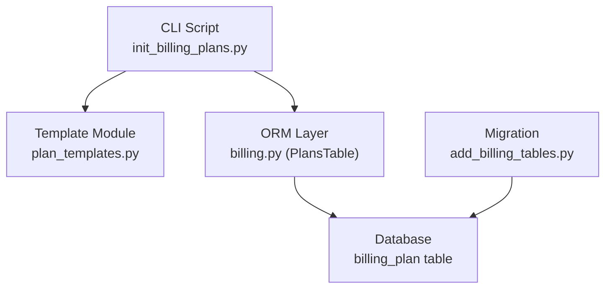
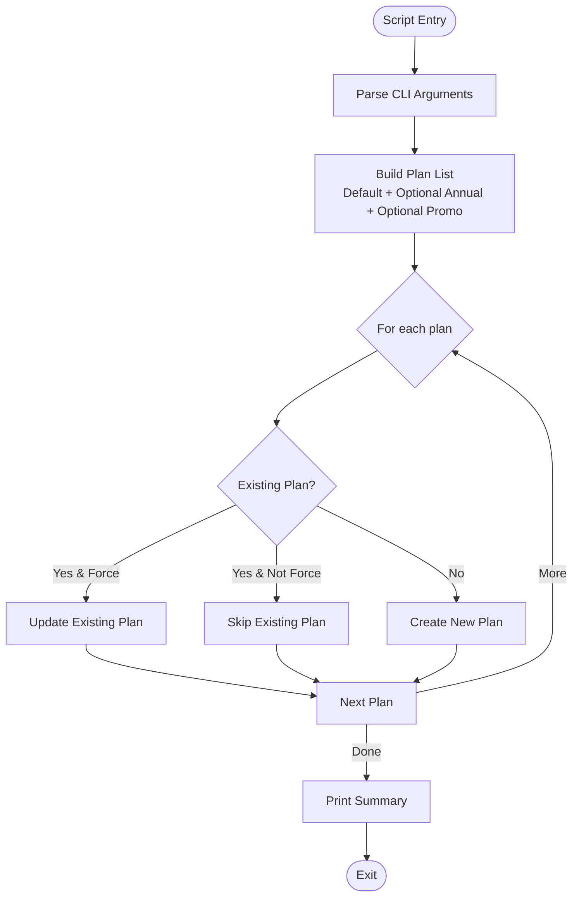
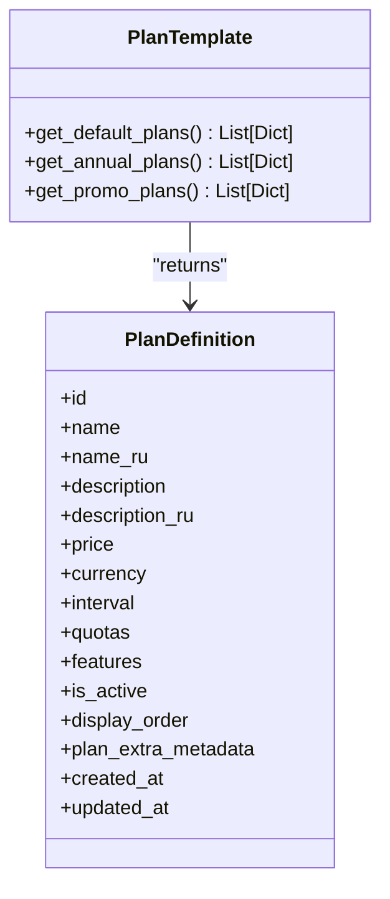
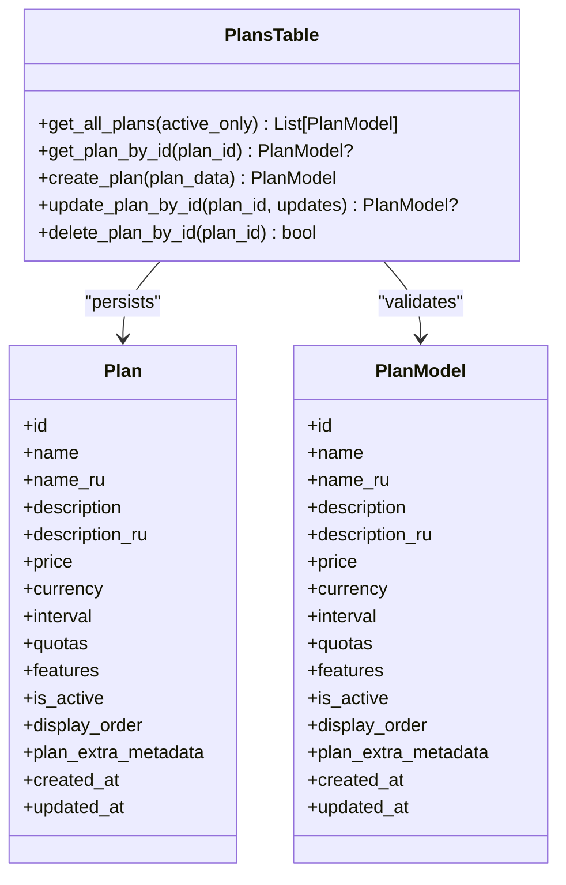
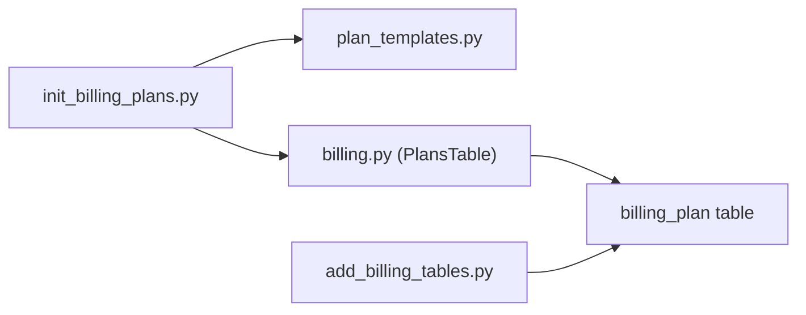

# Billing Plan Initialization

<cite>
**Referenced Files in This Document**
- [init_billing_plans.py](file://backend/scripts/init_billing_plans.py)
- [plan_templates.py](file://backend/open_webui/utils/plan_templates.py)
- [billing.py](file://backend/open_webui/models/billing.py)
- [add_billing_tables.py](file://backend/open_webui/migrations/versions/b2f8a9c1d5e3_add_billing_tables.py)
- [BILLING_SETUP.md](file://BILLING_SETUP.md)
- [admin_billing.py](file://backend/open_webui/routers/admin_billing.py)
- [billing.py](file://backend/open_webui/routers/billing.py)
</cite>

## Table of Contents
1. [Introduction](#introduction)
2. [Project Structure](#project-structure)
3. [Core Components](#core-components)
4. [Architecture Overview](#architecture-overview)
5. [Detailed Component Analysis](#detailed-component-analysis)
6. [Dependency Analysis](#dependency-analysis)
7. [Performance Considerations](#performance-considerations)
8. [Troubleshooting Guide](#troubleshooting-guide)
9. [Conclusion](#conclusion)
10. [Appendices](#appendices)

## Introduction
This document explains the Billing Plan Initialization system used to populate the database with predefined billing plans. It covers the init script’s command-line interface, the template-driven plan definitions, the database persistence layer, and the logic for handling existing plans (skip/update/overwrite). It also documents error handling, idempotency considerations, and provides usage examples and deployment scenarios.

## Project Structure
The Billing Plan Initialization spans three main areas:
- CLI script that orchestrates plan creation/update
- Template module that defines default, annual, and promotional plan sets
- ORM and persistence layer that writes plans to the database



**Diagram sources**
- [init_billing_plans.py](file://backend/scripts/init_billing_plans.py#L1-L120)
- [plan_templates.py](file://backend/open_webui/utils/plan_templates.py#L1-L305)
- [billing.py](file://backend/open_webui/models/billing.py#L297-L349)
- [add_billing_tables.py](file://backend/open_webui/migrations/versions/b2f8a9c1d5e3_add_billing_tables.py#L18-L39)

**Section sources**
- [init_billing_plans.py](file://backend/scripts/init_billing_plans.py#L1-L120)
- [plan_templates.py](file://backend/open_webui/utils/plan_templates.py#L1-L305)
- [billing.py](file://backend/open_webui/models/billing.py#L297-L349)
- [add_billing_tables.py](file://backend/open_webui/migrations/versions/b2f8a9c1d5e3_add_billing_tables.py#L18-L39)

## Core Components
- CLI script: Parses arguments and drives plan creation/update logic.
- Template module: Supplies plan definitions for default, annual, and promotional tiers.
- ORM layer: Provides CRUD operations against the billing_plan table.
- Migration: Creates the billing_plan table and indexes.

Key responsibilities:
- CLI orchestrates plan creation/update based on flags.
- Templates define plan metadata, quotas, features, and pricing.
- ORM persists plan records and supports lookup/update/delete.
- Migration ensures the billing_plan table exists.

**Section sources**
- [init_billing_plans.py](file://backend/scripts/init_billing_plans.py#L29-L119)
- [plan_templates.py](file://backend/open_webui/utils/plan_templates.py#L10-L181)
- [plan_templates.py](file://backend/open_webui/utils/plan_templates.py#L184-L223)
- [plan_templates.py](file://backend/open_webui/utils/plan_templates.py#L225-L305)
- [billing.py](file://backend/open_webui/models/billing.py#L297-L349)
- [add_billing_tables.py](file://backend/open_webui/migrations/versions/b2f8a9c1d5e3_add_billing_tables.py#L18-L39)

## Architecture Overview
The initialization process follows a straightforward pipeline: collect plan definitions from templates, iterate over them, and persist to the database while handling existing records.

```mermaid
sequenceDiagram
participant User as "Operator"
participant CLI as "init_billing_plans.py"
participant TPL as "plan_templates.py"
participant ORM as "billing.py (PlansTable)"
participant DB as "billing_plan table"
User->>CLI : Run script with flags
CLI->>TPL : get_default_plans()
alt include annual
CLI->>TPL : get_annual_plans()
end
alt include promo
CLI->>TPL : get_promo_plans()
end
loop For each plan
CLI->>ORM : get_plan_by_id(id)
alt exists and force
CLI->>ORM : update_plan_by_id(id, plan_data)
ORM->>DB : UPDATE
opt exists and not force
CLI-->>User : Skip existing plan
end
opt not exists
CLI->>ORM : create_plan(plan_data)
ORM->>DB : INSERT
end
end
CLI-->>User : Print summary
```

**Diagram sources**
- [init_billing_plans.py](file://backend/scripts/init_billing_plans.py#L29-L75)
- [plan_templates.py](file://backend/open_webui/utils/plan_templates.py#L10-L181)
- [plan_templates.py](file://backend/open_webui/utils/plan_templates.py#L184-L223)
- [plan_templates.py](file://backend/open_webui/utils/plan_templates.py#L225-L305)
- [billing.py](file://backend/open_webui/models/billing.py#L310-L338)
- [add_billing_tables.py](file://backend/open_webui/migrations/versions/b2f8a9c1d5e3_add_billing_tables.py#L18-L39)

## Detailed Component Analysis

### CLI Script: init_billing_plans.py
- Purpose: Initialize billing plans from templates and handle existing records.
- Command-line options:
  - --include-annual: Include annual plan variants (20% discount).
  - --include-promo: Include promotional plans (e.g., seasonal offers).
  - --force: Overwrite existing plans with template data.
- Behavior:
  - Collects plan definitions from templates.
  - Iterates over each plan:
    - If existing and force: update the record.
    - Else if existing and not force: skip.
    - Else: create a new record.
  - Prints a summary of created/updated/skipped totals.
- Error handling:
  - Catches exceptions during initialization and prints a stack trace, returning a non-zero exit code.



**Diagram sources**
- [init_billing_plans.py](file://backend/scripts/init_billing_plans.py#L29-L75)

**Section sources**
- [init_billing_plans.py](file://backend/scripts/init_billing_plans.py#L29-L119)

### Template Module: plan_templates.py
- Provides three plan sets:
  - Default plans: free, starter, pro, business, unlimited.
  - Annual plans: starter_annual, pro_annual, business_annual.
  - Promotional plans: seasonal offers with metadata.
- Each plan includes:
  - id, name, localized name, description, localized description
  - price, currency, interval (month/year)
  - quotas (tokens_input, tokens_output, requests) or unlimited
  - features list
  - is_active flag
  - display_order
  - timestamps
  - optional plan_extra_metadata (e.g., promo flags and codes)



**Diagram sources**
- [plan_templates.py](file://backend/open_webui/utils/plan_templates.py#L10-L181)
- [plan_templates.py](file://backend/open_webui/utils/plan_templates.py#L184-L223)
- [plan_templates.py](file://backend/open_webui/utils/plan_templates.py#L225-L305)

**Section sources**
- [plan_templates.py](file://backend/open_webui/utils/plan_templates.py#L10-L181)
- [plan_templates.py](file://backend/open_webui/utils/plan_templates.py#L184-L223)
- [plan_templates.py](file://backend/open_webui/utils/plan_templates.py#L225-L305)

### ORM and Persistence: billing.py (PlansTable)
- Methods used by the script:
  - get_plan_by_id(plan_id): Lookup existing plan by id.
  - create_plan(plan_data): Insert a new plan.
  - update_plan_by_id(plan_id, updates): Update an existing plan.
- The billing_plan table schema includes:
  - id (PK), name, localized name/description, price, currency, interval
  - quotas (JSON), features (JSON)
  - is_active, display_order, plan_extra_metadata (JSON)
  - created_at, updated_at



**Diagram sources**
- [billing.py](file://backend/open_webui/models/billing.py#L297-L349)
- [billing.py](file://backend/open_webui/models/billing.py#L54-L105)

**Section sources**
- [billing.py](file://backend/open_webui/models/billing.py#L297-L349)
- [billing.py](file://backend/open_webui/models/billing.py#L54-L105)

### Database Migration: add_billing_tables.py
- Creates the billing_plan table with appropriate columns and constraints.
- Ensures id uniqueness and indexes for efficient lookups.

**Section sources**
- [add_billing_tables.py](file://backend/open_webui/migrations/versions/b2f8a9c1d5e3_add_billing_tables.py#L18-L39)

## Dependency Analysis
- The CLI depends on:
  - Template module for plan definitions
  - ORM layer for database operations
- The ORM layer depends on:
  - SQLAlchemy models and database connection utilities
  - Alembic migration for schema creation
- The template module is independent and pure data.



**Diagram sources**
- [init_billing_plans.py](file://backend/scripts/init_billing_plans.py#L21-L26)
- [plan_templates.py](file://backend/open_webui/utils/plan_templates.py#L10-L181)
- [billing.py](file://backend/open_webui/models/billing.py#L297-L349)
- [add_billing_tables.py](file://backend/open_webui/migrations/versions/b2f8a9c1d5e3_add_billing_tables.py#L18-L39)

**Section sources**
- [init_billing_plans.py](file://backend/scripts/init_billing_plans.py#L21-L26)
- [billing.py](file://backend/open_webui/models/billing.py#L297-L349)
- [add_billing_tables.py](file://backend/open_webui/migrations/versions/b2f8a9c1d5e3_add_billing_tables.py#L18-L39)

## Performance Considerations
- Single-pass iteration over plan definitions: O(n) with n equal to the number of plans created.
- Each plan operation performs a single lookup and either insert or update.
- No batching is implemented; for very large plan sets, consider adding batch operations at the ORM level.
- Indexes on billing_plan id and timestamps are present in the migration, aiding lookups.

[No sources needed since this section provides general guidance]

## Troubleshooting Guide
Common issues and resolutions:

- Database connectivity problems:
  - Symptom: Exceptions raised during create/update operations.
  - Resolution: Verify database availability and credentials; ensure migrations have been applied.
  - Reference: The ORM uses a database context manager; failures surface as exceptions handled by the CLI.

- Template mismatches:
  - Symptom: Unexpected plan fields or invalid values.
  - Resolution: Ensure plan dictionaries match the PlanModel schema and billing_plan table columns.

- Idempotency concerns:
  - Behavior: Running the script multiple times is safe. With --force, existing plans are overwritten; otherwise, existing plans are skipped.
  - Recommendation: Use --force when templates change and you want to synchronize existing records.

- Error handling:
  - The CLI catches exceptions, prints a stack trace, and exits with a non-zero code. Review logs and fix underlying causes (e.g., database errors, invalid plan data).

- Admin API context:
  - The admin billing endpoints provide plan CRUD and validation rules. While not used by the init script, they inform best practices for plan updates and constraints.

**Section sources**
- [init_billing_plans.py](file://backend/scripts/init_billing_plans.py#L102-L116)
- [billing.py](file://backend/open_webui/models/billing.py#L310-L338)
- [admin_billing.py](file://backend/open_webui/routers/admin_billing.py#L109-L141)

## Conclusion
The Billing Plan Initialization system provides a reliable, idempotent way to seed billing plans from templates. It supports default, annual, and promotional plan sets, handles existing records gracefully, and integrates cleanly with the database schema. Use the CLI flags to tailor plan creation to your environment and rely on the ORM and migration layers for robust persistence.

[No sources needed since this section summarizes without analyzing specific files]

## Appendices

### Command-Line Interface and Options
- --include-annual: Include annual plan variants (20% discount).
- --include-promo: Include promotional plans (e.g., seasonal offers).
- --force: Overwrite existing plans with template data.

**Section sources**
- [init_billing_plans.py](file://backend/scripts/init_billing_plans.py#L77-L90)

### Data Flow from Templates to Database
- Templates supply plan definitions.
- CLI aggregates lists based on flags.
- ORM persists each plan via create_plan or update_plan_by_id.
- Migration ensures the billing_plan table exists.

**Section sources**
- [plan_templates.py](file://backend/open_webui/utils/plan_templates.py#L10-L181)
- [plan_templates.py](file://backend/open_webui/utils/plan_templates.py#L184-L223)
- [plan_templates.py](file://backend/open_webui/utils/plan_templates.py#L225-L305)
- [init_billing_plans.py](file://backend/scripts/init_billing_plans.py#L29-L75)
- [billing.py](file://backend/open_webui/models/billing.py#L310-L338)
- [add_billing_tables.py](file://backend/open_webui/migrations/versions/b2f8a9c1d5e3_add_billing_tables.py#L18-L39)

### Usage Examples and Deployment Scenarios
- Local development:
  - Run the script with defaults to create base plans.
  - Add --include-annual to include annual variants.
  - Add --include-promo to include promotional offers.
  - Use --force to synchronize changes to existing plans.

- Production deployment:
  - Apply migrations before running the script.
  - Seed plans during initial rollout.
  - Re-run with --force after template updates to keep plans synchronized.

- Alternative approaches:
  - Use the admin billing API to create/update plans programmatically.
  - Follow the setup guide for environment configuration and webhook setup.

**Section sources**
- [init_billing_plans.py](file://backend/scripts/init_billing_plans.py#L29-L119)
- [BILLING_SETUP.md](file://BILLING_SETUP.md#L1-L333)
- [admin_billing.py](file://backend/open_webui/routers/admin_billing.py#L159-L200)